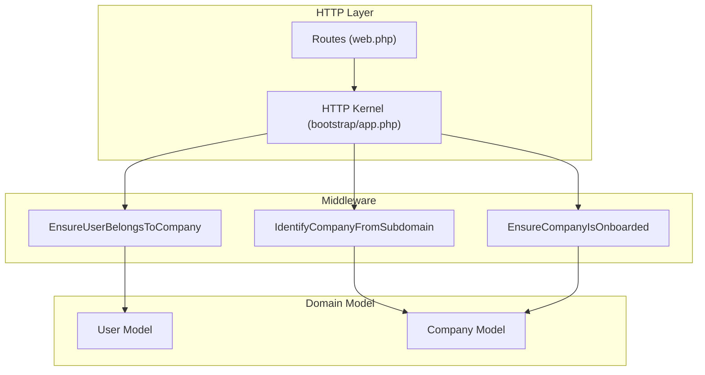
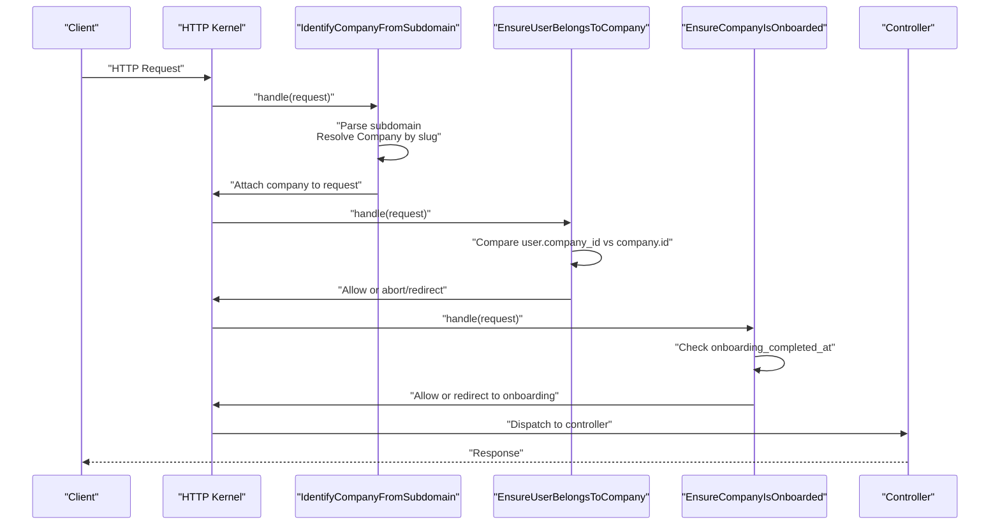
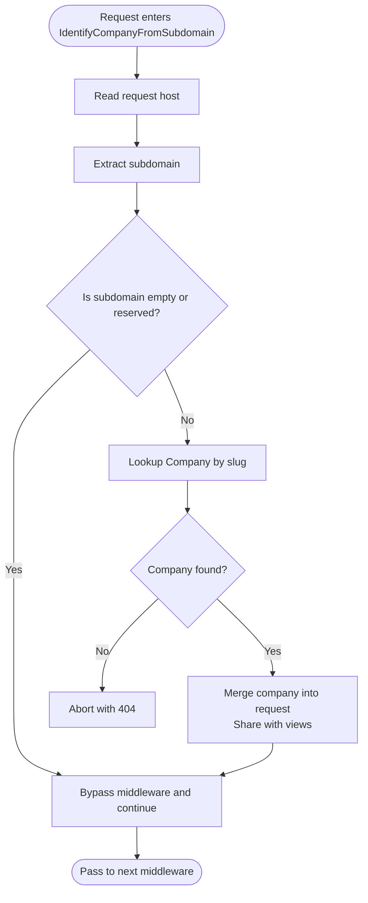
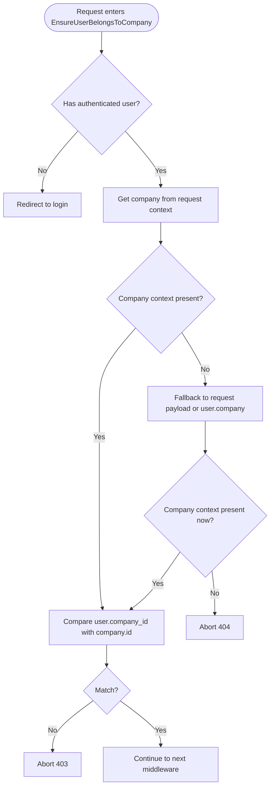
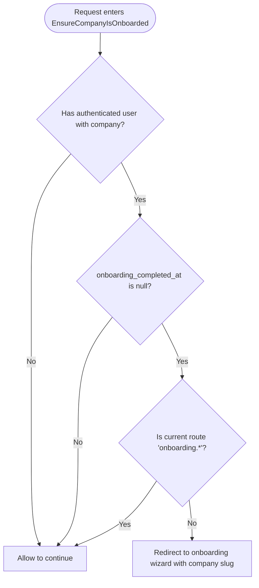
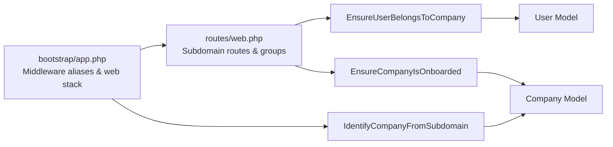

# Company Isolation Middleware

<cite>
**Referenced Files in This Document**
- [IdentifyCompanyFromSubdomain.php](file://app/Http/Middleware/IdentifyCompanyFromSubdomain.php)
- [EnsureUserBelongsToCompany.php](file://app/Http/Middleware/EnsureUserBelongsToCompany.php)
- [EnsureCompanyIsOnboarded.php](file://app/Http/Middleware/EnsureCompanyIsOnboarded.php)
- [app.php](file://bootstrap/app.php)
- [web.php](file://routes/web.php)
- [Company.php](file://app/Models/Company.php)
- [User.php](file://app/Models/User.php)
- [2026_02_01_224200_create_companies_table.php](file://database/migrations/2026_02_01_224200_create_companies_table.php)
</cite>

## Table of Contents
1. [Introduction](#introduction)
2. [Project Structure](#project-structure)
3. [Core Components](#core-components)
4. [Architecture Overview](#architecture-overview)
5. [Detailed Component Analysis](#detailed-component-analysis)
6. [Dependency Analysis](#dependency-analysis)
7. [Performance Considerations](#performance-considerations)
8. [Security Considerations](#security-considerations)
9. [Troubleshooting Guide](#troubleshooting-guide)
10. [Conclusion](#conclusion)

## Introduction
This document explains the multi-company isolation middleware that ensures strict data separation between companies in a multi-tenant helpdesk system. It covers three middleware components:
- IdentifyCompanyFromSubdomain: Extracts company context from the URL subdomain and attaches it to the request.
- EnsureUserBelongsToCompany: Validates that the authenticated user belongs to the requested company.
- EnsureCompanyIsOnboarded: Enforces company activation by redirecting uncompleted onboarding flows.

It also documents middleware execution order, company context propagation, edge cases, performance implications, and security considerations for robust tenant isolation.

## Project Structure
The middleware and routing configuration are organized as follows:
- Middleware classes under app/Http/Middleware
- Route definitions under routes/web.php
- Middleware alias registration under bootstrap/app.php
- Eloquent models for Company and User under app/Models
- Companies table schema under database/migrations

**Diagram sources**
- [web.php:71-114](file://routes/web.php#L71-L114)
- [app.php:20-30](file://bootstrap/app.php#L20-L30)
- [IdentifyCompanyFromSubdomain.php:12-36](file://app/Http/Middleware/IdentifyCompanyFromSubdomain.php#L12-L36)
- [EnsureUserBelongsToCompany.php:11-37](file://app/Http/Middleware/EnsureUserBelongsToCompany.php#L11-L37)
- [EnsureCompanyIsOnboarded.php:16-26](file://app/Http/Middleware/EnsureCompanyIsOnboarded.php#L16-L26)
- [User.php:74-77](file://app/Models/User.php#L74-L77)
- [Company.php:14-17](file://app/Models/Company.php#L14-L17)

**Section sources**
- [web.php:71-114](file://routes/web.php#L71-L114)
- [app.php:20-30](file://bootstrap/app.php#L20-L30)

## Core Components
- IdentifyCompanyFromSubdomain: Parses the host, extracts the subdomain, resolves the company by slug, and attaches the company object to the request and shares it with views.
- EnsureUserBelongsToCompany: Ensures the authenticated user’s company matches the resolved company context; otherwise blocks access.
- EnsureCompanyIsOnboarded: Redirects users to the onboarding wizard if the company’s onboarding is incomplete.

**Section sources**
- [IdentifyCompanyFromSubdomain.php:12-36](file://app/Http/Middleware/IdentifyCompanyFromSubdomain.php#L12-L36)
- [EnsureUserBelongsToCompany.php:11-37](file://app/Http/Middleware/EnsureUserBelongsToCompany.php#L11-L37)
- [EnsureCompanyIsOnboarded.php:16-26](file://app/Http/Middleware/EnsureCompanyIsOnboarded.php#L16-L26)

## Architecture Overview
The middleware pipeline enforces tenant isolation per-request:
- IdentifyCompanyFromSubdomain runs early in the web middleware stack to establish company context.
- EnsureUserBelongsToCompany validates the authenticated user against the company context.
- EnsureCompanyIsOnboarded gates access to the main dashboard until onboarding completes.

**Diagram sources**
- [app.php:28-29](file://bootstrap/app.php#L28-L29)
- [IdentifyCompanyFromSubdomain.php:12-36](file://app/Http/Middleware/IdentifyCompanyFromSubdomain.php#L12-L36)
- [EnsureUserBelongsToCompany.php:11-37](file://app/Http/Middleware/EnsureUserBelongsToCompany.php#L11-L37)
- [EnsureCompanyIsOnboarded.php:16-26](file://app/Http/Middleware/EnsureCompanyIsOnboarded.php#L16-L26)
- [web.php:71-114](file://routes/web.php#L71-L114)

## Detailed Component Analysis

### IdentifyCompanyFromSubdomain Middleware
Purpose:
- Extract company context from the subdomain portion of the host.
- Attach the resolved company to the request attributes and share it with views.

Key behaviors:
- Skips processing for main domains or reserved prefixes (e.g., www, api).
- Resolves company by slug via the Company model.
- Merges company into request payload and shares it globally for views.

Edge cases:
- Missing or invalid subdomain leads to immediate termination with a 404.
- Non-existent company slug triggers a 404.

**Diagram sources**
- [IdentifyCompanyFromSubdomain.php:12-36](file://app/Http/Middleware/IdentifyCompanyFromSubdomain.php#L12-L36)

**Section sources**
- [IdentifyCompanyFromSubdomain.php:12-36](file://app/Http/Middleware/IdentifyCompanyFromSubdomain.php#L12-L36)
- [Company.php:14-17](file://app/Models/Company.php#L14-L17)

### EnsureUserBelongsToCompany Middleware
Purpose:
- Enforce that the authenticated user belongs to the company extracted from the subdomain.

Key behaviors:
- Requires an authenticated user; otherwise redirects to login.
- Retrieves company from request attributes or falls back to request payload or user relationship.
- Compares user.company_id with the resolved company id; denies access if mismatched.

Edge cases:
- No authenticated user: redirect to login.
- No company context: 404.
- User not belonging to company: 403.

**Diagram sources**
- [EnsureUserBelongsToCompany.php:11-37](file://app/Http/Middleware/EnsureUserBelongsToCompany.php#L11-L37)
- [User.php:74-77](file://app/Models/User.php#L74-L77)

**Section sources**
- [EnsureUserBelongsToCompany.php:11-37](file://app/Http/Middleware/EnsureUserBelongsToCompany.php#L11-L37)
- [User.php:74-77](file://app/Models/User.php#L74-L77)

### EnsureCompanyIsOnboarded Middleware
Purpose:
- Gate access to the main dashboard until the company completes onboarding.

Key behaviors:
- Checks if the user is authenticated and the company’s onboarding flag is incomplete.
- Prevents redirect loops by excluding onboarding routes from redirection.
- Redirects to the onboarding wizard with the company slug.

Edge cases:
- Already on onboarding routes: allow progression.
- No user or company: pass through (handled upstream).

**Diagram sources**
- [EnsureCompanyIsOnboarded.php:16-26](file://app/Http/Middleware/EnsureCompanyIsOnboarded.php#L16-L26)

**Section sources**
- [EnsureCompanyIsOnboarded.php:16-26](file://app/Http/Middleware/EnsureCompanyIsOnboarded.php#L16-L26)

## Dependency Analysis
- Middleware registration and ordering:
  - IdentifyCompanyFromSubdomain is appended to the web middleware stack.
  - Aliases define company.access and company.is_onboarded for route grouping.
- Route grouping:
  - Subdomain-scoped routes apply auth, company.access, verified, and optionally company.is_onboarded.
- Model relationships:
  - User belongs to Company via company_id.
  - Company has multiple Users and other related entities.

**Diagram sources**
- [app.php:20-30](file://bootstrap/app.php#L20-L30)
- [web.php:71-114](file://routes/web.php#L71-L114)
- [EnsureUserBelongsToCompany.php:11-37](file://app/Http/Middleware/EnsureUserBelongsToCompany.php#L11-L37)
- [EnsureCompanyIsOnboarded.php:16-26](file://app/Http/Middleware/EnsureCompanyIsOnboarded.php#L16-L26)
- [IdentifyCompanyFromSubdomain.php:12-36](file://app/Http/Middleware/IdentifyCompanyFromSubdomain.php#L12-L36)
- [User.php:74-77](file://app/Models/User.php#L74-L77)
- [Company.php:14-17](file://app/Models/Company.php#L14-L17)

**Section sources**
- [app.php:20-30](file://bootstrap/app.php#L20-L30)
- [web.php:71-114](file://routes/web.php#L71-L114)
- [User.php:74-77](file://app/Models/User.php#L74-L77)
- [Company.php:14-17](file://app/Models/Company.php#L14-L17)

## Performance Considerations
- Subdomain parsing and company lookup:
  - Minimal overhead; performed once per request.
  - Company slug is indexed in the schema, enabling efficient lookups.
- Request context merging:
  - Attaching company to the request and sharing with views is lightweight.
- Caching:
  - Consider caching company metadata per subdomain if traffic is high.
- Redirects:
  - Early exits (login redirect, onboarding redirect) avoid unnecessary downstream processing.

[No sources needed since this section provides general guidance]

## Security Considerations
- Tenant isolation:
  - EnsureUserBelongsToCompany acts as a gatekeeper; any bypass or misconfiguration allows cross-company access.
- Subdomain trust:
  - Treat subdomains as the authoritative tenant identifier; avoid trusting URL parameters alone.
- Onboarding gating:
  - EnsureCompanyIsOnboarded prevents access to production dashboards until onboarding is complete.
- Authentication prerequisites:
  - All company-scoped routes require authentication and email verification to prevent unauthorized access.

[No sources needed since this section provides general guidance]

## Troubleshooting Guide
Common issues and resolutions:
- 404 “Company not found” during subdomain resolution:
  - Verify the subdomain matches a company slug and that the company exists.
  - Confirm the domain configuration aligns with the application’s domain setting.
- 403 “You do not have access to this company”:
  - Ensure the authenticated user belongs to the company identified by the subdomain.
  - Check user.company_id and company.id alignment.
- Redirect loop to onboarding:
  - Confirm the request is not already on an onboarding route.
  - Ensure onboarding_completed_at is properly set when onboarding finishes.
- Missing company context:
  - Validate that IdentifyCompanyFromSubdomain is included in the web middleware stack.
  - Confirm the request host includes a valid subdomain and is not reserved (www, api).

**Section sources**
- [IdentifyCompanyFromSubdomain.php:12-36](file://app/Http/Middleware/IdentifyCompanyFromSubdomain.php#L12-L36)
- [EnsureUserBelongsToCompany.php:11-37](file://app/Http/Middleware/EnsureUserBelongsToCompany.php#L11-L37)
- [EnsureCompanyIsOnboarded.php:16-26](file://app/Http/Middleware/EnsureCompanyIsOnboarded.php#L16-L26)

## Conclusion
The multi-company isolation middleware establishes a robust, layered defense for tenant separation:
- IdentifyCompanyFromSubdomain establishes the tenant boundary from the URL.
- EnsureUserBelongsToCompany enforces user-company membership.
- EnsureCompanyIsOnboarded ensures operational readiness before granting access to core features.

Together, they provide predictable middleware execution order, clear context propagation, and strong safeguards against cross-tenant access.