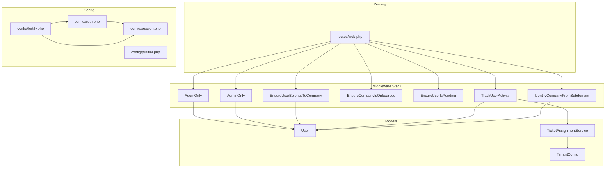
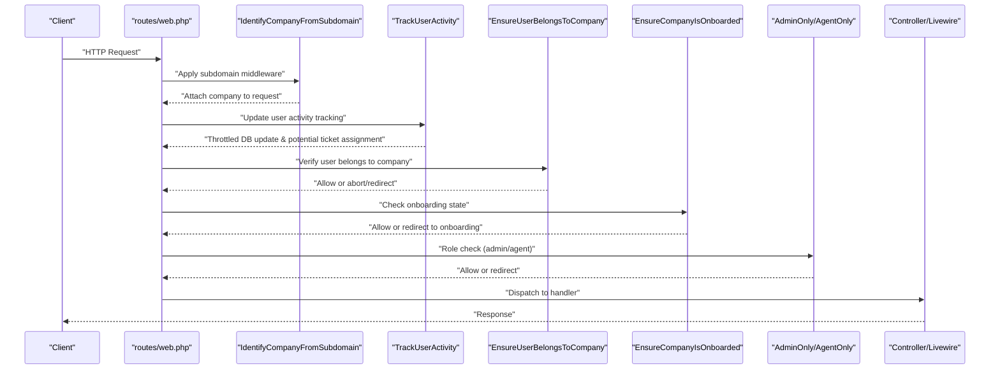
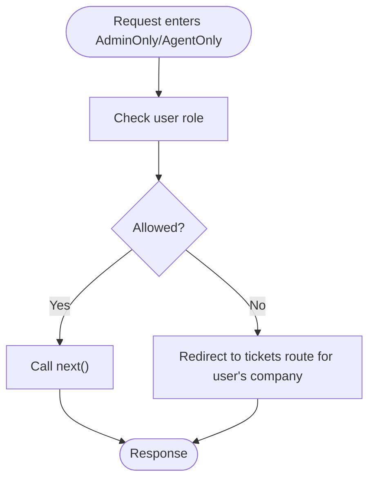
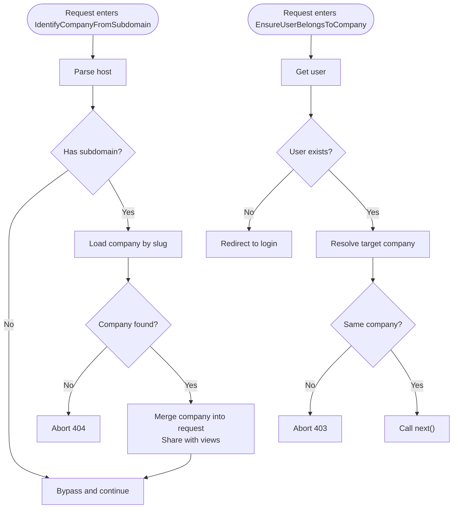
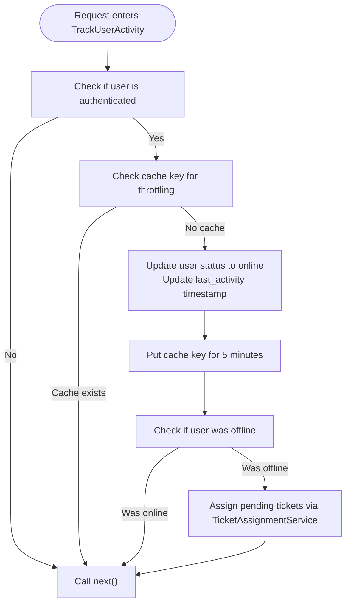
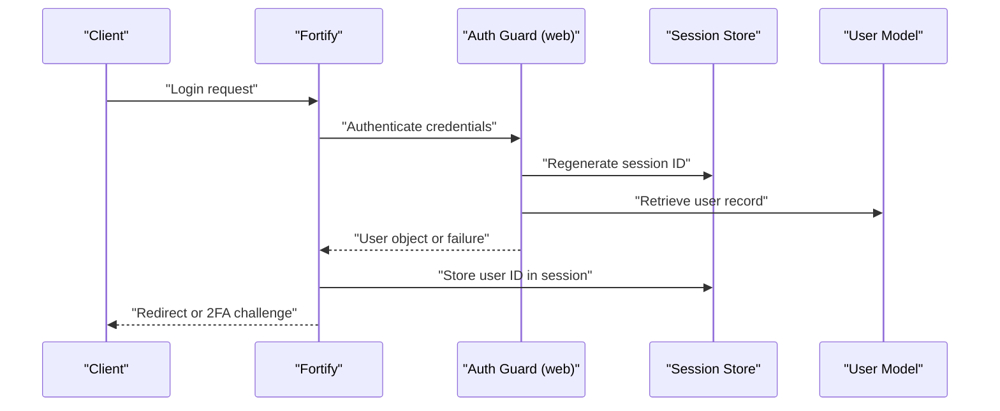
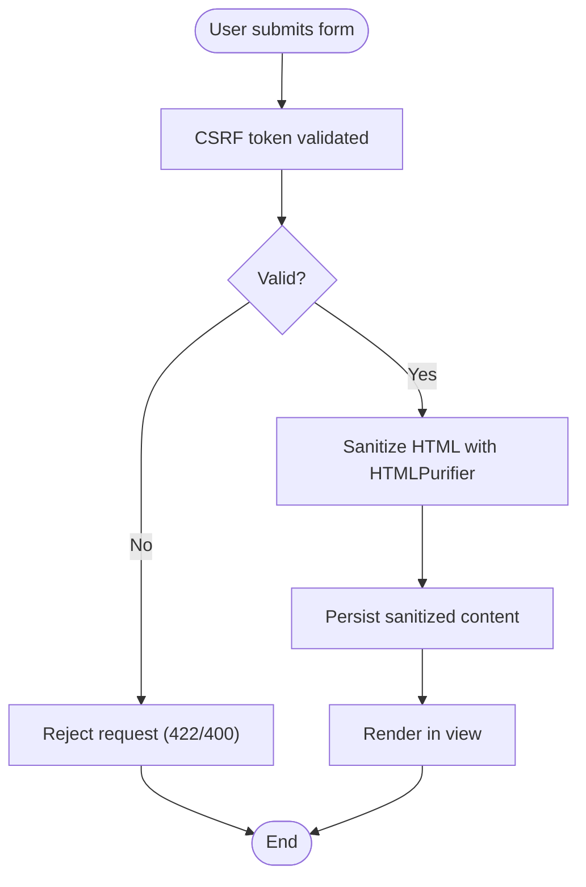
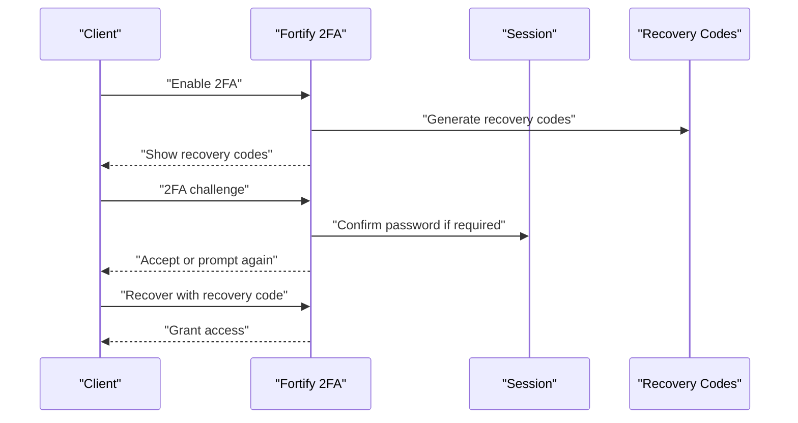
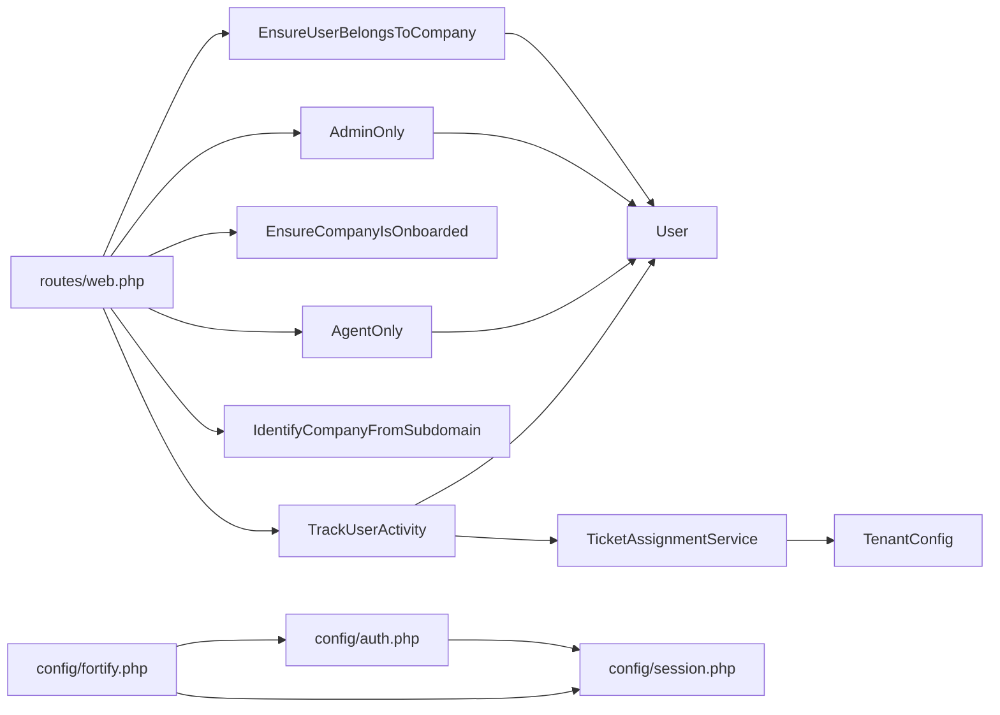

# Middleware & Security

<cite>
**Referenced Files in This Document**
- [AdminOnly.php](file://app/Http/Middleware/AdminOnly.php)
- [AgentOnly.php](file://app/Http/Middleware/AgentOnly.php)
- [EnsureUserBelongsToCompany.php](file://app/Http/Middleware/EnsureUserBelongsToCompany.php)
- [EnsureCompanyIsOnboarded.php](file://app/Http/Middleware/EnsureCompanyIsOnboarded.php)
- [EnsureUserIsPending.php](file://app/Http/Middleware/EnsureUserIsPending.php)
- [IdentifyCompanyFromSubdomain.php](file://app/Http/Middleware/IdentifyCompanyFromSubdomain.php)
- [TrackUserActivity.php](file://app/Http/Middleware/TrackUserActivity.php)
- [web.php](file://routes/web.php)
- [auth.php](file://config/auth.php)
- [session.php](file://config/session.php)
- [fortify.php](file://config/fortify.php)
- [purifier.php](file://config/purifier.php)
- [User.php](file://app/Models/User.php)
- [TicketAssignmentService.php](file://app/Services/TicketAssignmentService.php)
- [TenantConfig.php](file://app/Models/TenantConfig.php)
- [MarkInactiveUsers.php](file://app/Console/Commands/MarkInactiveUsers.php)
- [bootstrap/app.php](file://bootstrap/app.php)
- [providers.php](file://bootstrap/providers.php)
- [AppServiceProvider.php](file://app/Providers/AppServiceProvider.php)
- [FortifyServiceProvider.php](file://app/Providers/FortifyServiceProvider.php)
</cite>

## Update Summary
**Changes Made**
- Added comprehensive documentation for TrackUserActivity middleware and its role in user activity tracking
- Enhanced authentication system documentation to include personal access tokens and tenant configuration support
- Updated middleware architecture to reflect the new TrackUserActivity middleware placement in the middleware stack
- Added documentation for tenant configuration management and its impact on user activity tracking
- Expanded security considerations to include activity monitoring and automated user status management

## Table of Contents
1. [Introduction](#introduction)
2. [Project Structure](#project-structure)
3. [Core Components](#core-components)
4. [Architecture Overview](#architecture-overview)
5. [Detailed Component Analysis](#detailed-component-analysis)
6. [Dependency Analysis](#dependency-analysis)
7. [Performance Considerations](#performance-considerations)
8. [Troubleshooting Guide](#troubleshooting-guide)
9. [Conclusion](#conclusion)
10. [Appendices](#appendices)

## Introduction
This document explains the middleware stack and security implementation of the Helpdesk System. It focuses on role-based access control (RBAC) with AdminOnly and AgentOnly guards, company isolation enforcement, authentication and session management, CSRF protection, input validation, and XSS prevention via HTML purification. It also documents two-factor authentication (2FA) middleware and recovery mechanisms, user activity tracking through the TrackUserActivity middleware, and provides practical guidance for creating custom middleware, extending security policies, and adding additional security layers.

## Project Structure
Security and middleware logic is primarily implemented in dedicated middleware classes under app/Http/Middleware and applied in routes/web.php. Authentication and session configuration live in config/*. Fortify integrates authentication features and rate limiting. HTML sanitization is configured via config/purifier.php. User roles and 2FA capabilities are modeled in the User model. The TrackUserActivity middleware provides comprehensive user activity tracking and automated ticket assignment.

**Diagram sources**
- [web.php:71-114](file://routes/web.php#L71-L114)
- [bootstrap/app.php:25-28](file://bootstrap/app.php#L25-L28)
- [IdentifyCompanyFromSubdomain.php:12-36](file://app/Http/Middleware/IdentifyCompanyFromSubdomain.php#L12-L36)
- [TrackUserActivity.php:12-46](file://app/Http/Middleware/TrackUserActivity.php#L12-L46)
- [EnsureUserBelongsToCompany.php:11-37](file://app/Http/Middleware/EnsureUserBelongsToCompany.php#L11-L37)
- [EnsureCompanyIsOnboarded.php:16-26](file://app/Http/Middleware/EnsureCompanyIsOnboarded.php#L16-L26)
- [EnsureUserIsPending.php:16-24](file://app/Http/Middleware/EnsureUserIsPending.php#L16-L24)
- [AdminOnly.php:16-23](file://app/Http/Middleware/AdminOnly.php#L16-L23)
- [AgentOnly.php:16-23](file://app/Http/Middleware/AgentOnly.php#L16-L23)
- [auth.php:38-43](file://config/auth.php#L38-L43)
- [session.php:21-218](file://config/session.php#L21-L218)
- [fortify.php:18-120](file://config/fortify.php#L18-L120)
- [purifier.php:20-108](file://config/purifier.php#L20-L108)
- [User.php:13-15](file://app/Models/User.php#L13-L15)
- [TicketAssignmentService.php:14-331](file://app/Services/TicketAssignmentService.php#L14-L331)
- [TenantConfig.php:8-34](file://app/Models/TenantConfig.php#L8-L34)

**Section sources**
- [web.php:11-117](file://routes/web.php#L11-L117)
- [bootstrap/app.php:15-32](file://bootstrap/app.php#L15-L32)
- [IdentifyCompanyFromSubdomain.php:1-54](file://app/Http/Middleware/IdentifyCompanyFromSubdomain.php#L1-L54)
- [TrackUserActivity.php:1-47](file://app/Http/Middleware/TrackUserActivity.php#L1-L47)
- [EnsureUserBelongsToCompany.php:1-39](file://app/Http/Middleware/EnsureUserBelongsToCompany.php#L1-L39)
- [EnsureCompanyIsOnboarded.php:1-28](file://app/Http/Middleware/EnsureCompanyIsOnboarded.php#L1-L28)
- [EnsureUserIsPending.php:1-25](file://app/Http/Middleware/EnsureUserIsPending.php#L1-L25)
- [AdminOnly.php:1-25](file://app/Http/Middleware/AdminOnly.php#L1-L25)
- [AgentOnly.php:1-25](file://app/Http/Middleware/AgentOnly.php#L1-L25)
- [auth.php:1-116](file://config/auth.php#L1-L116)
- [session.php:1-218](file://config/session.php#L1-L218)
- [fortify.php:1-158](file://config/fortify.php#L1-L158)
- [purifier.php:1-108](file://config/purifier.php#L1-L108)
- [User.php:1-137](file://app/Models/User.php#L1-L137)
- [TicketAssignmentService.php:1-331](file://app/Services/TicketAssignmentService.php#L1-L331)
- [TenantConfig.php:1-34](file://app/Models/TenantConfig.php#L1-L34)

## Core Components
- Role-based access control:
  - AdminOnly middleware enforces admin-only access to administrative dashboards.
  - AgentOnly middleware restricts agent/operator access to agent dashboards.
- Company isolation:
  - IdentifyCompanyFromSubdomain extracts the company from the subdomain and attaches it to the request.
  - EnsureUserBelongsToCompany verifies the authenticated user belongs to the requested company.
  - EnsureCompanyIsOnboarded redirects unonboarded companies to the onboarding wizard.
  - EnsureUserIsPending enforces pending user flows (e.g., set-password).
- User activity tracking:
  - TrackUserActivity middleware updates user activity timestamps on every request with throttling to prevent database spam.
  - Automatically assigns pending tickets when operators come online.
  - Integrates with TenantConfig for maximum tickets per agent limits.
- Authentication and session:
  - config/auth.php defines the session-based guard and user provider.
  - config/session.php controls cookie attributes, lifetime, and security flags.
  - config/fortify.php enables 2FA, rate limiters, and view generation.
- Input safety:
  - config/purifier.php configures HTMLPurifier to sanitize user-generated content and prevent XSS.

**Section sources**
- [AdminOnly.php:16-23](file://app/Http/Middleware/AdminOnly.php#L16-L23)
- [AgentOnly.php:16-23](file://app/Http/Middleware/AgentOnly.php#L16-L23)
- [IdentifyCompanyFromSubdomain.php:12-36](file://app/Http/Middleware/IdentifyCompanyFromSubdomain.php#L12-L36)
- [TrackUserActivity.php:16-46](file://app/Http/Middleware/TrackUserActivity.php#L16-L46)
- [EnsureUserBelongsToCompany.php:11-37](file://app/Http/Middleware/EnsureUserBelongsToCompany.php#L11-L37)
- [EnsureCompanyIsOnboarded.php:16-26](file://app/Http/Middleware/EnsureCompanyIsOnboarded.php#L16-L26)
- [EnsureUserIsPending.php:16-24](file://app/Http/Middleware/EnsureUserIsPending.php#L16-L24)
- [auth.php:38-43](file://config/auth.php#L38-L43)
- [session.php:21-218](file://config/session.php#L21-L218)
- [fortify.php:18-120](file://config/fortify.php#L18-L120)
- [purifier.php:20-108](file://config/purifier.php#L20-L108)

## Architecture Overview
The middleware stack is applied per subdomain company context. Requests enter via routes/web.php, pass through subdomain identification, user activity tracking, company access checks, onboarding gating, and finally role-based access control before reaching controllers or Livewire components.

**Diagram sources**
- [web.php:71-114](file://routes/web.php#L71-L114)
- [bootstrap/app.php:25-28](file://bootstrap/app.php#L25-L28)
- [IdentifyCompanyFromSubdomain.php:12-36](file://app/Http/Middleware/IdentifyCompanyFromSubdomain.php#L12-L36)
- [TrackUserActivity.php:21-46](file://app/Http/Middleware/TrackUserActivity.php#L21-L46)
- [EnsureUserBelongsToCompany.php:11-37](file://app/Http/Middleware/EnsureUserBelongsToCompany.php#L11-L37)
- [EnsureCompanyIsOnboarded.php:16-26](file://app/Http/Middleware/EnsureCompanyIsOnboarded.php#L16-L26)
- [AdminOnly.php:16-23](file://app/Http/Middleware/AdminOnly.php#L16-L23)
- [AgentOnly.php:16-23](file://app/Http/Middleware/AgentOnly.php#L16-L23)

## Detailed Component Analysis

### Role-Based Access Control: AdminOnly and AgentOnly
- AdminOnly:
  - Blocks non-admin users from administrative routes.
  - Redirects unauthorized users to the tickets page for their company.
- AgentOnly:
  - Restricts access to agent/operator dashboards.
  - Redirects unauthorized users to the tickets page for their company.

**Diagram sources**
- [AdminOnly.php:16-23](file://app/Http/Middleware/AdminOnly.php#L16-L23)
- [AgentOnly.php:16-23](file://app/Http/Middleware/AgentOnly.php#L16-L23)

**Section sources**
- [AdminOnly.php:16-23](file://app/Http/Middleware/AdminOnly.php#L16-L23)
- [AgentOnly.php:16-23](file://app/Http/Middleware/AgentOnly.php#L16-L23)
- [web.php:88-93](file://routes/web.php#L88-L93)

### Company Isolation Middleware
- IdentifyCompanyFromSubdomain:
  - Extracts subdomain from host.
  - Skips for main/www/api subdomains.
  - Loads company by slug and merges it into the request and shares it with views.
- EnsureUserBelongsToCompany:
  - Requires an authenticated user.
  - Resolves target company from request attributes or parameters.
  - Enforces company membership via user.company_id vs company.id.
  - Returns 403 for mismatch or 404 if company not found.

**Diagram sources**
- [IdentifyCompanyFromSubdomain.php:12-36](file://app/Http/Middleware/IdentifyCompanyFromSubdomain.php#L12-L36)
- [EnsureUserBelongsToCompany.php:11-37](file://app/Http/Middleware/EnsureUserBelongsToCompany.php#L11-L37)

**Section sources**
- [IdentifyCompanyFromSubdomain.php:12-36](file://app/Http/Middleware/IdentifyCompanyFromSubdomain.php#L12-L36)
- [EnsureUserBelongsToCompany.php:11-37](file://app/Http/Middleware/EnsureUserBelongsToCompany.php#L11-L37)
- [web.php:71-114](file://routes/web.php#L71-L114)

### User Activity Tracking Middleware
- TrackUserActivity:
  - Updates user activity timestamps on every request with throttling to prevent database spam.
  - Throttles updates to once per minute using cache keys.
  - Automatically assigns pending tickets when operators transition from offline to online status.
  - Integrates with TenantConfig to respect maximum tickets per agent limits.
  - Uses TicketAssignmentService for intelligent ticket assignment logic.

**Diagram sources**
- [TrackUserActivity.php:21-46](file://app/Http/Middleware/TrackUserActivity.php#L21-L46)
- [TicketAssignmentService.php:306-329](file://app/Services/TicketAssignmentService.php#L306-L329)
- [TenantConfig.php:16-33](file://app/Models/TenantConfig.php#L16-L33)

**Section sources**
- [TrackUserActivity.php:16-46](file://app/Http/Middleware/TrackUserActivity.php#L16-L46)
- [bootstrap/app.php:25-28](file://bootstrap/app.php#L25-L28)
- [TicketAssignmentService.php:306-329](file://app/Services/TicketAssignmentService.php#L306-L329)
- [TenantConfig.php:16-33](file://app/Models/TenantConfig.php#L16-L33)

### Authentication Middleware Chain and Session Management
- Authentication guard:
  - Session-based guard "web" with Eloquent provider for User model.
- Session configuration:
  - Driver, lifetime, cookie name/path/domain, secure/http_only/same_site, partitioned cookies.
- Fortify integration:
  - Enables 2FA with confirmation and password confirmation options.
  - Configures rate limiters for login and two-factor challenges.
  - Provides built-in views and routes for registration, password reset, email verification, and 2FA.

**Diagram sources**
- [auth.php:38-43](file://config/auth.php#L38-L43)
- [session.php:21-218](file://config/session.php#L21-L218)
- [fortify.php:18-120](file://config/fortify.php#L18-L120)

**Section sources**
- [auth.php:38-43](file://config/auth.php#L38-L43)
- [session.php:21-218](file://config/session.php#L21-L218)
- [fortify.php:18-120](file://config/fortify.php#L18-L120)

### CSRF Protection, Input Validation, and XSS Prevention
- CSRF protection:
  - Laravel's default CSRF middleware is applied via the "web" middleware group in routes/web.php.
  - Session cookie SameSite policy is configurable; recommended "lax" for cross-site requests.
- Input validation:
  - Use Laravel Form Requests and validation rules for all user inputs.
- XSS prevention:
  - HTMLPurifier is configured to allow a safe subset of HTML tags and attributes.
  - Apply purification when rendering user-generated content in views.

**Diagram sources**
- [session.php:202](file://config/session.php#L202)
- [purifier.php:26-33](file://config/purifier.php#L26-L33)

**Section sources**
- [web.php:21-38](file://routes/web.php#L21-L38)
- [session.php:202](file://config/session.php#L202)
- [purifier.php:26-33](file://config/purifier.php#L26-L33)

### Two-Factor Authentication Middleware and Recovery Mechanisms
- 2FA enabled via Fortify with:
  - Optional password confirmation before enabling 2FA.
  - Rate limiters for two-factor challenges.
- Recovery mechanisms:
  - Users have recovery codes generated during 2FA setup.
  - Recovery codes can be used to regain access if primary 2FA device is unavailable.

**Diagram sources**
- [fortify.php:150-154](file://config/fortify.php#L150-L154)

**Section sources**
- [fortify.php:150-154](file://config/fortify.php#L150-L154)

### Pending User Flow Middleware
- EnsureUserIsPending:
  - Ensures a pending user session exists before allowing access to set-password flow.
  - Redirects to login if the pending session is missing.

**Section sources**
- [EnsureUserIsPending.php:16-24](file://app/Http/Middleware/EnsureUserIsPending.php#L16-L24)
- [web.php:23-25](file://routes/web.php#L23-L25)

### Company Onboarding Gating
- EnsureCompanyIsOnboarded:
  - Redirects unonboarded companies to the onboarding wizard unless already on onboarding routes.

**Section sources**
- [EnsureCompanyIsOnboarded.php:16-26](file://app/Http/Middleware/EnsureCompanyIsOnboarded.php#L16-L26)
- [web.php:75-78](file://routes/web.php#L75-L78)

### Automated User Status Management
- Inactive User Detection:
  - Console command automatically marks users as offline after 5 minutes of inactivity.
  - Bypasses company scoping for global user updates.
  - Updates user status in database and provides feedback on processed users.

**Section sources**
- [MarkInactiveUsers.php:21-36](file://app/Console/Commands/MarkInactiveUsers.php#L21-L36)

## Dependency Analysis
- Routing depends on middleware registration via route groups.
- Middleware depends on the User model for role/company checks.
- TrackUserActivity middleware depends on TicketAssignmentService and TenantConfig for intelligent ticket assignment.
- Session and authentication configuration influence middleware behavior (e.g., redirects, rate limits).
- Fortify provides 2FA and rate limiting that complement middleware.

**Diagram sources**
- [web.php:71-114](file://routes/web.php#L71-L114)
- [bootstrap/app.php:25-28](file://bootstrap/app.php#L25-L28)
- [AdminOnly.php:16-23](file://app/Http/Middleware/AdminOnly.php#L16-L23)
- [AgentOnly.php:16-23](file://app/Http/Middleware/AgentOnly.php#L16-L23)
- [EnsureUserBelongsToCompany.php:11-37](file://app/Http/Middleware/EnsureUserBelongsToCompany.php#L11-L37)
- [IdentifyCompanyFromSubdomain.php:12-36](file://app/Http/Middleware/IdentifyCompanyFromSubdomain.php#L12-L36)
- [TrackUserActivity.php:14-46](file://app/Http/Middleware/TrackUserActivity.php#L14-L46)
- [TicketAssignmentService.php:14-331](file://app/Services/TicketAssignmentService.php#L14-L331)
- [TenantConfig.php:8-34](file://app/Models/TenantConfig.php#L8-L34)
- [auth.php:38-43](file://config/auth.php#L38-L43)
- [session.php:21-218](file://config/session.php#L21-L218)
- [fortify.php:18-120](file://config/fortify.php#L18-L120)

**Section sources**
- [web.php:71-114](file://routes/web.php#L71-L114)
- [bootstrap/app.php:25-28](file://bootstrap/app.php#L25-L28)
- [User.php:13-15](file://app/Models/User.php#L13-L15)
- [auth.php:38-43](file://config/auth.php#L38-L43)
- [session.php:21-218](file://config/session.php#L21-L218)
- [fortify.php:18-120](file://config/fortify.php#L18-L120)

## Performance Considerations
- Prefer database-backed sessions for horizontal scaling and centralized invalidation.
- Use appropriate SameSite and Secure cookie flags to balance security and performance.
- Leverage caching for company-scoped data to reduce repeated joins and queries.
- Keep HTMLPurifier cache warm by enabling finalize and persistent cache path.
- TrackUserActivity middleware uses cache throttling to prevent database spam during frequent requests.
- TenantConfig caching should be considered for maximum tickets per agent lookups.

[No sources needed since this section provides general guidance]

## Troubleshooting Guide
- Unauthorized access to admin/agent dashboards:
  - Verify AdminOnly/AgentOnly middleware is applied to respective routes.
  - Confirm user role is set correctly on the User model.
- Company not found errors:
  - Ensure subdomain matches company slug and IdentifyCompanyFromSubdomain is applied before company checks.
- Forbidden access to company data:
  - Check EnsureUserBelongsToCompany resolves the correct company and compares user.company_id.
- Redirect loops during onboarding:
  - Ensure EnsureCompanyIsOnboarded excludes onboarding routes from redirection.
- Pending user flow failures:
  - Confirm EnsureUserIsPending middleware precedes set-password routes and pending session exists.
- 2FA challenges failing:
  - Review Fortify two-factor limiter and ensure password confirmation is enforced when required.
- User activity tracking issues:
  - Verify TrackUserActivity middleware is registered in bootstrap/app.php.
  - Check cache configuration for proper throttling behavior.
  - Ensure TicketAssignmentService is properly injected and functioning.
- Ticket assignment problems:
  - Verify TenantConfig maximum tickets per agent settings are appropriate.
  - Check that operators meet availability and specialty requirements.
- Inactive user detection failures:
  - Confirm MarkInactiveUsers console command is scheduled and running.
  - Verify database permissions for global user updates bypassing company scopes.

**Section sources**
- [AdminOnly.php:16-23](file://app/Http/Middleware/AdminOnly.php#L16-L23)
- [AgentOnly.php:16-23](file://app/Http/Middleware/AgentOnly.php#L16-L23)
- [EnsureUserBelongsToCompany.php:11-37](file://app/Http/Middleware/EnsureUserBelongsToCompany.php#L11-L37)
- [EnsureCompanyIsOnboarded.php:16-26](file://app/Http/Middleware/EnsureCompanyIsOnboarded.php#L16-L26)
- [EnsureUserIsPending.php:16-24](file://app/Http/Middleware/EnsureUserIsPending.php#L16-L24)
- [IdentifyCompanyFromSubdomain.php:12-36](file://app/Http/Middleware/IdentifyCompanyFromSubdomain.php#L12-L36)
- [TrackUserActivity.php:16-46](file://app/Http/Middleware/TrackUserActivity.php#L16-L46)
- [bootstrap/app.php:25-28](file://bootstrap/app.php#L25-L28)
- [TicketAssignmentService.php:16-21](file://app/Services/TicketAssignmentService.php#L16-L21)
- [TenantConfig.php:30-33](file://app/Models/TenantConfig.php#L30-L33)
- [MarkInactiveUsers.php:26-36](file://app/Console/Commands/MarkInactiveUsers.php#L26-L36)
- [fortify.php:150-154](file://config/fortify.php#L150-L154)

## Conclusion
The middleware stack enforces strict role-based access control and company isolation, backed by robust authentication and session management. The new TrackUserActivity middleware provides comprehensive user activity tracking with intelligent ticket assignment capabilities. Tenant configuration support ensures scalable multi-tenant operations with configurable limits. CSRF protection, input validation, and HTML purification provide layered defense against common vulnerabilities. Fortify's 2FA and rate limiting further strengthen security. Adhering to the documented patterns ensures consistent and secure behavior across the application.

[No sources needed since this section summarizes without analyzing specific files]

## Appendices

### Creating Custom Middleware
- Steps:
  - Create a new middleware class under app/Http/Middleware.
  - Implement the handle method to validate or transform the request.
  - Register the middleware alias in the route middleware array (typically in the Kernel).
  - Apply the middleware to targeted routes or groups.
- Example pattern references:
  - [AdminOnly.php:16-23](file://app/Http/Middleware/AdminOnly.php#L16-L23)
  - [AgentOnly.php:16-23](file://app/Http/Middleware/AgentOnly.php#L16-L23)
  - [TrackUserActivity.php:21-46](file://app/Http/Middleware/TrackUserActivity.php#L21-L46)

**Section sources**
- [AdminOnly.php:16-23](file://app/Http/Middleware/AdminOnly.php#L16-L23)
- [AgentOnly.php:16-23](file://app/Http/Middleware/AgentOnly.php#L16-L23)
- [TrackUserActivity.php:21-46](file://app/Http/Middleware/TrackUserActivity.php#L21-L46)

### Extending Security Policies
- Use gates and policies for resource-level permissions alongside middleware.
- Combine RBAC middleware with authorization gates for fine-grained controls.
- Keep policy logic close to the domain model and reuse across controllers and Livewire components.
- Integrate user activity tracking with custom security policies for behavioral analysis.

[No sources needed since this section provides general guidance]

### Additional Security Layers
- Transport security:
  - Enforce HTTPS and Secure cookies in production.
- Session hardening:
  - Short session lifetimes, explicit SameSite, and httpOnly flags.
- Input hygiene:
  - Validate and sanitize all user inputs; prefer HTMLPurifier for rich text.
- Audit and monitoring:
  - Log authentication events, 2FA attempts, and access denials.
  - Monitor user activity patterns through TrackUserActivity data.
- Automated user management:
  - Implement scheduled tasks for inactive user detection and cleanup.

**Section sources**
- [session.php:172](file://config/session.php#L172)
- [session.php:202](file://config/session.php#L202)
- [session.php:185](file://config/session.php#L185)
- [purifier.php:26-33](file://config/purifier.php#L26-L33)
- [TrackUserActivity.php:16-46](file://app/Http/Middleware/TrackUserActivity.php#L16-L46)
- [MarkInactiveUsers.php:21-36](file://app/Console/Commands/MarkInactiveUsers.php#L21-L36)

### Tenant Configuration Management
- TenantConfig model provides:
  - Plan-based feature enablement and limits management.
  - Maximum tickets per agent configuration for load balancing.
  - Per-company database connection settings for multi-tenancy.
- Integration points:
  - TicketAssignmentService uses TenantConfig for maximum load calculations.
  - TrackUserActivity respects company-specific configuration limits.
  - User activity tracking adapts to company-specific constraints.

**Section sources**
- [TenantConfig.php:16-33](file://app/Models/TenantConfig.php#L16-L33)
- [TicketAssignmentService.php:16-21](file://app/Services/TicketAssignmentService.php#L16-L21)
- [TrackUserActivity.php:38-40](file://app/Http/Middleware/TrackUserActivity.php#L38-L40)