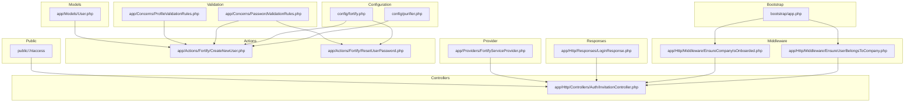
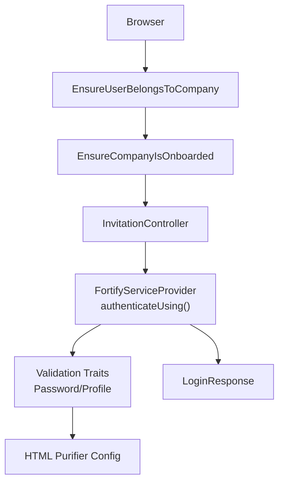
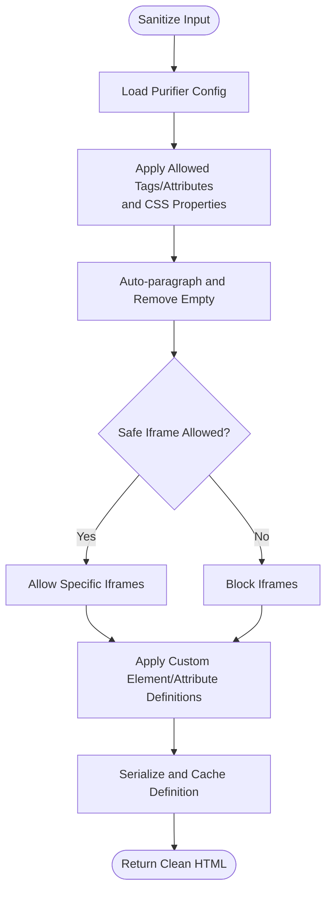
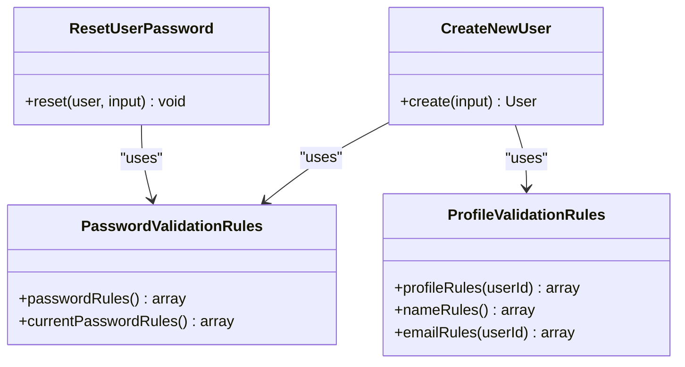
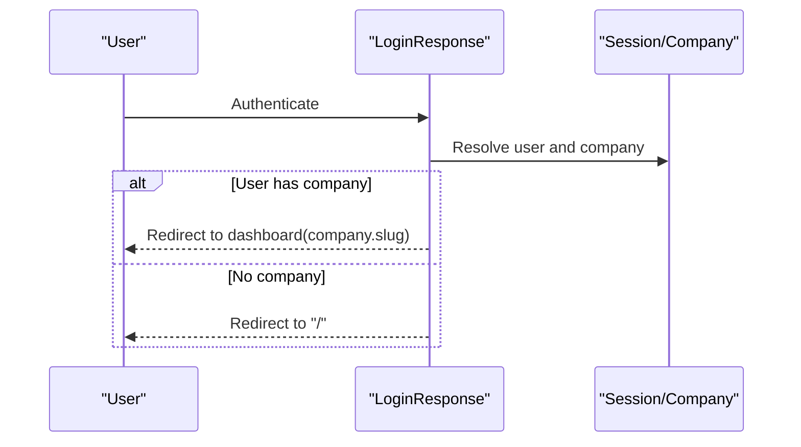
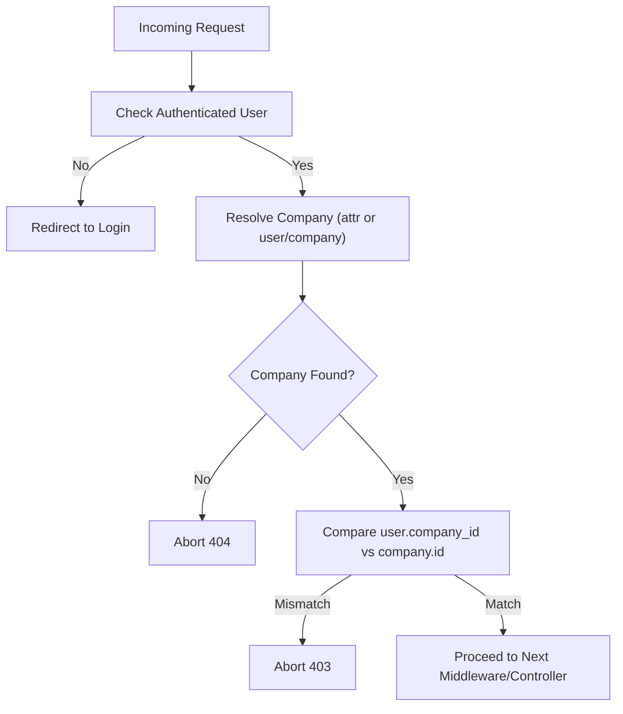
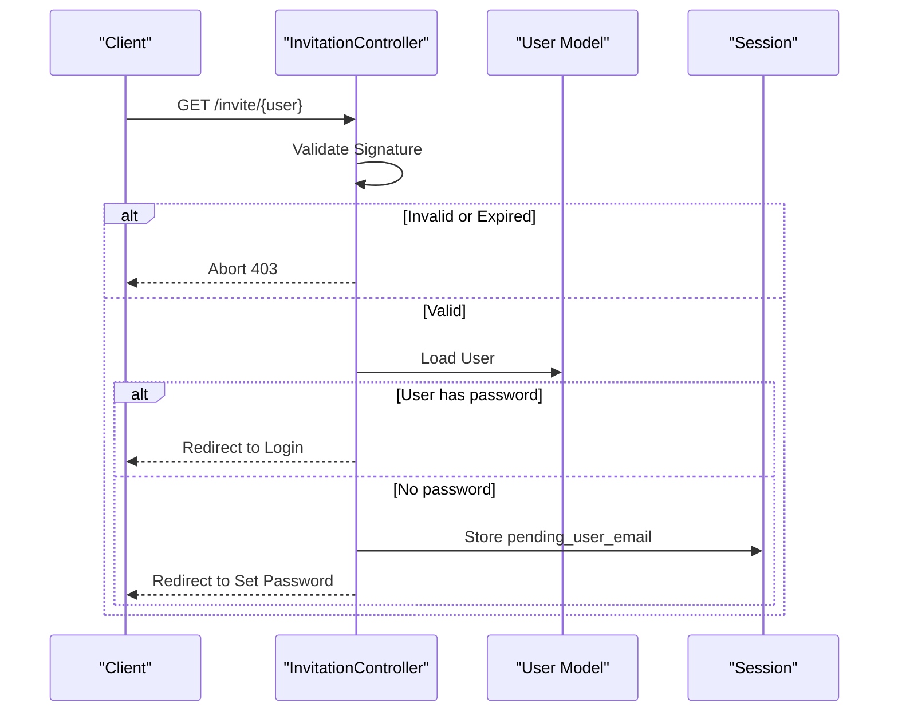
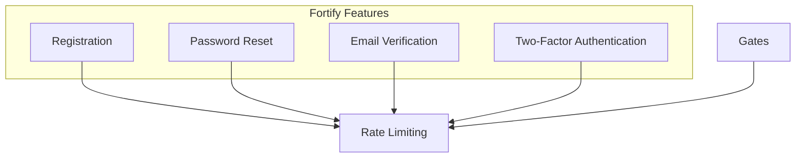
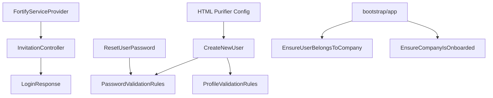

# Security Protection Mechanisms

<cite>
**Referenced Files in This Document**
- [config/purifier.php](file://config/purifier.php)
- [app/Concerns/PasswordValidationRules.php](file://app/Concerns/PasswordValidationRules.php)
- [app/Concerns/ProfileValidationRules.php](file://app/Concerns/ProfileValidationRules.php)
- [app/Actions/Fortify/CreateNewUser.php](file://app/Actions/Fortify/CreateNewUser.php)
- [app/Actions/Fortify/ResetUserPassword.php](file://app/Actions/Fortify/ResetUserPassword.php)
- [config/fortify.php](file://config/fortify.php)
- [app/Http/Middleware/EnsureUserBelongsToCompany.php](file://app/Http/Middleware/EnsureUserBelongsToCompany.php)
- [app/Http/Middleware/EnsureCompanyIsOnboarded.php](file://app/Http/Middleware/EnsureCompanyIsOnboarded.php)
- [app/Http/Controllers/Auth/InvitationController.php](file://app/Http/Controllers/Auth/InvitationController.php)
- [app/Http/Responses/LoginResponse.php](file://app/Http/Responses/LoginResponse.php)
- [app/Providers/FortifyServiceProvider.php](file://app/Providers/FortifyServiceProvider.php)
- [bootstrap/app.php](file://bootstrap/app.php)
- [public/.htaccess](file://public/.htaccess)
- [database/migrations/0001_01_01_000000_create_users_table.php](file://database/migrations/0001_01_01_000000_create_users_table.php)
- [app/Models/User.php](file://app/Models/User.php)
</cite>

## Table of Contents
1. [Introduction](#introduction)
2. [Project Structure](#project-structure)
3. [Core Components](#core-components)
4. [Architecture Overview](#architecture-overview)
5. [Detailed Component Analysis](#detailed-component-analysis)
6. [Dependency Analysis](#dependency-analysis)
7. [Performance Considerations](#performance-considerations)
8. [Troubleshooting Guide](#troubleshooting-guide)
9. [Conclusion](#conclusion)
10. [Appendices](#appendices)

## Introduction
This document explains the comprehensive security protection mechanisms implemented in the helpdesk system. It focuses on HTML sanitization via HTML Purifier, input validation and password/profile validation rules, secure response handling, and output encoding strategies. It also covers middleware protections, authentication and authorization controls, and outlines mitigation strategies for common vulnerabilities such as SQL injection, cross-site scripting (XSS), and cross-site request forgery (CSRF). Guidance for secure coding practices and security testing procedures is included.

## Project Structure
Security-related components are distributed across configuration, validation traits, actions, middleware, controllers, providers, and HTTP responses. The configuration layer centralizes HTML sanitization and authentication policies, while validation traits enforce strong input rules. Middleware enforces tenant isolation and onboarding constraints. Controllers and providers implement secure authentication flows and response redirections.

**Diagram sources**
- [config/purifier.php:1-108](file://config/purifier.php#L1-L108)
- [config/fortify.php:1-158](file://config/fortify.php#L1-L158)
- [app/Concerns/PasswordValidationRules.php:1-29](file://app/Concerns/PasswordValidationRules.php#L1-L29)
- [app/Concerns/ProfileValidationRules.php:1-51](file://app/Concerns/ProfileValidationRules.php#L1-L51)
- [app/Actions/Fortify/CreateNewUser.php:1-62](file://app/Actions/Fortify/CreateNewUser.php#L1-L62)
- [app/Actions/Fortify/ResetUserPassword.php:1-30](file://app/Actions/Fortify/ResetUserPassword.php#L1-L30)
- [app/Http/Middleware/EnsureUserBelongsToCompany.php:1-39](file://app/Http/Middleware/EnsureUserBelongsToCompany.php#L1-L39)
- [app/Http/Middleware/EnsureCompanyIsOnboarded.php:1-28](file://app/Http/Middleware/EnsureCompanyIsOnboarded.php#L1-L28)
- [app/Http/Controllers/Auth/InvitationController.php:1-31](file://app/Http/Controllers/Auth/InvitationController.php#L1-L31)
- [app/Http/Responses/LoginResponse.php:1-21](file://app/Http/Responses/LoginResponse.php#L1-L21)
- [app/Providers/FortifyServiceProvider.php:1-106](file://app/Providers/FortifyServiceProvider.php#L1-L106)
- [bootstrap/app.php:1-34](file://bootstrap/app.php#L1-L34)
- [public/.htaccess:1-25](file://public/.htaccess#L1-L25)
- [app/Models/User.php:1-137](file://app/Models/User.php#L1-L137)

**Section sources**
- [config/purifier.php:1-108](file://config/purifier.php#L1-L108)
- [config/fortify.php:1-158](file://config/fortify.php#L1-L158)
- [app/Concerns/PasswordValidationRules.php:1-29](file://app/Concerns/PasswordValidationRules.php#L1-L29)
- [app/Concerns/ProfileValidationRules.php:1-51](file://app/Concerns/ProfileValidationRules.php#L1-L51)
- [app/Actions/Fortify/CreateNewUser.php:1-62](file://app/Actions/Fortify/CreateNewUser.php#L1-L62)
- [app/Actions/Fortify/ResetUserPassword.php:1-30](file://app/Actions/Fortify/ResetUserPassword.php#L1-L30)
- [app/Http/Middleware/EnsureUserBelongsToCompany.php:1-39](file://app/Http/Middleware/EnsureUserBelongsToCompany.php#L1-L39)
- [app/Http/Middleware/EnsureCompanyIsOnboarded.php:1-28](file://app/Http/Middleware/EnsureCompanyIsOnboarded.php#L1-L28)
- [app/Http/Controllers/Auth/InvitationController.php:1-31](file://app/Http/Controllers/Auth/InvitationController.php#L1-L31)
- [app/Http/Responses/LoginResponse.php:1-21](file://app/Http/Responses/LoginResponse.php#L1-L21)
- [app/Providers/FortifyServiceProvider.php:1-106](file://app/Providers/FortifyServiceProvider.php#L1-L106)
- [bootstrap/app.php:1-34](file://bootstrap/app.php#L1-L34)
- [public/.htaccess:1-25](file://public/.htaccess#L1-L25)
- [app/Models/User.php:1-137](file://app/Models/User.php#L1-L137)

## Core Components
- HTML Purifier configuration for safe HTML rendering and XSS prevention.
- Strong password validation rules enforced via Laravel validation rules.
- Profile validation ensuring unique email constraints and basic sanitization.
- Fortify-based authentication with rate limiting, two-factor authentication, and secure redirects.
- Middleware enforcing company ownership and onboarding requirements.
- Secure invitation handling with signature validation and session-based unlocking.
- Centralized login response redirection to dashboard or home.

**Section sources**
- [config/purifier.php:20-105](file://config/purifier.php#L20-L105)
- [app/Concerns/PasswordValidationRules.php:14-27](file://app/Concerns/PasswordValidationRules.php#L14-L27)
- [app/Concerns/ProfileValidationRules.php:15-49](file://app/Concerns/ProfileValidationRules.php#L15-L49)
- [config/fortify.php:117-155](file://config/fortify.php#L117-L155)
- [app/Http/Middleware/EnsureUserBelongsToCompany.php:11-36](file://app/Http/Middleware/EnsureUserBelongsToCompany.php#L11-L36)
- [app/Http/Middleware/EnsureCompanyIsOnboarded.php:16-25](file://app/Http/Middleware/EnsureCompanyIsOnboarded.php#L16-L25)
- [app/Http/Controllers/Auth/InvitationController.php:14-28](file://app/Http/Controllers/Auth/InvitationController.php#L14-L28)
- [app/Http/Responses/LoginResponse.php:10-19](file://app/Http/Responses/LoginResponse.php#L10-L19)

## Architecture Overview
The security architecture integrates configuration-driven HTML sanitization, robust input validation, middleware-based access control, and secure authentication flows. The Fortify provider centralizes authentication behavior, while middleware ensures tenant isolation and onboarding compliance. Controllers and responses implement secure redirection and invitation handling.

**Diagram sources**
- [app/Http/Middleware/EnsureUserBelongsToCompany.php:11-36](file://app/Http/Middleware/EnsureUserBelongsToCompany.php#L11-L36)
- [app/Http/Middleware/EnsureCompanyIsOnboarded.php:16-25](file://app/Http/Middleware/EnsureCompanyIsOnboarded.php#L16-L25)
- [app/Http/Controllers/Auth/InvitationController.php:14-28](file://app/Http/Controllers/Auth/InvitationController.php#L14-L28)
- [app/Providers/FortifyServiceProvider.php:56-73](file://app/Providers/FortifyServiceProvider.php#L56-L73)
- [app/Concerns/PasswordValidationRules.php:14-27](file://app/Concerns/PasswordValidationRules.php#L14-L27)
- [app/Concerns/ProfileValidationRules.php:15-49](file://app/Concerns/ProfileValidationRules.php#L15-L49)
- [config/purifier.php:20-105](file://config/purifier.php#L20-L105)
- [app/Http/Responses/LoginResponse.php:10-19](file://app/Http/Responses/LoginResponse.php#L10-L19)

## Detailed Component Analysis

### HTML Sanitization with HTML Purifier
HTML Purifier is configured to allow a safe subset of HTML tags and CSS properties, enabling formatted content while blocking potentially malicious markup. The configuration specifies:
- Allowed HTML tags and attributes for links, lists, headings, paragraphs, images, code blocks, and more.
- Allowed CSS properties for font and text styling.
- Auto-formatting options to normalize content and remove empty elements.
- Safe iframe support for embedded media with a strict regular expression.
- Custom element and attribute definitions for HTML5-like constructs.
- ID enabling for testing contexts.

These settings collectively mitigate XSS by restricting dangerous tags and attributes and by normalizing content.

**Diagram sources**
- [config/purifier.php:26-105](file://config/purifier.php#L26-L105)

**Section sources**
- [config/purifier.php:20-105](file://config/purifier.php#L20-L105)

### Input Validation and Password Rules
Password validation leverages Laravel’s Password rule to enforce strong password policies and confirmation. Profile validation enforces required name and email fields, email format, length limits, and unique constraints (accounting for updates by ignoring the current user ID). These rules prevent injection and invalid data entry.

**Diagram sources**
- [app/Concerns/PasswordValidationRules.php:7-28](file://app/Concerns/PasswordValidationRules.php#L7-L28)
- [app/Concerns/ProfileValidationRules.php:8-50](file://app/Concerns/ProfileValidationRules.php#L8-L50)
- [app/Actions/Fortify/CreateNewUser.php:14-61](file://app/Actions/Fortify/CreateNewUser.php#L14-L61)
- [app/Actions/Fortify/ResetUserPassword.php:10-29](file://app/Actions/Fortify/ResetUserPassword.php#L10-L29)

**Section sources**
- [app/Concerns/PasswordValidationRules.php:14-27](file://app/Concerns/PasswordValidationRules.php#L14-L27)
- [app/Concerns/ProfileValidationRules.php:15-49](file://app/Concerns/ProfileValidationRules.php#L15-L49)
- [app/Actions/Fortify/CreateNewUser.php:23-28](file://app/Actions/Fortify/CreateNewUser.php#L23-L28)
- [app/Actions/Fortify/ResetUserPassword.php:19-23](file://app/Actions/Fortify/ResetUserPassword.php#L19-L23)

### Secure Response Handling and Output Encoding Strategies
- LoginResponse redirects authenticated users to the company-specific dashboard or home page, avoiding exposure of internal routing details.
- Fortify provider customizes logout to redirect to the main application URL, preventing subdomain leakage.
- Public rewrite rules normalize headers (including authorization and XSRF tokens) to ensure APIs and SPA clients receive consistent headers.

**Diagram sources**
- [app/Http/Responses/LoginResponse.php:8-20](file://app/Http/Responses/LoginResponse.php#L8-L20)

**Section sources**
- [app/Http/Responses/LoginResponse.php:10-19](file://app/Http/Responses/LoginResponse.php#L10-L19)
- [app/Providers/FortifyServiceProvider.php:25-32](file://app/Providers/FortifyServiceProvider.php#L25-L32)
- [public/.htaccess:8-14](file://public/.htaccess#L8-L14)

### Middleware-Based Access Control
- EnsureUserBelongsToCompany enforces that requests are associated with the authenticated user’s company, preventing cross-tenant access and returning appropriate errors when missing or mismatched.
- EnsureCompanyIsOnboarded redirects unonboarded companies to the onboarding wizard, except when already accessing onboarding routes.

**Diagram sources**
- [app/Http/Middleware/EnsureUserBelongsToCompany.php:11-36](file://app/Http/Middleware/EnsureUserBelongsToCompany.php#L11-L36)

**Section sources**
- [app/Http/Middleware/EnsureUserBelongsToCompany.php:11-36](file://app/Http/Middleware/EnsureUserBelongsToCompany.php#L11-L36)
- [app/Http/Middleware/EnsureCompanyIsOnboarded.php:16-25](file://app/Http/Middleware/EnsureCompanyIsOnboarded.php#L16-L25)

### Invitation Handling and Session Unlocking
Invitations are validated using signed URLs. If invalid, access is denied. If valid and the user lacks a password, their email is placed into a volatile session to unlock the set-password flow. This prevents direct access to password setup and ties the session to the verified invite.

**Diagram sources**
- [app/Http/Controllers/Auth/InvitationController.php:14-28](file://app/Http/Controllers/Auth/InvitationController.php#L14-L28)

**Section sources**
- [app/Http/Controllers/Auth/InvitationController.php:14-28](file://app/Http/Controllers/Auth/InvitationController.php#L14-L28)

### Authentication and Authorization Controls
- Fortify configuration enables registration, password reset, email verification, and two-factor authentication with confirmation and password prompts.
- Rate limiting is configured for login attempts and two-factor challenges.
- Gates define operator visibility permissions.
- Authentication flow handles pending invites by storing session data and redirecting appropriately.

**Diagram sources**
- [config/fortify.php:146-155](file://config/fortify.php#L146-L155)
- [app/Providers/FortifyServiceProvider.php:93-104](file://app/Providers/FortifyServiceProvider.php#L93-L104)
- [app/Providers/FortifyServiceProvider.php:45](file://app/Providers/FortifyServiceProvider.php#L45)
- [app/Providers/FortifyServiceProvider.php:56-73](file://app/Providers/FortifyServiceProvider.php#L56-L73)

**Section sources**
- [config/fortify.php:117-155](file://config/fortify.php#L117-L155)
- [app/Providers/FortifyServiceProvider.php:93-104](file://app/Providers/FortifyServiceProvider.php#L93-L104)
- [app/Providers/FortifyServiceProvider.php:45](file://app/Providers/FortifyServiceProvider.php#L45)
- [app/Providers/FortifyServiceProvider.php:56-73](file://app/Providers/FortifyServiceProvider.php#L56-L73)

### Secure Coding Practices and Testing Procedures
- Use validation traits for consistent password and profile rules across creation and reset flows.
- Enforce middleware for tenant isolation and onboarding checks.
- Leverage Fortify’s built-in rate limiting and two-factor features.
- Sanitize user-generated content with HTML Purifier configuration.
- Test:
  - Authentication flows with pending invitations and valid/expired signatures.
  - Middleware access control for cross-tenant requests.
  - Validation failures for weak passwords and duplicate emails.
  - Output encoding in views and emails to prevent reflected XSS.

[No sources needed since this section provides general guidance]

## Dependency Analysis
The following diagram highlights key dependencies among security components:

**Diagram sources**
- [app/Actions/Fortify/CreateNewUser.php:14-61](file://app/Actions/Fortify/CreateNewUser.php#L14-L61)
- [app/Concerns/PasswordValidationRules.php:7-28](file://app/Concerns/PasswordValidationRules.php#L7-L28)
- [app/Concerns/ProfileValidationRules.php:8-50](file://app/Concerns/ProfileValidationRules.php#L8-L50)
- [app/Actions/Fortify/ResetUserPassword.php:10-29](file://app/Actions/Fortify/ResetUserPassword.php#L10-L29)
- [app/Providers/FortifyServiceProvider.php:53-73](file://app/Providers/FortifyServiceProvider.php#L53-L73)
- [app/Http/Controllers/Auth/InvitationController.php:14-28](file://app/Http/Controllers/Auth/InvitationController.php#L14-L28)
- [app/Http/Responses/LoginResponse.php:8-20](file://app/Http/Responses/LoginResponse.php#L8-L20)
- [bootstrap/app.php:20-29](file://bootstrap/app.php#L20-L29)
- [app/Http/Middleware/EnsureUserBelongsToCompany.php:9-38](file://app/Http/Middleware/EnsureUserBelongsToCompany.php#L9-L38)
- [app/Http/Middleware/EnsureCompanyIsOnboarded.php:9-27](file://app/Http/Middleware/EnsureCompanyIsOnboarded.php#L9-L27)
- [config/purifier.php:20-105](file://config/purifier.php#L20-L105)

**Section sources**
- [app/Actions/Fortify/CreateNewUser.php:14-61](file://app/Actions/Fortify/CreateNewUser.php#L14-L61)
- [app/Concerns/PasswordValidationRules.php:7-28](file://app/Concerns/PasswordValidationRules.php#L7-L28)
- [app/Concerns/ProfileValidationRules.php:8-50](file://app/Concerns/ProfileValidationRules.php#L8-L50)
- [app/Actions/Fortify/ResetUserPassword.php:10-29](file://app/Actions/Fortify/ResetUserPassword.php#L10-L29)
- [app/Providers/FortifyServiceProvider.php:53-73](file://app/Providers/FortifyServiceProvider.php#L53-L73)
- [app/Http/Controllers/Auth/InvitationController.php:14-28](file://app/Http/Controllers/Auth/InvitationController.php#L14-L28)
- [app/Http/Responses/LoginResponse.php:8-20](file://app/Http/Responses/LoginResponse.php#L8-L20)
- [bootstrap/app.php:20-29](file://bootstrap/app.php#L20-L29)
- [app/Http/Middleware/EnsureUserBelongsToCompany.php:9-38](file://app/Http/Middleware/EnsureUserBelongsToCompany.php#L9-L38)
- [app/Http/Middleware/EnsureCompanyIsOnboarded.php:9-27](file://app/Http/Middleware/EnsureCompanyIsOnboarded.php#L9-L27)
- [config/purifier.php:20-105](file://config/purifier.php#L20-L105)

## Performance Considerations
- HTML Purifier caching is enabled via a serializer path to reduce repeated parsing overhead.
- Validation rules are centralized to minimize duplication and improve maintainability.
- Middleware checks short-circuit early to avoid unnecessary work when unauthorized or missing context.

[No sources needed since this section provides general guidance]

## Troubleshooting Guide
- If HTML content is unexpectedly stripped, review allowed tags and attributes in the HTML Purifier configuration and ensure custom definitions align with intended content.
- If password reset fails, verify that the password validation rules and confirmation are applied consistently in the reset action.
- If profile update fails due to email uniqueness, ensure the ignore rule is applied when updating existing records.
- If middleware denies access, confirm that the company context is properly resolved and that the user belongs to the company.
- If invitation links fail, check signature validity and session-based unlock logic.

**Section sources**
- [config/purifier.php:24-105](file://config/purifier.php#L24-L105)
- [app/Concerns/PasswordValidationRules.php:14-27](file://app/Concerns/PasswordValidationRules.php#L14-L27)
- [app/Concerns/ProfileValidationRules.php:38-49](file://app/Concerns/ProfileValidationRules.php#L38-L49)
- [app/Http/Middleware/EnsureUserBelongsToCompany.php:11-36](file://app/Http/Middleware/EnsureUserBelongsToCompany.php#L11-L36)
- [app/Http/Controllers/Auth/InvitationController.php:14-28](file://app/Http/Controllers/Auth/InvitationController.php#L14-L28)

## Conclusion
The system employs layered security measures: HTML Purifier for XSS mitigation, robust validation rules for passwords and profiles, middleware for tenant isolation and onboarding, and Fortify for secure authentication and rate limiting. Together, these components provide a strong foundation for protecting user data and preventing common vulnerabilities.

[No sources needed since this section summarizes without analyzing specific files]

## Appendices

### Mitigation Strategies for Common Vulnerabilities
- SQL Injection: Use Eloquent ORM and parameterized queries; avoid raw SQL. The migration schema and model casts demonstrate safe defaults.
- XSS: Sanitize user-generated HTML with HTML Purifier and escape output in templates.
- CSRF: Fortify and Laravel provide CSRF protections; ensure forms and AJAX requests include tokens.
- Injections: Enforce strict validation rules and avoid concatenating user input into executable contexts.

**Section sources**
- [database/migrations/0001_01_01_000000_create_users_table.php:14-31](file://database/migrations/0001_01_01_000000_create_users_table.php#L14-L31)
- [app/Models/User.php:38-43](file://app/Models/User.php#L38-L43)

### Implementing Custom Validation Rules
- Extend the validation traits to add domain-specific constraints.
- Integrate custom rules into actions that create or update resources.

**Section sources**
- [app/Concerns/PasswordValidationRules.php:7-28](file://app/Concerns/PasswordValidationRules.php#L7-L28)
- [app/Concerns/ProfileValidationRules.php:8-50](file://app/Concerns/ProfileValidationRules.php#L8-L50)
- [app/Actions/Fortify/CreateNewUser.php:23-28](file://app/Actions/Fortify/CreateNewUser.php#L23-L28)

### Configuring Security Headers
- Use server-level headers (e.g., HSTS, CSP) and ensure the application sets appropriate meta tags.
- Normalize headers at the front controller level to support SPA and API clients.

**Section sources**
- [public/.htaccess:8-14](file://public/.htaccess#L8-L14)

### Integrating with Security Scanning Tools
- Run static analysis and SAST tools against validation traits and controllers.
- Include automated tests covering validation failures, middleware access, and authentication flows.

[No sources needed since this section provides general guidance]