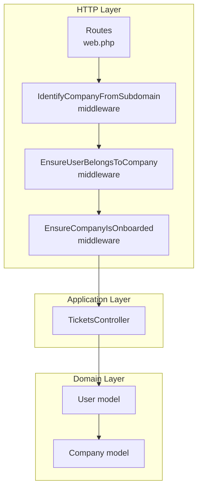
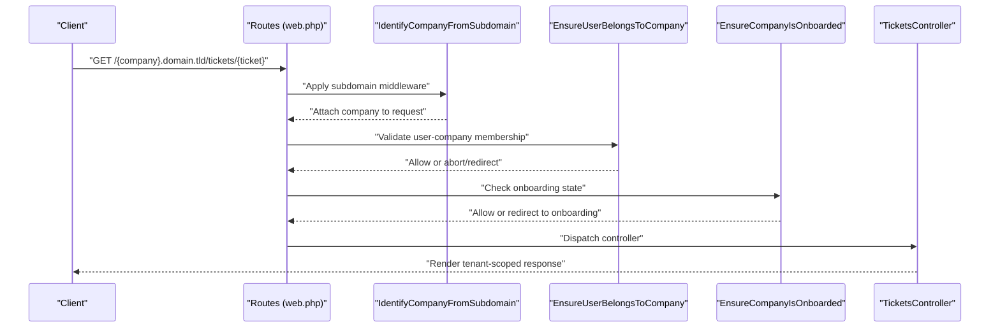
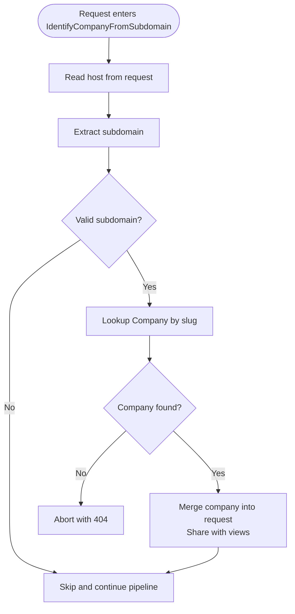
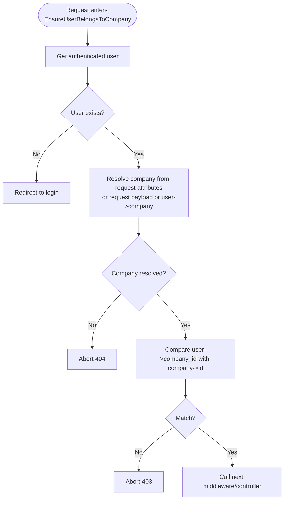
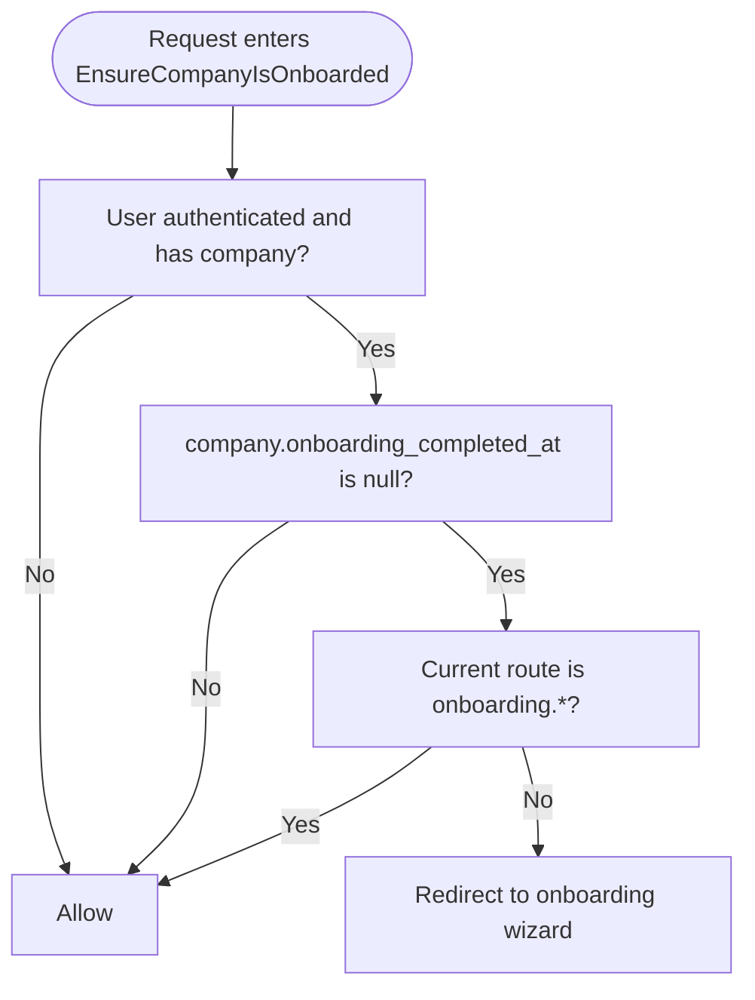
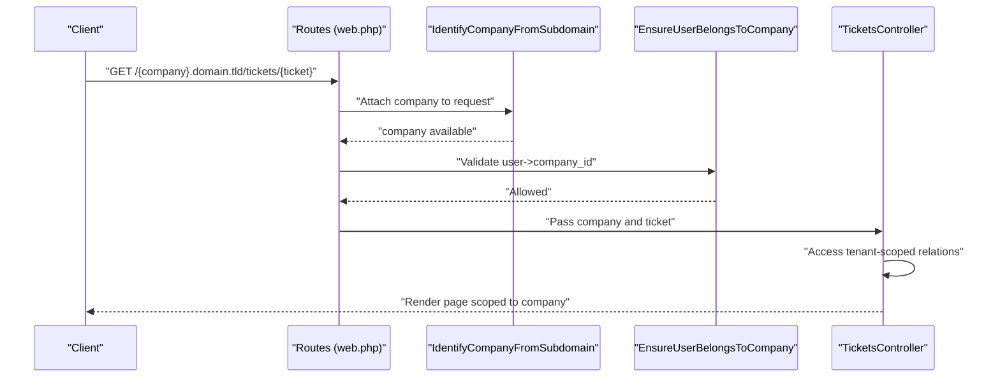
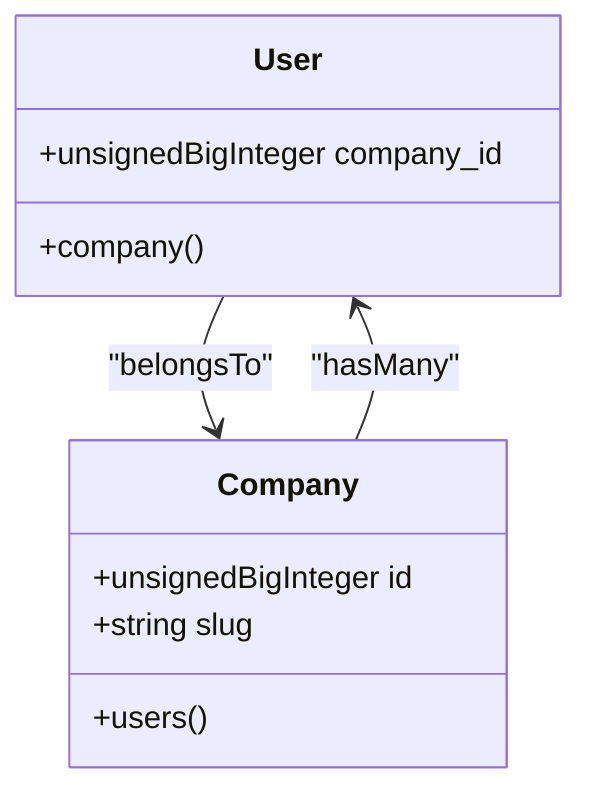
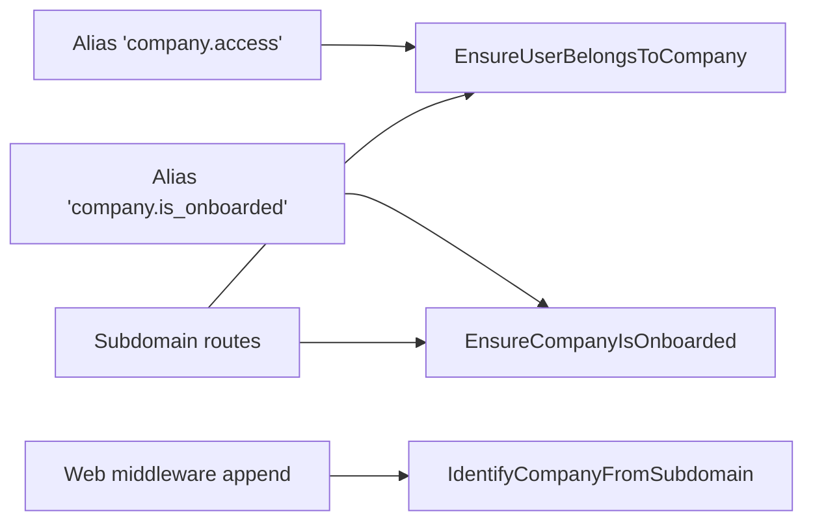

# Company Isolation Mechanisms

<cite>
**Referenced Files in This Document**
- [EnsureUserBelongsToCompany.php](file://app/Http/Middleware/EnsureUserBelongsToCompany.php)
- [EnsureCompanyIsOnboarded.php](file://app/Http/Middleware/EnsureCompanyIsOnboarded.php)
- [IdentifyCompanyFromSubdomain.php](file://app/Http/Middleware/IdentifyCompanyFromSubdomain.php)
- [bootstrap/app.php](file://bootstrap/app.php)
- [routes/web.php](file://routes/web.php)
- [User.php](file://app/Models/User.php)
- [Company.php](file://app/Models/Company.php)
- [2026_02_01_224200_create_companies_table.php](file://database/migrations/2026_02_01_224200_create_companies_table.php)
- [0001_01_01_000000_create_users_table.php](file://database/migrations/0001_01_01_000000_create_users_table.php)
- [TicketsController.php](file://app/Http/Controllers/TicketsController.php)
</cite>

## Table of Contents
1. [Introduction](#introduction)
2. [Project Structure](#project-structure)
3. [Core Components](#core-components)
4. [Architecture Overview](#architecture-overview)
5. [Detailed Component Analysis](#detailed-component-analysis)
6. [Dependency Analysis](#dependency-analysis)
7. [Performance Considerations](#performance-considerations)
8. [Troubleshooting Guide](#troubleshooting-guide)
9. [Conclusion](#conclusion)

## Introduction
This document explains the company isolation mechanisms that prevent cross-tenant access in the helpdesk system. It focuses on:
- Middleware that validates user-company membership and enforces tenant boundaries
- Middleware that ensures companies are onboarded before granting access
- Data access patterns that scope queries to the current tenant
- Permission checks, resource scoping, and query filtering
- Company-user relationship models and their role in enforcing isolation
- Edge cases, bypass scenarios, and security considerations

## Project Structure
The isolation strategy spans middleware, routing, models, and controllers:
- Subdomain-based routing groups requests by company
- Middleware layers validate identity, company membership, and onboarding state
- Eloquent models define company-user relationships and scopes
- Controllers demonstrate tenant-aware resource access

**Diagram sources**
- [routes/web.php:71-114](file://routes/web.php#L71-L114)
- [IdentifyCompanyFromSubdomain.php:12-36](file://app/Http/Middleware/IdentifyCompanyFromSubdomain.php#L12-L36)
- [EnsureUserBelongsToCompany.php:11-37](file://app/Http/Middleware/EnsureUserBelongsToCompany.php#L11-L37)
- [EnsureCompanyIsOnboarded.php:16-26](file://app/Http/Middleware/EnsureCompanyIsOnboarded.php#L16-L26)
- [User.php:74-77](file://app/Models/User.php#L74-L77)
- [Company.php:24-27](file://app/Models/Company.php#L24-L27)
- [TicketsController.php:12-17](file://app/Http/Controllers/TicketsController.php#L12-L17)

**Section sources**
- [routes/web.php:71-114](file://routes/web.php#L71-L114)
- [bootstrap/app.php:20-30](file://bootstrap/app.php#L20-L30)

## Core Components
- IdentifyCompanyFromSubdomain: Extracts company context from the subdomain and attaches it to the request for downstream middleware and controllers.
- EnsureUserBelongsToCompany: Enforces that the authenticated user belongs to the requested company.
- EnsureCompanyIsOnboarded: Blocks access to the company dashboard until onboarding is complete.
- Company and User models: Define the tenant relationship and provide convenient accessors for tenant-scoped resources.

**Section sources**
- [IdentifyCompanyFromSubdomain.php:12-36](file://app/Http/Middleware/IdentifyCompanyFromSubdomain.php#L12-L36)
- [EnsureUserBelongsToCompany.php:11-37](file://app/Http/Middleware/EnsureUserBelongsToCompany.php#L11-L37)
- [EnsureCompanyIsOnboarded.php:16-26](file://app/Http/Middleware/EnsureCompanyIsOnboarded.php#L16-L26)
- [Company.php:24-27](file://app/Models/Company.php#L24-L27)
- [User.php:74-77](file://app/Models/User.php#L74-L77)

## Architecture Overview
The isolation pipeline operates per-request:
1. Subdomain parsing resolves the target company
2. User identity is established via authentication
3. Membership and onboarding checks ensure proper access
4. Controllers and services operate within the tenant context

**Diagram sources**
- [routes/web.php:71-114](file://routes/web.php#L71-L114)
- [IdentifyCompanyFromSubdomain.php:12-36](file://app/Http/Middleware/IdentifyCompanyFromSubdomain.php#L12-L36)
- [EnsureUserBelongsToCompany.php:11-37](file://app/Http/Middleware/EnsureUserBelongsToCompany.php#L11-L37)
- [EnsureCompanyIsOnboarded.php:16-26](file://app/Http/Middleware/EnsureCompanyIsOnboarded.php#L16-L26)
- [TicketsController.php:12-17](file://app/Http/Controllers/TicketsController.php#L12-L17)

## Detailed Component Analysis

### Middleware: IdentifyCompanyFromSubdomain
- Purpose: Resolve company from subdomain and share it across the request lifecycle.
- Behavior:
  - Extracts subdomain from host
  - Skips for main domains or reserved prefixes
  - Queries Company by slug and attaches it to the request and shared view data
  - Aborts with 404 if company not found

**Diagram sources**
- [IdentifyCompanyFromSubdomain.php:12-36](file://app/Http/Middleware/IdentifyCompanyFromSubdomain.php#L12-L36)

**Section sources**
- [IdentifyCompanyFromSubdomain.php:12-36](file://app/Http/Middleware/IdentifyCompanyFromSubdomain.php#L12-L36)

### Middleware: EnsureUserBelongsToCompany
- Purpose: Prevent cross-tenant access by verifying the authenticated user’s company association.
- Behavior:
  - Requires an authenticated user; otherwise redirects to login
  - Retrieves company from request attributes (set by subdomain middleware) with fallbacks
  - Aborts with 404 if company cannot be determined
  - Compares user.company_id with the resolved company id; aborts with 403 if mismatch

**Diagram sources**
- [EnsureUserBelongsToCompany.php:11-37](file://app/Http/Middleware/EnsureUserBelongsToCompany.php#L11-L37)

**Section sources**
- [EnsureUserBelongsToCompany.php:11-37](file://app/Http/Middleware/EnsureUserBelongsToCompany.php#L11-L37)

### Middleware: EnsureCompanyIsOnboarded
- Purpose: Block access to the company dashboard until onboarding is complete.
- Behavior:
  - If the user is authenticated, belongs to a company, and onboarding is incomplete
  - Redirects to the onboarding wizard unless the current route is already onboarding-related

**Diagram sources**
- [EnsureCompanyIsOnboarded.php:16-26](file://app/Http/Middleware/EnsureCompanyIsOnboarded.php#L16-L26)

**Section sources**
- [EnsureCompanyIsOnboarded.php:16-26](file://app/Http/Middleware/EnsureCompanyIsOnboarded.php#L16-L26)

### Data Access Patterns and Tenant Scoping
- Subdomain routing groups: Routes under the `{company}.{domain}` domain apply the isolation middleware stack.
- Request-scoped company: The subdomain middleware attaches the company to the request, ensuring downstream logic operates within the correct tenant.
- Controller usage: Controllers receive the company context and can safely access tenant-scoped resources.

**Diagram sources**
- [routes/web.php:71-114](file://routes/web.php#L71-L114)
- [IdentifyCompanyFromSubdomain.php:12-36](file://app/Http/Middleware/IdentifyCompanyFromSubdomain.php#L12-L36)
- [EnsureUserBelongsToCompany.php:11-37](file://app/Http/Middleware/EnsureUserBelongsToCompany.php#L11-L37)
- [TicketsController.php:12-17](file://app/Http/Controllers/TicketsController.php#L12-L17)

**Section sources**
- [routes/web.php:71-114](file://routes/web.php#L71-L114)
- [TicketsController.php:12-17](file://app/Http/Controllers/TicketsController.php#L12-L17)

### Company-User Relationship Models
- User belongs to Company via foreign key
- Company has many Users
- These relationships enable tenant-aware queries and prevent accidental cross-tenant access

**Diagram sources**
- [User.php:74-77](file://app/Models/User.php#L74-L77)
- [Company.php:24-27](file://app/Models/Company.php#L24-L27)
- [0001_01_01_000000_create_users_table.php:16](file://database/migrations/0001_01_01_000000_create_users_table.php#L16)
- [2026_02_01_224200_create_companies_table.php:17](file://database/migrations/2026_02_01_224200_create_companies_table.php#L17)

**Section sources**
- [User.php:74-77](file://app/Models/User.php#L74-L77)
- [Company.php:24-27](file://app/Models/Company.php#L24-L27)
- [0001_01_01_000000_create_users_table.php:16](file://database/migrations/0001_01_01_000000_create_users_table.php#L16)
- [2026_02_01_224200_create_companies_table.php:17](file://database/migrations/2026_02_01_224200_create_companies_table.php#L17)

### Permission Checking, Resource Scoping, and Query Filtering
- Route-level scoping: Subdomain-based route groups ensure all routes operate within a single company context.
- Middleware-level checks: EnsureUserBelongsToCompany and EnsureCompanyIsOnboarded gate access.
- Controller-level scoping: Controllers rely on the resolved company context to access tenant-specific resources.
- Additional gates: Role-based permissions (e.g., viewing operators) complement tenant isolation.

Examples of tenant-aware access in controllers:
- Accessing company-scoped users for ticket details
- Rendering dashboards scoped to the current company

**Section sources**
- [routes/web.php:71-114](file://routes/web.php#L71-L114)
- [bootstrap/app.php:20-30](file://bootstrap/app.php#L20-L30)
- [TicketsController.php:12-17](file://app/Http/Controllers/TicketsController.php#L12-L17)

## Dependency Analysis
- Middleware aliasing: The application registers aliases for company isolation middleware.
- Web middleware stack: IdentifyCompanyFromSubdomain is appended to the web stack so it runs early in the pipeline.
- Route grouping: Subdomain-based route groups apply the isolation middleware chain.

**Diagram sources**
- [bootstrap/app.php:20-30](file://bootstrap/app.php#L20-L30)
- [routes/web.php:71-114](file://routes/web.php#L71-L114)

**Section sources**
- [bootstrap/app.php:20-30](file://bootstrap/app.php#L20-L30)
- [routes/web.php:71-114](file://routes/web.php#L71-L114)

## Performance Considerations
- Subdomain parsing is O(1) string operations and inexpensive.
- Company lookup by slug is indexed, minimizing database overhead.
- Early middleware termination avoids unnecessary work when access is denied.
- Prefer eager-loading tenant relations in controllers to reduce N+1 queries.

## Troubleshooting Guide
Common issues and resolutions:
- 404 “Company not found” during subdomain resolution
  - Cause: Subdomain does not match any company slug
  - Resolution: Verify DNS/subdomain configuration and company slug
- 403 “You do not have access to this company”
  - Cause: User’s company_id does not match the requested company
  - Resolution: Ensure the user belongs to the intended company; re-authenticate if necessary
- Redirect loop to onboarding
  - Cause: Company onboarding not completed and accessing dashboard routes
  - Resolution: Complete onboarding wizard; avoid non-onboarding routes while onboarding is incomplete
- Unexpected cross-tenant access
  - Cause: Missing or misapplied middleware in route groups
  - Resolution: Confirm subdomain route groups include the isolation middleware stack

**Section sources**
- [EnsureUserBelongsToCompany.php:15-34](file://app/Http/Middleware/EnsureUserBelongsToCompany.php#L15-L34)
- [EnsureCompanyIsOnboarded.php:18-23](file://app/Http/Middleware/EnsureCompanyIsOnboarded.php#L18-L23)
- [routes/web.php:71-114](file://routes/web.php#L71-L114)

## Conclusion
The system enforces strict tenant isolation through:
- Subdomain-driven routing that establishes the company context
- Middleware that validates user-company membership and onboarding state
- Strong company-user relationships and controller-level scoping
These controls collectively prevent cross-tenant access and maintain secure, isolated environments per company.