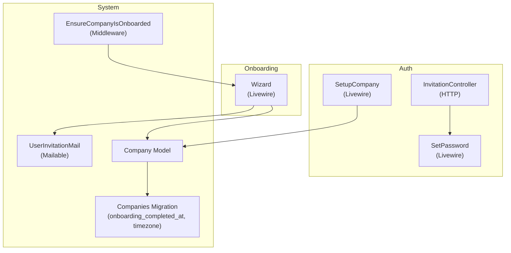
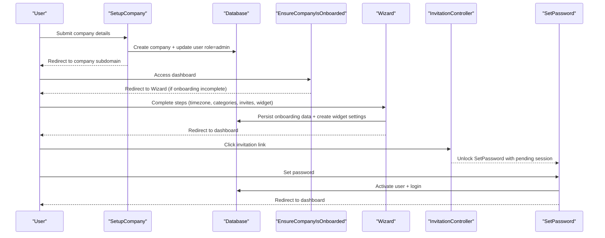
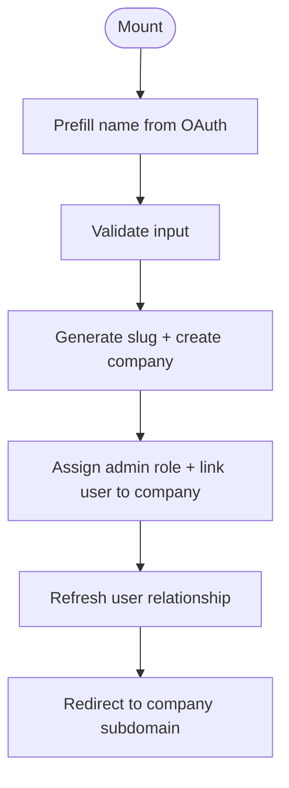
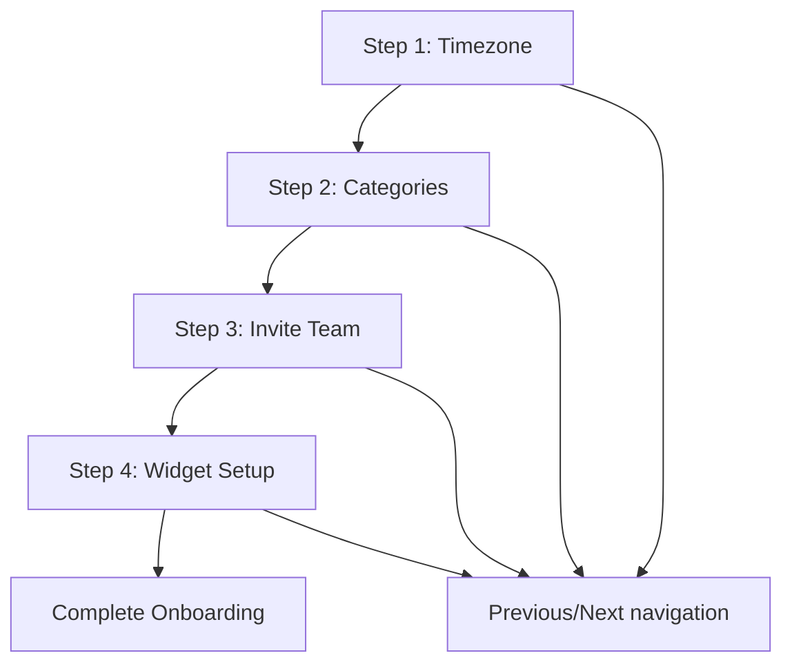
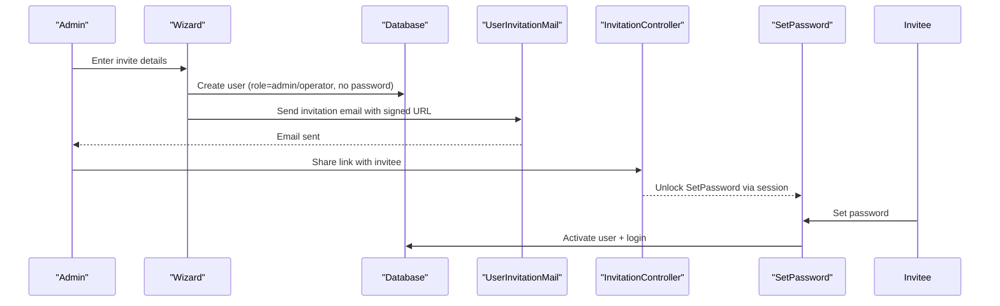
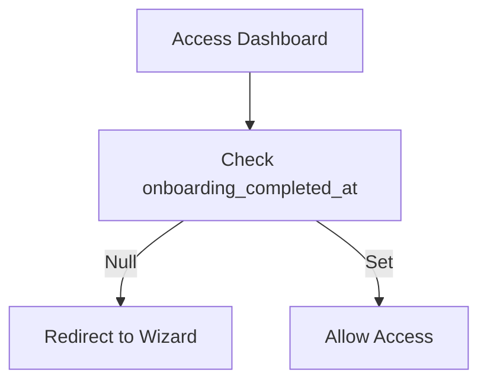
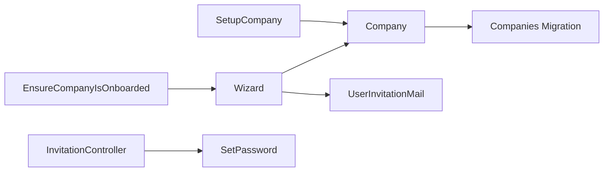

# Company Onboarding Workflow

<cite>
**Referenced Files in This Document**
- [SetupCompany.php](file://app/Livewire/Auth/SetupCompany.php)
- [setup-company.blade.php](file://resources/views/livewire/auth/setup-company.blade.php)
- [Wizard.php](file://app/Livewire/Onboarding/Wizard.php)
- [wizard.blade.php](file://resources/views/livewire/onboarding/wizard.blade.php)
- [SetPassword.php](file://app/Livewire/Auth/SetPassword.php)
- [set-password.blade.php](file://resources/views/livewire/auth/set-password.blade.php)
- [InvitationController.php](file://app/Http/Middleware/EnsureCompanyIsOnboarded.php)
- [EnsureCompanyIsOnboarded.php](file://app/Http/Middleware/EnsureCompanyIsOnboarded.php)
- [Company.php](file://app/Models/Company.php)
- [2026_03_07_080820_add_onboarding_completed_at_to_companies_table.php](file://database/migrations/2026_03_07_080820_add_onboarding_completed_at_to_companies_table.php)
- [2026_03_07_151242_update_user_role_to_operator.php](file://database/migrations/2026_03_07_151242_update_user_role_to_operator.php)
- [InvitationController.php](file://app/Http/Controllers/Auth/InvitationController.php)
- [UserInvitationMail.php](file://app/Mail/UserInvitationMail.php)
- [OnboardingWizardTest.php](file://tests/Feature/OnboardingWizardTest.php)
</cite>

## Table of Contents
1. [Introduction](#introduction)
2. [Project Structure](#project-structure)
3. [Core Components](#core-components)
4. [Architecture Overview](#architecture-overview)
5. [Detailed Component Analysis](#detailed-component-analysis)
6. [Dependency Analysis](#dependency-analysis)
7. [Performance Considerations](#performance-considerations)
8. [Troubleshooting Guide](#troubleshooting-guide)
9. [Conclusion](#conclusion)
10. [Appendices](#appendices)

## Introduction
This document explains the end-to-end company onboarding workflow for provisioning new companies in the system. It covers:
- Initial setup via the SetupCompany component
- The guided onboarding wizard (Wizard)
- Invitation system for adding initial users and assigning roles
- Default configurations applied during onboarding
- Activation criteria and completion tracking
- How onboarding completion unlocks system access
- Common issues, validation requirements, and rollback considerations

## Project Structure
The onboarding workflow spans Livewire components, Blade templates, middleware, models, migrations, controllers, and mailers. The following diagram shows the high-level structure and interactions.

**Diagram sources**
- [SetupCompany.php:11-89](file://app/Livewire/Auth/SetupCompany.php#L11-L89)
- [Wizard.php:8-219](file://app/Livewire/Onboarding/Wizard.php#L8-L219)
- [SetPassword.php:14-103](file://app/Livewire/Auth/SetPassword.php#L14-L103)
- [InvitationController.php:9-30](file://app/Http/Controllers/Auth/InvitationController.php#L9-L30)
- [EnsureCompanyIsOnboarded.php:9-27](file://app/Http/Middleware/EnsureCompanyIsOnboarded.php#L9-L27)
- [Company.php:8-46](file://app/Models/Company.php#L8-L46)
- [2026_03_07_080820_add_onboarding_completed_at_to_companies_table.php:7-34](file://database/migrations/2026_03_07_080820_add_onboarding_completed_at_to_companies_table.php#L7-L34)
- [UserInvitationMail.php:13-63](file://app/Mail/UserInvitationMail.php#L13-L63)

**Section sources**
- [SetupCompany.php:11-89](file://app/Livewire/Auth/SetupCompany.php#L11-L89)
- [Wizard.php:8-219](file://app/Livewire/Onboarding/Wizard.php#L8-L219)
- [SetPassword.php:14-103](file://app/Livewire/Auth/SetPassword.php#L14-L103)
- [InvitationController.php:9-30](file://app/Http/Controllers/Auth/InvitationController.php#L9-L30)
- [EnsureCompanyIsOnboarded.php:9-27](file://app/Http/Middleware/EnsureCompanyIsOnboarded.php#L9-L27)
- [Company.php:8-46](file://app/Models/Company.php#L8-L46)
- [2026_03_07_080820_add_onboarding_completed_at_to_companies_table.php:7-34](file://database/migrations/2026_03_07_080820_add_onboarding_completed_at_to_companies_table.php#L7-L34)
- [UserInvitationMail.php:13-63](file://app/Mail/UserInvitationMail.php#L13-L63)

## Core Components
- SetupCompany: Creates the company, assigns admin role, and redirects to the company subdomain dashboard.
- Wizard: Guides administrators through four steps: timezone, categories, invite team, and widget customization.
- SetPassword: Finalizes pending users by setting passwords and activating accounts.
- InvitationController: Validates signed invitation links and unlocks the SetPassword flow.
- EnsureCompanyIsOnboarded: Redirects uncompleted onboarding to the wizard.
- Company model: Tracks onboarding completion and related attributes.
- Migrations: Define schema for onboarding fields and role normalization.

**Section sources**
- [SetupCompany.php:11-89](file://app/Livewire/Auth/SetupCompany.php#L11-L89)
- [Wizard.php:8-219](file://app/Livewire/Onboarding/Wizard.php#L8-L219)
- [SetPassword.php:14-103](file://app/Livewire/Auth/SetPassword.php#L14-L103)
- [InvitationController.php:9-30](file://app/Http/Controllers/Auth/InvitationController.php#L9-L30)
- [EnsureCompanyIsOnboarded.php:9-27](file://app/Http/Middleware/EnsureCompanyIsOnboarded.php#L9-L27)
- [Company.php:8-46](file://app/Models/Company.php#L8-L46)
- [2026_03_07_080820_add_onboarding_completed_at_to_companies_table.php:7-34](file://database/migrations/2026_03_07_080820_add_onboarding_completed_at_to_companies_table.php#L7-L34)
- [2026_03_07_151242_update_user_role_to_operator.php:8-35](file://database/migrations/2026_03_07_151242_update_user_role_to_operator.php#L8-L35)

## Architecture Overview
The onboarding pipeline begins when a user completes OAuth registration and lands on the SetupCompany screen. After company creation, the system enforces onboarding completion via middleware before granting access to the main dashboard. The Wizard component captures configuration choices and optionally invites users. Finally, invited users set their passwords and gain access.

**Diagram sources**
- [SetupCompany.php:40-82](file://app/Livewire/Auth/SetupCompany.php#L40-L82)
- [EnsureCompanyIsOnboarded.php:16-26](file://app/Http/Middleware/EnsureCompanyIsOnboarded.php#L16-L26)
- [Wizard.php:155-212](file://app/Livewire/Onboarding/Wizard.php#L155-L212)
- [InvitationController.php:14-29](file://app/Http/Controllers/Auth/InvitationController.php#L14-L29)
- [SetPassword.php:62-97](file://app/Livewire/Auth/SetPassword.php#L62-L97)

## Detailed Component Analysis

### SetupCompany Component
Purpose:
- Provision a new company for a user who has just registered.
- Assign admin role to the creator.
- Generate a unique subdomain slug and redirect to the company’s dashboard.

Key behaviors:
- Validation rules enforce minimum/maximum length for name and company name.
- Slug generation ensures uniqueness by appending a counter if needed.
- Transactional creation guarantees atomicity for company and user updates.
- Redirects to the company subdomain after completion.

**Diagram sources**
- [SetupCompany.php:25-82](file://app/Livewire/Auth/SetupCompany.php#L25-L82)

**Section sources**
- [SetupCompany.php:11-89](file://app/Livewire/Auth/SetupCompany.php#L11-L89)
- [setup-company.blade.php:13-77](file://resources/views/livewire/auth/setup-company.blade.php#L13-L77)

### Onboarding Wizard (Wizard)
Purpose:
- Guide administrators through four steps to configure the workspace.

Steps:
1. Company Details: Set timezone.
2. Ticket Categories: Define categories with color; add/remove entries.
3. Invite Team: Optionally invite operators/admins; sends signed invitations.
4. Widget Setup: Customize theme mode, messages, and form fields; preview included.

Completion:
- Validates step-specific inputs.
- Persists timezone and marks onboarding complete.
- Creates default categories if none exist.
- Sends invitations and creates widget settings.
- Redirects to the company dashboard.

**Diagram sources**
- [Wizard.php:46-81](file://app/Livewire/Onboarding/Wizard.php#L46-L81)
- [wizard.blade.php:28-173](file://resources/views/livewire/onboarding/wizard.blade.php#L28-L173)

**Section sources**
- [Wizard.php:8-219](file://app/Livewire/Onboarding/Wizard.php#L8-L219)
- [wizard.blade.php:1-177](file://resources/views/livewire/onboarding/wizard.blade.php#L1-L177)

### Invitation System and Role Assignment
Purpose:
- Allow admins to invite team members during onboarding.
- Send signed invitation links and guide recipients to set passwords.

Workflow:
- Wizard creates users with role admin/operator and no password.
- Signed URL is generated and emailed to the invitee.
- InvitationController validates the signature and unlocks SetPassword.
- SetPassword sets the password, verifies the email, and logs the user in.

**Diagram sources**
- [Wizard.php:182-197](file://app/Livewire/Onboarding/Wizard.php#L182-L197)
- [UserInvitationMail.php:13-63](file://app/Mail/UserInvitationMail.php#L13-L63)
- [InvitationController.php:14-29](file://app/Http/Controllers/Auth/InvitationController.php#L14-L29)
- [SetPassword.php:62-97](file://app/Livewire/Auth/SetPassword.php#L62-L97)

**Section sources**
- [Wizard.php:182-197](file://app/Livewire/Onboarding/Wizard.php#L182-L197)
- [UserInvitationMail.php:13-63](file://app/Mail/UserInvitationMail.php#L13-L63)
- [InvitationController.php:9-30](file://app/Http/Controllers/Auth/InvitationController.php#L9-L30)
- [SetPassword.php:14-103](file://app/Livewire/Auth/SetPassword.php#L14-L103)

### Activation Criteria and Completion Tracking
Activation:
- Middleware checks if the current company’s onboarding is complete.
- If incomplete, users are redirected to the wizard.
- Onboarding is considered complete when the company’s onboarding_completed_at timestamp is set.

Tracking:
- The Company model stores onboarding_completed_at and timezone.
- The migration adds these fields to the companies table.

**Diagram sources**
- [EnsureCompanyIsOnboarded.php:16-26](file://app/Http/Middleware/EnsureCompanyIsOnboarded.php#L16-L26)
- [Company.php:39-45](file://app/Models/Company.php#L39-L45)
- [2026_03_07_080820_add_onboarding_completed_at_to_companies_table.php:12-18](file://database/migrations/2026_03_07_080820_add_onboarding_completed_at_to_companies_table.php#L12-L18)

**Section sources**
- [EnsureCompanyIsOnboarded.php:9-27](file://app/Http/Middleware/EnsureCompanyIsOnboarded.php#L9-L27)
- [Company.php:8-46](file://app/Models/Company.php#L8-L46)
- [2026_03_07_080820_add_onboarding_completed_at_to_companies_table.php:7-34](file://database/migrations/2026_03_07_080820_add_onboarding_completed_at_to_companies_table.php#L7-L34)
- [OnboardingWizardTest.php:13-29](file://tests/Feature/OnboardingWizardTest.php#L13-L29)

## Dependency Analysis
- SetupCompany depends on Company model and database transactions.
- Wizard depends on Company relationships (categories, widget settings) and emits invitations.
- SetPassword depends on pending session and user activation.
- InvitationController depends on signed routes and SetPassword flow.
- Middleware depends on user.company.onboarding_completed_at.
- Migrations define schema for onboarding fields and role normalization.

**Diagram sources**
- [SetupCompany.php:46-73](file://app/Livewire/Auth/SetupCompany.php#L46-L73)
- [Wizard.php:166-209](file://app/Livewire/Onboarding/Wizard.php#L166-L209)
- [UserInvitationMail.php:13-63](file://app/Mail/UserInvitationMail.php#L13-L63)
- [InvitationController.php:14-29](file://app/Http/Controllers/Auth/InvitationController.php#L14-L29)
- [EnsureCompanyIsOnboarded.php:16-26](file://app/Http/Middleware/EnsureCompanyIsOnboarded.php#L16-L26)
- [Company.php:8-46](file://app/Models/Company.php#L8-L46)
- [2026_03_07_080820_add_onboarding_completed_at_to_companies_table.php:12-18](file://database/migrations/2026_03_07_080820_add_onboarding_completed_at_to_companies_table.php#L12-L18)

**Section sources**
- [SetupCompany.php:46-73](file://app/Livewire/Auth/SetupCompany.php#L46-L73)
- [Wizard.php:166-209](file://app/Livewire/Onboarding/Wizard.php#L166-L209)
- [UserInvitationMail.php:13-63](file://app/Mail/UserInvitationMail.php#L13-L63)
- [InvitationController.php:9-30](file://app/Http/Controllers/Auth/InvitationController.php#L9-L30)
- [EnsureCompanyIsOnboarded.php:9-27](file://app/Http/Middleware/EnsureCompanyIsOnboarded.php#L9-L27)
- [Company.php:8-46](file://app/Models/Company.php#L8-L46)
- [2026_03_07_080820_add_onboarding_completed_at_to_companies_table.php:7-34](file://database/migrations/2026_03_07_080820_add_onboarding_completed_at_to_companies_table.php#L7-L34)

## Performance Considerations
- Slug generation uses a loop to ensure uniqueness; keep company names reasonable to minimize collisions.
- Wizard batch operations (categories, widget settings) are efficient but consider limiting per-request counts for very large datasets.
- Email sending is queued via the mailable; ensure queue workers are configured for timely delivery.
- Middleware redirection occurs on every protected route access; caching or lightweight checks are already implicit via the presence of onboarding_completed_at.

## Troubleshooting Guide
Common issues and resolutions:
- Slug collision during company creation:
  - Symptom: Duplicate slug errors.
  - Resolution: The component appends a numeric suffix; verify uniqueness logic and domain availability.
  - Section sources
    - [SetupCompany.php:46-55](file://app/Livewire/Auth/SetupCompany.php#L46-L55)

- Onboarding redirect loop:
  - Symptom: Redirects to wizard even after completion.
  - Resolution: Ensure onboarding_completed_at is set; verify middleware logic and route names.
  - Section sources
    - [EnsureCompanyIsOnboarded.php:16-26](file://app/Http/Middleware/EnsureCompanyIsOnboarded.php#L16-L26)
    - [Company.php:42-42](file://app/Models/Company.php#L42-L42)

- Invitation link invalid/expired:
  - Symptom: 403 error on invitation link.
  - Resolution: Verify signed route signature and expiration policy.
  - Section sources
    - [InvitationController.php:16-18](file://app/Http/Controllers/Auth/InvitationController.php#L16-L18)

- Pending user session missing:
  - Symptom: SetPassword page inaccessible.
  - Resolution: InvitationController must place pending user email in session before redirect.
  - Section sources
    - [InvitationController.php:25-28](file://app/Http/Controllers/Auth/InvitationController.php#L25-L28)
    - [SetPassword.php:32-38](file://app/Livewire/Auth/SetPassword.php#L32-L38)

- Password validation failures:
  - Symptom: Errors when setting password.
  - Resolution: Ensure password confirmation matches and meets minimum length requirements.
  - Section sources
    - [SetPassword.php:62-73](file://app/Livewire/Auth/SetPassword.php#L62-L73)

- Operator specialty selection:
  - Symptom: Specialty field not visible or fails validation.
  - Resolution: Operators must select a valid category ID; ensure categories exist.
  - Section sources
    - [SetPassword.php:54-71](file://app/Livewire/Auth/SetPassword.php#L54-L71)

Rollback procedures:
- If onboarding fails mid-step:
  - Clear onboarding_completed_at to force re-entry to wizard.
  - Delete orphaned categories/widget settings created during partial completion.
  - Re-invite users whose invitations were sent but not accepted.
  - Section sources
    - [Wizard.php:92-129](file://app/Livewire/Onboarding/Wizard.php#L92-L129)
    - [Company.php:42-42](file://app/Models/Company.php#L42-L42)

## Conclusion
The onboarding workflow combines SetupCompany, Wizard, and invitation mechanisms to provision new companies, configure defaults, and activate users. Completion is tracked via onboarding_completed_at, enforced by middleware, and unlocks access to the dashboard. Robust validation, signed invitations, and clear rollback steps ensure reliable provisioning and recovery.

## Appendices

### Onboarding Checklist Template
- [ ] Confirm company details (name, slug)
- [ ] Configure timezone
- [ ] Define ticket categories (names, colors)
- [ ] Invite team members (roles: admin/operator)
- [ ] Customize widget (theme, messages, fields)
- [ ] Review and finalize onboarding

### Default Configurations Applied
- Default categories: General Support, Billing, Technical
- Default widget settings: dark theme, predefined messages, optional phone and category fields
- Default role for invitees: operator (unless admin selected)

**Section sources**
- [Wizard.php:16-39](file://app/Livewire/Onboarding/Wizard.php#L16-L39)
- [Wizard.php:114-126](file://app/Livewire/Onboarding/Wizard.php#L114-L126)