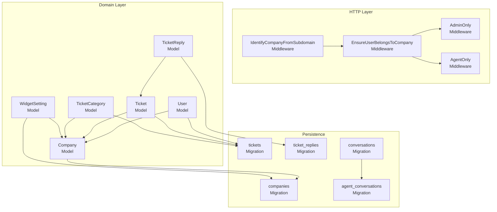
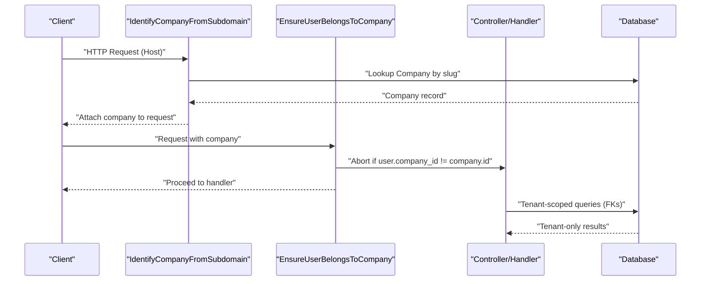
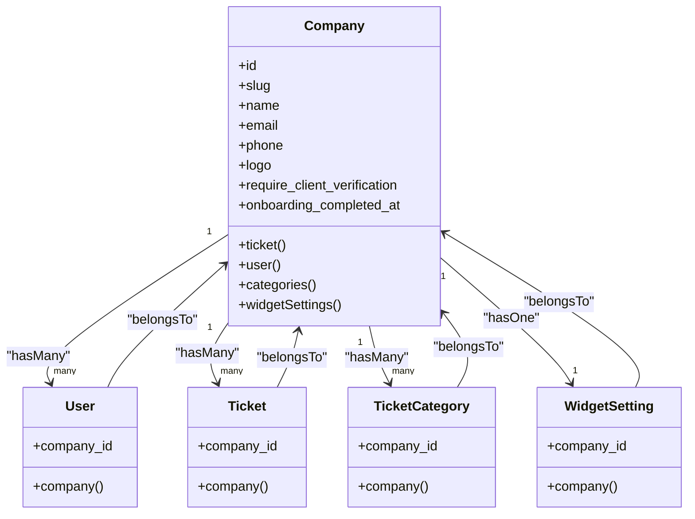
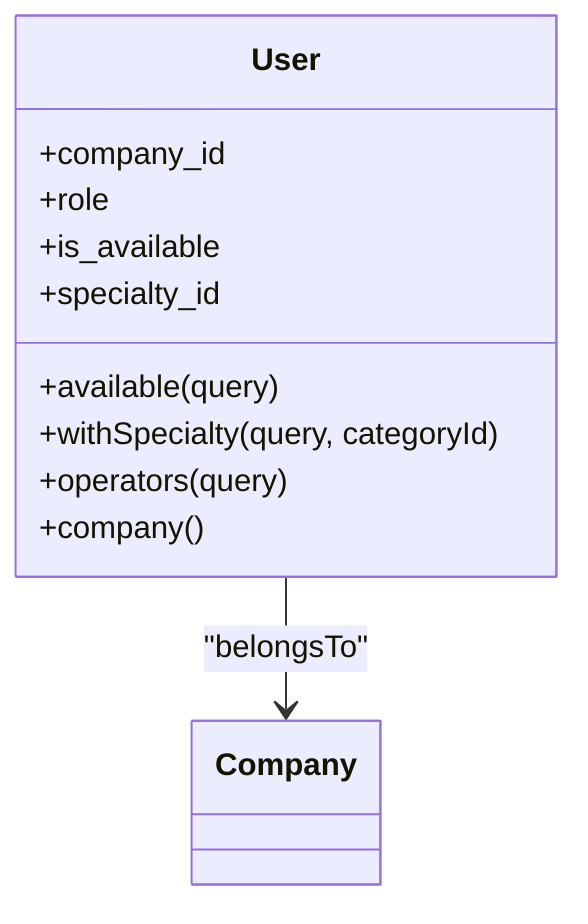
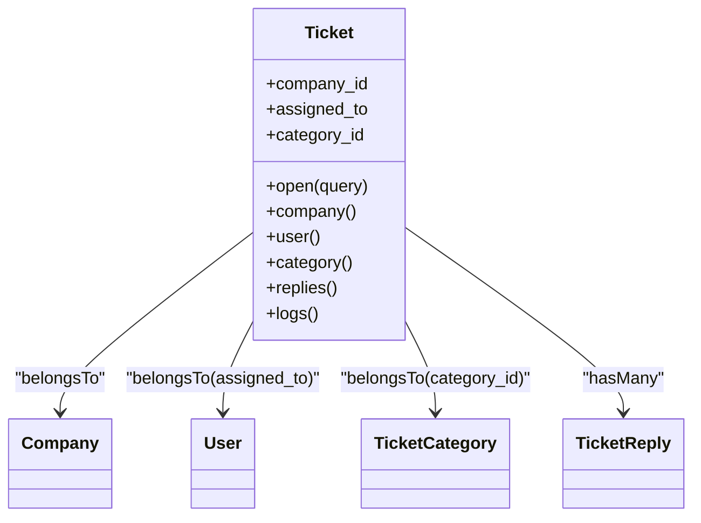
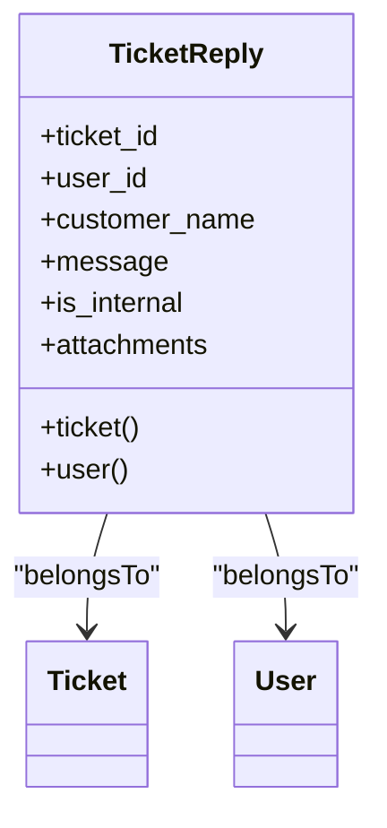
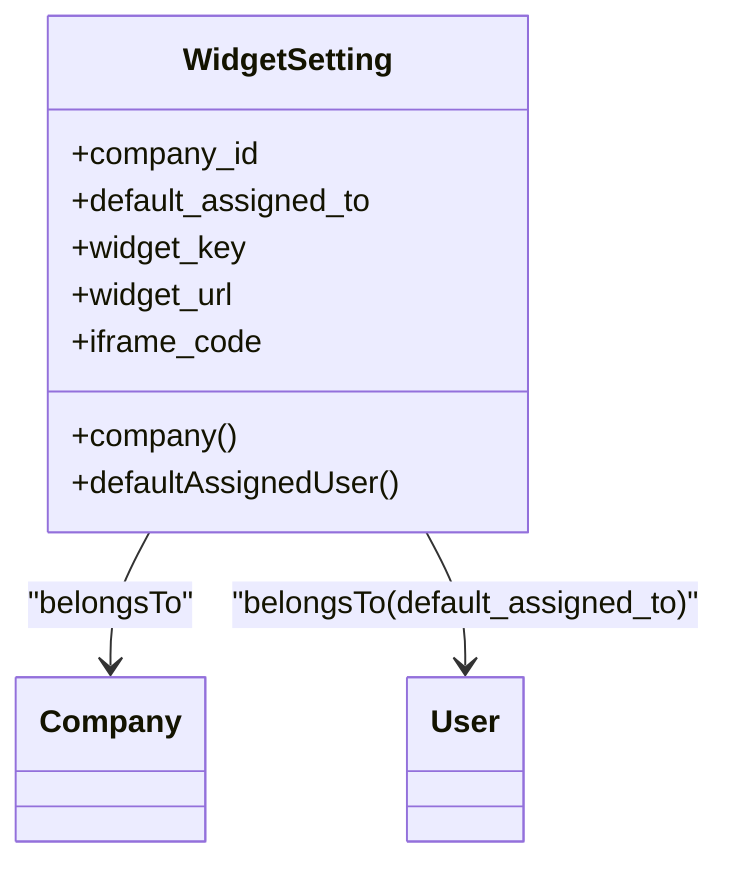
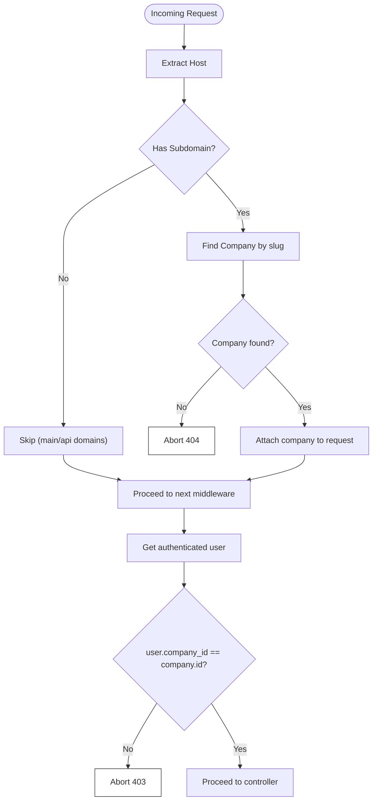
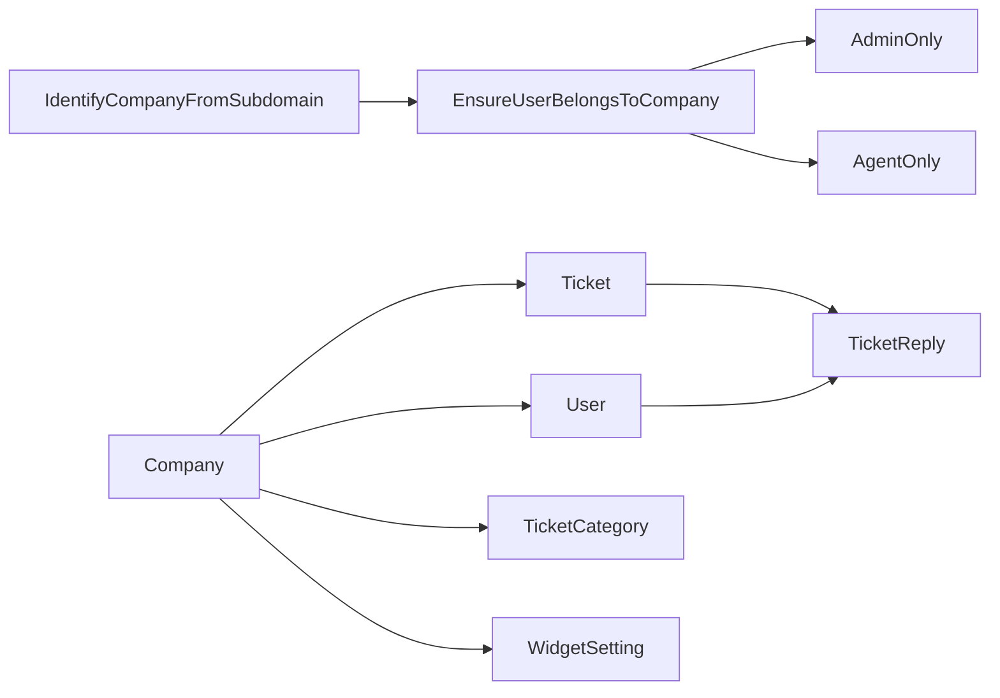
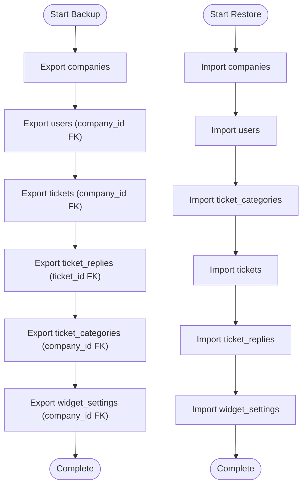

# Data Segregation Strategies

<cite>
**Referenced Files in This Document**
- [Company.php](file://app/Models/Company.php)
- [User.php](file://app/Models/User.php)
- [Ticket.php](file://app/Models/Ticket.php)
- [TicketCategory.php](file://app/Models/TicketCategory.php)
- [TicketReply.php](file://app/Models/TicketReply.php)
- [WidgetSetting.php](file://app/Models/WidgetSetting.php)
- [IdentifyCompanyFromSubdomain.php](file://app/Http/Middleware/IdentifyCompanyFromSubdomain.php)
- [EnsureUserBelongsToCompany.php](file://app/Http/Middleware/EnsureUserBelongsToCompany.php)
- [AdminOnly.php](file://app/Http/Middleware/AdminOnly.php)
- [AgentOnly.php](file://app/Http/Middleware/AgentOnly.php)
- [2026_02_01_224200_create_companies_table.php](file://database/migrations/2026_02_01_224200_create_companies_table.php)
- [2026_02_01_224222_create_tickets_table.php](file://database/migrations/2026_02_01_224222_create_tickets_table.php)
- [2026_02_01_224225_create_ticket_replies_table.php](file://database/migrations/2026_02_01_224225_create_ticket_replies_table.php)
- [2026_03_08_041644_create_conversations_table.php](file://database/migrations/2026_03_08_041644_create_conversations_table.php)
- [2026_03_10_065534_create_agent_conversations_table.php](file://database/migrations/2026_03_10_065534_create_agent_conversations_table.php)
- [2026_03_07_151242_update_user_role_to_operator.php](file://database/migrations/2026_03_07_151242_update_user_role_to_operator.php)
- [2026_03_08_171157_add_specialty_and_availability_to_users_table.php](file://database/migrations/2026_03_08_171157_add_specialty_and_availability_to_users_table.php)
- [DatabaseSeeder.php](file://database/seeders/DatabaseSeeder.php)
- [security-issues.md](file://security-issues.md)
</cite>

## Table of Contents
1. [Introduction](#introduction)
2. [Project Structure](#project-structure)
3. [Core Components](#core-components)
4. [Architecture Overview](#architecture-overview)
5. [Detailed Component Analysis](#detailed-component-analysis)
6. [Dependency Analysis](#dependency-analysis)
7. [Performance Considerations](#performance-considerations)
8. [Backup and Migration Strategies](#backup-and-migration-strategies)
9. [Troubleshooting Guide](#troubleshooting-guide)
10. [Conclusion](#conclusion)

## Introduction
This document details the data segregation strategies that ensure complete tenant isolation across companies. It explains how foreign key relationships, middleware-driven scoping, and model behaviors prevent cross-tenant data access. It also covers database design patterns, automatic query scoping, examples of model relationships and scopes, and operational strategies for backups and migrations that preserve segregation. Finally, it addresses performance implications and optimization techniques for large-scale deployments.

## Project Structure
The system separates tenants (companies) via:
- A dedicated Company entity with unique slugs and per-tenant records.
- Foreign keys on tenant-scoped tables linking to the Company.id.
- Middleware that identifies the tenant from the subdomain and enforces user-company membership.
- Model relationships and scopes that consistently bind queries to the current tenant.



**Diagram sources**
- [IdentifyCompanyFromSubdomain.php:1-54](file://app/Http/Middleware/IdentifyCompanyFromSubdomain.php#L1-L54)
- [EnsureUserBelongsToCompany.php:1-39](file://app/Http/Middleware/EnsureUserBelongsToCompany.php#L1-L39)
- [AdminOnly.php:1-25](file://app/Http/Middleware/AdminOnly.php#L1-L25)
- [AgentOnly.php:1-25](file://app/Http/Middleware/AgentOnly.php#L1-L25)
- [Company.php:1-47](file://app/Models/Company.php#L1-L47)
- [User.php:1-137](file://app/Models/User.php#L1-L137)
- [Ticket.php:1-64](file://app/Models/Ticket.php#L1-L64)
- [TicketCategory.php:1-14](file://app/Models/TicketCategory.php#L1-L14)
- [TicketReply.php:1-39](file://app/Models/TicketReply.php#L1-L39)
- [WidgetSetting.php:1-71](file://app/Models/WidgetSetting.php#L1-L71)
- [2026_02_01_224200_create_companies_table.php:1-41](file://database/migrations/2026_02_01_224200_create_companies_table.php#L1-L41)
- [2026_02_01_224222_create_tickets_table.php:1-62](file://database/migrations/2026_02_01_224222_create_tickets_table.php#L1-L62)
- [2026_02_01_224225_create_ticket_replies_table.php:1-35](file://database/migrations/2026_02_01_224225_create_ticket_replies_table.php#L1-L35)
- [2026_03_08_041644_create_conversations_table.php:1-30](file://database/migrations/2026_03_08_041644_create_conversations_table.php#L1-L30)
- [2026_03_10_065534_create_agent_conversations_table.php:1-51](file://database/migrations/2026_03_10_065534_create_agent_conversations_table.php#L1-L51)

**Section sources**
- [IdentifyCompanyFromSubdomain.php:1-54](file://app/Http/Middleware/IdentifyCompanyFromSubdomain.php#L1-L54)
- [EnsureUserBelongsToCompany.php:1-39](file://app/Http/Middleware/EnsureUserBelongsToCompany.php#L1-L39)
- [Company.php:1-47](file://app/Models/Company.php#L1-L47)
- [User.php:1-137](file://app/Models/User.php#L1-L137)
- [Ticket.php:1-64](file://app/Models/Ticket.php#L1-L64)
- [TicketReply.php:1-39](file://app/Models/TicketReply.php#L1-L39)
- [WidgetSetting.php:1-71](file://app/Models/WidgetSetting.php#L1-L71)
- [2026_02_01_224200_create_companies_table.php:1-41](file://database/migrations/2026_02_01_224200_create_companies_table.php#L1-L41)
- [2026_02_01_224222_create_tickets_table.php:1-62](file://database/migrations/2026_02_01_224222_create_tickets_table.php#L1-L62)
- [2026_02_01_224225_create_ticket_replies_table.php:1-35](file://database/migrations/2026_02_01_224225_create_ticket_replies_table.php#L1-L35)
- [2026_03_08_041644_create_conversations_table.php:1-30](file://database/migrations/2026_03_08_041644_create_conversations_table.php#L1-L30)
- [2026_03_10_065534_create_agent_conversations_table.php:1-51](file://database/migrations/2026_03_10_065534_create_agent_conversations_table.php#L1-L51)

## Core Components
- Tenant identification and scoping:
  - Subdomain parsing resolves the Company by slug and attaches it to the request.
  - A user-company membership check ensures only authorized users operate within a tenant’s context.
- Tenant-scoped models:
  - Company, User, Ticket, TicketReply, TicketCategory, WidgetSetting define foreign keys to Company.id.
  - Relationships enforce referential integrity and enable automatic joins scoped to the tenant.
- Role-based access enforcement:
  - AdminOnly and AgentOnly middlewares gate access by role within the current tenant context.

**Section sources**
- [IdentifyCompanyFromSubdomain.php:1-54](file://app/Http/Middleware/IdentifyCompanyFromSubdomain.php#L1-L54)
- [EnsureUserBelongsToCompany.php:1-39](file://app/Http/Middleware/EnsureUserBelongsToCompany.php#L1-L39)
- [AdminOnly.php:1-25](file://app/Http/Middleware/AdminOnly.php#L1-L25)
- [AgentOnly.php:1-25](file://app/Http/Middleware/AgentOnly.php#L1-L25)
- [Company.php:1-47](file://app/Models/Company.php#L1-L47)
- [User.php:1-137](file://app/Models/User.php#L1-L137)
- [Ticket.php:1-64](file://app/Models/Ticket.php#L1-L64)
- [TicketReply.php:1-39](file://app/Models/TicketReply.php#L1-L39)
- [WidgetSetting.php:1-71](file://app/Models/WidgetSetting.php#L1-L71)

## Architecture Overview
Tenant isolation is enforced at three layers:
- Transport and routing: subdomain determines tenant.
- Authorization: user must belong to the resolved tenant.
- Persistence: foreign keys and relationships bind all data to a single tenant.



**Diagram sources**
- [IdentifyCompanyFromSubdomain.php:1-54](file://app/Http/Middleware/IdentifyCompanyFromSubdomain.php#L1-L54)
- [EnsureUserBelongsToCompany.php:1-39](file://app/Http/Middleware/EnsureUserBelongsToCompany.php#L1-L39)

## Detailed Component Analysis

### Company Model and Relationships
- The Company model defines primary relationships to Users, Tickets, TicketCategories, and WidgetSettings via foreign keys.
- Route key is slug, enabling tenant-aware URLs.



**Diagram sources**
- [Company.php:1-47](file://app/Models/Company.php#L1-L47)
- [User.php:1-137](file://app/Models/User.php#L1-L137)
- [Ticket.php:1-64](file://app/Models/Ticket.php#L1-L64)
- [TicketCategory.php:1-14](file://app/Models/TicketCategory.php#L1-L14)
- [WidgetSetting.php:1-71](file://app/Models/WidgetSetting.php#L1-L71)

**Section sources**
- [Company.php:1-47](file://app/Models/Company.php#L1-L47)

### User Model and Scopes
- Users belong to a Company via foreign key.
- Roles are constrained to admin/operator.
- Utility scopes support availability and specialty filtering for operators.



**Diagram sources**
- [User.php:1-137](file://app/Models/User.php#L1-L137)
- [Company.php:1-47](file://app/Models/Company.php#L1-L47)

**Section sources**
- [User.php:1-137](file://app/Models/User.php#L1-L137)
- [2026_03_07_151242_update_user_role_to_operator.php:1-35](file://database/migrations/2026_03_07_151242_update_user_role_to_operator.php#L1-L35)
- [2026_03_08_171157_add_specialty_and_availability_to_users_table.php:1-42](file://database/migrations/2026_03_08_171157_add_specialty_and_availability_to_users_table.php#L1-L42)

### Ticket Model and Scopes
- Tickets belong to a Company and optionally to a User (assignee) and a TicketCategory.
- Includes an open-status scope for convenience.



**Diagram sources**
- [Ticket.php:1-64](file://app/Models/Ticket.php#L1-L64)
- [Company.php:1-47](file://app/Models/Company.php#L1-L47)
- [User.php:1-137](file://app/Models/User.php#L1-L137)
- [TicketCategory.php:1-14](file://app/Models/TicketCategory.php#L1-L14)
- [TicketReply.php:1-39](file://app/Models/TicketReply.php#L1-L39)

**Section sources**
- [Ticket.php:1-64](file://app/Models/Ticket.php#L1-L64)

### TicketReply Model
- Replies belong to a Ticket and optionally to a User or a customer name.
- Supports internal vs public replies and attachments.



**Diagram sources**
- [TicketReply.php:1-39](file://app/Models/TicketReply.php#L1-L39)
- [Ticket.php:1-64](file://app/Models/Ticket.php#L1-L64)
- [User.php:1-137](file://app/Models/User.php#L1-L137)

**Section sources**
- [TicketReply.php:1-39](file://app/Models/TicketReply.php#L1-L39)

### WidgetSetting Model
- Per-company widget configuration with a generated key and computed URL.
- Belongs to Company and optionally to a default assigned User.



**Diagram sources**
- [WidgetSetting.php:1-71](file://app/Models/WidgetSetting.php#L1-L71)
- [Company.php:1-47](file://app/Models/Company.php#L1-L47)
- [User.php:1-137](file://app/Models/User.php#L1-L137)

**Section sources**
- [WidgetSetting.php:1-71](file://app/Models/WidgetSetting.php#L1-L71)

### Middleware: Tenant Identification and Membership
- IdentifyCompanyFromSubdomain extracts the subdomain, resolves Company by slug, and attaches it to the request.
- EnsureUserBelongsToCompany verifies that the authenticated user belongs to the resolved company.
- AdminOnly and AgentOnly enforce role-based access within the tenant context.



**Diagram sources**
- [IdentifyCompanyFromSubdomain.php:1-54](file://app/Http/Middleware/IdentifyCompanyFromSubdomain.php#L1-L54)
- [EnsureUserBelongsToCompany.php:1-39](file://app/Http/Middleware/EnsureUserBelongsToCompany.php#L1-L39)

**Section sources**
- [IdentifyCompanyFromSubdomain.php:1-54](file://app/Http/Middleware/IdentifyCompanyFromSubdomain.php#L1-L54)
- [EnsureUserBelongsToCompany.php:1-39](file://app/Http/Middleware/EnsureUserBelongsToCompany.php#L1-L39)
- [AdminOnly.php:1-25](file://app/Http/Middleware/AdminOnly.php#L1-L25)
- [AgentOnly.php:1-25](file://app/Http/Middleware/AgentOnly.php#L1-L25)

### Database Design Patterns for Tenant Isolation
- Single-tenant tables:
  - companies: stores tenant metadata and unique slug.
  - tickets: includes company_id and indexes for performance.
  - ticket_replies: includes ticket_id and optional user_id/customer_name.
  - conversations and agent_conversations: separate AI-related tables without company_id.
- Foreign key constraints:
  - Users, Tickets, TicketCategories, and WidgetSettings link to Company.id.
  - TicketReplies link to Tickets; Users link to TicketCategories via specialty_id.
- Indexes:
  - Primary and composite indexes on frequently filtered/sorted columns (e.g., slug, email, created_at, status, priority, assigned_to, verified).

```mermaid
erDiagram
COMPANIES {
bigint id PK
string slug UK
string name
string email
string phone
string logo
boolean require_client_verification
timestamp onboarding_completed_at
timestamps
softdeletes
}
USERS {
bigint id PK
bigint company_id FK
enum role
boolean is_available
bigint specialty_id FK
integer assigned_tickets_count
timestamps
softdeletes
}
TICKETS {
bigint id PK
bigint company_id FK
string ticket_number UK
string customer_name
string customer_email
string customer_phone
string subject
text description
enum status
enum priority
bigint assigned_to FK
bigint category_id FK
boolean verified
string verification_token UK
timestamps
timestamp resolved_at
timestamp closed_at
softdeletes
}
TICKET_REPLIES {
bigint id PK
bigint ticket_id FK
bigint user_id FK
string customer_name
text message
boolean is_internal
timestamps
}
TICKET_CATEGORIES {
bigint id PK
bigint company_id FK
string name
timestamps
}
WIDGET_SETTINGS {
bigint id PK
bigint company_id FK
string widget_key UK
boolean is_active
boolean require_phone
boolean show_category
bigint default_assigned_to FK
timestamps
}
COMPANIES ||--o{ USERS : "hasMany"
COMPANIES ||--o{ TICKETS : "hasMany"
COMPANIES ||--o{ TICKET_CATEGORIES : "hasMany"
COMPANIES ||--o{ WIDGET_SETTINGS : "hasOne"
USERS ||--o{ TICKET_REPLIES : "hasMany"
TICKETS ||--o{ TICKET_REPLIES : "hasMany"
TICKET_CATEGORIES ||--o{ USERS : "belongsToMany(via category_user)"
```

**Diagram sources**
- [2026_02_01_224200_create_companies_table.php:1-41](file://database/migrations/2026_02_01_224200_create_companies_table.php#L1-L41)
- [2026_02_01_224222_create_tickets_table.php:1-62](file://database/migrations/2026_02_01_224222_create_tickets_table.php#L1-L62)
- [2026_02_01_224225_create_ticket_replies_table.php:1-35](file://database/migrations/2026_02_01_224225_create_ticket_replies_table.php#L1-L35)
- [Ticket.php:1-64](file://app/Models/Ticket.php#L1-L64)
- [TicketReply.php:1-39](file://app/Models/TicketReply.php#L1-L39)
- [TicketCategory.php:1-14](file://app/Models/TicketCategory.php#L1-L14)
- [WidgetSetting.php:1-71](file://app/Models/WidgetSetting.php#L1-L71)
- [User.php:1-137](file://app/Models/User.php#L1-L137)

**Section sources**
- [2026_02_01_224200_create_companies_table.php:1-41](file://database/migrations/2026_02_01_224200_create_companies_table.php#L1-L41)
- [2026_02_01_224222_create_tickets_table.php:1-62](file://database/migrations/2026_02_01_224222_create_tickets_table.php#L1-L62)
- [2026_02_01_224225_create_ticket_replies_table.php:1-35](file://database/migrations/2026_02_01_224225_create_ticket_replies_table.php#L1-L35)
- [Ticket.php:1-64](file://app/Models/Ticket.php#L1-L64)
- [TicketReply.php:1-39](file://app/Models/TicketReply.php#L1-L39)
- [TicketCategory.php:1-14](file://app/Models/TicketCategory.php#L1-L14)
- [WidgetSetting.php:1-71](file://app/Models/WidgetSetting.php#L1-L71)
- [User.php:1-137](file://app/Models/User.php#L1-L137)

## Dependency Analysis
- Control flow dependencies:
  - IdentifyCompanyFromSubdomain must run before EnsureUserBelongsToCompany.
  - EnsureUserBelongsToCompany must run before role-based middlewares (AdminOnly, AgentOnly).
- Model dependencies:
  - All tenant-scoped models depend on Company via foreign keys.
  - Ticket depends on User (assignee) and TicketCategory; TicketReply depends on Ticket and optionally User.
- Database dependencies:
  - Foreign keys enforce referential integrity.
  - Indexes optimize tenant-scoped queries.



**Diagram sources**
- [IdentifyCompanyFromSubdomain.php:1-54](file://app/Http/Middleware/IdentifyCompanyFromSubdomain.php#L1-L54)
- [EnsureUserBelongsToCompany.php:1-39](file://app/Http/Middleware/EnsureUserBelongsToCompany.php#L1-L39)
- [AdminOnly.php:1-25](file://app/Http/Middleware/AdminOnly.php#L1-L25)
- [AgentOnly.php:1-25](file://app/Http/Middleware/AgentOnly.php#L1-L25)
- [Company.php:1-47](file://app/Models/Company.php#L1-L47)
- [User.php:1-137](file://app/Models/User.php#L1-L137)
- [Ticket.php:1-64](file://app/Models/Ticket.php#L1-L64)
- [TicketReply.php:1-39](file://app/Models/TicketReply.php#L1-L39)
- [TicketCategory.php:1-14](file://app/Models/TicketCategory.php#L1-L14)
- [WidgetSetting.php:1-71](file://app/Models/WidgetSetting.php#L1-L71)

**Section sources**
- [IdentifyCompanyFromSubdomain.php:1-54](file://app/Http/Middleware/IdentifyCompanyFromSubdomain.php#L1-L54)
- [EnsureUserBelongsToCompany.php:1-39](file://app/Http/Middleware/EnsureUserBelongsToCompany.php#L1-L39)
- [AdminOnly.php:1-25](file://app/Http/Middleware/AdminOnly.php#L1-L25)
- [AgentOnly.php:1-25](file://app/Http/Middleware/AgentOnly.php#L1-L25)
- [Company.php:1-47](file://app/Models/Company.php#L1-L47)
- [User.php:1-137](file://app/Models/User.php#L1-L137)
- [Ticket.php:1-64](file://app/Models/Ticket.php#L1-L64)
- [TicketReply.php:1-39](file://app/Models/TicketReply.php#L1-L39)
- [TicketCategory.php:1-14](file://app/Models/TicketCategory.php#L1-L14)
- [WidgetSetting.php:1-71](file://app/Models/WidgetSetting.php#L1-L71)

## Performance Considerations
- Indexing strategy:
  - Companies: slug, email, created_at, and composite index for filtered queries.
  - Tickets: company_id, ticket_number, customer_email, status, priority, assigned_to, verified, created_at.
  - TicketReplies: ticket_id, user_id, created_at.
- Query patterns:
  - All tenant-scoped queries rely on foreign keys; adding indexes on foreign keys and frequently filtered columns improves performance.
- Caching:
  - User model observers clear company-scoped caches on updates/deletes to keep cached operator lists and categories consistent.

**Section sources**
- [2026_02_01_224200_create_companies_table.php:1-41](file://database/migrations/2026_02_01_224200_create_companies_table.php#L1-L41)
- [2026_02_01_224222_create_tickets_table.php:1-62](file://database/migrations/2026_02_01_224222_create_tickets_table.php#L1-L62)
- [2026_02_01_224225_create_ticket_replies_table.php:1-35](file://database/migrations/2026_02_01_224225_create_ticket_replies_table.php#L1-L35)
- [User.php:123-136](file://app/Models/User.php#L123-L136)

## Backup and Migration Strategies
- Preserve tenant isolation during backups:
  - Back up per-tenant tables (companies, users, tickets, ticket_replies, ticket_categories, widget_settings) as a unit.
  - Ensure foreign key constraints remain intact; restore in dependency order (parents first).
- Migrations:
  - Apply migrations in order; schema changes affecting foreign keys or indexes must be carefully sequenced.
  - Role normalization and specialty/availability additions are examples of schema updates that preserve tenant boundaries.
- Seed data:
  - Seeders create a test company and users; ensure company_id is set correctly to maintain isolation.



**Diagram sources**
- [2026_02_01_224200_create_companies_table.php:1-41](file://database/migrations/2026_02_01_224200_create_companies_table.php#L1-L41)
- [2026_02_01_224222_create_tickets_table.php:1-62](file://database/migrations/2026_02_01_224222_create_tickets_table.php#L1-L62)
- [2026_02_01_224225_create_ticket_replies_table.php:1-35](file://database/migrations/2026_02_01_224225_create_ticket_replies_table.php#L1-L35)
- [DatabaseSeeder.php:1-42](file://database/seeders/DatabaseSeeder.php#L1-L42)

**Section sources**
- [2026_02_01_224200_create_companies_table.php:1-41](file://database/migrations/2026_02_01_224200_create_companies_table.php#L1-L41)
- [2026_02_01_224222_create_tickets_table.php:1-62](file://database/migrations/2026_02_01_224222_create_tickets_table.php#L1-L62)
- [2026_02_01_224225_create_ticket_replies_table.php:1-35](file://database/migrations/2026_02_01_224225_create_ticket_replies_table.php#L1-L35)
- [DatabaseSeeder.php:1-42](file://database/seeders/DatabaseSeeder.php#L1-L42)

## Troubleshooting Guide
- Cross-tenant access attempts:
  - If a request returns unexpected data, verify that IdentifyCompanyFromSubdomain resolved the correct company and EnsureUserBelongsToCompany validated the user’s membership.
- Role-based access errors:
  - AdminOnly and AgentOnly redirect unauthorized users; confirm the user’s role matches expectations within the current tenant.
- Data leakage risks:
  - Review foreign keys and indexes on tenant-scoped tables; ensure no unscoped queries bypass middleware.
- Security remediation:
  - Address mass assignment vulnerabilities and strengthen company ownership checks on sensitive operations.

**Section sources**
- [IdentifyCompanyFromSubdomain.php:1-54](file://app/Http/Middleware/IdentifyCompanyFromSubdomain.php#L1-L54)
- [EnsureUserBelongsToCompany.php:1-39](file://app/Http/Middleware/EnsureUserBelongsToCompany.php#L1-L39)
- [AdminOnly.php:1-25](file://app/Http/Middleware/AdminOnly.php#L1-L25)
- [AgentOnly.php:1-25](file://app/Http/Middleware/AgentOnly.php#L1-L25)
- [security-issues.md:191-205](file://security-issues.md#L191-L205)

## Conclusion
Tenant isolation is achieved through a combination of subdomain-based tenant resolution, strict user-company membership checks, and robust foreign key relationships. The database design enforces per-tenant boundaries, while middleware and model relationships ensure that queries remain scoped to the current tenant. Proper indexing, caching, and migration strategies further support reliability and performance at scale.