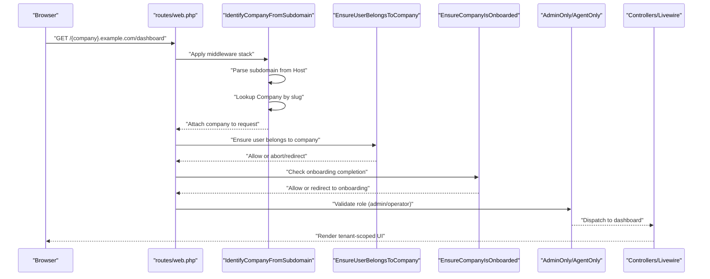
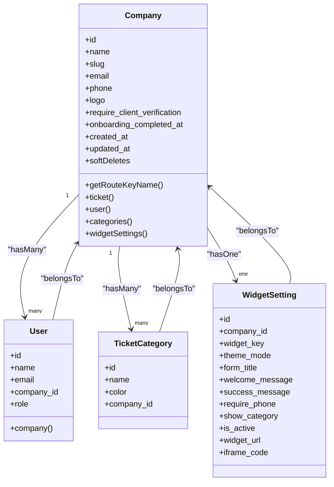
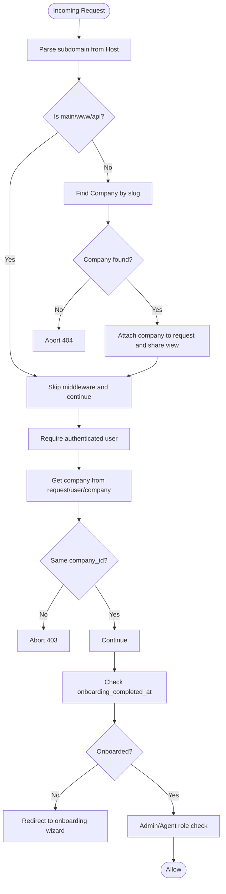
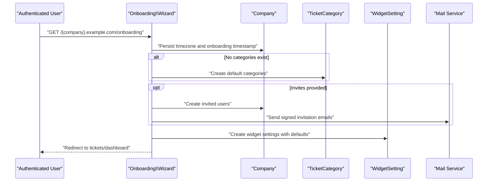
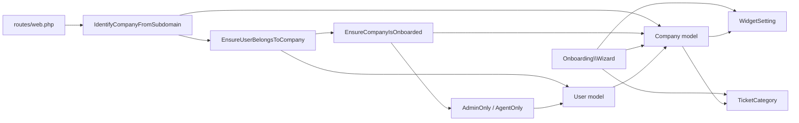

# Multi-company Architecture

<cite>
**Referenced Files in This Document**
- [Company.php](file://app/Models/Company.php)
- [User.php](file://app/Models/User.php)
- [WidgetSetting.php](file://app/Models/WidgetSetting.php)
- [IdentifyCompanyFromSubdomain.php](file://app/Http/Middleware/IdentifyCompanyFromSubdomain.php)
- [EnsureUserBelongsToCompany.php](file://app/Http/Middleware/EnsureUserBelongsToCompany.php)
- [EnsureCompanyIsOnboarded.php](file://app/Http/Middleware/EnsureCompanyIsOnboarded.php)
- [AdminOnly.php](file://app/Http/Middleware/AdminOnly.php)
- [AgentOnly.php](file://app/Http/Middleware/AgentOnly.php)
- [web.php](file://routes/web.php)
- [2026_02_01_224200_create_companies_table.php](file://database/migrations/2026_02_01_224200_create_companies_table.php)
- [2026_03_07_022013_create_email_verification_codes_table.php](file://database/migrations/2026_03_07_022013_create_email_verification_codes_table.php)
- [CompanyFactory.php](file://database/factories/CompanyFactory.php)
- [Wizard.php](file://app/Livewire/Onboarding/Wizard.php)
- [app.php](file://config/app.php)
</cite>

## Table of Contents
1. [Introduction](#introduction)
2. [Project Structure](#project-structure)
3. [Core Components](#core-components)
4. [Architecture Overview](#architecture-overview)
5. [Detailed Component Analysis](#detailed-component-analysis)
6. [Dependency Analysis](#dependency-analysis)
7. [Performance Considerations](#performance-considerations)
8. [Troubleshooting Guide](#troubleshooting-guide)
9. [Conclusion](#conclusion)
10. [Appendices](#appendices)

## Introduction
This document describes the multi-company architecture centered on subdomain-based multi-tenancy. Each company is represented by a dedicated subdomain (for example, company1.helpdesk-system.test), and the system enforces strict tenant isolation via middleware and model relationships. The architecture ensures that:
- Requests are routed to the correct company based on the subdomain.
- Users are validated and restricted to their own company.
- Onboarding status is enforced before granting access to core features.
- Company-specific settings, themes, and configurations are isolated per tenant.
- Provisioning of new companies includes default categories, widget settings, and optional team invitations.

## Project Structure
The multi-tenant system spans models, middleware, routes, and configuration:
- Models define the tenant boundary (Company) and relationships (User, WidgetSetting).
- Middleware enforces company identification, user-company binding, onboarding, and role-based access.
- Routes bind subdomain patterns and apply middleware stacks.
- Configuration defines the base domain and URL helpers used across tenant-aware components.

```mermaid
graph TB
subgraph "Routing Layer"
RWeb["routes/web.php<br/>Subdomain routes"]
end
subgraph "Middleware Chain"
M1["IdentifyCompanyFromSubdomain"]
M2["EnsureUserBelongsToCompany"]
M3["EnsureCompanyIsOnboarded"]
M4["AdminOnly / AgentOnly"]
end
subgraph "Domain Models"
CModel["Company model"]
UModel["User model"]
WModel["WidgetSetting model"]
end
RWeb --> M1 --> M2 --> M3 --> M4
M1 --> CModel
M2 --> UModel
M3 --> CModel
M4 --> UModel
CModel <- --> UModel
CModel <- --> WModel
```

**Diagram sources**
- [web.php:70-114](file://routes/web.php#L70-L114)
- [IdentifyCompanyFromSubdomain.php:12-36](file://app/Http/Middleware/IdentifyCompanyFromSubdomain.php#L12-L36)
- [EnsureUserBelongsToCompany.php:11-37](file://app/Http/Middleware/EnsureUserBelongsToCompany.php#L11-L37)
- [EnsureCompanyIsOnboarded.php:16-26](file://app/Http/Middleware/EnsureCompanyIsOnboarded.php#L16-L26)
- [AdminOnly.php:16-23](file://app/Http/Middleware/AdminOnly.php#L16-L23)
- [AgentOnly.php:16-23](file://app/Http/Middleware/AgentOnly.php#L16-L23)
- [Company.php:8-46](file://app/Models/Company.php#L8-L46)
- [User.php:74-77](file://app/Models/User.php#L74-L77)
- [WidgetSetting.php:37-45](file://app/Models/WidgetSetting.php#L37-L45)

**Section sources**
- [web.php:70-114](file://routes/web.php#L70-L114)
- [IdentifyCompanyFromSubdomain.php:12-36](file://app/Http/Middleware/IdentifyCompanyFromSubdomain.php#L12-L36)
- [EnsureUserBelongsToCompany.php:11-37](file://app/Http/Middleware/EnsureUserBelongsToCompany.php#L11-L37)
- [EnsureCompanyIsOnboarded.php:16-26](file://app/Http/Middleware/EnsureCompanyIsOnboarded.php#L16-L26)
- [AdminOnly.php:16-23](file://app/Http/Middleware/AdminOnly.php#L16-L23)
- [AgentOnly.php:16-23](file://app/Http/Middleware/AgentOnly.php#L16-L23)
- [Company.php:8-46](file://app/Models/Company.php#L8-L46)
- [User.php:74-77](file://app/Models/User.php#L74-L77)
- [WidgetSetting.php:37-45](file://app/Models/WidgetSetting.php#L37-L45)

## Core Components
- Company model: Represents a tenant with slug-based routing, relationships to users, categories, and widget settings, and onboarding timestamps.
- User model: Links users to a company and exposes scopes and helpers for roles and availability.
- WidgetSetting model: Stores company-specific widget configuration and generates tenant-aware URLs.
- Middleware chain: Enforces subdomain-based company identification, user-company binding, onboarding gating, and role-based access.
- Routes: Bind subdomain pattern and apply middleware stacks for authenticated, verified, onboarding-gated, and admin/agent-only access.

**Section sources**
- [Company.php:8-46](file://app/Models/Company.php#L8-L46)
- [User.php:74-77](file://app/Models/User.php#L74-L77)
- [WidgetSetting.php:37-45](file://app/Models/WidgetSetting.php#L37-L45)
- [web.php:70-114](file://routes/web.php#L70-L114)

## Architecture Overview
The system uses subdomains to isolate tenants. Requests entering via subdomain.company.example.com are parsed to identify the company, validated for user membership, and gated by onboarding status before allowing access to dashboards and features.



**Diagram sources**
- [web.php:70-114](file://routes/web.php#L70-L114)
- [IdentifyCompanyFromSubdomain.php:12-36](file://app/Http/Middleware/IdentifyCompanyFromSubdomain.php#L12-L36)
- [EnsureUserBelongsToCompany.php:11-37](file://app/Http/Middleware/EnsureUserBelongsToCompany.php#L11-L37)
- [EnsureCompanyIsOnboarded.php:16-26](file://app/Http/Middleware/EnsureCompanyIsOnboarded.php#L16-L26)
- [AdminOnly.php:16-23](file://app/Http/Middleware/AdminOnly.php#L16-L23)
- [AgentOnly.php:16-23](file://app/Http/Middleware/AgentOnly.php#L16-L23)

## Detailed Component Analysis

### Company Model and Tenant Isolation
- Tenant identity: Company is identified by slug and used as the subdomain segment.
- Relationships:
  - One-to-many with User via company_id.
  - One-to-many with TicketCategory via company_id.
  - One-to-one with WidgetSetting via company_id.
- Casts: onboarding_completed_at datetime and require_client_verification boolean.
- Route key: Uses slug for route model binding.



**Diagram sources**
- [Company.php:8-46](file://app/Models/Company.php#L8-L46)
- [User.php:74-77](file://app/Models/User.php#L74-L77)
- [WidgetSetting.php:37-45](file://app/Models/WidgetSetting.php#L37-L45)

**Section sources**
- [Company.php:8-46](file://app/Models/Company.php#L8-L46)
- [2026_02_01_224200_create_companies_table.php:14-30](file://database/migrations/2026_02_01_224200_create_companies_table.php#L14-L30)
- [CompanyFactory.php:17-28](file://database/factories/CompanyFactory.php#L17-L28)

### Middleware Chain: Company Identification, Validation, and Onboarding
- IdentifyCompanyFromSubdomain: Extracts subdomain from Host, ignores www and api, finds Company by slug, attaches to request, and shares with views.
- EnsureUserBelongsToCompany: Requires an authenticated user, retrieves company from request attributes or user/company, and validates company_id match.
- EnsureCompanyIsOnboarded: Redirects unonboarded users (based on onboarding_completed_at) to onboarding wizard unless already in onboarding routes.
- AdminOnly/AgentOnly: Enforce role-based access after authenticated, verified, and company-scoped access.



**Diagram sources**
- [IdentifyCompanyFromSubdomain.php:12-36](file://app/Http/Middleware/IdentifyCompanyFromSubdomain.php#L12-L36)
- [EnsureUserBelongsToCompany.php:11-37](file://app/Http/Middleware/EnsureUserBelongsToCompany.php#L11-L37)
- [EnsureCompanyIsOnboarded.php:16-26](file://app/Http/Middleware/EnsureCompanyIsOnboarded.php#L16-L26)
- [AdminOnly.php:16-23](file://app/Http/Middleware/AdminOnly.php#L16-L23)
- [AgentOnly.php:16-23](file://app/Http/Middleware/AgentOnly.php#L16-L23)

**Section sources**
- [IdentifyCompanyFromSubdomain.php:12-36](file://app/Http/Middleware/IdentifyCompanyFromSubdomain.php#L12-L36)
- [EnsureUserBelongsToCompany.php:11-37](file://app/Http/Middleware/EnsureUserBelongsToCompany.php#L11-L37)
- [EnsureCompanyIsOnboarded.php:16-26](file://app/Http/Middleware/EnsureCompanyIsOnboarded.php#L16-L26)
- [AdminOnly.php:16-23](file://app/Http/Middleware/AdminOnly.php#L16-L23)
- [AgentOnly.php:16-23](file://app/Http/Middleware/AgentOnly.php#L16-L23)

### Company Onboarding Workflow and Provisioning
- Onboarding wizard collects timezone, categories, optional invites, and widget settings.
- On completion, the system persists onboarding timestamp, creates default categories if none exist, provisions widget settings, and optionally invites users with signed URLs.
- Unfinished onboarding can be skipped to apply defaults and proceed.



**Diagram sources**
- [Wizard.php:40-129](file://app/Livewire/Onboarding/Wizard.php#L40-L129)
- [Wizard.php:155-212](file://app/Livewire/Onboarding/Wizard.php#L155-L212)

**Section sources**
- [Wizard.php:40-129](file://app/Livewire/Onboarding/Wizard.php#L40-L129)
- [Wizard.php:155-212](file://app/Livewire/Onboarding/Wizard.php#L155-L212)

### Data Isolation Mechanisms
- Subdomain parsing and company lookup occur early in the middleware chain, ensuring all subsequent handlers operate within the correct tenant context.
- User-company validation prevents cross-tenant access attempts.
- Onboarding gating ensures only onboarded companies can access core features.
- Model relationships enforce foreign keys (company_id) across users, categories, and widget settings, preventing accidental cross-tenant reads/writes.

**Section sources**
- [IdentifyCompanyFromSubdomain.php:12-36](file://app/Http/Middleware/IdentifyCompanyFromSubdomain.php#L12-L36)
- [EnsureUserBelongsToCompany.php:11-37](file://app/Http/Middleware/EnsureUserBelongsToCompany.php#L11-L37)
- [EnsureCompanyIsOnboarded.php:16-26](file://app/Http/Middleware/EnsureCompanyIsOnboarded.php#L16-L26)
- [Company.php:24-37](file://app/Models/Company.php#L24-L37)
- [User.php:74-77](file://app/Models/User.php#L74-L77)
- [WidgetSetting.php:37-45](file://app/Models/WidgetSetting.php#L37-L45)

### Configuration Examples: Subdomains, DNS, and SSL
- Base domain: Defined in configuration with APP_DOMAIN and derived URL helpers.
- Subdomain routing: Routes bound to {company}.{domain} pattern.
- DNS: Configure wildcard DNS (*.example.com) to resolve to your application server; subdomains map to company slugs.
- SSL: Provision certificates for *.example.com to support HTTPS across all subdomains.

Configuration references:
- Domain and URL helpers: [app.php:125-128](file://config/app.php#L125-L128)
- Subdomain routes: [web.php:71](file://routes/web.php#L71)

**Section sources**
- [app.php:125-128](file://config/app.php#L125-L128)
- [web.php:71](file://routes/web.php#L71)

## Dependency Analysis
The middleware chain composes tightly around the Company model and User relationships. The routing layer depends on configuration for the base domain. The onboarding wizard depends on Company relationships to provision categories and widget settings.



**Diagram sources**
- [web.php:70-114](file://routes/web.php#L70-L114)
- [IdentifyCompanyFromSubdomain.php:12-36](file://app/Http/Middleware/IdentifyCompanyFromSubdomain.php#L12-L36)
- [EnsureUserBelongsToCompany.php:11-37](file://app/Http/Middleware/EnsureUserBelongsToCompany.php#L11-L37)
- [EnsureCompanyIsOnboarded.php:16-26](file://app/Http/Middleware/EnsureCompanyIsOnboarded.php#L16-L26)
- [AdminOnly.php:16-23](file://app/Http/Middleware/AdminOnly.php#L16-L23)
- [AgentOnly.php:16-23](file://app/Http/Middleware/AgentOnly.php#L16-L23)
- [Company.php:8-46](file://app/Models/Company.php#L8-L46)
- [User.php:74-77](file://app/Models/User.php#L74-L77)
- [WidgetSetting.php:37-45](file://app/Models/WidgetSetting.php#L37-L45)
- [Wizard.php:40-129](file://app/Livewire/Onboarding/Wizard.php#L40-L129)

**Section sources**
- [web.php:70-114](file://routes/web.php#L70-L114)
- [Company.php:8-46](file://app/Models/Company.php#L8-L46)
- [User.php:74-77](file://app/Models/User.php#L74-L77)
- [WidgetSetting.php:37-45](file://app/Models/WidgetSetting.php#L37-L45)
- [Wizard.php:40-129](file://app/Livewire/Onboarding/Wizard.php#L40-L129)

## Performance Considerations
- Subdomain parsing and company lookup: Minimal overhead; ensure slug index is leveraged.
- Middleware short-circuit: Early aborts reduce unnecessary work.
- Relationship caching: User updates/deletes clear company-scoped caches to keep role/category lists fresh.
- Database indexing: Companies table includes indexes on slug, email, created_at, and composite filters to optimize lookups.

**Section sources**
- [2026_02_01_224200_create_companies_table.php:25-30](file://database/migrations/2026_02_01_224200_create_companies_table.php#L25-L30)
- [User.php:123-135](file://app/Models/User.php#L123-L135)

## Troubleshooting Guide
- Company not found by subdomain:
  - Verify wildcard DNS and that the subdomain resolves to the application.
  - Confirm the company slug exists and is unique.
  - Review subdomain extraction logic and host parsing.
- Access forbidden to company:
  - Ensure the authenticated user’s company_id matches the requested company.
  - Check that the user belongs to the intended company.
- Redirect loops to onboarding:
  - Confirm onboarding_completed_at is set after completing onboarding steps.
  - Avoid accessing onboarding routes when already onboarded.
- Role-based access denied:
  - Verify user role is admin or operator as required.
- Email verification and invites:
  - For link-based verification, ensure signed routes and email delivery are configured.
  - For code-based verification, ensure the codes table exists and is migrated.

**Section sources**
- [IdentifyCompanyFromSubdomain.php:12-36](file://app/Http/Middleware/IdentifyCompanyFromSubdomain.php#L12-L36)
- [EnsureUserBelongsToCompany.php:11-37](file://app/Http/Middleware/EnsureUserBelongsToCompany.php#L11-L37)
- [EnsureCompanyIsOnboarded.php:16-26](file://app/Http/Middleware/EnsureCompanyIsOnboarded.php#L16-L26)
- [AdminOnly.php:16-23](file://app/Http/Middleware/AdminOnly.php#L16-L23)
- [AgentOnly.php:16-23](file://app/Http/Middleware/AgentOnly.php#L16-L23)
- [2026_03_07_022013_create_email_verification_codes_table.php:14-20](file://database/migrations/2026_03_07_022013_create_email_verification_codes_table.php#L14-L20)

## Conclusion
The multi-company system employs subdomain-based multi-tenancy with a robust middleware chain that identifies tenants, validates users, enforces onboarding, and gates access by role. Company-specific settings and relationships are modeled explicitly to ensure isolation and clarity. Provisioning new companies is streamlined through the onboarding wizard, which sets defaults and prepares the tenant for operation.

## Appendices

### Company Model Fields and Relationships
- Fields: name, slug (unique), email, phone, logo, require_client_verification, timestamps, soft deletes.
- Relationships: user(), categories(), widgetSettings().
- Route model binding: slug.

**Section sources**
- [Company.php:8-46](file://app/Models/Company.php#L8-L46)
- [2026_02_01_224200_create_companies_table.php:14-30](file://database/migrations/2026_02_01_224200_create_companies_table.php#L14-L30)

### User Model Roles and Scopes
- Relationships: company(), specialty(), categories(), assignedTickets(), tickets().
- Helpers: isAdmin(), isOperator(), isPendingInvite(), isActive().
- Scopes: available(), withSpecialty(), operators().

**Section sources**
- [User.php:74-77](file://app/Models/User.php#L74-L77)
- [User.php:102-121](file://app/Models/User.php#L102-L121)

### Widget Settings and Tenant URLs
- Fields: widget_key (auto-generated if missing), theme_mode, form_title, welcome_message, success_message, require_phone, show_category, is_active.
- Attributes: widget_url (tenant-aware iframe endpoint), iframe_code.

**Section sources**
- [WidgetSetting.php:13-17](file://app/Models/WidgetSetting.php#L13-L17)
- [WidgetSetting.php:47-69](file://app/Models/WidgetSetting.php#L47-L69)