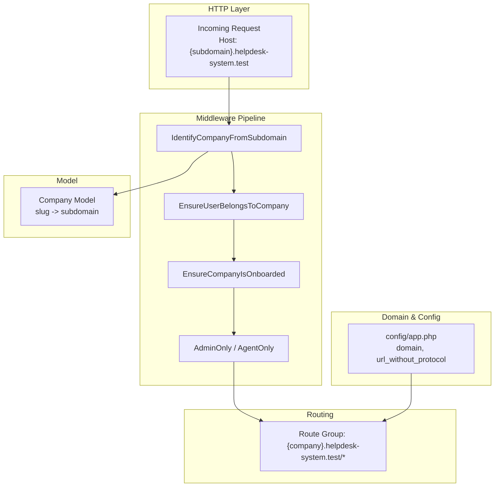
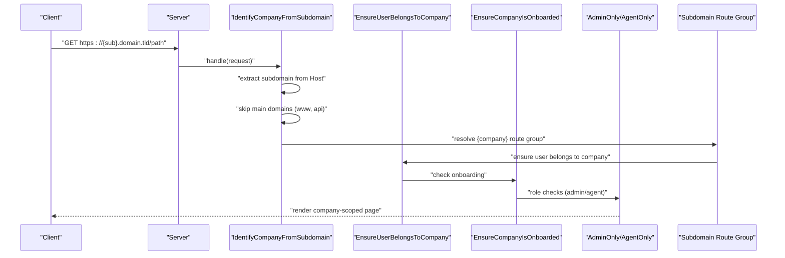
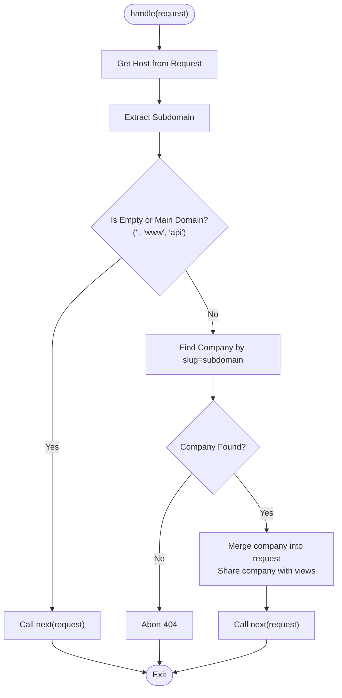
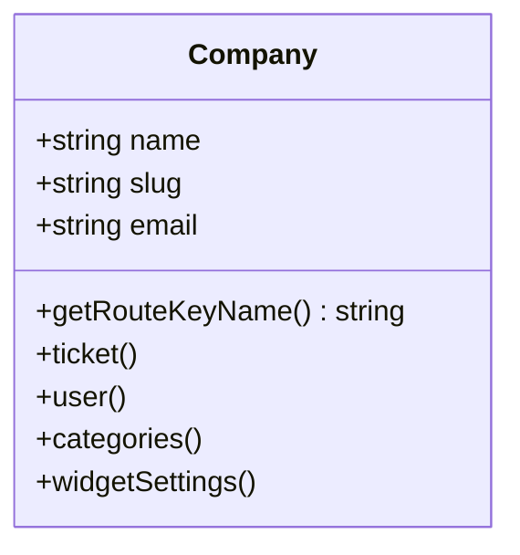
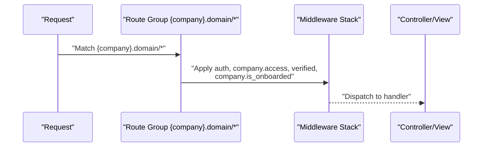
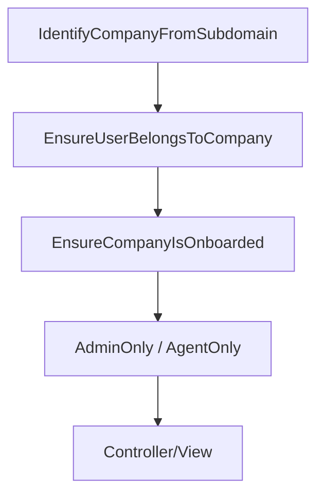
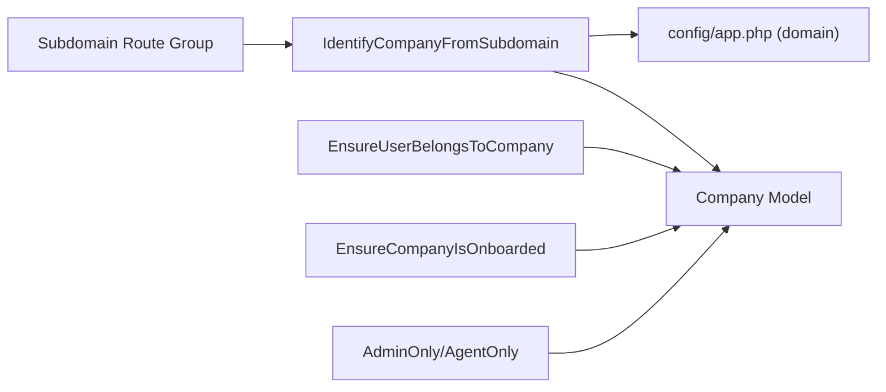

# Subdomain Routing System

<cite>
**Referenced Files in This Document**
- [IdentifyCompanyFromSubdomain.php](file://app/Http/Middleware/IdentifyCompanyFromSubdomain.php)
- [EnsureUserBelongsToCompany.php](file://app/Http/Middleware/EnsureUserBelongsToCompany.php)
- [EnsureCompanyIsOnboarded.php](file://app/Http/Middleware/EnsureCompanyIsOnboarded.php)
- [AdminOnly.php](file://app/Http/Middleware/AdminOnly.php)
- [AgentOnly.php](file://app/Http/Middleware/AgentOnly.php)
- [EnsureUserIsPending.php](file://app/Http/Middleware/EnsureUserIsPending.php)
- [Company.php](file://app/Models/Company.php)
- [app.php](file://config/app.php)
- [web.php](file://routes/web.php)
- [app.php](file://bootstrap/app.php)
- [2026_02_01_224200_create_companies_table.php](file://database/migrations/2026_02_01_224200_create_companies_table.php)
</cite>

## Table of Contents
1. [Introduction](#introduction)
2. [Project Structure](#project-structure)
3. [Core Components](#core-components)
4. [Architecture Overview](#architecture-overview)
5. [Detailed Component Analysis](#detailed-component-analysis)
6. [Dependency Analysis](#dependency-analysis)
7. [Performance Considerations](#performance-considerations)
8. [Troubleshooting Guide](#troubleshooting-guide)
9. [Conclusion](#conclusion)

## Introduction
This document explains the subdomain routing system used to identify companies from incoming requests and route them into the correct company context. It covers how the IdentifyCompanyFromSubdomain middleware extracts the subdomain, resolves it to a company record, attaches company data to the request, and integrates with route groups bound to dynamic subdomains. It also documents supported patterns (including .test domains), middleware execution order, fallback behavior, and operational requirements such as domain configuration and SSL.

## Project Structure
The subdomain routing system spans middleware, model definitions, configuration, and route definitions:
- Middleware: Extracts subdomain, resolves company, and attaches it to the request.
- Routes: Define a subdomain-bound group that applies authentication and access controls.
- Configuration: Provides the base domain used in subdomain route patterns.
- Model: Defines the company entity and its unique slug field used for subdomain matching.

**Diagram sources**
- [IdentifyCompanyFromSubdomain.php:12-36](file://app/Http/Middleware/IdentifyCompanyFromSubdomain.php#L12-L36)
- [EnsureUserBelongsToCompany.php:11-37](file://app/Http/Middleware/EnsureUserBelongsToCompany.php#L11-L37)
- [EnsureCompanyIsOnboarded.php:16-26](file://app/Http/Middleware/EnsureCompanyIsOnboarded.php#L16-L26)
- [AdminOnly.php:16-23](file://app/Http/Middleware/AdminOnly.php#L16-L23)
- [AgentOnly.php:16-23](file://app/Http/Middleware/AgentOnly.php#L16-L23)
- [web.php:71-114](file://routes/web.php#L71-L114)
- [app.php:125-128](file://config/app.php#L125-L128)
- [Company.php:14-17](file://app/Models/Company.php#L14-L17)

**Section sources**
- [web.php:71-114](file://routes/web.php#L71-L114)
- [app.php:125-128](file://config/app.php#L125-L128)
- [IdentifyCompanyFromSubdomain.php:12-36](file://app/Http/Middleware/IdentifyCompanyFromSubdomain.php#L12-L36)
- [Company.php:14-17](file://app/Models/Company.php#L14-L17)

## Core Components
- IdentifyCompanyFromSubdomain: Extracts subdomain from the host, supports .test domains, skips main domains (e.g., www, api), finds a company by slug, and attaches it to the request and shares it with views.
- EnsureUserBelongsToCompany: Validates that the authenticated user belongs to the resolved company context.
- EnsureCompanyIsOnboarded: Enforces onboarding completion before allowing access to onboarded routes.
- AdminOnly / AgentOnly: Role-based access checks against the current company context.
- Company Model: Uses slug as the route key, enabling subdomain-based identification.
- Route Group: Binds routes to {company}.domain pattern and applies middleware stacks.
- Configuration: Supplies the base domain used in subdomain route patterns.

**Section sources**
- [IdentifyCompanyFromSubdomain.php:12-36](file://app/Http/Middleware/IdentifyCompanyFromSubdomain.php#L12-L36)
- [EnsureUserBelongsToCompany.php:11-37](file://app/Http/Middleware/EnsureUserBelongsToCompany.php#L11-L37)
- [EnsureCompanyIsOnboarded.php:16-26](file://app/Http/Middleware/EnsureCompanyIsOnboarded.php#L16-L26)
- [AdminOnly.php:16-23](file://app/Http/Middleware/AdminOnly.php#L16-L23)
- [AgentOnly.php:16-23](file://app/Http/Middleware/AgentOnly.php#L16-L23)
- [Company.php:14-17](file://app/Models/Company.php#L14-L17)
- [web.php:71-114](file://routes/web.php#L71-L114)
- [app.php:125-128](file://config/app.php#L125-L128)

## Architecture Overview
The subdomain routing architecture ties together request parsing, company resolution, middleware enforcement, and route grouping.

**Diagram sources**
- [IdentifyCompanyFromSubdomain.php:12-36](file://app/Http/Middleware/IdentifyCompanyFromSubdomain.php#L12-L36)
- [EnsureUserBelongsToCompany.php:11-37](file://app/Http/Middleware/EnsureUserBelongsToCompany.php#L11-L37)
- [EnsureCompanyIsOnboarded.php:16-26](file://app/Http/Middleware/EnsureCompanyIsOnboarded.php#L16-L26)
- [AdminOnly.php:16-23](file://app/Http/Middleware/AdminOnly.php#L16-L23)
- [AgentOnly.php:16-23](file://app/Http/Middleware/AgentOnly.php#L16-L23)
- [web.php:71-114](file://routes/web.php#L71-L114)

## Detailed Component Analysis

### IdentifyCompanyFromSubdomain Middleware
Purpose:
- Extract the subdomain from the incoming request’s host.
- Support .test development domains by recognizing three-part hosts ending in .test.
- Skip resolution for main domains (e.g., www, api).
- Resolve a company by its slug and attach it to the request and share it with views.

Execution flow:
- Read the host from the request.
- Extract subdomain with a dedicated method supporting .test domains.
- If subdomain is empty or matches main domains, pass through unchanged.
- Query the Company model by slug.
- If not found, abort with a 404.
- Merge company into the request attributes and share it globally for views.
- Continue to the next middleware/controller.

Subdomain extraction logic:
- For .test domains, split by "." and return the first part when there are exactly three segments.
- Otherwise, return null to indicate no subdomain was extracted.

Request modification:
- Merges a "company" key into the request payload.
- Shares the company instance with all views via the view factory.

Routing precedence and fallback:
- If no subdomain is detected or it matches main domains, the middleware does nothing and the request continues without a company context.
- If a company is not found by slug, a 404 is returned immediately.

**Diagram sources**
- [IdentifyCompanyFromSubdomain.php:12-36](file://app/Http/Middleware/IdentifyCompanyFromSubdomain.php#L12-L36)
- [IdentifyCompanyFromSubdomain.php:38-52](file://app/Http/Middleware/IdentifyCompanyFromSubdomain.php#L38-L52)

**Section sources**
- [IdentifyCompanyFromSubdomain.php:12-36](file://app/Http/Middleware/IdentifyCompanyFromSubdomain.php#L12-L36)
- [IdentifyCompanyFromSubdomain.php:38-52](file://app/Http/Middleware/IdentifyCompanyFromSubdomain.php#L38-L52)

### Company Model and Slug Resolution
- The Company model defines slug as its route key, aligning subdomains with company slugs.
- The migration creates a unique index on slug for fast lookup.

**Diagram sources**
- [Company.php:14-17](file://app/Models/Company.php#L14-L17)
- [2026_02_01_224200_create_companies_table.php:17](file://database/migrations/2026_02_01_224200_create_companies_table.php#L17)

**Section sources**
- [Company.php:14-17](file://app/Models/Company.php#L14-L17)
- [2026_02_01_224200_create_companies_table.php:17](file://database/migrations/2026_02_01_224200_create_companies_table.php#L17)

### Route Group and Domain Binding
- Routes under the subdomain group use {company}.{domain} pattern.
- Authentication and access middleware are applied inside the group.
- Onboarding enforcement ensures users complete onboarding before accessing onboarded features.

**Diagram sources**
- [web.php:71-114](file://routes/web.php#L71-L114)

**Section sources**
- [web.php:71-114](file://routes/web.php#L71-L114)

### Middleware Execution Order and Integration
- The IdentifyCompanyFromSubdomain middleware is appended to the web pipeline.
- EnsureUserBelongsToCompany reads the company from either request attributes or payload and validates ownership.
- EnsureCompanyIsOnboarded redirects unonboarded users to onboarding unless they are already onboarding.
- AdminOnly and AgentOnly enforce role-based access using the current company context.

**Diagram sources**
- [app.php:27-29](file://bootstrap/app.php#L27-L29)
- [EnsureUserBelongsToCompany.php:11-37](file://app/Http/Middleware/EnsureUserBelongsToCompany.php#L11-L37)
- [EnsureCompanyIsOnboarded.php:16-26](file://app/Http/Middleware/EnsureCompanyIsOnboarded.php#L16-L26)
- [AdminOnly.php:16-23](file://app/Http/Middleware/AdminOnly.php#L16-L23)
- [AgentOnly.php:16-23](file://app/Http/Middleware/AgentOnly.php#L16-L23)

**Section sources**
- [app.php:27-29](file://bootstrap/app.php#L27-L29)
- [EnsureUserBelongsToCompany.php:11-37](file://app/Http/Middleware/EnsureUserBelongsToCompany.php#L11-L37)
- [EnsureCompanyIsOnboarded.php:16-26](file://app/Http/Middleware/EnsureCompanyIsOnboarded.php#L16-L26)
- [AdminOnly.php:16-23](file://app/Http/Middleware/AdminOnly.php#L16-L23)
- [AgentOnly.php:16-23](file://app/Http/Middleware/AgentOnly.php#L16-L23)

## Dependency Analysis
- Subdomain extraction depends on the request host and the .test detection logic.
- Company resolution depends on the Company model’s slug field and its unique index.
- Route binding depends on the configured domain in config/app.php.
- Access control depends on the authenticated user’s company association and roles.

**Diagram sources**
- [IdentifyCompanyFromSubdomain.php:12-36](file://app/Http/Middleware/IdentifyCompanyFromSubdomain.php#L12-L36)
- [Company.php:14-17](file://app/Models/Company.php#L14-L17)
- [app.php:125-128](file://config/app.php#L125-L128)
- [web.php:71-114](file://routes/web.php#L71-L114)
- [EnsureUserBelongsToCompany.php:11-37](file://app/Http/Middleware/EnsureUserBelongsToCompany.php#L11-L37)
- [EnsureCompanyIsOnboarded.php:16-26](file://app/Http/Middleware/EnsureCompanyIsOnboarded.php#L16-L26)
- [AdminOnly.php:16-23](file://app/Http/Middleware/AdminOnly.php#L16-L23)
- [AgentOnly.php:16-23](file://app/Http/Middleware/AgentOnly.php#L16-L23)

**Section sources**
- [IdentifyCompanyFromSubdomain.php:12-36](file://app/Http/Middleware/IdentifyCompanyFromSubdomain.php#L12-L36)
- [Company.php:14-17](file://app/Models/Company.php#L14-L17)
- [app.php:125-128](file://config/app.php#L125-L128)
- [web.php:71-114](file://routes/web.php#L71-L114)
- [EnsureUserBelongsToCompany.php:11-37](file://app/Http/Middleware/EnsureUserBelongsToCompany.php#L11-L37)
- [EnsureCompanyIsOnboarded.php:16-26](file://app/Http/Middleware/EnsureCompanyIsOnboarded.php#L16-L26)
- [AdminOnly.php:16-23](file://app/Http/Middleware/AdminOnly.php#L16-L23)
- [AgentOnly.php:16-23](file://app/Http/Middleware/AgentOnly.php#L16-L23)

## Performance Considerations
- Subdomain extraction is O(1) string operations.
- Company lookup by slug uses a unique index, ensuring efficient retrieval.
- Attaching company to the request and sharing with views is lightweight.
- Consider caching company records per request lifecycle to minimize repeated lookups if scaling to very high throughput.

## Troubleshooting Guide
Common issues and resolutions:
- 404 Not Found for subdomain:
  - Ensure the company slug exists and is unique.
  - Confirm the subdomain matches exactly (case-sensitive) and resolves to the intended company.
  - Verify the route group domain matches the configured domain in config/app.php.

- www or api domains bypassing company context:
  - This is by design; these domains skip subdomain resolution intentionally.

- User cannot access company routes:
  - Ensure the authenticated user belongs to the target company; otherwise, EnsureUserBelongsToCompany will abort with 403.
  - Verify onboarding completion; EnsureCompanyIsOnboarded redirects unonboarded users to onboarding.

- Role-based access denied:
  - AdminOnly and AgentOnly enforce roles against the current company context; ensure the user’s role permits access.

- Development with .test domains:
  - .test domains are supported; ensure your local DNS or hosts file resolves subdomain.helpdesk-system.test to the development server.

- Domain configuration and DNS:
  - Configure the base domain in config/app.php (domain, url_without_protocol).
  - Point the base domain to your server and ensure wildcard subdomains resolve to the same server.

- SSL certificates:
  - For production, use wildcard SSL certificates (*.helpdesk-system.test or *.yourdomain.com) to cover arbitrary subdomains.
  - Ensure certificates are installed on your load balancer or web server.

**Section sources**
- [IdentifyCompanyFromSubdomain.php:19-29](file://app/Http/Middleware/IdentifyCompanyFromSubdomain.php#L19-L29)
- [EnsureUserBelongsToCompany.php:19-34](file://app/Http/Middleware/EnsureUserBelongsToCompany.php#L19-L34)
- [EnsureCompanyIsOnboarded.php:18-23](file://app/Http/Middleware/EnsureCompanyIsOnboarded.php#L18-L23)
- [AdminOnly.php:18-20](file://app/Http/Middleware/AdminOnly.php#L18-L20)
- [AgentOnly.php:18-20](file://app/Http/Middleware/AgentOnly.php#L18-L20)
- [app.php:125-128](file://config/app.php#L125-L128)
- [web.php:71-114](file://routes/web.php#L71-L114)

## Conclusion
The subdomain routing system cleanly separates concerns: IdentifyCompanyFromSubdomain handles subdomain extraction and company attachment, while subsequent middleware enforces authentication, onboarding, and role-based access. The route group binds all company-specific routes to {company}.{domain}, ensuring isolation and scalability. Proper domain configuration, DNS setup, and wildcard SSL certificates are essential for reliable operation across environments.