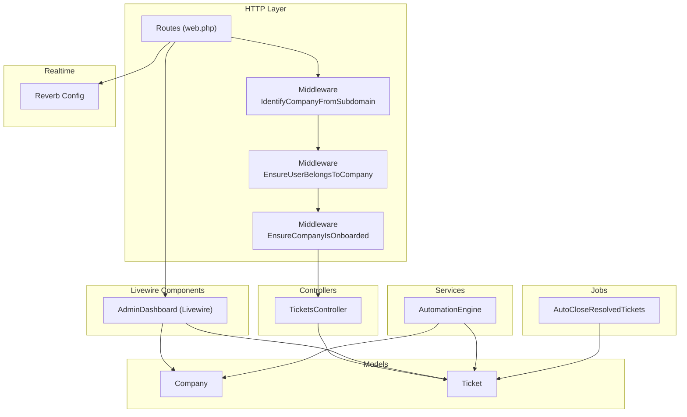
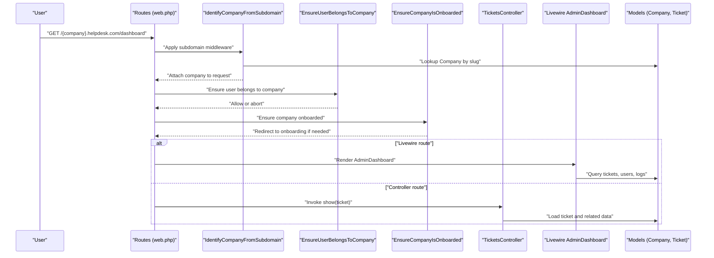
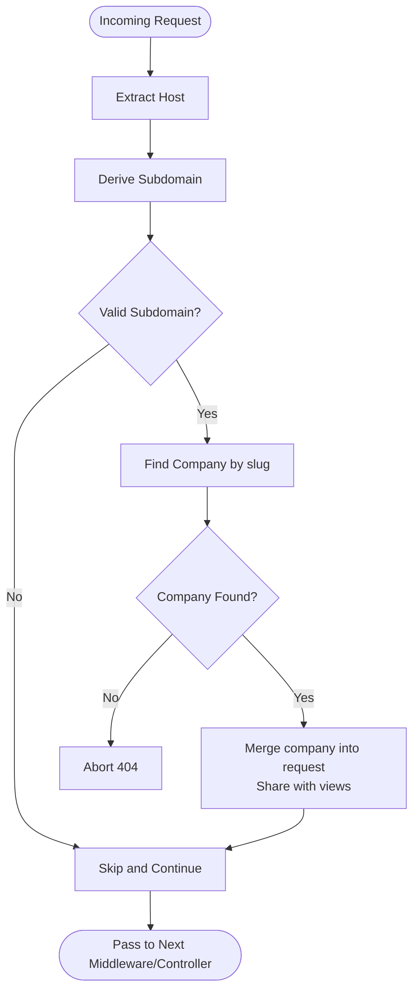
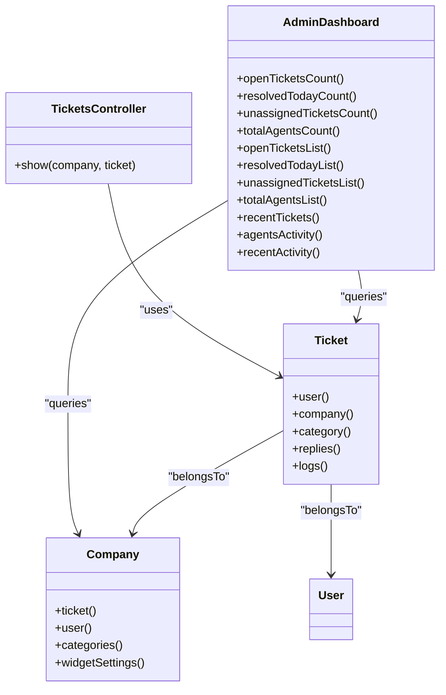
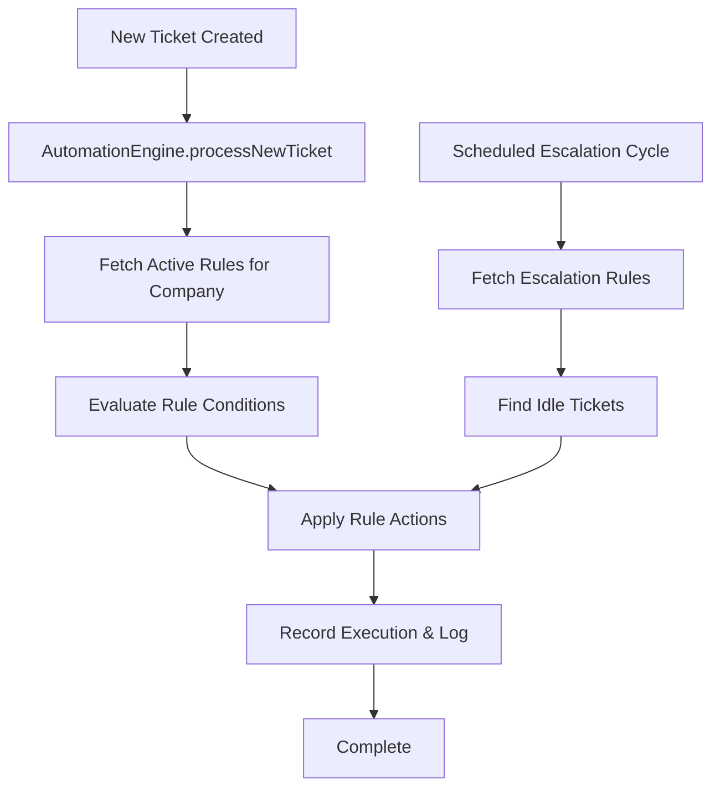
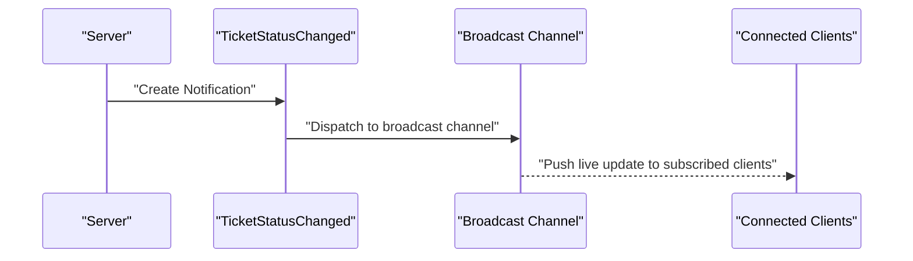
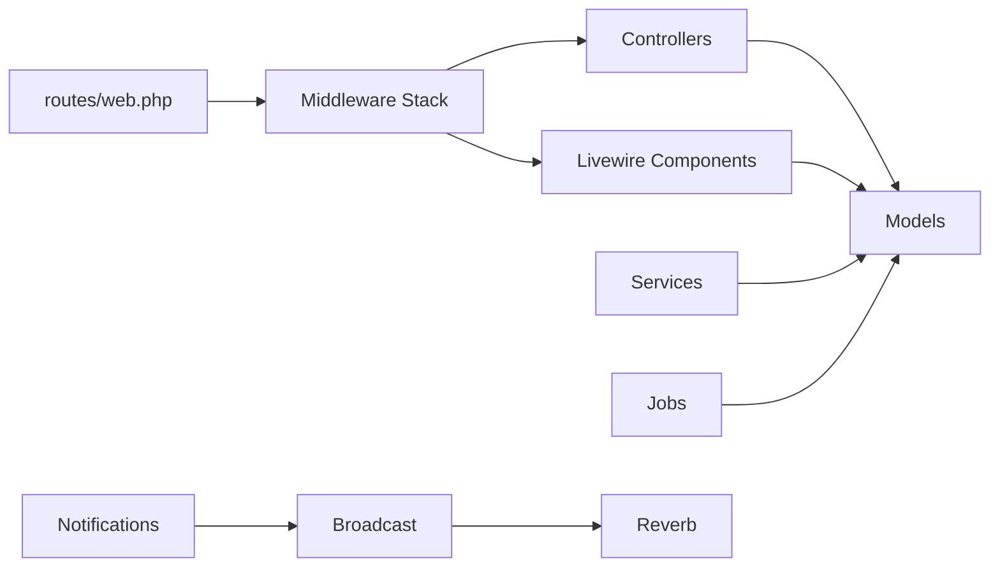

# Core Architecture

<cite>
**Referenced Files in This Document**
- [IdentifyCompanyFromSubdomain.php](file://app/Http/Middleware/IdentifyCompanyFromSubdomain.php)
- [EnsureUserBelongsToCompany.php](file://app/Http/Middleware/EnsureUserBelongsToCompany.php)
- [EnsureCompanyIsOnboarded.php](file://app/Http/Middleware/EnsureCompanyIsOnboarded.php)
- [bootstrap/app.php](file://bootstrap/app.php)
- [routes/web.php](file://routes/web.php)
- [Company.php](file://app/Models/Company.php)
- [Ticket.php](file://app/Models/Ticket.php)
- [TicketsController.php](file://app/Http/Controllers/TicketsController.php)
- [AdminDashboard.php](file://app/Livewire/Dashboard/AdminDashboard.php)
- [AutomationEngine.php](file://app/Services/Automation/AutomationEngine.php)
- [AutoCloseResolvedTickets.php](file://app/Jobs/AutoCloseResolvedTickets.php)
- [TicketStatusChanged.php](file://app/Notifications/TicketStatusChanged.php)
- [reverb.php](file://config/reverb.php)
- [cache.php](file://config/cache.php)
</cite>

## Table of Contents
1. [Introduction](#introduction)
2. [Project Structure](#project-structure)
3. [Core Components](#core-components)
4. [Architecture Overview](#architecture-overview)
5. [Detailed Component Analysis](#detailed-component-analysis)
6. [Dependency Analysis](#dependency-analysis)
7. [Performance Considerations](#performance-considerations)
8. [Troubleshooting Guide](#troubleshooting-guide)
9. [Conclusion](#conclusion)

## Introduction
This document describes the core architecture of the Helpdesk System with a focus on multi-tenancy via subdomain-based company isolation, the MVC pattern with Livewire bridging backend controllers and reactive frontend, layered architecture (Models, Controllers, Livewire Components, Services, Jobs), and real-time communication using Laravel Reverb. It also covers system boundaries, component interactions, data flow patterns, scalability considerations, caching strategies, and performance optimization approaches.

## Project Structure
The application follows a layered, multi-tenant Laravel architecture:
- Multi-tenancy is enforced by subdomain routing and middleware that bind the current company context to requests.
- MVC is implemented with Eloquent models, RESTful controllers, and Livewire components for reactive UI.
- Business logic is encapsulated in services; background tasks are handled by jobs.
- Real-time updates leverage Laravel Reverb for WebSocket-based broadcasting.

**Diagram sources**
- [routes/web.php:70-114](file://routes/web.php#L70-L114)
- [IdentifyCompanyFromSubdomain.php:12-36](file://app/Http/Middleware/IdentifyCompanyFromSubdomain.php#L12-L36)
- [EnsureUserBelongsToCompany.php:11-37](file://app/Http/Middleware/EnsureUserBelongsToCompany.php#L11-L37)
- [EnsureCompanyIsOnboarded.php:16-26](file://app/Http/Middleware/EnsureCompanyIsOnboarded.php#L16-L26)
- [TicketsController.php:12-17](file://app/Http/Controllers/TicketsController.php#L12-L17)
- [AdminDashboard.php:14-127](file://app/Livewire/Dashboard/AdminDashboard.php#L14-L127)
- [AutomationEngine.php:15-142](file://app/Services/Automation/AutomationEngine.php#L15-L142)
- [AutoCloseResolvedTickets.php:8-27](file://app/Jobs/AutoCloseResolvedTickets.php#L8-L27)
- [Company.php:8-47](file://app/Models/Company.php#L8-L47)
- [Ticket.php:9-64](file://app/Models/Ticket.php#L9-L64)
- [reverb.php:29-94](file://config/reverb.php#L29-L94)

**Section sources**
- [routes/web.php:1-117](file://routes/web.php#L1-L117)
- [bootstrap/app.php:15-30](file://bootstrap/app.php#L15-L30)

## Core Components
- Multi-tenant subdomain identification: The middleware extracts the subdomain from the host and binds the company context to the request and views.
- Company model: Defines relationships to tickets, users, categories, and widget settings; uses slug-based routing.
- Controller: Provides RESTful endpoints for tickets, leveraging injected route model bindings.
- Livewire components: Reactive UI components (e.g., AdminDashboard) encapsulate presentation logic and computed properties.
- Services: Business logic orchestration (e.g., AutomationEngine) coordinates rule evaluation and application.
- Jobs: Background processing for scheduled tasks (e.g., AutoCloseResolvedTickets).
- Real-time: Reverb configuration enables WebSocket broadcasting for live updates and notifications.

**Section sources**
- [IdentifyCompanyFromSubdomain.php:12-36](file://app/Http/Middleware/IdentifyCompanyFromSubdomain.php#L12-L36)
- [Company.php:14-37](file://app/Models/Company.php#L14-L37)
- [TicketsController.php:12-17](file://app/Http/Controllers/TicketsController.php#L12-L17)
- [AdminDashboard.php:16-120](file://app/Livewire/Dashboard/AdminDashboard.php#L16-L120)
- [AutomationEngine.php:15-142](file://app/Services/Automation/AutomationEngine.php#L15-L142)
- [AutoCloseResolvedTickets.php:8-27](file://app/Jobs/AutoCloseResolvedTickets.php#L8-L27)
- [reverb.php:29-94](file://config/reverb.php#L29-L94)

## Architecture Overview
The system enforces multi-tenancy at the edge via subdomain routing and middleware. Requests traverse middleware layers to identify the company, ensure user belongs to the company, and enforce onboarding state. Controllers serve traditional endpoints, while Livewire components deliver reactive UI. Models encapsulate persistence and relationships. Services and jobs encapsulate business logic and background processing. Reverb provides real-time capabilities.

**Diagram sources**
- [routes/web.php:70-114](file://routes/web.php#L70-L114)
- [IdentifyCompanyFromSubdomain.php:12-36](file://app/Http/Middleware/IdentifyCompanyFromSubdomain.php#L12-L36)
- [EnsureUserBelongsToCompany.php:11-37](file://app/Http/Middleware/EnsureUserBelongsToCompany.php#L11-L37)
- [EnsureCompanyIsOnboarded.php:16-26](file://app/Http/Middleware/EnsureCompanyIsOnboarded.php#L16-L26)
- [TicketsController.php:12-17](file://app/Http/Controllers/TicketsController.php#L12-L17)
- [AdminDashboard.php:16-120](file://app/Livewire/Dashboard/AdminDashboard.php#L16-L120)
- [Company.php:14-37](file://app/Models/Company.php#L14-L37)
- [Ticket.php:16-54](file://app/Models/Ticket.php#L16-L54)

## Detailed Component Analysis

### Multi-Tenant Subdomain Isolation
- Subdomain extraction and company binding occur in middleware that reads the host, derives the subdomain, and resolves the company record by slug. The resolved company is attached to the request and shared with views.
- Access control ensures the authenticated user belongs to the same company as the requested subdomain.
- Additional middleware enforces onboarding completion before allowing access to core dashboards.

**Diagram sources**
- [IdentifyCompanyFromSubdomain.php:12-36](file://app/Http/Middleware/IdentifyCompanyFromSubdomain.php#L12-L36)
- [EnsureUserBelongsToCompany.php:11-37](file://app/Http/Middleware/EnsureUserBelongsToCompany.php#L11-L37)
- [EnsureCompanyIsOnboarded.php:16-26](file://app/Http/Middleware/EnsureCompanyIsOnboarded.php#L16-L26)

**Section sources**
- [IdentifyCompanyFromSubdomain.php:12-36](file://app/Http/Middleware/IdentifyCompanyFromSubdomain.php#L12-L36)
- [EnsureUserBelongsToCompany.php:11-37](file://app/Http/Middleware/EnsureUserBelongsToCompany.php#L11-L37)
- [EnsureCompanyIsOnboarded.php:16-26](file://app/Http/Middleware/EnsureCompanyIsOnboarded.php#L16-L26)
- [bootstrap/app.php:20-29](file://bootstrap/app.php#L20-L29)

### MVC Pattern with Livewire
- Controllers: RESTful endpoints (e.g., TicketsController::show) handle traditional HTTP responses and route model bindings.
- Livewire Components: Reactive UI components compute derived data and render Blade views. They encapsulate presentation logic and integrate seamlessly with the backend.
- Models: Eloquent models define relationships and casting, enabling clean data access across controllers and Livewire components.

**Diagram sources**
- [TicketsController.php:7-18](file://app/Http/Controllers/TicketsController.php#L7-L18)
- [AdminDashboard.php:14-127](file://app/Livewire/Dashboard/AdminDashboard.php#L14-L127)
- [Company.php:19-37](file://app/Models/Company.php#L19-L37)
- [Ticket.php:16-54](file://app/Models/Ticket.php#L16-L54)

**Section sources**
- [TicketsController.php:12-17](file://app/Http/Controllers/TicketsController.php#L12-L17)
- [AdminDashboard.php:16-120](file://app/Livewire/Dashboard/AdminDashboard.php#L16-L120)
- [Ticket.php:16-54](file://app/Models/Ticket.php#L16-L54)
- [Company.php:19-37](file://app/Models/Company.php#L19-L37)

### Services and Jobs
- Services: Business logic orchestration encapsulated in services (e.g., AutomationEngine) evaluates and applies automation rules per company, with robust error logging and execution tracking.
- Jobs: Background processing for scheduled tasks (e.g., AutoCloseResolvedTickets) implement ShouldQueue and Queueable traits for asynchronous execution.

**Diagram sources**
- [AutomationEngine.php:30-96](file://app/Services/Automation/AutomationEngine.php#L30-L96)
- [AutomationEngine.php:101-125](file://app/Services/Automation/AutomationEngine.php#L101-L125)

**Section sources**
- [AutomationEngine.php:15-142](file://app/Services/Automation/AutomationEngine.php#L15-L142)
- [AutoCloseResolvedTickets.php:8-27](file://app/Jobs/AutoCloseResolvedTickets.php#L8-L27)

### Real-Time Communication with Reverb
- Broadcasting Channels: Notifications support broadcast channels alongside database storage, enabling live updates.
- Reverb Configuration: Centralized configuration defines server scaling, TLS, Redis-backed coordination, and application credentials for secure WebSocket connections.

**Diagram sources**
- [TicketStatusChanged.php:34-37](file://app/Notifications/TicketStatusChanged.php#L34-L37)
- [reverb.php:29-94](file://config/reverb.php#L29-L94)

**Section sources**
- [TicketStatusChanged.php:34-37](file://app/Notifications/TicketStatusChanged.php#L34-L37)
- [reverb.php:29-94](file://config/reverb.php#L29-L94)

## Dependency Analysis
The system exhibits clear layering and separation of concerns:
- Routes depend on middleware for tenant isolation and access control.
- Controllers and Livewire components depend on Models for data access.
- Services depend on Models and external systems; Jobs encapsulate background work.
- Reverb integrates with broadcasting channels for real-time updates.

**Diagram sources**
- [routes/web.php:70-114](file://routes/web.php#L70-L114)
- [bootstrap/app.php:20-29](file://bootstrap/app.php#L20-L29)
- [Company.php:19-37](file://app/Models/Company.php#L19-L37)
- [Ticket.php:16-54](file://app/Models/Ticket.php#L16-L54)
- [AutomationEngine.php:15-142](file://app/Services/Automation/AutomationEngine.php#L15-L142)
- [AutoCloseResolvedTickets.php:8-27](file://app/Jobs/AutoCloseResolvedTickets.php#L8-L27)
- [TicketStatusChanged.php:34-37](file://app/Notifications/TicketStatusChanged.php#L34-L37)
- [reverb.php:29-94](file://config/reverb.php#L29-L94)

**Section sources**
- [routes/web.php:70-114](file://routes/web.php#L70-L114)
- [bootstrap/app.php:20-29](file://bootstrap/app.php#L20-L29)
- [Company.php:19-37](file://app/Models/Company.php#L19-L37)
- [Ticket.php:16-54](file://app/Models/Ticket.php#L16-L54)
- [AutomationEngine.php:15-142](file://app/Services/Automation/AutomationEngine.php#L15-L142)
- [AutoCloseResolvedTickets.php:8-27](file://app/Jobs/AutoCloseResolvedTickets.php#L8-L27)
- [TicketStatusChanged.php:34-37](file://app/Notifications/TicketStatusChanged.php#L34-L37)
- [reverb.php:29-94](file://config/reverb.php#L29-L94)

## Performance Considerations
- Caching Strategy: Configure cache stores (database, file, redis, memcached, dynamodb, octane) and key prefixes to optimize read-heavy queries. Use computed properties in Livewire components judiciously to minimize repeated heavy queries.
- Query Optimization: Leverage Eloquent relationships and eager loading (as seen in AdminDashboard) to reduce N+1 queries. Apply scopes (e.g., Ticket scopeOpen) to encapsulate common filters.
- Background Processing: Offload long-running tasks to jobs and queues to keep request latency low.
- Real-Time Scaling: Reverb supports scaling via Redis and configurable options; tune max message sizes and timeouts for throughput and reliability.
- Middleware Efficiency: Keep middleware lightweight; company resolution occurs early to avoid redundant checks downstream.

**Section sources**
- [cache.php:18-117](file://config/cache.php#L18-L117)
- [AdminDashboard.php:48-95](file://app/Livewire/Dashboard/AdminDashboard.php#L48-L95)
- [Ticket.php:59-62](file://app/Models/Ticket.php#L59-L62)
- [reverb.php:40-55](file://config/reverb.php#L40-L55)

## Troubleshooting Guide
- Subdomain Resolution Failures: Verify subdomain extraction logic and ensure the company slug matches the subdomain. Confirm middleware aliasing and order in the application bootstrap.
- Access Denied Errors: Check EnsureUserBelongsToCompany logic and ensure the authenticated user’s company_id matches the resolved company.
- Onboarding Redirect Loops: Ensure EnsureCompanyIsOnboarded does not redirect when already on onboarding routes.
- Real-Time Updates Not Received: Validate Reverb server configuration, TLS settings, and client-side connection parameters; confirm notifications are dispatched via broadcast channels.

**Section sources**
- [IdentifyCompanyFromSubdomain.php:12-36](file://app/Http/Middleware/IdentifyCompanyFromSubdomain.php#L12-L36)
- [EnsureUserBelongsToCompany.php:11-37](file://app/Http/Middleware/EnsureUserBelongsToCompany.php#L11-L37)
- [EnsureCompanyIsOnboarded.php:16-26](file://app/Http/Middleware/EnsureCompanyIsOnboarded.php#L16-L26)
- [reverb.php:29-94](file://config/reverb.php#L29-L94)

## Conclusion
The Helpdesk System employs a robust multi-tenant architecture centered on subdomain isolation, layered MVC with Livewire, and a service/job-driven design. Real-time updates are enabled through Reverb, while caching and background processing support scalability. Adhering to the outlined patterns and configurations ensures maintainability, performance, and extensibility across tenants and features.