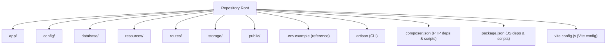
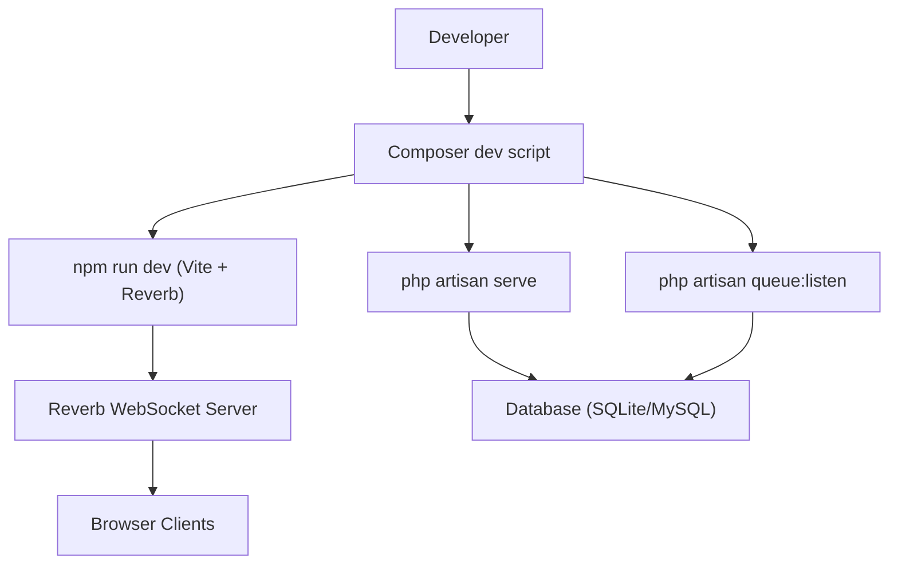
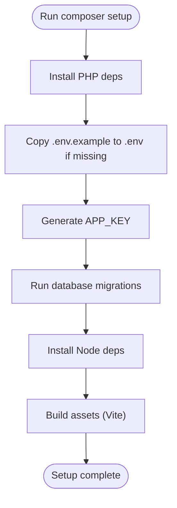
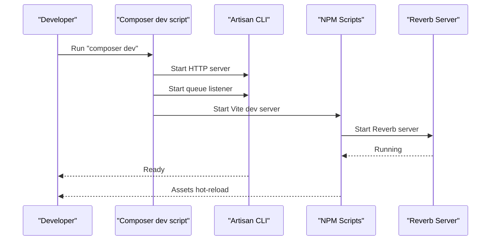
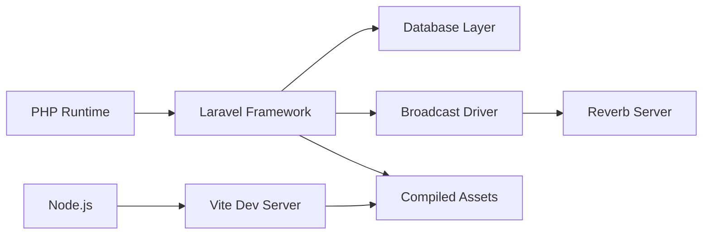

# Getting Started

<cite>
**Referenced Files in This Document**
- [composer.json](file://composer.json)
- [package.json](file://package.json)
- [vite.config.js](file://vite.config.js)
- [artisan](file://artisan)
- [config/app.php](file://config/app.php)
- [config/database.php](file://config/database.php)
- [config/broadcasting.php](file://config/broadcasting.php)
- [config/reverb.php](file://config/reverb.php)
</cite>

## Table of Contents
1. [Introduction](#introduction)
2. [Project Structure](#project-structure)
3. [Core Components](#core-components)
4. [Architecture Overview](#architecture-overview)
5. [Detailed Component Analysis](#detailed-component-analysis)
6. [Dependency Analysis](#dependency-analysis)
7. [Performance Considerations](#performance-considerations)
8. [Troubleshooting Guide](#troubleshooting-guide)
9. [Conclusion](#conclusion)
10. [Appendices](#appendices)

## Introduction
This guide helps you install and run the Helpdesk System locally. It covers prerequisites, cloning the repository, setting up the environment, running database migrations, compiling assets, and launching the development stack with a single command. It also explains the automated setup script and the local development script that runs the server, queue, Vite, and Reverb concurrently.

## Project Structure
The Helpdesk System is a Laravel application with a modern frontend built using Vite and Tailwind CSS. The backend is organized into models, controllers, Livewire components, jobs, and services. The frontend assets live under resources/css and resources/js and are built via Vite.

**Section sources**
- [composer.json:11-23](file://composer.json#L11-L23)
- [package.json:1-37](file://package.json#L1-L37)
- [vite.config.js:1-22](file://vite.config.js#L1-L22)

## Core Components
- PHP runtime and framework: Laravel 12.x with PHP 8.2+ requirement.
- Database: SQLite by default; MySQL/MariaDB supported via environment variables.
- Frontend toolchain: Vite with Laravel Vite Plugin and Tailwind CSS.
- Realtime: Laravel Reverb configured for WebSocket broadcasting.
- Task queue: Laravel queue worker for background jobs.
- CLI: Artisan commands for setup, migrations, and development.

Prerequisites summary:
- PHP 8.2 or higher
- MySQL (or SQLite for quick start)
- Node.js (for Vite and Reverb)
- Composer (for PHP dependencies)

**Section sources**
- [composer.json:11-23](file://composer.json#L11-L23)
- [config/database.php:19-44](file://config/database.php#L19-L44)
- [config/broadcasting.php:18-47](file://config/broadcasting.php#L18-L47)
- [config/reverb.php:31-55](file://config/reverb.php#L31-L55)
- [package.json:1-37](file://package.json#L1-L37)
- [vite.config.js:1-22](file://vite.config.js#L1-L22)

## Architecture Overview
The development stack runs four processes concurrently:
- Laravel HTTP server
- Laravel queue listener
- Vite dev server (with Reverb)
- Laravel Reverb server

**Diagram sources**
- [composer.json:57-60](file://composer.json#L57-L60)
- [package.json:5-8](file://package.json#L5-L8)
- [config/broadcasting.php:18-47](file://config/broadcasting.php#L18-L47)
- [config/reverb.php:31-55](file://config/reverb.php#L31-L55)

## Detailed Component Analysis

### Automated Setup Script
The Composer setup script performs the following tasks automatically:
- Install PHP dependencies
- Create .env from .env.example if missing
- Generate the application key
- Run database migrations
- Install JavaScript dependencies
- Build assets

**Diagram sources**
- [composer.json:49-56](file://composer.json#L49-L56)

**Section sources**
- [composer.json:49-56](file://composer.json#L49-L56)

### Local Development Script
The Composer dev script launches four processes concurrently:
- Laravel HTTP server
- Laravel queue listener
- Vite dev server
- Laravel Reverb server

**Diagram sources**
- [composer.json:57-60](file://composer.json#L57-L60)
- [package.json:5-8](file://package.json#L5-L8)
- [config/broadcasting.php:18-47](file://config/broadcasting.php#L18-L47)
- [config/reverb.php:31-55](file://config/reverb.php#L31-L55)

**Section sources**
- [composer.json:57-60](file://composer.json#L57-L60)
- [package.json:5-8](file://package.json#L5-L8)

### Environment Configuration
Key environment variables and defaults:
- Database
  - DB_CONNECTION: sqlite by default
  - DB_DATABASE: path to SQLite file
  - DB_HOST/DB_PORT/DB_USERNAME/DB_PASSWORD for MySQL/MariaDB
- Application
  - APP_NAME, APP_ENV, APP_DEBUG, APP_URL
  - APP_KEY (generated during setup)
- Broadcasting/Reverb
  - BROADCAST_CONNECTION
  - REVERB_* keys and ports
- Redis (used by Reverb scaling)
  - REDIS_* options

Notes:
- The application config defines domain and URL helpers for convenience.
- Reverb supports HTTPS/TLS based on scheme configuration.

**Section sources**
- [config/database.php:19-84](file://config/database.php#L19-L84)
- [config/app.php:16-128](file://config/app.php#L16-L128)
- [config/broadcasting.php:18-47](file://config/broadcasting.php#L18-L47)
- [config/reverb.php:31-94](file://config/reverb.php#L31-L94)

### Asset Compilation and Vite
- Vite is configured to build resources/css/app.css and resources/js/app.js.
- Tailwind CSS is integrated via the Tailwind Vite plugin.
- The dev script runs Vite and Reverb together.

**Section sources**
- [vite.config.js:7-21](file://vite.config.js#L7-L21)
- [package.json:5-8](file://package.json#L5-L8)

### Initial User Account Creation and Basic Verification
After completing setup and starting the dev stack:
- Visit the application URL reported by the HTTP server.
- Complete the onboarding wizard to create your company and initial operator account.
- Use the operator account to log in and verify core functionality (dashboard, tickets, conversations).

Tip:
- If you skip the wizard, you can still log in after creating an account manually or via seeding.

**Section sources**
- [composer.json:49-56](file://composer.json#L49-L56)
- [artisan:1-19](file://artisan:1-L19)

## Dependency Analysis
High-level dependency relationships:
- PHP dependencies declared in composer.json
- JS dependencies declared in package.json
- Vite configuration in vite.config.js
- Laravel configuration for database, broadcasting, and Reverb

**Diagram sources**
- [composer.json:11-23](file://composer.json#L11-L23)
- [package.json:1-37](file://package.json#L1-L37)
- [vite.config.js:1-22](file://vite.config.js#L1-L22)
- [config/broadcasting.php:18-47](file://config/broadcasting.php#L18-L47)
- [config/reverb.php:31-55](file://config/reverb.php#L31-L55)

**Section sources**
- [composer.json:11-23](file://composer.json#L11-L23)
- [package.json:1-37](file://package.json#L1-L37)
- [vite.config.js:1-22](file://vite.config.js#L1-L22)

## Performance Considerations
- Use SQLite for local development to minimize overhead.
- Enable debug mode only when needed; disable for production-like testing.
- Keep asset builds optimized; avoid unnecessary watchers or plugins.
- Monitor queue backlog and scale workers as needed.

## Troubleshooting Guide
Common setup and runtime issues:
- Missing .env
  - The setup script creates .env from .env.example if missing. Ensure the file exists and is writable.
- Database connectivity
  - For SQLite, verify the database path and permissions.
  - For MySQL/MariaDB, confirm host, port, username, and password match your local service.
- Reverb/WebSocket
  - Ensure Reverb server is reachable on the configured host/port and scheme.
  - Confirm broadcasting driver matches Reverb configuration.
- Queue not processing
  - The dev script starts a queue listener; ensure no conflicting workers are running.
- Port conflicts
  - Adjust Reverb and Vite ports if 8080, 443, or 3000 are in use.
- Asset rebuild errors
  - Clear node_modules and reinstall dependencies if Vite fails to start.

**Section sources**
- [composer.json:49-56](file://composer.json#L49-L56)
- [config/database.php:19-84](file://config/database.php#L19-L84)
- [config/broadcasting.php:18-47](file://config/broadcasting.php#L18-L47)
- [config/reverb.php:31-55](file://config/reverb.php#L31-L55)
- [package.json:5-8](file://package.json#L5-L8)

## Conclusion
You now have the essentials to install the Helpdesk System, configure the environment, run migrations, compile assets, and launch the development stack with a single command. Proceed to onboarding and create your first operator account to verify the system.

## Appendices

### Step-by-Step Installation Checklist
- Prerequisites: PHP 8.2+, MySQL or SQLite, Node.js, Composer
- Clone repository
- Run automated setup (PHP deps, .env, key, migrations, JS deps, build)
- Start development stack (HTTP server, queue, Vite, Reverb)
- Complete onboarding and create initial operator account
- Verify core dashboards and ticket workflows

**Section sources**
- [composer.json:49-56](file://composer.json#L49-L56)
- [composer.json:57-60](file://composer.json#L57-L60)
- [config/database.php:19-44](file://config/database.php#L19-L44)
- [config/broadcasting.php:18-47](file://config/broadcasting.php#L18-L47)
- [config/reverb.php:31-55](file://config/reverb.php#L31-L55)
- [package.json:5-8](file://package.json#L5-L8)
- [vite.config.js:7-21](file://vite.config.js#L7-L21)