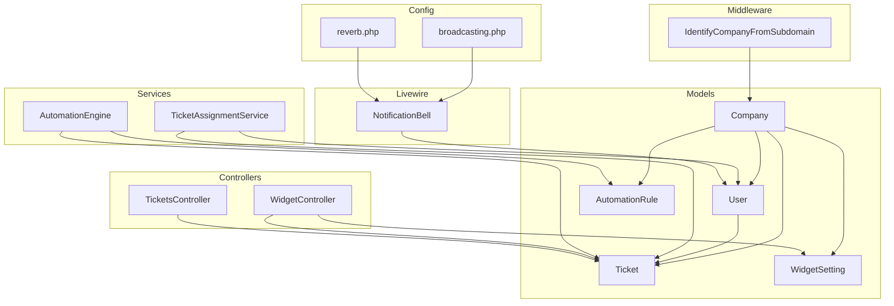
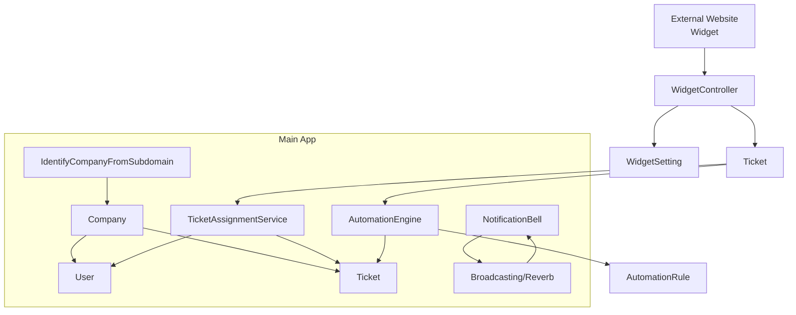
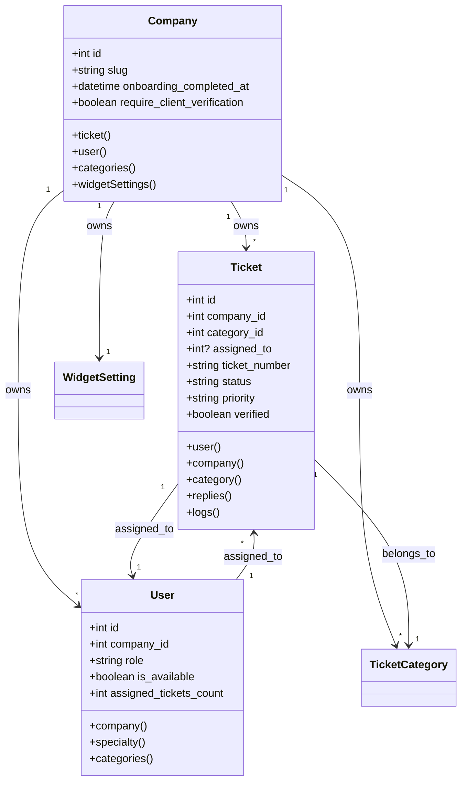
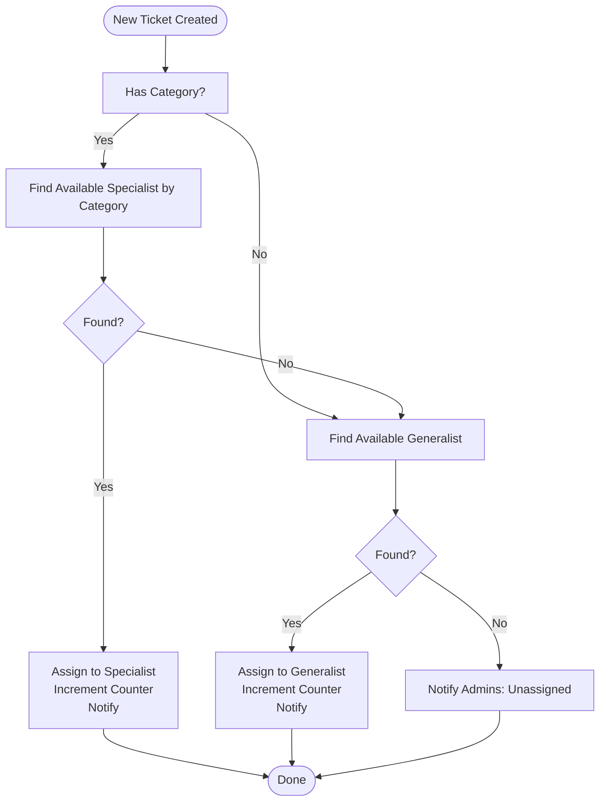
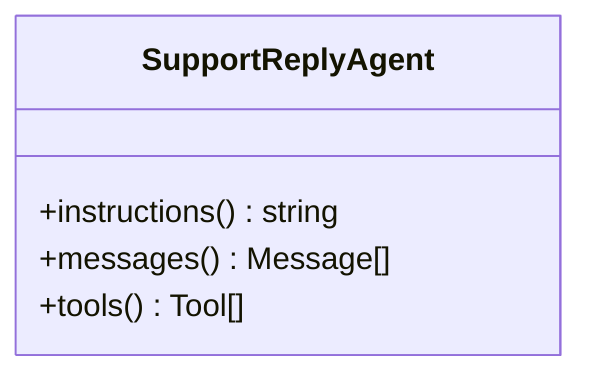
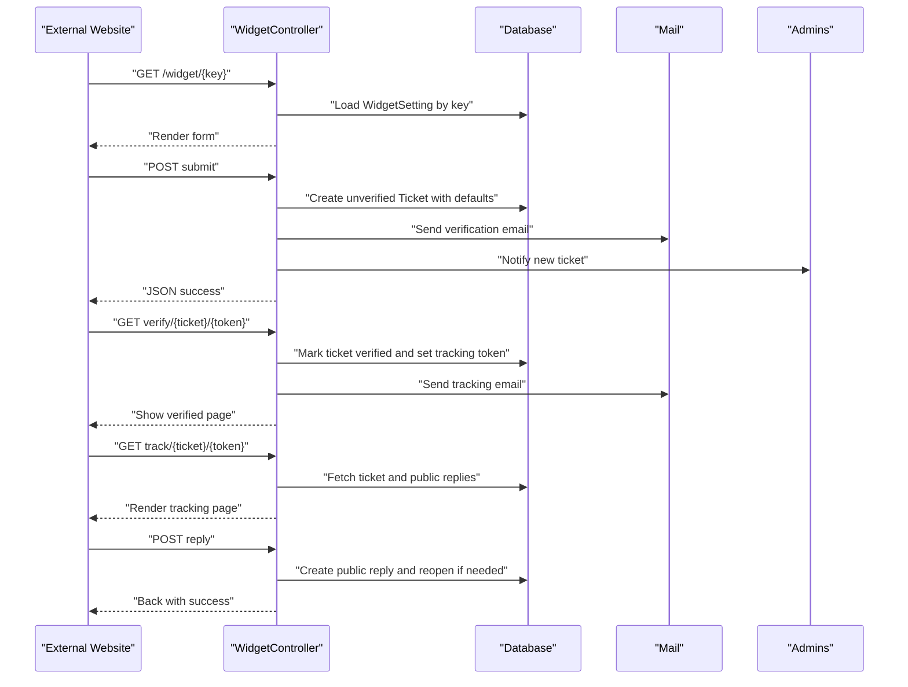
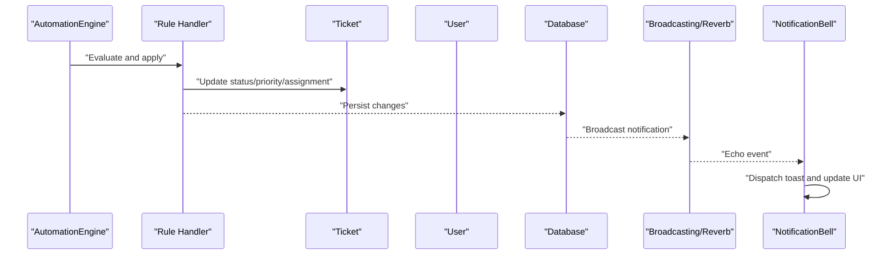
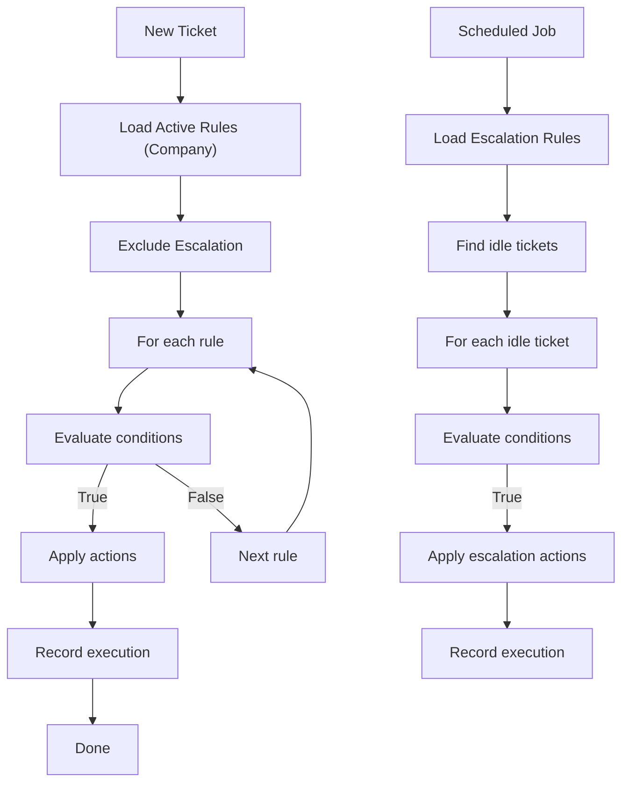
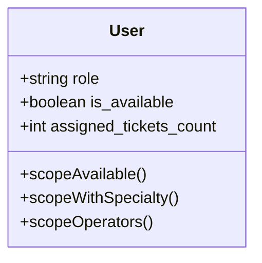
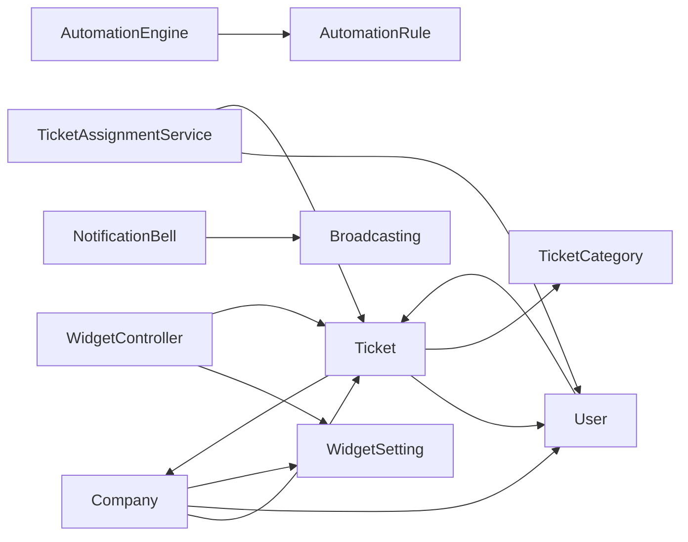

# Key Features

<cite>
**Referenced Files in This Document**
- [Ticket.php](file://app/Models/Ticket.php)
- [Company.php](file://app/Models/Company.php)
- [User.php](file://app/Models/User.php)
- [TicketAssignmentService.php](file://app/Services/TicketAssignmentService.php)
- [AutomationEngine.php](file://app/Services/Automation/AutomationEngine.php)
- [AutomationRule.php](file://app/Models/AutomationRule.php)
- [SupportReplyAgent.php](file://app/Ai/Agents/SupportReplyAgent.php)
- [WidgetSetting.php](file://app/Models/WidgetSetting.php)
- [WidgetController.php](file://app/Http/Controllers/WidgetController.php)
- [IdentifyCompanyFromSubdomain.php](file://app/Http/Middleware/IdentifyCompanyFromSubdomain.php)
- [broadcasting.php](file://config/broadcasting.php)
- [reverb.php](file://config/reverb.php)
- [TicketAssigned.php](file://app/Notifications/TicketAssigned.php)
- [NotificationBell.php](file://app/Livewire/NotificationBell.php)
- [TicketsController.php](file://app/Http/Controllers/TicketsController.php)
</cite>

## Table of Contents
1. [Introduction](#introduction)
2. [Project Structure](#project-structure)
3. [Core Components](#core-components)
4. [Architecture Overview](#architecture-overview)
5. [Detailed Component Analysis](#detailed-component-analysis)
6. [Dependency Analysis](#dependency-analysis)
7. [Performance Considerations](#performance-considerations)
8. [Troubleshooting Guide](#troubleshooting-guide)
9. [Conclusion](#conclusion)

## Introduction
This document presents a comprehensive feature overview of the Helpdesk System, focusing on multi-company ticketing, automated assignment, priority management, category organization, AI-powered support assistance, the widget system for external website integration, real-time communication via WebSockets, an automation engine for rules-based workflows, dashboard analytics, role-based access control, and onboarding and company setup processes.

## Project Structure
The Helpdesk System is organized around Eloquent models representing core entities (Company, User, Ticket, WidgetSetting, AutomationRule), service classes implementing business logic (TicketAssignmentService, AutomationEngine), controllers managing HTTP workflows (WidgetController, TicketsController), middleware for subdomain-based company identification, configuration for broadcasting and real-time messaging (broadcasting.php, reverb.php), and Livewire components for interactive UI elements (NotificationBell).

**Diagram sources**
- [Company.php:19-37](file://app/Models/Company.php#L19-L37)
- [User.php:74-97](file://app/Models/User.php#L74-L97)
- [Ticket.php:16-39](file://app/Models/Ticket.php#L16-L39)
- [WidgetSetting.php:37-45](file://app/Models/WidgetSetting.php#L37-L45)
- [AutomationRule.php:54-58](file://app/Models/AutomationRule.php#L54-L58)
- [TicketAssignmentService.php:22-94](file://app/Services/TicketAssignmentService.php#L22-L94)
- [AutomationEngine.php:15-54](file://app/Services/Automation/AutomationEngine.php#L15-L54)
- [WidgetController.php:19-197](file://app/Http/Controllers/WidgetController.php#L19-L197)
- [TicketsController.php:7-18](file://app/Http/Controllers/TicketsController.php#L7-L18)
- [IdentifyCompanyFromSubdomain.php:10-36](file://app/Http/Middleware/IdentifyCompanyFromSubdomain.php#L10-L36)
- [broadcasting.php:31-80](file://config/broadcasting.php#L31-L80)
- [reverb.php:29-94](file://config/reverb.php#L29-L94)
- [NotificationBell.php:10-96](file://app/Livewire/NotificationBell.php#L10-L96)

**Section sources**
- [Company.php:1-47](file://app/Models/Company.php#L1-L47)
- [User.php:1-137](file://app/Models/User.php#L1-L137)
- [Ticket.php:1-64](file://app/Models/Ticket.php#L1-L64)
- [WidgetSetting.php:1-71](file://app/Models/WidgetSetting.php#L1-L71)
- [AutomationRule.php:1-117](file://app/Models/AutomationRule.php#L1-L117)
- [TicketAssignmentService.php:1-179](file://app/Services/TicketAssignmentService.php#L1-L179)
- [AutomationEngine.php:1-142](file://app/Services/Automation/AutomationEngine.php#L1-L142)
- [WidgetController.php:1-197](file://app/Http/Controllers/WidgetController.php#L1-L197)
- [TicketsController.php:1-19](file://app/Http/Controllers/TicketsController.php#L1-L19)
- [IdentifyCompanyFromSubdomain.php:1-54](file://app/Http/Middleware/IdentifyCompanyFromSubdomain.php#L1-L54)
- [broadcasting.php:1-83](file://config/broadcasting.php#L1-L83)
- [reverb.php:1-97](file://config/reverb.php#L1-L97)
- [NotificationBell.php:1-96](file://app/Livewire/NotificationBell.php#L1-L96)

## Core Components
- Multi-company ticketing: Companies own tickets, categories, and widget settings; users belong to companies and can be operators or admins.
- Automated assignment: Specialized and generalist operators are considered based on availability and workload; assignment updates counters and notifies recipients.
- Priority management and categories: Tickets are associated with categories; automation rules can change priority; widget settings influence defaults.
- AI-powered support assistant: An agent provides intelligent reply suggestions with concise instructions and conversational context.
- Widget system: External websites embed a form; submissions trigger verification emails; verified tickets enable public tracking and replies.
- Real-time communication: Broadcasting via Reverb/Pusher and database notifications power live notifications and WebSocket updates.
- Automation engine: Central engine orchestrates assignment, priority, auto-reply, and escalation rules per company with execution tracking.
- Dashboard analytics: Reports and analytics dashboards are integrated into the UI via Livewire components.
- Role-based access control: Users have roles (admin/operator) and middleware restricts access to authorized users.
- Onboarding and company setup: Subdomain-based company identification and onboarding flows guide administrators through setup.

**Section sources**
- [Company.php:19-37](file://app/Models/Company.php#L19-L37)
- [Ticket.php:16-39](file://app/Models/Ticket.php#L16-L39)
- [TicketAssignmentService.php:22-94](file://app/Services/TicketAssignmentService.php#L22-L94)
- [AutomationEngine.php:15-54](file://app/Services/Automation/AutomationEngine.php#L15-L54)
- [WidgetSetting.php:47-69](file://app/Models/WidgetSetting.php#L47-L69)
- [WidgetController.php:41-109](file://app/Http/Controllers/WidgetController.php#L41-L109)
- [broadcasting.php:31-80](file://config/broadcasting.php#L31-L80)
- [reverb.php:29-94](file://config/reverb.php#L29-L94)
- [NotificationBell.php:19-53](file://app/Livewire/NotificationBell.php#L19-L53)
- [User.php:54-62](file://app/Models/User.php#L54-L62)
- [IdentifyCompanyFromSubdomain.php:10-36](file://app/Http/Middleware/IdentifyCompanyFromSubdomain.php#L10-L36)

## Architecture Overview
The system integrates models, services, controllers, middleware, configuration, and Livewire components. Real-time updates rely on broadcasting and WebSocket connections configured via Reverb/Pusher. Widgets operate independently of the main app via subdomains and shared company context.

**Diagram sources**
- [WidgetController.php:19-197](file://app/Http/Controllers/WidgetController.php#L19-L197)
- [WidgetSetting.php:37-45](file://app/Models/WidgetSetting.php#L37-L45)
- [Ticket.php:16-39](file://app/Models/Ticket.php#L16-L39)
- [TicketAssignmentService.php:22-94](file://app/Services/TicketAssignmentService.php#L22-L94)
- [AutomationEngine.php:15-54](file://app/Services/Automation/AutomationEngine.php#L15-L54)
- [AutomationRule.php:54-58](file://app/Models/AutomationRule.php#L54-L58)
- [IdentifyCompanyFromSubdomain.php:10-36](file://app/Http/Middleware/IdentifyCompanyFromSubdomain.php#L10-L36)
- [broadcasting.php:31-80](file://config/broadcasting.php#L31-L80)
- [reverb.php:29-94](file://config/reverb.php#L29-L94)
- [NotificationBell.php:19-53](file://app/Livewire/NotificationBell.php#L19-L53)

## Detailed Component Analysis

### Multi-company Ticketing System
- Entities:
  - Company owns tickets, users, categories, and widget settings.
  - User belongs to a company and can be an operator/admin.
  - Ticket belongs to a company, category, and optionally an assigned operator.
- Routing and identity:
  - Subdomain middleware identifies the company and attaches it to requests.
- Implications:
  - Isolation between companies; per-company automation and widget configurations; scoped dashboards.

**Diagram sources**
- [Company.php:19-37](file://app/Models/Company.php#L19-L37)
- [User.php:74-97](file://app/Models/User.php#L74-L97)
- [Ticket.php:16-39](file://app/Models/Ticket.php#L16-L39)
- [WidgetSetting.php:37-45](file://app/Models/WidgetSetting.php#L37-L45)

**Section sources**
- [Company.php:1-47](file://app/Models/Company.php#L1-L47)
- [User.php:1-137](file://app/Models/User.php#L1-L137)
- [Ticket.php:1-64](file://app/Models/Ticket.php#L1-L64)
- [IdentifyCompanyFromSubdomain.php:10-36](file://app/Http/Middleware/IdentifyCompanyFromSubdomain.php#L10-L36)

### Automated Assignment and Priority Management
- Assignment logic:
  - Prefer specialists matching the ticket category and lowest workload.
  - Fall back to generalists; otherwise notify admins.
  - Updates counters and sends notifications.
- Priority management:
  - Tickets carry a priority field; automation rules can change it.
- Category organization:
  - Tickets belong to categories; categories are company-scoped.

**Diagram sources**
- [TicketAssignmentService.php:22-94](file://app/Services/TicketAssignmentService.php#L22-L94)
- [Ticket.php:16-39](file://app/Models/Ticket.php#L16-L39)

**Section sources**
- [TicketAssignmentService.php:1-179](file://app/Services/TicketAssignmentService.php#L1-L179)
- [Ticket.php:1-64](file://app/Models/Ticket.php#L1-L64)

### AI-powered Support Assistant
- Agent configuration:
  - Uses a provider and model selection attribute.
  - Provides concise instructions for reply generation.
- Workflow:
  - Integrates with the broader ticketing system to suggest replies based on context.

**Diagram sources**
- [SupportReplyAgent.php:16-28](file://app/Ai/Agents/SupportReplyAgent.php#L16-L28)

**Section sources**
- [SupportReplyAgent.php:1-50](file://app/Ai/Agents/SupportReplyAgent.php#L1-L50)

### Widget System for External Website Integration
- Embedded forms:
  - WidgetSetting generates a unique key and iframe code for embedding.
  - WidgetController validates and submits tickets; applies widget defaults (priority, status, default assignee).
- Email verification workflow:
  - Submission triggers a verification email; verified tickets receive a tracking token and can be publicly tracked.
- Public tracking and replies:
  - Verified tickets expose public replies; customers can submit replies that reopen resolved/closed tickets if needed.

**Diagram sources**
- [WidgetSetting.php:47-69](file://app/Models/WidgetSetting.php#L47-L69)
- [WidgetController.php:24-197](file://app/Http/Controllers/WidgetController.php#L24-L197)

**Section sources**
- [WidgetSetting.php:1-71](file://app/Models/WidgetSetting.php#L1-L71)
- [WidgetController.php:1-197](file://app/Http/Controllers/WidgetController.php#L1-L197)

### Real-time Communication and Live Notifications
- Broadcasting:
  - Configured via broadcasting.php and reverb.php supporting Reverb/Pusher/Ably/log/null drivers.
- Notifications:
  - TicketAssigned and similar notifications use database and broadcast channels.
- Livewire component:
  - NotificationBell listens for broadcast events and database updates, dispatches toast notifications, and supports marking as read.

**Diagram sources**
- [broadcasting.php:31-80](file://config/broadcasting.php#L31-L80)
- [reverb.php:29-94](file://config/reverb.php#L29-L94)
- [TicketAssigned.php:28-47](file://app/Notifications/TicketAssigned.php#L28-L47)
- [NotificationBell.php:19-53](file://app/Livewire/NotificationBell.php#L19-L53)

**Section sources**
- [broadcasting.php:1-83](file://config/broadcasting.php#L1-L83)
- [reverb.php:1-97](file://config/reverb.php#L1-L97)
- [TicketAssigned.php:1-49](file://app/Notifications/TicketAssigned.php#L1-L49)
- [NotificationBell.php:1-96](file://app/Livewire/NotificationBell.php#L1-L96)

### Automation Engine: Rules for Assignment, Priority, Auto-replies, and Escalation
- Engine orchestration:
  - Processes active rules per company; escalations are scheduled separately.
- Rule types:
  - Assignment, Priority, Auto Reply, Escalation.
- Execution tracking:
  - Records executions and timestamps for observability.

**Diagram sources**
- [AutomationEngine.php:30-96](file://app/Services/Automation/AutomationEngine.php#L30-L96)
- [AutomationEngine.php:101-111](file://app/Services/Automation/AutomationEngine.php#L101-L111)
- [AutomationRule.php:66-91](file://app/Models/AutomationRule.php#L66-L91)

**Section sources**
- [AutomationEngine.php:1-142](file://app/Services/Automation/AutomationEngine.php#L1-L142)
- [AutomationRule.php:1-117](file://app/Models/AutomationRule.php#L1-L117)

### Dashboard Analytics and Reporting
- Reports and analytics:
  - Livewire components integrate reports and analytics into the dashboard UI.
- Data presentation:
  - Cards, tabs, and export overlays support performance metrics and ticket insights.

**Section sources**
- [NotificationBell.php:79-89](file://app/Livewire/NotificationBell.php#L79-L89)

### Role-based Access Control
- Roles:
  - Users have roles (admin/operator); middleware enforces access policies.
- Company scoping:
  - Users belong to a company; operators are available and specialized by category.

**Diagram sources**
- [User.php:54-62](file://app/Models/User.php#L54-L62)
- [User.php:102-121](file://app/Models/User.php#L102-L121)

**Section sources**
- [User.php:1-137](file://app/Models/User.php#L1-L137)
- [IdentifyCompanyFromSubdomain.php:10-36](file://app/Http/Middleware/IdentifyCompanyFromSubdomain.php#L10-L36)

### Onboarding Wizard and Company Setup
- Subdomain-based company identification:
  - Middleware extracts subdomain and attaches company context to requests.
- Company setup:
  - Company model includes onboarding completion timestamps and verification requirements.

**Section sources**
- [IdentifyCompanyFromSubdomain.php:10-36](file://app/Http/Middleware/IdentifyCompanyFromSubdomain.php#L10-L36)
- [Company.php:42-44](file://app/Models/Company.php#L42-L44)

## Dependency Analysis
- Model relationships:
  - Company → User/Ticket/TicketCategory/WidgetSetting
  - User → Ticket (assigned)
  - Ticket → Company/Category/User
- Service dependencies:
  - TicketAssignmentService depends on User and Ticket models and notifications.
  - AutomationEngine depends on AutomationRule and rule handlers.
- Controller dependencies:
  - WidgetController depends on Company, WidgetSetting, Ticket, and notifications/mails.
- Real-time dependencies:
  - Broadcasting configuration and Livewire component listen for events.

**Diagram sources**
- [Company.php:19-37](file://app/Models/Company.php#L19-L37)
- [User.php:74-97](file://app/Models/User.php#L74-L97)
- [Ticket.php:16-39](file://app/Models/Ticket.php#L16-L39)
- [WidgetSetting.php:37-45](file://app/Models/WidgetSetting.php#L37-L45)
- [WidgetController.php:19-197](file://app/Http/Controllers/WidgetController.php#L19-L197)
- [TicketAssignmentService.php:22-94](file://app/Services/TicketAssignmentService.php#L22-L94)
- [AutomationEngine.php:15-54](file://app/Services/Automation/AutomationEngine.php#L15-L54)
- [broadcasting.php:31-80](file://config/broadcasting.php#L31-L80)

**Section sources**
- [Company.php:1-47](file://app/Models/Company.php#L1-L47)
- [User.php:1-137](file://app/Models/User.php#L1-L137)
- [Ticket.php:1-64](file://app/Models/Ticket.php#L1-L64)
- [WidgetSetting.php:1-71](file://app/Models/WidgetSetting.php#L1-L71)
- [WidgetController.php:1-197](file://app/Http/Controllers/WidgetController.php#L1-L197)
- [TicketAssignmentService.php:1-179](file://app/Services/TicketAssignmentService.php#L1-L179)
- [AutomationEngine.php:1-142](file://app/Services/Automation/AutomationEngine.php#L1-L142)
- [broadcasting.php:1-83](file://config/broadcasting.php#L1-L83)

## Performance Considerations
- Indexing and scopes:
  - Use existing scopes (available, with specialty, operators) to minimize query complexity.
- Transaction boundaries:
  - Assignment operations wrap updates in transactions to maintain consistency.
- Broadcasting overhead:
  - Limit high-frequency broadcasts; batch notifications where appropriate.
- Caching:
  - Model observers clear caches on user/company updates to keep derived data fresh.

[No sources needed since this section provides general guidance]

## Troubleshooting Guide
- Real-time notifications not appearing:
  - Verify broadcasting driver configuration and Reverb/Pusher credentials.
  - Confirm the NotificationBell component subscribes to the correct channels.
- Widget form submission errors:
  - Check widget settings activation and required fields.
  - Ensure verification emails are being sent and tokens are valid.
- Auto-assignment failures:
  - Confirm operators are marked available and have appropriate specialties.
  - Review logs for automation rule evaluation failures.

**Section sources**
- [broadcasting.php:31-80](file://config/broadcasting.php#L31-L80)
- [reverb.php:29-94](file://config/reverb.php#L29-L94)
- [NotificationBell.php:19-53](file://app/Livewire/NotificationBell.php#L19-L53)
- [WidgetController.php:41-109](file://app/Http/Controllers/WidgetController.php#L41-L109)
- [TicketAssignmentService.php:84-94](file://app/Services/TicketAssignmentService.php#L84-L94)
- [AutomationEngine.php:87-95](file://app/Services/Automation/AutomationEngine.php#L87-L95)

## Conclusion
The Helpdesk System delivers a robust, extensible platform for multi-company support operations. Its automated assignment and rule-driven workflows streamline operations, while the AI assistant and widget system enhance responsiveness and customer experience. Real-time communication and comprehensive analytics provide timely insights, and role-based access control ensures secure, scalable deployments. The onboarding and company setup processes simplify initial configuration and ongoing administration.