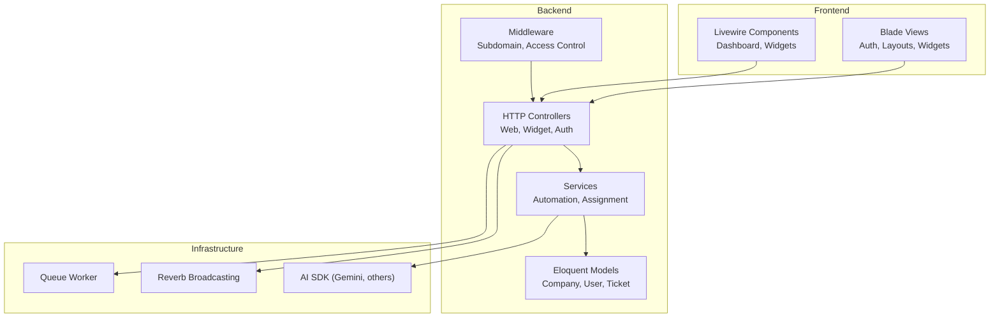
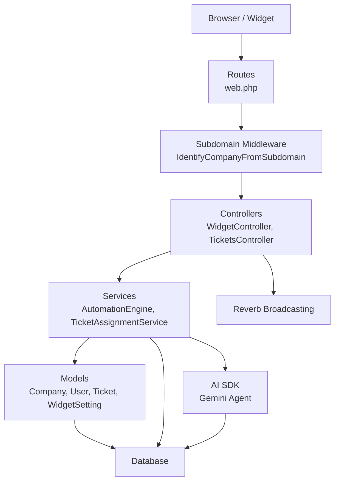
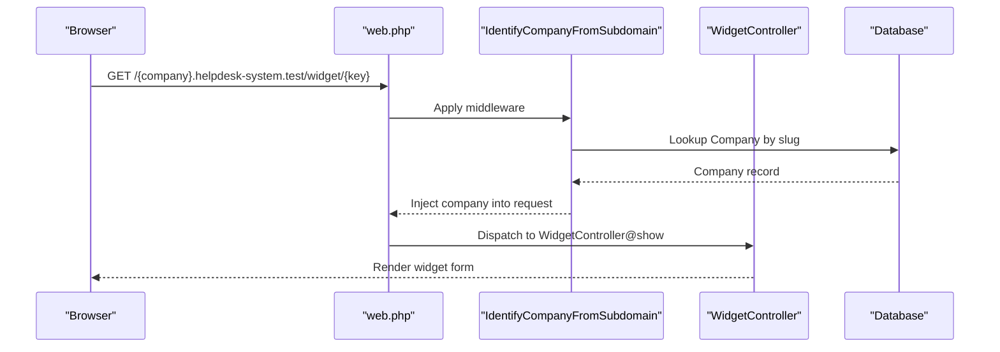
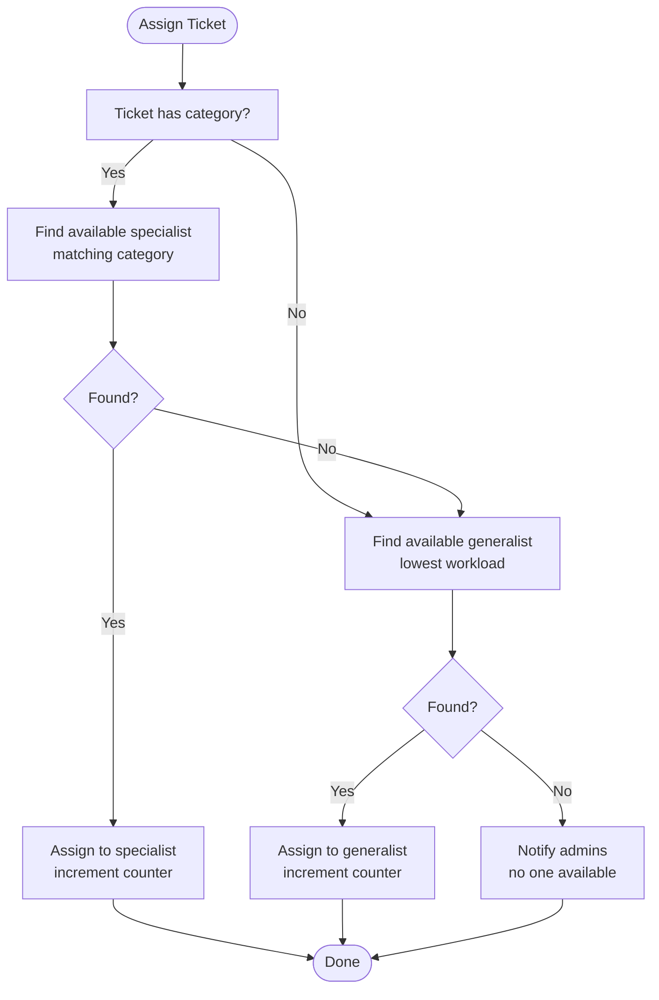
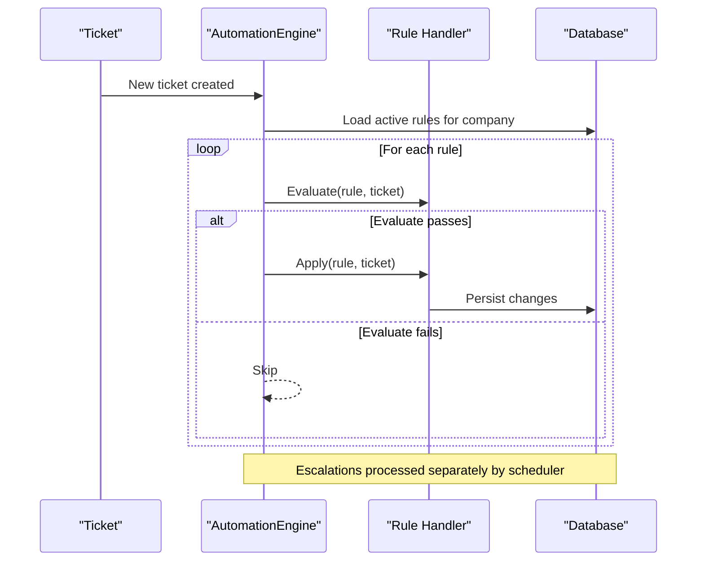
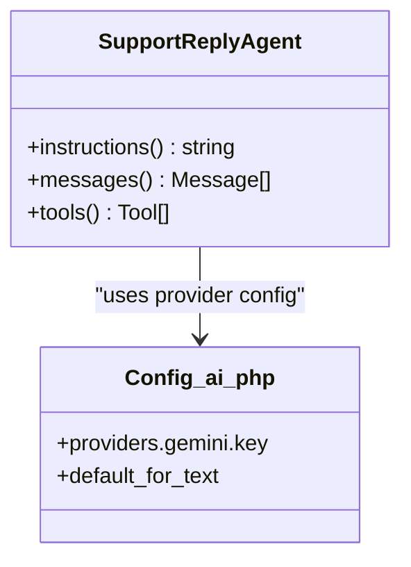
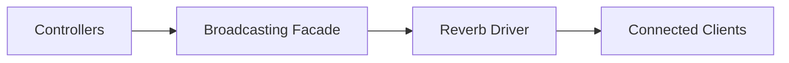
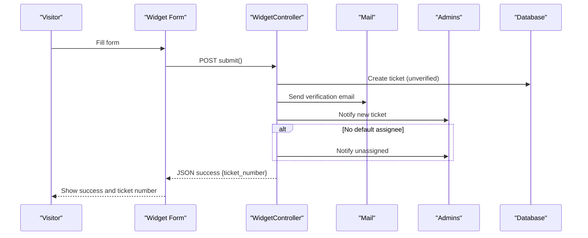
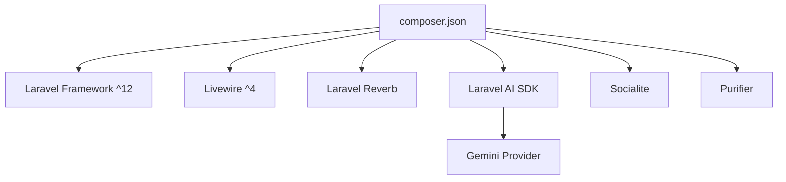

# Project Overview

<cite>
**Referenced Files in This Document**
- [composer.json](file://composer.json)
- [config/app.php](file://config/app.php)
- [routes/web.php](file://routes/web.php)
- [app/Http/Middleware/IdentifyCompanyFromSubdomain.php](file://app/Http/Middleware/IdentifyCompanyFromSubdomain.php)
- [app/Models/Company.php](file://app/Models/Company.php)
- [app/Models/User.php](file://app/Models/User.php)
- [app/Models/Ticket.php](file://app/Models/Ticket.php)
- [app/Services/TicketAssignmentService.php](file://app/Services/TicketAssignmentService.php)
- [app/Services/Automation/AutomationEngine.php](file://app/Services/Automation/AutomationEngine.php)
- [app/Console/Commands/ProcessTicketEscalations.php](file://app/Console/Commands/ProcessTicketEscalations.php)
- [config/ai.php](file://config/ai.php)
- [app/Ai/Agents/SupportReplyAgent.php](file://app/Ai/Agents/SupportReplyAgent.php)
- [config/reverb.php](file://config/reverb.php)
- [config/broadcasting.php](file://config/broadcasting.php)
- [app/Http/Controllers/WidgetController.php](file://app/Http/Controllers/WidgetController.php)
- [app/Models/WidgetSetting.php](file://app/Models/WidgetSetting.php)
- [resources/views/widget/form.blade.php](file://resources/views/widget/form.blade.php)
- [app/Livewire/Widget/TicketConversation.php](file://app/Livewire/Widget/TicketConversation.php)
</cite>

## Table of Contents
1. [Introduction](#introduction)
2. [Project Structure](#project-structure)
3. [Core Components](#core-components)
4. [Architecture Overview](#architecture-overview)
5. [Detailed Component Analysis](#detailed-component-analysis)
6. [Dependency Analysis](#dependency-analysis)
7. [Performance Considerations](#performance-considerations)
8. [Troubleshooting Guide](#troubleshooting-guide)
9. [Conclusion](#conclusion)

## Introduction
Helpdesk System is a multi-company ticketing platform designed to streamline customer support across organizations. It combines a Laravel 12 backend with Livewire 4 for dynamic, reactive frontend components. The platform integrates AI assistance powered by the Gemini provider and real-time communication via Laravel Reverb. Organizations can onboard independently, operate under subdomains, and leverage automation rules to improve efficiency. Key value propositions include automated ticket assignment, real-time notifications, and customer self-service through embeddable widgets.

## Project Structure
The project follows a layered architecture:
- Backend: Laravel MVC with Eloquent models, controllers, services, and jobs.
- Frontend: Blade templates and Livewire components for interactive dashboards and widgets.
- AI: Laravel AI SDK configured with multiple providers, including Gemini.
- Real-time: Reverb for WebSocket broadcasting integrated with Laravel’s broadcasting system.
- Multi-tenancy: Subdomain routing to isolate companies and their data.

**Diagram sources**
- [routes/web.php:1-117](file://routes/web.php#L1-L117)
- [app/Http/Middleware/IdentifyCompanyFromSubdomain.php:1-54](file://app/Http/Middleware/IdentifyCompanyFromSubdomain.php#L1-L54)
- [app/Services/TicketAssignmentService.php:1-179](file://app/Services/TicketAssignmentService.php#L1-L179)
- [app/Services/Automation/AutomationEngine.php:1-142](file://app/Services/Automation/AutomationEngine.php#L1-L142)
- [config/reverb.php:1-97](file://config/reverb.php#L1-L97)
- [config/broadcasting.php:1-83](file://config/broadcasting.php#L1-L83)
- [config/ai.php:1-130](file://config/ai.php#L1-L130)

**Section sources**
- [routes/web.php:1-117](file://routes/web.php#L1-L117)
- [config/app.php:125-128](file://config/app.php#L125-L128)

## Core Components
- Multi-tenant subdomain routing: Companies are identified by subdomains and isolated per tenant.
- Ticket lifecycle: Creation, assignment, replies, status updates, and automation-driven actions.
- AI-assisted support: Agents powered by Gemini for generating support replies.
- Real-time communication: WebSocket broadcasting via Reverb for live updates.
- Self-service widgets: Embeddable forms and trackers for customers to submit and follow up on tickets.

**Section sources**
- [app/Http/Middleware/IdentifyCompanyFromSubdomain.php:1-54](file://app/Http/Middleware/IdentifyCompanyFromSubdomain.php#L1-L54)
- [app/Models/Company.php:1-47](file://app/Models/Company.php#L1-L47)
- [app/Models/User.php:1-137](file://app/Models/User.php#L1-L137)
- [app/Models/Ticket.php:1-64](file://app/Models/Ticket.php#L1-L64)
- [app/Ai/Agents/SupportReplyAgent.php:1-50](file://app/Ai/Agents/SupportReplyAgent.php#L1-L50)
- [config/reverb.php:1-97](file://config/reverb.php#L1-L97)
- [app/Http/Controllers/WidgetController.php:1-197](file://app/Http/Controllers/WidgetController.php#L1-L197)

## Architecture Overview
The system architecture centers around multi-tenant isolation via subdomains, with a robust backend orchestrating automation, AI, and real-time updates.

**Diagram sources**
- [routes/web.php:70-114](file://routes/web.php#L70-L114)
- [app/Http/Middleware/IdentifyCompanyFromSubdomain.php:10-36](file://app/Http/Middleware/IdentifyCompanyFromSubdomain.php#L10-L36)
- [app/Http/Controllers/WidgetController.php:19-197](file://app/Http/Controllers/WidgetController.php#L19-L197)
- [app/Services/Automation/AutomationEngine.php:15-142](file://app/Services/Automation/AutomationEngine.php#L15-L142)
- [app/Services/TicketAssignmentService.php:12-179](file://app/Services/TicketAssignmentService.php#L12-L179)
- [app/Models/Company.php:8-47](file://app/Models/Company.php#L8-L47)
- [app/Models/User.php:13-137](file://app/Models/User.php#L13-L137)
- [app/Models/Ticket.php:9-64](file://app/Models/Ticket.php#L9-L64)
- [app/Models/WidgetSetting.php:9-71](file://app/Models/WidgetSetting.php#L9-L71)
- [app/Ai/Agents/SupportReplyAgent.php:18-50](file://app/Ai/Agents/SupportReplyAgent.php#L18-L50)
- [config/reverb.php:29-97](file://config/reverb.php#L29-L97)

## Detailed Component Analysis

### Multi-Tenant Subdomain Routing
Organizations are identified by subdomains and isolated through middleware and route groups. The subdomain middleware extracts the company slug, loads the Company model, and shares it across views and requests. Routes are grouped under the company domain pattern, ensuring access control and onboarding checks.

**Diagram sources**
- [routes/web.php:70-75](file://routes/web.php#L70-L75)
- [app/Http/Middleware/IdentifyCompanyFromSubdomain.php:12-36](file://app/Http/Middleware/IdentifyCompanyFromSubdomain.php#L12-L36)
- [app/Http/Controllers/WidgetController.php:24-36](file://app/Http/Controllers/WidgetController.php#L24-L36)

**Section sources**
- [routes/web.php:70-114](file://routes/web.php#L70-L114)
- [app/Http/Middleware/IdentifyCompanyFromSubdomain.php:10-54](file://app/Http/Middleware/IdentifyCompanyFromSubdomain.php#L10-L54)
- [app/Models/Company.php:14-17](file://app/Models/Company.php#L14-L17)

### Automated Ticket Assignment
The system automatically assigns tickets to the best available operator based on specialty and workload. If no specialist is available, it falls back to generalists. If no one is available, administrators receive notifications.

**Diagram sources**
- [app/Services/TicketAssignmentService.php:22-94](file://app/Services/TicketAssignmentService.php#L22-L94)
- [app/Models/User.php:74-97](file://app/Models/User.php#L74-L97)
- [app/Models/Ticket.php:16-24](file://app/Models/Ticket.php#L16-L24)

**Section sources**
- [app/Services/TicketAssignmentService.php:12-179](file://app/Services/TicketAssignmentService.php#L12-L179)
- [app/Models/User.php:13-137](file://app/Models/User.php#L13-L137)
- [app/Models/Ticket.php:9-64](file://app/Models/Ticket.php#L9-L64)

### Automation Engine and Escalations
Automation rules are evaluated upon ticket creation and applied immediately (except escalations). Escalation rules are processed periodically via a scheduled command that iterates through companies.

**Diagram sources**
- [app/Services/Automation/AutomationEngine.php:30-96](file://app/Services/Automation/AutomationEngine.php#L30-L96)
- [app/Console/Commands/ProcessTicketEscalations.php:29-53](file://app/Console/Commands/ProcessTicketEscalations.php#L29-L53)

**Section sources**
- [app/Services/Automation/AutomationEngine.php:15-142](file://app/Services/Automation/AutomationEngine.php#L15-L142)
- [app/Console/Commands/ProcessTicketEscalations.php:9-55](file://app/Console/Commands/ProcessTicketEscalations.php#L9-L55)

### AI Integration with Gemini
The SupportReplyAgent uses the Gemini provider to generate concise, contextual support replies. The agent is configured via attributes to target the appropriate provider and model.

**Diagram sources**
- [app/Ai/Agents/SupportReplyAgent.php:18-50](file://app/Ai/Agents/SupportReplyAgent.php#L18-L50)
- [config/ai.php:82-85](file://config/ai.php#L82-L85)

**Section sources**
- [app/Ai/Agents/SupportReplyAgent.php:18-50](file://app/Ai/Agents/SupportReplyAgent.php#L18-L50)
- [config/ai.php:1-130](file://config/ai.php#L1-L130)

### Real-Time Communication with Reverb
Reverb provides WebSocket broadcasting for real-time updates. The broadcasting configuration selects the Reverb driver and app credentials, enabling live notifications and chat-like experiences.

**Diagram sources**
- [config/broadcasting.php:33-47](file://config/broadcasting.php#L33-L47)
- [config/reverb.php:31-55](file://config/reverb.php#L31-L55)

**Section sources**
- [config/broadcasting.php:1-83](file://config/broadcasting.php#L1-L83)
- [config/reverb.php:1-97](file://config/reverb.php#L1-L97)

### Widget Integration and Customer Self-Service
Customers can submit tickets and track progress via embeddable widgets. The widget form posts to the WidgetController, which validates input, creates a ticket, sends verification emails, and notifies administrators. Livewire components power the widget conversation UI for ongoing customer replies.

**Diagram sources**
- [resources/views/widget/form.blade.php:213-221](file://resources/views/widget/form.blade.php#L213-L221)
- [app/Http/Controllers/WidgetController.php:41-109](file://app/Http/Controllers/WidgetController.php#L41-L109)
- [app/Models/WidgetSetting.php:47-53](file://app/Models/WidgetSetting.php#L47-L53)

**Section sources**
- [app/Http/Controllers/WidgetController.php:19-197](file://app/Http/Controllers/WidgetController.php#L19-L197)
- [app/Models/WidgetSetting.php:9-71](file://app/Models/WidgetSetting.php#L9-L71)
- [resources/views/widget/form.blade.php:1-250](file://resources/views/widget/form.blade.php#L1-L250)
- [app/Livewire/Widget/TicketConversation.php:12-100](file://app/Livewire/Widget/TicketConversation.php#L12-L100)

## Dependency Analysis
The project relies on Laravel 12, Livewire 4, Reverb, and the Laravel AI SDK. Composer scripts orchestrate development and testing, while configuration files define provider defaults and broadcasting options.

**Diagram sources**
- [composer.json:11-22](file://composer.json#L11-L22)
- [config/ai.php:82-85](file://config/ai.php#L82-L85)

**Section sources**
- [composer.json:1-108](file://composer.json#L1-L108)
- [config/ai.php:1-130](file://config/ai.php#L1-L130)

## Performance Considerations
- Use queues for long-running tasks (e.g., AI processing, email sending) to keep requests responsive.
- Cache company-scoped data (agents, categories) to reduce repeated queries.
- Optimize database indexes on frequently filtered columns (e.g., company_id, status, created_at).
- Scale Reverb horizontally using Redis-backed clustering for high concurrency.
- Minimize payload sizes for WebSocket events and batch updates where possible.

## Troubleshooting Guide
- Subdomain not recognized: Ensure the subdomain matches the company slug and the middleware is applied to the route group.
- Reverb connection errors: Verify broadcasting configuration and Reverb server credentials; check TLS settings and allowed origins.
- AI provider failures: Confirm API keys and provider availability; review default provider selections in AI configuration.
- Escalation rules not triggering: Ensure the scheduler runs the command and that the rule type is correctly configured.

**Section sources**
- [app/Http/Middleware/IdentifyCompanyFromSubdomain.php:12-36](file://app/Http/Middleware/IdentifyCompanyFromSubdomain.php#L12-L36)
- [config/broadcasting.php:33-47](file://config/broadcasting.php#L33-L47)
- [config/reverb.php:31-97](file://config/reverb.php#L31-L97)
- [config/ai.php:82-85](file://config/ai.php#L82-L85)
- [app/Console/Commands/ProcessTicketEscalations.php:29-53](file://app/Console/Commands/ProcessTicketEscalations.php#L29-L53)

## Conclusion
Helpdesk System delivers a scalable, multi-tenant ticketing solution with powerful automation, AI assistance, and real-time communication. Its architecture leverages Laravel and Livewire to provide a modern developer and user experience, while subdomain routing ensures organizational isolation. Organizations benefit from automated assignment, streamlined self-service, and extensible automation rules tailored to their workflows.