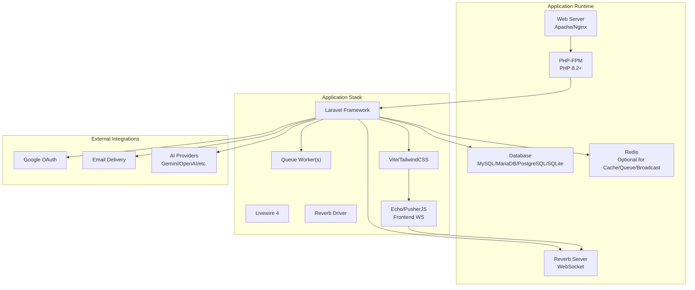
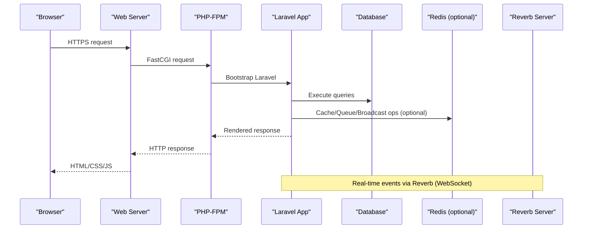
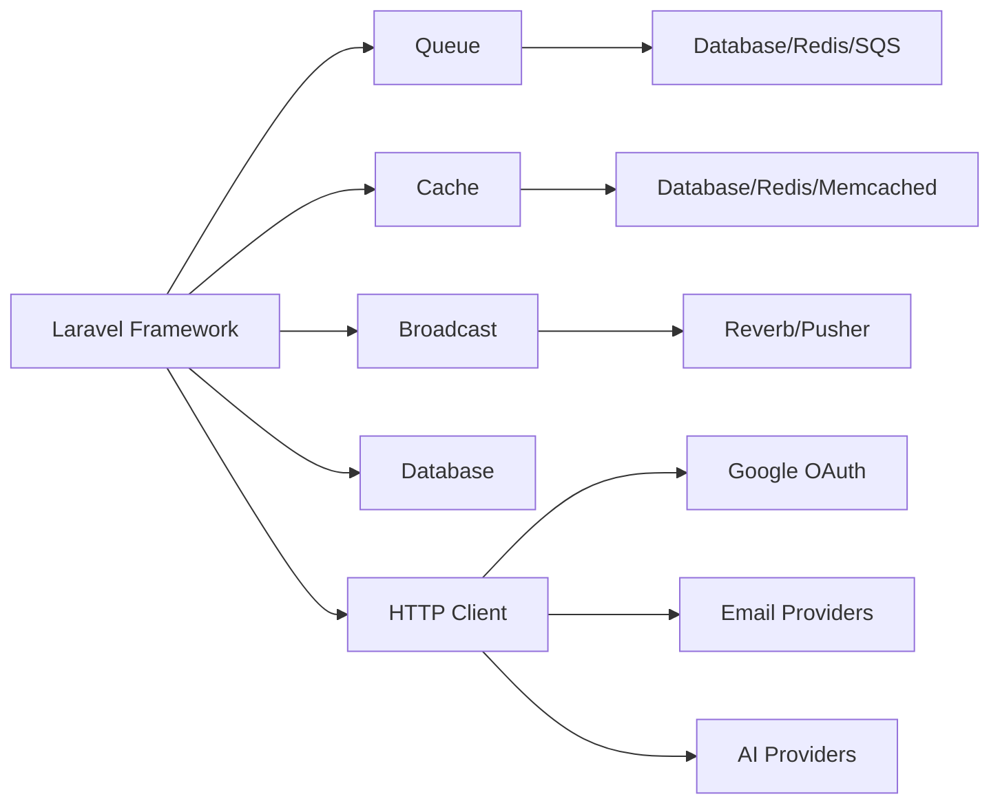

# System Requirements

<cite>
**Referenced Files in This Document**
- [composer.json](file://composer.json)
- [package.json](file://package.json)
- [vite.config.js](file://vite.config.js)
- [config/app.php](file://config/app.php)
- [config/database.php](file://config/database.php)
- [config/queue.php](file://config/queue.php)
- [config/broadcasting.php](file://config/broadcasting.php)
- [config/reverb.php](file://config/reverb.php)
- [config/mail.php](file://config/mail.php)
- [config/services.php](file://config/services.php)
- [config/ai.php](file://config/ai.php)
- [routes/web.php](file://routes/web.php)
- [app/Http/Controllers/GoogleController.php](file://app/Http/Controllers/GoogleController.php)
</cite>

## Table of Contents
1. [Introduction](#introduction)
2. [Project Structure](#project-structure)
3. [Core Components](#core-components)
4. [Architecture Overview](#architecture-overview)
5. [Detailed Component Analysis](#detailed-component-analysis)
6. [Dependency Analysis](#dependency-analysis)
7. [Performance Considerations](#performance-considerations)
8. [Troubleshooting Guide](#troubleshooting-guide)
9. [Conclusion](#conclusion)

## Introduction
This document defines the system requirements for deploying and operating the Helpdesk System. It covers hardware sizing guidelines, software prerequisites, server configuration, memory planning for queues and real-time features, network requirements for external APIs and WebSocket communications, browser compatibility, and security controls. The guidance is derived from the project’s configuration and runtime dependencies.

## Project Structure
The Helpdesk System is a Laravel 12 application with Livewire 4, Reverb for real-time messaging, and optional AI integrations. The frontend assets are built with Vite and TailwindCSS. The application integrates with external services for authentication (Google OAuth), email delivery, and AI providers.

**Diagram sources**
- [composer.json:11-22](file://composer.json#L11-L22)
- [config/database.php:32-115](file://config/database.php#L32-L115)
- [config/broadcasting.php:31-80](file://config/broadcasting.php#L31-L80)
- [config/reverb.php:29-57](file://config/reverb.php#L29-L57)
- [config/queue.php:32-92](file://config/queue.php#L32-L92)
- [package.json:9-35](file://package.json#L9-L35)
- [vite.config.js:7-21](file://vite.config.js#L7-L21)

**Section sources**
- [composer.json:11-22](file://composer.json#L11-L22)
- [package.json:9-35](file://package.json#L9-L35)
- [vite.config.js:7-21](file://vite.config.js#L7-L21)
- [config/database.php:32-115](file://config/database.php#L32-L115)
- [config/broadcasting.php:31-80](file://config/broadcasting.php#L31-L80)
- [config/reverb.php:29-57](file://config/reverb.php#L29-L57)
- [config/queue.php:32-92](file://config/queue.php#L32-L92)

## Core Components
- PHP runtime and extensions: The project requires PHP 8.2+ and leverages Laravel’s framework defaults. No additional PHP extensions are explicitly declared in the primary dependency manifest; however, standard PHP extensions commonly required by Laravel (e.g., PDO, OpenSSL, Mbstring, Tokenizer, XML, Ctype, JSON) are implied by the framework.
- Database: Supports SQLite, MySQL, MariaDB, PostgreSQL, and SQL Server. The default connection is SQLite, but MySQL/MariaDB are recommended for production.
- Queue: Uses Laravel queues with multiple drivers (database, Redis, SQS, Beanstalkd). The default is database.
- Real-time: Reverb is configured as the default broadcaster and supports WebSocket connections.
- Frontend toolchain: Vite with Laravel Vite plugin and TailwindCSS; optional Pusher/Laravel Echo for WebSocket events.
- External integrations: Google OAuth via Socialite, email transport via SMTP/SES/Postmark/Resend/log, and AI providers via Laravel AI SDK.

**Section sources**
- [composer.json:11-22](file://composer.json#L11-L22)
- [config/database.php:32-115](file://config/database.php#L32-L115)
- [config/queue.php:32-92](file://config/queue.php#L32-L92)
- [config/broadcasting.php:31-80](file://config/broadcasting.php#L31-L80)
- [config/reverb.php:29-57](file://config/reverb.php#L29-L57)
- [package.json:9-35](file://package.json#L9-L35)
- [config/services.php:38-42](file://config/services.php#L38-L42)
- [config/mail.php:38-100](file://config/mail.php#L38-L100)
- [config/ai.php:52-127](file://config/ai.php#L52-L127)

## Architecture Overview
The system relies on a web server fronting PHP-FPM, serving a Laravel application that interacts with a database and optional Redis. Real-time features are handled by Reverb, while queue processing runs as background workers. Frontend assets are compiled via Vite and consumed by Livewire components and optional Echo clients.

**Diagram sources**
- [config/database.php:32-115](file://config/database.php#L32-L115)
- [config/reverb.php:29-57](file://config/reverb.php#L29-L57)
- [config/broadcasting.php:31-80](file://config/broadcasting.php#L31-L80)

## Detailed Component Analysis

### Hardware Requirements
- Minimum footprint: Suitable for small deployments (single tenant, low concurrent users) on modest hardware with shared hosting-like constraints.
- Small scale (up to ~50 concurrent users): 2 vCPUs, 4 GB RAM, 20 GB SSD, 1 Gbps network.
- Medium scale (up to ~500 concurrent users): 4 vCPUs, 8 GB RAM, 50 GB SSD, 1 Gbps network.
- Large scale (up to ~2000+ concurrent users): 8 vCPUs, 16 GB RAM, 100 GB SSD, 1–10 Gbps network.
- Storage: Provision at least 2x current database size for growth and backups. Consider SSD for I/O-heavy workloads (queues, media uploads).
- Notes: These are indicative baselines. Actual sizing depends on traffic patterns, queue volume, real-time connections, and AI usage.

[No sources needed since this section provides general guidance]

### Software Prerequisites
- PHP runtime: PHP 8.2+ (required by the framework).
- PHP extensions: Required by Laravel and common configurations (PDO, OpenSSL, Mbstring, Tokenizer, XML, Ctype, JSON). Ensure these are enabled in your PHP installation.
- Database: MySQL 5.7+/8.0+ or MariaDB 10.3+ recommended; PostgreSQL 12+ supported; SQLite for development/testing.
- Node.js: 16+ (required by Vite and tooling).
- Composer: Required for PHP dependency management.
- Optional: Redis server for caching, queues, and broadcasting.

**Section sources**
- [composer.json:11-22](file://composer.json#L11-L22)
- [config/database.php:32-115](file://config/database.php#L32-L115)
- [package.json:9-35](file://package.json#L9-L35)

### Server Requirements
- Web server: Apache 2.4+ or Nginx 1.18+ with TLS termination recommended.
- PHP-FPM: Configure PHP-FPM pool(s) aligned with expected concurrency and memory limits.
- Database server: MySQL/MariaDB/PostgreSQL/SQL Server; ensure proper charset/collation and connection pooling.
- Redis: Optional but recommended for production to offload cache, queues, and broadcasting.

**Section sources**
- [config/database.php:32-115](file://config/database.php#L32-L115)
- [config/reverb.php:29-57](file://config/reverb.php#L29-L57)

### Memory Requirements
- PHP-FPM memory: Allocate per-process memory considering peak concurrent requests and Livewire rendering overhead. Use process manager modes (dynamic or pm.max_requests) to balance stability and memory usage.
- Queue workers: Memory usage increases with queued jobs and concurrency. Use supervisor-style management to restart workers periodically.
- Real-time (WebSocket): Each Reverb connection consumes memory proportional to active clients and event throughput. Plan Redis memory for pub/sub and connection metadata.
- Asset compilation: Vite builds require memory during development; production builds are typically short-lived and can be cached.

**Section sources**
- [config/queue.php:32-92](file://config/queue.php#L32-L92)
- [config/reverb.php:29-57](file://config/reverb.php#L29-L57)

### Network Requirements
- Inbound: TCP/443 for HTTPS; TCP/80 optional for redirects; TCP/22 for SSH if applicable.
- Outbound: TLS egress to external services:
  - Google OAuth endpoints for authentication.
  - Email provider endpoints (SMTP/SES/Postmark/Resend).
  - AI provider endpoints (e.g., Gemini OpenAI) depending on configuration.
  - WebSocket origins for Reverb (TCP/443 or custom port).
- Firewall: Allow inbound ports from clients and outbound to external services; restrict internal administrative ports.

**Section sources**
- [config/services.php:38-42](file://config/services.php#L38-L42)
- [config/mail.php:38-100](file://config/mail.php#L38-L100)
- [config/ai.php:52-127](file://config/ai.php#L52-L127)
- [config/reverb.php:29-57](file://config/reverb.php#L29-L57)

### Browser Compatibility and Mobile Responsiveness
- Modern browsers: Chrome, Firefox, Safari, Edge (latest versions).
- Mobile responsiveness: The project uses TailwindCSS; ensure viewport meta tag and responsive breakpoints are applied in templates.
- Real-time features: WebSocket support varies by browser; Reverb and Echo/PusherJS provide fallbacks where applicable.

**Section sources**
- [package.json:9-35](file://package.json#L9-L35)
- [vite.config.js:7-21](file://vite.config.js#L7-L21)

### Security Requirements
- TLS/SSL: Enforce HTTPS with modern cipher suites and TLS 1.2+.
- Headers: Implement security headers (Strict-Transport-Security, X-Frame-Options, X-Content-Type-Options, Referrer-Policy, Content-Security-Policy).
- Authentication: Use secure cookies, CSRF protection, and rate limiting for OAuth and login flows.
- Secrets: Store API keys and credentials in environment variables; restrict file permissions.
- Firewalls: Restrict inbound access to web server and Reverb; limit outbound to trusted domains.

**Section sources**
- [config/services.php:38-42](file://config/services.php#L38-L42)
- [config/mail.php:38-100](file://config/mail.php#L38-L100)
- [config/ai.php:52-127](file://config/ai.php#L52-L127)
- [config/reverb.php:29-57](file://config/reverb.php#L29-L57)

## Dependency Analysis
The application’s runtime dependencies drive infrastructure choices. Laravel’s queue, cache, and broadcasting subsystems influence whether Redis is required. Reverb and Echo shape WebSocket connectivity needs. External integrations (Google OAuth, email, AI) define outbound network policies.

**Diagram sources**
- [composer.json:11-22](file://composer.json#L11-L22)
- [config/queue.php:32-92](file://config/queue.php#L32-L92)
- [config/cache.php:35-102](file://config/cache.php#L35-L102)
- [config/broadcasting.php:31-80](file://config/broadcasting.php#L31-L80)
- [config/reverb.php:29-57](file://config/reverb.php#L29-L57)
- [config/services.php:38-42](file://config/services.php#L38-L42)
- [config/mail.php:38-100](file://config/mail.php#L38-L100)
- [config/ai.php:52-127](file://config/ai.php#L52-L127)

**Section sources**
- [composer.json:11-22](file://composer.json#L11-L22)
- [config/queue.php:32-92](file://config/queue.php#L32-L92)
- [config/cache.php:35-102](file://config/cache.php#L35-L102)
- [config/broadcasting.php:31-80](file://config/broadcasting.php#L31-L80)
- [config/reverb.php:29-57](file://config/reverb.php#L29-L57)
- [config/services.php:38-42](file://config/services.php#L38-L42)
- [config/mail.php:38-100](file://config/mail.php#L38-L100)
- [config/ai.php:52-127](file://config/ai.php#L52-L127)

## Performance Considerations
- Queue scaling: Increase worker processes and consider Redis-backed queues for higher throughput.
- Real-time scaling: Use Reverb with Redis for clustering; monitor connection counts and message sizes.
- Database tuning: Optimize queries, enable slow-query logs, and consider read replicas for reporting dashboards.
- Asset pipeline: Pre-build assets in CI/CD; leverage CDN for static assets.
- Caching: Use Redis or database cache for frequently accessed data; tune TTLs appropriately.

[No sources needed since this section provides general guidance]

## Troubleshooting Guide
- Authentication failures (Google OAuth): Verify client ID/secret and redirect URI; check callback route and middleware.
- WebSocket issues: Confirm Reverb host/port/scheme; ensure TLS is configured if required; validate allowed origins.
- Email delivery problems: Test SMTP/SES/Postmark/Resend settings; review logs and retry policies.
- Queue not processing: Confirm worker process is running; check queue connection and retry configuration.
- Database connectivity: Validate host, port, credentials, charset/collation, and SSL settings.

**Section sources**
- [app/Http/Controllers/GoogleController.php:14-76](file://app/Http/Controllers/GoogleController.php#L14-L76)
- [routes/web.php:35-38](file://routes/web.php#L35-L38)
- [config/reverb.php:29-57](file://config/reverb.php#L29-L57)
- [config/mail.php:38-100](file://config/mail.php#L38-L100)
- [config/queue.php:32-92](file://config/queue.php#L32-L92)
- [config/database.php:32-115](file://config/database.php#L32-L115)

## Conclusion
The Helpdesk System is designed around Laravel 12, Livewire 4, and Reverb for real-time capabilities. Production readiness hinges on appropriate hardware sizing, PHP and database configuration, Redis for scalability, and robust network/security controls. Align infrastructure with traffic projections, queue volumes, and real-time demands to achieve reliable performance.