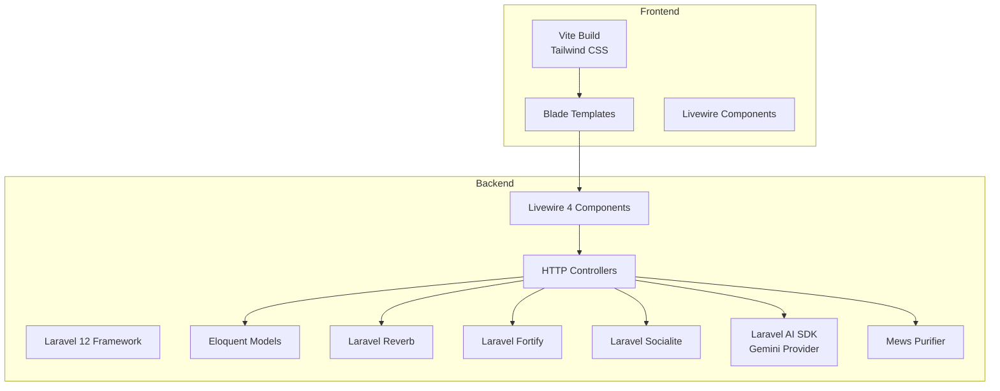
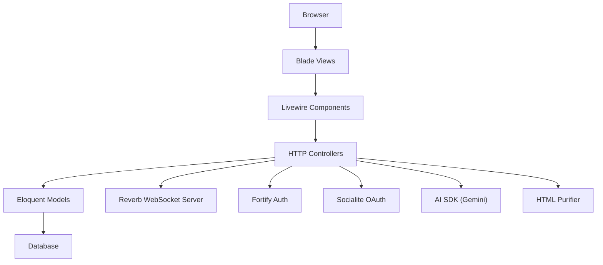
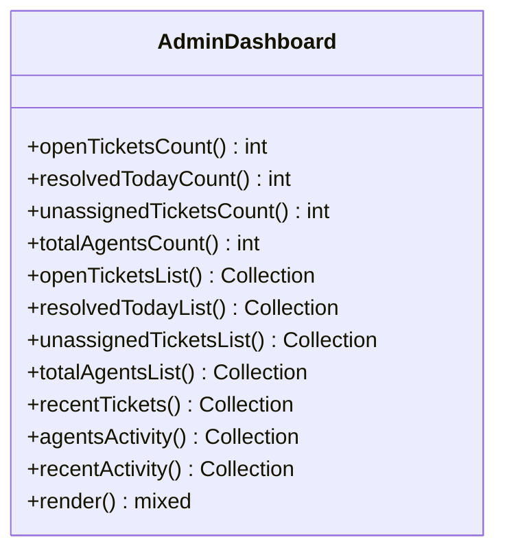
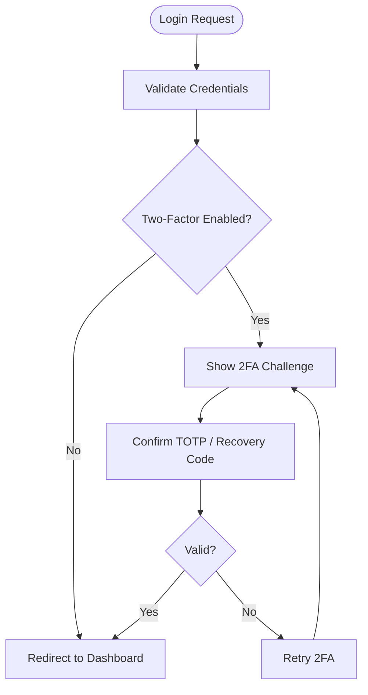
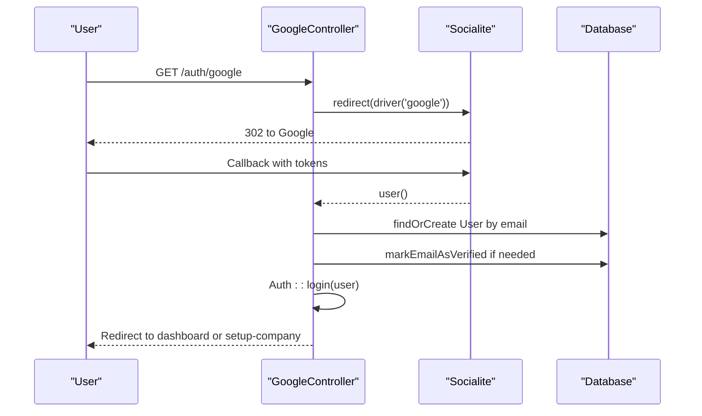
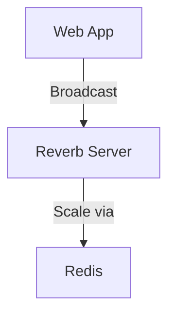
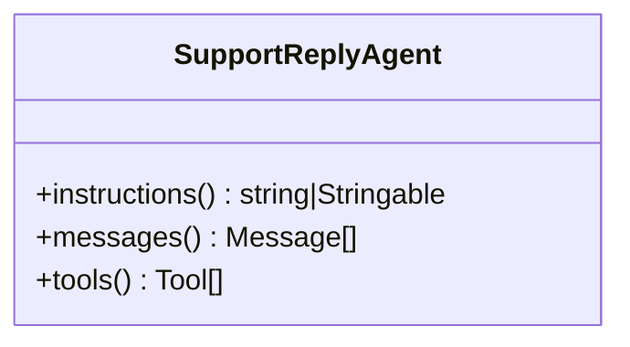
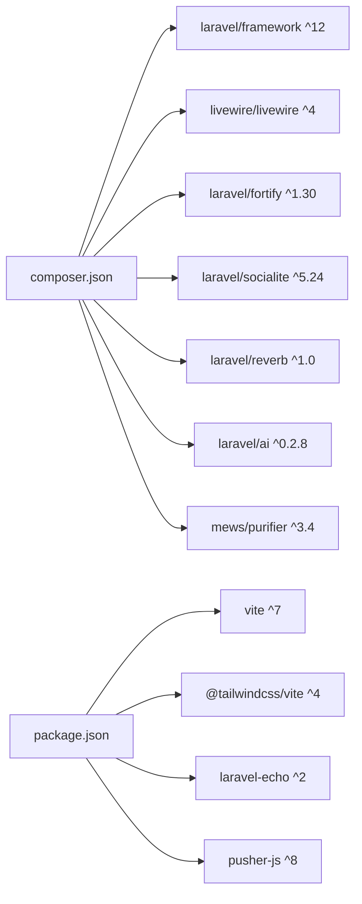

# Technology Stack

<cite>
**Referenced Files in This Document**
- [composer.json](file://composer.json)
- [package.json](file://package.json)
- [vite.config.js](file://vite.config.js)
- [config/app.php](file://config/app.php)
- [config/ai.php](file://config/ai.php)
- [config/reverb.php](file://config/reverb.php)
- [config/fortify.php](file://config/fortify.php)
- [config/purifier.php](file://config/purifier.php)
- [routes/web.php](file://routes/web.php)
- [app/Http/Controllers/GoogleController.php](file://app/Http/Controllers/GoogleController.php)
- [app/Ai/Agents/SupportReplyAgent.php](file://app/Ai/Agents/SupportReplyAgent.php)
- [app/Livewire/Dashboard/AdminDashboard.php](file://app/Livewire/Dashboard/AdminDashboard.php)
- [app/Models/User.php](file://app/Models/User.php)
- [bootstrap/providers.php](file://bootstrap/providers.php)
- [config/database.php](file://config/database.php)
- [tests/Pest.php](file://tests/Pest.php)
- [pint.json](file://pint.json)
</cite>

## Table of Contents
1. [Introduction](#introduction)
2. [Project Structure](#project-structure)
3. [Core Components](#core-components)
4. [Architecture Overview](#architecture-overview)
5. [Detailed Component Analysis](#detailed-component-analysis)
6. [Dependency Analysis](#dependency-analysis)
7. [Performance Considerations](#performance-considerations)
8. [Troubleshooting Guide](#troubleshooting-guide)
9. [Conclusion](#conclusion)
10. [Appendices](#appendices)

## Introduction
This document describes the technology stack powering the Helpdesk System. It covers the backend framework Laravel 12 and its ecosystem, the Livewire 4 reactive UI layer, Laravel Fortify for authentication, Laravel Socialite for Google OAuth, Laravel Reverb for real-time WebSocket communication, and the frontend toolchain built around Vite, modern JavaScript, and Blade templating. It also documents AI integration via Laravel AI SDK with the Gemini provider, the database layer using Eloquent ORM, and security components including two-factor authentication and HTML sanitization via Mews Purifier. Finally, it outlines development tools such as Pest for testing, Laravel Pint for code formatting, and debugging aids, along with a version compatibility matrix and upgrade considerations.

## Project Structure
The project follows a conventional Laravel application layout with feature-based organization across app/, resources/, routes/, and config/. The backend is Laravel 12 with Livewire 4 components for dynamic UI, and the frontend assets are built with Vite. Authentication is handled by Laravel Fortify with optional Google OAuth via Socialite. Real-time features leverage Laravel Reverb. AI capabilities are integrated using Laravel AI SDK with a Gemini provider configuration. Security includes two-factor authentication and HTML sanitization.

**Diagram sources**
- [vite.config.js:1-22](file://vite.config.js#L1-L22)
- [routes/web.php:1-117](file://routes/web.php#L1-L117)
- [app/Http/Controllers/GoogleController.php:1-78](file://app/Http/Controllers/GoogleController.php#L1-L78)
- [app/Ai/Agents/SupportReplyAgent.php:1-50](file://app/Ai/Agents/SupportReplyAgent.php#L1-L50)
- [app/Livewire/Dashboard/AdminDashboard.php:1-128](file://app/Livewire/Dashboard/AdminDashboard.php#L1-L128)
- [app/Models/User.php:1-137](file://app/Models/User.php#L1-L137)
- [config/reverb.php:1-97](file://config/reverb.php#L1-L97)
- [config/fortify.php:1-158](file://config/fortify.php#L1-L158)
- [config/ai.php:1-130](file://config/ai.php#L1-L130)
- [config/purifier.php:1-108](file://config/purifier.php#L1-L108)

**Section sources**
- [routes/web.php:1-117](file://routes/web.php#L1-L117)
- [vite.config.js:1-22](file://vite.config.js#L1-L22)
- [config/app.php:1-129](file://config/app.php#L1-L129)

## Core Components
- Backend framework: Laravel 12
- Reactive UI: Livewire 4
- Authentication: Laravel Fortify (with two-factor authentication)
- OAuth: Laravel Socialite (Google)
- Real-time: Laravel Reverb (WebSocket server)
- Frontend toolchain: Vite with Tailwind CSS and Blade
- AI integration: Laravel AI SDK with Gemini provider
- Database: Eloquent ORM (SQLite/MariaDB/MySQL/PostgreSQL/SQLServer)
- Security: HTML sanitization via Mews Purifier
- Testing: Pest
- Formatting: Laravel Pint
- Debugging: Laravel Debugbar (dev dependency)

**Section sources**
- [composer.json:11-35](file://composer.json#L11-L35)
- [package.json:1-37](file://package.json#L1-L37)
- [config/ai.php:82-85](file://config/ai.php#L82-L85)
- [config/fortify.php:150-155](file://config/fortify.php#L150-L155)
- [config/reverb.php:29-55](file://config/reverb.php#L29-L55)
- [config/purifier.php:20-108](file://config/purifier.php#L20-L108)
- [config/database.php:34-114](file://config/database.php#L34-L114)
- [tests/Pest.php:14-16](file://tests/Pest.php#L14-L16)
- [pint.json:1-4](file://pint.json#L1-L4)

## Architecture Overview
The system uses a layered architecture:
- Presentation: Blade templates and Livewire components render dynamic UI.
- Application: HTTP controllers orchestrate requests, delegate to services, and manage Reverb broadcasts.
- Domain: Eloquent models encapsulate business entities and relationships.
- Infrastructure: Laravel AI SDK integrates external providers, Reverb handles real-time events, and Socialite manages OAuth flows.

**Diagram sources**
- [routes/web.php:1-117](file://routes/web.php#L1-L117)
- [app/Http/Controllers/GoogleController.php:1-78](file://app/Http/Controllers/GoogleController.php#L1-L78)
- [app/Ai/Agents/SupportReplyAgent.php:1-50](file://app/Ai/Agents/SupportReplyAgent.php#L1-L50)
- [app/Livewire/Dashboard/AdminDashboard.php:1-128](file://app/Livewire/Dashboard/AdminDashboard.php#L1-L128)
- [app/Models/User.php:1-137](file://app/Models/User.php#L1-L137)
- [config/reverb.php:29-55](file://config/reverb.php#L29-L55)
- [config/fortify.php:150-155](file://config/fortify.php#L150-L155)
- [config/ai.php:82-85](file://config/ai.php#L82-L85)
- [config/purifier.php:20-108](file://config/purifier.php#L20-L108)

## Detailed Component Analysis

### Backend Framework: Laravel 12
- Core framework version is ^12.0.
- Application configuration includes domain and URL helpers for subdomain routing.
- Database connections support SQLite, MySQL, MariaDB, PostgreSQL, and SQLServer.

**Section sources**
- [composer.json:16](file://composer.json#L16)
- [config/app.php:125-128](file://config/app.php#L125-L128)
- [config/database.php:34-114](file://config/database.php#L34-L114)

### Livewire 4 for Reactive UI
- Livewire components power dynamic dashboards and settings pages.
- Example: AdminDashboard computes counts and lists via #[Computed] properties and renders via Blade.

**Diagram sources**
- [app/Livewire/Dashboard/AdminDashboard.php:14-127](file://app/Livewire/Dashboard/AdminDashboard.php#L14-L127)

**Section sources**
- [app/Livewire/Dashboard/AdminDashboard.php:1-128](file://app/Livewire/Dashboard/AdminDashboard.php#L1-L128)

### Authentication: Laravel Fortify
- Fortify features include registration, password reset, email verification, and two-factor authentication.
- Two-factor challenge flow is enabled with confirmation and password checks.

**Diagram sources**
- [config/fortify.php:150-155](file://config/fortify.php#L150-L155)

**Section sources**
- [config/fortify.php:146-155](file://config/fortify.php#L146-L155)

### OAuth: Laravel Socialite with Google
- Google OAuth is implemented via Socialite driver.
- The controller redirects to Google, receives the callback, creates or logs in users, and enforces email verification.

**Diagram sources**
- [app/Http/Controllers/GoogleController.php:14-76](file://app/Http/Controllers/GoogleController.php#L14-L76)

**Section sources**
- [app/Http/Controllers/GoogleController.php:1-78](file://app/Http/Controllers/GoogleController.php#L1-L78)
- [routes/web.php:35-38](file://routes/web.php#L35-L38)

### Real-Time: Laravel Reverb
- Reverb server configuration supports scaling via Redis and TLS options.
- Applications are configured with keys/secrets and allowed origins.

**Diagram sources**
- [config/reverb.php:29-55](file://config/reverb.php#L29-L55)
- [config/reverb.php:70-92](file://config/reverb.php#L70-L92)

**Section sources**
- [config/reverb.php:1-97](file://config/reverb.php#L1-L97)

### Frontend Toolchain: Vite, Tailwind CSS, and Blade
- Vite builds CSS/JS with Laravel plugin and Tailwind integration.
- Scripts include dev/build commands and concurrent execution with Reverb.
- Tailwind is configured via @tailwindcss/vite plugin.

**Section sources**
- [package.json:5-8](file://package.json#L5-L8)
- [vite.config.js:1-22](file://vite.config.js#L1-L22)
- [config/app.php:16](file://config/app.php#L16)

### AI Integration: Laravel AI SDK with Gemini
- AI SDK is included with provider configuration.
- Gemini provider is configured and used by an agent class.
- Default provider selection includes a dedicated default for images.

**Diagram sources**
- [app/Ai/Agents/SupportReplyAgent.php:18-49](file://app/Ai/Agents/SupportReplyAgent.php#L18-L49)
- [config/ai.php:82-85](file://config/ai.php#L82-L85)

**Section sources**
- [composer.json:14](file://composer.json#L14)
- [config/ai.php:16-21](file://config/ai.php#L16-L21)
- [config/ai.php:82-85](file://config/ai.php#L82-L85)
- [app/Ai/Agents/SupportReplyAgent.php:1-50](file://app/Ai/Agents/SupportReplyAgent.php#L1-L50)

### Database Layer: Eloquent ORM
- Multiple database drivers are supported (SQLite, MySQL/MariaDB, PostgreSQL, SQLServer).
- Eloquent models define relationships and scopes; example includes soft deletes and two-factor traits.

**Section sources**
- [config/database.php:34-114](file://config/database.php#L34-L114)
- [app/Models/User.php:13-137](file://app/Models/User.php#L13-L137)

### Security: Two-Factor Authentication and HTML Sanitization
- Two-factor authentication is enabled via Laravel Fortify and the User model trait.
- HTML sanitization is configured via Mews Purifier with allowed tags and attributes.

**Section sources**
- [config/fortify.php:150-155](file://config/fortify.php#L150-L155)
- [app/Models/User.php:15](file://app/Models/User.php#L15)
- [config/purifier.php:20-108](file://config/purifier.php#L20-L108)

### Development Tools: Pest, Laravel Pint, and Debugging
- Pest is configured as the test framework with RefreshDatabase trait.
- Laravel Pint is configured with Laravel preset.
- Debugbar is available as a dev dependency.

**Section sources**
- [tests/Pest.php:14-16](file://tests/Pest.php#L14-L16)
- [pint.json:1-4](file://pint.json#L1-L4)
- [composer.json:26](file://composer.json#L26)

## Dependency Analysis
The application’s primary runtime dependencies include Laravel 12, Livewire 4, Fortify, Socialite, Reverb, AI SDK, and Purifier. Dev dependencies include Pest, Pint, Debugbar, and related tooling. Scripts orchestrate setup, development, linting, and testing.

**Diagram sources**
- [composer.json:11-35](file://composer.json#L11-L35)
- [package.json:9-35](file://package.json#L9-L35)

**Section sources**
- [composer.json:11-35](file://composer.json#L11-L35)
- [package.json:1-37](file://package.json#L1-37)

## Performance Considerations
- Use computed properties in Livewire components judiciously to avoid heavy queries on every render.
- Optimize database queries with eager loading and appropriate indexing.
- Enable caching for frequently accessed company-specific data to reduce redundant computations.
- Configure Reverb scaling with Redis for production deployments.
- Minimize HTML content processing by leveraging Purifier’s cache settings.

[No sources needed since this section provides general guidance]

## Troubleshooting Guide
- Authentication failures: Verify Fortify configuration and ensure two-factor settings align with user state.
- Google OAuth errors: Confirm client ID/secret and callback URLs; inspect controller error handling for failure scenarios.
- Reverb connectivity: Check server host/port/path and TLS configuration; ensure Redis is reachable for scaling.
- AI provider issues: Validate Gemini API key and provider defaults; confirm agent provider annotations.
- HTML sanitization: Review allowed tags and attributes in Purifier configuration; adjust settings for specific content needs.
- Testing: Run Pest tests with RefreshDatabase to ensure clean state; use Pint to enforce consistent formatting.

**Section sources**
- [config/fortify.php:150-155](file://config/fortify.php#L150-L155)
- [app/Http/Controllers/GoogleController.php:26-31](file://app/Http/Controllers/GoogleController.php#L26-L31)
- [config/reverb.php:32-54](file://config/reverb.php#L32-L54)
- [config/ai.php:82-85](file://config/ai.php#L82-L85)
- [config/purifier.php:27-33](file://config/purifier.php#L27-L33)
- [tests/Pest.php:14-16](file://tests/Pest.php#L14-L16)
- [pint.json:1-4](file://pint.json#L1-L4)

## Conclusion
The Helpdesk System leverages a modern, cohesive stack centered on Laravel 12 and Livewire 4 for a responsive UI, robust authentication with Fortify and Socialite, real-time communication via Reverb, and intelligent assistance powered by Laravel AI SDK with Gemini. The frontend is streamlined with Vite and Tailwind, while Eloquent ORM and Mews Purifier provide reliable data handling and content safety. Development workflows are supported by Pest and Laravel Pint, ensuring maintainability and quality.

[No sources needed since this section summarizes without analyzing specific files]

## Appendices

### Version Compatibility Matrix
- Laravel Framework: ^12.0
- Livewire: ^4.0
- Laravel Fortify: ^1.30
- Laravel Socialite: ^5.24
- Laravel Reverb: ^1.0
- Laravel AI SDK: ^0.2.8
- Mews Purifier: ^3.4
- Vite: ^7.0
- Tailwind CSS: ^4.1.18
- Laravel Echo: ^2.3.1
- Pusher JS: ^8.4.0

**Section sources**
- [composer.json:11-22](file://composer.json#L11-L22)
- [package.json:9-35](file://package.json#L9-L35)

### Upgrade Considerations
- Laravel 12 introduces new features and deprecations; review breaking changes and update application code accordingly.
- Livewire 4 requires updating component syntax and event handling patterns; test thoroughly after upgrades.
- Fortify updates may alter default behaviors; validate two-factor and password policies.
- Reverb upgrades should be coordinated with Redis and TLS configurations.
- AI SDK changes may require adjusting provider configurations and agent annotations.
- Vite and Tailwind updates may necessitate reviewing plugin configurations and build scripts.

[No sources needed since this section provides general guidance]