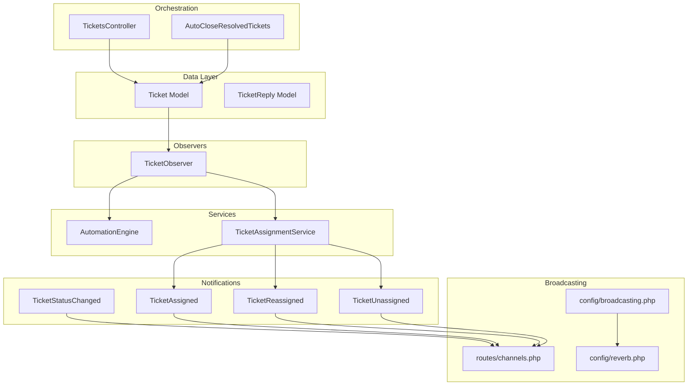
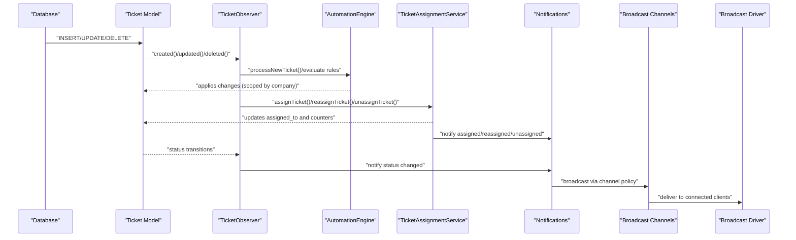
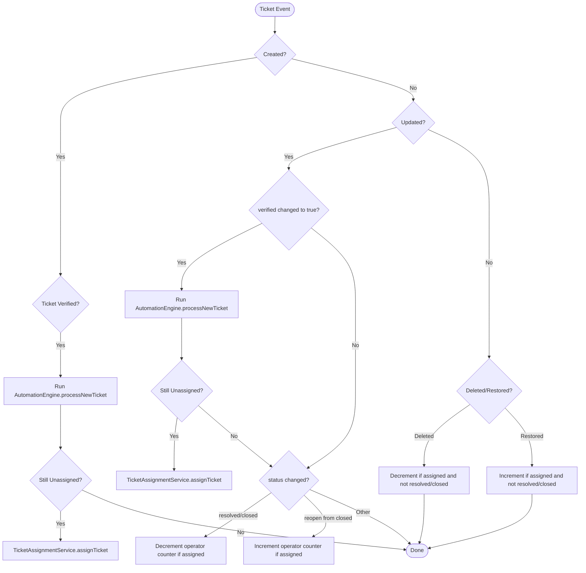
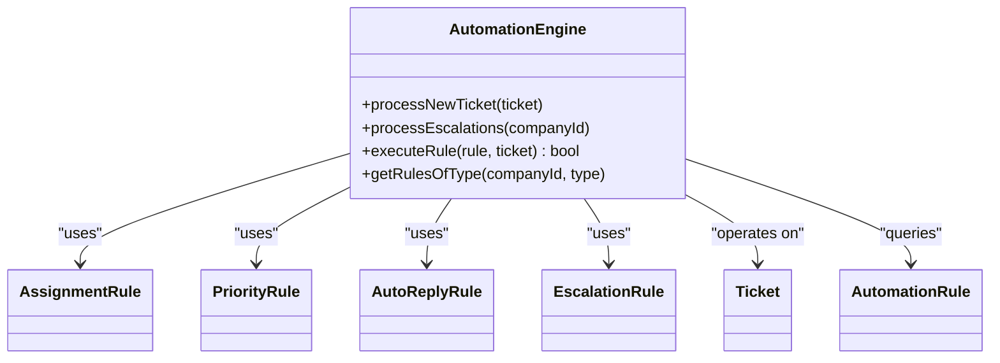
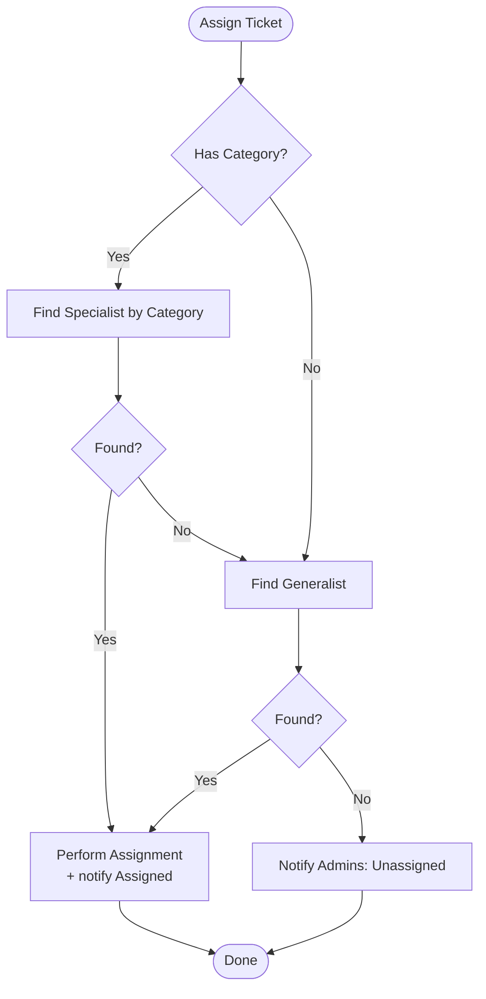
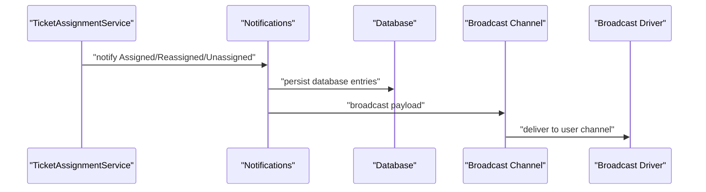
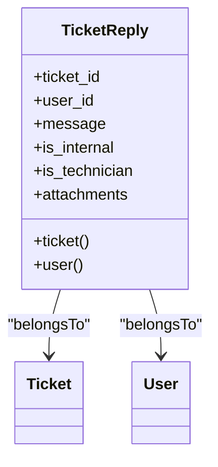
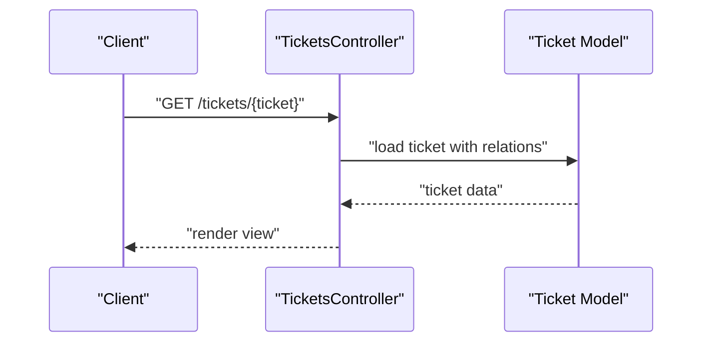
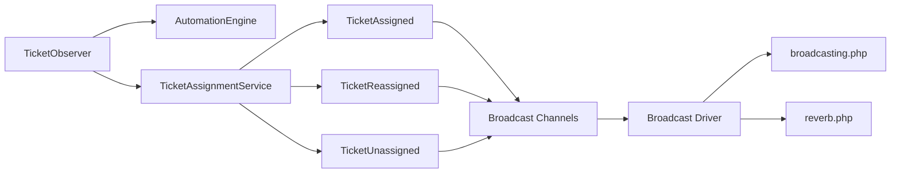

# Event-Driven Architecture

<cite>
**Referenced Files in This Document**
- [TicketObserver.php](file://app/Observers/TicketObserver.php)
- [channels.php](file://routes/channels.php)
- [broadcasting.php](file://config/broadcasting.php)
- [reverb.php](file://config/reverb.php)
- [Ticket.php](file://app/Models/Ticket.php)
- [TicketReply.php](file://app/Models/TicketReply.php)
- [TicketStatusChanged.php](file://app/Notifications/TicketStatusChanged.php)
- [TicketAssigned.php](file://app/Notifications/TicketAssigned.php)
- [TicketReassigned.php](file://app/Notifications/TicketReassigned.php)
- [TicketUnassigned.php](file://app/Notifications/TicketUnassigned.php)
- [AutomationEngine.php](file://app/Services/Automation/AutomationEngine.php)
- [TicketAssignmentService.php](file://app/Services/TicketAssignmentService.php)
- [TicketsController.php](file://app/Http/Controllers/TicketsController.php)
- [AutoCloseResolvedTickets.php](file://app/Jobs/AutoCloseResolvedTickets.php)
</cite>

## Table of Contents
1. [Introduction](#introduction)
2. [Project Structure](#project-structure)
3. [Core Components](#core-components)
4. [Architecture Overview](#architecture-overview)
5. [Detailed Component Analysis](#detailed-component-analysis)
6. [Dependency Analysis](#dependency-analysis)
7. [Performance Considerations](#performance-considerations)
8. [Troubleshooting Guide](#troubleshooting-guide)
9. [Conclusion](#conclusion)

## Introduction
This document explains the event-driven communication patterns in the Helpdesk System. It focuses on how model observers react to ticket lifecycle changes (creation, verification, status updates, deletion, restoration), how automation and assignment services transform state, and how notifications integrate with broadcasting to push real-time updates to clients. It also covers the integration between database events, job processing, and WebSocket notifications, along with guidance for implementing custom events, listeners, and broadcast channels. Finally, it addresses event ordering, reliability considerations, and handling concurrent updates in multi-tenant environments.

## Project Structure
The event-driven flow spans several layers:
- Data Access: Eloquent models and observers
- Business Logic: Services for automation and assignment
- Notifications: Database and broadcast-capable notifications
- Broadcasting: Channel definitions and configuration for Reverb/Pusher/Ably
- Controllers and Jobs: Entry points and scheduled tasks

**Diagram sources**
- [TicketObserver.php:10-109](file://app/Observers/TicketObserver.php#L10-L109)
- [AutomationEngine.php:15-142](file://app/Services/Automation/AutomationEngine.php#L15-L142)
- [TicketAssignmentService.php:12-179](file://app/Services/TicketAssignmentService.php#L12-L179)
- [TicketStatusChanged.php:9-55](file://app/Notifications/TicketStatusChanged.php#L9-L55)
- [TicketAssigned.php:9-49](file://app/Notifications/TicketAssigned.php#L9-L49)
- [TicketReassigned.php:9-49](file://app/Notifications/TicketReassigned.php#L9-L49)
- [TicketUnassigned.php:9-49](file://app/Notifications/TicketUnassigned.php#L9-L49)
- [channels.php:5-7](file://routes/channels.php#L5-L7)
- [broadcasting.php:31-80](file://config/broadcasting.php#L31-L80)
- [reverb.php:29-94](file://config/reverb.php#L29-L94)
- [TicketsController.php:7-18](file://app/Http/Controllers/TicketsController.php#L7-L18)
- [AutoCloseResolvedTickets.php:8-27](file://app/Jobs/AutoCloseResolvedTickets.php#L8-L27)

**Section sources**
- [TicketObserver.php:10-109](file://app/Observers/TicketObserver.php#L10-L109)
- [broadcasting.php:31-80](file://config/broadcasting.php#L31-L80)
- [reverb.php:29-94](file://config/reverb.php#L29-L94)
- [channels.php:5-7](file://routes/channels.php#L5-L7)

## Core Components
- TicketObserver: Listens to ticket lifecycle events and triggers automation and assignment logic. It also maintains operator workload counters based on status transitions.
- AutomationEngine: Evaluates and applies automation rules scoped to a company, excluding escalations (processed by scheduler).
- TicketAssignmentService: Handles automatic and manual assignment, reassignment, and unassignment with transactional integrity and notifications.
- Notifications: Status change, assignment, reassignment, and unassignment notifications configured for database and broadcast delivery.
- Broadcasting Channels and Config: Channel policies for user-specific subscriptions and driver configuration for Reverb/Pusher/Ably/log/null.

**Section sources**
- [TicketObserver.php:10-109](file://app/Observers/TicketObserver.php#L10-L109)
- [AutomationEngine.php:15-142](file://app/Services/Automation/AutomationEngine.php#L15-L142)
- [TicketAssignmentService.php:12-179](file://app/Services/TicketAssignmentService.php#L12-L179)
- [TicketStatusChanged.php:9-55](file://app/Notifications/TicketStatusChanged.php#L9-L55)
- [TicketAssigned.php:9-49](file://app/Notifications/TicketAssigned.php#L9-L49)
- [TicketReassigned.php:9-49](file://app/Notifications/TicketReassigned.php#L9-L49)
- [TicketUnassigned.php:9-49](file://app/Notifications/TicketUnassigned.php#L9-L49)
- [channels.php:5-7](file://routes/channels.php#L5-L7)
- [broadcasting.php:31-80](file://config/broadcasting.php#L31-L80)
- [reverb.php:29-94](file://config/reverb.php#L29-L94)

## Architecture Overview
The system uses Eloquent model events to trigger observer handlers. Observers coordinate automation and assignment services, which persist state changes and emit notifications. Notifications marked for broadcast are routed through the configured broadcaster and delivered to subscribed clients via channels.

**Diagram sources**
- [TicketObserver.php:17-107](file://app/Observers/TicketObserver.php#L17-L107)
- [AutomationEngine.php:28-96](file://app/Services/Automation/AutomationEngine.php#L28-L96)
- [TicketAssignmentService.php:22-160](file://app/Services/TicketAssignmentService.php#L22-L160)
- [TicketStatusChanged.php:34-37](file://app/Notifications/TicketStatusChanged.php#L34-L37)
- [TicketAssigned.php:28-31](file://app/Notifications/TicketAssigned.php#L28-L31)
- [TicketReassigned.php:28-31](file://app/Notifications/TicketReassigned.php#L28-L31)
- [TicketUnassigned.php:28-31](file://app/Notifications/TicketUnassigned.php#L28-L31)
- [channels.php:5-7](file://routes/channels.php#L5-L7)
- [broadcasting.php:31-80](file://config/broadcasting.php#L31-L80)

## Detailed Component Analysis

### Ticket Lifecycle Observers and Automation
- Creation and verification: When a ticket is created and verified, automation rules are evaluated per company, and if unassigned afterward, the assignment service assigns a suitable operator.
- Verified transitions: When an existing ticket becomes verified, the same automation and fallback assignment logic runs.
- Status transitions: When a ticket moves to resolved/closed, operator counters are decremented if not already resolved/closed. When reopened from closed, counters are incremented for the assigned operator.
- Deletion/Restoration: Operator counters are decremented on deletion unless already resolved/closed; restored tickets increment counters similarly.

**Diagram sources**
- [TicketObserver.php:17-107](file://app/Observers/TicketObserver.php#L17-L107)

**Section sources**
- [TicketObserver.php:17-107](file://app/Observers/TicketObserver.php#L17-L107)

### Automation Engine
- Rule routing: Rules are mapped by type to specific handlers. Escalation rules are excluded from immediate processing and handled by a scheduler.
- Execution: Each rule is evaluated and applied within a transactional context, with execution recorded and logged.
- Scoping: Rules are fetched per company and ordered by priority.

**Diagram sources**
- [AutomationEngine.php:15-142](file://app/Services/Automation/AutomationEngine.php#L15-L142)

**Section sources**
- [AutomationEngine.php:15-142](file://app/Services/Automation/AutomationEngine.php#L15-L142)

### Ticket Assignment Service
- Assignment logic: Prefer specialists by category; otherwise generalists; finally notify admins if no operator is available.
- Reassignment: Safely decrement previous operator’s counter, assign to new operator, and notify both parties.
- Unassignment: Decrement counter and clear assignment.
- Count maintenance: Provides a method to recalculate counters for a company.

**Diagram sources**
- [TicketAssignmentService.php:22-94](file://app/Services/TicketAssignmentService.php#L22-L94)

**Section sources**
- [TicketAssignmentService.php:22-160](file://app/Services/TicketAssignmentService.php#L22-L160)

### Notifications and Broadcasting
- Notifications: Status change, assignment, reassignment, and unassignment notifications support database and broadcast delivery channels.
- Channel Policy: User-specific channels restrict broadcasts to the authenticated user.
- Configuration: Drivers include Reverb, Pusher, Ably, log, and null. Reverb server settings and scaling via Redis are configurable.

**Diagram sources**
- [TicketAssigned.php:28-31](file://app/Notifications/TicketAssigned.php#L28-L31)
- [TicketReassigned.php:28-31](file://app/Notifications/TicketReassigned.php#L28-L31)
- [TicketUnassigned.php:28-31](file://app/Notifications/TicketUnassigned.php#L28-L31)
- [TicketStatusChanged.php:34-37](file://app/Notifications/TicketStatusChanged.php#L34-L37)
- [channels.php:5-7](file://routes/channels.php#L5-L7)
- [broadcasting.php:31-80](file://config/broadcasting.php#L31-L80)
- [reverb.php:29-94](file://config/reverb.php#L29-L94)

**Section sources**
- [TicketStatusChanged.php:34-37](file://app/Notifications/TicketStatusChanged.php#L34-L37)
- [TicketAssigned.php:28-31](file://app/Notifications/TicketAssigned.php#L28-L31)
- [TicketReassigned.php:28-31](file://app/Notifications/TicketReassigned.php#L28-L31)
- [TicketUnassigned.php:28-31](file://app/Notifications/TicketUnassigned.php#L28-L31)
- [channels.php:5-7](file://routes/channels.php#L5-L7)
- [broadcasting.php:31-80](file://config/broadcasting.php#L31-L80)
- [reverb.php:29-94](file://config/reverb.php#L29-L94)

### Reply Creation and Assignment Updates
- Reply Model: Defines fillable attributes and relationships to user and ticket.
- Observer Behavior: The observer does not explicitly listen to reply creation. Assignment updates are handled by the assignment service and notifications.

**Diagram sources**
- [TicketReply.php:8-38](file://app/Models/TicketReply.php#L8-L38)

**Section sources**
- [TicketReply.php:8-38](file://app/Models/TicketReply.php#L8-L38)
- [TicketObserver.php:17-107](file://app/Observers/TicketObserver.php#L17-L107)

### Controllers and Jobs
- Controller: Basic show action for tickets; no direct event emission here.
- Job: Placeholder for auto-close logic; can be extended to close resolved tickets asynchronously.

**Diagram sources**
- [TicketsController.php:12-17](file://app/Http/Controllers/TicketsController.php#L12-L17)

**Section sources**
- [TicketsController.php:12-17](file://app/Http/Controllers/TicketsController.php#L12-L17)
- [AutoCloseResolvedTickets.php:8-27](file://app/Jobs/AutoCloseResolvedTickets.php#L8-L27)

## Dependency Analysis
- TicketObserver depends on AutomationEngine and TicketAssignmentService to enforce business rules upon ticket events.
- Notifications depend on broadcasting configuration and channel policies to deliver updates.
- Broadcasting configuration supports multiple drivers and Reverb-specific scaling and TLS options.

**Diagram sources**
- [TicketObserver.php:12-15](file://app/Observers/TicketObserver.php#L12-L15)
- [AutomationEngine.php:15-142](file://app/Services/Automation/AutomationEngine.php#L15-L142)
- [TicketAssignmentService.php:12-179](file://app/Services/TicketAssignmentService.php#L12-L179)
- [TicketAssigned.php:28-31](file://app/Notifications/TicketAssigned.php#L28-L31)
- [TicketReassigned.php:28-31](file://app/Notifications/TicketReassigned.php#L28-L31)
- [TicketUnassigned.php:28-31](file://app/Notifications/TicketUnassigned.php#L28-L31)
- [channels.php:5-7](file://routes/channels.php#L5-L7)
- [broadcasting.php:31-80](file://config/broadcasting.php#L31-L80)
- [reverb.php:29-94](file://config/reverb.php#L29-L94)

**Section sources**
- [TicketObserver.php:12-15](file://app/Observers/TicketObserver.php#L12-L15)
- [broadcasting.php:31-80](file://config/broadcasting.php#L31-L80)
- [reverb.php:29-94](file://config/reverb.php#L29-L94)

## Performance Considerations
- Observer-side counters: Increment/decrement operator counters in transactions to avoid race conditions during concurrent updates.
- Automation rule evaluation: Fetch and order rules per company to minimize overhead; exclude escalations from immediate processing.
- Broadcasting: Use efficient channel policies and drivers suited to deployment scale; consider Reverb scaling via Redis for multi-instance setups.
- Jobs: Offload long-running tasks (e.g., auto-close) to queued jobs to keep request paths responsive.

[No sources needed since this section provides general guidance]

## Troubleshooting Guide
- No broadcast delivery: Verify broadcasting driver configuration and channel policy allowlist for user channels.
- Incorrect counters: Ensure observer decrements occur only for non-resolved/closed statuses and that restoration increments accordingly.
- Assignment failures: Confirm specialists/generalists availability and that admin notifications are sent when auto-assignment fails.
- Escalations not applied: Confirm escalation rules are processed by the scheduler and not attempted during immediate automation.

**Section sources**
- [broadcasting.php:31-80](file://config/broadcasting.php#L31-L80)
- [channels.php:5-7](file://routes/channels.php#L5-L7)
- [TicketObserver.php:52-107](file://app/Observers/TicketObserver.php#L52-L107)
- [TicketAssignmentService.php:84-94](file://app/Services/TicketAssignmentService.php#L84-L94)

## Conclusion
The Helpdesk System’s event-driven architecture leverages Eloquent observers to orchestrate automation and assignment logic, ensuring consistent state transitions and operator workload balance. Notifications integrated with broadcasting deliver real-time updates to clients via secure user channels. Configuration supports flexible drivers and scalable Reverb deployments. Extending the system involves adding new automation rules, expanding notification channels, and ensuring robust concurrency handling in multi-tenant contexts.