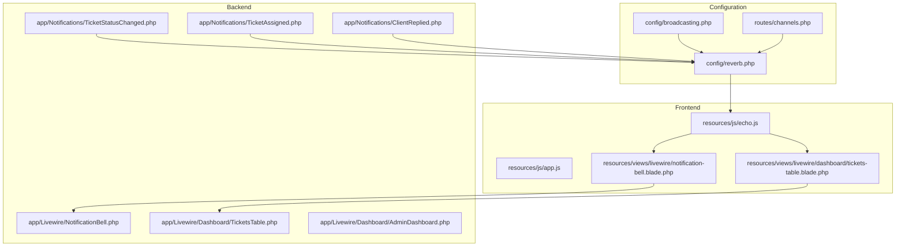
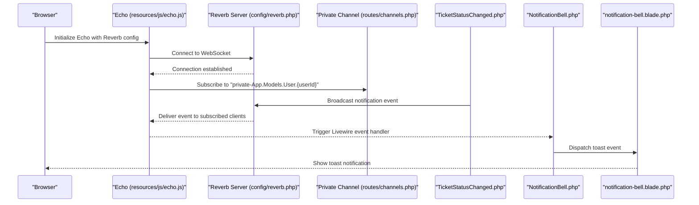
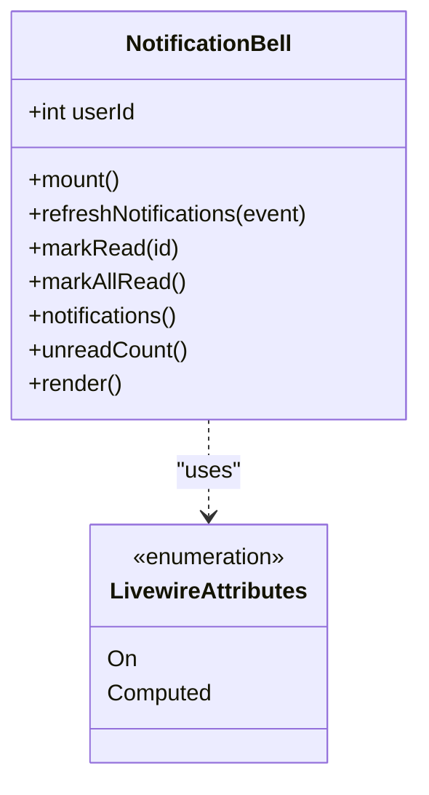
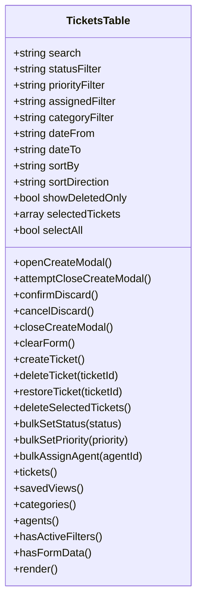
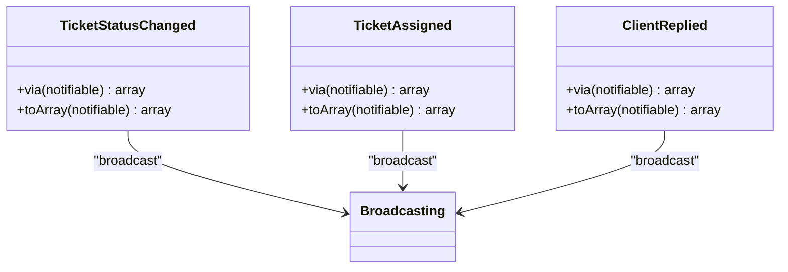
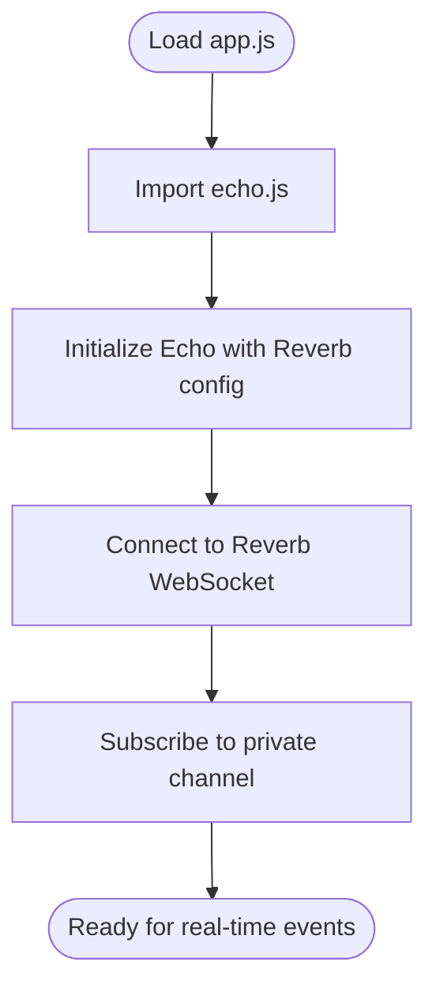
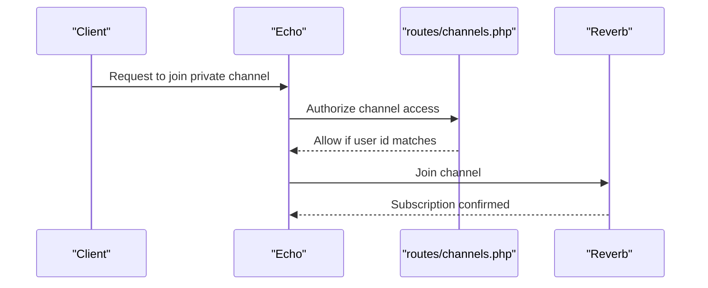
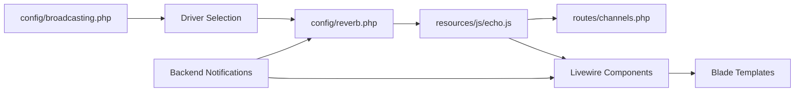

# Livewire Real-time Integration

<cite>
**Referenced Files in This Document**
- [broadcasting.php](file://config/broadcasting.php)
- [reverb.php](file://config/reverb.php)
- [channels.php](file://routes/channels.php)
- [echo.js](file://resources/js/echo.js)
- [app.js](file://resources/js/app.js)
- [NotificationBell.php](file://app/Livewire/NotificationBell.php)
- [TicketsTable.php](file://app/Livewire/Dashboard/TicketsTable.php)
- [AdminDashboard.php](file://app/Livewire/Dashboard/AdminDashboard.php)
- [notification-bell.blade.php](file://resources/views/livewire/notification-bell.blade.php)
- [tickets-table.blade.php](file://resources/views/livewire/dashboard/tickets-table.blade.php)
- [TicketStatusChanged.php](file://app/Notifications/TicketStatusChanged.php)
- [TicketAssigned.php](file://app/Notifications/TicketAssigned.php)
- [ClientReplied.php](file://app/Notifications/ClientReplied.php)
</cite>

## Table of Contents
1. [Introduction](#introduction)
2. [Project Structure](#project-structure)
3. [Core Components](#core-components)
4. [Architecture Overview](#architecture-overview)
5. [Detailed Component Analysis](#detailed-component-analysis)
6. [Dependency Analysis](#dependency-analysis)
7. [Performance Considerations](#performance-considerations)
8. [Troubleshooting Guide](#troubleshooting-guide)
9. [Conclusion](#conclusion)

## Introduction
This document explains how Livewire components in this Helpdesk System integrate with real-time WebSocket updates using Laravel Reverb and Laravel Echo. It demonstrates how Livewire components automatically refresh when WebSocket events are received, eliminating manual AJAX polling. The guide covers event binding patterns, component lifecycle integration, state synchronization between server and client, reactive UI implementations, connection state handling, and performance optimization strategies.

## Project Structure
The real-time integration spans configuration, backend broadcasting, frontend Echo initialization, and Livewire components that subscribe to WebSocket events.

**Diagram sources**
- [broadcasting.php:1-83](file://config/broadcasting.php#L1-L83)
- [reverb.php:1-97](file://config/reverb.php#L1-L97)
- [channels.php:1-7](file://routes/channels.php#L1-L7)
- [echo.js:1-15](file://resources/js/echo.js#L1-L15)
- [app.js:310-310](file://resources/js/app.js#L310-L310)
- [NotificationBell.php:1-96](file://app/Livewire/NotificationBell.php#L1-L96)
- [TicketsTable.php:1-523](file://app/Livewire/Dashboard/TicketsTable.php#L1-L523)
- [AdminDashboard.php:1-128](file://app/Livewire/Dashboard/AdminDashboard.php#L1-L128)
- [notification-bell.blade.php:1-193](file://resources/views/livewire/notification-bell.blade.php#L1-L193)
- [tickets-table.blade.php:1-841](file://resources/views/livewire/dashboard/tickets-table.blade.php#L1-L841)
- [TicketStatusChanged.php:1-55](file://app/Notifications/TicketStatusChanged.php#L1-L55)
- [TicketAssigned.php:1-49](file://app/Notifications/TicketAssigned.php#L1-L49)
- [ClientReplied.php:1-49](file://app/Notifications/ClientReplied.php#L1-L49)

**Section sources**
- [broadcasting.php:1-83](file://config/broadcasting.php#L1-L83)
- [reverb.php:1-97](file://config/reverb.php#L1-L97)
- [channels.php:1-7](file://routes/channels.php#L1-L7)
- [echo.js:1-15](file://resources/js/echo.js#L1-L15)
- [app.js:310-310](file://resources/js/app.js#L310-L310)
- [NotificationBell.php:1-96](file://app/Livewire/NotificationBell.php#L1-L96)
- [TicketsTable.php:1-523](file://app/Livewire/Dashboard/TicketsTable.php#L1-L523)
- [AdminDashboard.php:1-128](file://app/Livewire/Dashboard/AdminDashboard.php#L1-L128)
- [notification-bell.blade.php:1-193](file://resources/views/livewire/notification-bell.blade.php#L1-L193)
- [tickets-table.blade.php:1-841](file://resources/views/livewire/dashboard/tickets-table.blade.php#L1-L841)
- [TicketStatusChanged.php:1-55](file://app/Notifications/TicketStatusChanged.php#L1-L55)
- [TicketAssigned.php:1-49](file://app/Notifications/TicketAssigned.php#L1-L49)
- [ClientReplied.php:1-49](file://app/Notifications/ClientReplied.php#L1-L49)

## Core Components
- Livewire NotificationBell: Listens for real-time notifications and displays toast alerts without manual polling.
- Livewire TicketsTable: Reacts to ticket-related events and refreshes filtered/paginated data.
- Backend Notifications: Emit broadcast events when ticket statuses change, assignments occur, or clients reply.
- Frontend Echo: Initializes Reverb client and subscribes to private user channels.
- Channel Authorization: Ensures only the intended user receives per-user notifications.

Key integration points:
- Event binding: Livewire uses attributes to bind to WebSocket events.
- State synchronization: Livewire recomputes computed properties and triggers UI updates.
- Reactive UI: Blade templates use Alpine.js to display toast notifications.

**Section sources**
- [NotificationBell.php:1-96](file://app/Livewire/NotificationBell.php#L1-L96)
- [TicketsTable.php:1-523](file://app/Livewire/Dashboard/TicketsTable.php#L1-L523)
- [TicketStatusChanged.php:1-55](file://app/Notifications/TicketStatusChanged.php#L1-L55)
- [TicketAssigned.php:1-49](file://app/Notifications/TicketAssigned.php#L1-L49)
- [ClientReplied.php:1-49](file://app/Notifications/ClientReplied.php#L1-L49)
- [channels.php:1-7](file://routes/channels.php#L1-L7)
- [echo.js:1-15](file://resources/js/echo.js#L1-L15)
- [notification-bell.blade.php:119-191](file://resources/views/livewire/notification-bell.blade.php#L119-L191)

## Architecture Overview
Real-time updates flow from server-side notifications to the Reverb broadcasting server, then to the client via Echo, and finally to Livewire components and the UI.

**Diagram sources**
- [echo.js:1-15](file://resources/js/echo.js#L1-L15)
- [reverb.php:1-97](file://config/reverb.php#L1-L97)
- [channels.php:1-7](file://routes/channels.php#L1-L7)
- [TicketStatusChanged.php:1-55](file://app/Notifications/TicketStatusChanged.php#L1-L55)
- [NotificationBell.php:1-96](file://app/Livewire/NotificationBell.php#L1-L96)
- [notification-bell.blade.php:119-191](file://resources/views/livewire/notification-bell.blade.php#L119-L191)

## Detailed Component Analysis

### NotificationBell Component
The NotificationBell component listens for real-time notifications and displays toast alerts. It binds to:
- A Livewire event: notifications-updated
- A WebSocket event: echo-private:App.Models.User.{userId},.Illuminate\Notifications\Events\BroadcastNotificationCreated

**Diagram sources**
- [NotificationBell.php:1-96](file://app/Livewire/NotificationBell.php#L1-L96)

**Section sources**
- [NotificationBell.php:1-96](file://app/Livewire/NotificationBell.php#L1-L96)
- [notification-bell.blade.php:1-193](file://resources/views/livewire/notification-bell.blade.php#L1-L193)

### TicketsTable Component
The TicketsTable component reacts to user-triggered events and maintains reactive state for filtering, sorting, and pagination. While it does not directly bind to WebSocket events in the shown code, it demonstrates how Livewire components can be extended to integrate with real-time updates by dispatching and listening for events.

**Diagram sources**
- [TicketsTable.php:1-523](file://app/Livewire/Dashboard/TicketsTable.php#L1-L523)

**Section sources**
- [TicketsTable.php:1-523](file://app/Livewire/Dashboard/TicketsTable.php#L1-L523)
- [tickets-table.blade.php:1-841](file://resources/views/livewire/dashboard/tickets-table.blade.php#L1-L841)

### Backend Notifications and Broadcasting
Server-side notifications emit broadcast events that are delivered to subscribed clients. The notifications specify both database and broadcast delivery channels.

**Diagram sources**
- [TicketStatusChanged.php:1-55](file://app/Notifications/TicketStatusChanged.php#L1-L55)
- [TicketAssigned.php:1-49](file://app/Notifications/TicketAssigned.php#L1-L49)
- [ClientReplied.php:1-49](file://app/Notifications/ClientReplied.php#L1-L49)

**Section sources**
- [TicketStatusChanged.php:1-55](file://app/Notifications/TicketStatusChanged.php#L1-L55)
- [TicketAssigned.php:1-49](file://app/Notifications/TicketAssigned.php#L1-L49)
- [ClientReplied.php:1-49](file://app/Notifications/ClientReplied.php#L1-L49)

### Frontend Echo Initialization and Channel Subscription
Echo initializes the Reverb client and subscribes to private channels. The app.js file imports echo.js to establish the connection.

**Diagram sources**
- [app.js:310-310](file://resources/js/app.js#L310-L310)
- [echo.js:1-15](file://resources/js/echo.js#L1-L15)

**Section sources**
- [app.js:310-310](file://resources/js/app.js#L310-L310)
- [echo.js:1-15](file://resources/js/echo.js#L1-L15)

### Channel Authorization
Private channels are authorized per-user, ensuring secure subscription to personal notifications.

**Diagram sources**
- [channels.php:1-7](file://routes/channels.php#L1-L7)

**Section sources**
- [channels.php:1-7](file://routes/channels.php#L1-L7)

## Dependency Analysis
The real-time system depends on coordinated configuration and runtime components.

**Diagram sources**
- [broadcasting.php:1-83](file://config/broadcasting.php#L1-L83)
- [reverb.php:1-97](file://config/reverb.php#L1-L97)
- [channels.php:1-7](file://routes/channels.php#L1-L7)
- [echo.js:1-15](file://resources/js/echo.js#L1-L15)
- [NotificationBell.php:1-96](file://app/Livewire/NotificationBell.php#L1-L96)
- [TicketsTable.php:1-523](file://app/Livewire/Dashboard/TicketsTable.php#L1-L523)
- [TicketStatusChanged.php:1-55](file://app/Notifications/TicketStatusChanged.php#L1-L55)

**Section sources**
- [broadcasting.php:1-83](file://config/broadcasting.php#L1-L83)
- [reverb.php:1-97](file://config/reverb.php#L1-L97)
- [channels.php:1-7](file://routes/channels.php#L1-L7)
- [echo.js:1-15](file://resources/js/echo.js#L1-L15)
- [NotificationBell.php:1-96](file://app/Livewire/NotificationBell.php#L1-L96)
- [TicketsTable.php:1-523](file://app/Livewire/Dashboard/TicketsTable.php#L1-L523)
- [TicketStatusChanged.php:1-55](file://app/Notifications/TicketStatusChanged.php#L1-L55)

## Performance Considerations
- Debounce user input: Livewire’s live bindings debounce keystrokes to reduce event frequency during typing.
- Computed properties: Use computed properties to cache expensive queries and avoid redundant database calls.
- Efficient broadcasts: Limit broadcast payload to essential fields to minimize bandwidth.
- Pagination and filtering: Keep Livewire components paginated and filterable to reduce DOM and re-render work.
- Toast lifecycle: Automatically dismiss toasts after a timeout to prevent accumulation.

[No sources needed since this section provides general guidance]

## Troubleshooting Guide
- WebSocket connection fails:
  - Verify Reverb server host/port/scheme in configuration and environment variables.
  - Confirm Echo initialization parameters match server settings.
- Private channel unauthorized:
  - Ensure the user ID in the channel pattern matches the authenticated user ID.
- Livewire event not firing:
  - Confirm the event name and channel pattern match the Livewire component’s On attribute.
  - Check that notifications specify both database and broadcast delivery.
- Toast not appearing:
  - Verify the toast container is present in the Blade template and Alpine.js is initialized.

**Section sources**
- [reverb.php:1-97](file://config/reverb.php#L1-L97)
- [echo.js:1-15](file://resources/js/echo.js#L1-L15)
- [channels.php:1-7](file://routes/channels.php#L1-L7)
- [NotificationBell.php:1-96](file://app/Livewire/NotificationBell.php#L1-L96)
- [TicketStatusChanged.php:1-55](file://app/Notifications/TicketStatusChanged.php#L1-L55)
- [notification-bell.blade.php:119-191](file://resources/views/livewire/notification-bell.blade.php#L119-L191)

## Conclusion
Livewire components in this system achieve automatic, real-time UI updates through a clean integration of Laravel Reverb, Laravel Echo, and Livewire event handlers. By leveraging private channels, computed properties, and reactive UI patterns, the system delivers responsive feedback without manual polling. Extending components to listen for additional events follows the established patterns, enabling scalable real-time functionality.