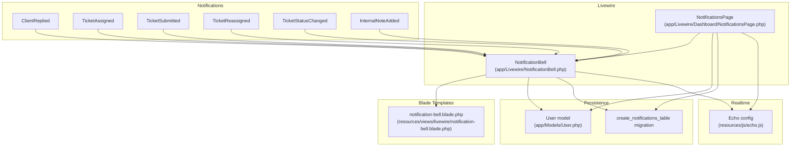
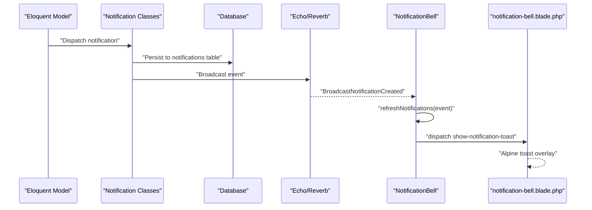
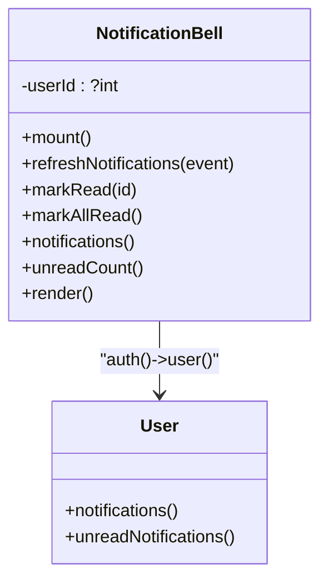
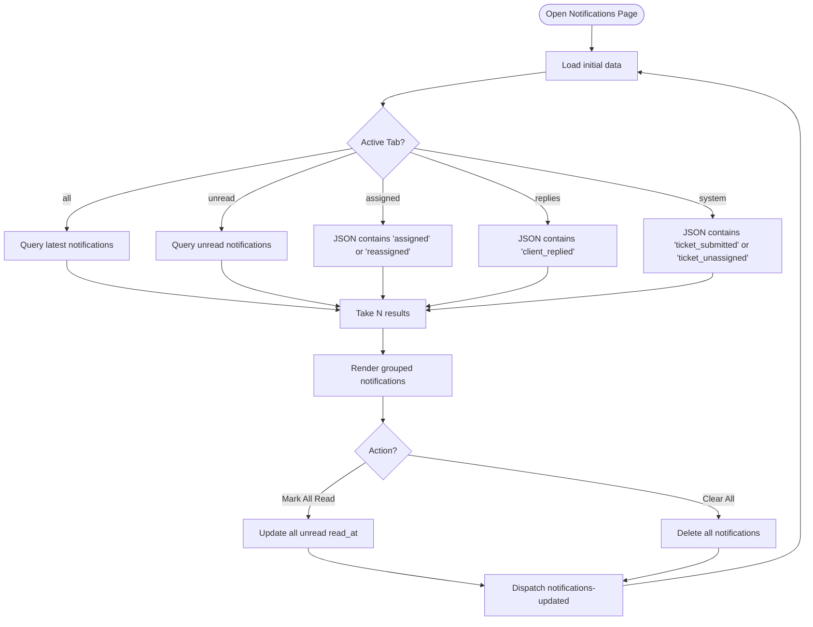
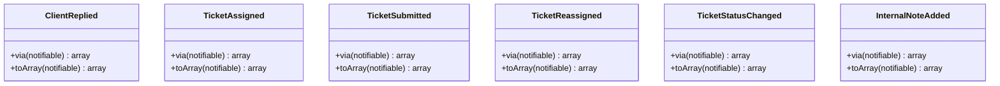
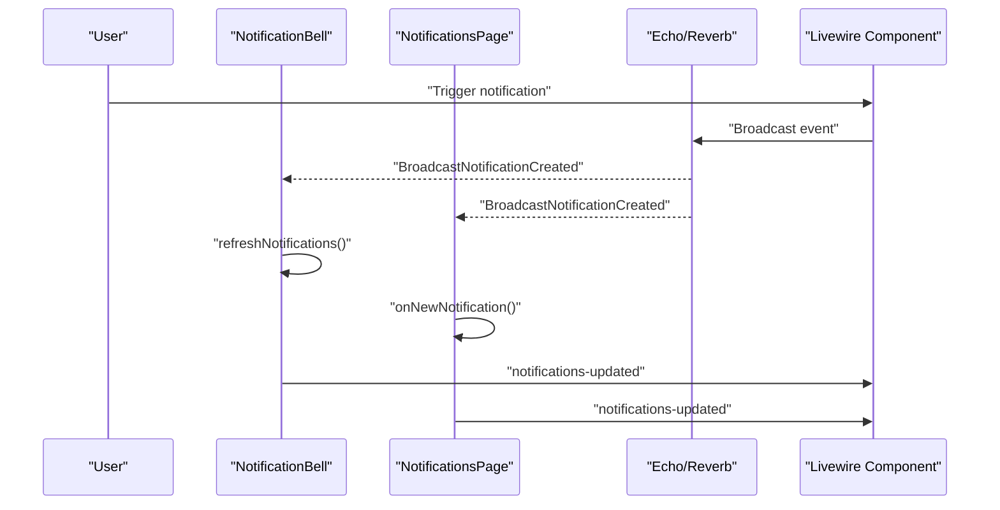
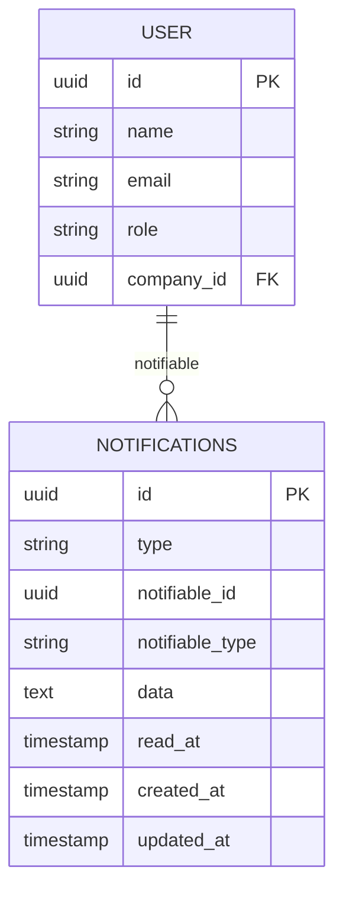
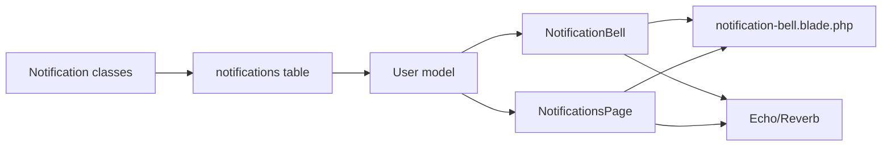

# Notification System

<cite>
**Referenced Files in This Document**
- [NotificationBell.php](file://app/Livewire/NotificationBell.php)
- [notification-bell.blade.php](file://resources/views/livewire/notification-bell.blade.php)
- [NotificationsPage.php](file://app/Livewire/Dashboard/NotificationsPage.php)
- [ClientReplied.php](file://app/Notifications/ClientReplied.php)
- [TicketAssigned.php](file://app/Notifications/TicketAssigned.php)
- [TicketSubmitted.php](file://app/Notifications/TicketSubmitted.php)
- [TicketReassigned.php](file://app/Notifications/TicketReassigned.php)
- [TicketStatusChanged.php](file://app/Notifications/TicketStatusChanged.php)
- [InternalNoteAdded.php](file://app/Notifications/InternalNoteAdded.php)
- [User.php](file://app/Models/User.php)
- [2026_03_10_234123_create_notifications_table.php](file://database/migrations/2026_03_10_234123_create_notifications_table.php)
- [echo.js](file://resources/js/echo.js)
- [NotificationsPageTest.php](file://tests/Feature/NotificationsPageTest.php)
</cite>

## Table of Contents
1. [Introduction](#introduction)
2. [Project Structure](#project-structure)
3. [Core Components](#core-components)
4. [Architecture Overview](#architecture-overview)
5. [Detailed Component Analysis](#detailed-component-analysis)
6. [Dependency Analysis](#dependency-analysis)
7. [Performance Considerations](#performance-considerations)
8. [Troubleshooting Guide](#troubleshooting-guide)
9. [Conclusion](#conclusion)

## Introduction
This document explains the real-time notification system architecture, focusing on the NotificationBell Livewire component that displays live alerts and notification counts. It documents notification types (ClientReplied, TicketSubmitted, TicketAssigned, TicketReassigned, TicketStatusChanged, InternalNoteAdded), persistence and delivery mechanisms, user preference handling, and practical guidance for creating custom notifications, implementing channels, and managing queues. It also covers filtering, bulk operations, and performance considerations for high-volume scenarios.

## Project Structure
The notification system spans Livewire components, Blade templates, notification classes, Eloquent models, database migrations, and real-time broadcasting configuration.

**Diagram sources**
- [NotificationBell.php:10-95](file://app/Livewire/NotificationBell.php#L10-L95)
- [notification-bell.blade.php:1-193](file://resources/views/livewire/notification-bell.blade.php#L1-L193)
- [NotificationsPage.php:16-175](file://app/Livewire/Dashboard/NotificationsPage.php#L16-L175)
- [ClientReplied.php:9-48](file://app/Notifications/ClientReplied.php#L9-L48)
- [TicketAssigned.php:9-49](file://app/Notifications/TicketAssigned.php#L9-L49)
- [TicketSubmitted.php:9-49](file://app/Notifications/TicketSubmitted.php#L9-L49)
- [TicketReassigned.php:9-49](file://app/Notifications/TicketReassigned.php#L9-L49)
- [TicketStatusChanged.php:9-55](file://app/Notifications/TicketStatusChanged.php#L9-L55)
- [InternalNoteAdded.php:9-49](file://app/Notifications/InternalNoteAdded.php#L9-L49)
- [User.php:9-136](file://app/Models/User.php#L9-L136)
- [2026_03_10_234123_create_notifications_table.php:14-21](file://database/migrations/2026_03_10_234123_create_notifications_table.php#L14-L21)
- [echo.js:6-14](file://resources/js/echo.js#L6-L14)

**Section sources**
- [NotificationBell.php:10-95](file://app/Livewire/NotificationBell.php#L10-L95)
- [notification-bell.blade.php:1-193](file://resources/views/livewire/notification-bell.blade.php#L1-L193)
- [NotificationsPage.php:16-175](file://app/Livewire/Dashboard/NotificationsPage.php#L16-L175)
- [ClientReplied.php:9-48](file://app/Notifications/ClientReplied.php#L9-L48)
- [TicketAssigned.php:9-49](file://app/Notifications/TicketAssigned.php#L9-L49)
- [TicketSubmitted.php:9-49](file://app/Notifications/TicketSubmitted.php#L9-L49)
- [TicketReassigned.php:9-49](file://app/Notifications/TicketReassigned.php#L9-L49)
- [TicketStatusChanged.php:9-55](file://app/Notifications/TicketStatusChanged.php#L9-L55)
- [InternalNoteAdded.php:9-49](file://app/Notifications/InternalNoteAdded.php#L9-L49)
- [User.php:9-136](file://app/Models/User.php#L9-L136)
- [2026_03_10_234123_create_notifications_table.php:14-21](file://database/migrations/2026_03_10_234123_create_notifications_table.php#L14-L21)
- [echo.js:6-14](file://resources/js/echo.js#L6-L14)

## Core Components
- NotificationBell Livewire component:
  - Mounts current user ID, listens for real-time events and Livewire updates, computes recent notifications and unread count, and exposes actions to mark individual or all notifications as read.
  - Renders a dropdown menu and a toast notification area using Alpine.js inside the Blade template.
- NotificationsPage Livewire component:
  - Provides a paginated, tab-filtered view of notifications with bulk operations (mark all read, clear all).
  - Uses JSON column queries to filter by notification type.
- Notification classes:
  - Implement the database and broadcast channels and define the payload shape stored in the notifications.data JSON column.
- Persistence:
  - A dedicated notifications table stores notification records per notifiable entity with a JSON data field and timestamps.
- Real-time:
  - Laravel Echo configured with Reverb broadcaster for pusher-compatible transport.

**Section sources**
- [NotificationBell.php:14-95](file://app/Livewire/NotificationBell.php#L14-L95)
- [notification-bell.blade.php:1-193](file://resources/views/livewire/notification-bell.blade.php#L1-L193)
- [NotificationsPage.php:24-175](file://app/Livewire/Dashboard/NotificationsPage.php#L24-L175)
- [ClientReplied.php:28-47](file://app/Notifications/ClientReplied.php#L28-L47)
- [TicketAssigned.php:28-46](file://app/Notifications/TicketAssigned.php#L28-L46)
- [TicketSubmitted.php:28-46](file://app/Notifications/TicketSubmitted.php#L28-L46)
- [TicketReassigned.php:28-46](file://app/Notifications/TicketReassigned.php#L28-L46)
- [TicketStatusChanged.php:34-52](file://app/Notifications/TicketStatusChanged.php#L34-L52)
- [InternalNoteAdded.php:28-46](file://app/Notifications/InternalNoteAdded.php#L28-L46)
- [2026_03_10_234123_create_notifications_table.php:14-21](file://database/migrations/2026_03_10_234123_create_notifications_table.php#L14-L21)
- [echo.js:6-14](file://resources/js/echo.js#L6-L14)

## Architecture Overview
The system combines synchronous persistence with asynchronous real-time delivery:

- Delivery channels:
  - All notification classes specify both database and broadcast channels, ensuring persistence and immediate UI updates.
- Real-time updates:
  - Livewire components listen for Echo broadcast events and a Livewire event to refresh UI state.
- UI rendering:
  - NotificationBell renders a bell dropdown with unread badge and a toast overlay powered by Alpine.js.
  - NotificationsPage provides a filtered, paginated list with bulk actions.

**Diagram sources**
- [ClientReplied.php:28-31](file://app/Notifications/ClientReplied.php#L28-L31)
- [TicketAssigned.php:28-31](file://app/Notifications/TicketAssigned.php#L28-L31)
- [TicketSubmitted.php:28-31](file://app/Notifications/TicketSubmitted.php#L28-L31)
- [TicketReassigned.php:28-31](file://app/Notifications/TicketReassigned.php#L28-L31)
- [TicketStatusChanged.php:34-37](file://app/Notifications/TicketStatusChanged.php#L34-L37)
- [InternalNoteAdded.php:28-31](file://app/Notifications/InternalNoteAdded.php#L28-L31)
- [NotificationBell.php:19-53](file://app/Livewire/NotificationBell.php#L19-L53)
- [notification-bell.blade.php:118-191](file://resources/views/livewire/notification-bell.blade.php#L118-L191)
- [echo.js:6-14](file://resources/js/echo.js#L6-L14)

## Detailed Component Analysis

### NotificationBell Livewire Component
Responsibilities:
- Track current user ID and compute unread count and recent notifications.
- Listen for real-time broadcasts and Livewire updates to refresh UI.
- Dispatch a toast event with title, message, and optional URL for ticket navigation.
- Provide actions to mark a single notification as read and to mark all unread notifications as read.

Key behaviors:
- Real-time triggers:
  - Listens for a Livewire event and a broadcast event scoped to the user’s channel.
- Title and URL generation:
  - Builds human-friendly titles based on notification type.
  - Constructs ticket URLs when applicable, excluding reassigned events.
- Toast UX:
  - Uses Alpine.js to enqueue and dequeue toasts with a 5-second timeout and optional click-to-navigate.

**Diagram sources**
- [NotificationBell.php:10-95](file://app/Livewire/NotificationBell.php#L10-L95)
- [User.php:9-136](file://app/Models/User.php#L9-L136)

**Section sources**
- [NotificationBell.php:14-95](file://app/Livewire/NotificationBell.php#L14-L95)
- [notification-bell.blade.php:118-191](file://resources/views/livewire/notification-bell.blade.php#L118-L191)

### NotificationsPage Livewire Component
Responsibilities:
- Render a tabbed view of notifications with filters: all, unread, assigned, replies, system.
- Paginate results and expose bulk actions: mark all read, clear all.
- React to real-time updates and Livewire events to keep the view fresh.

Filtering logic:
- Uses JSON column queries to filter by notification type for each tab.
- Prevents non-admin users from accessing the system tab.

**Diagram sources**
- [NotificationsPage.php:85-127](file://app/Livewire/Dashboard/NotificationsPage.php#L85-L127)

**Section sources**
- [NotificationsPage.php:36-83](file://app/Livewire/Dashboard/NotificationsPage.php#L36-L83)
- [NotificationsPage.php:85-127](file://app/Livewire/Dashboard/NotificationsPage.php#L85-L127)
- [NotificationsPageTest.php:85-125](file://tests/Feature/NotificationsPageTest.php#L85-L125)

### Notification Types and Payloads
All notification classes implement the database and broadcast channels and return a standardized data array stored in the notifications.data JSON column. The payload includes identifiers and metadata used by the UI to construct titles, messages, and navigation links.

- ClientReplied
  - Channels: database, broadcast
  - Payload keys: ticket_id, ticket_number, subject, type, message
- TicketAssigned
  - Channels: database, broadcast
  - Payload keys: ticket_id, ticket_number, subject, type, message
- TicketSubmitted
  - Channels: database, broadcast
  - Payload keys: ticket_id, ticket_number, subject, type, message
- TicketReassigned
  - Channels: database, broadcast
  - Payload keys: ticket_id, ticket_number, subject, type, message
- TicketStatusChanged
  - Channels: database, broadcast
  - Payload keys: ticket_id, ticket_number, subject, type, message
- InternalNoteAdded
  - Channels: database, broadcast
  - Payload keys: ticket_id, ticket_number, subject, type, message

**Diagram sources**
- [ClientReplied.php:28-47](file://app/Notifications/ClientReplied.php#L28-L47)
- [TicketAssigned.php:28-46](file://app/Notifications/TicketAssigned.php#L28-L46)
- [TicketSubmitted.php:28-46](file://app/Notifications/TicketSubmitted.php#L28-L46)
- [TicketReassigned.php:28-46](file://app/Notifications/TicketReassigned.php#L28-L46)
- [TicketStatusChanged.php:34-52](file://app/Notifications/TicketStatusChanged.php#L34-L52)
- [InternalNoteAdded.php:28-46](file://app/Notifications/InternalNoteAdded.php#L28-L46)

**Section sources**
- [ClientReplied.php:28-47](file://app/Notifications/ClientReplied.php#L28-L47)
- [TicketAssigned.php:28-46](file://app/Notifications/TicketAssigned.php#L28-L46)
- [TicketSubmitted.php:28-46](file://app/Notifications/TicketSubmitted.php#L28-L46)
- [TicketReassigned.php:28-46](file://app/Notifications/TicketReassigned.php#L28-L46)
- [TicketStatusChanged.php:34-52](file://app/Notifications/TicketStatusChanged.php#L34-L52)
- [InternalNoteAdded.php:28-46](file://app/Notifications/InternalNoteAdded.php#L28-L46)

### Real-Time Delivery and Broadcasting
- Broadcast channels:
  - All notification classes return ['database', 'broadcast'], ensuring persistence and real-time delivery.
- Livewire event subscriptions:
  - NotificationBell listens for a Livewire event and a broadcast event on the user’s private channel.
  - NotificationsPage listens for the same events to keep the page synchronized.
- Echo configuration:
  - Echo is initialized with the Reverb broadcaster and environment variables for host, port, and TLS.

**Diagram sources**
- [NotificationBell.php:19-34](file://app/Livewire/NotificationBell.php#L19-L34)
- [NotificationsPage.php:29-34](file://app/Livewire/Dashboard/NotificationsPage.php#L29-L34)
- [echo.js:6-14](file://resources/js/echo.js#L6-L14)

**Section sources**
- [ClientReplied.php:28-31](file://app/Notifications/ClientReplied.php#L28-L31)
- [TicketAssigned.php:28-31](file://app/Notifications/TicketAssigned.php#L28-L31)
- [TicketSubmitted.php:28-31](file://app/Notifications/TicketSubmitted.php#L28-L31)
- [TicketReassigned.php:28-31](file://app/Notifications/TicketReassigned.php#L28-L31)
- [TicketStatusChanged.php:34-37](file://app/Notifications/TicketStatusChanged.php#L34-L37)
- [InternalNoteAdded.php:28-31](file://app/Notifications/InternalNoteAdded.php#L28-L31)
- [NotificationBell.php:19-53](file://app/Livewire/NotificationBell.php#L19-L53)
- [NotificationsPage.php:29-34](file://app/Livewire/Dashboard/NotificationsPage.php#L29-L34)
- [echo.js:6-14](file://resources/js/echo.js#L6-L14)

### Persistence and Data Model
- Table schema:
  - notifications table with UUID primary key, type string, polymorphic notifiable relationship, text data, optional read_at timestamp, and timestamps.
- Relationship:
  - User model includes the Notifiable trait, enabling the notifications() and unreadNotifications() relationships used by Livewire components.

**Diagram sources**
- [2026_03_10_234123_create_notifications_table.php:14-21](file://database/migrations/2026_03_10_234123_create_notifications_table.php#L14-L21)
- [User.php:9-136](file://app/Models/User.php#L9-L136)

**Section sources**
- [2026_03_10_234123_create_notifications_table.php:14-21](file://database/migrations/2026_03_10_234123_create_notifications_table.php#L14-L21)
- [User.php:9-136](file://app/Models/User.php#L9-L136)

### UI Rendering and Interactions
- NotificationBell dropdown:
  - Shows unread count badge, “Mark all read” button, and a scrollable list of recent notifications with per-item read indicators.
  - Uses icons and color accents to visually distinguish notification types.
- Toast overlay:
  - Alpine.js manages a stack of toasts, displaying titles and messages, auto-dismiss after 5 seconds, and optional navigation to ticket details.
- NotificationsPage:
  - Tabs for filtering, pagination controls, and bulk actions.

**Section sources**
- [notification-bell.blade.php:1-193](file://resources/views/livewire/notification-bell.blade.php#L1-L193)
- [NotificationsPage.php:85-175](file://app/Livewire/Dashboard/NotificationsPage.php#L85-L175)

## Dependency Analysis
- Component coupling:
  - NotificationBell depends on the User model’s notifications relationship and the Echo broadcast channel.
  - NotificationsPage depends on the same relationships and adds JSON-based filtering.
- External dependencies:
  - Echo/Reverb for real-time messaging.
  - Livewire for reactive UI and event dispatching.
- Data flow:
  - Eloquent models dispatch notifications that are persisted and broadcast; Livewire components subscribe to updates and render UI accordingly.

**Diagram sources**
- [NotificationBell.php:10-95](file://app/Livewire/NotificationBell.php#L10-L95)
- [NotificationsPage.php:16-175](file://app/Livewire/Dashboard/NotificationsPage.php#L16-L175)
- [notification-bell.blade.php:1-193](file://resources/views/livewire/notification-bell.blade.php#L1-L193)
- [echo.js:6-14](file://resources/js/echo.js#L6-L14)
- [2026_03_10_234123_create_notifications_table.php:14-21](file://database/migrations/2026_03_10_234123_create_notifications_table.php#L14-L21)

**Section sources**
- [NotificationBell.php:10-95](file://app/Livewire/NotificationBell.php#L10-L95)
- [NotificationsPage.php:16-175](file://app/Livewire/Dashboard/NotificationsPage.php#L16-L175)
- [echo.js:6-14](file://resources/js/echo.js#L6-L14)
- [2026_03_10_234123_create_notifications_table.php:14-21](file://database/migrations/2026_03_10_234123_create_notifications_table.php#L14-L21)

## Performance Considerations
- Pagination and limits:
  - NotificationBell fetches a small subset of recent notifications and computes unread count efficiently.
  - NotificationsPage uses take(N) and a configurable per-page limit to avoid heavy queries.
- Filtering:
  - JSON column filtering is applied server-side to reduce payload size and improve responsiveness.
- Real-time updates:
  - Broadcasting is efficient for targeted updates; ensure appropriate channel scoping to minimize unnecessary traffic.
- Storage:
  - The notifications table uses a JSON data field to store compact payloads; keep payloads minimal to reduce storage and indexing overhead.
- Caching:
  - Consider caching unread counts for frequently accessed users if needed, balancing freshness with performance.

[No sources needed since this section provides general guidance]

## Troubleshooting Guide
- No real-time updates:
  - Verify Echo configuration and that the broadcaster is reachable.
  - Confirm Livewire and broadcast events are being emitted and subscribed to.
- Toasts not appearing:
  - Ensure the Alpine toast container is present and the Livewire event is dispatched.
- Filters not working:
  - Confirm JSON column queries match the stored type values and that the active tab logic is invoked.
- Bulk actions not reflected:
  - Ensure the Livewire event is dispatched after updating read_at or clearing notifications.

**Section sources**
- [echo.js:6-14](file://resources/js/echo.js#L6-L14)
- [notification-bell.blade.php:118-191](file://resources/views/livewire/notification-bell.blade.php#L118-L191)
- [NotificationsPage.php:71-83](file://app/Livewire/Dashboard/NotificationsPage.php#L71-L83)
- [NotificationsPageTest.php:85-125](file://tests/Feature/NotificationsPageTest.php#L85-L125)

## Conclusion
The notification system integrates Livewire, Echo/Reverb, and a compact JSON-based persistence layer to deliver timely, actionable alerts. The NotificationBell component provides an intuitive UX with real-time updates and quick navigation to relevant tickets, while NotificationsPage offers robust filtering and bulk operations. By leveraging JSON column queries, pagination, and targeted broadcasting, the system remains responsive under moderate to high load. Extending the system with new notification types follows the established pattern of adding a class with database/broadcast channels and a payload shape compatible with the UI.