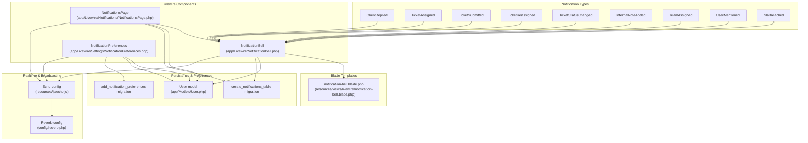
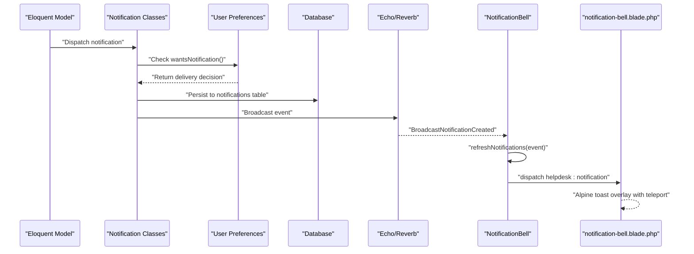
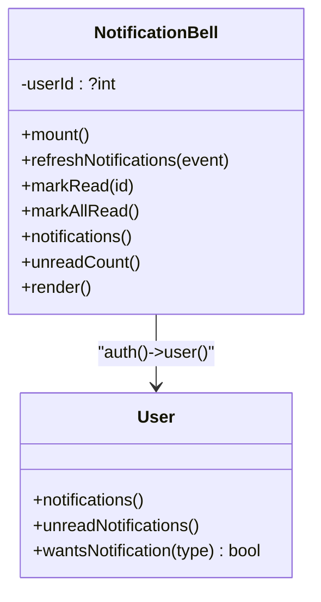
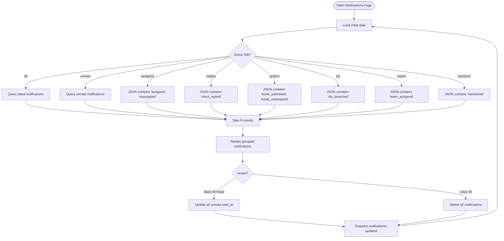
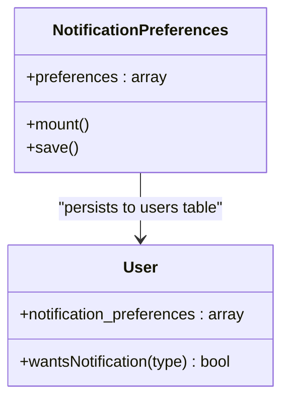
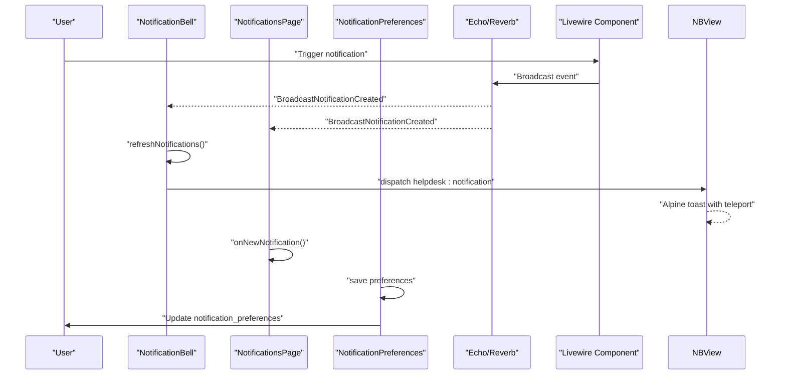
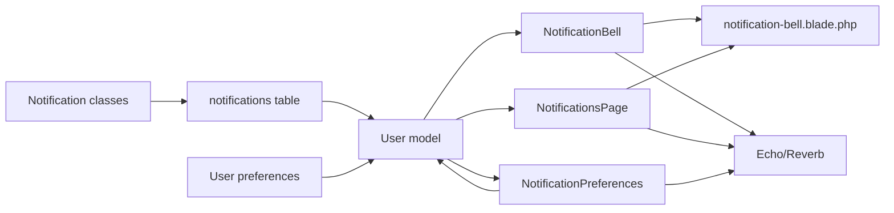

```mermaid
classDiagram
class ClientReplied {
+via(notifiable) array
+toArray(notifiable) array
+wantsNotification check
}
class TicketAssigned {
+via(notifiable) array
+toArray(notifiable) array
+wantsNotification check
}
class TeamAssigned {
+via(notifiable) array
+toArray(notifiable) array
+wantsNotification check
}
class UserMentioned {
+via(notifiable) array
+toArray(notifiable) array
+wantsNotification check
}
class TicketSubmitted {
+via(notifiable) array
+toArray(notifiable) array
+wantsNotification check
}
class TicketReassigned {
+via(notifiable) array
+toArray(notifiable) array
+wantsNotification check
}
class TicketStatusChanged {
+via(notifiable) array
+toArray(notifiable) array
+wantsNotification check
}
class InternalNoteAdded {
+via(notifiable) array
+toArray(notifiable) array
+wantsNotification check
}
class SlaBreached {
+via(notifiable) array
+toArray(notifiable) array
}
```

# Notification System

<cite>
**Referenced Files in This Document**
- [NotificationBell.php](file://app/Livewire/NotificationBell.php)
- [notification-bell.blade.php](file://resources/views/livewire/notification-bell.blade.php)
- [NotificationsPage.php](file://app/Livewire/Notifications/NotificationsPage.php)
- [NotificationPreferences.php](file://app/Livewire/Settings/NotificationPreferences.php)
- [ClientReplied.php](file://app/Notifications/ClientReplied.php)
- [TicketAssigned.php](file://app/Notifications/TicketAssigned.php)
- [TicketSubmitted.php](file://app/Notifications/TicketSubmitted.php)
- [TicketReassigned.php](file://app/Notifications/TicketReassigned.php)
- [TicketStatusChanged.php](file://app/Notifications/TicketStatusChanged.php)
- [InternalNoteAdded.php](file://app/Notifications/InternalNoteAdded.php)
- [TeamAssigned.php](file://app/Notifications/TeamAssigned.php)
- [UserMentioned.php](file://app/Notifications/UserMentioned.php)
- [SlaBreached.php](file://app/Notifications/SlaBreached.php)
- [User.php](file://app/Models/User.php)
- [2026_03_10_234123_create_notifications_table.php](file://database/migrations/2026_03_10_234123_create_notifications_table.php)
- [2026_03_20_000014_add_notification_preferences_to_users_table.php](file://database/migrations/2026_03_20_000014_add_notification_preferences_to_users_table.php)
- [echo.js](file://resources/js/echo.js)
- [reverb.php](file://config/reverb.php)
- [NotificationsPageTest.php](file://tests/Feature/NotificationsPageTest.php)
- [NotificationPreferencesTest.php](file://tests/Feature/NotificationPreferencesTest.php)
</cite>

## Update Summary
**Changes Made**
- Enhanced real-time notification system with comprehensive Echo/Reverb integration
- Implemented advanced toast notification system with Alpine.js teleport functionality
- Expanded notification types to include TeamAssigned and UserMentioned
- Improved Livewire event subscriptions for real-time updates
- Enhanced notification preferences system with granular user control
- Added comprehensive filtering and bulk operation capabilities

## Table of Contents
1. [Introduction](#introduction)
2. [Project Structure](#project-structure)
3. [Core Components](#core-components)
4. [Architecture Overview](#architecture-overview)
5. [Detailed Component Analysis](#detailed-component-analysis)
6. [Dependency Analysis](#dependency-analysis)
7. [Performance Considerations](#performance-considerations)
8. [Troubleshooting Guide](#troubleshooting-guide)
9. [Conclusion](#conclusion)

## Introduction
This document explains the comprehensive real-time notification system architecture, focusing on the NotificationBell Livewire component that displays live alerts, notification counts, and sophisticated toast notifications. The system features advanced Echo/Reverb integration for seamless real-time communication, extensive notification preferences management, and enhanced notification types including TeamAssigned and UserMentioned. It documents all notification types, persistence mechanisms, user preference handling, and practical guidance for creating custom notifications and managing notification queues.

## Project Structure
The notification system spans Livewire components, Blade templates, notification classes, Eloquent models, database migrations, and real-time broadcasting configuration with Reverb integration.



**Diagram sources**
- [NotificationBell.php:10-61](file://app/Livewire/NotificationBell.php#L10-L61)
- [notification-bell.blade.php:1-126](file://resources/views/livewire/notification-bell.blade.php#L1-L126)
- [NotificationsPage.php:16-194](file://app/Livewire/Notifications/NotificationsPage.php#L16-L194)
- [NotificationPreferences.php:1-39](file://app/Livewire/Settings/NotificationPreferences.php#L1-L39)
- [ClientReplied.php:9-63](file://app/Notifications/ClientReplied.php#L9-L63)
- [TicketAssigned.php:9-63](file://app/Notifications/TicketAssigned.php#L9-L63)
- [TicketSubmitted.php:9-65](file://app/Notifications/TicketSubmitted.php#L9-L65)
- [TicketReassigned.php:9-63](file://app/Notifications/TicketReassigned.php#L9-L63)
- [TicketStatusChanged.php:9-69](file://app/Notifications/TicketStatusChanged.php#L9-L69)
- [InternalNoteAdded.php:9-63](file://app/Notifications/InternalNoteAdded.php#L9-L63)
- [TeamAssigned.php:9-53](file://app/Notifications/TeamAssigned.php#L9-L53)
- [UserMentioned.php:9-62](file://app/Notifications/UserMentioned.php#L9-L62)
- [SlaBreached.php:9-59](file://app/Notifications/SlaBreached.php#L9-L59)
- [User.php:9-211](file://app/Models/User.php#L9-L211)
- [2026_03_10_234123_create_notifications_table.php:14-21](file://database/migrations/2026_03_10_234123_create_notifications_table.php#L14-L21)
- [2026_03_20_000014_add_notification_preferences_to_users_table.php:14-16](file://database/migrations/2026_03_20_000014_add_notification_preferences_to_users_table.php#L14-L16)
- [echo.js:6-14](file://resources/js/echo.js#L6-L14)
- [reverb.php:29-57](file://config/reverb.php#L29-L57)

**Section sources**
- [NotificationBell.php:10-61](file://app/Livewire/NotificationBell.php#L10-L61)
- [notification-bell.blade.php:1-126](file://resources/views/livewire/notification-bell.blade.php#L1-L126)
- [NotificationsPage.php:16-194](file://app/Livewire/Notifications/NotificationsPage.php#L16-L194)
- [NotificationPreferences.php:1-39](file://app/Livewire/Settings/NotificationPreferences.php#L1-L39)
- [ClientReplied.php:9-63](file://app/Notifications/ClientReplied.php#L9-L63)
- [TicketAssigned.php:9-63](file://app/Notifications/TicketAssigned.php#L9-L63)
- [TicketSubmitted.php:9-65](file://app/Notifications/TicketSubmitted.php#L9-L65)
- [TicketReassigned.php:9-63](file://app/Notifications/TicketReassigned.php#L9-L63)
- [TicketStatusChanged.php:9-69](file://app/Notifications/TicketStatusChanged.php#L9-L69)
- [InternalNoteAdded.php:9-63](file://app/Notifications/InternalNoteAdded.php#L9-L63)
- [TeamAssigned.php:9-53](file://app/Notifications/TeamAssigned.php#L9-L53)
- [UserMentioned.php:9-62](file://app/Notifications/UserMentioned.php#L9-L62)
- [SlaBreached.php:9-59](file://app/Notifications/SlaBreached.php#L9-L59)
- [User.php:9-211](file://app/Models/User.php#L9-L211)
- [2026_03_10_234123_create_notifications_table.php:14-21](file://database/migrations/2026_03_10_234123_create_notifications_table.php#L14-L21)
- [2026_03_20_000014_add_notification_preferences_to_users_table.php:14-16](file://database/migrations/2026_03_20_000014_add_notification_preferences_to_users_table.php#L14-L16)
- [echo.js:6-14](file://resources/js/echo.js#L6-L14)
- [reverb.php:29-57](file://config/reverb.php#L29-L57)

## Core Components
- **Enhanced NotificationBell Livewire component**:
  - Mounts current user ID, listens for real-time events and Livewire updates, computes recent notifications and unread count, and exposes actions to mark individual or all notifications as read.
  - Renders a dropdown menu and an advanced toast notification system using Alpine.js with teleport functionality for seamless real-time alerts.
- **NotificationsPage Livewire component**:
  - Provides a paginated, tab-filtered view of notifications with bulk operations (mark all read, clear all).
  - Uses JSON column queries to filter by notification type and supports the new notification types.
- **NotificationPreferences Livewire component**:
  - Manages user notification preferences with a comprehensive settings interface supporting enable/disable toggles for all notification types.
  - Persists preferences to the users table as JSON data and provides real-time preference updates.
- **Enhanced notification classes**:
  - All notification classes now implement preference-based opt-out functionality using the `wantsNotification()` method.
  - Support both database and broadcast channels with conditional delivery based on user preferences.
- **Comprehensive persistence system**:
  - A dedicated notifications table stores notification records per notifiable entity with a JSON data field and timestamps.
  - User preferences are stored as JSON in the users table for flexible configuration management.
- **Advanced real-time infrastructure**:
  - Laravel Echo configured with Reverb broadcaster for pusher-compatible transport with WebSocket support.
  - Real-time toast notifications with automatic dismissal and optional navigation.

**Section sources**
- [NotificationBell.php:14-61](file://app/Livewire/NotificationBell.php#L14-L61)
- [notification-bell.blade.php:32-126](file://resources/views/livewire/notification-bell.blade.php#L32-L126)
- [NotificationsPage.php:24-194](file://app/Livewire/Notifications/NotificationsPage.php#L24-L194)
- [NotificationPreferences.php:10-39](file://app/Livewire/Settings/NotificationPreferences.php#L10-L39)
- [ClientReplied.php:30-37](file://app/Notifications/ClientReplied.php#L30-L37)
- [TicketAssigned.php:30-37](file://app/Notifications/TicketAssigned.php#L30-L37)
- [TicketSubmitted.php:30-37](file://app/Notifications/TicketSubmitted.php#L30-L37)
- [TicketReassigned.php:30-37](file://app/Notifications/TicketReassigned.php#L30-L37)
- [TicketStatusChanged.php:36-43](file://app/Notifications/TicketStatusChanged.php#L36-L43)
- [InternalNoteAdded.php:30-37](file://app/Notifications/InternalNoteAdded.php#L30-L37)
- [TeamAssigned.php:20-27](file://app/Notifications/TeamAssigned.php#L20-L27)
- [UserMentioned.php:26-33](file://app/Notifications/UserMentioned.php#L26-L33)
- [2026_03_10_234123_create_notifications_table.php:14-21](file://database/migrations/2026_03_10_234123_create_notifications_table.php#L14-L21)
- [2026_03_20_000014_add_notification_preferences_to_users_table.php:14-16](file://database/migrations/2026_03_20_000014_add_notification_preferences_to_users_table.php#L14-L16)
- [echo.js:6-14](file://resources/js/echo.js#L6-L14)

## Architecture Overview
The enhanced system combines synchronous persistence with asynchronous real-time delivery through an improved notification preferences architecture:

- **Delivery channels with preference filtering**:
  - All notification classes specify both database and broadcast channels with conditional delivery based on user preferences.
  - The `wantsNotification()` method in the User model determines whether notifications should be delivered.
- **Advanced real-time updates**:
  - Livewire components listen for Echo broadcast events and Livewire events to refresh UI state.
  - Real-time toast notifications provide immediate feedback without page reloads.
- **Enhanced UI rendering**:
  - NotificationBell renders a bell dropdown with unread badge, toast overlay, and teleport functionality for seamless real-time alerts.
  - NotificationsPage provides filtered, paginated list with bulk actions and support for new notification types.
  - NotificationPreferences offers granular control over notification delivery preferences.



**Diagram sources**
- [ClientReplied.php:30-37](file://app/Notifications/ClientReplied.php#L30-L37)
- [TicketAssigned.php:30-37](file://app/Notifications/TicketAssigned.php#L30-L37)
- [TicketSubmitted.php:30-37](file://app/Notifications/TicketSubmitted.php#L30-L37)
- [TicketReassigned.php:30-37](file://app/Notifications/TicketReassigned.php#L30-L37)
- [TicketStatusChanged.php:36-43](file://app/Notifications/TicketStatusChanged.php#L36-L43)
- [InternalNoteAdded.php:30-37](file://app/Notifications/InternalNoteAdded.php#L30-L37)
- [TeamAssigned.php:20-27](file://app/Notifications/TeamAssigned.php#L20-L27)
- [UserMentioned.php:26-33](file://app/Notifications/UserMentioned.php#L26-L33)
- [User.php:72-81](file://app/Models/User.php#L72-L81)
- [NotificationBell.php:12-16](file://app/Livewire/NotificationBell.php#L12-L16)
- [notification-bell.blade.php:74-77](file://resources/views/livewire/notification-bell.blade.php#L74-L77)
- [echo.js:6-14](file://resources/js/echo.js#L6-L14)

## Detailed Component Analysis

### Enhanced NotificationBell Livewire Component
**Updated** Enhanced with real-time toast notification system and improved navigation handling.

Responsibilities:
- Track current user ID and compute unread count and recent notifications.
- Listen for real-time broadcasts and Livewire updates to refresh UI.
- Dispatch toast events with title, message, and optional URL for ticket navigation.
- Provide actions to mark a single notification as read and to mark all unread notifications as read.
- Handle ticket-specific navigation with automatic URL generation.

Key behaviors:
- **Real-time triggers**:
  - Listens for a Livewire event and a broadcast event scoped to the user's channel.
- **Enhanced toast UX**:
  - Uses Alpine.js with teleport functionality to render toasts in the document body.
  - Supports 5-second auto-dismiss with manual close capability.
  - Includes click-to-navigate functionality for ticket-related notifications.
- **Improved navigation**:
  - Builds human-friendly titles based on notification type.
  - Constructs ticket URLs when applicable, excluding reassigned events.



**Diagram sources**
- [NotificationBell.php:10-61](file://app/Livewire/NotificationBell.php#L10-L61)
- [User.php:9-211](file://app/Models/User.php#L9-L211)

**Section sources**
- [NotificationBell.php:14-61](file://app/Livewire/NotificationBell.php#L14-L61)
- [notification-bell.blade.php:32-126](file://resources/views/livewire/notification-bell.blade.php#L32-L126)

### NotificationsPage Livewire Component
**Updated** Enhanced with support for new notification types and improved filtering capabilities.

Responsibilities:
- Render a tabbed view of notifications with filters: all, unread, assigned, replies, system, teams, mentions.
- Paginate results and expose bulk actions: mark all read, clear all.
- React to real-time updates and Livewire events to keep the view fresh.
- Support filtering for new notification types (TeamAssigned, UserMentioned).

Filtering logic:
- Uses JSON column queries to filter by notification type for each tab.
- Prevents non-admin users from accessing the system tab.
- Supports all notification types including the new TeamAssigned and UserMentioned.



**Diagram sources**
- [NotificationsPage.php:85-127](file://app/Livewire/Notifications/NotificationsPage.php#L85-L127)

**Section sources**
- [NotificationsPage.php:36-83](file://app/Livewire/Notifications/NotificationsPage.php#L36-L83)
- [NotificationsPage.php:85-127](file://app/Livewire/Notifications/NotificationsPage.php#L85-L127)
- [NotificationsPageTest.php:85-125](file://tests/Feature/NotificationsPageTest.php#L85-L125)

### NotificationPreferences Livewire Component
**New** Comprehensive notification preferences management system.

Responsibilities:
- Manage user notification preferences with enable/disable toggles for all notification types.
- Persist preferences to the users table as JSON data.
- Provide real-time preference updates and validation.
- Merge default preferences with user-specific overrides.

Default preferences include:
- ticket_assigned: true
- ticket_reassigned: true
- client_replied: true
- status_changed: true
- internal_note: true
- ticket_submitted: true
- team_assigned: true



**Diagram sources**
- [NotificationPreferences.php:8-39](file://app/Livewire/Settings/NotificationPreferences.php#L8-L39)
- [User.php:72-81](file://app/Models/User.php#L72-L81)

**Section sources**
- [NotificationPreferences.php:10-39](file://app/Livewire/Settings/NotificationPreferences.php#L10-L39)
- [2026_03_20_000014_add_notification_preferences_to_users_table.php:14-16](file://database/migrations/2026_03_20_000014_add_notification_preferences_to_users_table.php#L14-L16)
- [NotificationPreferencesTest.php:33-104](file://tests/Feature/NotificationPreferencesTest.php#L33-L104)

### Enhanced Notification Types and Payloads
**Updated** All notification classes now support preference-based opt-out functionality and include new notification types.

All notification classes implement the database and broadcast channels with conditional delivery based on user preferences and return a standardized data array stored in the notifications.data JSON column.

**New notification types:**
- **TeamAssigned**
  - Channels: database, broadcast (conditional based on preferences)
  - Payload keys: team_id, team_name, role, type, message
  - Used for team membership notifications
- **UserMentioned**
  - Channels: database, broadcast (conditional based on preferences)
  - Payload keys: type, ticket_id, ticket_number, subject, ticket_reply_id, mentioned_by_name, excerpt, message
  - Used for mention notifications in ticket conversations

**Enhanced existing notification types:**
- **ClientReplied**
  - Channels: database, broadcast (conditional based on preferences)
  - Payload keys: ticket_id, ticket_number, subject, type, message
- **TicketAssigned**
  - Channels: database, broadcast (conditional based on preferences)
  - Payload keys: ticket_id, ticket_number, subject, type, message
- **TicketSubmitted**
  - Channels: database, broadcast (conditional based on preferences)
  - Payload keys: ticket_id, ticket_number, subject, type, message
- **TicketReassigned**
  - Channels: database, broadcast (conditional based on preferences)
  - Payload keys: ticket_id, ticket_number, subject, type, message
- **TicketStatusChanged**
  - Channels: database, broadcast (conditional based on preferences)
  - Payload keys: ticket_id, ticket_number, subject, type, message
- **InternalNoteAdded**
  - Channels: database, broadcast (conditional based on preferences)
  - Payload keys: ticket_id, ticket_number, subject, type, message
- **SlaBreached**
  - Channels: database, broadcast
  - Payload keys: ticket_id, ticket_number, subject, type, message



**Diagram sources**
- [ClientReplied.php:30-63](file://app/Notifications/ClientReplied.php#L30-L63)
- [TicketAssigned.php:30-63](file://app/Notifications/TicketAssigned.php#L30-L63)
- [TeamAssigned.php:20-53](file://app/Notifications/TeamAssigned.php#L20-L53)
- [UserMentioned.php:26-62](file://app/Notifications/UserMentioned.php#L26-L62)
- [TicketSubmitted.php:30-65](file://app/Notifications/TicketSubmitted.php#L30-L65)
- [TicketReassigned.php:30-63](file://app/Notifications/TicketReassigned.php#L30-L63)
- [TicketStatusChanged.php:36-69](file://app/Notifications/TicketStatusChanged.php#L36-L69)
- [InternalNoteAdded.php:30-63](file://app/Notifications/InternalNoteAdded.php#L30-L63)
- [SlaBreached.php:30-59](file://app/Notifications/SlaBreached.php#L30-L59)

**Section sources**
- [ClientReplied.php:30-63](file://app/Notifications/ClientReplied.php#L30-L63)
- [TicketAssigned.php:30-63](file://app/Notifications/TicketAssigned.php#L30-L63)
- [TeamAssigned.php:20-53](file://app/Notifications/TeamAssigned.php#L20-L53)
- [UserMentioned.php:26-62](file://app/Notifications/UserMentioned.php#L26-L62)
- [TicketSubmitted.php:30-65](file://app/Notifications/TicketSubmitted.php#L30-L65)
- [TicketReassigned.php:30-63](file://app/Notifications/TicketReassigned.php#L30-L63)
- [TicketStatusChanged.php:36-69](file://app/Notifications/TicketStatusChanged.php#L36-L69)
- [InternalNoteAdded.php:30-63](file://app/Notifications/InternalNoteAdded.php#L30-L63)
- [SlaBreached.php:30-59](file://app/Notifications/SlaBreached.php#L30-L59)

### Real-Time Delivery and Broadcasting
**Updated** Enhanced with Reverb integration and improved toast notification system.

- **Broadcast channels with preference filtering**:
  - All notification classes return ['database', 'broadcast'] with conditional delivery based on user preferences.
  - The `wantsNotification()` method in the User model determines whether notifications should be delivered.
- **Enhanced Livewire event subscriptions**:
  - NotificationBell listens for a Livewire event and a broadcast event on the user's private channel.
  - NotificationsPage listens for the same events to keep the page synchronized.
  - Real-time toast notifications use the `helpdesk:notification` event for immediate UI updates.
- **Advanced Echo configuration**:
  - Echo is initialized with the Reverb broadcaster and environment variables for host, port, and TLS.
  - Supports WebSocket transport with automatic fallback and secure connections.
- **Teleport-based toast system**:
  - Alpine.js manages a singleton toast container teleported to the document body.
  - Supports multiple toast notifications with automatic dismissal and click-to-navigate functionality.



**Diagram sources**
- [NotificationBell.php:12-16](file://app/Livewire/NotificationBell.php#L12-L16)
- [NotificationsPage.php:29-34](file://app/Livewire/Notifications/NotificationsPage.php#L29-L34)
- [NotificationPreferences.php:30-37](file://app/Livewire/Settings/NotificationPreferences.php#L30-L37)
- [echo.js:6-14](file://resources/js/echo.js#L6-L14)
- [notification-bell.blade.php:74-77](file://resources/views/livewire/notification-bell.blade.php#L74-L77)

**Section sources**
- [ClientReplied.php:30-37](file://app/Notifications/ClientReplied.php#L30-L37)
- [TicketAssigned.php:30-37](file://app/Notifications/TicketAssigned.php#L30-L37)
- [TeamAssigned.php:20-27](file://app/Notifications/TeamAssigned.php#L20-L27)
- [UserMentioned.php:26-33](file://app/Notifications/UserMentioned.php#L26-L33)
- [NotificationBell.php:12-16](file://app/Livewire/NotificationBell.php#L12-L16)
- [NotificationsPage.php:29-34](file://app/Livewire/Notifications/NotificationsPage.php#L29-L34)
- [NotificationPreferences.php:30-37](file://app/Livewire/Settings/NotificationPreferences.php#L30-L37)
- [echo.js:6-14](file://resources/js/echo.js#L6-L14)
- [reverb.php:29-57](file://config/reverb.php#L29-L57)

### Enhanced Persistence and Data Model
**Updated** Added comprehensive notification preferences storage.

- **Enhanced table schema**:
  - notifications table with UUID primary key, type string, polymorphic notifiable relationship, text data, optional read_at timestamp, and timestamps.
  - Users table includes notification_preferences JSON column for storing user-specific notification settings.
- **Enhanced relationships**:
  - User model includes the Notifiable trait, enabling the notifications() and unreadNotifications() relationships used by Livewire components.
  - New wantsNotification() method for preference-based notification filtering.

```mermaid
erDiagram
USER {
uuid id PK
string name
string email
string role
uuid company_id FK
json notification_preferences
timestamp last_activity
}
NOTIFICATIONS {
uuid id PK
string type
uuid notifiable_id
string notifiable_type
text data
timestamp read_at
timestamp created_at
timestamp updated_at
}
TEAM {
uuid id PK
string name
string description
timestamp created_at
timestamp updated_at
}
USER ||--o{ NOTIFICATIONS : "notifiable"
TEAM ||--o{ TEAM_USER : "team association"
}
```

**Diagram sources**
- [2026_03_10_234123_create_notifications_table.php:14-21](file://database/migrations/2026_03_10_234123_create_notifications_table.php#L14-L21)
- [2026_03_20_000014_add_notification_preferences_to_users_table.php:14-16](file://database/migrations/2026_03_20_000014_add_notification_preferences_to_users_table.php#L14-L16)
- [User.php:9-211](file://app/Models/User.php#L9-L211)

**Section sources**
- [2026_03_10_234123_create_notifications_table.php:14-21](file://database/migrations/2026_03_10_234123_create_notifications_table.php#L14-L21)
- [2026_03_20_000014_add_notification_preferences_to_users_table.php:14-16](file://database/migrations/2026_03_20_000014_add_notification_preferences_to_users_table.php#L14-L16)
- [User.php:9-211](file://app/Models/User.php#L9-L211)

### Enhanced UI Rendering and Interactions
**Updated** Advanced toast notification system with teleport functionality.

- **Enhanced NotificationBell dropdown**:
  - Shows unread count badge, "Mark all read" button, and a scrollable list of recent notifications with per-item read indicators.
  - Uses icons and color accents to visually distinguish notification types.
- **Advanced toast overlay system**:
  - Alpine.js manages a singleton toast container teleported to the document body for seamless real-time notifications.
  - Supports multiple toast notifications with automatic dismissal after 5 seconds.
  - Includes click-to-navigate functionality for ticket-related notifications.
  - Provides manual close buttons and smooth entrance/exit animations.
- **Enhanced NotificationsPage**:
  - Tabs for filtering including support for new notification types (TeamAssigned, UserMentioned).
  - Pagination controls, bulk actions, and improved user experience.
- **NotificationPreferences interface**:
  - Comprehensive settings panel for managing notification preferences.
  - Real-time preference updates and validation feedback.

**Section sources**
- [notification-bell.blade.php:1-126](file://resources/views/livewire/notification-bell.blade.php#L1-L126)
- [NotificationsPage.php:85-194](file://app/Livewire/Notifications/NotificationsPage.php#L85-L194)
- [NotificationPreferences.php:10-39](file://app/Livewire/Settings/NotificationPreferences.php#L10-L39)

## Dependency Analysis
**Updated** Enhanced with notification preferences and Reverb integration dependencies.

- **Component coupling**:
  - NotificationBell depends on the User model's notifications relationship, Echo broadcast channel, and Alpine.js for toast management.
  - NotificationsPage depends on the same relationships and adds JSON-based filtering.
  - NotificationPreferences depends on the User model's notification_preferences attribute and database persistence.
- **External dependencies**:
  - Echo/Reverb for real-time messaging with WebSocket support and automatic fallback.
  - Livewire for reactive UI and event dispatching.
  - Alpine.js for advanced toast notification management with teleport functionality.
- **Data flow**:
  - Eloquent models dispatch notifications that are conditionally delivered based on user preferences, persisted, and broadcast to real-time clients.
  - Livewire components subscribe to updates and render UI accordingly with enhanced toast notification support.



**Diagram sources**
- [NotificationBell.php:10-61](file://app/Livewire/NotificationBell.php#L10-L61)
- [NotificationsPage.php:16-194](file://app/Livewire/Notifications/NotificationsPage.php#L16-L194)
- [NotificationPreferences.php:1-39](file://app/Livewire/Settings/NotificationPreferences.php#L1-L39)
- [notification-bell.blade.php:1-126](file://resources/views/livewire/notification-bell.blade.php#L1-L126)
- [echo.js:6-14](file://resources/js/echo.js#L6-L14)
- [2026_03_10_234123_create_notifications_table.php:14-21](file://database/migrations/2026_03_10_234123_create_notifications_table.php#L14-L21)
- [2026_03_20_000014_add_notification_preferences_to_users_table.php:14-16](file://database/migrations/2026_03_20_000014_add_notification_preferences_to_users_table.php#L14-L16)

**Section sources**
- [NotificationBell.php:10-61](file://app/Livewire/NotificationBell.php#L10-L61)
- [NotificationsPage.php:16-194](file://app/Livewire/Notifications/NotificationsPage.php#L16-L194)
- [NotificationPreferences.php:1-39](file://app/Livewire/Settings/NotificationPreferences.php#L1-L39)
- [echo.js:6-14](file://resources/js/echo.js#L6-L14)
- [2026_03_10_234123_create_notifications_table.php:14-21](file://database/migrations/2026_03_10_234123_create_notifications_table.php#L14-L21)
- [2026_03_20_000014_add_notification_preferences_to_users_table.php:14-16](file://database/migrations/2026_03_20_000014_add_notification_preferences_to_users_table.php#L14-L16)

## Performance Considerations
**Updated** Enhanced with preference-based filtering and optimized real-time delivery.

- **Preference-based filtering**:
  - Notification classes check user preferences before sending notifications, reducing unnecessary database writes and broadcast traffic.
  - The `wantsNotification()` method provides efficient boolean checks for notification delivery decisions.
- **Pagination and limits**:
  - NotificationBell fetches a small subset of recent notifications (10) and computes unread count efficiently.
  - NotificationsPage uses take(N) and a configurable per-page limit to avoid heavy queries.
- **Enhanced filtering**:
  - JSON column filtering is applied server-side to reduce payload size and improve responsiveness.
  - New notification types are supported without performance degradation through efficient JSON queries.
- **Optimized real-time updates**:
  - Broadcasting is efficient for targeted updates with preference-based filtering.
  - Teleport-based toast notifications minimize DOM manipulation overhead.
  - Ensure appropriate channel scoping to minimize unnecessary traffic.
- **Storage optimization**:
  - The notifications table uses a JSON data field to store compact payloads; keep payloads minimal to reduce storage and indexing overhead.
  - User preferences are stored as JSON for flexible configuration without additional joins.
- **Caching strategies**:
  - Consider caching unread counts and user preferences for frequently accessed users if needed.
  - Cache preference lookup results to reduce database queries for notification delivery decisions.

## Troubleshooting Guide
**Updated** Enhanced with new components and real-time notification troubleshooting.

- **No real-time updates**:
  - Verify Echo configuration and that the Reverb broadcaster is reachable.
  - Confirm Livewire and broadcast events are being emitted and subscribed to.
  - Check that the `helpdesk:notification` event is properly dispatched for toast notifications.
- **Toast notifications not appearing**:
  - Ensure the Alpine toast container is present in the DOM and the teleport functionality is working.
  - Verify that the `helpdesk:notification` event is dispatched with proper notification data.
  - Check browser console for JavaScript errors related to Alpine.js or Echo initialization.
- **Notification preferences not working**:
  - Confirm that the `wantsNotification()` method is properly checking user preferences.
  - Verify that notification classes are using the conditional `via()` method with preference checks.
  - Ensure user preferences are stored correctly in the notification_preferences JSON column.
- **Filters not working**:
  - Confirm JSON column queries match the stored type values and that the active tab logic is invoked.
  - Verify that new notification types (TeamAssigned, UserMentioned) are properly handled in filtering logic.
- **Bulk actions not reflected**:
  - Ensure the Livewire event is dispatched after updating read_at or clearing notifications.
  - Check that the `notifications-updated` event is properly handled by components.
- **Reverb connection issues**:
  - Verify Reverb server configuration in config/reverb.php matches deployment environment.
  - Check network connectivity to Reverb server and WebSocket port accessibility.
  - Ensure proper TLS configuration for production environments.

**Section sources**
- [echo.js:6-14](file://resources/js/echo.js#L6-L14)
- [notification-bell.blade.php:74-77](file://resources/views/livewire/notification-bell.blade.php#L74-L77)
- [NotificationPreferences.php:30-37](file://app/Livewire/Settings/NotificationPreferences.php#L30-L37)
- [User.php:72-81](file://app/Models/User.php#L72-L81)
- [NotificationsPage.php:71-83](file://app/Livewire/Notifications/NotificationsPage.php#L71-L83)
- [NotificationsPageTest.php:85-125](file://tests/Feature/NotificationsPageTest.php#L85-L125)
- [NotificationPreferencesTest.php:80-104](file://tests/Feature/NotificationPreferencesTest.php#L80-L104)
- [reverb.php:29-57](file://config/reverb.php#L29-L57)

## Conclusion
The enhanced notification system integrates Livewire, Echo/Reverb, and a comprehensive JSON-based persistence layer with advanced preference management to deliver timely, actionable alerts. The NotificationBell component provides an intuitive UX with real-time updates, advanced toast notifications, and seamless navigation to relevant tickets, while NotificationsPage offers robust filtering and bulk operations. The new NotificationPreferences system gives users granular control over notification delivery, and the addition of TeamAssigned and UserMentioned notification types expands the system's capabilities for team collaboration and engagement. By leveraging preference-based filtering, JSON column queries, pagination, and targeted broadcasting with Reverb integration, the system remains responsive under moderate to high load while providing a superior user experience. Extending the system with new notification types follows the established pattern of adding a class with database/broadcast channels, preference-based opt-out functionality, and a payload shape compatible with the enhanced UI.