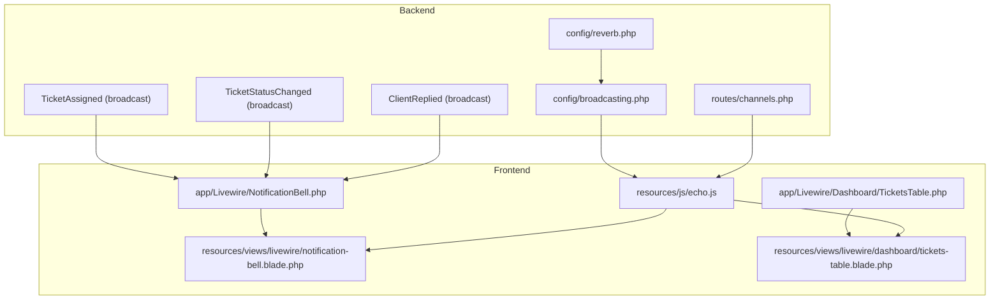
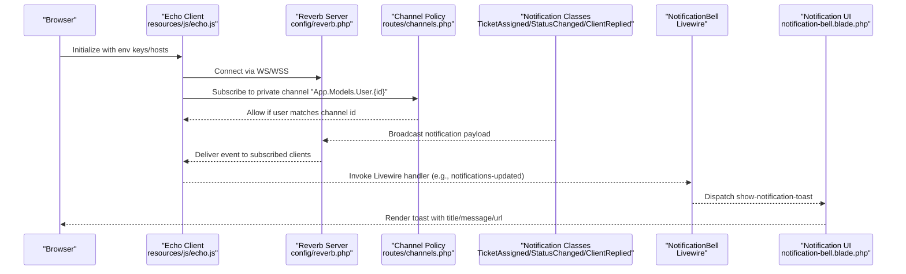
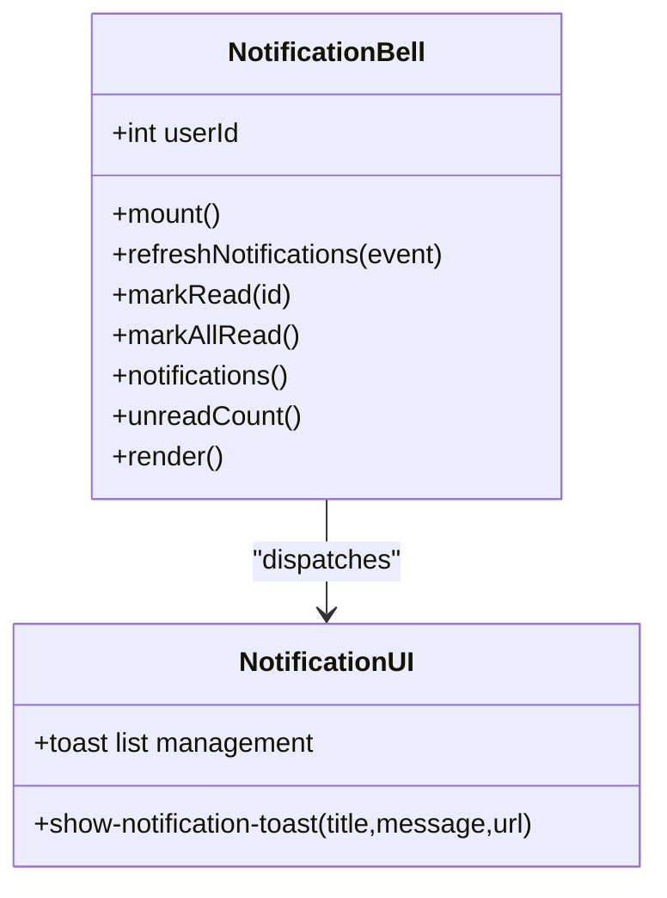
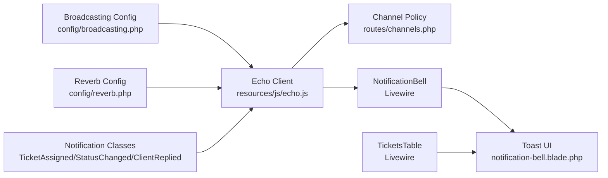

# Real-time Communication

<cite>
**Referenced Files in This Document**
- [config/reverb.php](file://config/reverb.php)
- [config/broadcasting.php](file://config/broadcasting.php)
- [routes/channels.php](file://routes/channels.php)
- [resources/js/echo.js](file://resources/js/echo.js)
- [resources/views/livewire/notification-bell.blade.php](file://resources/views/livewire/notification-bell.blade.php)
- [app/Livewire/NotificationBell.php](file://app/Livewire/NotificationBell.php)
- [app/Notifications/TicketAssigned.php](file://app/Notifications/TicketAssigned.php)
- [app/Notifications/TicketStatusChanged.php](file://app/Notifications/TicketStatusChanged.php)
- [app/Notifications/ClientReplied.php](file://app/Notifications/ClientReplied.php)
- [resources/views/livewire/dashboard/tickets-table.blade.php](file://resources/views/livewire/dashboard/tickets-table.blade.php)
- [app/Livewire/Dashboard/TicketsTable.php](file://app/Livewire/Dashboard/TicketsTable.php)
</cite>

## Table of Contents
1. [Introduction](#introduction)
2. [Project Structure](#project-structure)
3. [Core Components](#core-components)
4. [Architecture Overview](#architecture-overview)
5. [Detailed Component Analysis](#detailed-component-analysis)
6. [Dependency Analysis](#dependency-analysis)
7. [Performance Considerations](#performance-considerations)
8. [Troubleshooting Guide](#troubleshooting-guide)
9. [Conclusion](#conclusion)

## Introduction
This document explains the real-time communication system built with Laravel Reverb in the helpdesk application. It covers the WebSocket architecture enabling live updates without page refreshes, the notification system with bell integration and toast alerts, event-driven updates for tickets and replies, Reverb configuration and channel security, connection handling, and scaling considerations. It also provides practical guidance for implementing custom real-time features, handling connection failures, and optimizing performance for large user bases, including Livewire integration patterns.

## Project Structure
The real-time stack spans configuration, backend notifications, frontend Echo integration, and Livewire components:
- Backend configuration defines Reverb and broadcasting drivers.
- Channel authorization secures per-user private channels.
- Frontend initializes Laravel Echo to subscribe to channels and listen for events.
- Livewire components react to real-time events and update UI state.

**Diagram sources**
- [config/reverb.php:1-97](file://config/reverb.php#L1-L97)
- [config/broadcasting.php:1-83](file://config/broadcasting.php#L1-L83)
- [routes/channels.php:1-8](file://routes/channels.php#L1-L8)
- [resources/js/echo.js:1-15](file://resources/js/echo.js#L1-L15)
- [resources/views/livewire/notification-bell.blade.php:1-193](file://resources/views/livewire/notification-bell.blade.php#L1-L193)
- [app/Livewire/NotificationBell.php:1-96](file://app/Livewire/NotificationBell.php#L1-L96)
- [resources/views/livewire/dashboard/tickets-table.blade.php:1-841](file://resources/views/livewire/dashboard/tickets-table.blade.php#L1-L841)
- [app/Livewire/Dashboard/TicketsTable.php:1-523](file://app/Livewire/Dashboard/TicketsTable.php#L1-L523)

**Section sources**
- [config/reverb.php:1-97](file://config/reverb.php#L1-L97)
- [config/broadcasting.php:1-83](file://config/broadcasting.php#L1-L83)
- [routes/channels.php:1-8](file://routes/channels.php#L1-L8)
- [resources/js/echo.js:1-15](file://resources/js/echo.js#L1-L15)
- [resources/views/livewire/notification-bell.blade.php:1-193](file://resources/views/livewire/notification-bell.blade.php#L1-L193)
- [app/Livewire/NotificationBell.php:1-96](file://app/Livewire/NotificationBell.php#L1-L96)
- [resources/views/livewire/dashboard/tickets-table.blade.php:1-841](file://resources/views/livewire/dashboard/tickets-table.blade.php#L1-L841)
- [app/Livewire/Dashboard/TicketsTable.php:1-523](file://app/Livewire/Dashboard/TicketsTable.php#L1-L523)

## Core Components
- Reverb configuration: Defines server host/port/path, TLS options, Redis scaling, and ingest intervals.
- Broadcasting configuration: Selects the Reverb driver and connection options for the PHP application.
- Channel authorization: Restricts private user channels to authenticated users.
- Echo client: Initializes the browser-side Reverb client with environment variables.
- NotificationBell Livewire component: Listens for real-time notifications and displays toast alerts.
- Notification classes: Emit broadcast events with structured data for UI rendering.
- TicketsTable Livewire component: Demonstrates reactive UI updates and Livewire-Echo integration patterns.

Key implementation references:
- Reverb server and app settings: [config/reverb.php:29-L57], [config/reverb.php:70-L94]
- Broadcasting driver and options: [config/broadcasting.php:31-L47]
- Private channel policy: [routes/channels.php:5-L7]
- Echo initialization: [resources/js/echo.js:6-L14]
- NotificationBell component and event handlers: [app/Livewire/NotificationBell.php:19-L53], [resources/views/livewire/notification-bell.blade.php:119-L191]
- Notification payload shapes: [app/Notifications/TicketAssigned.php:38-L47], [app/Notifications/TicketStatusChanged.php:44-L53], [app/Notifications/ClientReplied.php:38-L47]
- Livewire event hooks and UI updates: [app/Livewire/Dashboard/TicketsTable.php:337-L348], [resources/views/livewire/dashboard/tickets-table.blade.php:358-L505]

**Section sources**
- [config/reverb.php:29-94](file://config/reverb.php#L29-L94)
- [config/broadcasting.php:31-47](file://config/broadcasting.php#L31-L47)
- [routes/channels.php:5-7](file://routes/channels.php#L5-L7)
- [resources/js/echo.js:6-14](file://resources/js/echo.js#L6-L14)
- [app/Livewire/NotificationBell.php:19-53](file://app/Livewire/NotificationBell.php#L19-L53)
- [resources/views/livewire/notification-bell.blade.php:119-191](file://resources/views/livewire/notification-bell.blade.php#L119-L191)
- [app/Notifications/TicketAssigned.php:38-47](file://app/Notifications/TicketAssigned.php#L38-L47)
- [app/Notifications/TicketStatusChanged.php:44-53](file://app/Notifications/TicketStatusChanged.php#L44-L53)
- [app/Notifications/ClientReplied.php:38-47](file://app/Notifications/ClientReplied.php#L38-L47)
- [app/Livewire/Dashboard/TicketsTable.php:337-348](file://app/Livewire/Dashboard/TicketsTable.php#L337-L348)
- [resources/views/livewire/dashboard/tickets-table.blade.php:358-505](file://resources/views/livewire/dashboard/tickets-table.blade.php#L358-L505)

## Architecture Overview
The system uses Laravel Reverb as the WebSocket server and Laravel Echo on the frontend to subscribe to private channels and receive broadcast events. Notifications are emitted by backend notification classes and delivered to the user’s browser via the Reverb server. Livewire components react to these events to update UI state and trigger toast notifications.

**Diagram sources**
- [resources/js/echo.js:6-14](file://resources/js/echo.js#L6-L14)
- [config/reverb.php:29-57](file://config/reverb.php#L29-L57)
- [routes/channels.php:5-7](file://routes/channels.php#L5-L7)
- [app/Notifications/TicketAssigned.php:28-31](file://app/Notifications/TicketAssigned.php#L28-L31)
- [app/Notifications/TicketStatusChanged.php:34-37](file://app/Notifications/TicketStatusChanged.php#L34-L37)
- [app/Notifications/ClientReplied.php:28-31](file://app/Notifications/ClientReplied.php#L28-L31)
- [app/Livewire/NotificationBell.php:19-53](file://app/Livewire/NotificationBell.php#L19-L53)
- [resources/views/livewire/notification-bell.blade.php:119-191](file://resources/views/livewire/notification-bell.blade.php#L119-L191)

## Detailed Component Analysis

### NotificationBell Livewire Component
The NotificationBell component integrates with Reverb to receive real-time notifications and display toast alerts. It listens for:
- A Livewire event dispatched by the backend.
- A private channel event bound to the authenticated user’s ID.

Behavior highlights:
- On receiving an event, it constructs a toast with a title, message, and optional URL to the ticket detail page.
- Provides actions to mark notifications as read and mark all as read, triggering Livewire updates.

**Diagram sources**
- [app/Livewire/NotificationBell.php:10-96](file://app/Livewire/NotificationBell.php#L10-L96)
- [resources/views/livewire/notification-bell.blade.php:119-191](file://resources/views/livewire/notification-bell.blade.php#L119-L191)

**Section sources**
- [app/Livewire/NotificationBell.php:14-96](file://app/Livewire/NotificationBell.php#L14-L96)
- [resources/views/livewire/notification-bell.blade.php:1-193](file://resources/views/livewire/notification-bell.blade.php#L1-L193)

### Notification Payloads and Event Types
Backend notifications emit structured payloads consumed by the frontend. The payload includes identifiers, subject, type, and message. The component maps types to human-readable titles and optionally constructs a ticket detail URL.

- TicketAssigned emits a broadcast payload with type "assigned".
- TicketStatusChanged emits a broadcast payload with type "status_changed".
- ClientReplied emits a broadcast payload with type "client_replied".

These payloads are defined in the toArray method of each notification class.

**Section sources**
- [app/Notifications/TicketAssigned.php:38-47](file://app/Notifications/TicketAssigned.php#L38-L47)
- [app/Notifications/TicketStatusChanged.php:44-53](file://app/Notifications/TicketStatusChanged.php#L44-L53)
- [app/Notifications/ClientReplied.php:38-47](file://app/Notifications/ClientReplied.php#L38-L47)
- [app/Livewire/NotificationBell.php:19-53](file://app/Livewire/NotificationBell.php#L19-L53)

### Livewire Integration Patterns
Livewire components demonstrate real-time responsiveness:
- The NotificationBell component reacts to Livewire events and private channel broadcasts to refresh notifications and show toasts.
- The TicketsTable component uses Livewire attributes to handle UI updates and dispatches toast messages for user feedback.

Practical patterns:
- Use #[On] attributes to bind to Livewire events triggered by backend or Echo.
- Use computed properties to fetch paginated notifications and unread counts efficiently.
- Dispatch frontend events to trigger UI updates like toasts or navigation.

**Section sources**
- [app/Livewire/NotificationBell.php:19-96](file://app/Livewire/NotificationBell.php#L19-L96)
- [resources/views/livewire/dashboard/tickets-table.blade.php:358-505](file://resources/views/livewire/dashboard/tickets-table.blade.php#L358-L505)
- [app/Livewire/Dashboard/TicketsTable.php:337-348](file://app/Livewire/Dashboard/TicketsTable.php#L337-L348)

### Channel Authorization and Security
Private channels are secured using a channel authorization callback that ensures only the intended user can subscribe to their notifications.

- The policy checks that the authenticated user’s ID matches the channel’s user ID placeholder.
- Echo subscribes to the private channel pattern "App.Models.User.{id}".

Security implications:
- Always verify the authenticated user ID against the channel parameter.
- Keep Reverb and broadcasting credentials secure via environment variables.

**Section sources**
- [routes/channels.php:5-7](file://routes/channels.php#L5-L7)
- [resources/js/echo.js:6-14](file://resources/js/echo.js#L6-L14)

### Reverb Configuration and Scaling
Reverb configuration supports:
- Server binding (host, port, path) and TLS options.
- Application credentials and connection options for the frontend.
- Scaling via Redis with a dedicated channel and server URL.
- Metrics ingestion intervals for Pulse and Telescope.

Scaling considerations:
- Enable scaling and configure Redis to coordinate multiple Reverb instances.
- Monitor ingest intervals and adjust for load.
- Tune max request size and message limits according to payload sizes.

**Section sources**
- [config/reverb.php:29-57](file://config/reverb.php#L29-L57)
- [config/reverb.php:70-94](file://config/reverb.php#L70-L94)

### Frontend Echo Initialization
The Echo client is initialized with environment variables for host, port, scheme, and TLS. It uses WS and WSS transports and binds to the Reverb broadcaster.

- Keys and hosts are loaded from Vite environment variables.
- The client connects to the configured Reverb server and subscribes to channels.

**Section sources**
- [resources/js/echo.js:6-14](file://resources/js/echo.js#L6-L14)

## Dependency Analysis
The real-time system depends on coordinated configuration and event flow across backend and frontend components.

**Diagram sources**
- [config/broadcasting.php:31-47](file://config/broadcasting.php#L31-L47)
- [config/reverb.php:29-57](file://config/reverb.php#L29-L57)
- [resources/js/echo.js:6-14](file://resources/js/echo.js#L6-L14)
- [routes/channels.php:5-7](file://routes/channels.php#L5-L7)
- [app/Notifications/TicketAssigned.php:28-31](file://app/Notifications/TicketAssigned.php#L28-L31)
- [app/Notifications/TicketStatusChanged.php:34-37](file://app/Notifications/TicketStatusChanged.php#L34-L37)
- [app/Notifications/ClientReplied.php:28-31](file://app/Notifications/ClientReplied.php#L28-L31)
- [app/Livewire/NotificationBell.php:19-53](file://app/Livewire/NotificationBell.php#L19-L53)
- [resources/views/livewire/notification-bell.blade.php:119-191](file://resources/views/livewire/notification-bell.blade.php#L119-L191)
- [app/Livewire/Dashboard/TicketsTable.php:337-348](file://app/Livewire/Dashboard/TicketsTable.php#L337-L348)

**Section sources**
- [config/broadcasting.php:31-47](file://config/broadcasting.php#L31-L47)
- [config/reverb.php:29-57](file://config/reverb.php#L29-L57)
- [resources/js/echo.js:6-14](file://resources/js/echo.js#L6-L14)
- [routes/channels.php:5-7](file://routes/channels.php#L5-L7)
- [app/Notifications/TicketAssigned.php:28-31](file://app/Notifications/TicketAssigned.php#L28-L31)
- [app/Notifications/TicketStatusChanged.php:34-37](file://app/Notifications/TicketStatusChanged.php#L34-L37)
- [app/Notifications/ClientReplied.php:28-31](file://app/Notifications/ClientReplied.php#L28-L31)
- [app/Livewire/NotificationBell.php:19-53](file://app/Livewire/NotificationBell.php#L19-L53)
- [resources/views/livewire/notification-bell.blade.php:119-191](file://resources/views/livewire/notification-bell.blade.php#L119-L191)
- [app/Livewire/Dashboard/TicketsTable.php:337-348](file://app/Livewire/Dashboard/TicketsTable.php#L337-L348)

## Performance Considerations
- Optimize payload sizes: Keep notification payloads minimal to reduce bandwidth and latency.
- Use pagination and caching: Paginate notifications and cache frequently accessed metadata to minimize database queries.
- Efficient Livewire updates: Use computed properties and targeted updates to avoid unnecessary re-renders.
- Echo transport selection: Prefer WSS in production for security; ensure proper TLS termination and certificates.
- Reverb scaling: Enable Redis-based scaling for horizontal growth and monitor ingest intervals.
- Connection resilience: Implement retry logic and graceful degradation in the client for network interruptions.

[No sources needed since this section provides general guidance]

## Troubleshooting Guide
Common issues and resolutions:
- Echo connection fails:
  - Verify environment variables for host, port, and scheme.
  - Confirm Reverb server is reachable and TLS settings match deployment.
  - Check browser console for WS/WSS errors.
  - References: [resources/js/echo.js:6-14](file://resources/js/echo.js#L6-L14)
- Unauthorized channel subscription:
  - Ensure the authenticated user ID matches the channel parameter.
  - Validate the channel policy returns true for the current user.
  - References: [routes/channels.php:5-7](file://routes/channels.php#L5-L7)
- Notifications not appearing:
  - Confirm notifications are broadcast via database and broadcast channels.
  - Verify Livewire event handlers and toast dispatch logic.
  - References: [app/Notifications/TicketAssigned.php:28-31](file://app/Notifications/TicketAssigned.php#L28-L31), [app/Livewire/NotificationBell.php:19-53](file://app/Livewire/NotificationBell.php#L19-L53), [resources/views/livewire/notification-bell.blade.php:119-191](file://resources/views/livewire/notification-bell.blade.php#L119-L191)
- Excessive traffic or latency:
  - Review Reverb scaling configuration and Redis settings.
  - Adjust ingest intervals and payload sizes.
  - References: [config/reverb.php:40-54](file://config/reverb.php#L40-L54)

**Section sources**
- [resources/js/echo.js:6-14](file://resources/js/echo.js#L6-L14)
- [routes/channels.php:5-7](file://routes/channels.php#L5-L7)
- [app/Notifications/TicketAssigned.php:28-31](file://app/Notifications/TicketAssigned.php#L28-L31)
- [app/Livewire/NotificationBell.php:19-53](file://app/Livewire/NotificationBell.php#L19-L53)
- [resources/views/livewire/notification-bell.blade.php:119-191](file://resources/views/livewire/notification-bell.blade.php#L119-L191)
- [config/reverb.php:40-54](file://config/reverb.php#L40-L54)

## Conclusion
The helpdesk application leverages Laravel Reverb and Echo to deliver a responsive, real-time experience. Private channels, structured notification payloads, and Livewire event handlers combine to provide immediate feedback and seamless updates. By following the configuration guidelines, security practices, and performance recommendations outlined here, teams can extend the system with custom real-time features, maintain reliability under load, and ensure a smooth user experience across concurrent users.