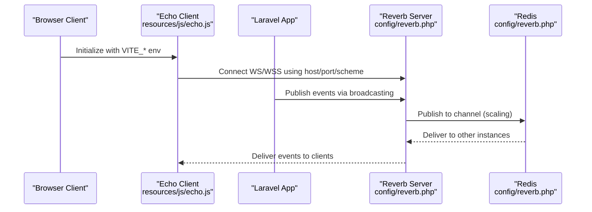
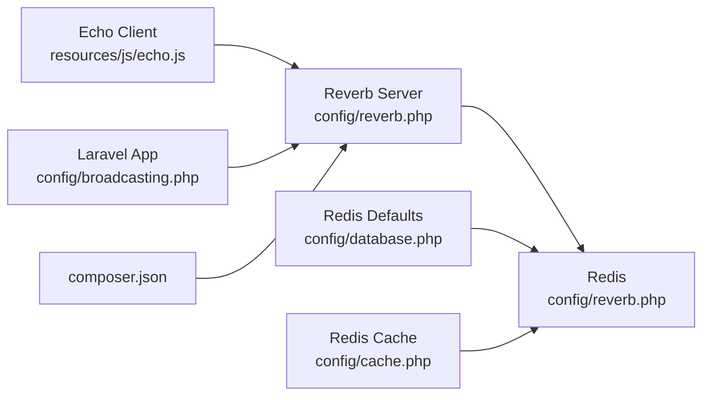

# WebSocket Configuration

<cite>
**Referenced Files in This Document**
- [config/reverb.php](file://config/reverb.php)
- [config/broadcasting.php](file://config/broadcasting.php)
- [config/database.php](file://config/database.php)
- [config/cache.php](file://config/cache.php)
- [composer.json](file://composer.json)
- [resources/js/echo.js](file://resources/js/echo.js)
- [routes/channels.php](file://routes/channels.php)
- [vite.config.js](file://vite.config.js)
</cite>

## Table of Contents
1. [Introduction](#introduction)
2. [Project Structure](#project-structure)
3. [Core Components](#core-components)
4. [Architecture Overview](#architecture-overview)
5. [Detailed Component Analysis](#detailed-component-analysis)
6. [Dependency Analysis](#dependency-analysis)
7. [Performance Considerations](#performance-considerations)
8. [Troubleshooting Guide](#troubleshooting-guide)
9. [Conclusion](#conclusion)
10. [Appendices](#appendices)

## Introduction
This document explains how to configure the Laravel Reverb WebSocket server for this helpdesk system. It covers server binding, public endpoint configuration, TLS, scaling via Redis, environment variables for development and production, load balancing considerations, and operational troubleshooting. The goal is to enable reliable real-time messaging across single-instance and horizontally scaled deployments.

## Project Structure
The WebSocket configuration spans several Laravel configuration files and the frontend client initialization:
- Reverb server and application settings are defined in the Reverb configuration file.
- The framework’s broadcasting layer integrates with Reverb via the broadcasting configuration.
- Redis is used for Reverb scaling and is configured centrally under the database and cache layers.
- The frontend client initializes the connection using environment variables exposed to the browser.

```mermaid
graph TB
subgraph "Server"
RConf["config/reverb.php"]
BConf["config/broadcasting.php"]
DBConf["config/database.php"]
CConf["config/cache.php"]
Composer["composer.json"]
end
subgraph "Client"
EchoJS["resources/js/echo.js"]
Vite["vite.config.js"]
end
subgraph "Runtime"
Redis[("Redis")]
Reverb["Reverb Server"]
App["Laravel App"]
end
RConf --> Reverb
BConf --> App
DBConf --> Redis
CConf --> Redis
Composer --> Reverb
EchoJS --> Reverb
Vite --> EchoJS
Redis <- --> Reverb
App --> Reverb
```

**Diagram sources**
- [config/reverb.php:1-97](file://config/reverb.php#L1-L97)
- [config/broadcasting.php:1-83](file://config/broadcasting.php#L1-L83)
- [config/database.php:145-181](file://config/database.php#L145-L181)
- [config/cache.php:75-79](file://config/cache.php#L75-L79)
- [composer.json:17](file://composer.json#L17)
- [resources/js/echo.js:1-14](file://resources/js/echo.js#L1-L14)
- [vite.config.js:1-22](file://vite.config.js#L1-L22)

**Section sources**
- [config/reverb.php:1-97](file://config/reverb.php#L1-L97)
- [config/broadcasting.php:1-83](file://config/broadcasting.php#L1-L83)
- [config/database.php:145-181](file://config/database.php#L145-L181)
- [config/cache.php:75-79](file://config/cache.php#L75-L79)
- [composer.json:17](file://composer.json#L17)
- [resources/js/echo.js:1-14](file://resources/js/echo.js#L1-L14)
- [vite.config.js:1-22](file://vite.config.js#L1-L22)

## Core Components
- Reverb server configuration defines the internal bind host/port, optional hostname, path, TLS options, request size limits, scaling parameters, and telemetry intervals.
- Application-level settings define the public endpoint host, port, scheme, TLS usage, ping interval, activity timeout, max connections, and message size.
- Broadcasting configuration wires Laravel’s event broadcasting to Reverb using the same application credentials and endpoint options.
- Redis is used for Reverb scaling and is configured under database and cache layers for both default and cache connections.
- Frontend client connects to Reverb using Vite environment variables mapped to Reverb configuration.

Key configuration locations:
- Server options: [config/reverb.php:31-55](file://config/reverb.php#L31-L55)
- Application options: [config/reverb.php:70-94](file://config/reverb.php#L70-L94)
- Broadcasting driver and options: [config/broadcasting.php:33-47](file://config/broadcasting.php#L33-L47)
- Redis scaling server: [config/reverb.php:40-52](file://config/reverb.php#L40-L52)
- Redis defaults: [config/database.php:155-166](file://config/database.php#L155-L166), [config/cache.php:75-79](file://config/cache.php#L75-L79)
- Frontend client: [resources/js/echo.js:6-14](file://resources/js/echo.js#L6-L14)

**Section sources**
- [config/reverb.php:31-55](file://config/reverb.php#L31-L55)
- [config/reverb.php:70-94](file://config/reverb.php#L70-L94)
- [config/broadcasting.php:33-47](file://config/broadcasting.php#L33-L47)
- [config/reverb.php:40-52](file://config/reverb.php#L40-L52)
- [config/database.php:155-166](file://config/database.php#L155-L166)
- [config/cache.php:75-79](file://config/cache.php#L75-L79)
- [resources/js/echo.js:6-14](file://resources/js/echo.js#L6-L14)

## Architecture Overview
The system uses Reverb as the WebSocket server. Laravel broadcasts events to Reverb, which fans them out to connected clients. Scaling is achieved via Redis pub/sub. The frontend client connects using the Echo library with environment-driven options.



**Diagram sources**
- [resources/js/echo.js:6-14](file://resources/js/echo.js#L6-L14)
- [config/reverb.php:31-55](file://config/reverb.php#L31-L55)
- [config/reverb.php:40-52](file://config/reverb.php#L40-L52)

**Section sources**
- [resources/js/echo.js:6-14](file://resources/js/echo.js#L6-L14)
- [config/reverb.php:31-55](file://config/reverb.php#L31-L55)
- [config/reverb.php:40-52](file://config/reverb.php#L40-L52)

## Detailed Component Analysis

### Reverb Server Configuration
- Host and port: Controls the internal bind address and port for the Reverb server process.
- Path: Optional path prefix for the WebSocket endpoint.
- Hostname: Public hostname used by applications.
- Options: TLS options container; empty by default.
- Request size limit: Maximum allowed request size.
- Scaling:
  - Enabled flag toggles horizontal scaling.
  - Channel name for inter-instance communication.
  - Redis server settings for scaling (URL/host/port/username/password/database/timeout).
- Telemetry intervals: Pulse and Telescope ingest intervals.

Environment variables:
- REVERB_SERVER_HOST, REVERB_SERVER_PORT, REVERB_SERVER_PATH, REVERB_HOST, REVERB_MAX_REQUEST_SIZE, REVERB_SCALING_ENABLED, REVERB_SCALING_CHANNEL, REDIS_URL, REDIS_HOST, REDIS_PORT, REDIS_USERNAME, REDIS_PASSWORD, REDIS_DB, REDIS_TIMEOUT, REVERB_PULSE_INGEST_INTERVAL, REVERB_TELESCOPE_INGEST_INTERVAL.

Operational notes:
- For development, the server typically binds to localhost or 0.0.0.0 with a non-privileged port.
- For production, bind to a restricted interface and expose via a reverse proxy or load balancer.

**Section sources**
- [config/reverb.php:31-55](file://config/reverb.php#L31-L55)
- [config/reverb.php:40-52](file://config/reverb.php#L40-L52)

### Reverb Application Configuration
- Application credentials: key, secret, app_id.
- Endpoint options: host, port, scheme, TLS flag derived from scheme.
- Security and limits:
  - Allowed origins wildcard for development.
  - Ping interval and activity timeout for keepalive and idle detection.
  - Optional max connections and max message size.
  - Client event acceptance policy.

Environment variables:
- REVERB_APP_KEY, REVERB_APP_SECRET, REVERB_APP_ID, REVERB_HOST, REVERB_PORT, REVERB_SCHEME, REVERB_APP_PING_INTERVAL, REVERB_APP_ACTIVITY_TIMEOUT, REVERB_APP_MAX_CONNECTIONS, REVERB_APP_MAX_MESSAGE_SIZE, REVERB_APP_ACCEPT_CLIENT_EVENTS_FROM.

**Section sources**
- [config/reverb.php:70-94](file://config/reverb.php#L70-L94)

### Broadcasting Layer Integration
- Driver is set to Reverb with application credentials and endpoint options mirroring the application configuration.
- This allows Laravel events to be broadcast over Reverb seamlessly.

Environment variables:
- BROADCAST_CONNECTION, REVERB_APP_KEY, REVERB_APP_SECRET, REVERB_APP_ID, REVERB_HOST, REVERB_PORT, REVERB_SCHEME.

**Section sources**
- [config/broadcasting.php:18](file://config/broadcasting.php#L18)
- [config/broadcasting.php:33-47](file://config/broadcasting.php#L33-L47)

### Redis-Based Scaling
- Scaling is controlled by enabling the feature and specifying a channel.
- The Redis server used for scaling is configured under the Reverb server scaling block.
- Additional Redis connections are configured for caching and default operations.

Key settings:
- Scaling enabled flag and channel.
- Redis URL/host/port/username/password/database/timeout.
- Default and cache Redis connections for other subsystems.

**Section sources**
- [config/reverb.php:40-52](file://config/reverb.php#L40-L52)
- [config/database.php:155-166](file://config/database.php#L155-L166)
- [config/cache.php:75-79](file://config/cache.php#L75-L79)

### Frontend Client Configuration
- Echo initializes with Vite environment variables for host, port, and TLS enforcement.
- The client uses WS and WSS transports.

Environment variables:
- VITE_REVERB_APP_KEY, VITE_REVERB_HOST, VITE_REVERB_PORT, VITE_REVERB_SCHEME.

**Section sources**
- [resources/js/echo.js:6-14](file://resources/js/echo.js#L6-L14)

### Channel Authorization
- Private/public channel authorization is defined for user-specific channels.

**Section sources**
- [routes/channels.php:5-7](file://routes/channels.php#L5-L7)

## Dependency Analysis
Reverb depends on Redis for horizontal scaling. The application depends on Reverb for broadcasting. The frontend depends on Vite environment variables to connect to Reverb.



**Diagram sources**
- [resources/js/echo.js:6-14](file://resources/js/echo.js#L6-L14)
- [config/broadcasting.php:33-47](file://config/broadcasting.php#L33-L47)
- [config/reverb.php:40-52](file://config/reverb.php#L40-L52)
- [config/database.php:155-166](file://config/database.php#L155-L166)
- [config/cache.php:75-79](file://config/cache.php#L75-L79)
- [composer.json:17](file://composer.json#L17)

**Section sources**
- [resources/js/echo.js:6-14](file://resources/js/echo.js#L6-L14)
- [config/broadcasting.php:33-47](file://config/broadcasting.php#L33-L47)
- [config/reverb.php:40-52](file://config/reverb.php#L40-L52)
- [config/database.php:155-166](file://config/database.php#L155-L166)
- [config/cache.php:75-79](file://config/cache.php#L75-L79)
- [composer.json:17](file://composer.json#L17)

## Performance Considerations
- Adjust max request size and message sizes to match payload characteristics.
- Tune ping interval and activity timeout to balance responsiveness and resource usage.
- Enable scaling in production to distribute load across instances.
- Use appropriate Redis timeouts and retry/backoff settings for reliability.
- Monitor ingest intervals for observability tools to ensure timely metrics collection.

[No sources needed since this section provides general guidance]

## Troubleshooting Guide
Common issues and resolutions:
- Connection refused or cannot reach server:
  - Verify internal bind host/port and firewall rules.
  - Confirm the Reverb process is running and listening on the expected interface.
- TLS handshake failures:
  - Ensure the scheme and port align with TLS expectations.
  - Validate certificates and trust chain if using self-signed certificates.
- Cross-origin errors:
  - Review allowed origins and ensure the frontend origin is permitted.
- Scaling not working:
  - Confirm scaling is enabled and Redis connectivity is correct.
  - Verify the scaling channel name is consistent across instances.
- Frontend cannot connect:
  - Check Vite environment variables for host, port, and scheme.
  - Ensure the client transport selection matches the server configuration.

**Section sources**
- [config/reverb.php:31-55](file://config/reverb.php#L31-L55)
- [config/reverb.php:70-94](file://config/reverb.php#L70-L94)
- [resources/js/echo.js:6-14](file://resources/js/echo.js#L6-L14)

## Conclusion
This project integrates Laravel Reverb for real-time messaging with a clean separation between internal server configuration, public application settings, and frontend client options. Redis enables horizontal scaling, while environment variables provide flexible deployment across development and production. Following the configuration patterns and troubleshooting steps outlined here will help maintain a robust WebSocket infrastructure.

[No sources needed since this section summarizes without analyzing specific files]

## Appendices

### Environment Variables Reference
- Server binding and endpoint:
  - REVERB_SERVER_HOST, REVERB_SERVER_PORT, REVERB_SERVER_PATH, REVERB_HOST
- Application credentials and endpoint:
  - REVERB_APP_KEY, REVERB_APP_SECRET, REVERB_APP_ID, REVERB_HOST, REVERB_PORT, REVERB_SCHEME
- Scaling:
  - REVERB_SCALING_ENABLED, REVERB_SCALING_CHANNEL, REDIS_URL, REDIS_HOST, REDIS_PORT, REDIS_USERNAME, REDIS_PASSWORD, REDIS_DB, REDIS_TIMEOUT
- Limits and intervals:
  - REVERB_MAX_REQUEST_SIZE, REVERB_APP_PING_INTERVAL, REVERB_APP_ACTIVITY_TIMEOUT, REVERB_APP_MAX_CONNECTIONS, REVERB_APP_MAX_MESSAGE_SIZE, REVERB_PULSE_INGEST_INTERVAL, REVERB_TELESCOPE_INGEST_INTERVAL
- Broadcasting:
  - BROADCAST_CONNECTION
- Frontend:
  - VITE_REVERB_APP_KEY, VITE_REVERB_HOST, VITE_REVERB_PORT, VITE_REVERB_SCHEME

**Section sources**
- [config/reverb.php:31-55](file://config/reverb.php#L31-L55)
- [config/reverb.php:70-94](file://config/reverb.php#L70-L94)
- [config/broadcasting.php:18](file://config/broadcasting.php#L18)
- [resources/js/echo.js:6-14](file://resources/js/echo.js#L6-L14)

### Development vs Production Checklist
- Development:
  - Bind to localhost or 0.0.0.0 with a non-privileged port.
  - Scheme set to http; TLS disabled.
  - Allow all origins for local testing.
  - Disable scaling; use a single instance.
- Production:
  - Bind to a restricted interface; expose via reverse proxy or load balancer.
  - Scheme set to https; ensure valid certificates.
  - Configure allowed origins to match your domain(s).
  - Enable scaling with Redis; ensure connectivity and timeouts are tuned.
  - Set appropriate limits for requests, messages, and activity timeouts.

**Section sources**
- [config/reverb.php:31-55](file://config/reverb.php#L31-L55)
- [config/reverb.php:70-94](file://config/reverb.php#L70-L94)
- [config/reverb.php:40-52](file://config/reverb.php#L40-L52)

### Load Balancing Setup Notes
- Place a reverse proxy or load balancer in front of Reverb instances.
- Ensure sticky sessions are not required; WebSocket connections should be distributed across instances.
- Use the scaling channel to coordinate stateless instances via Redis.

[No sources needed since this section provides general guidance]