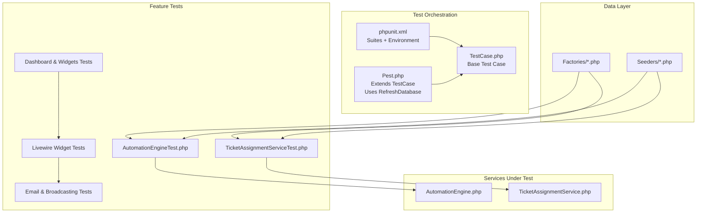
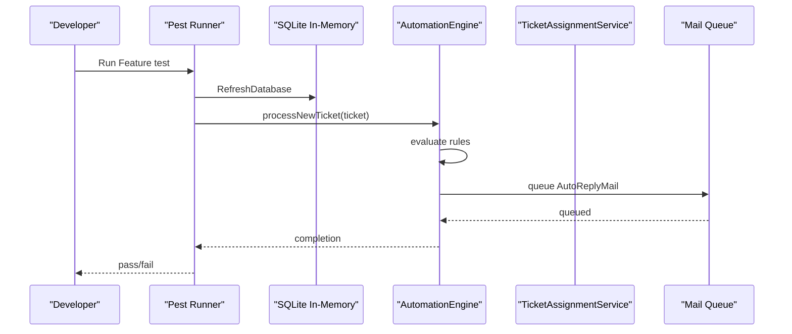
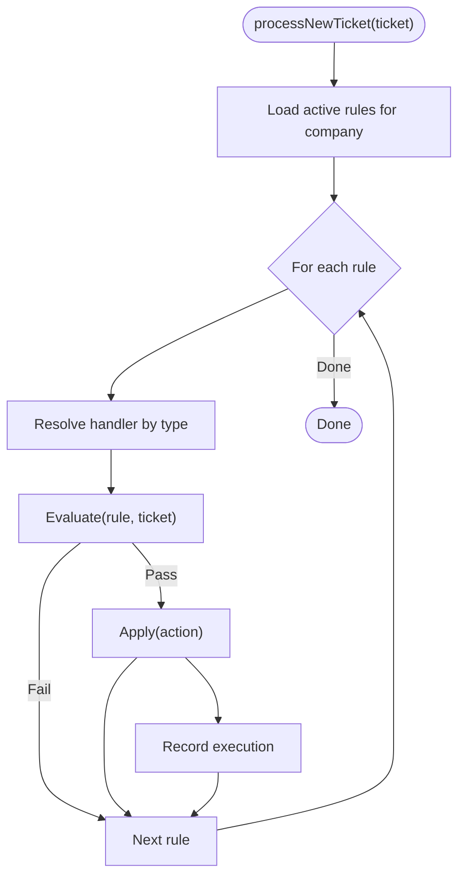
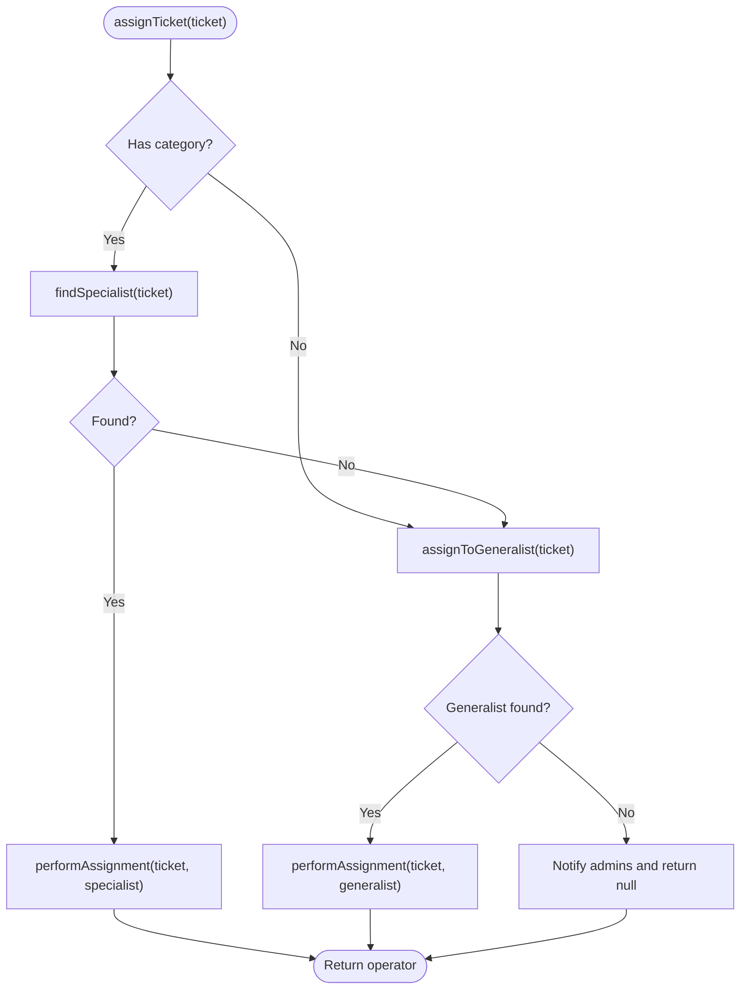
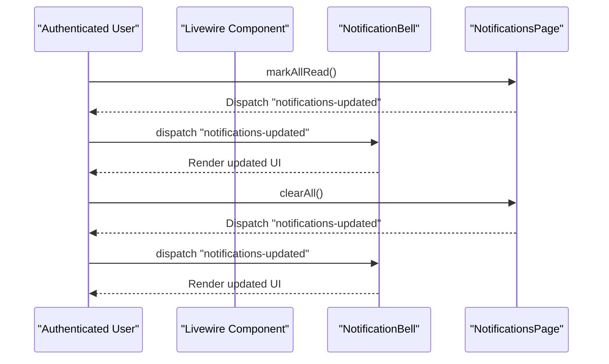
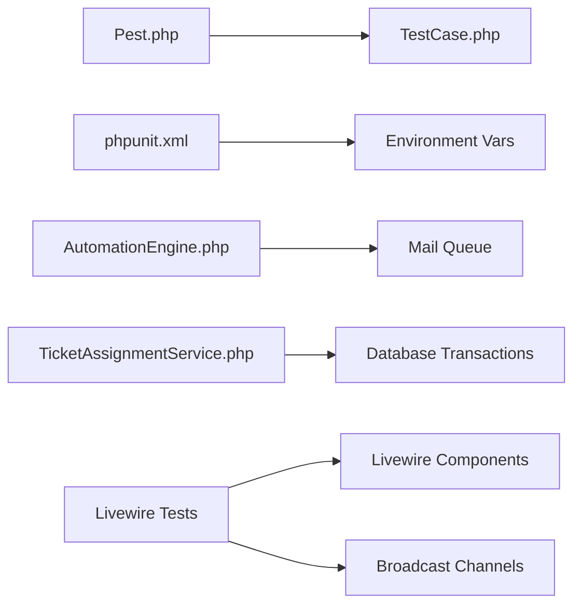

# Testing Strategy

<cite>
**Referenced Files in This Document**
- [phpunit.xml](file://phpunit.xml)
- [Pest.php](file://tests/Pest.php)
- [TestCase.php](file://tests/TestCase.php)
- [AutomationEngineTest.php](file://tests/Feature/Services/AutomationEngineTest.php)
- [TicketAssignmentServiceTest.php](file://tests/Feature/Services/TicketAssignmentServiceTest.php)
- [AutomationEngine.php](file://app/Services/Automation/AutomationEngine.php)
- [TicketAssignmentService.php](file://app/Services/TicketAssignmentService.php)
- [UserFactory.php](file://database/factories/UserFactory.php)
- [channels.php](file://routes/channels.php)
- [NotificationSyncTest.php](file://tests/Feature/NotificationSyncTest.php)
- [AdminDashboardTest.php](file://tests/Feature/AdminDashboardTest.php)
- [AgentDashboardTest.php](file://tests/Feature/AgentDashboardTest.php)
- [DashboardTest.php](file://tests/Feature/DashboardTest.php)
- [AiSummaryTest.php](file://tests/Feature/AiSummaryTest.php)
- [TicketChatTest.php](file://tests/Feature/TicketChatTest.php)
- [AutomationRulesTableTest.php](file://tests/Feature/AutomationRulesTableTest.php)
- [TicketsTableTest.php](file://tests/Feature/TicketsTableTest.php)
- [OperatorsTableTest.php](file://tests/Feature/OperatorsTableTest.php)
- [CategoriesTableTest.php](file://tests/Feature/CategoriesTableTest.php)
- [ReportsAnalyticsTest.php](file://tests/Feature/ReportsAnalyticsTest.php)
- [NotificationBellTest.php](file://tests/Feature/NotificationBellTest.php)
- [OnboardingWizardTest.php](file://tests/Feature/OnboardingWizardTest.php)
- [FormWidgetThemeTest.php](file://tests/Feature/FormWidgetThemeTest.php)
- [ChatbotFaqTest.php](file://tests/Feature/ChatbotFaqTest.php)
- [NotificationsPageTest.php](file://tests/Feature/NotificationsPageTest.php)
- [OperatorProfileTest.php](file://tests/Feature/OperatorProfileTest.php)
- [SettingsPasswordTest.php](file://tests/Feature/Settings/PasswordTest.php)
- [SettingsPasswordUpdateTest.php](file://tests/Feature/Settings/PasswordUpdateTest.php)
- [SettingsProfileUpdateTest.php](file://tests/Feature/Settings/ProfileUpdateTest.php)
- [SettingsTwoFactorAuthenticationTest.php](file://tests/Feature/Settings/TwoFactorAuthenticationTest.php)
- [AuthAuthenticationTest.php](file://tests/Feature/Auth/AuthenticationTest.php)
- [AuthEmailVerificationTest.php](file://tests/Feature/Auth/EmailVerificationTest.php)
- [AuthInvitationTest.php](file://tests/Feature/Auth/InvitationTest.php)
- [AuthPasswordConfirmationTest.php](file://tests/Feature/Auth/PasswordConfirmationTest.php)
- [AuthPasswordResetTest.php](file://tests/Feature/Auth/PasswordResetTest.php)
- [AuthRegistrationTest.php](file://tests/Feature/Auth/RegistrationTest.php)
- [AuthSetPasswordTest.php](file://tests/Feature/Auth/SetPasswordTest.php)
- [AuthTwoFactorChallengeTest.php](file://tests/Feature/Auth/TwoFactorChallengeTest.php)
</cite>

## Table of Contents
1. [Introduction](#introduction)
2. [Project Structure](#project-structure)
3. [Core Components](#core-components)
4. [Architecture Overview](#architecture-overview)
5. [Detailed Component Analysis](#detailed-component-analysis)
6. [Dependency Analysis](#dependency-analysis)
7. [Performance Considerations](#performance-considerations)
8. [Troubleshooting Guide](#troubleshooting-guide)
9. [Conclusion](#conclusion)
10. [Appendices](#appendices)

## Introduction
This document defines the complete testing strategy for the Helpdesk System. It explains how the project leverages both PHPUnit and Pest to organize and execute tests, and how it validates business-critical services, Livewire components, and integrations such as email, broadcasting, and AI. It also covers database testing with factories and seeders, best practices for mocking external dependencies, and guidance for continuous integration and performance testing.

## Project Structure
The testing setup is organized into:
- PHPUnit configuration defining suites and environment variables for fast, isolated tests.
- Pest configuration extending the base test case and enabling database refresh for feature tests.
- Feature tests for end-to-end scenarios, Livewire component interactions, and service validations.
- Unit tests for isolated logic and foundational building blocks.

**Diagram sources**
- [phpunit.xml:1-36](file://phpunit.xml#L1-L36)
- [Pest.php:14-16](file://tests/Pest.php#L14-L16)
- [TestCase.php:1-11](file://tests/TestCase.php#L1-L11)
- [AutomationEngineTest.php:1-278](file://tests/Feature/Services/AutomationEngineTest.php#L1-L278)
- [TicketAssignmentServiceTest.php:1-274](file://tests/Feature/Services/TicketAssignmentServiceTest.php#L1-L274)
- [AutomationEngine.php:1-142](file://app/Services/Automation/AutomationEngine.php#L1-L142)
- [TicketAssignmentService.php:1-179](file://app/Services/TicketAssignmentService.php#L1-L179)
- [UserFactory.php:1-103](file://database/factories/UserFactory.php#L1-L103)

**Section sources**
- [phpunit.xml:1-36](file://phpunit.xml#L1-L36)
- [Pest.php:14-16](file://tests/Pest.php#L14-L16)
- [TestCase.php:1-11](file://tests/TestCase.php#L1-L11)

## Core Components
- Dual framework approach:
  - PHPUnit suite configuration defines Unit and Feature test suites and sets a SQLite in-memory database for speed.
  - Pest extends the base test case and enables database refresh for Feature tests, reducing boilerplate and improving readability.
- Feature tests cover:
  - Services: AutomationEngine and TicketAssignmentService.
  - Livewire components: Notifications page, bell, dashboard widgets, and real-time event synchronization.
  - Authentication, settings, and onboarding flows.
- Database testing:
  - Factories define realistic model states and convenient state macros (operator, admin, specialty, availability).
  - Seeders support initial dataset population for integration-like tests.

**Section sources**
- [phpunit.xml:7-14](file://phpunit.xml#L7-L14)
- [Pest.php:14-16](file://tests/Pest.php#L14-L16)
- [UserFactory.php:66-101](file://database/factories/UserFactory.php#L66-L101)

## Architecture Overview
The testing architecture separates concerns across frameworks and layers:
- PHPUnit runs unit-style tests and provides strict isolation via environment variables.
- Pest focuses on expressive Feature tests with shared setup and database refresh.
- Services under test are validated through targeted scenarios and deterministic factories.
- Livewire components are exercised with Livewire::actingAs and event assertions.

**Diagram sources**
- [Pest.php:14-16](file://tests/Pest.php#L14-L16)
- [phpunit.xml:20-34](file://phpunit.xml#L20-L34)
- [AutomationEngineTest.php:19-47](file://tests/Feature/Services/AutomationEngineTest.php#L19-L47)
- [AutomationEngine.php:28-41](file://app/Services/Automation/AutomationEngine.php#L28-L41)

## Detailed Component Analysis

### AutomationEngine Testing
AutomationEngine orchestrates rule evaluation and application. Tests validate:
- Assignment rules assigning specialists/generals based on category and availability.
- Priority rules reacting to keyword matches.
- Auto-reply email queuing.
- Escalation rule discovery and priority escalation with admin notifications.
- Execution ordering and rule metadata updates.

**Diagram sources**
- [AutomationEngine.php:28-96](file://app/Services/Automation/AutomationEngine.php#L28-L96)

**Section sources**
- [AutomationEngineTest.php:19-47](file://tests/Feature/Services/AutomationEngineTest.php#L19-L47)
- [AutomationEngineTest.php:49-95](file://tests/Feature/Services/AutomationEngineTest.php#L49-L95)
- [AutomationEngineTest.php:97-123](file://tests/Feature/Services/AutomationEngineTest.php#L97-L123)
- [AutomationEngineTest.php:209-241](file://tests/Feature/Services/AutomationEngineTest.php#L209-L241)
- [AutomationEngineTest.php:243-277](file://tests/Feature/Services/AutomationEngineTest.php#L243-L277)
- [AutomationEngine.php:18-25](file://app/Services/Automation/AutomationEngine.php#L18-L25)

### TicketAssignmentService Testing
TicketAssignmentService encapsulates assignment logic with deterministic fallbacks and transactional updates. Tests validate:
- Specialist-first assignment with specialty match and lowest workload.
- Generalist fallback when no specialist is available.
- Workload balancing and counter increments/decrements.
- Unassignment and reassignment behavior.
- Observer-triggered auto-assignment for verified tickets.

**Diagram sources**
- [TicketAssignmentService.php:22-94](file://app/Services/TicketAssignmentService.php#L22-L94)

**Section sources**
- [TicketAssignmentServiceTest.php:14-35](file://tests/Feature/Services/TicketAssignmentServiceTest.php#L14-L35)
- [TicketAssignmentServiceTest.php:37-86](file://tests/Feature/Services/TicketAssignmentServiceTest.php#L37-L86)
- [TicketAssignmentServiceTest.php:181-224](file://tests/Feature/Services/TicketAssignmentServiceTest.php#L181-L224)

### Livewire Component Testing and Real-Time Updates
Livewire components are tested for interactive behavior and event synchronization:
- Notifications page emits a Livewire event when clearing or marking notifications read.
- Notification bell reacts to updates without crashing.
- Real-time updates are validated via event dispatch assertions.

**Diagram sources**
- [NotificationSyncTest.php:12-26](file://tests/Feature/NotificationSyncTest.php#L12-L26)
- [NotificationSyncTest.php:28-36](file://tests/Feature/NotificationSyncTest.php#L28-L36)
- [NotificationSyncTest.php:38-49](file://tests/Feature/NotificationSyncTest.php#L38-L49)

**Section sources**
- [NotificationSyncTest.php:12-26](file://tests/Feature/NotificationSyncTest.php#L12-L26)
- [NotificationSyncTest.php:28-36](file://tests/Feature/NotificationSyncTest.php#L28-L36)
- [NotificationSyncTest.php:38-49](file://tests/Feature/NotificationSyncTest.php#L38-L49)

### Database Testing Strategies, Factories, and Seeders
- Factories:
  - UserFactory provides role and availability states, specialty linkage, and convenience macros for operators/admins.
- Seeders:
  - DatabaseSeeder and ChatbotFaqSeeder populate initial datasets for integration-like tests.
- Feature tests leverage RefreshDatabase to ensure clean state per scenario.

**Section sources**
- [UserFactory.php:66-101](file://database/factories/UserFactory.php#L66-L101)
- [AutomationEngineTest.php:13](file://tests/Feature/Services/AutomationEngineTest.php#L13)
- [TicketAssignmentServiceTest.php:9](file://tests/Feature/Services/TicketAssignmentServiceTest.php#L9)

### Testing Email Notifications and Broadcasting
- Emails:
  - AutomationEngineTest verifies queuing of AutoReplyMail and EscalationNotificationMail.
- Broadcasting:
  - channels.php defines user-specific broadcast channels for real-time updates.
  - Livewire tests validate event-driven UI updates.

**Section sources**
- [AutomationEngineTest.php:97-123](file://tests/Feature/Services/AutomationEngineTest.php#L97-L123)
- [AutomationEngineTest.php:243-277](file://tests/Feature/Services/AutomationEngineTest.php#L243-L277)
- [channels.php:5-7](file://routes/channels.php#L5-L7)
- [NotificationSyncTest.php:12-26](file://tests/Feature/NotificationSyncTest.php#L12-L26)

### Testing WebSocket Events and External Integrations
- Broadcasting:
  - User channel authorization ensures secure per-user event delivery.
- AI service integration:
  - AiSummaryTest exists to exercise AI-related flows; mock strategies should isolate AI SDK calls and validate outcomes deterministically.

**Section sources**
- [channels.php:5-7](file://routes/channels.php#L5-L7)
- [AiSummaryTest.php](file://tests/Feature/AiSummaryTest.php)

### Authentication and Settings Feature Tests
- Authentication:
  - Tests cover login, registration, password reset, email verification, invitations, two-factor challenge, and password confirmation.
- Settings:
  - Password, profile, and two-factor authentication flows are covered in dedicated Feature tests.

**Section sources**
- [AuthAuthenticationTest.php](file://tests/Feature/Auth/AuthenticationTest.php)
- [AuthEmailVerificationTest.php](file://tests/Feature/Auth/EmailVerificationTest.php)
- [AuthInvitationTest.php](file://tests/Feature/Auth/InvitationTest.php)
- [AuthPasswordConfirmationTest.php](file://tests/Feature/Auth/PasswordConfirmationTest.php)
- [AuthPasswordResetTest.php](file://tests/Feature/Auth/PasswordResetTest.php)
- [AuthRegistrationTest.php](file://tests/Feature/Auth/RegistrationTest.php)
- [AuthSetPasswordTest.php](file://tests/Feature/Auth/SetPasswordTest.php)
- [AuthTwoFactorChallengeTest.php](file://tests/Feature/Auth/TwoFactorChallengeTest.php)
- [SettingsPasswordTest.php](file://tests/Feature/Settings/PasswordTest.php)
- [SettingsPasswordUpdateTest.php](file://tests/Feature/Settings/PasswordUpdateTest.php)
- [SettingsProfileUpdateTest.php](file://tests/Feature/Settings/ProfileUpdateTest.php)
- [SettingsTwoFactorAuthenticationTest.php](file://tests/Feature/Settings/TwoFactorAuthenticationTest.php)

### Dashboard Widgets and Real-Time Dashboards
- AdminDashboardTest and AgentDashboardTest validate access control and rendering for dashboard routes.
- Additional widget-focused tests cover tickets table, automation rules table, operators table, categories table, reports/analytics, onboarding wizard, form widget theme, chatbot FAQ, notifications page, and operator profile.

**Section sources**
- [AdminDashboardTest.php](file://tests/Feature/AdminDashboardTest.php)
- [AgentDashboardTest.php](file://tests/Feature/AgentDashboardTest.php)
- [DashboardTest.php](file://tests/Feature/DashboardTest.php)
- [AutomationRulesTableTest.php](file://tests/Feature/AutomationRulesTableTest.php)
- [TicketsTableTest.php](file://tests/Feature/TicketsTableTest.php)
- [OperatorsTableTest.php](file://tests/Feature/OperatorsTableTest.php)
- [CategoriesTableTest.php](file://tests/Feature/CategoriesTableTest.php)
- [ReportsAnalyticsTest.php](file://tests/Feature/ReportsAnalyticsTest.php)
- [OnboardingWizardTest.php](file://tests/Feature/OnboardingWizardTest.php)
- [FormWidgetThemeTest.php](file://tests/Feature/FormWidgetThemeTest.php)
- [ChatbotFaqTest.php](file://tests/Feature/ChatbotFaqTest.php)
- [NotificationsPageTest.php](file://tests/Feature/NotificationsPageTest.php)
- [OperatorProfileTest.php](file://tests/Feature/OperatorProfileTest.php)

## Dependency Analysis
- Test framework coupling:
  - Pest extends the base TestCase and uses RefreshDatabase for Feature tests.
  - PHPUnit defines suites and environment variables for isolation and speed.
- Service dependencies:
  - AutomationEngine depends on rule handlers and the mail queue.
  - TicketAssignmentService depends on transactions, notifications, and user/operator scopes.
- Livewire and broadcasting:
  - Livewire tests depend on actingAs and event dispatching/assertions.
  - Broadcasting relies on channel authorization.

**Diagram sources**
- [Pest.php:14-16](file://tests/Pest.php#L14-L16)
- [phpunit.xml:20-34](file://phpunit.xml#L20-L34)
- [AutomationEngine.php:18-25](file://app/Services/Automation/AutomationEngine.php#L18-L25)
- [TicketAssignmentService.php:10,85-91](file://app/Services/TicketAssignmentService.php#L10,L85-L91)
- [channels.php:5-7](file://routes/channels.php#L5-L7)

**Section sources**
- [Pest.php:14-16](file://tests/Pest.php#L14-L16)
- [phpunit.xml:20-34](file://phpunit.xml#L20-L34)
- [AutomationEngine.php:18-25](file://app/Services/Automation/AutomationEngine.php#L18-L25)
- [TicketAssignmentService.php:10,85-91](file://app/Services/TicketAssignmentService.php#L10,L85-L91)
- [channels.php:5-7](file://routes/channels.php#L5-L7)

## Performance Considerations
- Use SQLite in-memory database for tests to minimize I/O overhead.
- Leverage RefreshDatabase to avoid cross-test state leakage and reduce teardown costs.
- Keep Livewire tests focused and avoid unnecessary DOM assertions; prefer event assertions for performance.
- Mock external services (email, AI SDK) to eliminate network latency and flakiness.
- Parallelize independent test suites where feasible, ensuring database isolation.

## Troubleshooting Guide
Common issues and resolutions:
- Database state bleeding:
  - Ensure RefreshDatabase is applied to Feature tests via Pest configuration.
- Email assertions failing:
  - Use Mail::fake() in beforeEach and assertQueued with specific mailables.
- Livewire event failures:
  - Confirm dispatch and assertion syntax; ensure actingAs is used for component tests.
- Broadcasting channel errors:
  - Verify user channel authorization logic and that the user ID matches the route parameter.

**Section sources**
- [Pest.php:14-16](file://tests/Pest.php#L14-L16)
- [AutomationEngineTest.php:15-17](file://tests/Feature/Services/AutomationEngineTest.php#L15-L17)
- [NotificationSyncTest.php:20-25](file://tests/Feature/NotificationSyncTest.php#L20-L25)
- [channels.php:5-7](file://routes/channels.php#L5-L7)

## Conclusion
The Helpdesk System employs a robust dual-testing strategy combining PHPUnit and Pest. Feature tests validate service behavior, Livewire interactivity, and integrations, while factories and seeders provide reliable test data. With environment-driven isolation, explicit mocking, and targeted assertions, the suite delivers confidence across core workflows including automation, assignment, notifications, and real-time dashboards.

## Appendices

### Continuous Integration Setup
- Configure CI to run:
  - PHPUnit suites for Unit and Feature.
  - Pest Feature tests with database refresh enabled.
  - Environment variables aligned with phpunit.xml for consistent behavior.
- Recommended steps:
  - Cache Composer dependencies.
  - Prepare a temporary database for integration tests.
  - Run tests in parallel jobs where safe.
  - Collect coverage and artifacts for failed runs.

**Section sources**
- [phpunit.xml:7-14](file://phpunit.xml#L7-L14)
- [Pest.php:14-16](file://tests/Pest.php#L14-L16)

### Mocking Strategies for External Dependencies and AI
- Email:
  - Use Mail::fake() and assertQueued to validate mailable dispatch.
- AI service integration:
  - Mock AI SDK calls to return deterministic summaries or errors.
  - Validate downstream effects (e.g., ticket updates) without invoking external APIs.
- Broadcasting:
  - Test event dispatch and listener behavior without relying on a live WebSocket server.

**Section sources**
- [AutomationEngineTest.php:15-17](file://tests/Feature/Services/AutomationEngineTest.php#L15-L17)
- [AiSummaryTest.php](file://tests/Feature/AiSummaryTest.php)