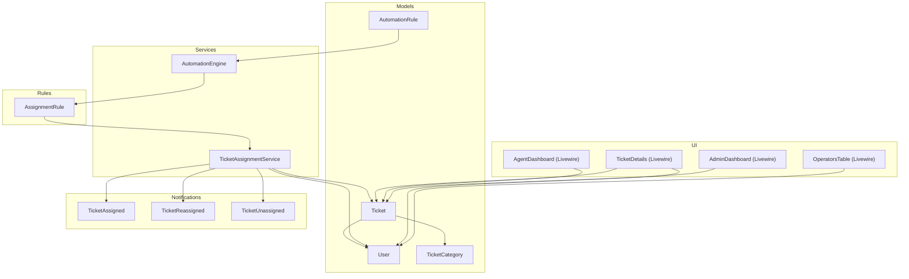
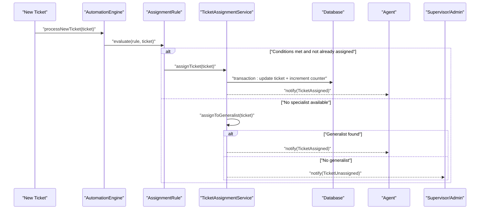
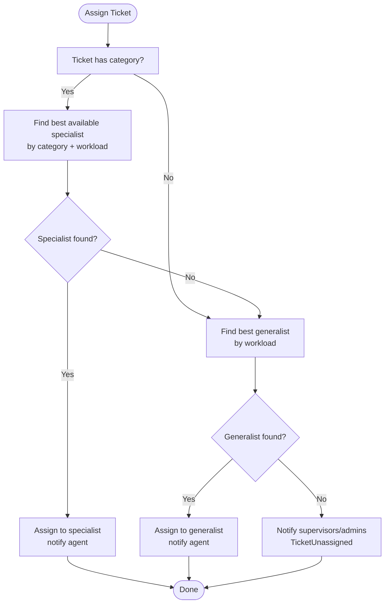
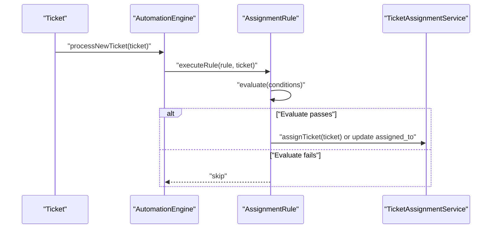
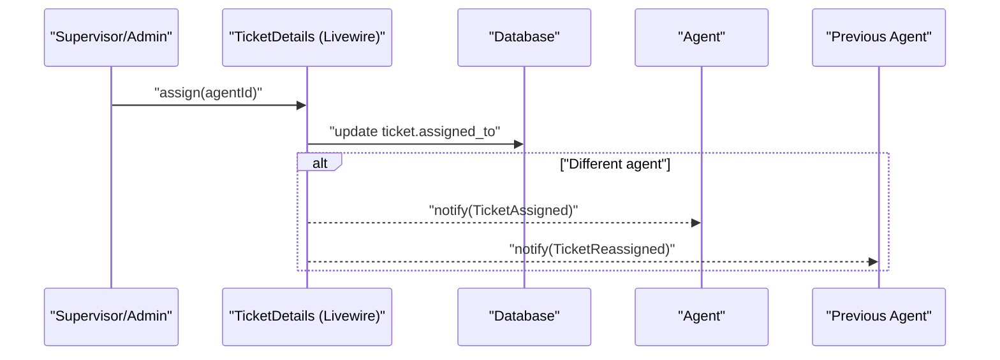
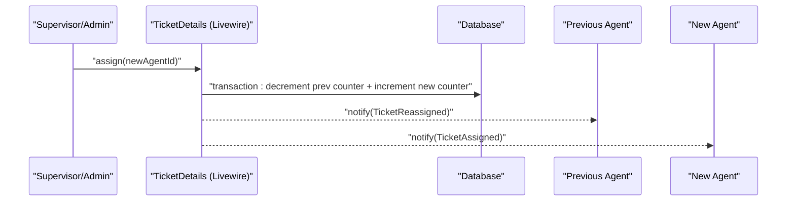
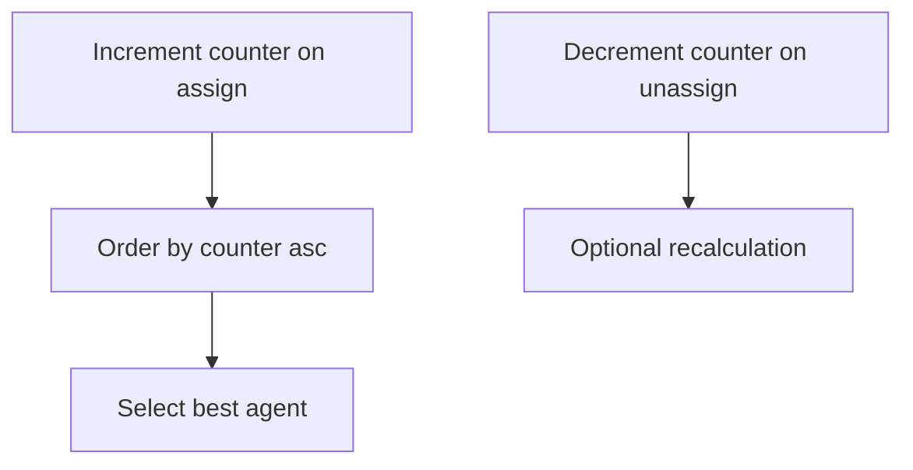
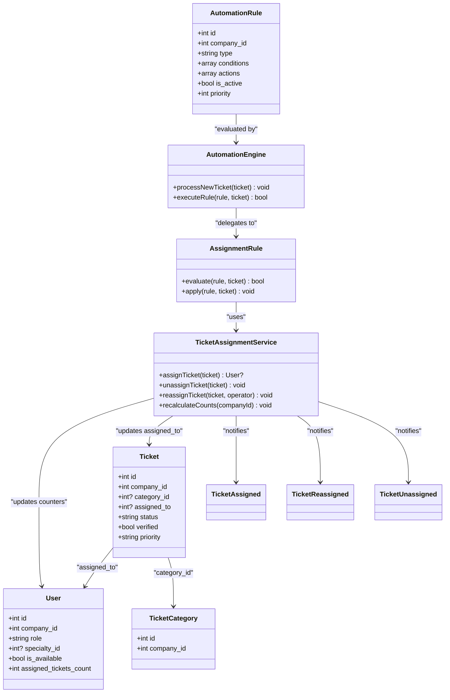

# Assignment & Routing Workflows

<cite>
**Referenced Files in This Document**
- [TicketAssignmentService.php](file://app/Services/TicketAssignmentService.php)
- [AutomationEngine.php](file://app/Services/Automation/AutomationEngine.php)
- [AssignmentRule.php](file://app/Services/Automation/Rules/AssignmentRule.php)
- [Ticket.php](file://app/Models/Ticket.php)
- [User.php](file://app/Models/User.php)
- [TicketCategory.php](file://app/Models/TicketCategory.php)
- [AutomationRule.php](file://app/Models/AutomationRule.php)
- [TicketAssigned.php](file://app/Notifications/TicketAssigned.php)
- [TicketReassigned.php](file://app/Notifications/TicketReassigned.php)
- [TicketUnassigned.php](file://app/Notifications/TicketUnassigned.php)
- [TicketDetails.php](file://app/Livewire/Dashboard/TicketDetails.php)
- [AgentDashboard.php](file://app/Livewire/Dashboard/AgentDashboard.php)
- [AdminDashboard.php](file://app/Livewire/Dashboard/AdminDashboard.php)
- [OperatorsTable.php](file://app/Livewire/Dashboard/OperatorsTable.php)
- [TicketsController.php](file://app/Http/Controllers/TicketsController.php)
</cite>

## Table of Contents
1. [Introduction](#introduction)
2. [Project Structure](#project-structure)
3. [Core Components](#core-components)
4. [Architecture Overview](#architecture-overview)
5. [Detailed Component Analysis](#detailed-component-analysis)
6. [Dependency Analysis](#dependency-analysis)
7. [Performance Considerations](#performance-considerations)
8. [Troubleshooting Guide](#troubleshooting-guide)
9. [Conclusion](#conclusion)

## Introduction
This document explains the ticket assignment and routing workflows in the helpdesk system. It covers automatic assignment based on category specialization, agent availability, and workload balancing, along with manual assignment interfaces for supervisors and administrators. It also documents the assignment notification system, real-time updates, reassignment procedures, transfer reasons, approval workflows, agent capacity management, load balancing, automation engine integration for rule-based decisions, and fallback strategies for unavailable agents.

## Project Structure
The assignment and routing logic spans several services, models, notifications, Livewire components, and controllers:
- Automatic assignment and reassignment logic resides in a dedicated service.
- Automation rules integrate with the automation engine to enforce policy-driven assignments.
- Notifications handle real-time updates to agents and supervisors.
- Livewire dashboards provide manual assignment interfaces for supervisors and agents.
- Models define the domain entities and their relationships.

**Diagram sources**
- [Ticket.php:14-29](file://app/Models/Ticket.php#L14-L29)
- [User.php:17-43](file://app/Models/User.php#L17-L43)
- [TicketCategory.php:12-13](file://app/Models/TicketCategory.php#L12-L13)
- [AutomationEngine.php:15-25](file://app/Services/Automation/AutomationEngine.php#L15-L25)
- [AssignmentRule.php:9-13](file://app/Services/Automation/Rules/AssignmentRule.php#L9-L13)
- [TicketAssignmentService.php:12-39](file://app/Services/TicketAssignmentService.php#L12-L39)
- [TicketAssigned.php:9-31](file://app/Notifications/TicketAssigned.php#L9-L31)
- [TicketReassigned.php:9-31](file://app/Notifications/TicketReassigned.php#L9-L31)
- [TicketUnassigned.php:9-31](file://app/Notifications/TicketUnassigned.php#L9-L31)
- [TicketDetails.php:145-174](file://app/Livewire/Dashboard/TicketDetails.php#L145-L174)
- [AgentDashboard.php:115-135](file://app/Livewire/Dashboard/AgentDashboard.php#L115-L135)
- [AdminDashboard.php:31-36](file://app/Livewire/Dashboard/AdminDashboard.php#L31-L36)
- [OperatorsTable.php:148-183](file://app/Livewire/Dashboard/OperatorsTable.php#L148-L183)

**Section sources**
- [TicketAssignmentService.php:12-179](file://app/Services/TicketAssignmentService.php#L12-L179)
- [AutomationEngine.php:15-142](file://app/Services/Automation/AutomationEngine.php#L15-L142)
- [AssignmentRule.php:9-67](file://app/Services/Automation/Rules/AssignmentRule.php#L9-L67)
- [Ticket.php:14-63](file://app/Models/Ticket.php#L14-L63)
- [User.php:17-137](file://app/Models/User.php#L17-L137)
- [TicketCategory.php:12-13](file://app/Models/TicketCategory.php#L12-L13)
- [AutomationRule.php:27-116](file://app/Models/AutomationRule.php#L27-L116)
- [TicketAssigned.php:9-49](file://app/Notifications/TicketAssigned.php#L9-L49)
- [TicketReassigned.php:9-49](file://app/Notifications/TicketReassigned.php#L9-L49)
- [TicketUnassigned.php:9-49](file://app/Notifications/TicketUnassigned.php#L9-L49)
- [TicketDetails.php:145-174](file://app/Livewire/Dashboard/TicketDetails.php#L145-L174)
- [AgentDashboard.php:115-135](file://app/Livewire/Dashboard/AgentDashboard.php#L115-L135)
- [AdminDashboard.php:31-36](file://app/Livewire/Dashboard/AdminDashboard.php#L31-L36)
- [OperatorsTable.php:148-183](file://app/Livewire/Dashboard/OperatorsTable.php#L148-L183)

## Core Components
- TicketAssignmentService: Implements automatic assignment, fallback to generalists, reassignment, unassignment, and counter recalculation.
- AutomationEngine: Orchestrates automation rules and delegates assignment decisions to AssignmentRule.
- AssignmentRule: Evaluates conditions (category, priority, verification) and applies actions (default assignment or specific operator).
- Ticket, User, TicketCategory: Domain models with scopes and relationships supporting assignment logic.
- Notifications: Real-time and broadcast notifications for assignment, reassignment, and unassignment events.
- Livewire Dashboards: Provide manual assignment interfaces for supervisors and agents, and visibility into unassigned tickets.

**Section sources**
- [TicketAssignmentService.php:22-108](file://app/Services/TicketAssignmentService.php#L22-L108)
- [AutomationEngine.php:30-96](file://app/Services/Automation/AutomationEngine.php#L30-L96)
- [AssignmentRule.php:15-65](file://app/Services/Automation/Rules/AssignmentRule.php#L15-L65)
- [Ticket.php:16-29](file://app/Models/Ticket.php#L16-L29)
- [User.php:102-121](file://app/Models/User.php#L102-L121)
- [TicketAssigned.php:28-47](file://app/Notifications/TicketAssigned.php#L28-L47)
- [TicketReassigned.php:28-47](file://app/Notifications/TicketReassigned.php#L28-L47)
- [TicketUnassigned.php:28-47](file://app/Notifications/TicketUnassigned.php#L28-L47)
- [TicketDetails.php:145-174](file://app/Livewire/Dashboard/TicketDetails.php#L145-L174)
- [AgentDashboard.php:115-135](file://app/Livewire/Dashboard/AgentDashboard.php#L115-L135)

## Architecture Overview
Automatic assignment follows a tiered algorithm prioritizing specialists, then generalists, and finally notifying supervisors when no agents are available. Manual assignment is supported through supervisor/admin dashboards and agent self-assignment.

**Diagram sources**
- [AutomationEngine.php:30-41](file://app/Services/Automation/AutomationEngine.php#L30-L41)
- [AssignmentRule.php:15-65](file://app/Services/Automation/Rules/AssignmentRule.php#L15-L65)
- [TicketAssignmentService.php:22-94](file://app/Services/TicketAssignmentService.php#L22-L94)
- [TicketAssigned.php:28-47](file://app/Notifications/TicketAssigned.php#L28-L47)
- [TicketUnassigned.php:28-47](file://app/Notifications/TicketUnassigned.php#L28-L47)

## Detailed Component Analysis

### Automatic Assignment Algorithm
The system assigns tickets using a deterministic, priority-based algorithm:
- If the ticket lacks a category, it falls back to generalist assignment.
- Otherwise, it selects the best available specialist matching the ticket’s category with the lowest current workload.
- If no specialist is available, it tries a generalist (operator without specialty).
- If still unavailable, it notifies supervisors/administrators that manual intervention is required.

**Diagram sources**
- [TicketAssignmentService.php:22-94](file://app/Services/TicketAssignmentService.php#L22-L94)
- [User.php:102-121](file://app/Models/User.php#L102-L121)
- [TicketAssigned.php:28-47](file://app/Notifications/TicketAssigned.php#L28-L47)
- [TicketUnassigned.php:28-47](file://app/Notifications/TicketUnassigned.php#L28-L47)

**Section sources**
- [TicketAssignmentService.php:22-94](file://app/Services/TicketAssignmentService.php#L22-L94)
- [User.php:102-121](file://app/Models/User.php#L102-L121)

### Automation Engine Integration
Automation rules are evaluated during ticket creation. Assignment rules check:
- Unassigned state
- Verified status
- Category and priority conditions
Actions include:
- Default assignment via the assignment service
- Direct assignment to a specific operator ID

**Diagram sources**
- [AutomationEngine.php:30-96](file://app/Services/Automation/AutomationEngine.php#L30-L96)
- [AssignmentRule.php:15-65](file://app/Services/Automation/Rules/AssignmentRule.php#L15-L65)
- [TicketAssignmentService.php:22-58](file://app/Services/TicketAssignmentService.php#L22-L58)

**Section sources**
- [AutomationEngine.php:30-96](file://app/Services/Automation/AutomationEngine.php#L30-L96)
- [AssignmentRule.php:15-65](file://app/Services/Automation/Rules/AssignmentRule.php#L15-L65)
- [AutomationRule.php:27-116](file://app/Models/AutomationRule.php#L27-L116)

### Manual Assignment Interfaces
Supervisors and administrators can manually assign tickets:
- From the ticket details page, supervisors can assign to any operator in the company.
- Agents can self-assign open, unassigned tickets.
- Supervisors can view unassigned tickets and take action.

**Diagram sources**
- [TicketDetails.php:145-174](file://app/Livewire/Dashboard/TicketDetails.php#L145-L174)
- [TicketAssigned.php:28-47](file://app/Notifications/TicketAssigned.php#L28-L47)
- [TicketReassigned.php:28-47](file://app/Notifications/TicketReassigned.php#L28-L47)

Additional manual assignment pathways:
- Agent self-assignment from AgentDashboard.
- Visibility of unassigned tickets for supervisors.

**Section sources**
- [TicketDetails.php:145-174](file://app/Livewire/Dashboard/TicketDetails.php#L145-L174)
- [AgentDashboard.php:115-135](file://app/Livewire/Dashboard/AgentDashboard.php#L115-L135)
- [AdminDashboard.php:31-36](file://app/Livewire/Dashboard/AdminDashboard.php#L31-L36)

### Assignment Notifications and Real-Time Updates
Notifications are queued for database and broadcast channels:
- TicketAssigned: Sent to the newly assigned agent.
- TicketReassigned: Sent to the previous agent when reassigned.
- TicketUnassigned: Sent to supervisors/admins when auto-assignment fails.

These notifications enable real-time updates in the UI and can be integrated with live dashboards.

**Section sources**
- [TicketAssigned.php:28-47](file://app/Notifications/TicketAssigned.php#L28-L47)
- [TicketReassigned.php:28-47](file://app/Notifications/TicketReassigned.php#L28-L47)
- [TicketUnassigned.php:28-47](file://app/Notifications/TicketUnassigned.php#L28-L47)

### Reassignment Process, Transfer Reasons, and Approval Workflows
- Reassignment decrements the previous agent’s counter and increments the new agent’s counter atomically.
- Previous agent receives a reassignment notification; new agent receives an assignment notification.
- Transfer reasons are not modeled in code; supervisors can add internal notes or status/priority changes to document rationale.
- Approval workflows are not implemented; supervisors can directly reassign tickets.

**Diagram sources**
- [TicketAssignmentService.php:134-160](file://app/Services/TicketAssignmentService.php#L134-L160)
- [TicketDetails.php:145-174](file://app/Livewire/Dashboard/TicketDetails.php#L145-L174)
- [TicketReassigned.php:28-47](file://app/Notifications/TicketReassigned.php#L28-L47)
- [TicketAssigned.php:28-47](file://app/Notifications/TicketAssigned.php#L28-L47)

**Section sources**
- [TicketAssignmentService.php:134-160](file://app/Services/TicketAssignmentService.php#L134-L160)
- [TicketDetails.php:145-174](file://app/Livewire/Dashboard/TicketDetails.php#L145-L174)

### Agent Capacity Management and Load Balancing
- Agents maintain an assigned_tickets_count that is incremented upon successful assignment and decremented upon unassignment.
- Assignment queries order agents by assigned_tickets_count ascending to balance workload.
- A recalculation method syncs counters after data changes.

**Diagram sources**
- [TicketAssignmentService.php:99-108](file://app/Services/TicketAssignmentService.php#L99-L108)
- [TicketAssignmentService.php:113-129](file://app/Services/TicketAssignmentService.php#L113-L129)
- [TicketAssignmentService.php:166-177](file://app/Services/TicketAssignmentService.php#L166-L177)
- [User.php:102-121](file://app/Models/User.php#L102-L121)

**Section sources**
- [TicketAssignmentService.php:99-177](file://app/Services/TicketAssignmentService.php#L99-L177)
- [User.php:102-121](file://app/Models/User.php#L102-L121)

### Fallback Assignment Strategies for Unavailable Agents
- If no specialists are available, the system attempts generalist assignment.
- If no generalists are available, supervisors receive a TicketUnassigned notification prompting manual assignment.

**Section sources**
- [TicketAssignmentService.php:58-94](file://app/Services/TicketAssignmentService.php#L58-L94)
- [TicketUnassigned.php:28-47](file://app/Notifications/TicketUnassigned.php#L28-L47)

## Dependency Analysis
The following diagram highlights key dependencies among components involved in assignment and routing.

**Diagram sources**
- [Ticket.php:14-29](file://app/Models/Ticket.php#L14-L29)
- [User.php:17-43](file://app/Models/User.php#L17-L43)
- [TicketCategory.php:12-13](file://app/Models/TicketCategory.php#L12-L13)
- [AutomationRule.php:27-116](file://app/Models/AutomationRule.php#L27-L116)
- [TicketAssignmentService.php:22-177](file://app/Services/TicketAssignmentService.php#L22-L177)
- [AutomationEngine.php:30-96](file://app/Services/Automation/AutomationEngine.php#L30-L96)
- [AssignmentRule.php:15-65](file://app/Services/Automation/Rules/AssignmentRule.php#L15-L65)
- [TicketAssigned.php:9-49](file://app/Notifications/TicketAssigned.php#L9-L49)
- [TicketReassigned.php:9-49](file://app/Notifications/TicketReassigned.php#L9-L49)
- [TicketUnassigned.php:9-49](file://app/Notifications/TicketUnassigned.php#L9-L49)

**Section sources**
- [Ticket.php:14-63](file://app/Models/Ticket.php#L14-L63)
- [User.php:17-137](file://app/Models/User.php#L17-L137)
- [AutomationRule.php:27-116](file://app/Models/AutomationRule.php#L27-L116)
- [TicketAssignmentService.php:22-177](file://app/Services/TicketAssignmentService.php#L22-L177)
- [AutomationEngine.php:30-96](file://app/Services/Automation/AutomationEngine.php#L30-L96)
- [AssignmentRule.php:15-65](file://app/Services/Automation/Rules/AssignmentRule.php#L15-L65)

## Performance Considerations
- Use of orderBy with assigned_tickets_count ensures O(n log n) selection per query; consider indexing the counter field for scalability.
- Transactional updates guarantee atomicity but can increase contention under high concurrency; monitor lock waits.
- Caching invalidation occurs on user updates/deletes to keep agent lists fresh; ensure cache TTL aligns with real-time needs.
- Pagination in operator and ticket listings prevents heavy queries on large datasets.

[No sources needed since this section provides general guidance]

## Troubleshooting Guide
Common issues and resolutions:
- Auto-assignment did not occur:
  - Verify the ticket has a category or ensure generalist fallback is acceptable.
  - Confirm agents are available and have assigned_tickets_count populated.
  - Check automation rules for conditions that prevent assignment.
- No agents available:
  - Supervisors receive TicketUnassigned notifications; review staffing or availability settings.
- Reassignment anomalies:
  - Ensure transaction boundaries are respected; verify counters are decremented/incremented.
  - Confirm previous agent receives TicketReassigned notification.
- Manual assignment errors:
  - Validate agent exists and belongs to the same company.
  - Ensure the ticket is unassigned or the intended agent is different from the current assignee.

**Section sources**
- [TicketAssignmentService.php:84-94](file://app/Services/TicketAssignmentService.php#L84-L94)
- [TicketUnassigned.php:28-47](file://app/Notifications/TicketUnassigned.php#L28-L47)
- [TicketAssignmentService.php:134-160](file://app/Services/TicketAssignmentService.php#L134-L160)
- [TicketReassigned.php:28-47](file://app/Notifications/TicketReassigned.php#L28-L47)
- [TicketDetails.php:145-174](file://app/Livewire/Dashboard/TicketDetails.php#L145-L174)

## Conclusion
The assignment and routing system combines deterministic algorithms, automation rules, and manual controls to ensure efficient ticket distribution. Specialization-first assignment, availability checks, and workload balancing are enforced automatically, while supervisors and administrators retain full control for manual interventions. Notifications and dashboards provide real-time visibility, and robust transactional updates maintain data consistency.