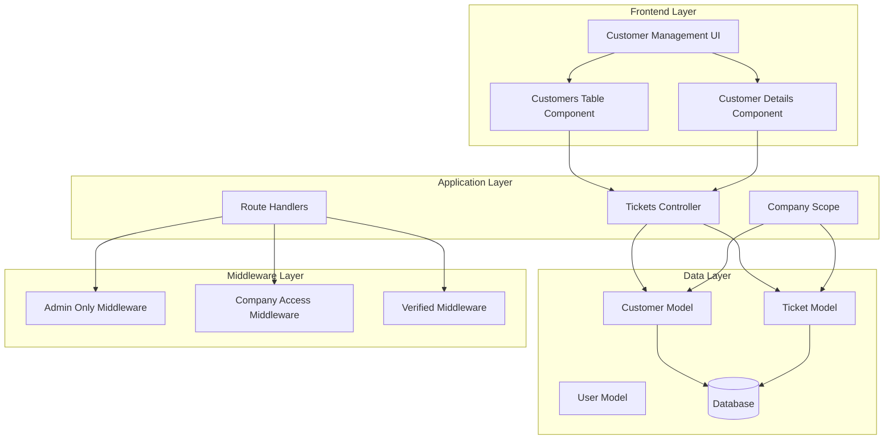
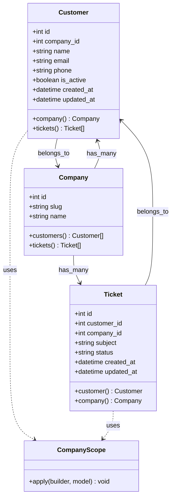
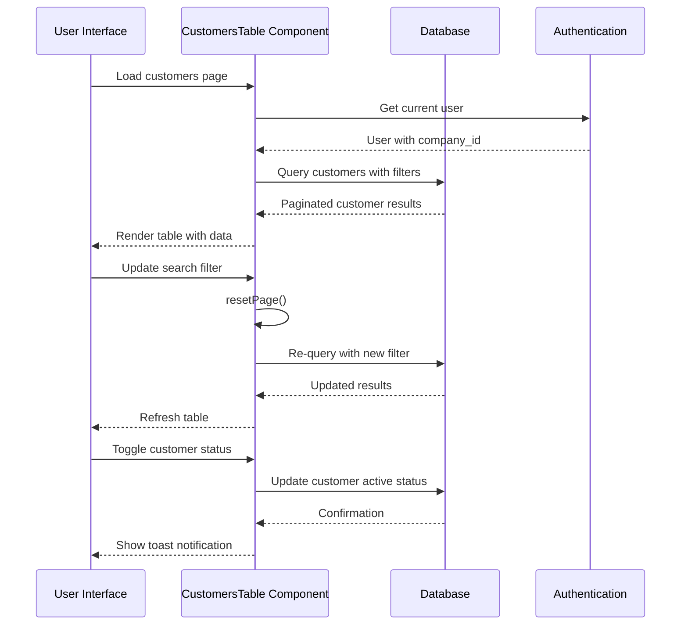
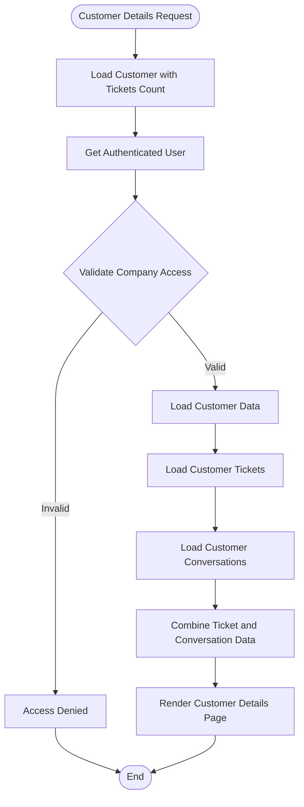
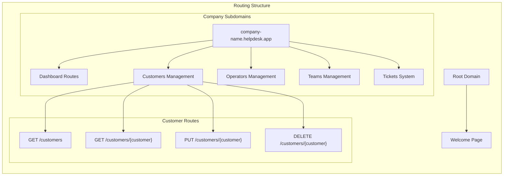
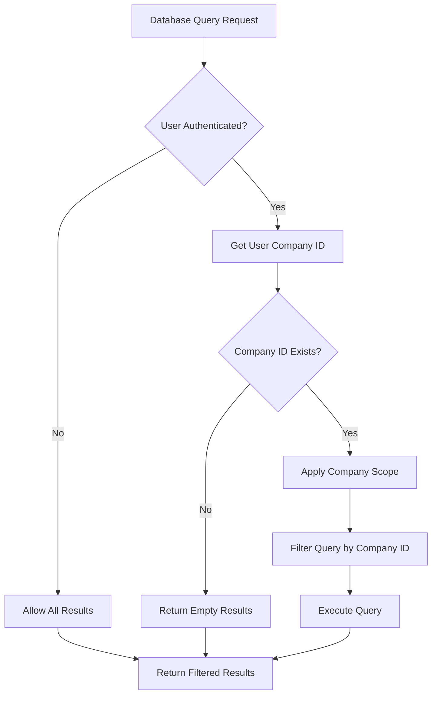

# Customer Management System

<cite>
**Referenced Files in This Document**
- [composer.json](file://composer.json)
- [routes/web.php](file://routes/web.php)
- [app/Models/Customer.php](file://app/Models/Customer.php)
- [app/Models/Ticket.php](file://app/Models/Ticket.php)
- [app/Models/Company.php](file://app/Models/Company.php)
- [app/Scopes/CompanyScope.php](file://app/Scopes/CompanyScope.php)
- [app/Http/Controllers/TicketsController.php](file://app/Http/Controllers/TicketsController.php)
- [app/Livewire/Tickets/CustomersTable.php](file://app/Livewire/Tickets/CustomersTable.php)
- [app/Livewire/Tickets/CustomerDetails.php](file://app/Livewire/Tickets/CustomerDetails.php)
- [resources/views/app/customers.blade.php](file://resources/views/app/customers.blade.php)
- [resources/views/app/customer-details-page.blade.php](file://resources/views/app/customer-details-page.blade.php)
- [resources/views/livewire/tickets/customers-table.blade.php](file://resources/views/livewire/tickets/customers-table.blade.php)
- [resources/views/livewire/tickets/customer-details.blade.php](file://resources/views/livewire/tickets/customer-details.blade.php)
</cite>

## Table of Contents
1. [Introduction](#introduction)
2. [System Architecture](#system-architecture)
3. [Customer Model and Data Layer](#customer-model-and-data-layer)
4. [Livewire Components](#livewire-components)
5. [Routing and Navigation](#routing-and-navigation)
6. [Company Isolation Mechanism](#company-isolation-mechanism)
7. [Customer Management Features](#customer-management-features)
8. [UI Components and User Experience](#ui-components-and-user-experience)
9. [Performance Considerations](#performance-considerations)
10. [Security Implementation](#security-implementation)
11. [Troubleshooting Guide](#troubleshooting-guide)
12. [Conclusion](#conclusion)

## Introduction

The Customer Management System is a comprehensive module within a helpdesk platform built with Laravel and Livewire. This system provides administrators and support agents with tools to manage customer relationships, track customer interactions through tickets, and maintain customer profiles within a multi-tenant architecture. The system emphasizes real-time updates, filtering capabilities, and seamless integration with the broader helpdesk ecosystem.

The platform supports multiple companies (tenants) with automatic data isolation, allowing each company to maintain separate customer databases while sharing common infrastructure. The customer management interface provides both administrative oversight and detailed customer analytics through integrated ticket tracking and conversation history.

## System Architecture

The Customer Management System follows a modern Laravel architecture with Livewire for reactive front-end components. The system is designed around a multi-tenant model where each company operates independently with isolated data.

**Diagram sources**
- [routes/web.php:143-160](file://routes/web.php#L143-L160)
- [app/Models/Customer.php:11-42](file://app/Models/Customer.php#L11-L42)
- [app/Models/Ticket.php:12-121](file://app/Models/Ticket.php#L12-L121)

**Section sources**
- [composer.json:11-25](file://composer.json#L11-L25)
- [routes/web.php:98-200](file://routes/web.php#L98-L200)

## Customer Model and Data Layer

The Customer model serves as the central entity for customer management within the system. It implements company-based data isolation through global scopes and maintains relationships with tickets and companies.

**Diagram sources**
- [app/Models/Customer.php:11-42](file://app/Models/Customer.php#L11-L42)
- [app/Models/Ticket.php:12-121](file://app/Models/Ticket.php#L12-L121)
- [app/Models/Company.php:8-97](file://app/Models/Company.php#L8-L97)
- [app/Scopes/CompanyScope.php:10-30](file://app/Scopes/CompanyScope.php#L10-L30)

The Customer model implements several key features:

- **Company Isolation**: Automatic filtering of customer records based on the authenticated user's company
- **Fillable Attributes**: Controlled mass assignment with essential customer information fields
- **Boolean Casting**: Proper handling of active status field
- **Relationship Definitions**: Clear associations with Company and Ticket models

**Section sources**
- [app/Models/Customer.php:15-41](file://app/Models/Customer.php#L15-L41)
- [app/Scopes/CompanyScope.php:15-28](file://app/Scopes/CompanyScope.php#L15-L28)

## Livewire Components

The system utilizes Livewire components to provide real-time, interactive customer management functionality without traditional page reloads.

### CustomersTable Component

The CustomersTable component provides a comprehensive interface for managing customer records with advanced filtering, sorting, and pagination capabilities.

**Diagram sources**
- [app/Livewire/Tickets/CustomersTable.php:50-93](file://app/Livewire/Tickets/CustomersTable.php#L50-L93)

### CustomerDetails Component

The CustomerDetails component provides detailed insights into individual customer interactions, combining ticket history with conversation data.

**Diagram sources**
- [app/Livewire/Tickets/CustomerDetails.php:18-66](file://app/Livewire/Tickets/CustomerDetails.php#L18-L66)

**Section sources**
- [app/Livewire/Tickets/CustomersTable.php:11-93](file://app/Livewire/Tickets/CustomersTable.php#L11-L93)
- [app/Livewire/Tickets/CustomerDetails.php:12-66](file://app/Livewire/Tickets/CustomerDetails.php#L12-L66)

## Routing and Navigation

The routing system implements subdomain-based multi-tenancy, allowing each company to have its own namespace within the application.

**Diagram sources**
- [routes/web.php:98-200](file://routes/web.php#L98-L200)
- [routes/web.php:143-160](file://routes/web.php#L143-L160)

The routing implementation includes:

- **Subdomain-based Multi-tenancy**: `{company}.{domain}` pattern for company isolation
- **Route Model Binding**: Automatic resolution of customer IDs to customer records
- **Middleware Chain**: Comprehensive security and access control
- **Named Routes**: Consistent URL generation throughout the application

**Section sources**
- [routes/web.php:143-160](file://routes/web.php#L143-L160)
- [routes/web.php:98-200](file://routes/web.php#L98-L200)

## Company Isolation Mechanism

The system implements automatic data isolation through global scopes, ensuring that users can only access data belonging to their company.

**Diagram sources**
- [app/Scopes/CompanyScope.php:15-28](file://app/Scopes/CompanyScope.php#L15-L28)

The CompanyScope implementation ensures:

- **Automatic Application**: Applied to all queries for Customer and Ticket models
- **Context Awareness**: Respects authentication state and user company membership
- **Transparent Operation**: Developers don't need to manually filter by company
- **Consistent Behavior**: Same isolation mechanism across all related models

**Section sources**
- [app/Scopes/CompanyScope.php:10-30](file://app/Scopes/CompanyScope.php#L10-L30)
- [app/Models/Customer.php:15-18](file://app/Models/Customer.php#L15-L18)
- [app/Models/Ticket.php:19-22](file://app/Models/Ticket.php#L19-L22)

## Customer Management Features

The system provides comprehensive customer management capabilities through specialized UI components and backend services.

### Advanced Filtering and Search

The customer management interface supports sophisticated filtering mechanisms:

- **Multi-field Search**: Search across name, email, and phone fields simultaneously
- **Status Filtering**: Filter by active/deactivated customer status
- **Real-time Updates**: Live search with debounced input processing
- **Filter Persistence**: Active filters clearly displayed for user awareness

### Interactive Status Management

Customers can be activated or deactivated with immediate visual feedback:

- **Toggle Functionality**: One-click activation/deactivation
- **Confirmation Dialogs**: Prevent accidental status changes
- **Visual Indicators**: Color-coded status badges
- **Toast Notifications**: Immediate feedback on status changes

### Detailed Customer Analytics

The customer details view provides comprehensive insights:

- **Ticket History**: Complete record of customer interactions
- **Conversation Tracking**: Public replies and agent responses
- **Activity Timeline**: Chronological view of customer engagement
- **Statistics Display**: Ticket counts and response metrics

**Section sources**
- [app/Livewire/Tickets/CustomersTable.php:23-86](file://app/Livewire/Tickets/CustomersTable.php#L23-L86)
- [app/Livewire/Tickets/CustomerDetails.php:30-59](file://app/Livewire/Tickets/CustomerDetails.php#L30-L59)

## UI Components and User Experience

The customer management interface leverages modern web design principles with responsive layouts and intuitive interactions.

### Responsive Design Architecture

The system employs a mobile-first approach with adaptive layouts:

- **Grid-based Layouts**: Responsive grid systems for optimal screen utilization
- **Touch-friendly Interactions**: Appropriate sizing for mobile device interaction
- **Progressive Enhancement**: Core functionality available across all devices
- **Accessibility Compliance**: Semantic HTML and proper ARIA attributes

### Real-time Component Updates

Livewire enables seamless real-time updates without page refreshes:

- **Live Model Binding**: Immediate synchronization between UI and data
- **Debounced Input**: Optimized search performance with input throttling
- **Loading States**: Visual feedback during data operations
- **Error Handling**: Graceful degradation with user-friendly error messages

### Visual Feedback Systems

The interface provides comprehensive user feedback:

- **Toast Notifications**: Non-intrusive status updates
- **Color-coded Status**: Immediate visual indication of customer state
- **Interactive Elements**: Hover states and focus indicators
- **Empty State Handling**: Helpful messaging for empty datasets

**Section sources**
- [resources/views/livewire/tickets/customers-table.blade.php:1-214](file://resources/views/livewire/tickets/customers-table.blade.php#L1-L214)
- [resources/views/livewire/tickets/customer-details.blade.php:19-93](file://resources/views/livewire/tickets/customer-details.blade.php#L19-L93)

## Performance Considerations

The system implements several performance optimization strategies:

### Database Optimization

- **Eager Loading**: Strategic use of `with()` clauses to prevent N+1 query problems
- **Indexing Strategy**: Appropriate database indexing for frequently queried fields
- **Pagination Implementation**: Efficient handling of large customer datasets
- **Query Optimization**: Minimized database round trips through batch operations

### Frontend Performance

- **Component Caching**: Livewire's built-in caching mechanisms
- **Lazy Loading**: Deferred loading of non-critical UI elements
- **Optimized Rendering**: Minimal DOM updates through targeted component refreshes
- **Asset Optimization**: Efficient asset delivery and caching strategies

### Memory Management

- **Resource Cleanup**: Proper disposal of database connections and file handles
- **Session Management**: Efficient user session handling across multiple requests
- **Storage Optimization**: Appropriate file storage and cleanup procedures

## Security Implementation

The system implements comprehensive security measures at multiple layers:

### Multi-factor Authentication

- **Role-based Access Control**: Distinct permissions for admin and operator roles
- **Company Isolation**: Automatic enforcement of data boundaries between companies
- **Route Protection**: Middleware layers preventing unauthorized access
- **CSRF Protection**: Built-in Laravel CSRF protection for all state-changing operations

### Data Validation and Sanitization

- **Input Validation**: Comprehensive validation for all user inputs
- **Output Encoding**: Prevention of XSS attacks through proper output encoding
- **File Upload Security**: Secure handling of customer-related file uploads
- **Audit Logging**: Comprehensive logging of sensitive operations

### Network Security

- **HTTPS Enforcement**: Secure communication for all customer data
- **Rate Limiting**: Protection against brute force attacks and abuse
- **Content Security Policy**: Prevention of various injection attacks
- **Security Headers**: Comprehensive HTTP security header implementation

**Section sources**
- [routes/web.php:117-199](file://routes/web.php#L117-L199)
- [app/Scopes/CompanyScope.php:17-27](file://app/Scopes/CompanyScope.php#L17-L27)

## Troubleshooting Guide

### Common Issues and Solutions

**Customer Data Not Loading**
- Verify user authentication and company membership
- Check database connectivity and customer records availability
- Ensure proper middleware chain execution

**Search Functionality Problems**
- Confirm database indexing on searchable fields
- Verify search parameter handling and escaping
- Check for special characters in search queries

**Performance Issues**
- Monitor database query execution times
- Review pagination limits and eager loading strategies
- Check server resource utilization and memory consumption

**Permission Denied Errors**
- Verify user role assignments and permissions
- Check company membership and access controls
- Review middleware configuration and execution order

### Debugging Tools and Techniques

The system provides several debugging capabilities:

- **Query Logging**: Database query inspection and analysis
- **Component Debugging**: Livewire component state inspection
- **Performance Profiling**: Application performance monitoring
- **Error Logging**: Comprehensive error tracking and reporting

## Conclusion

The Customer Management System represents a robust, scalable solution for multi-tenant customer relationship management within a helpdesk environment. The system successfully combines modern Laravel development practices with Livewire's reactive capabilities to deliver a responsive, secure, and efficient customer management experience.

Key strengths of the implementation include:

- **Multi-tenant Architecture**: Seamless isolation between companies with transparent data handling
- **Real-time Interactions**: Livewire-powered components providing instant feedback and updates
- **Comprehensive Features**: Full-featured customer management with advanced filtering and analytics
- **Security Focus**: Multi-layered security implementation protecting customer data and system integrity
- **Performance Optimization**: Careful consideration of database queries, caching, and frontend optimization

The system's modular design allows for easy extension and customization while maintaining consistency with the broader helpdesk platform. The combination of automated company scoping, comprehensive filtering capabilities, and intuitive user interfaces positions this system as a solid foundation for customer relationship management in enterprise environments.

Future enhancements could include advanced customer segmentation, automated customer lifecycle management, integration with external CRM systems, and expanded analytics capabilities to further enhance customer insights and operational efficiency.