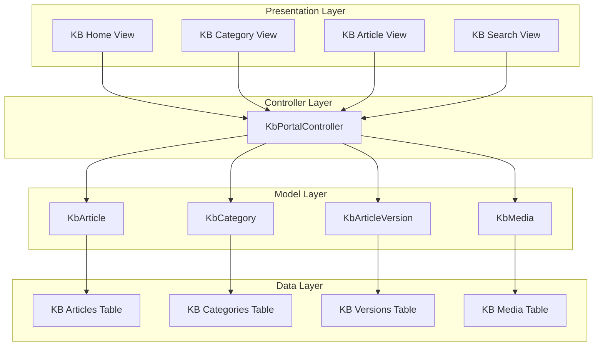
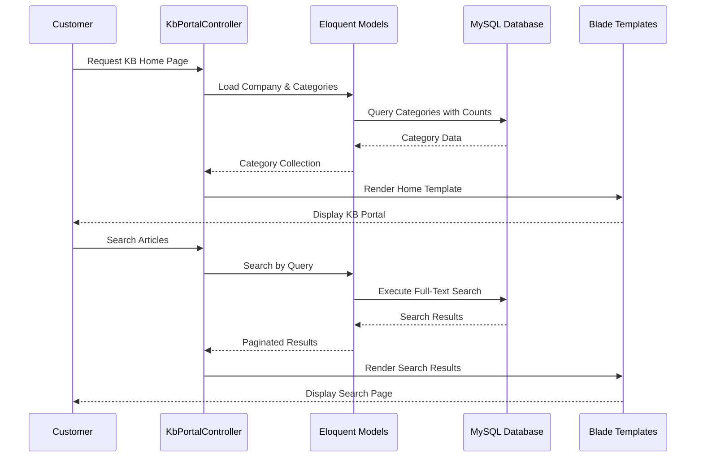
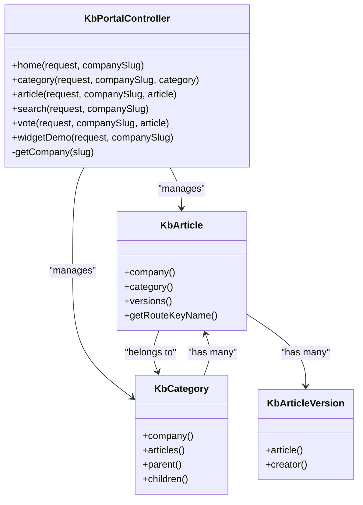
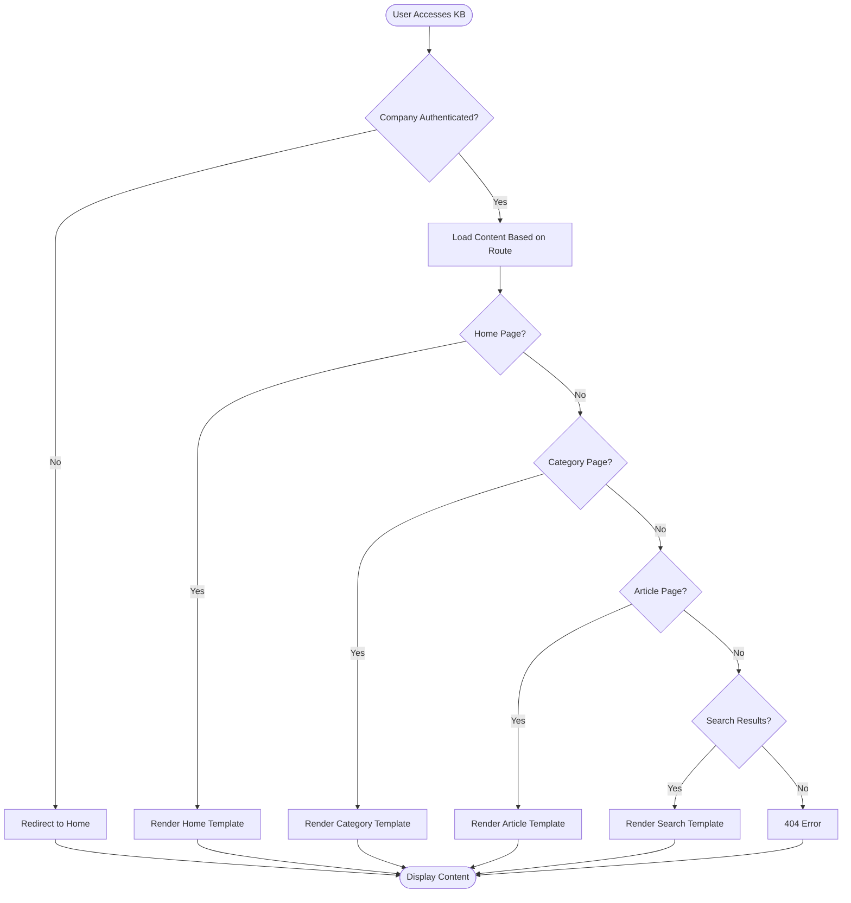
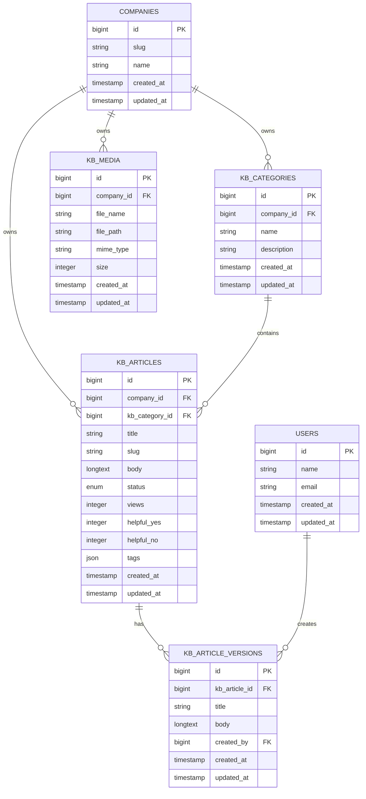

# Knowledge Base System

<cite>
**Referenced Files in This Document**
- [KbArticle.php](file://app/Models/KbArticle.php)
- [KbCategory.php](file://app/Models/KbCategory.php)
- [KbArticleVersion.php](file://app/Models/KbArticleVersion.php)
- [KbMedia.php](file://app/Models/KbMedia.php)
- [KbPortalController.php](file://app/Http/Controllers/KbPortalController.php)
- [2026_03_12_011046_create_kb_categories_table.php](file://database/migrations/2026_03_12_011046_create_kb_categories_table.php)
- [2026_03_12_011050_create_kb_articles_table.php](file://database/migrations/2026_03_12_011050_create_kb_articles_table.php)
- [2026_03_12_020000_add_tags_to_kb_articles_table.php](file://database/migrations/2026_03_12_020000_add_tags_to_kb_articles_table.php)
- [2026_03_12_133427_create_kb_article_versions_table.php](file://database/migrations/2026_03_12_133427_create_kb_article_versions_table.php)
- [2026_03_12_133429_create_kb_media_table.php](file://database/migrations/2026_03_12_133429_create_kb_media_table.php)
- [home.blade.php](file://resources/views/kb/home.blade.php)
- [category.blade.php](file://resources/views/kb/category.blade.php)
- [article.blade.php](file://resources/views/kb/article.blade.php)
- [search.blade.php](file://resources/views/kb/search.blade.php)
</cite>

## Table of Contents
1. [Introduction](#introduction)
2. [Project Structure](#project-structure)
3. [Core Components](#core-components)
4. [Architecture Overview](#architecture-overview)
5. [Detailed Component Analysis](#detailed-component-analysis)
6. [Database Schema](#database-schema)
7. [Frontend Implementation](#frontend-implementation)
8. [API Endpoints](#api-endpoints)
9. [Performance Considerations](#performance-considerations)
10. [Troubleshooting Guide](#troubleshooting-guide)
11. [Conclusion](#conclusion)

## Introduction

The Knowledge Base System is a comprehensive customer self-service solution integrated into the Helpdesk System. It provides companies with a structured way to organize, publish, and manage informational content that customers can search and browse to resolve common issues independently. The system supports hierarchical categorization, article versioning, media management, and interactive features like voting and popularity tracking.

The knowledge base serves as a primary support channel, reducing the burden on human agents by enabling customers to find solutions quickly through a well-organized searchable interface. It includes features for article popularity measurement, user feedback collection, and seamless integration with the broader helpdesk ecosystem.

## Project Structure

The Knowledge Base System is organized around several key architectural layers:

**Diagram sources**
- [KbPortalController.php:10-132](file://app/Http/Controllers/KbPortalController.php#L10-L132)
- [KbArticle.php:10-57](file://app/Models/KbArticle.php#L10-L57)
- [KbCategory.php:9-40](file://app/Models/KbCategory.php#L9-L40)

**Section sources**
- [KbPortalController.php:1-132](file://app/Http/Controllers/KbPortalController.php#L1-L132)
- [KbArticle.php:1-57](file://app/Models/KbArticle.php#L1-L57)
- [KbCategory.php:1-40](file://app/Models/KbCategory.php#L1-L40)

## Core Components

### Knowledge Base Models

The system is built around four primary Eloquent models that define the data structure and relationships:

#### KbArticle Model
The KbArticle model represents individual knowledge base articles with comprehensive metadata and relationship definitions. It implements automatic slug generation, company scoping, and maintains article lifecycle states.

Key features include:
- Automatic slug generation from titles with uniqueness enforcement per company
- Status management (draft, published, archived)
- View counting and user feedback tracking
- Hierarchical categorization through ticket_category_id foreign key
- Multi-version support through KbArticleVersion relationships

#### KbCategory Model
The KbCategory model manages the hierarchical organization of knowledge base content. It supports nested categories through parent-child relationships and maintains ordering for display purposes.

#### KbArticleVersion Model
This model tracks article revisions with timestamps, author attribution, and maintains version history for audit trails and rollback capabilities.

#### KbMedia Model
Handles media assets associated with knowledge base articles, supporting file uploads, metadata storage, and company-scoped media management.

**Section sources**
- [KbArticle.php:10-57](file://app/Models/KbArticle.php#L10-L57)
- [KbCategory.php:9-40](file://app/Models/KbCategory.php#L9-L40)
- [KbArticleVersion.php:7-26](file://app/Models/KbArticleVersion.php#L7-L26)
- [KbMedia.php:8-17](file://app/Models/KbMedia.php#L8-L17)

## Architecture Overview

The Knowledge Base System follows a layered architecture pattern with clear separation of concerns:

**Diagram sources**
- [KbPortalController.php:17-92](file://app/Http/Controllers/KbPortalController.php#L17-L92)
- [home.blade.php:1-121](file://resources/views/kb/home.blade.php#L1-L121)
- [search.blade.php:1-100](file://resources/views/kb/search.blade.php#L1-L100)

The architecture emphasizes:
- **Separation of Concerns**: Clear distinction between presentation, business logic, and data access layers
- **Company Isolation**: Global scopes ensure data isolation between different companies
- **Performance Optimization**: Efficient queries with eager loading and pagination
- **Scalability**: Modular design allowing independent scaling of components

## Detailed Component Analysis

### Controller Implementation

The KbPortalController serves as the central orchestrator for all knowledge base functionality, implementing seven primary methods:

#### Home Page Controller Method
The home page controller loads hierarchical categories with article counts, popular articles, and company information. It uses eager loading to minimize database queries and provides efficient navigation paths.

#### Category Page Controller Method
Handles category-specific pages with breadcrumb navigation, subcategory display, and paginated article listings. Implements proper authorization checks to ensure articles belong to the requested company.

#### Article Page Controller Method
Manages individual article display with view incrementing, related article suggestions, and comprehensive metadata presentation. Includes robust error handling for unauthorized access and unpublished content.

#### Search Controller Method
Implements full-text search across article titles and bodies with pagination and query preservation for better user experience.

#### Voting Controller Method
Provides AJAX-based voting functionality with cookie-based prevention of multiple votes per article, returning JSON responses for frontend integration.

#### Widget Demo Controller Method
Generates demo pages for knowledge base widget integration with dynamic script URLs and configuration options.

**Diagram sources**
- [KbPortalController.php:10-132](file://app/Http/Controllers/KbPortalController.php#L10-L132)
- [KbArticle.php:42-56](file://app/Models/KbArticle.php#L42-L56)
- [KbCategory.php:20-39](file://app/Models/KbCategory.php#L20-L39)

**Section sources**
- [KbPortalController.php:10-132](file://app/Http/Controllers/KbPortalController.php#L10-L132)

### Frontend Template Implementation

The knowledge base employs a responsive design system with Tailwind CSS, featuring:

#### Home Page Layout
- Hero section with prominent search functionality
- Category grid display with article count badges
- Popular articles section with meta information
- Responsive card-based design with hover effects

#### Category Page Layout
- Comprehensive breadcrumb navigation
- Subcategory sidebar with article counts
- Article listing with metadata cards
- Pagination controls for large datasets
- Empty state handling for categories with no articles

#### Article Page Layout
- Rich text rendering with custom prose styling
- Interactive voting system with Alpine.js integration
- Related articles section for cross-linking
- Metadata display including views, reading time, and updates
- Mobile-responsive design with appropriate spacing

#### Search Results Layout
- Clear result count display
- Structured result cards with excerpts
- Category tagging for context
- Empty state with helpful messaging
- Return-to-home navigation

**Diagram sources**
- [home.blade.php:1-121](file://resources/views/kb/home.blade.php#L1-L121)
- [category.blade.php:1-207](file://resources/views/kb/category.blade.php#L1-L207)
- [article.blade.php:1-234](file://resources/views/kb/article.blade.php#L1-L234)
- [search.blade.php:1-100](file://resources/views/kb/search.blade.php#L1-L100)

**Section sources**
- [home.blade.php:1-121](file://resources/views/kb/home.blade.php#L1-L121)
- [category.blade.php:1-207](file://resources/views/kb/category.blade.php#L1-L207)
- [article.blade.php:1-234](file://resources/views/kb/article.blade.php#L1-L234)
- [search.blade.php:1-100](file://resources/views/kb/search.blade.php#L1-L100)

## Database Schema

The knowledge base system utilizes a normalized relational schema designed for scalability and performance:

**Diagram sources**
- [2026_03_12_011046_create_kb_categories_table.php:14-20](file://database/migrations/2026_03_12_011046_create_kb_categories_table.php#L14-L20)
- [2026_03_12_011050_create_kb_articles_table.php:14-28](file://database/migrations/2026_03_12_011050_create_kb_articles_table.php#L14-L28)
- [2026_03_12_133427_create_kb_article_versions_table.php:14-21](file://database/migrations/2026_03_12_133427_create_kb_article_versions_table.php#L14-L21)
- [2026_03_12_133429_create_kb_media_table.php:14-22](file://database/migrations/2026_03_12_133429_create_kb_media_table.php#L14-L22)

### Key Database Features

#### Company Scoping
All knowledge base tables implement company scoping through foreign key relationships, ensuring data isolation between different organizations using the system.

#### Indexing Strategy
- Unique index on company_id and slug for articles to prevent duplicates
- Proper indexing on foreign keys for efficient joins
- Full-text search capabilities for article content

#### Version Control
The article versioning system maintains complete revision history with timestamps and author attribution, enabling audit trails and rollback capabilities.

#### Media Management
Structured media storage with metadata including file paths, MIME types, and sizes, supporting various content types within knowledge base articles.

**Section sources**
- [2026_03_12_011046_create_kb_categories_table.php:1-31](file://database/migrations/2026_03_12_011046_create_kb_categories_table.php#L1-L31)
- [2026_03_12_011050_create_kb_articles_table.php:1-39](file://database/migrations/2026_03_12_011050_create_kb_articles_table.php#L1-L39)
- [2026_03_12_020000_add_tags_to_kb_articles_table.php:1-29](file://database/migrations/2026_03_12_020000_add_tags_to_kb_articles_table.php#L1-L29)
- [2026_03_12_133427_create_kb_article_versions_table.php:1-32](file://database/migrations/2026_03_12_133427_create_kb_article_versions_table.php#L1-L32)
- [2026_03_12_133429_create_kb_media_table.php:1-33](file://database/migrations/2026_03_12_133429_create_kb_media_table.php#L1-L33)

## API Endpoints

The knowledge base exposes several RESTful endpoints for public access:

| Endpoint | Method | Description | Response |
|----------|--------|-------------|----------|
| `/kb/{companySlug}` | GET | Knowledge base home page | HTML view |
| `/kb/{companySlug}/category/{category}` | GET | Category-specific articles | HTML view |
| `/kb/{companySlug}/article/{article}` | GET | Individual article page | HTML view |
| `/kb/{companySlug}/search` | GET | Search results page | HTML view |
| `/kb/article/{articleSlug}/vote` | POST | Record user feedback | JSON response |
| `/kb/{companySlug}/widget-demo` | GET | Widget integration demo | HTML view |

### Voting System Implementation

The voting system provides user feedback collection with the following features:
- Cookie-based prevention of multiple votes per article
- Real-time feedback display using AJAX
- JSON API responses for frontend integration
- Separate counters for positive and negative feedback

**Section sources**
- [KbPortalController.php:94-115](file://app/Http/Controllers/KbPortalController.php#L94-L115)

## Performance Considerations

### Query Optimization
- **Eager Loading**: Strategic use of with() and withCount() to reduce N+1 query problems
- **Pagination**: Built-in pagination for large article collections
- **Indexing**: Proper database indexing on frequently queried columns
- **Company Scoping**: Global scopes ensure efficient filtering without additional joins

### Caching Strategies
- **View Counting**: Simple increment operations for article views
- **Cookie-Based Voting**: Prevents unnecessary database writes for duplicate votes
- **Static Asset Versioning**: File modification time-based caching for widget scripts

### Scalability Features
- **Hierarchical Categories**: Efficient tree structure for content organization
- **Tagging System**: Flexible categorization through JSON tags
- **Media Separation**: Dedicated table for asset management
- **Version Control**: Audit trail without bloating main article table

## Troubleshooting Guide

### Common Issues and Solutions

#### Article Not Displaying
**Symptoms**: Articles return 404 errors or don't appear in search results
**Causes**: 
- Article status not set to 'published'
- Company mismatch in routing
- Slug conflicts within the same company

**Solutions**:
- Verify article status is 'published'
- Check company_id matches the requested company
- Ensure unique slugs per company

#### Category Navigation Issues
**Symptoms**: Broken breadcrumbs or missing subcategories
**Causes**:
- Missing parent-child relationships
- Incorrect category hierarchy setup
- Authorization failures

**Solutions**:
- Verify parent_id relationships in categories
- Check category ordering and visibility
- Confirm authorization middleware is functioning

#### Search Functionality Problems
**Symptoms**: Incomplete search results or slow search performance
**Causes**:
- Missing full-text indexes
- Insufficient search query validation
- Database performance issues

**Solutions**:
- Implement proper full-text search indexes
- Add query sanitization and validation
- Monitor database query performance

#### Voting System Failures
**Symptoms**: Voting not recorded or duplicate votes allowed
**Causes**:
- Cookie configuration issues
- CSRF token problems
- Database write permissions

**Solutions**:
- Verify cookie domain configuration
- Check CSRF token inclusion in requests
- Review database write permissions

**Section sources**
- [KbPortalController.php:58-75](file://app/Http/Controllers/KbPortalController.php#L58-L75)
- [KbPortalController.php:94-115](file://app/Http/Controllers/KbPortalController.php#L94-L115)

## Conclusion

The Knowledge Base System represents a comprehensive solution for customer self-service support, integrating seamlessly with the broader helpdesk ecosystem. Its modular architecture, robust data modeling, and user-friendly interface provide a solid foundation for scalable knowledge management.

Key strengths include:
- **Company Isolation**: Secure multi-tenant architecture
- **Hierarchical Organization**: Logical content structure with unlimited nesting
- **Interactive Features**: Voting system and popularity tracking enhance content quality
- **Responsive Design**: Mobile-first approach ensures accessibility across devices
- **Performance Focus**: Optimized queries and caching strategies for scalability

The system provides excellent extensibility points for future enhancements, including advanced search capabilities, content recommendation algorithms, and integration with external systems. Its clean separation of concerns and well-defined APIs facilitate maintenance and future development while maintaining high performance standards.