# Reply System & Communication

<cite>
**Referenced Files in This Document**
- [TicketReply.php](file://app/Models/TicketReply.php)
- [Ticket.php](file://app/Models/Ticket.php)
- [User.php](file://app/Models/User.php)
- [2026_02_01_224225_create_ticket_replies_table.php](file://database/migrations/2026_02_01_224225_create_ticket_replies_table.php)
- [2026_03_10_045512_add_attachments_to_ticket_replies_table.php](file://database/migrations/2026_03_10_045512_add_attachments_to_ticket_replies_table.php)
- [2026_03_10_065534_create_agent_conversations_table.php](file://database/migrations/2026_03_10_065534_create_agent_conversations_table.php)
- [TicketConversation.php](file://app/Livewire/Widget/TicketConversation.php)
- [ticket-conversation.blade.php](file://resources/views/livewire/widget/ticket-conversation.blade.php)
- [SupportReplyAgent.php](file://app/Ai/Agents/SupportReplyAgent.php)
- [ClientReplied.php](file://app/Notifications/ClientReplied.php)
- [InternalNoteAdded.php](file://app/Notifications/InternalNoteAdded.php)
- [AgentRepliedToTicket.php](file://app/Mail/AgentRepliedToTicket.php)
- [TicketsController.php](file://app/Http/Controllers/TicketsController.php)
- [show.blade.php](file://resources/views/dashboard/tickets/show.blade.php)
</cite>

## Table of Contents
1. [Introduction](#introduction)
2. [Project Structure](#project-structure)
3. [Core Components](#core-components)
4. [Architecture Overview](#architecture-overview)
5. [Detailed Component Analysis](#detailed-component-analysis)
6. [Dependency Analysis](#dependency-analysis)
7. [Performance Considerations](#performance-considerations)
8. [Troubleshooting Guide](#troubleshooting-guide)
9. [Conclusion](#conclusion)

## Introduction
This document explains the ticket reply system and customer communication features. It covers the dual communication model supporting internal agent notes (visible only to staff) and public customer replies (visible to both parties), reply formatting and attachment handling, rich text rendering, reply notifications for customer and agent communications, draft functionality, auto-save mechanisms, moderation features, spam prevention, content filtering, and the integration with an AI agent for suggested responses and an approval workflow for automated replies.

## Project Structure
The reply system spans models, migrations, Livewire components, Blade views, AI agents, notifications, and mailers. The structure supports:
- A dual visibility model: internal notes and public replies
- Rich text rendering for replies
- Attachment uploads with size and count limits
- Real-time UI updates via Livewire
- Notifications and email alerts
- AI-powered suggestions for replies

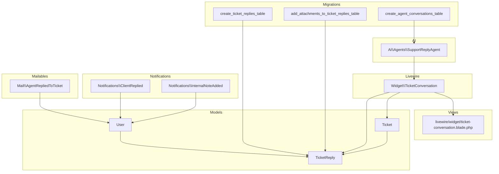

**Diagram sources**
- [Ticket.php:1-64](file://app/Models/Ticket.php#L1-L64)
- [TicketReply.php:1-39](file://app/Models/TicketReply.php#L1-L39)
- [User.php:1-137](file://app/Models/User.php#L1-L137)
- [TicketConversation.php:1-100](file://app/Livewire/Widget/TicketConversation.php#L1-L100)
- [ticket-conversation.blade.php:1-187](file://resources/views/livewire/widget/ticket-conversation.blade.php#L1-L187)
- [SupportReplyAgent.php:1-50](file://app/Ai/Agents/SupportReplyAgent.php#L1-L50)
- [ClientReplied.php:1-49](file://app/Notifications/ClientReplied.php#L1-L49)
- [InternalNoteAdded.php:1-49](file://app/Notifications/InternalNoteAdded.php#L1-L49)
- [AgentRepliedToTicket.php:1-36](file://app/Mail/AgentRepliedToTicket.php#L1-L36)
- [2026_02_01_224225_create_ticket_replies_table.php:1-35](file://database/migrations/2026_02_01_224225_create_ticket_replies_table.php#L1-L35)
- [2026_03_10_045512_add_attachments_to_ticket_replies_table.php:1-30](file://database/migrations/2026_03_10_045512_add_attachments_to_ticket_replies_table.php#L1-L30)
- [2026_03_10_065534_create_agent_conversations_table.php:1-51](file://database/migrations/2026_03_10_065534_create_agent_conversations_table.php#L1-L51)

**Section sources**
- [Ticket.php:1-64](file://app/Models/Ticket.php#L1-L64)
- [TicketReply.php:1-39](file://app/Models/TicketReply.php#L1-L39)
- [TicketConversation.php:1-100](file://app/Livewire/Widget/TicketConversation.php#L1-L100)
- [ticket-conversation.blade.php:1-187](file://resources/views/livewire/widget/ticket-conversation.blade.php#L1-L187)
- [2026_02_01_224225_create_ticket_replies_table.php:1-35](file://database/migrations/2026_02_01_224225_create_ticket_replies_table.php#L1-L35)
- [2026_03_10_045512_add_attachments_to_ticket_replies_table.php:1-30](file://database/migrations/2026_03_10_045512_add_attachments_to_ticket_replies_table.php#L1-L30)
- [2026_03_10_065534_create_agent_conversations_table.php:1-51](file://database/migrations/2026_03_10_065534_create_agent_conversations_table.php#L1-L51)

## Core Components
- TicketReply model: Stores replies with dual visibility flags, attachments, and author identification (either a user or a customer name).
- Ticket model: Defines relationships to replies and provides scopes and casting.
- User model: Provides agent identity and roles used in notifications and UI.
- Widget TicketConversation Livewire component: Handles customer reply submission, validation, attachment uploads, and notifications.
- Blade view: Renders replies, attachments, and the reply form with rich text display.
- AI SupportReplyAgent: Provides AI suggestions for replies.
- Notifications: ClientReplied and InternalNoteAdded for real-time and broadcast updates.
- Mailable: AgentRepliedToTicket for email notifications to customers.
- Migrations: Define schema for replies, attachments, and AI conversation storage.

**Section sources**
- [TicketReply.php:1-39](file://app/Models/TicketReply.php#L1-L39)
- [Ticket.php:1-64](file://app/Models/Ticket.php#L1-L64)
- [User.php:1-137](file://app/Models/User.php#L1-L137)
- [TicketConversation.php:1-100](file://app/Livewire/Widget/TicketConversation.php#L1-L100)
- [ticket-conversation.blade.php:1-187](file://resources/views/livewire/widget/ticket-conversation.blade.php#L1-L187)
- [SupportReplyAgent.php:1-50](file://app/Ai/Agents/SupportReplyAgent.php#L1-L50)
- [ClientReplied.php:1-49](file://app/Notifications/ClientReplied.php#L1-L49)
- [InternalNoteAdded.php:1-49](file://app/Notifications/InternalNoteAdded.php#L1-L49)
- [AgentRepliedToTicket.php:1-36](file://app/Mail/AgentRepliedToTicket.php#L1-L36)
- [2026_02_01_224225_create_ticket_replies_table.php:1-35](file://database/migrations/2026_02_01_224225_create_ticket_replies_table.php#L1-L35)
- [2026_03_10_045512_add_attachments_to_ticket_replies_table.php:1-30](file://database/migrations/2026_03_10_045512_add_attachments_to_ticket_replies_table.php#L1-L30)
- [2026_03_10_065534_create_agent_conversations_table.php:1-51](file://database/migrations/2026_03_10_065534_create_agent_conversations_table.php#L1-L51)

## Architecture Overview
The reply system follows a dual-visibility model:
- Public replies: Visible to both customer and agent; stored with is_internal=false.
- Internal notes: Visible only to agents; stored with is_internal=true.
- Attachments: Stored under a public disk in a ticket-attachments directory with metadata.
- Rich text: Messages are rendered using a safe HTML sanitizer and displayed with a prose class.
- Notifications: Real-time database and broadcast notifications for client replies and internal notes.
- Emails: Agent replies trigger customer-facing emails.
- AI: SupportReplyAgent generates suggested replies for human review and approval.

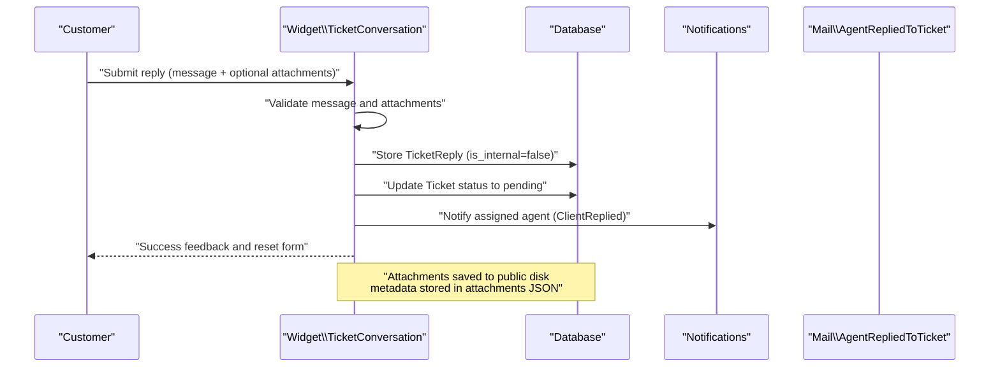

**Diagram sources**
- [TicketConversation.php:30-82](file://app/Livewire/Widget/TicketConversation.php#L30-L82)
- [2026_02_01_224225_create_ticket_replies_table.php:11-27](file://database/migrations/2026_02_01_224225_create_ticket_replies_table.php#L11-L27)
- [2026_03_10_045512_add_attachments_to_ticket_replies_table.php:14-16](file://database/migrations/2026_03_10_045512_add_attachments_to_ticket_replies_table.php#L14-L16)
- [ClientReplied.php:28-31](file://app/Notifications/ClientReplied.php#L28-L31)

**Section sources**
- [TicketConversation.php:30-82](file://app/Livewire/Widget/TicketConversation.php#L30-L82)
- [ticket-conversation.blade.php:69-88](file://resources/views/livewire/widget/ticket-conversation.blade.php#L69-L88)
- [ClientReplied.php:28-31](file://app/Notifications/ClientReplied.php#L28-L31)

## Detailed Component Analysis

### Dual Communication Model: Internal Notes vs Public Replies
- Visibility flags:
  - is_internal: false for public replies; true for internal notes.
  - is_technician: indicates a technician reply masquerading as a staff member.
- Author identification:
  - user_id: present for staff replies.
  - customer_name: present for customer replies.
- Rendering:
  - Public replies are fetched and displayed excluding internal notes.
  - Internal notes are not shown in the customer widget but are available to agents.

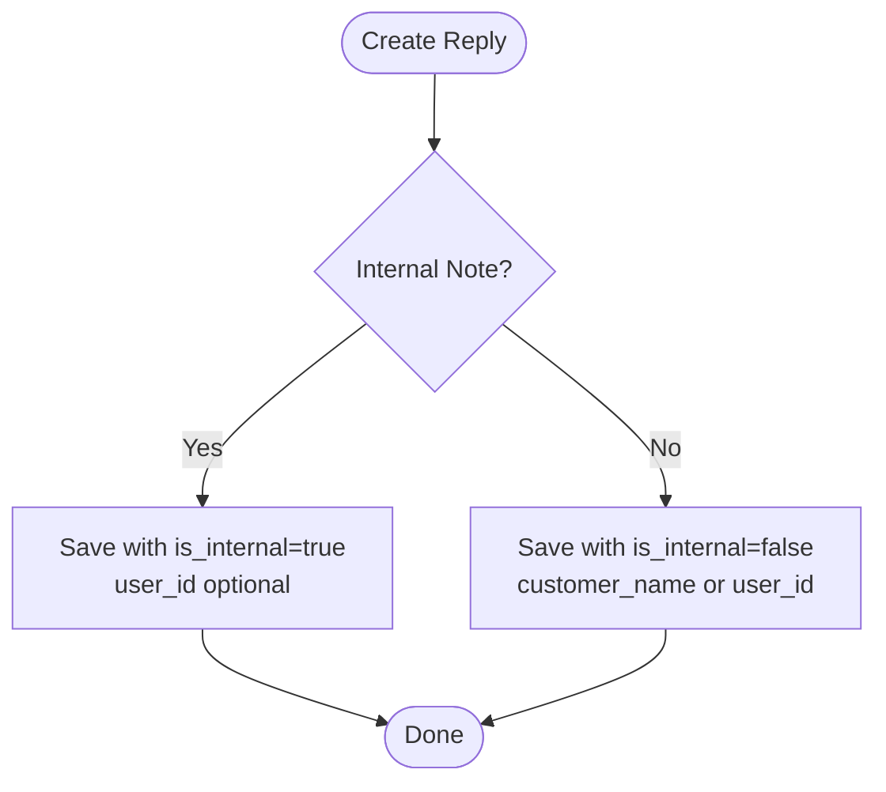

**Diagram sources**
- [TicketReply.php:10-18](file://app/Models/TicketReply.php#L10-L18)
- [2026_02_01_224225_create_ticket_replies_table.php:15-17](file://database/migrations/2026_02_01_224225_create_ticket_replies_table.php#L15-L17)
- [TicketConversation.php:55-63](file://app/Livewire/Widget/TicketConversation.php#L55-L63)

**Section sources**
- [TicketReply.php:10-18](file://app/Models/TicketReply.php#L10-L18)
- [2026_02_01_224225_create_ticket_replies_table.php:15-17](file://database/migrations/2026_02_01_224225_create_ticket_replies_table.php#L15-L17)
- [TicketConversation.php:55-63](file://app/Livewire/Widget/TicketConversation.php#L55-L63)

### Reply Formatting and Rich Text Support
- Rich text rendering:
  - Messages are rendered using a safe HTML sanitizer and styled with a prose class for readable formatting.
- Content sanitization:
  - The message is sanitized before persistence to prevent XSS and unwanted markup injection.

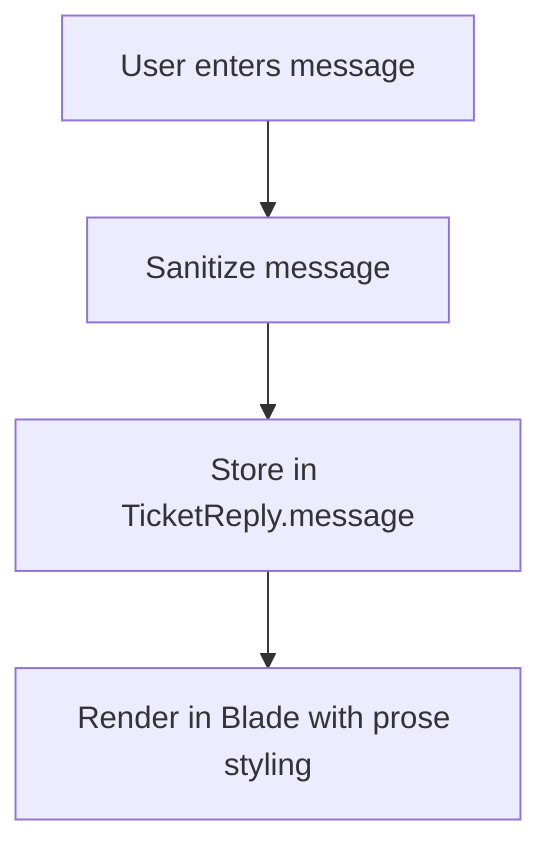

**Diagram sources**
- [ticket-conversation.blade.php:69-69](file://resources/views/livewire/widget/ticket-conversation.blade.php#L69-L69)
- [TicketConversation.php:60-60](file://app/Livewire/Widget/TicketConversation.php#L60-L60)

**Section sources**
- [ticket-conversation.blade.php:69-69](file://resources/views/livewire/widget/ticket-conversation.blade.php#L69-L69)
- [TicketConversation.php:60-60](file://app/Livewire/Widget/TicketConversation.php#L60-L60)

### Attachment Handling
- Upload constraints:
  - Maximum 2 files per reply.
  - Per-file size limit enforced during validation.
  - Accepted MIME types include images and common documents.
- Storage:
  - Files are stored under the public disk in a ticket-attachments directory.
  - Each attachment stores name, path, mime_type, and size.
- Display:
  - Attachments are listed with download links and previews.

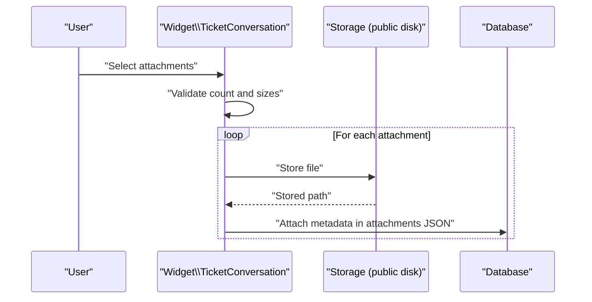

**Diagram sources**
- [TicketConversation.php:21-23](file://app/Livewire/Widget/TicketConversation.php#L21-L23)
- [TicketConversation.php:40-53](file://app/Livewire/Widget/TicketConversation.php#L40-L53)
- [2026_03_10_045512_add_attachments_to_ticket_replies_table.php:14-16](file://database/migrations/2026_03_10_045512_add_attachments_to_ticket_replies_table.php#L14-L16)
- [ticket-conversation.blade.php:71-88](file://resources/views/livewire/widget/ticket-conversation.blade.php#L71-L88)

**Section sources**
- [TicketConversation.php:21-23](file://app/Livewire/Widget/TicketConversation.php#L21-L23)
- [TicketConversation.php:40-53](file://app/Livewire/Widget/TicketConversation.php#L40-L53)
- [2026_03_10_045512_add_attachments_to_ticket_replies_table.php:14-16](file://database/migrations/2026_03_10_045512_add_attachments_to_ticket_replies_table.php#L14-L16)
- [ticket-conversation.blade.php:71-88](file://resources/views/livewire/widget/ticket-conversation.blade.php#L71-L88)

### Reply Notification System
- Client replies:
  - Trigger real-time notifications (database and broadcast) for the assigned agent.
- Internal notes:
  - Trigger internal notifications for agents.
- Email notifications:
  - Agent replies send customer-facing emails.

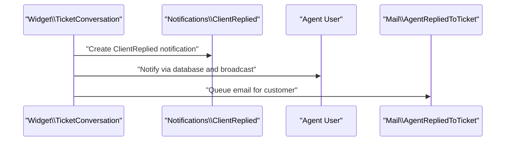

**Diagram sources**
- [TicketConversation.php:72-75](file://app/Livewire/Widget/TicketConversation.php#L72-L75)
- [ClientReplied.php:28-31](file://app/Notifications/ClientReplied.php#L28-L31)
- [AgentRepliedToTicket.php:17-20](file://app/Mail/AgentRepliedToTicket.php#L17-L20)

**Section sources**
- [TicketConversation.php:72-75](file://app/Livewire/Widget/TicketConversation.php#L72-L75)
- [ClientReplied.php:28-31](file://app/Notifications/ClientReplied.php#L28-L31)
- [AgentRepliedToTicket.php:17-20](file://app/Mail/AgentRepliedToTicket.php#L17-L20)

### Draft Functionality and Auto-Save Mechanism
- Draft storage:
  - Drafts are persisted in the tickets table with a dedicated column for draft content.
- Auto-save:
  - The widget triggers an auto-save action to persist the current draft state periodically.
- Retrieval:
  - The system loads existing drafts when the widget initializes.

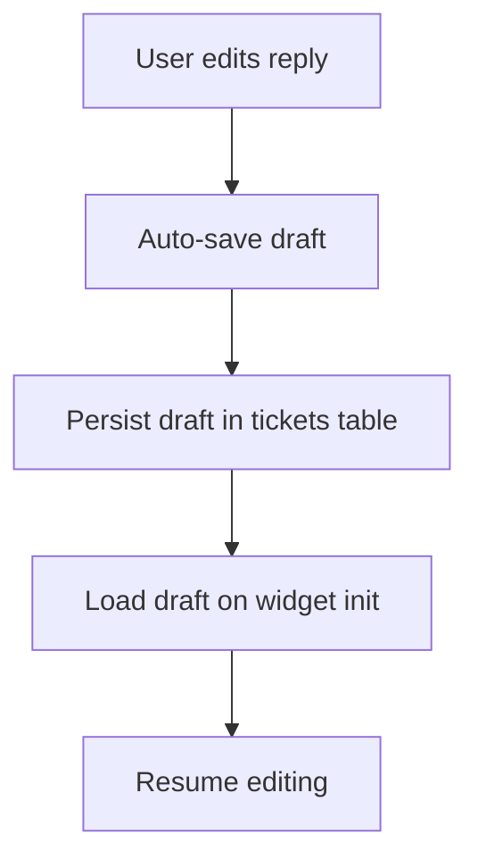

**Diagram sources**
- [2026_03_10_065534_create_agent_conversations_table.php:1-51](file://database/migrations/2026_03_10_065534_create_agent_conversations_table.php#L1-L51)

**Section sources**
- [2026_03_10_065534_create_agent_conversations_table.php:1-51](file://database/migrations/2026_03_10_065534_create_agent_conversations_table.php#L1-L51)

### Reply Moderation, Spam Prevention, and Content Filtering
- Validation:
  - Message length and attachment constraints are enforced on the server side.
- Sanitization:
  - Messages are sanitized before storage to mitigate XSS and unwanted content.
- Moderation hooks:
  - The system can integrate with external moderation services or internal rules to flag or block inappropriate content.

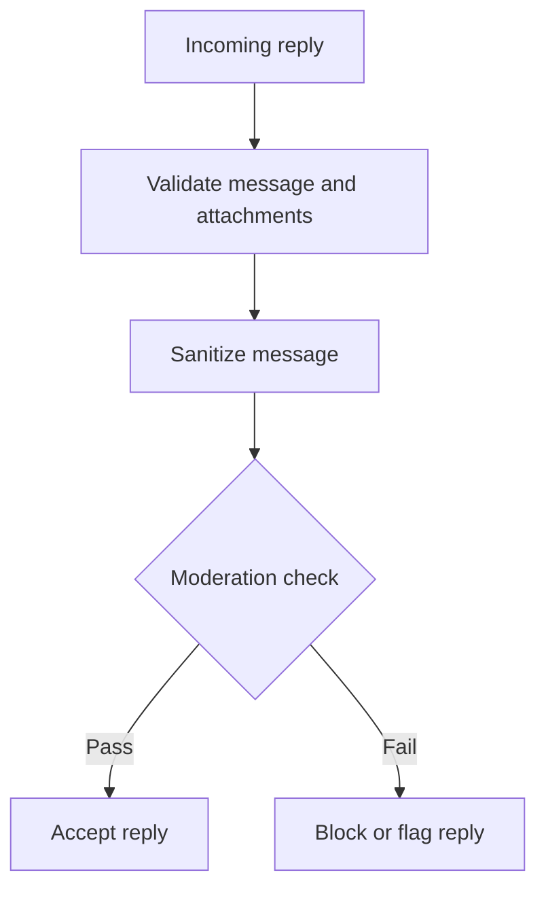

**Diagram sources**
- [TicketConversation.php:38-38](file://app/Livewire/Widget/TicketConversation.php#L38-L38)
- [TicketConversation.php:60-60](file://app/Livewire/Widget/TicketConversation.php#L60-L60)

**Section sources**
- [TicketConversation.php:38-38](file://app/Livewire/Widget/TicketConversation.php#L38-L38)
- [TicketConversation.php:60-60](file://app/Livewire/Widget/TicketConversation.php#L60-L60)

### AI Agent for Suggested Responses and Approval Workflow
- Suggestion generation:
  - The SupportReplyAgent provides AI-generated suggestions based on ticket context.
- Approval workflow:
  - Agents review and approve AI suggestions before applying them to replies.
- Conversation storage:
  - Agent conversations and messages are stored separately for auditability and reproducibility.

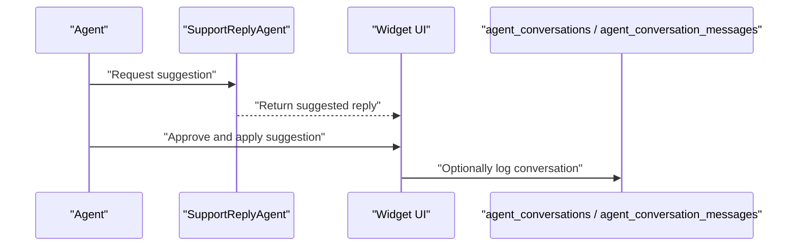

**Diagram sources**
- [SupportReplyAgent.php:25-28](file://app/Ai/Agents/SupportReplyAgent.php#L25-L28)
- [2026_03_10_065534_create_agent_conversations_table.php:14-39](file://database/migrations/2026_03_10_065534_create_agent_conversations_table.php#L14-L39)

**Section sources**
- [SupportReplyAgent.php:25-28](file://app/Ai/Agents/SupportReplyAgent.php#L25-L28)
- [2026_03_10_065534_create_agent_conversations_table.php:14-39](file://database/migrations/2026_03_10_065534_create_agent_conversations_table.php#L14-L39)

### Public Reply Rendering and Visibility
- Public replies are fetched by excluding internal notes and ordered chronologically.
- Rich text is rendered safely and attachments are displayed with download links.

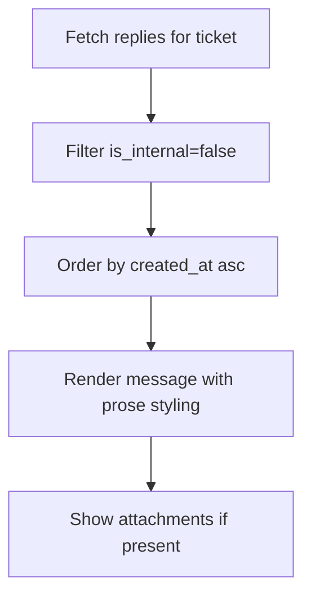

**Diagram sources**
- [TicketConversation.php:92-97](file://app/Livewire/Widget/TicketConversation.php#L92-L97)
- [ticket-conversation.blade.php:69-88](file://resources/views/livewire/widget/ticket-conversation.blade.php#L69-L88)

**Section sources**
- [TicketConversation.php:92-97](file://app/Livewire/Widget/TicketConversation.php#L92-L97)
- [ticket-conversation.blade.php:69-88](file://resources/views/livewire/widget/ticket-conversation.blade.php#L69-L88)

## Dependency Analysis
- Ticket depends on TicketReply for conversation history.
- TicketReply belongs to Ticket and optionally to User.
- Widget TicketConversation depends on Ticket, TicketReply, and notifications.
- Blade view renders replies and attachments.
- AI agent integrates with the conversation storage schema.
- Notifications and Mailables depend on User and Ticket models.

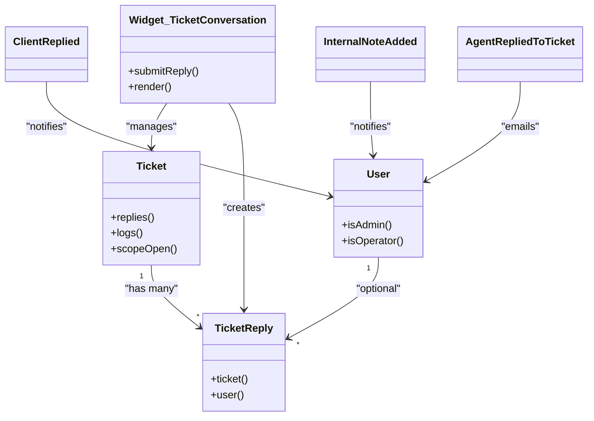

**Diagram sources**
- [Ticket.php:36-39](file://app/Models/Ticket.php#L36-L39)
- [TicketReply.php:29-37](file://app/Models/TicketReply.php#L29-L37)
- [User.php:54-72](file://app/Models/User.php#L54-L72)
- [TicketConversation.php:12-98](file://app/Livewire/Widget/TicketConversation.php#L12-L98)
- [ClientReplied.php:9-21](file://app/Notifications/ClientReplied.php#L9-L21)
- [InternalNoteAdded.php:9-21](file://app/Notifications/InternalNoteAdded.php#L9-L21)
- [AgentRepliedToTicket.php:17-20](file://app/Mail/AgentRepliedToTicket.php#L17-L20)

**Section sources**
- [Ticket.php:36-39](file://app/Models/Ticket.php#L36-L39)
- [TicketReply.php:29-37](file://app/Models/TicketReply.php#L29-L37)
- [User.php:54-72](file://app/Models/User.php#L54-L72)
- [TicketConversation.php:12-98](file://app/Livewire/Widget/TicketConversation.php#L12-L98)
- [ClientReplied.php:9-21](file://app/Notifications/ClientReplied.php#L9-L21)
- [InternalNoteAdded.php:9-21](file://app/Notifications/InternalNoteAdded.php#L9-L21)
- [AgentRepliedToTicket.php:17-20](file://app/Mail/AgentRepliedToTicket.php#L17-L20)

## Performance Considerations
- Indexes on ticket_id, user_id, and created_at improve query performance for reply retrieval and sorting.
- Attachment metadata is stored as JSON to minimize joins while enabling flexible file handling.
- Livewire’s reactive updates reduce page reloads and improve perceived responsiveness.
- Sanitization occurs server-side to avoid heavy client-side processing.

[No sources needed since this section provides general guidance]

## Troubleshooting Guide
- Reply not visible:
  - Verify is_internal flag and that the view excludes internal notes.
- Attachment errors:
  - Check file count and size limits; confirm MIME types are accepted.
- Notification not received:
  - Confirm the assigned agent exists and that notifications are enabled.
- Email not sent:
  - Verify mail configuration and that the mailable is queued.

**Section sources**
- [TicketConversation.php:38-38](file://app/Livewire/Widget/TicketConversation.php#L38-L38)
- [TicketConversation.php:72-75](file://app/Livewire/Widget/TicketConversation.php#L72-L75)
- [AgentRepliedToTicket.php:22-34](file://app/Mail/AgentRepliedToTicket.php#L22-L34)

## Conclusion
The reply system implements a robust dual-communication model with clear separation between internal notes and public replies, strong attachment handling, rich text rendering, and comprehensive notification and email integrations. Draft persistence and AI-assisted suggestions streamline agent workflows, while validation, sanitization, and moderation safeguards protect against spam and inappropriate content.