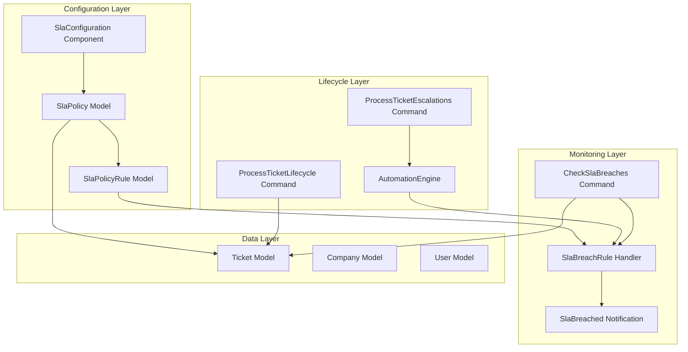
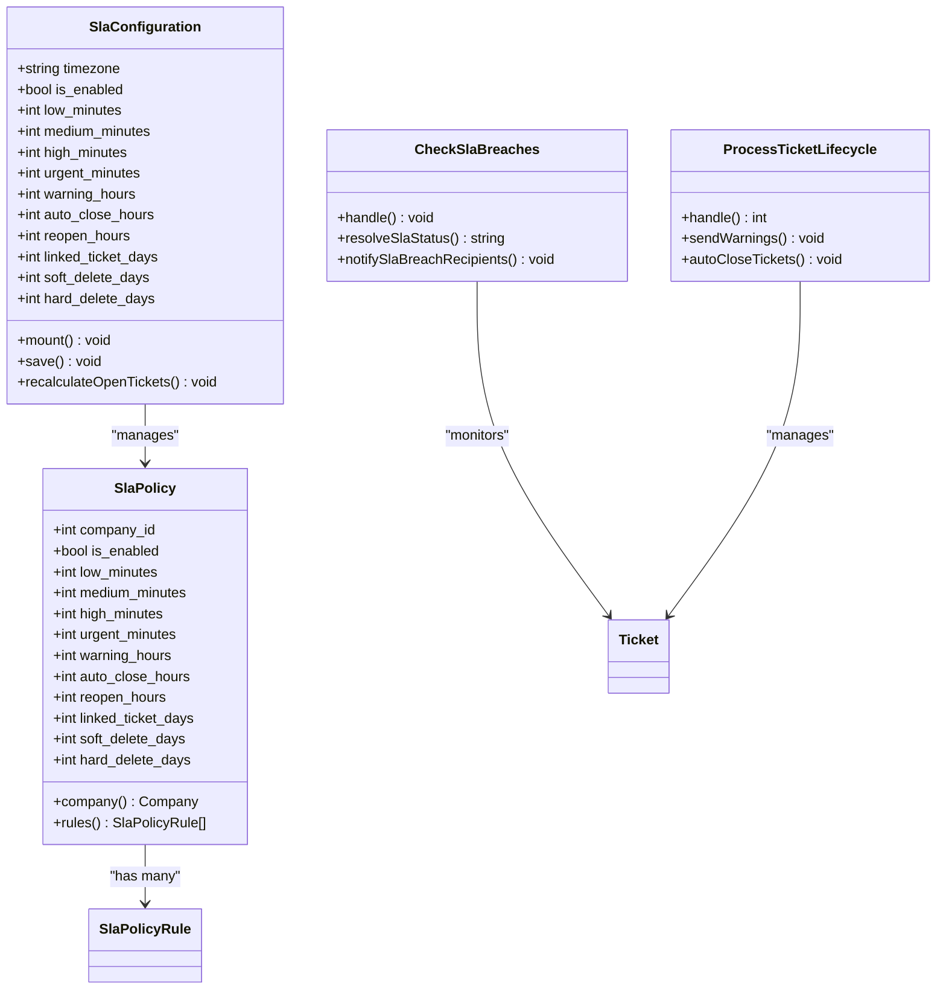
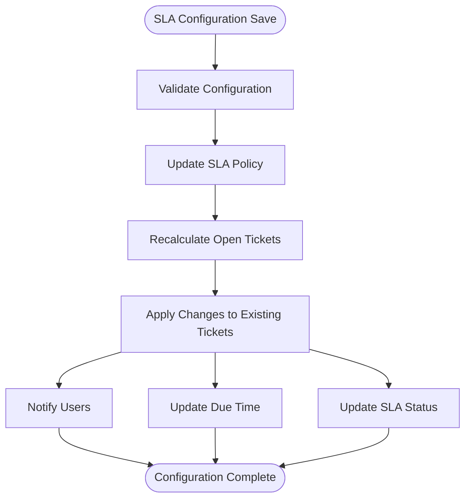
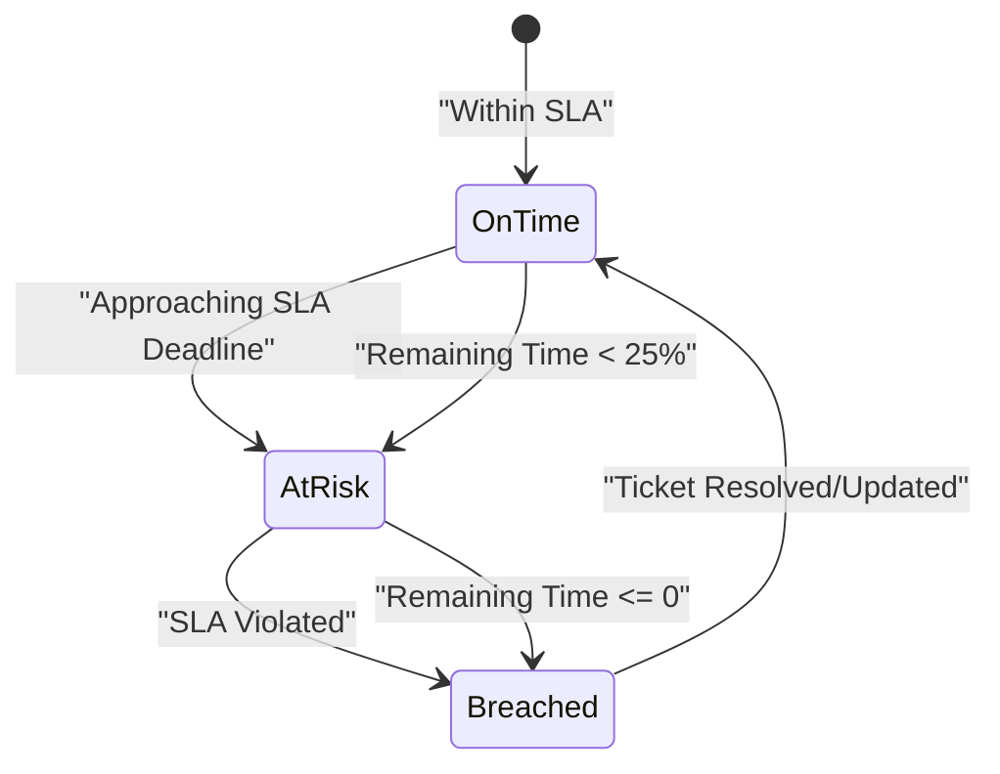
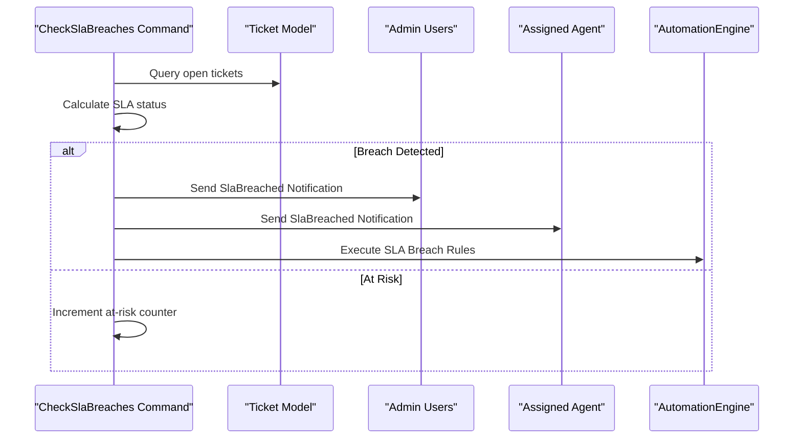
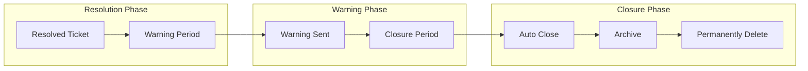
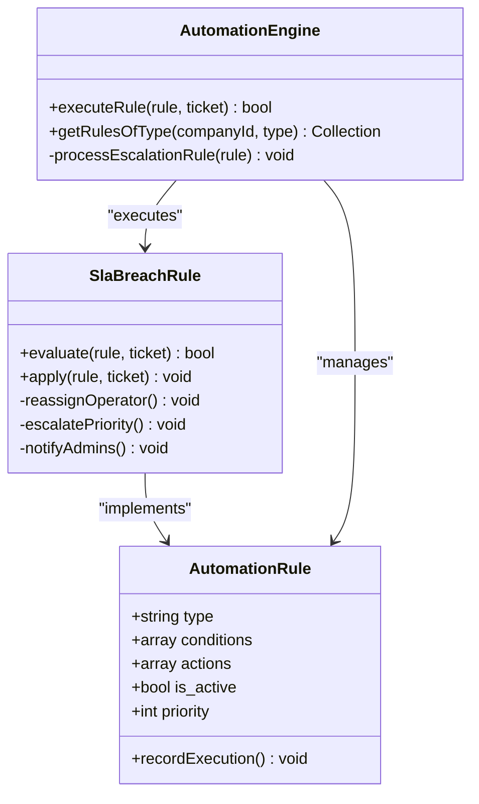
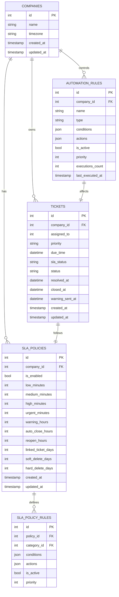

# SLA Policy System

<cite>
**Referenced Files in This Document**
- [SlaPolicy.php](file://app/Models/SlaPolicy.php)
- [SlaPolicyRule.php](file://app/Models/SlaPolicyRule.php)
- [CheckSlaBreaches.php](file://app/Console/Commands/CheckSlaBreaches.php)
- [ProcessTicketLifecycle.php](file://app/Console/Commands/ProcessTicketLifecycle.php)
- [SlaConfiguration.php](file://app/Livewire/Tickets/SlaConfiguration.php)
- [SlaPolicy.php](file://database/migrations/2026_03_10_224411_create_sla_policies_table.php)
- [Tickets SLA Policy View](file://resources/views/app/sla-policy.blade.php)
- [Sla Breach Notification](file://app/Notifications/SlaBreached.php)
- [AutomationEngine.php](file://app/Services/Automation/AutomationEngine.php)
- [Ticket.php](file://app/Models/Ticket.php)
- [SlaBreachRule.php](file://app/Services/Automation/Rules/SlaBreachRule.php)
- [ProcessTicketEscalations.php](file://app/Console/Commands/ProcessTicketEscalations.php)
- [AutomationRule.php](file://app/Models/AutomationRule.php)
</cite>

## Table of Contents
1. [Introduction](#introduction)
2. [System Architecture](#system-architecture)
3. [Core Components](#core-components)
4. [SLA Policy Configuration](#sla-policy-configuration)
5. [SLA Breach Detection](#sla-breach-detection)
6. [Ticket Lifecycle Management](#ticket-lifecycle-management)
7. [Automation Integration](#automation-integration)
8. [Data Models and Relationships](#data-models-and-relationships)
9. [Performance Considerations](#performance-considerations)
10. [Troubleshooting Guide](#troubleshooting-guide)
11. [Conclusion](#conclusion)

## Introduction

The SLA (Service Level Agreement) Policy System is a comprehensive service level management solution integrated into the helpdesk system. This system enables organizations to define response time targets for different ticket priorities, monitor SLA compliance, detect breaches, and automate corrective actions. The system operates on a per-company basis with configurable timeframes and integrates seamlessly with the broader automation framework.

The SLA system consists of three primary components: policy configuration, breach detection, and lifecycle management. It supports four priority levels (low, medium, high, urgent) with customizable response time targets ranging from minutes to days, and provides automated notifications and remediation actions when SLA commitments are not met.

## System Architecture

The SLA Policy System follows a modular architecture with clear separation of concerns across configuration, monitoring, and automation layers.

**Diagram sources**
- [SlaConfiguration.php:13-165](file://app/Livewire/Tickets/SlaConfiguration.php#L13-L165)
- [CheckSlaBreaches.php:13-132](file://app/Console/Commands/CheckSlaBreaches.php#L13-L132)
- [ProcessTicketLifecycle.php:15-101](file://app/Console/Commands/ProcessTicketLifecycle.php#L15-L101)

## Core Components

### SLA Policy Engine

The SLA Policy Engine serves as the central coordinator for all SLA-related operations. It manages policy configuration, breach detection, and lifecycle automation through a sophisticated command-driven architecture.

**Diagram sources**
- [SlaPolicy.php:8-43](file://app/Models/SlaPolicy.php#L8-L43)
- [SlaConfiguration.php:13-165](file://app/Livewire/Tickets/SlaConfiguration.php#L13-L165)
- [CheckSlaBreaches.php:13-132](file://app/Console/Commands/CheckSlaBreaches.php#L13-L132)
- [ProcessTicketLifecycle.php:15-101](file://app/Console/Commands/ProcessTicketLifecycle.php#L15-L101)

**Section sources**
- [SlaPolicy.php:8-43](file://app/Models/SlaPolicy.php#L8-L43)
- [SlaConfiguration.php:13-165](file://app/Livewire/Tickets/SlaConfiguration.php#L13-L165)
- [CheckSlaBreaches.php:13-132](file://app/Console/Commands/CheckSlaBreaches.php#L13-L132)
- [ProcessTicketLifecycle.php:15-101](file://app/Console/Commands/ProcessTicketLifecycle.php#L15-L101)

## SLA Policy Configuration

The SLA Policy Configuration component provides a comprehensive interface for defining and managing service level agreements. Organizations can configure response time targets for different priority levels and establish lifecycle policies for ticket management.

### Priority-Based Response Time Configuration

The system supports four distinct priority levels, each with customizable response time targets:

| Priority Level | Default Response Time | Description |
|----------------|----------------------|-------------|
| Low | 1,440 minutes (24 hours) | Standard support requests |
| Medium | 480 minutes (8 hours) | Important inquiries requiring attention |
| High | 120 minutes (2 hours) | Urgent issues needing prompt resolution |
| Urgent | 30 minutes | Critical problems requiring immediate action |

### Lifecycle Management Configuration

Beyond response times, the system provides comprehensive lifecycle management controls:

**Diagram sources**
- [SlaConfiguration.php:95-124](file://app/Livewire/Tickets/SlaConfiguration.php#L95-L124)
- [SlaConfiguration.php:129-158](file://app/Livewire/Tickets/SlaConfiguration.php#L129-L158)

**Section sources**
- [SlaConfiguration.php:77-93](file://app/Livewire/Tickets/SlaConfiguration.php#L77-L93)
- [SlaConfiguration.php:95-124](file://app/Livewire/Tickets/SlaConfiguration.php#L95-L124)
- [SlaConfiguration.php:129-158](file://app/Livewire/Tickets/SlaConfiguration.php#L129-L158)

## SLA Breach Detection

The SLA Breach Detection system continuously monitors open tickets to identify when response time commitments are not being met. This system operates on a scheduled basis and triggers appropriate notifications and automated actions.

### Breach Status Classification

The system categorizes SLA compliance into three distinct states:

**Diagram sources**
- [CheckSlaBreaches.php:91-112](file://app/Console/Commands/CheckSlaBreaches.php#L91-L112)

### Breach Detection Algorithm

The breach detection mechanism employs a multi-tiered approach to accurately assess SLA compliance:

1. **Timezone-Aware Calculation**: Uses company-specific timezones for accurate deadline calculations
2. **Dynamic Threshold Evaluation**: Implements a 25% threshold for early warning notifications
3. **Status Transition Management**: Maintains historical SLA status for audit trails

### Notification System

When SLA breaches are detected, the system automatically notifies relevant stakeholders:

**Diagram sources**
- [CheckSlaBreaches.php:32-89](file://app/Console/Commands/CheckSlaBreaches.php#L32-L89)
- [SlaBreached.php:9-49](file://app/Notifications/SlaBreached.php#L9-L49)

**Section sources**
- [CheckSlaBreaches.php:91-112](file://app/Console/Commands/CheckSlaBreaches.php#L91-L112)
- [CheckSlaBreaches.php:114-130](file://app/Console/Commands/CheckSlaBreaches.php#L114-L130)
- [SlaBreached.php:9-49](file://app/Notifications/SlaBreached.php#L9-L49)

## Ticket Lifecycle Management

The Ticket Lifecycle Management component automates the post-resolution handling of tickets according to predefined SLA policies. This ensures proper customer communication and efficient ticket archival.

### Closure Warning System

The system implements a two-phase closure process with configurable warning periods:

**Diagram sources**
- [ProcessTicketLifecycle.php:42-68](file://app/Console/Commands/ProcessTicketLifecycle.php#L42-L68)
- [ProcessTicketLifecycle.php:70-99](file://app/Console/Commands/ProcessTicketLifecycle.php#L70-L99)

### Lifecycle Configuration Parameters

| Parameter | Default Value | Purpose |
|-----------|---------------|---------|
| Warning Hours | 24 hours | Time before closure to send customer warning |
| Auto Close Hours | 48 hours | Total time after resolution before auto-closure |
| Reopen Window | 48 hours | Time window for customer to reopen resolved tickets |
| Linked Ticket Window | 7 days | Allow creation of follow-up tickets after closure |
| Soft Delete | 30 days | Archive tickets after closure |
| Hard Delete | 90 days | Permanently remove archived tickets |

**Section sources**
- [ProcessTicketLifecycle.php:42-68](file://app/Console/Commands/ProcessTicketLifecycle.php#L42-L68)
- [ProcessTicketLifecycle.php:70-99](file://app/Console/Commands/ProcessTicketLifecycle.php#L70-L99)

## Automation Integration

The SLA Policy System integrates deeply with the broader automation framework, enabling complex workflows triggered by SLA violations.

### SLA Breach Rule Processing

When SLA breaches are detected, the system can execute predefined automation rules:

**Diagram sources**
- [SlaBreachRule.php:12-78](file://app/Services/Automation/Rules/SlaBreachRule.php#L12-L78)
- [AutomationEngine.php:16-144](file://app/Services/Automation/AutomationEngine.php#L16-L144)
- [AutomationRule.php:23-126](file://app/Models/AutomationRule.php#L23-L126)

### Available Automation Actions

The SLA breach rules support multiple automated actions:

| Action Type | Description | Trigger Conditions |
|-------------|-------------|-------------------|
| Reassign Operator | Automatically reassign tickets to specific agents | Breach detected |
| Escalate Priority | Increase ticket priority to next level | Breach detected |
| Set Priority | Change ticket priority to specific level | Breach detected |
| Notify Admin | Send breach notifications to administrators | Breach detected |

**Section sources**
- [SlaBreachRule.php:17-76](file://app/Services/Automation/Rules/SlaBreachRule.php#L17-L76)
- [AutomationEngine.php:61-98](file://app/Services/Automation/AutomationEngine.php#L61-L98)
- [AutomationRule.php:115-124](file://app/Models/AutomationRule.php#L115-L124)

## Data Models and Relationships

The SLA Policy System relies on a well-structured set of data models that maintain the relationships between companies, policies, tickets, and automation rules.

### Core Data Model Architecture

**Diagram sources**
- [SlaPolicy.php:8-43](file://app/Models/SlaPolicy.php#L8-L43)
- [Ticket.php:12-121](file://app/Models/Ticket.php#L12-L121)
- [AutomationRule.php:23-126](file://app/Models/AutomationRule.php#L23-L126)
- [SlaPolicyRule.php:8-22](file://app/Models/SlaPolicyRule.php#L8-L22)

### Migration Schema Details

The database schema supports comprehensive SLA functionality with appropriate indexing and foreign key constraints:

| Table | Columns | Purpose |
|-------|---------|---------|
| sla_policies | company_id, priority thresholds, lifecycle settings | Core SLA policy storage |
| tickets | due_time, sla_status, lifecycle timestamps | Ticket SLA tracking |
| automation_rules | type-specific configurations | SLA breach automation rules |
| sla_policy_rules | category-specific overrides | Granular policy application |

**Section sources**
- [SlaPolicy.php:8-43](file://app/Models/SlaPolicy.php#L8-L43)
- [Ticket.php:12-121](file://app/Models/Ticket.php#L12-L121)
- [AutomationRule.php:23-126](file://app/Models/AutomationRule.php#L23-L126)
- [SlaPolicyRule.php:8-22](file://app/Models/SlaPolicyRule.php#L8-L22)

## Performance Considerations

The SLA Policy System is designed with performance optimization in mind, implementing several strategies to handle large volumes of tickets efficiently.

### Query Optimization Strategies

1. **Selective Querying**: Commands use targeted queries with appropriate indexes
2. **Batch Processing**: Large-scale operations are performed in batches to prevent memory issues
3. **Lazy Loading**: Eager loading of relationships where necessary to minimize database queries
4. **Index Utilization**: Strategic indexing on frequently queried columns (due_time, sla_status, company_id)

### Scalability Features

- **Company-Specific Processing**: Operations are scoped to individual companies to prevent cross-company interference
- **Incremental Updates**: Only tickets with status changes are processed for SLA updates
- **Caching Mechanisms**: Frequently accessed policy data is cached to reduce database load
- **Background Processing**: Heavy operations utilize Laravel's queue system for asynchronous execution

### Memory Management

The system implements careful memory management for large datasets:
- Streaming large result sets instead of loading all records into memory
- Using chunked processing for bulk operations
- Proper cleanup of temporary variables and collections

## Troubleshooting Guide

### Common Issues and Solutions

#### SLA Breach Detection Not Working

**Symptoms**: Tickets not being flagged as breached despite exceeding response times

**Possible Causes**:
1. SLA monitoring disabled in policy configuration
2. Incorrect company timezone settings
3. Missing due_time values on tickets
4. Global scope conflicts in queries

**Resolutions**:
1. Verify `is_enabled` flag in SLA policy is set to true
2. Check company timezone matches actual operational timezone
3. Ensure tickets have valid due_time values
4. Confirm CompanyScope is properly applied

#### Automation Rules Not Executing

**Symptoms**: SLA breaches detected but no automated actions taken

**Possible Causes**:
1. No SLA breach automation rules configured
2. Rules not marked as active
3. Rule conditions not matching ticket criteria
4. Execution errors in rule handlers

**Resolutions**:
1. Create automation rules with type 'sla_breach'
2. Ensure rules have `is_active` set to true
3. Verify rule conditions match target tickets
4. Check rule handler logs for execution errors

#### Performance Issues with Large Ticket Volumes

**Symptoms**: Slow SLA status updates or command execution timeouts

**Possible Causes**:
1. Missing database indexes on frequently queried columns
2. Inefficient query patterns
3. Memory exhaustion during batch processing
4. Insufficient server resources

**Resolutions**:
1. Verify indexes exist on due_time and sla_status columns
2. Optimize query patterns to use appropriate scopes
3. Implement chunked processing for large datasets
4. Monitor server resource utilization during peak loads

**Section sources**
- [CheckSlaBreaches.php:36-46](file://app/Console/Commands/CheckSlaBreaches.php#L36-L46)
- [SlaConfiguration.php:44-58](file://app/Livewire/Tickets/SlaConfiguration.php#L44-L58)
- [AutomationEngine.php:61-98](file://app/Services/Automation/AutomationEngine.php#L61-L98)

## Conclusion

The SLA Policy System provides a robust, scalable solution for managing service level agreements within the helpdesk platform. Its modular architecture enables organizations to define precise response time commitments while maintaining flexibility for customization across different business needs.

Key strengths of the system include:

- **Comprehensive Coverage**: From initial configuration through breach detection and lifecycle management
- **Automated Workflows**: Seamless integration with the broader automation framework
- **Performance Optimization**: Designed to handle large volumes of tickets efficiently
- **Flexible Configuration**: Support for company-specific policies and granular rule definitions
- **Audit Trail**: Complete logging and notification capabilities for compliance and transparency

The system successfully balances configurability with ease of use, providing both technical administrators with fine-grained control and business users with intuitive interfaces for SLA management. Its integration with the existing helpdesk infrastructure ensures consistent operation across all ticket management processes.

Future enhancements could include advanced analytics for SLA performance tracking, integration with external SLA monitoring services, and expanded automation capabilities for more complex breach scenarios.