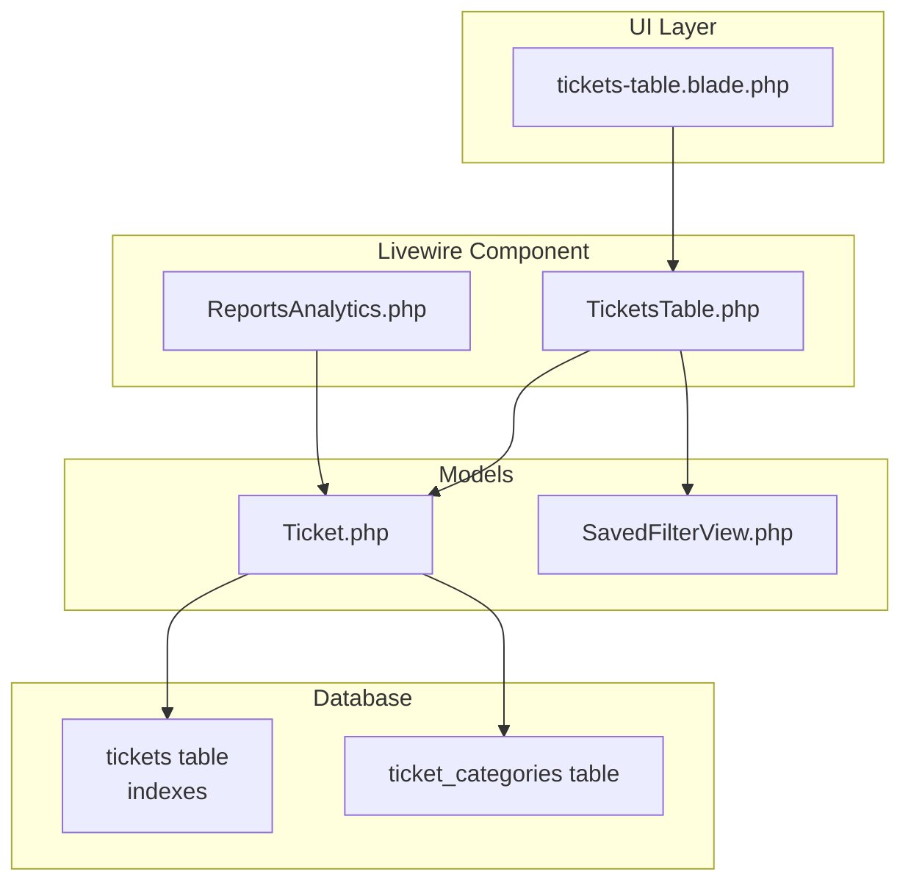
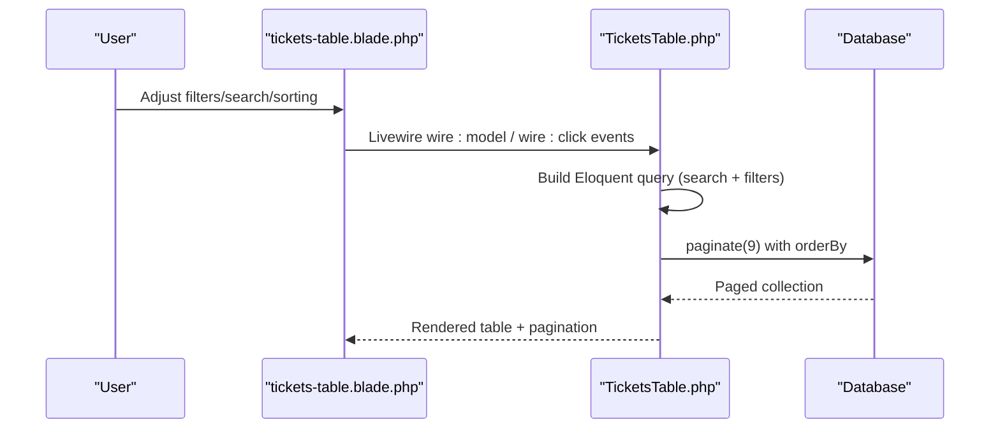
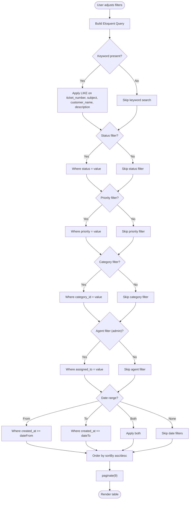
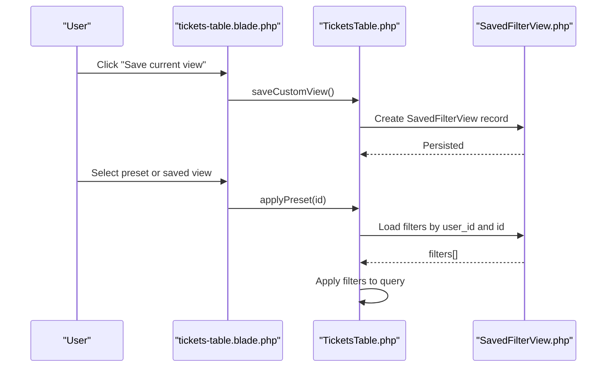
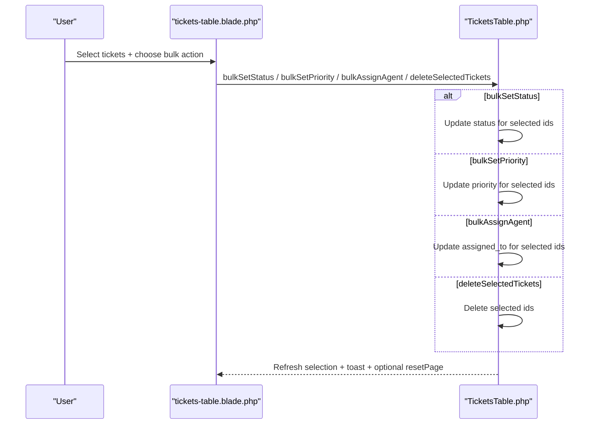
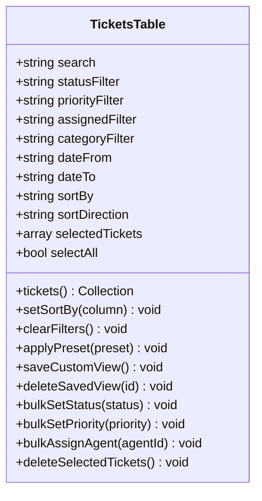
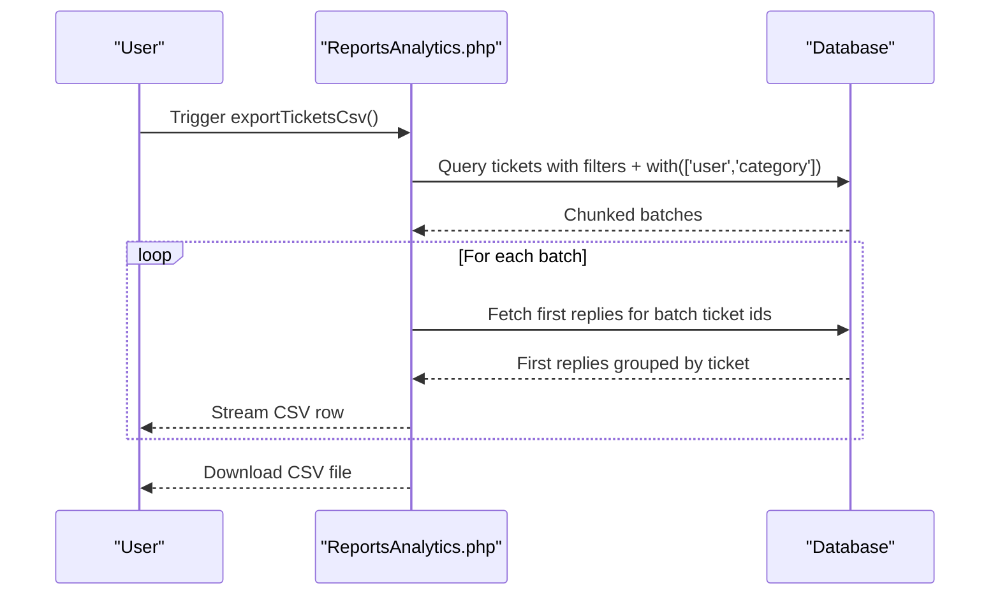
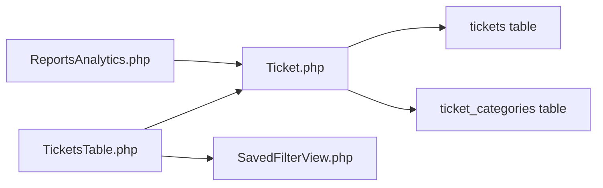

# Search, Filtering & Bulk Operations

<cite>
**Referenced Files in This Document**
- [TicketsTable.php](file://app/Livewire/Dashboard/TicketsTable.php)
- [tickets-table.blade.php](file://resources/views/livewire/dashboard/tickets-table.blade.php)
- [SavedFilterView.php](file://app/Models/SavedFilterView.php)
- [create_tickets_table.php](file://database/migrations/2026_02_01_224222_create_tickets_table.php)
- [create_ticket_categories_table.php](file://database/migrations/2026_02_01_224218_create_ticket_categories_table.php)
- [ReportsAnalytics.php](file://app/Livewire/Dashboard/ReportsAnalytics.php)
- [tickets-tab.blade.php](file://resources/views/livewire/dashboard/reports/tickets-tab.blade.php)
- [TicketsController.php](file://app/Http/Controllers/TicketsController.php)
- [Ticket.php](file://app/Models/Ticket.php)
- [performance-issues.md](file://performance-issues.md)
</cite>

## Table of Contents
1. [Introduction](#introduction)
2. [Project Structure](#project-structure)
3. [Core Components](#core-components)
4. [Architecture Overview](#architecture-overview)
5. [Detailed Component Analysis](#detailed-component-analysis)
6. [Dependency Analysis](#dependency-analysis)
7. [Performance Considerations](#performance-considerations)
8. [Troubleshooting Guide](#troubleshooting-guide)
9. [Conclusion](#conclusion)

## Introduction
This document explains the complete ticket search, filtering, and bulk operations system. It covers:
- Advanced search and filters (keyword, date range, status, priority, category, agent)
- Saved filter views for custom report configurations and recurring searches
- Bulk operations (mass status updates, category reassignment, priority changes, batch deletion)
- Table sorting, pagination, and column customization
- Export functionality (CSV) and performance optimizations for large datasets

## Project Structure
The search and filtering features are implemented primarily in a Livewire component that renders a Blade table. Saved filters are persisted via a dedicated model. Database migrations define the underlying schema and indexes. An analytics/reporting component provides export functionality.

**Diagram sources**
- [tickets-table.blade.php](file://resources/views/livewire/dashboard/tickets-table.blade.php)
- [TicketsTable.php](file://app/Livewire/Dashboard/TicketsTable.php)
- [ReportsAnalytics.php](file://app/Livewire/Dashboard/ReportsAnalytics.php)
- [Ticket.php](file://app/Models/Ticket.php)
- [SavedFilterView.php](file://app/Models/SavedFilterView.php)
- [create_tickets_table.php](file://database/migrations/2026_02_01_224222_create_tickets_table.php)
- [create_ticket_categories_table.php](file://database/migrations/2026_02_01_224218_create_ticket_categories_table.php)

**Section sources**
- [TicketsTable.php](file://app/Livewire/Dashboard/TicketsTable.php)
- [tickets-table.blade.php](file://resources/views/livewire/dashboard/tickets-table.blade.php)
- [SavedFilterView.php](file://app/Models/SavedFilterView.php)
- [Ticket.php](file://app/Models/Ticket.php)
- [create_tickets_table.php](file://database/migrations/2026_02_01_224222_create_tickets_table.php)
- [create_ticket_categories_table.php](file://database/migrations/2026_02_01_224218_create_ticket_categories_table.php)

## Core Components
- TicketsTable: The primary Livewire component implementing search, filters, sorting, pagination, and bulk operations.
- tickets-table.blade.php: The Blade template rendering the UI, filters, and table.
- SavedFilterView: Model for storing saved filter configurations.
- Ticket: Eloquent model with scopes and relationships used by the search and filters.
- ReportsAnalytics: Provides export functionality (CSV) leveraging the same filters.

**Section sources**
- [TicketsTable.php](file://app/Livewire/Dashboard/TicketsTable.php)
- [tickets-table.blade.php](file://resources/views/livewire/dashboard/tickets-table.blade.php)
- [SavedFilterView.php](file://app/Models/SavedFilterView.php)
- [Ticket.php](file://app/Models/Ticket.php)
- [ReportsAnalytics.php](file://app/Livewire/Dashboard/ReportsAnalytics.php)

## Architecture Overview
The system follows a reactive UI pattern:
- Livewire component manages state and builds Eloquent queries based on user inputs.
- Blade template binds to component properties and emits events for actions.
- Saved filters persist user-defined presets.
- Export functionality streams CSV data for reporting.

**Diagram sources**
- [tickets-table.blade.php](file://resources/views/livewire/dashboard/tickets-table.blade.php)
- [TicketsTable.php](file://app/Livewire/Dashboard/TicketsTable.php)

## Detailed Component Analysis

### Search and Filters
- Keyword search: Searches across ticket_number, subject, customer_name, and description.
- Date range filtering: Filters by created_at using whereDate for inclusive ranges.
- Status and priority filters: Exact matches against enum fields.
- Category and agent filters: Category filter is admin-only; agent filter is available to admins.
- Deleted-only toggle: Switches to only trashed tickets.

**Diagram sources**
- [TicketsTable.php](file://app/Livewire/Dashboard/TicketsTable.php)

**Section sources**
- [TicketsTable.php](file://app/Livewire/Dashboard/TicketsTable.php)
- [tickets-table.blade.php](file://resources/views/livewire/dashboard/tickets-table.blade.php)

### Saved Filter Views
- Users can save the current view configuration (including all active filters).
- Presets include a built-in “Unassigned High Priority” preset.
- Users can delete saved views.
- Applying a saved view loads the stored filters into the component.

**Diagram sources**
- [tickets-table.blade.php](file://resources/views/livewire/dashboard/tickets-table.blade.php)
- [TicketsTable.php](file://app/Livewire/Dashboard/TicketsTable.php)
- [SavedFilterView.php](file://app/Models/SavedFilterView.php)

**Section sources**
- [TicketsTable.php](file://app/Livewire/Dashboard/TicketsTable.php)
- [SavedFilterView.php](file://app/Models/SavedFilterView.php)
- [tickets-table.blade.php](file://resources/views/livewire/dashboard/tickets-table.blade.php)

### Bulk Operations
- Selection: Multi-select via checkboxes; select-all toggles selection across the current page.
- Mass status update: Updates status for all selected tickets.
- Priority change: Updates priority for all selected tickets.
- Agent assignment (admin-only): Assigns selected tickets to a chosen agent.
- Batch deletion: Deletes selected tickets; clears selection and resets page.

**Diagram sources**
- [tickets-table.blade.php](file://resources/views/livewire/dashboard/tickets-table.blade.php)
- [TicketsTable.php](file://app/Livewire/Dashboard/TicketsTable.php)

**Section sources**
- [TicketsTable.php](file://app/Livewire/Dashboard/TicketsTable.php)
- [tickets-table.blade.php](file://resources/views/livewire/dashboard/tickets-table.blade.php)

### Table Sorting, Pagination, and Column Customization
- Sorting: Click column headers to toggle ascending/descending order on ticket_number, subject, customer_name, priority, status.
- Pagination: Paginates results with 9 items per page; maintains filters and sorting across pages.
- Column customization: The table displays ticket ID, subject, customer, assigned agent, priority, status, category, and actions. Additional columns can be added by extending the Blade template and component logic.

**Diagram sources**
- [TicketsTable.php](file://app/Livewire/Dashboard/TicketsTable.php)

**Section sources**
- [TicketsTable.php](file://app/Livewire/Dashboard/TicketsTable.php)
- [tickets-table.blade.php](file://resources/views/livewire/dashboard/tickets-table.blade.php)

### Export Functionality (CSV)
- The reporting/analytics component exports tickets to CSV with computed metrics (first response time, resolution time).
- Filters applied: status, priority, category, agent, and date range.
- Streaming: Uses chunked iteration to handle large datasets efficiently.

**Diagram sources**
- [ReportsAnalytics.php](file://app/Livewire/Dashboard/ReportsAnalytics.php)

**Section sources**
- [ReportsAnalytics.php](file://app/Livewire/Dashboard/ReportsAnalytics.php)
- [tickets-tab.blade.php](file://resources/views/livewire/dashboard/reports/tickets-tab.blade.php)

## Dependency Analysis
- TicketsTable depends on:
  - Ticket model for queries and relationships
  - SavedFilterView for persisted filters
  - Auth facade for role-based visibility (agent filter)
- ReportsAnalytics depends on:
  - Ticket model and TicketReply for computed metrics
  - Date/time helpers for time differences
- Database schema supports:
  - Indexes on company_id, ticket_number, status, priority, assigned_to, created_at
  - Foreign keys for category and user assignments

**Diagram sources**
- [TicketsTable.php](file://app/Livewire/Dashboard/TicketsTable.php)
- [ReportsAnalytics.php](file://app/Livewire/Dashboard/ReportsAnalytics.php)
- [Ticket.php](file://app/Models/Ticket.php)
- [SavedFilterView.php](file://app/Models/SavedFilterView.php)
- [create_tickets_table.php](file://database/migrations/2026_02_01_224222_create_tickets_table.php)
- [create_ticket_categories_table.php](file://database/migrations/2026_02_01_224218_create_ticket_categories_table.php)

**Section sources**
- [TicketsTable.php](file://app/Livewire/Dashboard/TicketsTable.php)
- [ReportsAnalytics.php](file://app/Livewire/Dashboard/ReportsAnalytics.php)
- [Ticket.php](file://app/Models/Ticket.php)
- [SavedFilterView.php](file://app/Models/SavedFilterView.php)
- [create_tickets_table.php](file://database/migrations/2026_02_01_224222_create_tickets_table.php)
- [create_ticket_categories_table.php](file://database/migrations/2026_02_01_224218_create_ticket_categories_table.php)

## Performance Considerations
- Database indexes:
  - Tickets table includes indexes on company_id, ticket_number, customer_email, status, priority, assigned_to, verified, and created_at.
  - Category table includes company_id and a unique constraint on company_id + name.
- Query patterns:
  - Eager loading of related user and category reduces N+1 queries.
  - Pagination limits result sets to 9 per page.
  - Export uses chunked iteration to stream CSV for large datasets.
- Recommendations from performance review:
  - Add a compound index on tickets(company_id, status, priority, created_at) to optimize common filter combinations.
  - Consider caching agent lists and categories with invalidation strategies.
  - Avoid repeated agent lookup logic by centralizing it in a service.

**Section sources**
- [create_tickets_table.php](file://database/migrations/2026_02_01_224222_create_tickets_table.php)
- [create_ticket_categories_table.php](file://database/migrations/2026_02_01_224218_create_ticket_categories_table.php)
- [TicketsTable.php](file://app/Livewire/Dashboard/TicketsTable.php)
- [ReportsAnalytics.php](file://app/Livewire/Dashboard/ReportsAnalytics.php)
- [performance-issues.md](file://performance-issues.md)

## Troubleshooting Guide
- Filters not applying:
  - Ensure Livewire properties are bound correctly in the Blade template and that updating triggers resetPage.
- Bulk actions not working:
  - Verify selectedTickets array is populated and component has proper validation for admin-only actions.
- Export too slow:
  - Confirm chunked iteration is active and database indexes are present.
- Missing agent filter:
  - Agent filter is only visible/admin-only; ensure the current user has admin role.
- Role-based visibility:
  - Non-admin users see only tickets assigned to them or matching their specialty category.

**Section sources**
- [tickets-table.blade.php](file://resources/views/livewire/dashboard/tickets-table.blade.php)
- [TicketsTable.php](file://app/Livewire/Dashboard/TicketsTable.php)
- [ReportsAnalytics.php](file://app/Livewire/Dashboard/ReportsAnalytics.php)

## Conclusion
The system provides a robust, reactive interface for searching, filtering, and managing tickets at scale. It supports saved views, bulk operations, and streaming exports. With strategic indexing and query optimization, it remains performant as datasets grow. Extending column customization and adding compound indexes will further improve usability and speed.