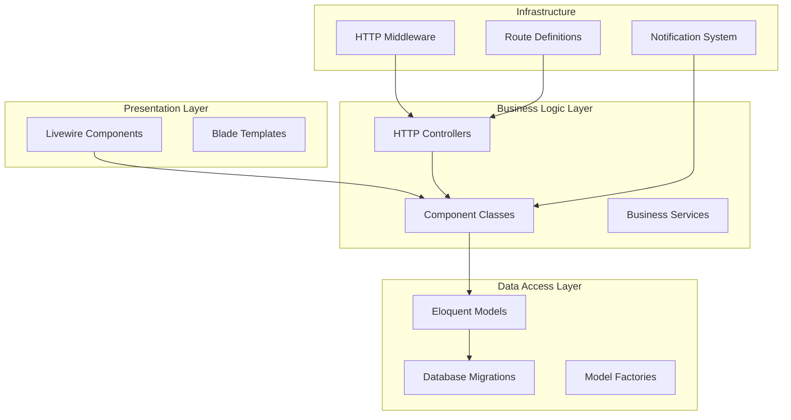
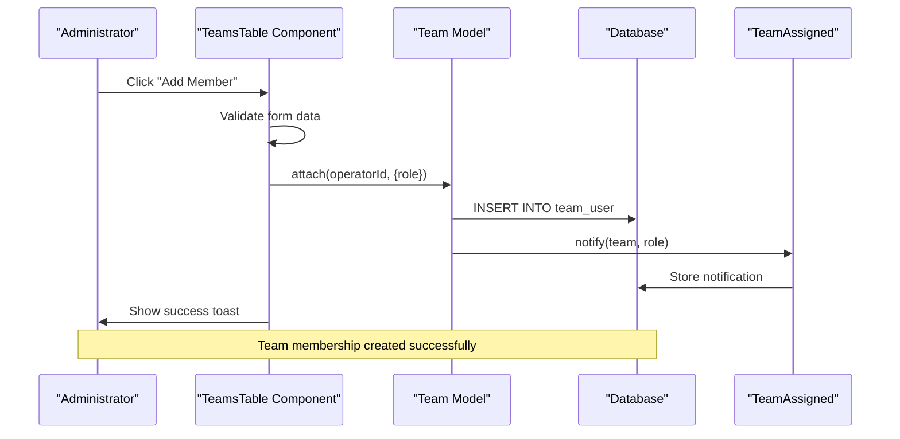
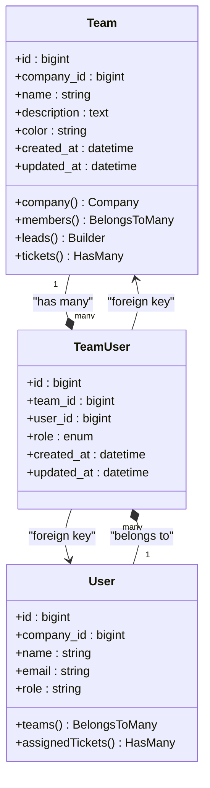
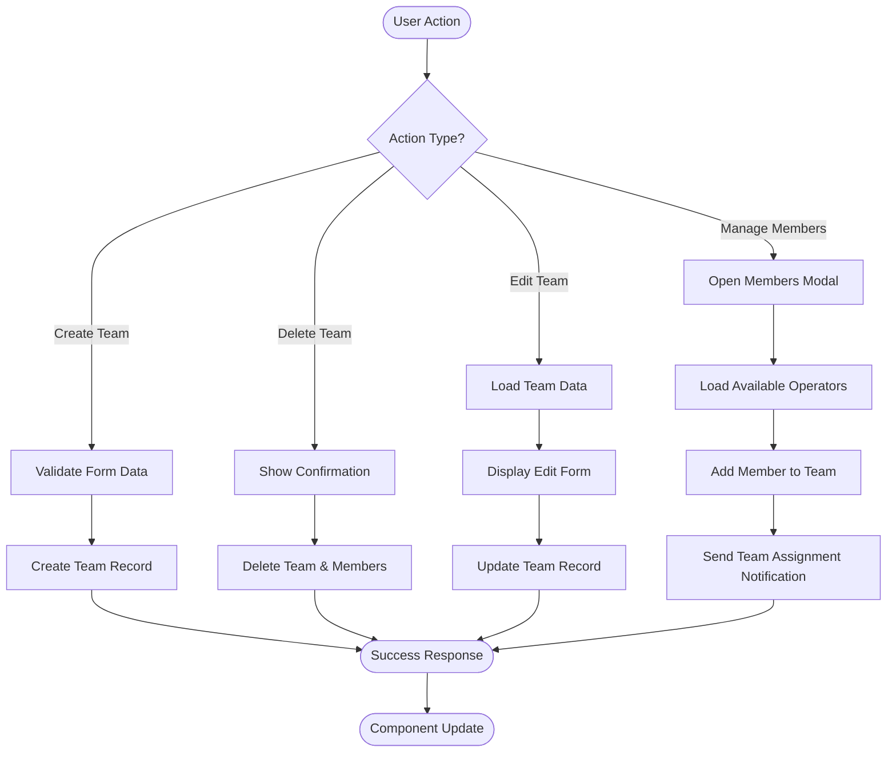
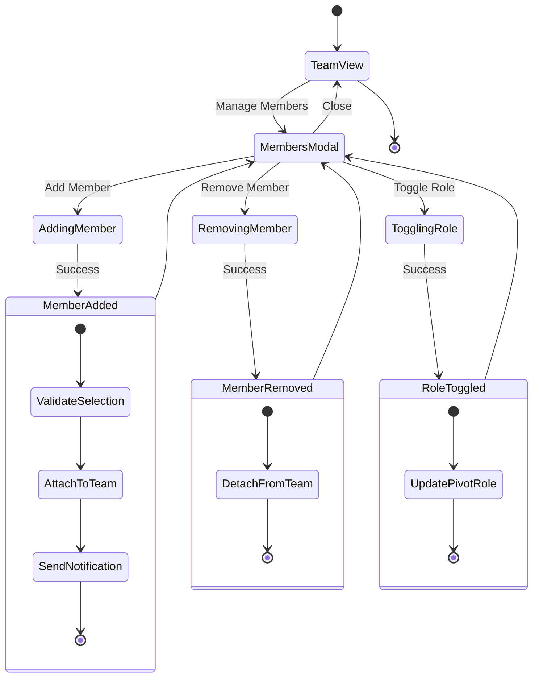
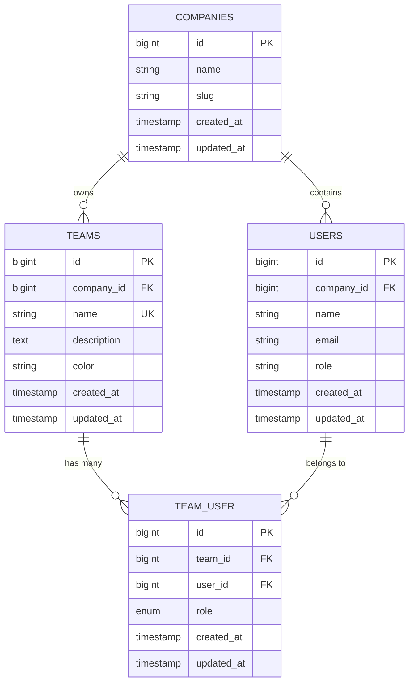
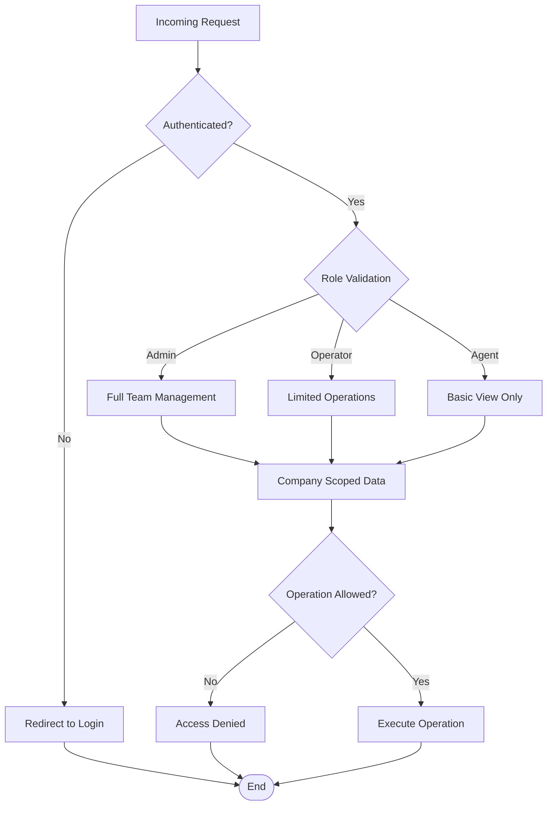
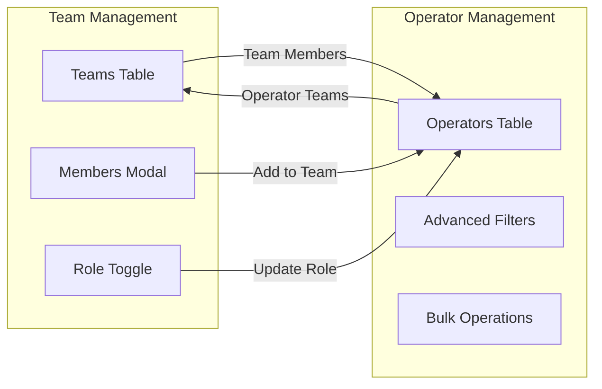
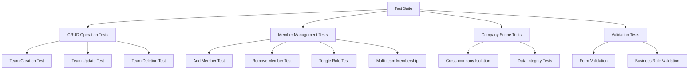

# Team Management System

<cite>
**Referenced Files in This Document**
- [Team.php](file://app/Models/Team.php)
- [User.php](file://app/Models/User.php)
- [TeamsTable.php](file://app/Livewire/Operators/TeamsTable.php)
- [OperatorsTable.php](file://app/Livewire/Operators/OperatorsTable.php)
- [teams-table.blade.php](file://resources/views/livewire/operators/teams-table.blade.php)
- [2026_03_20_110002_create_teams_table.php](file://database/migrations/2026_03_20_110002_create_teams_table.php)
- [2026_03_20_110003_create_team_user_table.php](file://database/migrations/2026_03_20_110003_create_team_user_table.php)
- [AdminOnly.php](file://app/Http/Middleware/AdminOnly.php)
- [AgentOnly.php](file://app/Http/Middleware/AgentOnly.php)
- [web.php](file://routes/web.php)
- [settings.php](file://routes/settings.php)
- [TeamAssigned.php](file://app/Notifications/TeamAssigned.php)
- [TeamManagementTest.php](file://tests/Feature/Teams/TeamManagementTest.php)
</cite>

## Table of Contents
1. [Introduction](#introduction)
2. [Project Structure](#project-structure)
3. [Core Components](#core-components)
4. [Architecture Overview](#architecture-overview)
5. [Detailed Component Analysis](#detailed-component-analysis)
6. [Database Schema](#database-schema)
7. [Access Control](#access-control)
8. [User Interface](#user-interface)
9. [Testing Strategy](#testing-strategy)
10. [Performance Considerations](#performance-considerations)
11. [Troubleshooting Guide](#troubleshooting-guide)
12. [Conclusion](#conclusion)

## Introduction

The Team Management System is a comprehensive module within a helpdesk application that enables organizations to organize their support staff into teams, manage team memberships, and coordinate agent assignments. This system provides administrative capabilities for creating and maintaining teams, assigning operators as team members or leads, and ensuring proper access control through company-scoped visibility.

The system integrates seamlessly with the broader helpdesk platform, supporting features like ticket assignment, notification systems, and automated workflows. It leverages Laravel's Eloquent ORM for data modeling and Livewire for reactive user interfaces.

## Project Structure

The Team Management System is organized across several key architectural layers:



**Diagram sources**
- [TeamsTable.php:1-310](file://app/Livewire/Operators/TeamsTable.php#L1-L310)
- [User.php:1-211](file://app/Models/User.php#L1-L211)
- [Team.php:1-40](file://app/Models/Team.php#L1-L40)

**Section sources**
- [TeamsTable.php:1-310](file://app/Livewire/Operators/TeamsTable.php#L1-L310)
- [User.php:1-211](file://app/Models/User.php#L1-L211)
- [Team.php:1-40](file://app/Models/Team.php#L1-L40)

## Core Components

### Team Model
The Team model serves as the central entity representing organizational units within the helpdesk system. It implements company scoping through global scopes and manages relationships with users and tickets.

Key characteristics:
- **Company Scoping**: Automatically filters teams by company context
- **Membership Management**: Many-to-many relationship with users through pivot table
- **Leadership Tracking**: Built-in method to retrieve team leads
- **Ticket Assignment**: Direct relationship for team-based ticket management

### User Model Enhancements
The User model includes team membership capabilities alongside existing operator functionality, enabling users to belong to multiple teams with different roles.

### TeamsTable Livewire Component
This component provides the primary interface for team management operations including creation, editing, deletion, and member management.

### OperatorsTable Component
Supports team-based operator management with filtering, sorting, and bulk operations capabilities.

**Section sources**
- [Team.php:1-40](file://app/Models/Team.php#L1-L40)
- [User.php:135-138](file://app/Models/User.php#L135-L138)
- [TeamsTable.php:1-310](file://app/Livewire/Operators/TeamsTable.php#L1-L310)
- [OperatorsTable.php:1-521](file://app/Livewire/Operators/OperatorsTable.php#L1-L521)

## Architecture Overview

The Team Management System follows a layered architecture pattern with clear separation of concerns:



**Diagram sources**
- [TeamsTable.php:240-260](file://app/Livewire/Operators/TeamsTable.php#L240-L260)
- [TeamAssigned.php:1-53](file://app/Notifications/TeamAssigned.php#L1-L53)

The architecture ensures:
- **Data Integrity**: Foreign key constraints and validation rules
- **Company Isolation**: Automatic scoping by company context
- **Real-time Updates**: Livewire component updates without page reloads
- **Audit Trail**: Notification system for team membership changes

## Detailed Component Analysis

### Team Model Implementation



**Diagram sources**
- [Team.php:9-39](file://app/Models/Team.php#L9-L39)
- [User.php:135-138](file://app/Models/User.php#L135-L138)
- [2026_03_20_110003_create_team_user_table.php:14-22](file://database/migrations/2026_03_20_110003_create_team_user_table.php#L14-L22)

### TeamsTable Component Operations

The TeamsTable component handles comprehensive team management functionality:



**Diagram sources**
- [TeamsTable.php:142-295](file://app/Livewire/Operators/TeamsTable.php#L142-L295)

**Section sources**
- [TeamsTable.php:1-310](file://app/Livewire/Operators/TeamsTable.php#L1-L310)
- [Team.php:25-38](file://app/Models/Team.php#L25-L38)

### Member Management Workflow

The member management system supports flexible team composition with role-based permissions:



**Diagram sources**
- [TeamsTable.php:240-295](file://app/Livewire/Operators/TeamsTable.php#L240-L295)
- [TeamAssigned.php:15-40](file://app/Notifications/TeamAssigned.php#L15-L40)

**Section sources**
- [TeamsTable.php:223-295](file://app/Livewire/Operators/TeamsTable.php#L223-L295)
- [TeamAssigned.php:1-53](file://app/Notifications/TeamAssigned.php#L1-L53)

## Database Schema

The team management system utilizes a normalized database schema with proper indexing and foreign key constraints:



**Diagram sources**
- [2026_03_20_110002_create_teams_table.php:14-23](file://database/migrations/2026_03_20_110002_create_teams_table.php#L14-L23)
- [2026_03_20_110003_create_team_user_table.php:14-22](file://database/migrations/2026_03_20_110003_create_team_user_table.php#L14-L22)

Key schema features:
- **Unique Team Names**: Per-company uniqueness constraint
- **Role Enum Validation**: Ensures valid member roles ('member' or 'lead')
- **Cascade Operations**: Automatic cleanup of team memberships
- **Company Scoping**: Prevents cross-company data access

**Section sources**
- [2026_03_20_110002_create_teams_table.php:1-34](file://database/migrations/2026_03_20_110002_create_teams_table.php#L1-L34)
- [2026_03_20_110003_create_team_user_table.php:1-33](file://database/migrations/2026_03_20_110003_create_team_user_table.php#L1-L33)

## Access Control

The system implements multi-layered access control to ensure proper security boundaries:



**Diagram sources**
- [AdminOnly.php:16-23](file://app/Http/Middleware/AdminOnly.php#L16-L23)
- [AgentOnly.php:16-23](file://app/Http/Middleware/AgentOnly.php#L16-L23)

Access control mechanisms:
- **Role-Based Permissions**: Different capabilities based on user roles
- **Company Scoping**: Automatic filtering by company context
- **Route-Level Protection**: Middleware applied to specific routes
- **Data Validation**: Server-side validation for all operations

**Section sources**
- [AdminOnly.php:1-25](file://app/Http/Middleware/AdminOnly.php#L1-L25)
- [AgentOnly.php:1-25](file://app/Http/Middleware/AgentOnly.php#L1-L25)
- [web.php:142-150](file://routes/web.php#L142-L150)

## User Interface

The user interface provides intuitive team management through Livewire components:

### Teams Management Interface

The TeamsTable component offers comprehensive team administration:

| Feature | Description | Implementation |
|---------|-------------|----------------|
| **Team Creation** | Form-based team creation with validation | TeamsTable::createTeam() |
| **Team Editing** | Modal-based editing with real-time validation | TeamsTable::updateTeam() |
| **Team Deletion** | Confirmation dialog with cascade cleanup | TeamsTable::deleteTeam() |
| **Member Management** | Dynamic member addition/removal | TeamsTable::addMember()/removeMember() |
| **Role Management** | Toggle between member/lead roles | TeamsTable::toggleMemberRole() |

### Operators Integration

The system integrates team management with operator management:



**Diagram sources**
- [teams-table.blade.php:214-288](file://resources/views/livewire/operators/teams-table.blade.php#L214-L288)
- [OperatorsTable.php:150-184](file://app/Livewire/Operators/OperatorsTable.php#L150-L184)

**Section sources**
- [teams-table.blade.php:1-290](file://resources/views/livewire/operators/teams-table.blade.php#L1-L290)
- [OperatorsTable.php:134-184](file://app/Livewire/Operators/OperatorsTable.php#L134-L184)

## Testing Strategy

The system includes comprehensive test coverage for team management functionality:

### Test Coverage Areas

| Test Category | Coverage | Implementation |
|---------------|----------|----------------|
| **Team CRUD Operations** | Create, Read, Update, Delete | TeamManagementTest.php |
| **Member Management** | Add, Remove, Role Changes | TeamManagementTest.php |
| **Company Scoping** | Cross-company isolation | TeamManagementTest.php |
| **Validation Rules** | Form validation enforcement | TeamsTable.php |
| **Notification System** | Team assignment notifications | TeamAssigned.php |

### Key Test Scenarios



**Diagram sources**
- [TeamManagementTest.php:86-182](file://tests/Feature/Teams/TeamManagementTest.php#L86-L182)

**Section sources**
- [TeamManagementTest.php:86-182](file://tests/Feature/Teams/TeamManagementTest.php#L86-L182)

## Performance Considerations

### Database Optimization

The system implements several performance optimization strategies:

- **Eager Loading**: Strategic use of with() clauses to prevent N+1 queries
- **Indexing**: Proper indexing on frequently queried columns
- **Company Scoping**: Global scopes reduce query complexity
- **Pagination**: Efficient pagination for large datasets

### Caching Strategy

```mermaid
flowchart TD
DataChange[Data Change Event] --> CacheClear[Clear Company Cache]
CacheClear --> CacheRefresh[Cache Refresh on Next Request]
subgraph "Cache Keys"
Agents[company.{id}.agents]
Categories[company.{id}.categories]
end
DataChange --> Agents
DataChange --> Categories
```

**Diagram sources**
- [User.php:199-209](file://app/Models/User.php#L199-L209)

### Frontend Performance

- **Livewire Optimization**: Minimal state updates and efficient re-rendering
- **Debounced Search**: 500ms debounce for search operations
- **Modal Lazy Loading**: Components loaded only when needed
- **Progressive Enhancement**: Graceful degradation for JavaScript-disabled clients

## Troubleshooting Guide

### Common Issues and Solutions

| Issue | Symptoms | Solution |
|-------|----------|----------|
| **Team Not Visible** | Team appears in database but not in UI | Check company scoping and authentication |
| **Member Addition Fails** | Validation errors on member add | Verify operator belongs to same company |
| **Role Toggle Not Working** | Role remains unchanged after toggle | Check team membership existence |
| **Cross-company Data Access** | Seeing other company's teams | Verify CompanyScope implementation |
| **Notification Delivery** | No team assignment notifications | Check notification preferences |

### Debug Procedures

1. **Database Verification**: Check team_user table for proper relationships
2. **Authentication Review**: Verify user role and company association
3. **Middleware Inspection**: Confirm route middleware application
4. **Cache Clearing**: Clear company-specific caches after data changes
5. **Notification Testing**: Verify notification delivery channels

**Section sources**
- [TeamsTable.php:240-295](file://app/Livewire/Operators/TeamsTable.php#L240-L295)
- [User.php:199-209](file://app/Models/User.php#L199-L209)

## Conclusion

The Team Management System provides a robust foundation for organizing helpdesk support teams within the broader application ecosystem. Its architecture emphasizes security through company scoping, flexibility through role-based permissions, and user experience through reactive interfaces.

Key strengths of the implementation include:

- **Security by Design**: Comprehensive access control and data isolation
- **Extensible Architecture**: Clean separation of concerns and modular components
- **User Experience**: Intuitive interfaces with real-time feedback
- **Data Integrity**: Proper validation and constraint enforcement
- **Test Coverage**: Comprehensive testing strategy ensuring reliability

The system successfully integrates with the larger helpdesk platform while maintaining clear boundaries and optimal performance characteristics. Future enhancements could include advanced team hierarchies, automated team assignment rules, and enhanced reporting capabilities.