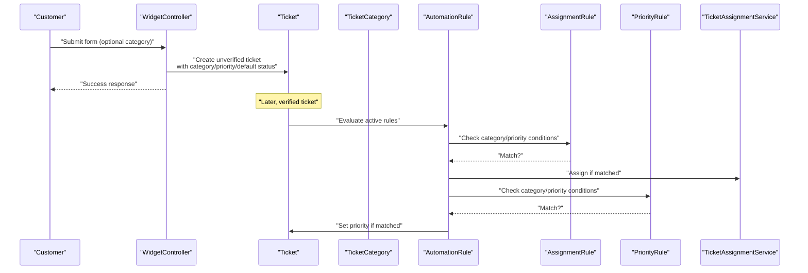
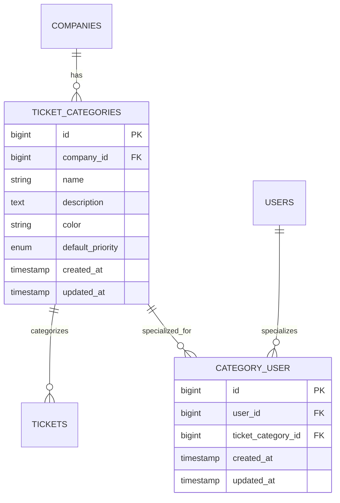
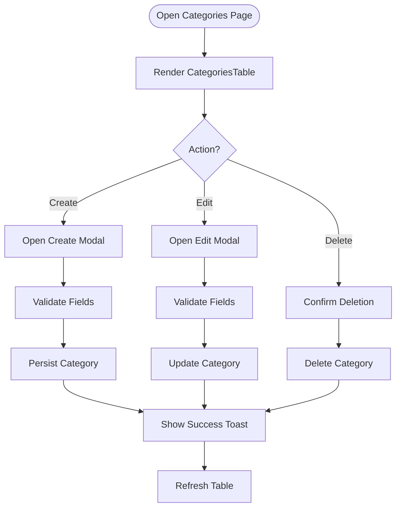
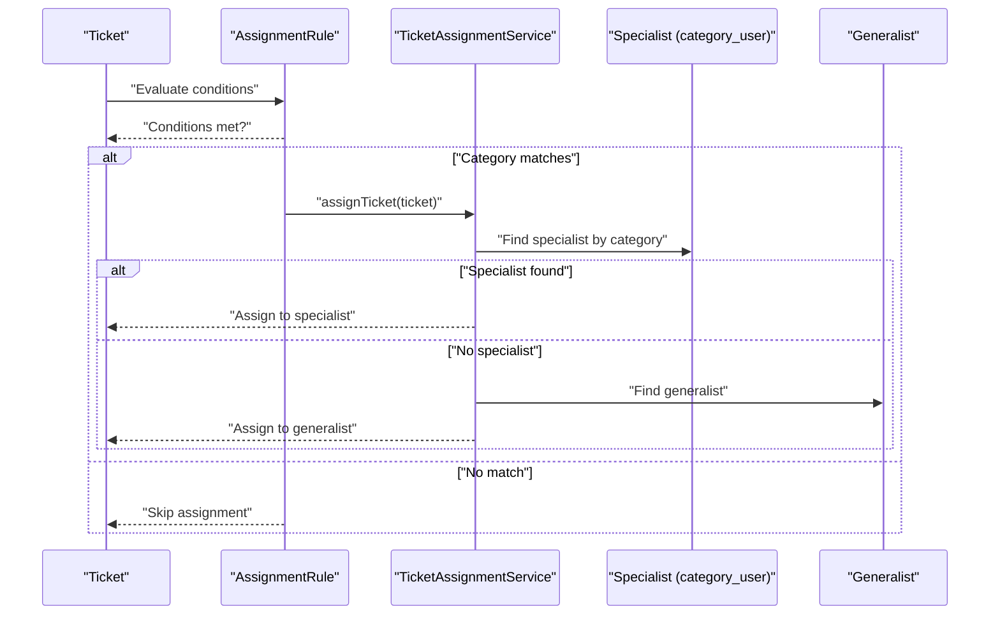
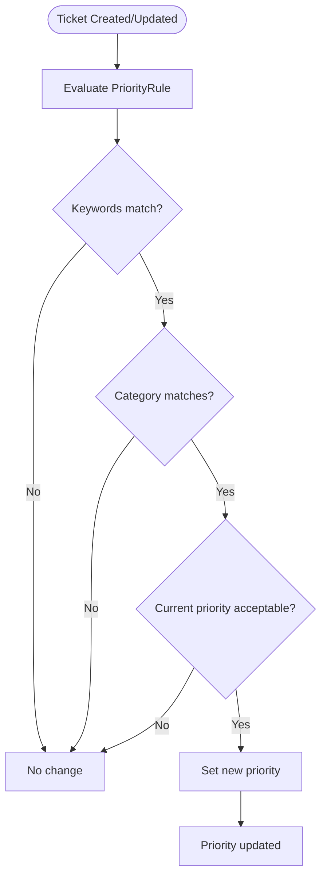
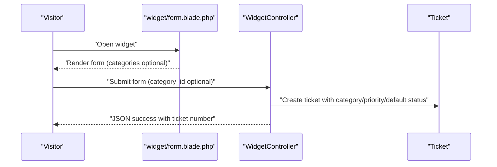
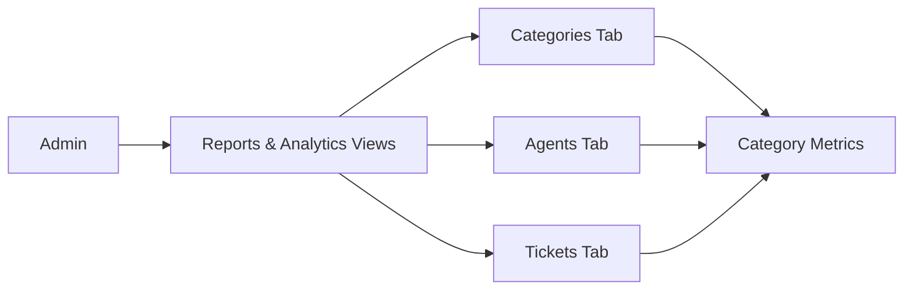
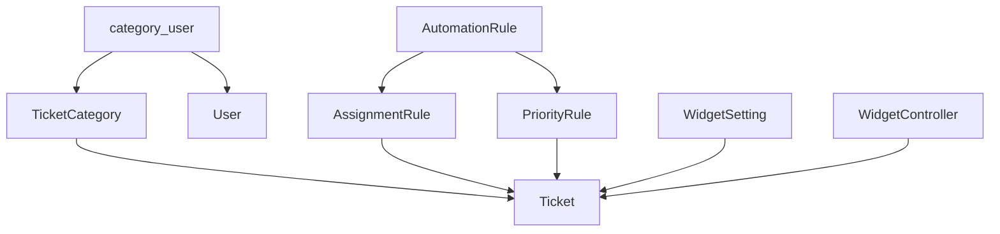

# Ticket Categorization & Organization

<cite>
**Referenced Files in This Document**
- [TicketCategory.php](file://app/Models/TicketCategory.php)
- [2026_02_01_224218_create_ticket_categories_table.php](file://database/migrations/2026_02_01_224218_create_ticket_categories_table.php)
- [2026_03_14_073653_create_category_user_table.php](file://database/migrations/2026_03_14_073653_create_category_user_table.php)
- [CategoriesTable.php](file://app/Livewire/Dashboard/CategoriesTable.php)
- [categories.blade.php](file://resources/views/dashboard/categories.blade.php)
- [Ticket.php](file://app/Models/Ticket.php)
- [WidgetController.php](file://app/Http/Controllers/WidgetController.php)
- [form.blade.php](file://resources/views/widget/form.blade.php)
- [WidgetSetting.php](file://app/Models/WidgetSetting.php)
- [2026_02_06_154114_create_widget_settings_table.php](file://database/migrations/2026_02_06_154114_create_widget_settings_table.php)
- [AssignmentRule.php](file://app/Services/Automation/Rules/AssignmentRule.php)
- [PriorityRule.php](file://app/Services/Automation/Rules/PriorityRule.php)
- [TicketAssignmentService.php](file://app/Services/TicketAssignmentService.php)
- [AutomationRule.php](file://app/Models/AutomationRule.php)
- [2026_03_09_104729_create_automation_rules_table.php](file://database/migrations/2026_03_09_104729_create_automation_rules_table.php)
</cite>

## Table of Contents
1. [Introduction](#introduction)
2. [Project Structure](#project-structure)
3. [Core Components](#core-components)
4. [Architecture Overview](#architecture-overview)
5. [Detailed Component Analysis](#detailed-component-analysis)
6. [Dependency Analysis](#dependency-analysis)
7. [Performance Considerations](#performance-considerations)
8. [Troubleshooting Guide](#troubleshooting-guide)
9. [Conclusion](#conclusion)
10. [Appendices](#appendices)

## Introduction
This document explains the ticket categorization and organization system. It covers the hierarchical category model, how categories influence ticket routing, priority defaults, automation rules, and reporting. It also documents the category-user relationships for agent specialization, the category management interface for administrators, integration with the widget system for pre-categorized submissions, and analytics/reporting capabilities.

## Project Structure
The categorization system spans models, migrations, Livewire components, controllers, and views. Categories are defined per company, support optional color and default priority, and can be associated with specialists. Automation rules use categories to drive assignment and priority changes. The widget integrates categories into pre-submitted tickets.

```mermaid
graph TB
subgraph "Models"
TC["TicketCategory"]
T["Ticket"]
WS["WidgetSetting"]
AR["AutomationRule"]
end
subgraph "UI"
CT["CategoriesTable (Livewire)"]
CB["categories.blade.php"]
WF["widget/form.blade.php"]
end
subgraph "Controllers"
WC["WidgetController"]
end
subgraph "Services"
TAS["TicketAssignmentService"]
ASgn["AssignmentRule"]
APri["PriorityRule"]
end
subgraph "DB"
MTC["ticket_categories"]
MCU["category_user"]
MAR["automation_rules"]
MWS["widget_settings"]
end
CT --> TC
CB --> CT
WC --> T
WC --> WS
T --> TC
TAS --> T
TAS --> TC
ASgn --> T
ASgn --> TC
APri --> T
APri --> TC
AR --> ASgn
AR --> APri
TC < --> MCU
TC --> MTC
AR --> MAR
WS --> MWS
```

**Diagram sources**
- [TicketCategory.php:1-14](file://app/Models/TicketCategory.php#L1-L14)
- [Ticket.php:1-64](file://app/Models/Ticket.php#L1-L64)
- [WidgetController.php:1-197](file://app/Http/Controllers/WidgetController.php#L1-L197)
- [WidgetSetting.php:1-71](file://app/Models/WidgetSetting.php#L1-L71)
- [AutomationRule.php:1-117](file://app/Models/AutomationRule.php#L1-L117)
- [CategoriesTable.php:1-203](file://app/Livewire/Dashboard/CategoriesTable.php#L1-L203)
- [categories.blade.php:1-18](file://resources/views/dashboard/categories.blade.php#L1-L18)
- [form.blade.php:1-250](file://resources/views/widget/form.blade.php#L1-L250)
- [TicketAssignmentService.php:1-179](file://app/Services/TicketAssignmentService.php#L1-L179)
- [AssignmentRule.php:1-67](file://app/Services/Automation/Rules/AssignmentRule.php#L1-L67)
- [PriorityRule.php:1-69](file://app/Services/Automation/Rules/PriorityRule.php#L1-L69)
- [2026_02_01_224218_create_ticket_categories_table.php:1-33](file://database/migrations/2026_02_01_224218_create_ticket_categories_table.php#L1-L33)
- [2026_03_14_073653_create_category_user_table.php:1-32](file://database/migrations/2026_03_14_073653_create_category_user_table.php#L1-L32)
- [2026_03_09_104729_create_automation_rules_table.php:1-53](file://database/migrations/2026_03_09_104729_create_automation_rules_table.php#L1-L53)
- [2026_02_06_154114_create_widget_settings_table.php:1-46](file://database/migrations/2026_02_06_154114_create_widget_settings_table.php#L1-L46)

**Section sources**
- [TicketCategory.php:1-14](file://app/Models/TicketCategory.php#L1-L14)
- [Ticket.php:1-64](file://app/Models/Ticket.php#L1-L64)
- [WidgetController.php:1-197](file://app/Http/Controllers/WidgetController.php#L1-L197)
- [WidgetSetting.php:1-71](file://app/Models/WidgetSetting.php#L1-L71)
- [AutomationRule.php:1-117](file://app/Models/AutomationRule.php#L1-L117)
- [CategoriesTable.php:1-203](file://app/Livewire/Dashboard/CategoriesTable.php#L1-L203)
- [categories.blade.php:1-18](file://resources/views/dashboard/categories.blade.php#L1-L18)
- [form.blade.php:1-250](file://resources/views/widget/form.blade.php#L1-L250)
- [TicketAssignmentService.php:1-179](file://app/Services/TicketAssignmentService.php#L1-L179)
- [AssignmentRule.php:1-67](file://app/Services/Automation/Rules/AssignmentRule.php#L1-L67)
- [PriorityRule.php:1-69](file://app/Services/Automation/Rules/PriorityRule.php#L1-L69)
- [2026_02_01_224218_create_ticket_categories_table.php:1-33](file://database/migrations/2026_02_01_224218_create_ticket_categories_table.php#L1-L33)
- [2026_03_14_073653_create_category_user_table.php:1-32](file://database/migrations/2026_03_14_073653_create_category_user_table.php#L1-L32)
- [2026_03_09_104729_create_automation_rules_table.php:1-53](file://database/migrations/2026_03_09_104729_create_automation_rules_table.php#L1-L53)
- [2026_02_06_154114_create_widget_settings_table.php:1-46](file://database/migrations/2026_02_06_154114_create_widget_settings_table.php#L1-L46)

## Core Components
- TicketCategory: Defines category metadata (name, description, color, default_priority) scoped to a company and indexed for uniqueness.
- Ticket: Associates tickets with categories and companies; supports relations to category and assigned user.
- WidgetSetting: Controls whether categories appear in the widget and sets default ticket attributes.
- WidgetController: Handles widget form rendering and submission, including optional category selection and default priority/status assignment.
- CategoriesTable (Livewire): Admin UI for CRUD operations on categories with validation and sorting/searching.
- TicketAssignmentService: Auto-assigns tickets to specialists by category or generalists when no category is present.
- AutomationRule + Rules: Category-aware assignment and priority rules that trigger actions based on conditions.

**Section sources**
- [TicketCategory.php:1-14](file://app/Models/TicketCategory.php#L1-L14)
- [Ticket.php:1-64](file://app/Models/Ticket.php#L1-L64)
- [WidgetSetting.php:1-71](file://app/Models/WidgetSetting.php#L1-L71)
- [WidgetController.php:1-197](file://app/Http/Controllers/WidgetController.php#L1-L197)
- [CategoriesTable.php:1-203](file://app/Livewire/Dashboard/CategoriesTable.php#L1-L203)
- [TicketAssignmentService.php:1-179](file://app/Services/TicketAssignmentService.php#L1-L179)
- [AutomationRule.php:1-117](file://app/Models/AutomationRule.php#L1-L117)

## Architecture Overview
Categories are central to routing, priority defaults, and automation. The widget pre-populates categories for convenient submission. Specialized agents can be linked to categories to improve assignment accuracy.



**Diagram sources**
- [WidgetController.php:41-109](file://app/Http/Controllers/WidgetController.php#L41-L109)
- [Ticket.php:1-64](file://app/Models/Ticket.php#L1-L64)
- [TicketCategory.php:1-14](file://app/Models/TicketCategory.php#L1-L14)
- [AssignmentRule.php:15-48](file://app/Services/Automation/Rules/AssignmentRule.php#L15-L48)
- [PriorityRule.php:11-52](file://app/Services/Automation/Rules/PriorityRule.php#L11-L52)
- [TicketAssignmentService.php:22-39](file://app/Services/TicketAssignmentService.php#L22-L39)

## Detailed Component Analysis

### Category Model and Schema
- Each category belongs to a company and has a unique name within that company.
- Optional color and default_priority are stored with the category.
- A pivot table links users to categories to mark specialists.



**Diagram sources**
- [2026_02_01_224218_create_ticket_categories_table.php:11-25](file://database/migrations/2026_02_01_224218_create_ticket_categories_table.php#L11-L25)
- [2026_03_14_073653_create_category_user_table.php:14-21](file://database/migrations/2026_03_14_073653_create_category_user_table.php#L14-L21)
- [Ticket.php:26-29](file://app/Models/Ticket.php#L26-L29)

**Section sources**
- [2026_02_01_224218_create_ticket_categories_table.php:1-33](file://database/migrations/2026_02_01_224218_create_ticket_categories_table.php#L1-L33)
- [2026_03_14_073653_create_category_user_table.php:1-32](file://database/migrations/2026_03_14_073653_create_category_user_table.php#L1-L32)
- [TicketCategory.php:1-14](file://app/Models/TicketCategory.php#L1-L14)
- [Ticket.php:1-64](file://app/Models/Ticket.php#L1-L64)

### Category Management Interface (Admin)
- Admins can create, edit, and delete categories with validation ensuring unique names per company.
- Sorting and search are supported in the Livewire table.
- The view provides an “Add Category” button to open the creation modal.



**Diagram sources**
- [CategoriesTable.php:107-187](file://app/Livewire/Dashboard/CategoriesTable.php#L107-L187)
- [categories.blade.php:4-16](file://resources/views/dashboard/categories.blade.php#L4-L16)

**Section sources**
- [CategoriesTable.php:1-203](file://app/Livewire/Dashboard/CategoriesTable.php#L1-L203)
- [categories.blade.php:1-18](file://resources/views/dashboard/categories.blade.php#L1-L18)

### Category-Based Routing and Assignment
- AssignmentRule evaluates category and priority conditions and triggers either default assignment or explicit operator assignment.
- TicketAssignmentService assigns to a specialist matching the ticket’s category, falling back to generalists if needed.
- Specialties are enforced via the category_user pivot.



**Diagram sources**
- [AssignmentRule.php:15-65](file://app/Services/Automation/Rules/AssignmentRule.php#L15-L65)
- [TicketAssignmentService.php:22-94](file://app/Services/TicketAssignmentService.php#L22-L94)
- [2026_03_14_073653_create_category_user_table.php:14-21](file://database/migrations/2026_03_14_073653_create_category_user_table.php#L14-L21)

**Section sources**
- [AssignmentRule.php:1-67](file://app/Services/Automation/Rules/AssignmentRule.php#L1-L67)
- [TicketAssignmentService.php:1-179](file://app/Services/TicketAssignmentService.php#L1-L179)
- [2026_03_14_073653_create_category_user_table.php:1-32](file://database/migrations/2026_03_14_073653_create_category_user_table.php#L1-L32)

### Category-Based Priority Automation
- PriorityRule checks keyword presence, category, and current priority conditions to raise or set a new priority.
- This allows dynamic priority adjustments based on category and content.



**Diagram sources**
- [PriorityRule.php:11-67](file://app/Services/Automation/Rules/PriorityRule.php#L11-L67)

**Section sources**
- [PriorityRule.php:1-69](file://app/Services/Automation/Rules/PriorityRule.php#L1-L69)

### Category Defaults and Widget Integration
- WidgetSetting controls whether categories are shown in the widget and sets default status, priority, and assignment.
- WidgetController creates tickets with optional category_id and applies widget defaults.
- The widget form renders category options when enabled and available.



**Diagram sources**
- [WidgetSetting.php:13-17](file://app/Models/WidgetSetting.php#L13-L17)
- [WidgetController.php:41-109](file://app/Http/Controllers/WidgetController.php#L41-L109)
- [form.blade.php:150-163](file://resources/views/widget/form.blade.php#L150-L163)

**Section sources**
- [WidgetSetting.php:1-71](file://app/Models/WidgetSetting.php#L1-L71)
- [WidgetController.php:1-197](file://app/Http/Controllers/WidgetController.php#L1-L197)
- [form.blade.php:1-250](file://resources/views/widget/form.blade.php#L1-L250)
- [2026_02_06_154114_create_widget_settings_table.php:1-46](file://database/migrations/2026_02_06_154114_create_widget_settings_table.php#L1-L46)

### Category Analytics and Utilization Reporting
- The system supports category analytics and utilization reporting via dedicated views and tables.
- Administrators can view category usage and performance metrics through the reports/analytics pages.



[No sources needed since this diagram shows conceptual workflow, not actual code structure]

**Section sources**
- [categories.blade.php:1-18](file://resources/views/dashboard/categories.blade.php#L1-L18)

## Dependency Analysis
- Categories are owned by companies and indexed for uniqueness.
- Tickets belong to categories and companies; category_id influences assignment and automation.
- Automation rules depend on category_id and priority to trigger actions.
- Specializations are modeled via category_user, linking users to categories.



**Diagram sources**
- [Ticket.php:1-64](file://app/Models/Ticket.php#L1-L64)
- [TicketCategory.php:1-14](file://app/Models/TicketCategory.php#L1-L14)
- [2026_03_14_073653_create_category_user_table.php:14-21](file://database/migrations/2026_03_14_073653_create_category_user_table.php#L14-L21)
- [AssignmentRule.php:1-67](file://app/Services/Automation/Rules/AssignmentRule.php#L1-L67)
- [PriorityRule.php:1-69](file://app/Services/Automation/Rules/PriorityRule.php#L1-L69)
- [WidgetSetting.php:1-71](file://app/Models/WidgetSetting.php#L1-L71)
- [WidgetController.php:1-197](file://app/Http/Controllers/WidgetController.php#L1-L197)

**Section sources**
- [Ticket.php:1-64](file://app/Models/Ticket.php#L1-L64)
- [TicketCategory.php:1-14](file://app/Models/TicketCategory.php#L1-L14)
- [2026_03_14_073653_create_category_user_table.php:1-32](file://database/migrations/2026_03_14_073653_create_category_user_table.php#L1-L32)
- [AssignmentRule.php:1-67](file://app/Services/Automation/Rules/AssignmentRule.php#L1-L67)
- [PriorityRule.php:1-69](file://app/Services/Automation/Rules/PriorityRule.php#L1-L69)
- [WidgetSetting.php:1-71](file://app/Models/WidgetSetting.php#L1-L71)
- [WidgetController.php:1-197](file://app/Http/Controllers/WidgetController.php#L1-L197)

## Performance Considerations
- Indexes on company_id and unique constraints on (company_id, name) for categories optimize lookups and enforce uniqueness.
- Pagination in the categories table reduces load on large datasets.
- Automation rule evaluation short-circuits on unverified tickets and existing assignments to avoid unnecessary work.
- Assignment prioritizes specialists by workload to balance queues efficiently.

[No sources needed since this section provides general guidance]

## Troubleshooting Guide
- Category creation fails validation: Ensure the category name is unique within the company and meets length/format constraints.
- Tickets not auto-assigned: Verify the ticket is marked verified and has a category if specialization is required; confirm automation rules are active and properly configured.
- Widget does not show categories: Confirm widget settings enable category display and that categories exist for the company.
- Priority not changing: Check that keywords or category conditions in the priority rule match the ticket and that the current priority allows raising.

**Section sources**
- [CategoriesTable.php:42-56](file://app/Livewire/Dashboard/CategoriesTable.php#L42-L56)
- [AssignmentRule.php:15-48](file://app/Services/Automation/Rules/AssignmentRule.php#L15-L48)
- [PriorityRule.php:11-52](file://app/Services/Automation/Rules/PriorityRule.php#L11-L52)
- [WidgetSetting.php:13-17](file://app/Models/WidgetSetting.php#L13-L17)
- [WidgetController.php:55-56](file://app/Http/Controllers/WidgetController.php#L55-L56)

## Conclusion
The categorization system provides a robust foundation for organizing tickets, guiding routing to specialized agents, setting default priorities, and enabling dynamic priority adjustments via automation. Administrators can manage categories through a streamlined UI, while the widget integrates categories into the customer submission flow. Reporting and analytics surfaces help monitor utilization and performance across categories.

[No sources needed since this section summarizes without analyzing specific files]

## Appendices

### Appendix A: Category Management Workflows
- Creation: Admin opens the create modal, fills details, validates, persists, and receives a success toast.
- Modification: Admin selects a category, edits fields, validates, updates, and refreshes the table.
- Deletion: Admin confirms deletion; the system removes the category and notifies.

**Section sources**
- [CategoriesTable.php:107-187](file://app/Livewire/Dashboard/CategoriesTable.php#L107-L187)
- [categories.blade.php:4-16](file://resources/views/dashboard/categories.blade.php#L4-L16)

### Appendix B: Automation Rule Types and Category Conditions
- AssignmentRule: Matches category_id and priority; can assign to specialists or specific operators.
- PriorityRule: Matches keywords, category_id, and current priority; raises or sets a new priority.

**Section sources**
- [AssignmentRule.php:1-67](file://app/Services/Automation/Rules/AssignmentRule.php#L1-L67)
- [PriorityRule.php:1-69](file://app/Services/Automation/Rules/PriorityRule.php#L1-L69)
- [AutomationRule.php:27-34](file://app/Models/AutomationRule.php#L27-L34)