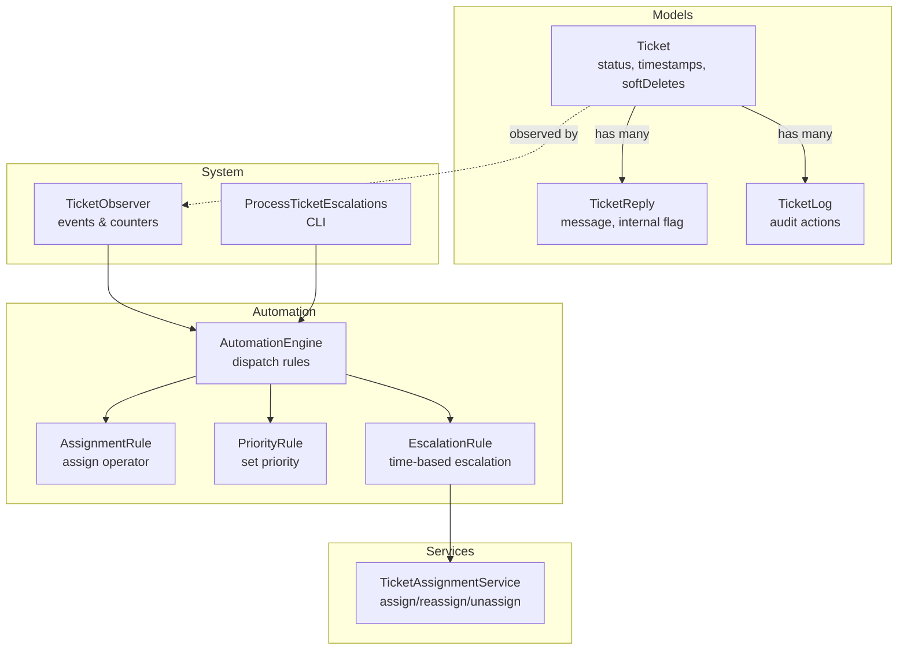
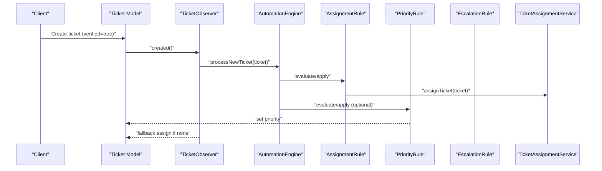
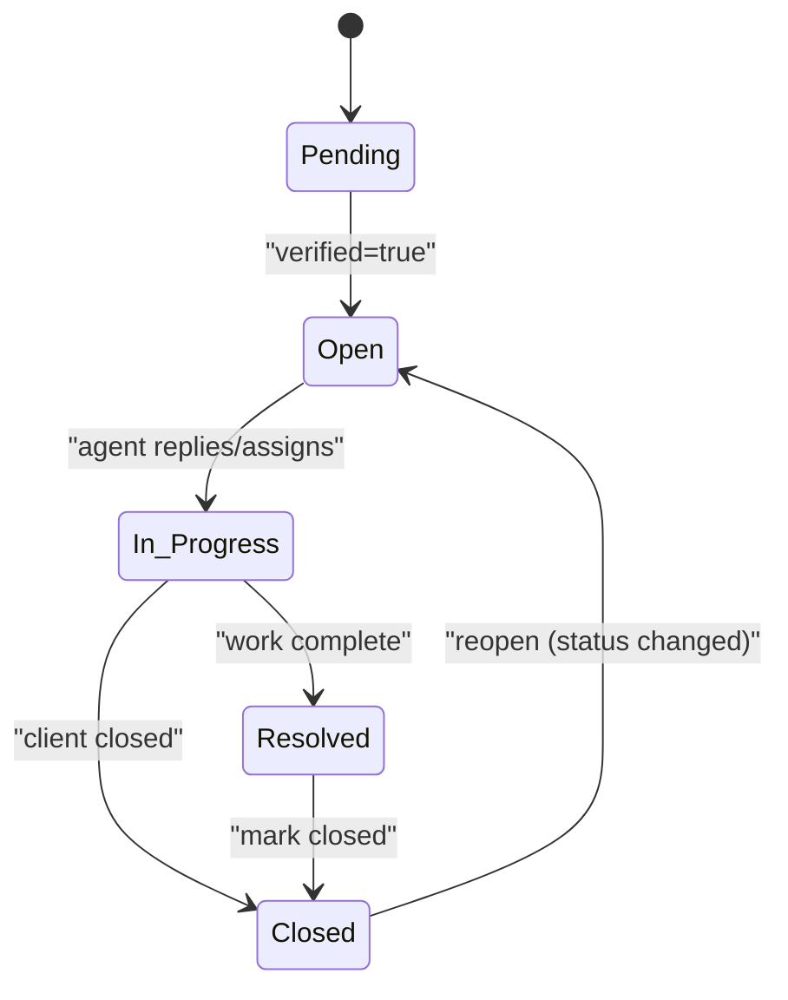
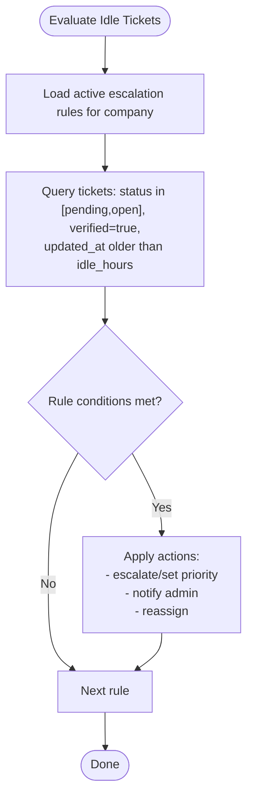
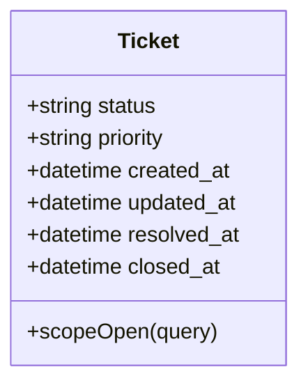
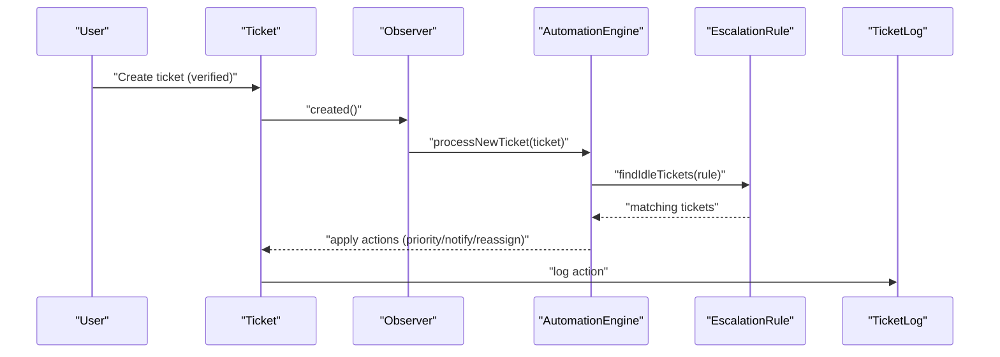
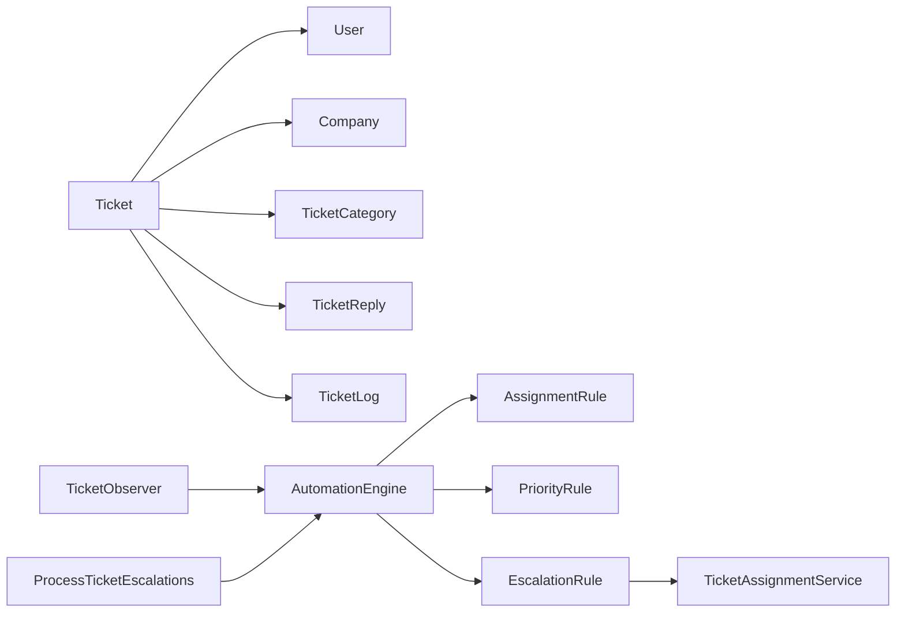

# Ticket Lifecycle & Status Management

<cite>
**Referenced Files in This Document**
- [Ticket.php](file://app/Models/Ticket.php)
- [TicketReply.php](file://app/Models/TicketReply.php)
- [TicketLog.php](file://app/Models/TicketLog.php)
- [2026_02_01_224222_create_tickets_table.php](file://database/migrations/2026_02_01_224222_create_tickets_table.php)
- [2026_02_01_224225_create_ticket_replies_table.php](file://database/migrations/2026_02_01_224225_create_ticket_replies_table.php)
- [2026_03_10_230354_create_ticket_logs_table.php](file://database/migrations/2026_03_10_230354_create_ticket_logs_table.php)
- [AutomationEngine.php](file://app/Services/Automation/AutomationEngine.php)
- [EscalationRule.php](file://app/Services/Automation/Rules/EscalationRule.php)
- [AssignmentRule.php](file://app/Services/Automation/Rules/AssignmentRule.php)
- [PriorityRule.php](file://app/Services/Automation/Rules/PriorityRule.php)
- [TicketAssignmentService.php](file://app/Services/TicketAssignmentService.php)
- [TicketObserver.php](file://app/Observers/TicketObserver.php)
- [ProcessTicketEscalations.php](file://app/Console/Commands/ProcessTicketEscalations.php)
- [TicketsController.php](file://app/Http/Controllers/TicketsController.php)
</cite>

## Table of Contents
1. [Introduction](#introduction)
2. [Project Structure](#project-structure)
3. [Core Components](#core-components)
4. [Architecture Overview](#architecture-overview)
5. [Detailed Component Analysis](#detailed-component-analysis)
6. [Dependency Analysis](#dependency-analysis)
7. [Performance Considerations](#performance-considerations)
8. [Troubleshooting Guide](#troubleshooting-guide)
9. [Conclusion](#conclusion)
10. [Appendices](#appendices)

## Introduction
This document explains the complete ticket lifecycle and status management in the HelpDesk System. It covers all status states (Open, In Progress, Pending, Resolved, Closed), their transitions, automated triggers (replies, time-based escalation, priority rules), timestamp tracking (created_at, updated_at, resolved_at, closed_at), soft delete and archive behavior, scope-based filtering for open tickets, and audit trail via logs. It also provides diagrams and references to the actual code that implements these behaviors.

## Project Structure
The ticket lifecycle spans several layers:
- Models define schema, attributes, relationships, scopes, and timestamps.
- Observers react to model events to trigger automation and maintain operator counters.
- Automation engine executes rules (assignment, priority, auto-reply, escalation).
- Rules encapsulate evaluation and application logic for status/priority changes.
- Console commands orchestrate periodic tasks like escalation processing.
- Controllers expose ticket details for UI consumption.

**Diagram sources**
- [Ticket.php:1-64](file://app/Models/Ticket.php#L1-L64)
- [TicketReply.php:1-39](file://app/Models/TicketReply.php#L1-L39)
- [TicketLog.php:1-26](file://app/Models/TicketLog.php#L1-L26)
- [AutomationEngine.php:1-142](file://app/Services/Automation/AutomationEngine.php#L1-L142)
- [AssignmentRule.php:1-67](file://app/Services/Automation/Rules/AssignmentRule.php#L1-L67)
- [PriorityRule.php:1-69](file://app/Services/Automation/Rules/PriorityRule.php#L1-L69)
- [EscalationRule.php:1-157](file://app/Services/Automation/Rules/EscalationRule.php#L1-L157)
- [TicketAssignmentService.php:1-179](file://app/Services/TicketAssignmentService.php#L1-L179)
- [TicketObserver.php:1-109](file://app/Observers/TicketObserver.php#L1-L109)
- [ProcessTicketEscalations.php:1-55](file://app/Console/Commands/ProcessTicketEscalations.php#L1-L55)

**Section sources**
- [Ticket.php:1-64](file://app/Models/Ticket.php#L1-L64)
- [AutomationEngine.php:1-142](file://app/Services/Automation/AutomationEngine.php#L1-L142)
- [TicketObserver.php:1-109](file://app/Observers/TicketObserver.php#L1-L109)
- [ProcessTicketEscalations.php:1-55](file://app/Console/Commands/ProcessTicketEscalations.php#L1-L55)

## Core Components
- Ticket model
  - Enumerated statuses: pending, open, in_progress, resolved, closed.
  - Timestamps: created_at, updated_at, resolved_at, closed_at.
  - Soft deletes enabled.
  - Scope to filter open tickets (open, in_progress, pending).
  - Relationships: belongs to company/category/user; has many replies/logs.
- TicketReply model
  - Stores replies with internal/public distinction and attachments.
  - Belongs to Ticket and User.
- TicketLog model
  - Records audit actions for a ticket.
- AutomationEngine
  - Dispatches rules by type and company.
  - Processes new tickets and escalations.
- Rules
  - AssignmentRule: assigns operator based on category/priority.
  - PriorityRule: sets priority based on keywords/category/current priority.
  - EscalationRule: increases priority or notifies admins after idle threshold.
- TicketAssignmentService
  - Assigns specialists/generalists; supports reassign/unassign with counters.
- TicketObserver
  - Triggers automation on created/verified updates.
  - Maintains operator assigned_tickets_count on status changes and lifecycle events.

**Section sources**
- [Ticket.php:25-62](file://app/Models/Ticket.php#L25-L62)
- [TicketReply.php:10-37](file://app/Models/TicketReply.php#L10-L37)
- [TicketLog.php:9-24](file://app/Models/TicketLog.php#L9-L24)
- [AutomationEngine.php:27-96](file://app/Services/Automation/AutomationEngine.php#L27-L96)
- [AssignmentRule.php:15-65](file://app/Services/Automation/Rules/AssignmentRule.php#L15-L65)
- [PriorityRule.php:11-67](file://app/Services/Automation/Rules/PriorityRule.php#L11-L67)
- [EscalationRule.php:24-85](file://app/Services/Automation/Rules/EscalationRule.php#L24-L85)
- [TicketAssignmentService.php:22-108](file://app/Services/TicketAssignmentService.php#L22-L108)
- [TicketObserver.php:21-71](file://app/Observers/TicketObserver.php#L21-L71)

## Architecture Overview
The lifecycle is event-driven:
- Creation: Verified tickets trigger automation; if unassigned, default assignment applies.
- Replies: No direct automatic status change on reply; escalation may increase priority after idle thresholds.
- Time-based escalation: Cron-driven command evaluates idle tickets and applies escalation actions.
- Status transitions: Manual or automated; observer maintains operator counters and handles reopen/close effects.
- Audit: All actions logged via TicketLog.

**Diagram sources**
- [Ticket.php:31-34](file://app/Models/Ticket.php#L31-L34)
- [TicketObserver.php:21-33](file://app/Observers/TicketObserver.php#L21-L33)
- [AutomationEngine.php:30-41](file://app/Services/Automation/AutomationEngine.php#L30-L41)
- [AssignmentRule.php:15-65](file://app/Services/Automation/Rules/AssignmentRule.php#L15-L65)
- [PriorityRule.php:11-67](file://app/Services/Automation/Rules/PriorityRule.php#L11-L67)
- [TicketAssignmentService.php:22-39](file://app/Services/TicketAssignmentService.php#L22-L39)

## Detailed Component Analysis

### Status States and Transitions
- Allowed statuses: pending, open, in_progress, resolved, closed.
- Open tickets scope includes pending, open, and in_progress.
- Transitions:
  - From pending/open/in_progress to resolved or closed are manual or automated.
  - Reopening a closed ticket increments operator’s assigned count.
  - Closing a ticket decrements operator’s assigned count (unless already resolved/closed).

**Diagram sources**
- [Ticket.php:26-29](file://app/Models/Ticket.php#L26-L29)
- [Ticket.php:59-62](file://app/Models/Ticket.php#L59-L62)
- [TicketObserver.php:53-70](file://app/Observers/TicketObserver.php#L53-L70)

**Section sources**
- [Ticket.php:26-62](file://app/Models/Ticket.php#L26-L62)
- [TicketObserver.php:53-70](file://app/Observers/TicketObserver.php#L53-L70)

### Automated Status Changes Triggered by Replies
- Direct status change on reply is not implemented in the observed code.
- Indirect effect: escalation rule may increase priority after a ticket has been idle beyond configured hours, even if there were recent replies prior to the idle window boundary.

**Section sources**
- [EscalationRule.php:24-60](file://app/Services/Automation/Rules/EscalationRule.php#L24-L60)
- [EscalationRule.php:92-113](file://app/Services/Automation/Rules/EscalationRule.php#L92-L113)

### Time-Based Escalation Rules
- Idle threshold: configurable hours since last activity (updated_at).
- Eligible statuses and optional category filters.
- Actions: escalate priority, set specific priority, notify admin, reassign ticket.
- Executed by CLI command that iterates companies or a specific company.

**Diagram sources**
- [EscalationRule.php:92-113](file://app/Services/Automation/Rules/EscalationRule.php#L92-L113)
- [EscalationRule.php:62-85](file://app/Services/Automation/Rules/EscalationRule.php#L62-L85)
- [ProcessTicketEscalations.php:29-53](file://app/Console/Commands/ProcessTicketEscalations.php#L29-L53)

**Section sources**
- [EscalationRule.php:24-60](file://app/Services/Automation/Rules/EscalationRule.php#L24-L60)
- [EscalationRule.php:115-132](file://app/Services/Automation/Rules/EscalationRule.php#L115-L132)
- [ProcessTicketEscalations.php:16-53](file://app/Console/Commands/ProcessTicketEscalations.php#L16-L53)

### Priority-Based Automatic Changes
- Keywords in subject/description can trigger priority changes.
- Category and current priority filters supported.
- Applies only when priority is lower than target.

**Section sources**
- [PriorityRule.php:11-52](file://app/Services/Automation/Rules/PriorityRule.php#L11-L52)
- [PriorityRule.php:54-67](file://app/Services/Automation/Rules/PriorityRule.php#L54-L67)

### Assignment Automation
- Assigns operator based on category specialty or generalist availability.
- Falls back to default assignment if automation does not assign.
- Supports explicit operator assignment via rule actions.

**Section sources**
- [AssignmentRule.php:15-48](file://app/Services/Automation/Rules/AssignmentRule.php#L15-L48)
- [AssignmentRule.php:50-65](file://app/Services/Automation/Rules/AssignmentRule.php#L50-L65)
- [TicketAssignmentService.php:22-94](file://app/Services/TicketAssignmentService.php#L22-L94)

### Timestamp Tracking
- created_at: initial creation timestamp.
- updated_at: last modified timestamp (used for escalation idle checks).
- resolved_at: set when status moves to resolved.
- closed_at: set when status moves to closed.
- Soft deletes: deleted_at stored via softDeletes.

**Diagram sources**
- [Ticket.php:41-49](file://app/Models/Ticket.php#L41-L49)
- [Ticket.php:59-62](file://app/Models/Ticket.php#L59-L62)
- [2026_02_01_224222_create_tickets_table.php:26-44](file://database/migrations/2026_02_01_224222_create_tickets_table.php#L26-L44)

**Section sources**
- [Ticket.php:41-49](file://app/Models/Ticket.php#L41-L49)
- [2026_02_01_224222_create_tickets_table.php:26-44](file://database/migrations/2026_02_01_224222_create_tickets_table.php#L26-L44)

### Soft Delete and Archive Management
- Soft deletes enabled on Ticket model.
- Observer decrements operator counters on deletion unless ticket is already resolved/closed.
- Restored tickets increment counters accordingly.

**Section sources**
- [Ticket.php:12](file://app/Models/Ticket.php#L12)
- [TicketObserver.php:77-98](file://app/Observers/TicketObserver.php#L77-L98)

### Scope Methods for Filtering
- scopeOpen(query): returns tickets where status is open, in_progress, or pending.

**Section sources**
- [Ticket.php:59-62](file://app/Models/Ticket.php#L59-L62)

### Audit Trails
- TicketLog records actions performed on tickets (e.g., status changes, assignments).
- Logs include ticket_id, user_id, action, description, timestamps.

**Section sources**
- [TicketLog.php:9-24](file://app/Models/TicketLog.php#L9-L24)
- [2026_03_10_230354_create_ticket_logs_table.php:14-21](file://database/migrations/2026_03_10_230354_create_ticket_logs_table.php#L14-L21)

### Status Transition Logic Examples
- Verified ticket creation triggers automation; if unassigned, default assignment occurs.
- Escalation rule finds idle tickets and applies priority or reassignment actions.
- Operator counters are adjusted on status changes and lifecycle events.

**Diagram sources**
- [TicketObserver.php:21-33](file://app/Observers/TicketObserver.php#L21-L33)
- [AutomationEngine.php:30-41](file://app/Services/Automation/AutomationEngine.php#L30-L41)
- [EscalationRule.php:92-113](file://app/Services/Automation/Rules/EscalationRule.php#L92-L113)

## Dependency Analysis
- Ticket depends on User (assigned_to), Company, TicketCategory.
- Ticket has many TicketReply and TicketLog.
- Observer depends on AutomationEngine and TicketAssignmentService.
- AutomationEngine dispatches rules and coordinates execution.
- EscalationRule uses TicketAssignmentService for reassignment.
- CLI command invokes AutomationEngine per company.

**Diagram sources**
- [Ticket.php:16-29](file://app/Models/Ticket.php#L16-L29)
- [TicketObserver.php:12-15](file://app/Observers/TicketObserver.php#L12-L15)
- [AutomationEngine.php:15-25](file://app/Services/Automation/AutomationEngine.php#L15-L25)
- [EscalationRule.php:147-155](file://app/Services/Automation/Rules/EscalationRule.php#L147-L155)
- [ProcessTicketEscalations.php:29](file://app/Console/Commands/ProcessTicketEscalations.php#L29)

**Section sources**
- [Ticket.php:16-29](file://app/Models/Ticket.php#L16-L29)
- [AutomationEngine.php:15-25](file://app/Services/Automation/AutomationEngine.php#L15-L25)
- [ProcessTicketEscalations.php:29-53](file://app/Console/Commands/ProcessTicketEscalations.php#L29-L53)

## Performance Considerations
- Indexes on tickets: company_id, ticket_number, customer_email, status, priority, assigned_to, verified, created_at.
- Use scopeOpen to efficiently query open work-in-progress tickets.
- Prefer batch processing via CLI for escalations to avoid heavy on-request computation.
- Keep rule conditions narrow (category, priority filters) to reduce evaluation overhead.

**Section sources**
- [2026_02_01_224222_create_tickets_table.php:46-54](file://database/migrations/2026_02_01_224222_create_tickets_table.php#L46-L54)
- [Ticket.php:59-62](file://app/Models/Ticket.php#L59-L62)

## Troubleshooting Guide
- Ticket remains unassigned after creation:
  - Verify ticket is marked verified; automation runs only for verified tickets.
  - Check active automation rules and their conditions.
  - Confirm operators are available and have appropriate specialties.
- Operator assigned count incorrect:
  - Recalculate counts via service method to sync post-migration or after bulk changes.
- Escalation not triggering:
  - Confirm idle hours threshold and status filters.
  - Ensure the CLI command is scheduled and running.
- Status not updating:
  - Ensure status transitions are initiated manually or via automation rules.
  - Check observer logic for reopen/close adjustments.

**Section sources**
- [TicketObserver.php:23-32](file://app/Observers/TicketObserver.php#L23-L32)
- [TicketAssignmentService.php:166-177](file://app/Services/TicketAssignmentService.php#L166-L177)
- [ProcessTicketEscalations.php:32-48](file://app/Console/Commands/ProcessTicketEscalations.php#L32-L48)

## Conclusion
The HelpDesk System enforces a robust ticket lifecycle governed by verified-triggered automation, time-based escalation, and explicit status transitions. Timestamps and soft deletes support auditing and archival, while scopes and indexes enable efficient querying. The observer and services maintain operational counters and ensure consistent state transitions across the system.

## Appendices
- Example controller usage for viewing a ticket:
  - [TicketsController.php:12-17](file://app/Http/Controllers/TicketsController.php#L12-L17)

**Section sources**
- [TicketsController.php:12-17](file://app/Http/Controllers/TicketsController.php#L12-L17)