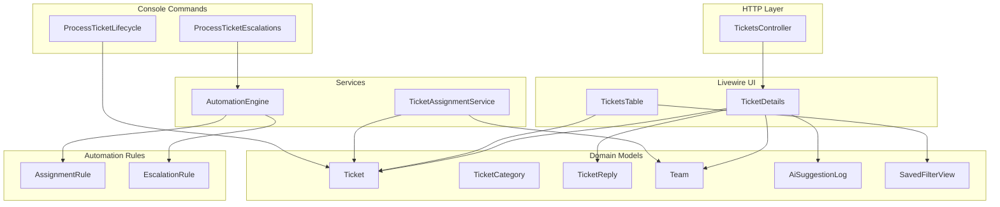
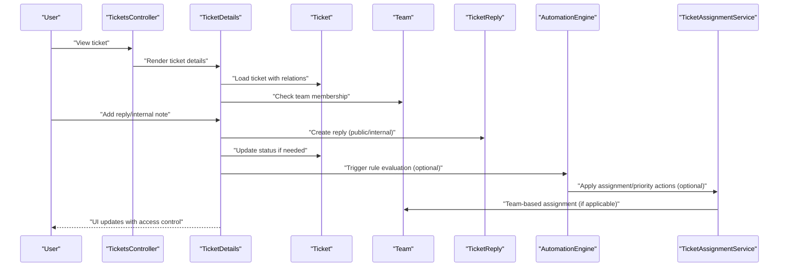
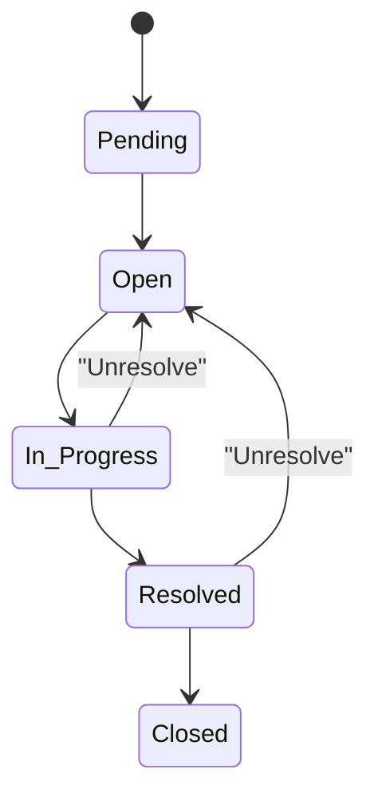
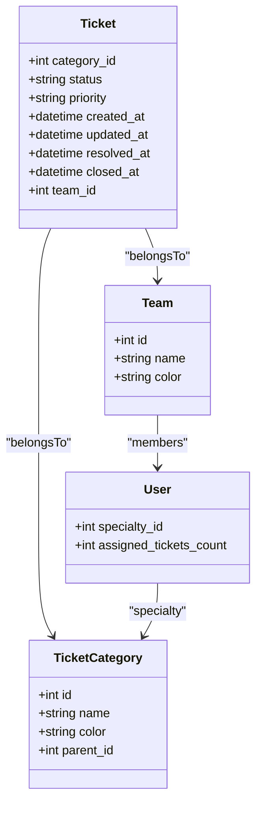
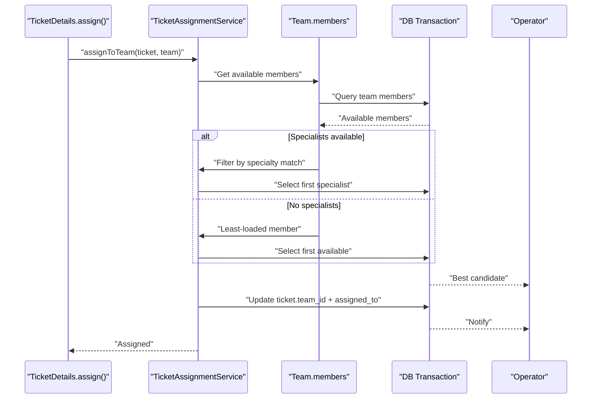
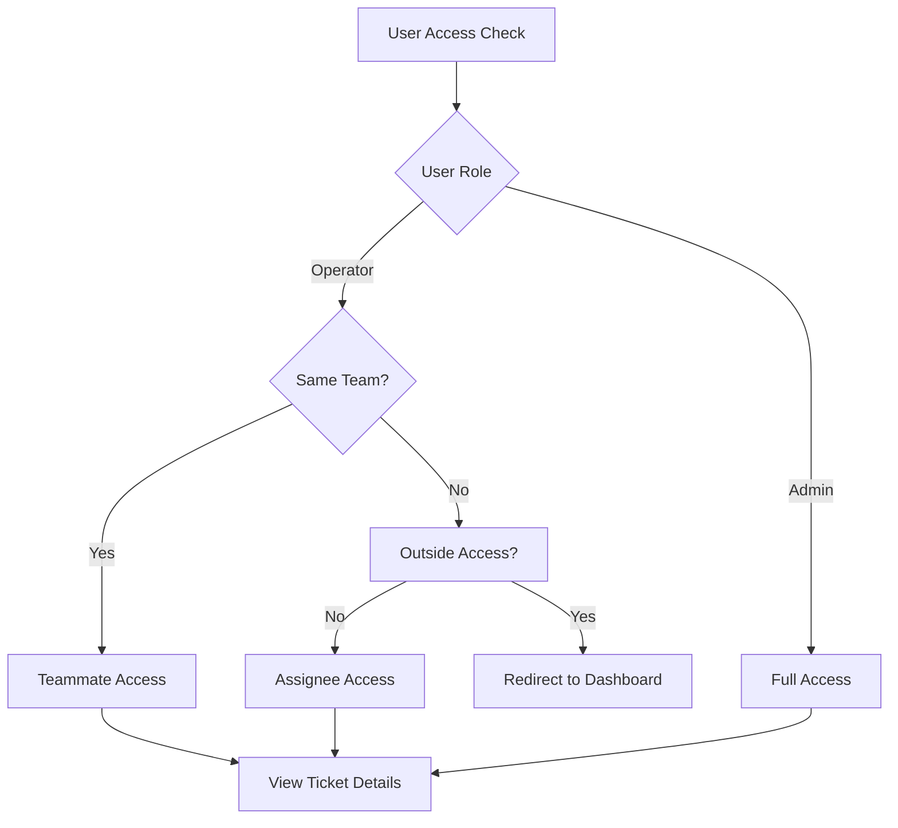
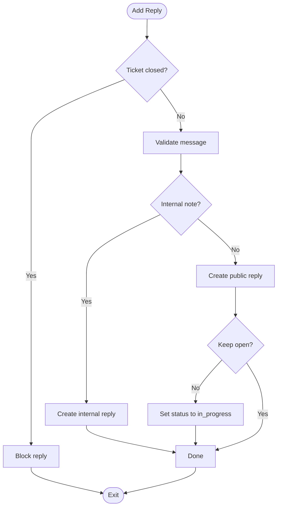
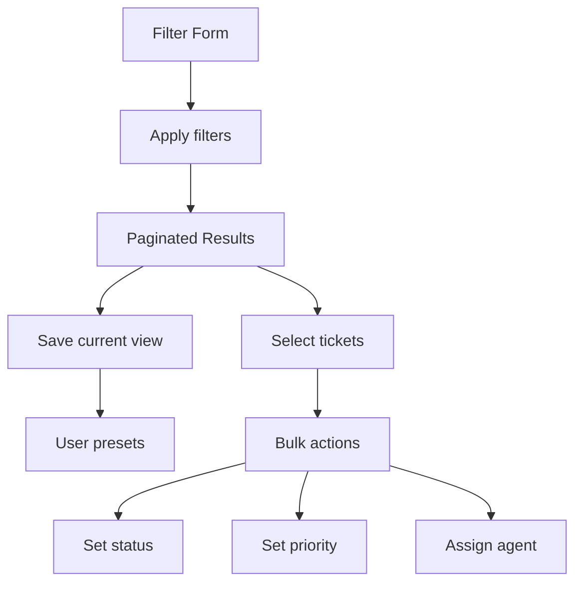
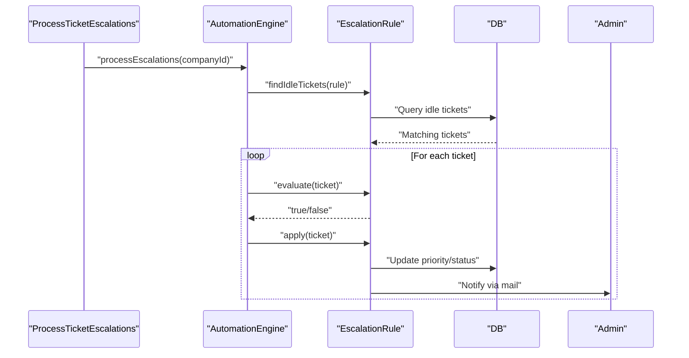
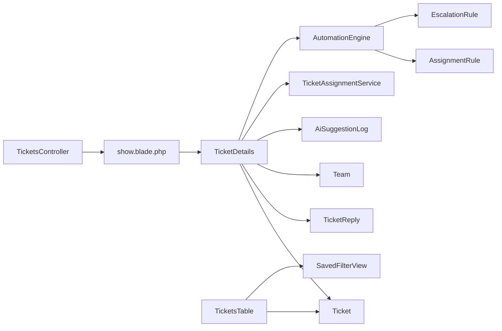

# Ticket Management System

<cite>
**Referenced Files in This Document**
- [Ticket.php](file://app/Models/Ticket.php)
- [TicketCategory.php](file://app/Models/TicketCategory.php)
- [TicketReply.php](file://app/Models/TicketReply.php)
- [Team.php](file://app/Models/Team.php)
- [AiSuggestionLog.php](file://app/Models/AiSuggestionLog.php)
- [TicketsController.php](file://app/Http/Controllers/TicketsController.php)
- [TicketDetails.php](file://app/Livewire/Dashboard/TicketDetails.php)
- [TicketsTable.php](file://app/Livewire/Dashboard/TicketsTable.php)
- [TicketAssignmentService.php](file://app/Services/TicketAssignmentService.php)
- [AutomationEngine.php](file://app/Services/Automation/AutomationEngine.php)
- [AssignmentRule.php](file://app/Services/Automation/Rules/AssignmentRule.php)
- [EscalationRule.php](file://app/Services/Automation/Rules/EscalationRule.php)
- [ProcessTicketEscalations.php](file://app/Console/Commands/ProcessTicketEscalations.php)
- [ProcessTicketLifecycle.php](file://app/Console/Commands/ProcessTicketLifecycle.php)
- [SavedFilterView.php](file://app/Models/SavedFilterView.php)
- [show.blade.php](file://resources/views/dashboard/tickets/show.blade.php)
- [ticket-details.blade.php](file://resources/views/livewire/dashboard/ticket-details.blade.php)
- [tickets-table.blade.php](file://resources/views/livewire/dashboard/tickets-table.blade.php)
- [head.blade.php](file://resources/views/partials/head.blade.php)
- [TicketFactory.php](file://database/factories/TicketFactory.php)
</cite>

## Update Summary
**Changes Made**
- Enhanced ticket management with team-based assignment workflows
- Improved access control distinguishing assignees, teammates, and outsiders
- Added team picker modals for multi-team agents
- Implemented action confirmation dialogs using SweetAlert2
- Integrated AI suggestion logging through AiSuggestionLog model
- Added automated ticket lifecycle processing via ProcessTicketLifecycle command

## Table of Contents
1. [Introduction](#introduction)
2. [Project Structure](#project-structure)
3. [Core Components](#core-components)
4. [Architecture Overview](#architecture-overview)
5. [Detailed Component Analysis](#detailed-component-analysis)
6. [Dependency Analysis](#dependency-analysis)
7. [Performance Considerations](#performance-considerations)
8. [Troubleshooting Guide](#troubleshooting-guide)
9. [Conclusion](#conclusion)

## Introduction
This document describes the ticket management system, focusing on the complete lifecycle from creation to resolution, including status management, priority levels, categorization, reply handling, team-based assignment workflows, access control, search and filtering, saved views, bulk operations, and automation integration for rule-based processing and escalation handling.

## Project Structure
The system is built with Laravel and Livewire. Key areas:
- Models define domain entities (Ticket, TicketCategory, TicketReply, Team, AiSuggestionLog)
- Controllers orchestrate HTTP requests (TicketsController)
- Livewire components provide interactive UI for ticket details and listings
- Services encapsulate business logic (TicketAssignmentService)
- Automation engine applies rules for assignment, priority, auto-reply, and escalation
- Console commands handle lifecycle processing and escalation management
- Blade templates render UI and integrate Livewire components with enhanced access control

**Diagram sources**
- [TicketsController.php:12-17](file://app/Http/Controllers/TicketsController.php#L12-L17)
- [TicketDetails.php:61-65](file://app/Livewire/Dashboard/TicketDetails.php#L61-L65)
- [TicketsTable.php:260-317](file://app/Livewire/Dashboard/TicketsTable.php#L260-L317)
- [Ticket.php:16-54](file://app/Models/Ticket.php#L16-L54)
- [TicketReply.php:29-37](file://app/Models/TicketReply.php#L29-L37)
- [Team.php:25-28](file://app/Models/Team.php#L25-L28)
- [AiSuggestionLog.php:11-18](file://app/Models/AiSuggestionLog.php#L11-L18)
- [TicketAssignmentService.php:22-94](file://app/Services/TicketAssignmentService.php#L22-L94)
- [AutomationEngine.php:30-41](file://app/Services/Automation/AutomationEngine.php#L30-L41)
- [AssignmentRule.php:15-48](file://app/Services/Automation/Rules/AssignmentRule.php#L15-L48)
- [EscalationRule.php:24-60](file://app/Services/Automation/Rules/EscalationRule.php#L24-L60)
- [ProcessTicketEscalations.php:29-53](file://app/Console/Commands/ProcessTicketEscalations.php#L29-L53)
- [ProcessTicketLifecycle.php:16-41](file://app/Console/Commands/ProcessTicketLifecycle.php#L16-L41)

**Section sources**
- [TicketsController.php:12-17](file://app/Http/Controllers/TicketsController.php#L12-L17)
- [TicketDetails.php:61-65](file://app/Livewire/Dashboard/TicketDetails.php#L61-L65)
- [TicketsTable.php:260-317](file://app/Livewire/Dashboard/TicketsTable.php#L260-L317)

## Core Components
- Ticket model defines lifecycle fields (status, priority, timestamps), relationships to company, category, user, replies, logs, and team, plus an open scope.
- TicketCategory model represents hierarchical categories (via category_id relationship).
- TicketReply model supports both public customer communications and internal agent notes, with attachments and casting for booleans and arrays.
- Team model manages team membership with role-based access control and team-specific ticket assignments.
- AiSuggestionLog model tracks AI suggestion interactions for training and analytics.
- TicketAssignmentService handles automatic assignment to specialists/generalists, team-based assignment, and manual reassignment.
- AutomationEngine executes rules for new tickets and escalations via scheduled command.
- SavedFilterView persists user-defined filter configurations.
- ProcessTicketLifecycle command automates closure warnings and auto-closure of resolved tickets.
- Enhanced access control distinguishes between assignees, teammates, and outsiders for ticket visibility.

**Section sources**
- [Ticket.php:16-62](file://app/Models/Ticket.php#L16-L62)
- [TicketCategory.php:8-13](file://app/Models/TicketCategory.php#L8-L13)
- [TicketReply.php:10-37](file://app/Models/TicketReply.php#L10-L37)
- [Team.php:9-39](file://app/Models/Team.php#L9-L39)
- [AiSuggestionLog.php:9-39](file://app/Models/AiSuggestionLog.php#L9-L39)
- [TicketAssignmentService.php:22-160](file://app/Services/TicketAssignmentService.php#L22-L160)
- [AutomationEngine.php:30-96](file://app/Services/Automation/AutomationEngine.php#L30-L96)
- [SavedFilterView.php:14-30](file://app/Models/SavedFilterView.php#L14-L30)
- [ProcessTicketLifecycle.php:16-113](file://app/Console/Commands/ProcessTicketLifecycle.php#L16-L113)

## Architecture Overview
The system separates concerns across models, services, Livewire components, and automation. HTTP requests route to controllers, which delegate to Livewire components for rendering and interactivity. Services encapsulate business logic, and automation runs independently to enforce policies. Enhanced team-based workflows and access control provide granular permission management.

**Diagram sources**
- [TicketsController.php:12-17](file://app/Http/Controllers/TicketsController.php#L12-L17)
- [TicketDetails.php:263-322](file://app/Livewire/Dashboard/TicketDetails.php#L263-L322)
- [TicketDetails.php:475-505](file://app/Livewire/Dashboard/TicketDetails.php#L475-L505)
- [AutomationEngine.php:59-96](file://app/Services/Automation/AutomationEngine.php#L59-L96)
- [TicketAssignmentService.php:99-108](file://app/Services/TicketAssignmentService.php#L99-L108)

## Detailed Component Analysis

### Ticket Lifecycle and Status Management
- Status lifecycle includes pending, open, in_progress, resolved, closed. The model exposes an open scope for active tickets.
- UI supports resolving/unresolving and closing tickets, updating timestamps accordingly.
- Status transitions are validated in the UI and logged.
- Automated lifecycle processing handles closure warnings and auto-closure of resolved tickets.

**Diagram sources**
- [TicketDetails.php:91-143](file://app/Livewire/Dashboard/TicketDetails.php#L91-L143)
- [TicketDetails.php:237-261](file://app/Livewire/Dashboard/TicketDetails.php#L237-L261)
- [TicketFactory.php:14-244](file://database/factories/TicketFactory.php#L14-L244)
- [ProcessTicketLifecycle.php:43-111](file://app/Console/Commands/ProcessTicketLifecycle.php#L43-L111)

**Section sources**
- [Ticket.php:59-62](file://app/Models/Ticket.php#L59-L62)
- [TicketDetails.php:91-143](file://app/Livewire/Dashboard/TicketDetails.php#L91-L143)
- [TicketDetails.php:237-261](file://app/Livewire/Dashboard/TicketDetails.php#L237-L261)
- [TicketFactory.php:14-244](file://database/factories/TicketFactory.php#L14-L244)
- [ProcessTicketLifecycle.php:22-41](file://app/Console/Commands/ProcessTicketLifecycle.php#L22-L41)

### Priority Levels
- Supported priorities: low, medium, high, urgent.
- UI validates priority changes and notifies stakeholders when appropriate.
- Escalation rule can increase priority based on idle thresholds.

**Section sources**
- [TicketDetails.php:176-203](file://app/Livewire/Dashboard/TicketDetails.php#L176-L203)
- [EscalationRule.php:115-132](file://app/Services/Automation/Rules/EscalationRule.php#L115-L132)

### Ticket Categorization and Routing
- Tickets belong to a category via category_id; categories are associated with operators by specialty.
- Automatic assignment prefers specialists matching the ticket's category; falls back to generalists.
- Team-based assignment prioritizes team members with matching specialties, falling back to least-loaded team members.
- UI displays category color badges and allows category selection during creation and filtering.

**Diagram sources**
- [Ticket.php:26-29](file://app/Models/Ticket.php#L26-L29)
- [TicketAssignmentService.php:44-53](file://app/Services/TicketAssignmentService.php#L44-L53)
- [Team.php:25-28](file://app/Models/Team.php#L25-L28)

**Section sources**
- [Ticket.php:26-29](file://app/Models/Ticket.php#L26-L29)
- [TicketAssignmentService.php:22-94](file://app/Services/TicketAssignmentService.php#L22-L94)
- [ticket-details.blade.php:79-89](file://resources/views/livewire/dashboard/ticket-details.blade.php#L79-L89)

### Team-Based Assignment Workflows
- Team-based assignment prioritizes team members whose specialties match the ticket category or parent category.
- Falls back to least-loaded available team member when no specialists are found.
- If no team members are available, falls back to global assignment logic.
- Auto-resolves team assignment when agent belongs to exactly one team.
- Supports team picker modals for agents belonging to multiple teams.

**Diagram sources**
- [TicketAssignmentService.php:162-224](file://app/Services/TicketAssignmentService.php#L162-L224)
- [Team.php:25-28](file://app/Models/Team.php#L25-L28)

**Section sources**
- [TicketAssignmentService.php:162-224](file://app/Services/TicketAssignmentService.php#L162-L224)
- [TicketDetails.php:145-174](file://app/Livewire/Dashboard/TicketDetails.php#L145-L174)

### Access Control and Team Visibility
- Enhanced access control distinguishes between assignees, teammates, and outsiders.
- Assignees have full access to tickets they're assigned to.
- Teammates can access tickets within their team regardless of assignment.
- Outsiders (operators not in the ticket's team) are redirected from ticket pages.
- Admin users bypass all restrictions.
- Team picker modals appear when agents belong to multiple teams during assignment.

**Diagram sources**
- [TicketDetails.php:61-65](file://app/Livewire/Dashboard/TicketDetails.php#L61-L65)

**Section sources**
- [TicketDetails.php:61-65](file://app/Livewire/Dashboard/TicketDetails.php#L61-L65)
- [tests/Feature/TeamBasedVisibilityTest.php:40-96](file://tests/Feature/TeamBasedVisibilityTest.php#L40-L96)

### Reply System: Public and Internal
- Public replies are visible to customers; internal notes are visible only to agents.
- Both support rich text and optional attachments.
- UI toggles between conversation and internal notes tabs.
- Enhanced with AI suggestion logging for training purposes.

**Diagram sources**
- [TicketDetails.php:263-322](file://app/Livewire/Dashboard/TicketDetails.php#L263-L322)
- [TicketDetails.php:475-505](file://app/Livewire/Dashboard/TicketDetails.php#L475-L505)

**Section sources**
- [TicketReply.php:10-18](file://app/Models/TicketReply.php#L10-L18)
- [ticket-details.blade.php:132-287](file://resources/views/livewire/dashboard/ticket-details.blade.php#L132-L287)
- [ticket-details.blade.php:710-800](file://resources/views/livewire/dashboard/ticket-details.blade.php#L710-L800)

### Action Confirmation Dialogs
- Implemented SweetAlert2 for consistent action confirmation across the interface.
- Provides standardized confirmation dialogs for deletions and critical operations.
- Customizable titles, messages, and button text for different action types.
- Integrates with Livewire components for seamless user experience.

**Section sources**
- [head.blade.php:131-195](file://resources/views/partials/head.blade.php#L131-L195)

### AI Suggestion Logging
- AiSuggestionLog model tracks AI-generated suggestions and user interactions.
- Logs include suggestion_text and edited_text for training and analytics.
- Supports generate, regenerate, use, and dismiss actions.
- Enables AI training and performance monitoring.

**Section sources**
- [AiSuggestionLog.php:9-39](file://app/Models/AiSuggestionLog.php#L9-L39)
- [database/migrations/2026_03_20_000003_create_ai_suggestion_logs_table.php:14-24](file://database/migrations/2026_03_20_000003_create_ai_suggestion_logs_table.php#L14-L24)
- [database/migrations/2026_03_20_000004_add_suggestion_text_to_ai_suggestion_logs.php:14-21](file://database/migrations/2026_03_20_000004_add_suggestion_text_to_ai_suggestion_logs.php#L14-L21)

### Search, Filtering, Saved Views, and Bulk Operations
- Search across ticket_number, subject, customer_name, description.
- Filters: status, priority, category, assigned agent (admin), date range.
- Sorting by configurable column and direction.
- SavedFilterView stores user filter presets.
- Bulk operations: set status, set priority, assign agent for selected tickets.

**Diagram sources**
- [TicketsTable.php:18-74](file://app/Livewire/Dashboard/TicketsTable.php#L18-L74)
- [TicketsTable.php:259-317](file://app/Livewire/Dashboard/TicketsTable.php#L259-L317)
- [SavedFilterView.php:14-30](file://app/Models/SavedFilterView.php#L14-L30)
- [TicketsTable.php:460-516](file://app/Livewire/Dashboard/TicketsTable.php#L460-L516)

**Section sources**
- [TicketsTable.php:259-317](file://app/Livewire/Dashboard/TicketsTable.php#L259-L317)
- [SavedFilterView.php:14-30](file://app/Models/SavedFilterView.php#L14-L30)
- [TicketsTable.php:460-516](file://app/Livewire/Dashboard/TicketsTable.php#L460-L516)

### Automation Engine and Escalation Handling
- New ticket processing: evaluates assignment, priority, auto-reply rules (excluding escalations).
- Escalation processing: scheduled command scans idle tickets and escalates priority, notifies admins, or reassigns.
- Rule types:
  - AssignmentRule: assigns specialists/generalists or specific operators.
  - EscalationRule: increases priority, sets specific priority, notifies admins, reassigns operator.
- ProcessTicketLifecycle command handles automated closure warnings and auto-closure of resolved tickets.

**Diagram sources**
- [ProcessTicketEscalations.php:29-53](file://app/Console/Commands/ProcessTicketEscalations.php#L29-L53)
- [AutomationEngine.php:46-54](file://app/Services/Automation/AutomationEngine.php#L46-L54)
- [EscalationRule.php:92-113](file://app/Services/Automation/Rules/EscalationRule.php#L92-L113)
- [EscalationRule.php:134-155](file://app/Services/Automation/Rules/EscalationRule.php#L134-L155)

**Section sources**
- [AutomationEngine.php:30-96](file://app/Services/Automation/AutomationEngine.php#L30-L96)
- [AssignmentRule.php:15-65](file://app/Services/Automation/Rules/AssignmentRule.php#L15-L65)
- [EscalationRule.php:24-155](file://app/Services/Automation/Rules/EscalationRule.php#L24-L155)
- [ProcessTicketEscalations.php:29-53](file://app/Console/Commands/ProcessTicketEscalations.php#L29-L53)
- [ProcessTicketLifecycle.php:22-111](file://app/Console/Commands/ProcessTicketLifecycle.php#L22-L111)

## Dependency Analysis
- Controllers depend on Livewire components for rendering.
- Livewire components depend on models and services for persistence and business logic.
- Services encapsulate assignment and automation logic, minimizing coupling.
- Team-based workflows integrate with existing assignment logic.
- Access control enhances Livewire component security.
- Automation rules are pluggable and evaluated by the engine.
- AI suggestion logging provides training data for AI systems.

**Diagram sources**
- [TicketsController.php:12-17](file://app/Http/Controllers/TicketsController.php#L12-L17)
- [show.blade.php:1-4](file://resources/views/dashboard/tickets/show.blade.php#L1-L4)
- [TicketDetails.php:61-65](file://app/Livewire/Dashboard/TicketDetails.php#L61-L65)
- [TicketsTable.php:260-317](file://app/Livewire/Dashboard/TicketsTable.php#L260-L317)
- [TicketAssignmentService.php:22-94](file://app/Services/TicketAssignmentService.php#L22-L94)
- [AutomationEngine.php:30-96](file://app/Services/Automation/AutomationEngine.php#L30-L96)

**Section sources**
- [TicketsController.php:12-17](file://app/Http/Controllers/TicketsController.php#L12-L17)
- [TicketDetails.php:61-65](file://app/Livewire/Dashboard/TicketDetails.php#L61-L65)
- [TicketsTable.php:260-317](file://app/Livewire/Dashboard/TicketsTable.php#L260-L317)

## Performance Considerations
- Use pagination for ticket lists to avoid loading large datasets.
- Cache category and agent lists for admin dashboards to reduce queries.
- Batch operations (bulk updates) minimize individual writes.
- Escalation processing runs via a scheduled command to avoid blocking requests.
- Team-based assignment queries optimized with proper indexing and eager loading.
- AI suggestion logging uses efficient database operations with appropriate indexing.

## Troubleshooting Guide
- Auto-assignment fails: check availability and specialties of operators; verify category presence; review admin notifications for TicketUnassigned.
- Team assignment issues: verify team membership, availability, and specialty matching; check fallback to global assignment logic.
- Access control problems: ensure proper team membership for teammates; verify admin privileges for bypass; check redirect logic for outsiders.
- Escalation not applied: ensure the scheduled command is running and that idle thresholds and statuses match expectations.
- AI suggestion logging errors: verify database schema updates and proper indexing for log queries.
- Action confirmation dialogs: check SweetAlert2 integration and custom dialog configuration.
- Lifecycle processing failures: verify SLA policy configuration and command execution timing.

**Section sources**
- [TicketAssignmentService.php:84-94](file://app/Services/TicketAssignmentService.php#L84-L94)
- [ProcessTicketEscalations.php:29-53](file://app/Console/Commands/ProcessTicketEscalations.php#L29-L53)
- [TicketDetails.php:263-322](file://app/Livewire/Dashboard/TicketDetails.php#L263-L322)
- [SavedFilterView.php:14-30](file://app/Models/SavedFilterView.php#L14-L30)
- [ProcessTicketLifecycle.php:22-41](file://app/Console/Commands/ProcessTicketLifecycle.php#L22-L41)

## Conclusion
The ticket management system provides a robust lifecycle with clear status and priority controls, flexible categorization with specialized routing, team-based assignment workflows, enhanced access control, dual-mode reply handling, AI suggestion logging, and powerful automation for assignment and escalation. The UI integrates seamlessly with backend services to support efficient agent workflows, team collaboration, and customer communication. The addition of team-based workflows, access control, and automated lifecycle processing significantly enhances the system's operational efficiency and security.