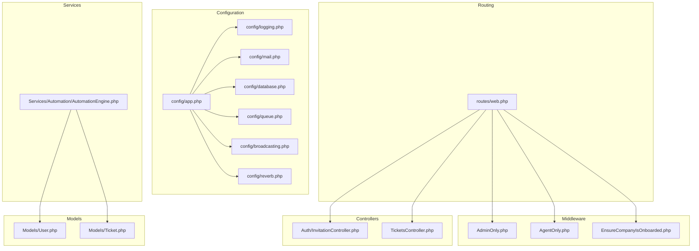
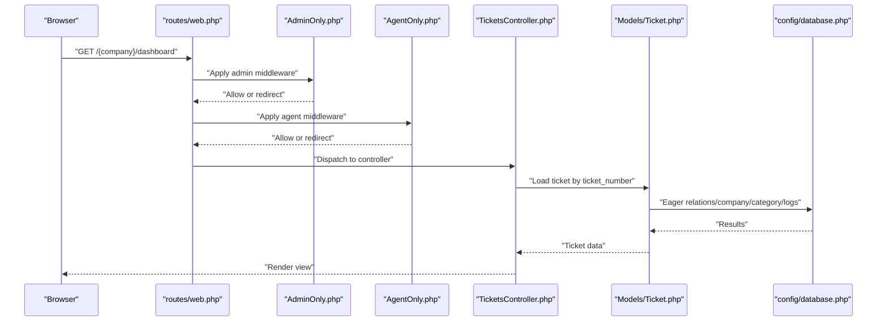
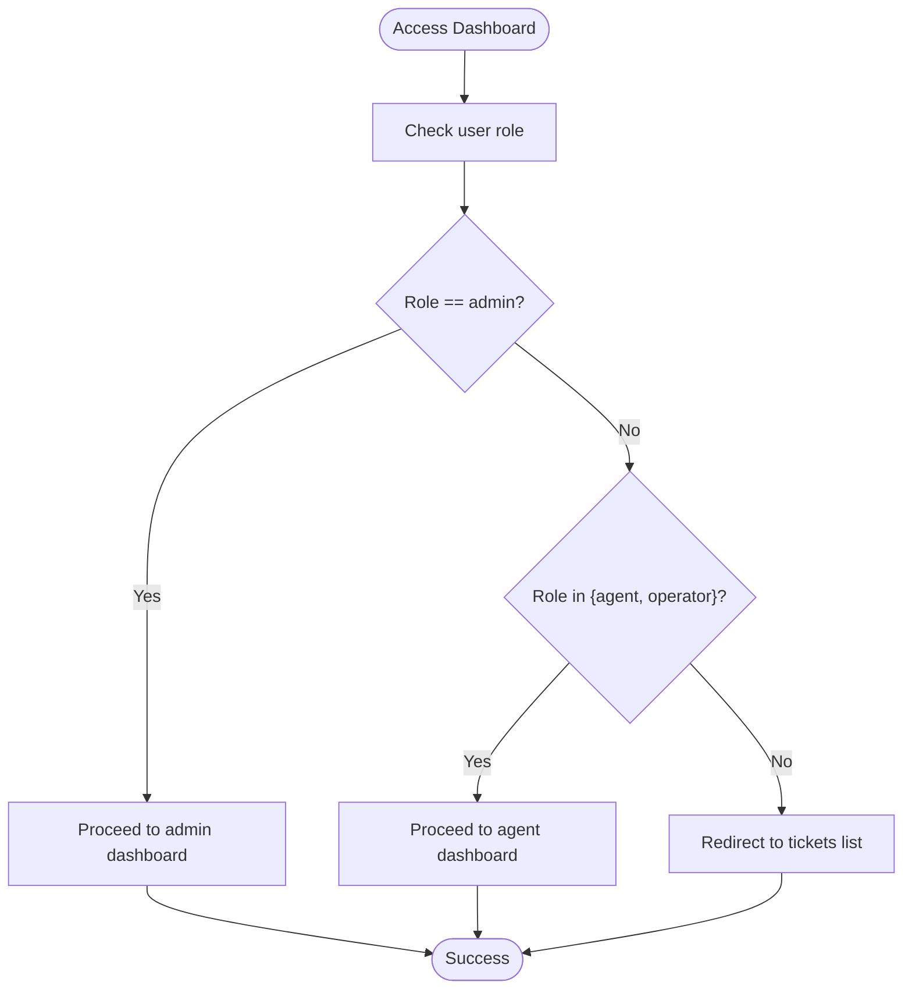
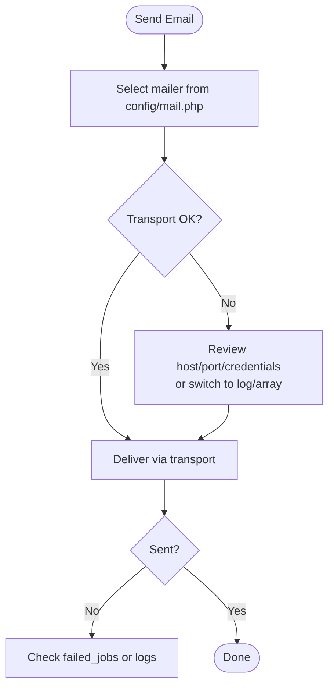
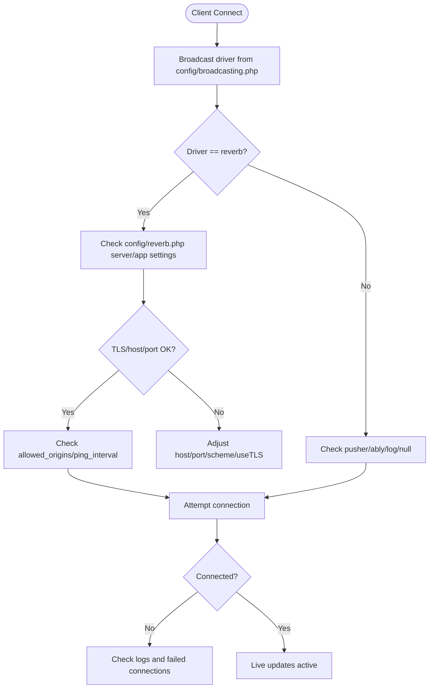
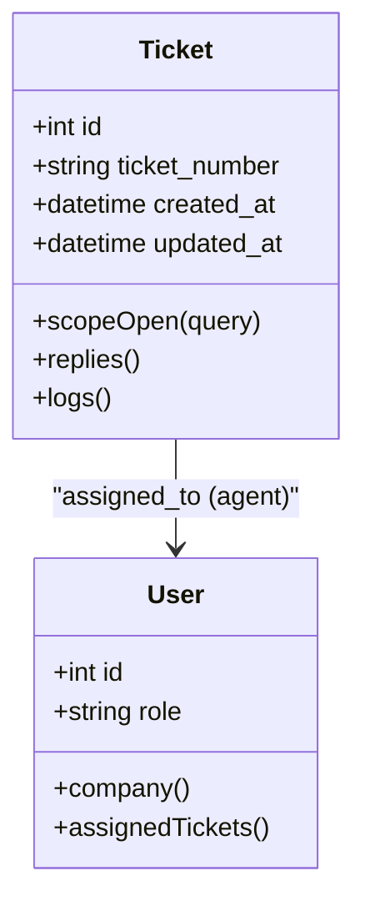
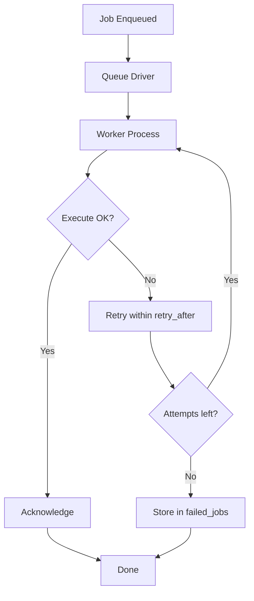
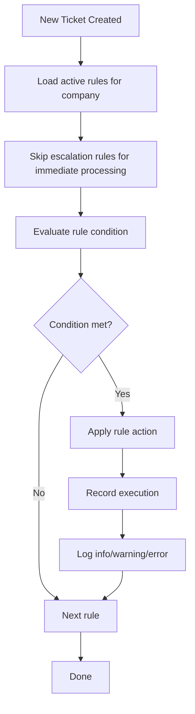
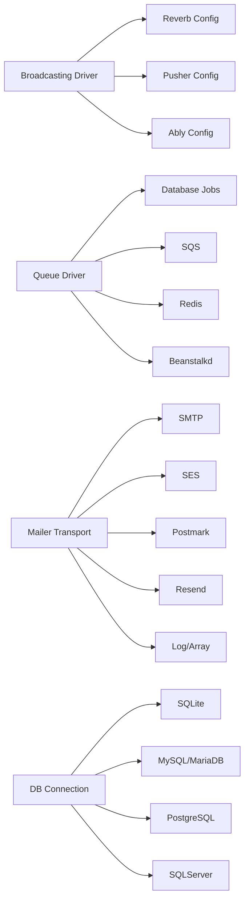

# Troubleshooting & FAQ

<cite>
**Referenced Files in This Document**
- [config/app.php](file://config/app.php)
- [config/logging.php](file://config/logging.php)
- [config/mail.php](file://config/mail.php)
- [config/database.php](file://config/database.php)
- [config/queue.php](file://config/queue.php)
- [config/broadcasting.php](file://config/broadcasting.php)
- [config/reverb.php](file://config/reverb.php)
- [routes/web.php](file://routes/web.php)
- [app/Http/Middleware/AdminOnly.php](file://app/Http/Middleware/AdminOnly.php)
- [app/Http/Middleware/AgentOnly.php](file://app/Http/Middleware/AgentOnly.php)
- [app/Http/Middleware/EnsureCompanyIsOnboarded.php](file://app/Http/Middleware/EnsureCompanyIsOnboarded.php)
- [app/Http/Controllers/Auth/InvitationController.php](file://app/Http/Controllers/Auth/InvitationController.php)
- [app/Http/Controllers/TicketsController.php](file://app/Http/Controllers/TicketsController.php)
- [app/Services/Automation/AutomationEngine.php](file://app/Services/Automation/AutomationEngine.php)
- [app/Models/User.php](file://app/Models/User.php)
- [app/Models/Ticket.php](file://app/Models/Ticket.php)
</cite>

## Table of Contents
1. [Introduction](#introduction)
2. [Project Structure](#project-structure)
3. [Core Components](#core-components)
4. [Architecture Overview](#architecture-overview)
5. [Detailed Component Analysis](#detailed-component-analysis)
6. [Dependency Analysis](#dependency-analysis)
7. [Performance Considerations](#performance-considerations)
8. [Troubleshooting Guide](#troubleshooting-guide)
9. [FAQ](#faq)
10. [Conclusion](#conclusion)

## Introduction
This document provides comprehensive troubleshooting guidance and a role-based FAQ for the HelpDesk System. It focuses on diagnosing and resolving common issues across authentication, email delivery, real-time communication (WebSocket), and performance. It also covers systematic debugging approaches for database queries, queue processing, and log analysis, along with practical solutions for configuration, dependency, and environment-specific problems.

## Project Structure
The HelpDesk System is a Laravel application with modular structure:
- Configuration: Centralized under config/*. Environment-driven behavior for logging, mail, database, queues, broadcasting, and Reverb.
- Routing: Routes are grouped by domain/subdomain and role-based middleware.
- Middleware: Enforces roles (admin/agent), company onboarding, and access control.
- Services: Automation engine orchestrates rule-based actions on tickets.
- Models: Define relationships and scopes for Users, Tickets, and related entities.

**Diagram sources**
- [config/app.php:1-129](file://config/app.php#L1-L129)
- [config/logging.php:1-133](file://config/logging.php#L1-L133)
- [config/mail.php:1-119](file://config/mail.php#L1-L119)
- [config/database.php:1-184](file://config/database.php#L1-L184)
- [config/queue.php:1-130](file://config/queue.php#L1-L130)
- [config/broadcasting.php:1-83](file://config/broadcasting.php#L1-L83)
- [config/reverb.php:1-97](file://config/reverb.php#L1-L97)
- [routes/web.php:1-117](file://routes/web.php#L1-L117)
- [app/Http/Middleware/AdminOnly.php:1-25](file://app/Http/Middleware/AdminOnly.php#L1-L25)
- [app/Http/Middleware/AgentOnly.php:1-25](file://app/Http/Middleware/AgentOnly.php#L1-L25)
- [app/Http/Middleware/EnsureCompanyIsOnboarded.php:1-28](file://app/Http/Middleware/EnsureCompanyIsOnboarded.php#L1-L28)
- [app/Http/Controllers/Auth/InvitationController.php:1-31](file://app/Http/Controllers/Auth/InvitationController.php#L1-L31)
- [app/Http/Controllers/TicketsController.php:1-19](file://app/Http/Controllers/TicketsController.php#L1-L19)
- [app/Services/Automation/AutomationEngine.php:1-142](file://app/Services/Automation/AutomationEngine.php#L1-L142)
- [app/Models/User.php:1-137](file://app/Models/User.php#L1-L137)
- [app/Models/Ticket.php:1-64](file://app/Models/Ticket.php#L1-L64)

**Section sources**
- [routes/web.php:1-117](file://routes/web.php#L1-L117)
- [config/app.php:1-129](file://config/app.php#L1-L129)

## Core Components
- Authentication and Authorization
  - Role-based middleware ensures only admins or agents access specific dashboards.
  - Invitation links are validated and routed appropriately.
- Email Delivery
  - Configurable mailers with failover and logging transports.
- Real-Time Communication
  - Broadcasting configured for Reverb/Pusher/Ably/log/null.
- Queues
  - Multiple drivers (database, redis, sqs, beanstalkd) with configurable retry and failed job handling.
- Database
  - Multiple connections (sqlite/mysql/mariadb/pgsql/sqlsrv) with Redis-backed caching and queue backends.
- Automation Engine
  - Processes ticket lifecycle rules with logging and error handling.

**Section sources**
- [app/Http/Middleware/AdminOnly.php:1-25](file://app/Http/Middleware/AdminOnly.php#L1-L25)
- [app/Http/Middleware/AgentOnly.php:1-25](file://app/Http/Middleware/AgentOnly.php#L1-L25)
- [app/Http/Middleware/EnsureCompanyIsOnboarded.php:1-28](file://app/Http/Middleware/EnsureCompanyIsOnboarded.php#L1-L28)
- [app/Http/Controllers/Auth/InvitationController.php:1-31](file://app/Http/Controllers/Auth/InvitationController.php#L1-L31)
- [config/mail.php:1-119](file://config/mail.php#L1-L119)
- [config/broadcasting.php:1-83](file://config/broadcasting.php#L1-L83)
- [config/queue.php:1-130](file://config/queue.php#L1-L130)
- [config/database.php:1-184](file://config/database.php#L1-L184)
- [app/Services/Automation/AutomationEngine.php:1-142](file://app/Services/Automation/AutomationEngine.php#L1-L142)

## Architecture Overview
The system integrates routing, middleware, controllers, services, and infrastructure components. Requests traverse route groups, apply middleware, reach controllers, and often trigger queued jobs or broadcasts. Logging and monitoring are configured centrally.

**Diagram sources**
- [routes/web.php:70-114](file://routes/web.php#L70-L114)
- [app/Http/Middleware/AdminOnly.php:16-23](file://app/Http/Middleware/AdminOnly.php#L16-L23)
- [app/Http/Middleware/AgentOnly.php:16-23](file://app/Http/Middleware/AgentOnly.php#L16-L23)
- [app/Http/Controllers/TicketsController.php:12-17](file://app/Http/Controllers/TicketsController.php#L12-L17)
- [app/Models/Ticket.php:31-34](file://app/Models/Ticket.php#L31-L34)
- [config/database.php:34-114](file://config/database.php#L34-L114)

## Detailed Component Analysis

### Authentication Failures
Common symptoms:
- Redirect loops after login.
- Invalid/expired invitation links.
- Access denied to dashboards.

Root causes and fixes:
- Invitation signature validation: Ensure signed URLs are used and not expired. Redirect to login if already accepted.
- Role-based access: Admin-only or agent-only routes reject unauthorized users and redirect to tickets list.
- Company onboarding: Unfinished onboarding blocks dashboard access until wizard is completed.

**Diagram sources**
- [app/Http/Middleware/AdminOnly.php:16-23](file://app/Http/Middleware/AdminOnly.php#L16-L23)
- [app/Http/Middleware/AgentOnly.php:16-23](file://app/Http/Middleware/AgentOnly.php#L16-L23)

**Section sources**
- [app/Http/Controllers/Auth/InvitationController.php:14-29](file://app/Http/Controllers/Auth/InvitationController.php#L14-L29)
- [app/Http/Middleware/AdminOnly.php:16-23](file://app/Http/Middleware/AdminOnly.php#L16-L23)
- [app/Http/Middleware/AgentOnly.php:16-23](file://app/Http/Middleware/AgentOnly.php#L16-L23)
- [app/Http/Middleware/EnsureCompanyIsOnboarded.php:16-25](file://app/Http/Middleware/EnsureCompanyIsOnboarded.php#L16-L25)

### Email Delivery Issues
Symptoms:
- Emails not sent.
- Misconfigured sender identity.
- Transport errors.

Diagnostic steps:
- Verify mailer selection and transport settings.
- Confirm global “From” address/name.
- Test with log transport to capture messages.
- Use failover/roundrobin configurations for resilience.

**Diagram sources**
- [config/mail.php:17-118](file://config/mail.php#L17-L118)
- [config/queue.php:123-127](file://config/queue.php#L123-L127)
- [config/logging.php:53-130](file://config/logging.php#L53-L130)

**Section sources**
- [config/mail.php:17-118](file://config/mail.php#L17-L118)
- [config/queue.php:123-127](file://config/queue.php#L123-L127)
- [config/logging.php:53-130](file://config/logging.php#L53-L130)

### WebSocket and Real-Time Communication Problems
Symptoms:
- Clients cannot connect to Reverb/Pusher/Ably.
- No live updates in UI.

Checks:
- Confirm broadcasting driver and Reverb app credentials.
- Validate Reverb server host/port/path and TLS settings.
- Ensure allowed origins and ping/activity timeouts are appropriate.
- For fallback, verify log/null driver behavior.

**Diagram sources**
- [config/broadcasting.php:18-80](file://config/broadcasting.php#L18-L80)
- [config/reverb.php:29-94](file://config/reverb.php#L29-L94)
- [config/logging.php:53-130](file://config/logging.php#L53-L130)

**Section sources**
- [config/broadcasting.php:18-80](file://config/broadcasting.php#L18-L80)
- [config/reverb.php:29-94](file://config/reverb.php#L29-L94)
- [config/logging.php:53-130](file://config/logging.php#L53-L130)

### Database Queries and ORM Scopes
Symptoms:
- Slow ticket loads.
- Missing relations or incorrect counts.

Tips:
- Use Eloquent relationships and scopes (e.g., open tickets).
- Leverage model casts for timestamps.
- Monitor slow queries and consider indexing on frequently filtered columns.

**Diagram sources**
- [app/Models/Ticket.php:14-63](file://app/Models/Ticket.php#L14-L63)
- [app/Models/User.php:74-97](file://app/Models/User.php#L74-L97)

**Section sources**
- [app/Models/Ticket.php:58-63](file://app/Models/Ticket.php#L58-L63)
- [app/Models/Ticket.php:41-49](file://app/Models/Ticket.php#L41-L49)
- [app/Models/User.php:74-97](file://app/Models/User.php#L74-L97)

### Queue Processing and Failed Jobs
Symptoms:
- Background tasks not executing.
- Jobs stuck or failing repeatedly.

Actions:
- Choose appropriate driver (database/redis/sqs/beanstalkd).
- Tune retry_after and failed job storage.
- Inspect failed_jobs table and logs.

**Diagram sources**
- [config/queue.php:16-127](file://config/queue.php#L16-L127)
- [config/logging.php:53-130](file://config/logging.php#L53-L130)

**Section sources**
- [config/queue.php:16-127](file://config/queue.php#L16-L127)
- [config/logging.php:53-130](file://config/logging.php#L53-L130)

### Automation Engine and Rule Execution
Symptoms:
- Rules not applied.
- Errors during rule evaluation/apply.

Checks:
- Ensure active rules exist for the company and are ordered.
- Review automation logs for warnings/errors.
- Validate rule handlers and conditions.

**Diagram sources**
- [app/Services/Automation/AutomationEngine.php:30-96](file://app/Services/Automation/AutomationEngine.php#L30-L96)
- [config/logging.php:53-130](file://config/logging.php#L53-L130)

**Section sources**
- [app/Services/Automation/AutomationEngine.php:30-96](file://app/Services/Automation/AutomationEngine.php#L30-L96)
- [config/logging.php:53-130](file://config/logging.php#L53-L130)

## Dependency Analysis
Key dependencies and their roles:
- Broadcasting driver depends on Reverb/Pusher/Ably/log/null configuration.
- Queue driver depends on database/redis/sqs/beanstalkd configuration.
- Mailer transport depends on SMTP/SES/Postmark/Resend/log/array configuration.
- Database connections depend on sqlite/mysql/mariadb/pgsql/sqlsrv and Redis.

**Diagram sources**
- [config/broadcasting.php:18-80](file://config/broadcasting.php#L18-L80)
- [config/reverb.php:29-94](file://config/reverb.php#L29-L94)
- [config/queue.php:16-92](file://config/queue.php#L16-L92)
- [config/mail.php:38-100](file://config/mail.php#L38-L100)
- [config/database.php:32-115](file://config/database.php#L32-L115)

**Section sources**
- [config/broadcasting.php:18-80](file://config/broadcasting.php#L18-L80)
- [config/reverb.php:29-94](file://config/reverb.php#L29-L94)
- [config/queue.php:16-92](file://config/queue.php#L16-L92)
- [config/mail.php:38-100](file://config/mail.php#L38-L100)
- [config/database.php:32-115](file://config/database.php#L32-L115)

## Performance Considerations
- Database
  - Use appropriate connection (mysql/mariadb/pgsql/sqlsrv) for production.
  - Enable Redis for caching and queue backends to reduce DB load.
  - Index frequently queried columns (e.g., ticket_number, status, created_at).
- Queues
  - Scale workers horizontally; tune retry_after and failed job handling.
  - Prefer Redis for low-latency queues; SQS for cloud-native setups.
- Broadcasting
  - Use Reverb behind a reverse proxy; enable TLS and appropriate ping/activity timeouts.
- Logging
  - Use daily/slack/syslog for production; avoid excessive debug verbosity.
- Automation
  - Batch escalation processing; avoid heavy computations in rule handlers.

[No sources needed since this section provides general guidance]

## Troubleshooting Guide

### Authentication Failures
- Symptom: Redirect loop after login.
  - Check session state and middleware redirection logic.
  - Ensure user role matches expected middleware (admin/agent).
- Symptom: Invitation link invalid or expired.
  - Validate signature and redirect to login if already accepted.
- Symptom: Access denied to dashboard.
  - Verify onboarding completion; uncompleted onboarding redirects to wizard.

**Section sources**
- [app/Http/Controllers/Auth/InvitationController.php:14-29](file://app/Http/Controllers/Auth/InvitationController.php#L14-L29)
- [app/Http/Middleware/AdminOnly.php:16-23](file://app/Http/Middleware/AdminOnly.php#L16-L23)
- [app/Http/Middleware/AgentOnly.php:16-23](file://app/Http/Middleware/AgentOnly.php#L16-L23)
- [app/Http/Middleware/EnsureCompanyIsOnboarded.php:16-25](file://app/Http/Middleware/EnsureCompanyIsOnboarded.php#L16-L25)

### Email Delivery Issues
- Symptom: Emails not sent.
  - Switch to log/array transport to capture messages.
  - Verify SMTP host/port/credentials; test EHLO domain.
- Symptom: Misconfigured sender.
  - Confirm MAIL_FROM_ADDRESS and MAIL_FROM_NAME.
- Symptom: Transport errors.
  - Inspect failed_jobs and logs; adjust retry_after or switch mailers.

**Section sources**
- [config/mail.php:17-118](file://config/mail.php#L17-L118)
- [config/queue.php:123-127](file://config/queue.php#L123-L127)
- [config/logging.php:53-130](file://config/logging.php#L53-L130)

### WebSocket and Real-Time Communication
- Symptom: Cannot connect.
  - Verify REVERB_* and BROADCAST_CONNECTION values.
  - Check allowed_origins, ping_interval, activity_timeout.
- Symptom: No live updates.
  - Confirm broadcasting driver and Reverb server health.
  - Review logs for connection errors.

**Section sources**
- [config/broadcasting.php:18-80](file://config/broadcasting.php#L18-L80)
- [config/reverb.php:29-94](file://config/reverb.php#L29-L94)
- [config/logging.php:53-130](file://config/logging.php#L53-L130)

### Database Queries and ORM
- Symptom: Slow ticket loads.
  - Use Ticket::scopeOpen and eager relations.
  - Add indexes on ticket_number, status, and timestamps.
- Symptom: Incorrect counts or missing relations.
  - Validate belongsTo/hasMany relationships and model casts.

**Section sources**
- [app/Models/Ticket.php:58-63](file://app/Models/Ticket.php#L58-L63)
- [app/Models/Ticket.php:41-49](file://app/Models/Ticket.php#L41-L49)
- [app/Models/User.php:74-97](file://app/Models/User.php#L74-L97)

### Queue Processing
- Symptom: Jobs not processed.
  - Start workers for chosen driver; check failed_jobs.
- Symptom: Stuck jobs.
  - Increase retry_after; inspect logs for exceptions.

**Section sources**
- [config/queue.php:16-127](file://config/queue.php#L16-L127)
- [config/logging.php:53-130](file://config/logging.php#L53-L130)

### Automation Engine
- Symptom: Rules not applied.
  - Confirm active rules exist and ordering is correct.
- Symptom: Errors during execution.
  - Review automation logs for warnings/errors; validate rule handlers.

**Section sources**
- [app/Services/Automation/AutomationEngine.php:30-96](file://app/Services/Automation/AutomationEngine.php#L30-L96)
- [config/logging.php:53-130](file://config/logging.php#L53-L130)

### Log Analysis Techniques
- Identify severity levels and channels from config/logging.php.
- Use stack/single/daily channels; correlate with timestamps.
- For deprecations, enable deprecation logging and traces.
- For remote logging, configure slack/syslog/papertrail stderr handlers.

**Section sources**
- [config/logging.php:21-130](file://config/logging.php#L21-L130)

### Security, Permissions, and External Integrations
- Security
  - Ensure APP_KEY is set and consistent across deployments.
  - Use HTTPS for Reverb and proper TLS settings.
- Permissions
  - Role-based middleware prevents unauthorized access.
  - Company onboarding middleware enforces setup flow.
- External Services
  - Mail: Validate SMTP/SES/Postmark credentials.
  - Broadcasting: Verify Reverb/Pusher/Ably app keys and cluster settings.

**Section sources**
- [config/app.php:98-106](file://config/app.php#L98-L106)
- [config/reverb.php:74-94](file://config/reverb.php#L74-L94)
- [config/broadcasting.php:33-78](file://config/broadcasting.php#L33-L78)
- [config/mail.php:40-66](file://config/mail.php#L40-L66)

## FAQ

### Admin Perspective
- Q: How do I verify that my Reverb configuration is correct?
  - A: Check BROADCAST_CONNECTION and REVERB_* settings; confirm allowed_origins and ping intervals.
- Q: Why are some automation rules not applying?
  - A: Ensure rules are active and ordered; review automation logs for errors.
- Q: How can I improve dashboard performance?
  - A: Use Redis-backed caching, optimize DB queries with indexes, and scale queue workers.

**Section sources**
- [config/broadcasting.php:18-80](file://config/broadcasting.php#L18-L80)
- [config/reverb.php:74-94](file://config/reverb.php#L74-L94)
- [app/Services/Automation/AutomationEngine.php:30-96](file://app/Services/Automation/AutomationEngine.php#L30-L96)

### Agent Perspective
- Q: I keep getting redirected to the tickets list. Why?
  - A: Your role is not admin or operator; verify your User.role and middleware.
- Q: Why can’t I access the admin dashboard?
  - A: AdminOnly middleware restricts access to admin users.

**Section sources**
- [app/Http/Middleware/AdminOnly.php:16-23](file://app/Http/Middleware/AdminOnly.php#L16-L23)
- [app/Http/Middleware/AgentOnly.php:16-23](file://app/Http/Middleware/AgentOnly.php#L16-L23)

### Customer Support Perspective
- Q: My email replies are not triggering notifications.
  - A: Verify mailer transport and global “From” settings; check failed_jobs.
- Q: Live updates are not working in the widget.
  - A: Confirm broadcasting driver and Reverb server connectivity.

**Section sources**
- [config/mail.php:17-118](file://config/mail.php#L17-L118)
- [config/queue.php:123-127](file://config/queue.php#L123-L127)
- [config/broadcasting.php:18-80](file://config/broadcasting.php#L18-L80)
- [config/reverb.php:29-94](file://config/reverb.php#L29-L94)

## Conclusion
This guide consolidates actionable troubleshooting steps and FAQs across authentication, email, real-time communication, database, queues, and automation. By validating configuration, leveraging logs, and following the diagnostic flows, teams can quickly isolate and resolve issues. For high-volume environments, focus on queue scaling, Redis-backed caches, and robust broadcasting setup.