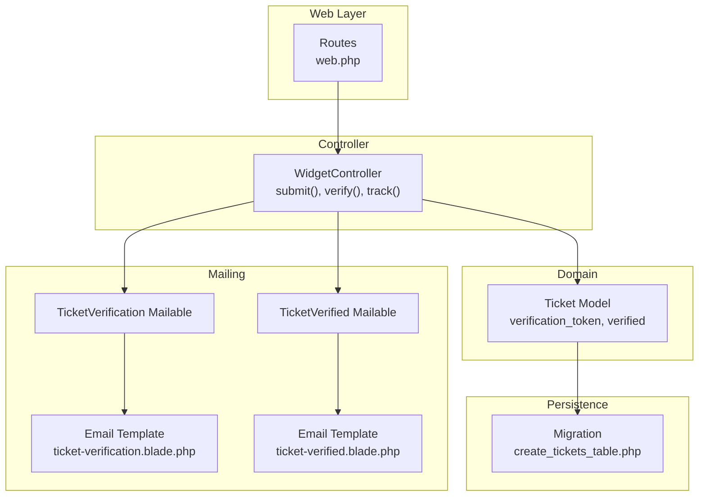
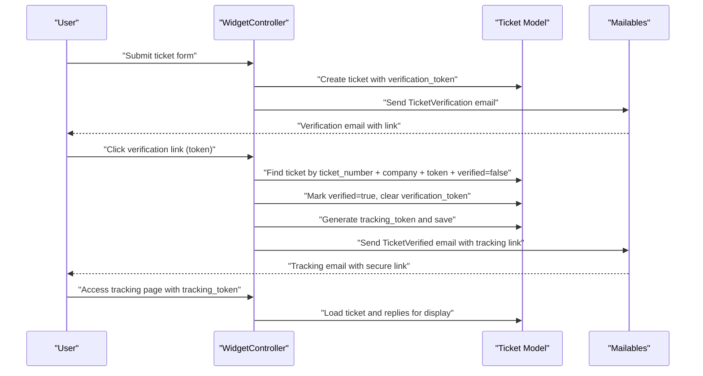
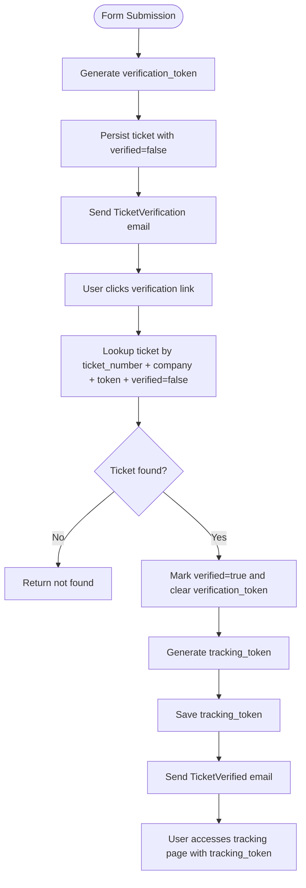
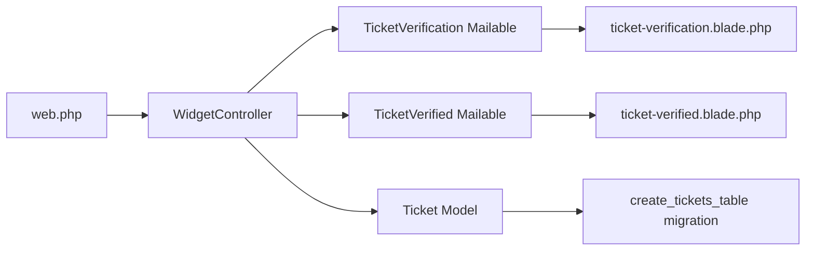

# Email Verification Workflow

<cite>
**Referenced Files in This Document**
- [WidgetController.php](file://app/Http/Controllers/WidgetController.php)
- [Ticket.php](file://app/Models/Ticket.php)
- [TicketVerification.php](file://app/Mail/TicketVerification.php)
- [TicketVerified.php](file://app/Mail/TicketVerified.php)
- [ticket-verification.blade.php](file://resources/views/emails/ticket-verification.blade.php)
- [ticket-verified.blade.php](file://resources/views/emails/ticket-verified.blade.php)
- [2026_02_01_224222_create_tickets_table.php](file://database/migrations/2026_02_01_224222_create_tickets_table.php)
- [web.php](file://routes/web.php)
- [security-issues.md](file://security-issues.md)
- [EmailVerificationTest.php](file://tests/Feature/Auth/EmailVerificationTest.php)
</cite>

## Table of Contents
1. [Introduction](#introduction)
2. [Project Structure](#project-structure)
3. [Core Components](#core-components)
4. [Architecture Overview](#architecture-overview)
5. [Detailed Component Analysis](#detailed-component-analysis)
6. [Dependency Analysis](#dependency-analysis)
7. [Performance Considerations](#performance-considerations)
8. [Troubleshooting Guide](#troubleshooting-guide)
9. [Conclusion](#conclusion)

## Introduction
This document explains the email verification workflow that ensures ticket authenticity in the helpdesk system. It covers the two-token system: a verification token for initial email confirmation and a tracking token for public access to the ticket. The document details the end-to-end process from form submission to email confirmation and ticket activation, including security measures, database storage, email templates, link structure, confidentiality, troubleshooting, and rate limiting considerations.

## Project Structure
The verification workflow spans several layers:
- Web routes define the verification and tracking endpoints
- A controller handles ticket creation, verification, and tracking
- Mailables and Blade templates render the verification and tracking emails
- The Ticket model stores verification and tracking tokens and ticket metadata
- Tests validate the user email verification flow for comparison

**Diagram sources**
- [web.php:1-117](file://routes/web.php#L1-L117)
- [WidgetController.php:41-136](file://app/Http/Controllers/WidgetController.php#L41-L136)
- [Ticket.php:14-34](file://app/Models/Ticket.php#L14-L34)
- [TicketVerification.php:12-33](file://app/Mail/TicketVerification.php#L12-L33)
- [TicketVerified.php:12-34](file://app/Mail/TicketVerified.php#L12-L34)
- [ticket-verification.blade.php:88-92](file://resources/views/emails/ticket-verification.blade.php#L88-L92)
- [ticket-verified.blade.php:116-121](file://resources/views/emails/ticket-verified.blade.php#L116-L121)
- [2026_02_01_224222_create_tickets_table.php:35-38](file://database/migrations/2026_02_01_224222_create_tickets_table.php#L35-L38)

**Section sources**
- [web.php:1-117](file://routes/web.php#L1-L117)
- [WidgetController.php:41-136](file://app/Http/Controllers/WidgetController.php#L41-L136)
- [Ticket.php:14-34](file://app/Models/Ticket.php#L14-L34)
- [TicketVerification.php:12-33](file://app/Mail/TicketVerification.php#L12-L33)
- [TicketVerified.php:12-34](file://app/Mail/TicketVerified.php#L12-L34)
- [ticket-verification.blade.php:88-92](file://resources/views/emails/ticket-verification.blade.php#L88-L92)
- [ticket-verified.blade.php:116-121](file://resources/views/emails/ticket-verified.blade.php#L116-L121)
- [2026_02_01_224222_create_tickets_table.php:35-38](file://database/migrations/2026_02_01_224222_create_tickets_table.php#L35-L38)

## Core Components
- Verification endpoint: Validates the verification token and marks the ticket as verified, then sends a tracking email with a new token
- Tracking endpoint: Allows public access to ticket details and replies using the tracking token
- Email templates: Rendered via mailables and Blade views to guide users through verification and provide tracking access
- Data model: Stores verification status and tokens, with indexes for performance

Key implementation references:
- Submission and verification token generation: [WidgetController.php:65-86](file://app/Http/Controllers/WidgetController.php#L65-L86)
- Verification logic and token reuse: [WidgetController.php:114-136](file://app/Http/Controllers/WidgetController.php#L114-L136)
- Tracking token usage: [WidgetController.php:141-158](file://app/Http/Controllers/WidgetController.php#L141-L158)
- Ticket model attributes: [Ticket.php:14-34](file://app/Models/Ticket.php#L14-L34)
- Verification email template: [ticket-verification.blade.php:88-92](file://resources/views/emails/ticket-verification.blade.php#L88-L92)
- Tracking email template: [ticket-verified.blade.php:116-121](file://resources/views/emails/ticket-verified.blade.php#L116-L121)

**Section sources**
- [WidgetController.php:65-86](file://app/Http/Controllers/WidgetController.php#L65-L86)
- [WidgetController.php:114-136](file://app/Http/Controllers/WidgetController.php#L114-L136)
- [WidgetController.php:141-158](file://app/Http/Controllers/WidgetController.php#L141-L158)
- [Ticket.php:14-34](file://app/Models/Ticket.php#L14-L34)
- [ticket-verification.blade.php:88-92](file://resources/views/emails/ticket-verification.blade.php#L88-L92)
- [ticket-verified.blade.php:116-121](file://resources/views/emails/ticket-verified.blade.php#L116-L121)

## Architecture Overview
The workflow is composed of three primary steps:
1. Ticket submission generates a verification token and sends a verification email
2. User clicks verification link to confirm identity; server validates token and issues a tracking token
3. User receives a tracking email containing a secure link to view and reply to the ticket

**Diagram sources**
- [WidgetController.php:41-136](file://app/Http/Controllers/WidgetController.php#L41-L136)
- [TicketVerification.php:12-33](file://app/Mail/TicketVerification.php#L12-L33)
- [TicketVerified.php:12-34](file://app/Mail/TicketVerified.php#L12-L34)
- [ticket-verification.blade.php:88-92](file://resources/views/emails/ticket-verification.blade.php#L88-L92)
- [ticket-verified.blade.php:116-121](file://resources/views/emails/ticket-verified.blade.php#L116-L121)

## Detailed Component Analysis

### Two-Token System
- Verification token: Created during submission, stored in the ticket record, and used once to verify the customer’s email
- Tracking token: Generated after successful verification and replaces the verification token field for subsequent public access

Security note: The current implementation reuses the verification_token column for the tracking token after verification. A future enhancement should introduce a dedicated tracking_token column to avoid confusion and potential misuse.

References:
- Token generation on submission: [WidgetController.php:65-66](file://app/Http/Controllers/WidgetController.php#L65-L66)
- Token reuse for tracking: [WidgetController.php:123-130](file://app/Http/Controllers/WidgetController.php#L123-L130)
- Column definition: [2026_02_01_224222_create_tickets_table.php:35-38](file://database/migrations/2026_02_01_224222_create_tickets_table.php#L35-L38)
- Security recommendation: [security-issues.md:134-151](file://security-issues.md#L134-L151)

**Section sources**
- [WidgetController.php:65-66](file://app/Http/Controllers/WidgetController.php#L65-L66)
- [WidgetController.php:123-130](file://app/Http/Controllers/WidgetController.php#L123-L130)
- [2026_02_01_224222_create_tickets_table.php:35-38](file://database/migrations/2026_02_01_224222_create_tickets_table.php#L35-L38)
- [security-issues.md:134-151](file://security-issues.md#L134-L151)

### Verification Process Flow
- Submission: Validates input, generates unique ticket number and verification token, persists ticket, and sends verification email
- Verification: Finds the ticket by ticket number, company, and token, ensures it is unverified, marks it verified, clears the token, generates a tracking token, and sends the tracking email
- Tracking: Uses the tracking token to load the ticket and public replies for display

**Diagram sources**
- [WidgetController.php:41-136](file://app/Http/Controllers/WidgetController.php#L41-L136)
- [TicketVerification.php:12-33](file://app/Mail/TicketVerification.php#L12-L33)
- [TicketVerified.php:12-34](file://app/Mail/TicketVerified.php#L12-L34)

**Section sources**
- [WidgetController.php:41-136](file://app/Http/Controllers/WidgetController.php#L41-L136)
- [TicketVerification.php:12-33](file://app/Mail/TicketVerification.php#L12-L33)
- [TicketVerified.php:12-34](file://app/Mail/TicketVerified.php#L12-L34)

### Security Measures
- Token generation: Random 64-character tokens generated per submission and replacement
- Expiration handling: Tokens are single-use; after verification, the verification token is cleared and replaced with a tracking token
- Database storage: Tokens stored in the tickets table with appropriate indexes for lookup performance
- Confidentiality: Until verified, the ticket number and token are embedded in the verification link; after verification, a separate tracking link is sent

References:
- Token generation and persistence: [WidgetController.php:65-86](file://app/Http/Controllers/WidgetController.php#L65-L86)
- Single-use verification: [WidgetController.php:116-120](file://app/Http/Controllers/WidgetController.php#L116-L120)
- Token replacement for tracking: [WidgetController.php:123-130](file://app/Http/Controllers/WidgetController.php#L123-L130)
- Database schema: [2026_02_01_224222_create_tickets_table.php:35-38](file://database/migrations/2026_02_01_224222_create_tickets_table.php#L35-L38)

**Section sources**
- [WidgetController.php:65-86](file://app/Http/Controllers/WidgetController.php#L65-L86)
- [WidgetController.php:116-120](file://app/Http/Controllers/WidgetController.php#L116-L120)
- [WidgetController.php:123-130](file://app/Http/Controllers/WidgetController.php#L123-L130)
- [2026_02_01_224222_create_tickets_table.php:35-38](file://database/migrations/2026_02_01_224222_create_tickets_table.php#L35-L38)

### Email Templates and Customization
- Verification email: Includes ticket details and a verification link pointing to the verification endpoint
- Tracking email: Confirms verification and provides a secure tracking link to view and reply to the ticket
- Customization options: Templates are Blade views with embedded styles and placeholders for ticket data; subjects are set in the mailables

References:
- Verification email rendering: [TicketVerification.php:27-32](file://app/Mail/TicketVerification.php#L27-L32)
- Verification template content: [ticket-verification.blade.php:77-106](file://resources/views/emails/ticket-verification.blade.php#L77-L106)
- Tracking email rendering: [TicketVerified.php:28-33](file://app/Mail/TicketVerified.php#L28-L33)
- Tracking template content: [ticket-verified.blade.php:100-147](file://resources/views/emails/ticket-verified.blade.php#L100-L147)

**Section sources**
- [TicketVerification.php:27-32](file://app/Mail/TicketVerification.php#L27-L32)
- [ticket-verification.blade.php:77-106](file://resources/views/emails/ticket-verification.blade.php#L77-L106)
- [TicketVerified.php:28-33](file://app/Mail/TicketVerified.php#L28-L33)
- [ticket-verified.blade.php:100-147](file://resources/views/emails/ticket-verified.blade.php#L100-L147)

### Verification Link Structure and Confidentiality
- Verification link: Built using the company, ticket number, and verification token; it remains confidential until clicked
- Tracking link: Sent after verification; it uses the tracking token for public access to the ticket
- Confidentiality: The verification link contains sensitive identifiers but is single-use; after verification, the original token is cleared and replaced with a tracking token

References:
- Verification link construction: [ticket-verification.blade.php:88-92](file://resources/views/emails/ticket-verification.blade.php#L88-L92)
- Tracking link construction: [ticket-verified.blade.php:116-121](file://resources/views/emails/ticket-verified.blade.php#L116-L121)
- Verification endpoint: [WidgetController.php:114-136](file://app/Http/Controllers/WidgetController.php#L114-L136)
- Tracking endpoint: [WidgetController.php:141-158](file://app/Http/Controllers/WidgetController.php#L141-L158)

**Section sources**
- [ticket-verification.blade.php:88-92](file://resources/views/emails/ticket-verification.blade.php#L88-L92)
- [ticket-verified.blade.php:116-121](file://resources/views/emails/ticket-verified.blade.php#L116-L121)
- [WidgetController.php:114-136](file://app/Http/Controllers/WidgetController.php#L114-L136)
- [WidgetController.php:141-158](file://app/Http/Controllers/WidgetController.php#L141-L158)

### Spam Prevention and Rate Limiting
- Current state: No explicit rate limiting is implemented for the verification endpoints
- Recommended mitigations:
  - Apply rate limiting to the verification and tracking endpoints to prevent abuse
  - Consider CAPTCHA or additional checks for high-volume submissions
  - Monitor and alert on suspicious patterns (multiple tokens per IP or email)

References:
- Security recommendations: [security-issues.md:198-200](file://security-issues.md#L198-L200)

**Section sources**
- [security-issues.md:198-200](file://security-issues.md#L198-L200)

## Dependency Analysis
The verification workflow depends on:
- Routes to expose the verification and tracking endpoints
- Controller actions to validate tokens, update state, and send emails
- Mailables and Blade templates to render emails
- The Ticket model to persist tokens and ticket metadata

**Diagram sources**
- [web.php:1-117](file://routes/web.php#L1-L117)
- [WidgetController.php:41-136](file://app/Http/Controllers/WidgetController.php#L41-L136)
- [TicketVerification.php:12-33](file://app/Mail/TicketVerification.php#L12-L33)
- [TicketVerified.php:12-34](file://app/Mail/TicketVerified.php#L12-L34)
- [ticket-verification.blade.php:88-92](file://resources/views/emails/ticket-verification.blade.php#L88-L92)
- [ticket-verified.blade.php:116-121](file://resources/views/emails/ticket-verified.blade.php#L116-L121)
- [2026_02_01_224222_create_tickets_table.php:35-38](file://database/migrations/2026_02_01_224222_create_tickets_table.php#L35-L38)

**Section sources**
- [web.php:1-117](file://routes/web.php#L1-L117)
- [WidgetController.php:41-136](file://app/Http/Controllers/WidgetController.php#L41-L136)
- [TicketVerification.php:12-33](file://app/Mail/TicketVerification.php#L12-L33)
- [TicketVerified.php:12-34](file://app/Mail/TicketVerified.php#L12-L34)
- [ticket-verification.blade.php:88-92](file://resources/views/emails/ticket-verification.blade.php#L88-L92)
- [ticket-verified.blade.php:116-121](file://resources/views/emails/ticket-verified.blade.php#L116-L121)
- [2026_02_01_224222_create_tickets_table.php:35-38](file://database/migrations/2026_02_01_224222_create_tickets_table.php#L35-L38)

## Performance Considerations
- Database indexes: The tickets table includes indexes on company_id, ticket_number, customer_email, and verified to optimize lookups during verification and tracking
- Token length: 64-character tokens balance uniqueness and URL length; ensure routing and storage configurations accommodate this length
- Email delivery: Asynchronous mail sending via mailables reduces latency; ensure queue workers are configured for reliable delivery

References:
- Indexes in schema: [2026_02_01_224222_create_tickets_table.php:46-54](file://database/migrations/2026_02_01_224222_create_tickets_table.php#L46-L54)

**Section sources**
- [2026_02_01_224222_create_tickets_table.php:46-54](file://database/migrations/2026_02_01_224222_create_tickets_table.php#L46-L54)

## Troubleshooting Guide
Common issues and resolutions:
- Expired or invalid verification link
  - Cause: Token mismatch, ticket already verified, or wrong company/ticket combination
  - Resolution: Ensure the correct company slug, ticket number, and token are used; verify the ticket is still unverified
  - References: [WidgetController.php:116-120](file://app/Http/Controllers/WidgetController.php#L116-L120)
- Tracking link not working
  - Cause: Incorrect token or ticket not yet verified
  - Resolution: Confirm the tracking token is present and the ticket is verified; re-request a new tracking link if needed
  - References: [WidgetController.php:143-148](file://app/Http/Controllers/WidgetController.php#L143-L148)
- Email delivery problems
  - Cause: Misconfigured mail driver or spam filters
  - Resolution: Verify mail settings; check spam/junk folders; resend verification/tracking emails
  - References: [TicketVerification.php:27-32](file://app/Mail/TicketVerification.php#L27-L32), [TicketVerified.php:28-33](file://app/Mail/TicketVerified.php#L28-L33)
- Rate limiting and abuse
  - Recommendation: Implement rate limits on verification and tracking endpoints to prevent brute-force attempts
  - References: [security-issues.md:198-200](file://security-issues.md#L198-L200)

Additional reference for user email verification flow (for contrast):
- [EmailVerificationTest.php:16-33](file://tests/Feature/Auth/EmailVerificationTest.php#L16-L33)

**Section sources**
- [WidgetController.php:116-120](file://app/Http/Controllers/WidgetController.php#L116-L120)
- [WidgetController.php:143-148](file://app/Http/Controllers/WidgetController.php#L143-L148)
- [TicketVerification.php:27-32](file://app/Mail/TicketVerification.php#L27-L32)
- [TicketVerified.php:28-33](file://app/Mail/TicketVerified.php#L28-L33)
- [security-issues.md:198-200](file://security-issues.md#L198-L200)
- [EmailVerificationTest.php:16-33](file://tests/Feature/Auth/EmailVerificationTest.php#L16-L33)

## Conclusion
The email verification workflow establishes ticket authenticity through a two-token system: a verification token for initial confirmation and a tracking token for public access. The process is secure by design—tokens are single-use, confidential until verified, and replaced after verification. Enhancements such as separate tracking_token storage, rate limiting, and improved protocol handling would further strengthen the system. The provided templates and controller logic offer a clear, maintainable foundation for the workflow.