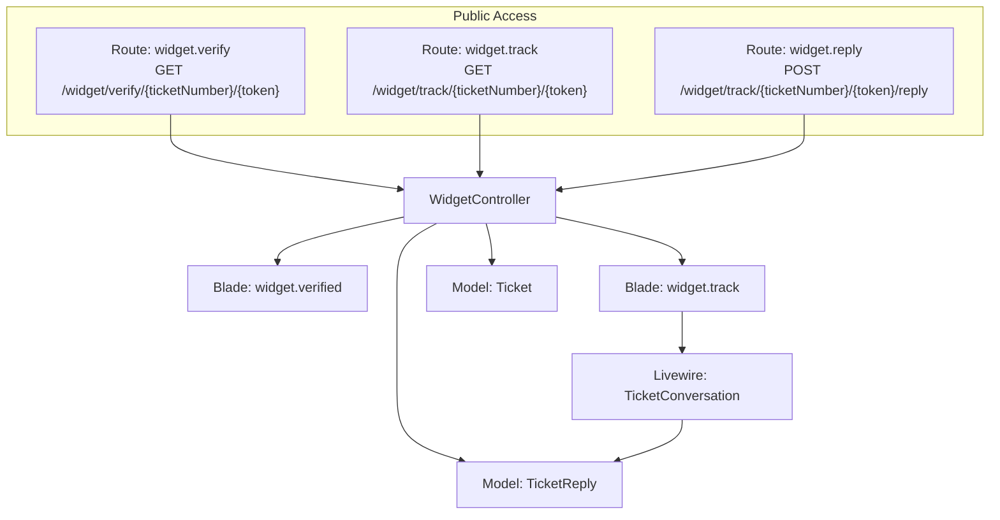
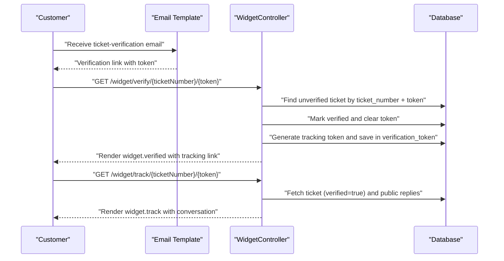
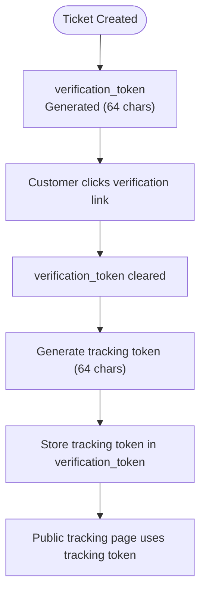
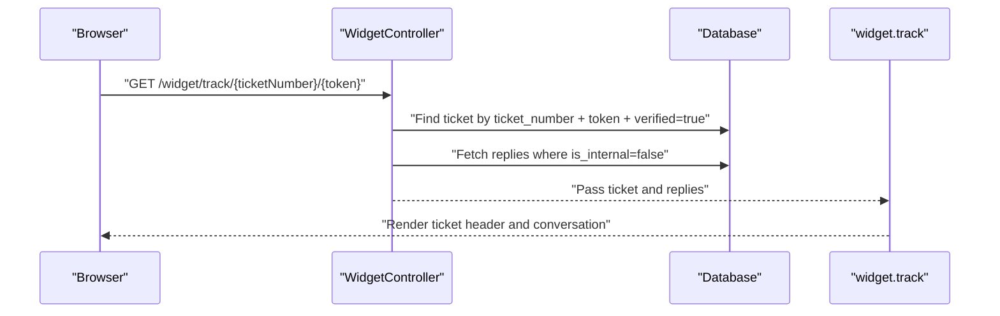
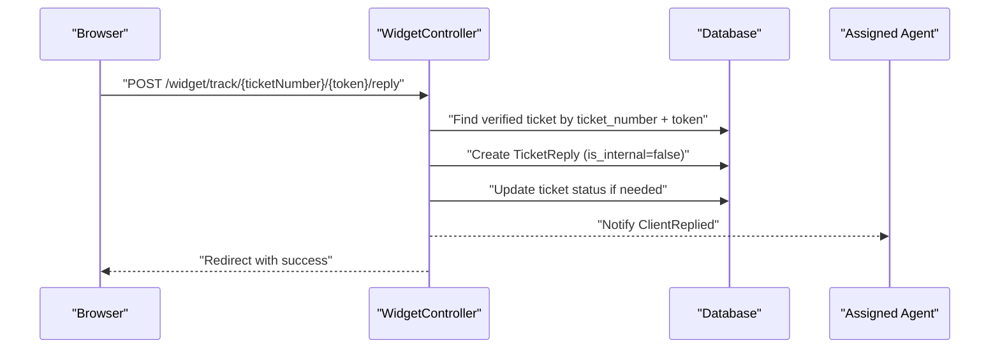
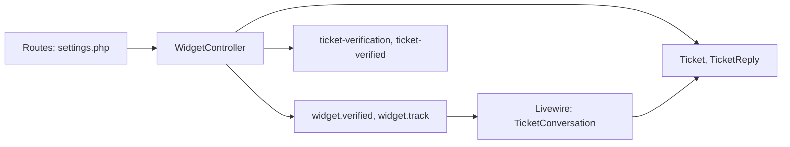

# Ticket Tracking System

<cite>
**Referenced Files in This Document**
- [WidgetController.php](file://app/Http/Controllers/WidgetController.php)
- [TicketConversation.php](file://app/Livewire/Widget/TicketConversation.php)
- [web.php](file://routes/web.php)
- [settings.php](file://routes/settings.php)
- [Ticket.php](file://app/Models/Ticket.php)
- [TicketReply.php](file://app/Models/TicketReply.php)
- [WidgetSetting.php](file://app/Models/WidgetSetting.php)
- [2026_02_01_224222_create_tickets_table.php](file://database/migrations/2026_02_01_224222_create_tickets_table.php)
- [2026_02_01_224225_create_ticket_replies_table.php](file://database/migrations/2026_02_01_224225_create_ticket_replies_table.php)
- [track.blade.php](file://resources/views/widget/track.blade.php)
- [verified.blade.php](file://resources/views/widget/verified.blade.php)
- [ticket-verification.blade.php](file://resources/views/emails/ticket-verification.blade.php)
- [ticket-verified.blade.php](file://resources/views/emails/ticket-verified.blade.php)
</cite>

## Table of Contents
1. [Introduction](#introduction)
2. [Project Structure](#project-structure)
3. [Core Components](#core-components)
4. [Architecture Overview](#architecture-overview)
5. [Detailed Component Analysis](#detailed-component-analysis)
6. [Dependency Analysis](#dependency-analysis)
7. [Performance Considerations](#performance-considerations)
8. [Security Considerations](#security-considerations)
9. [Troubleshooting Guide](#troubleshooting-guide)
10. [Conclusion](#conclusion)

## Introduction
This document explains the customer ticket tracking system that enables customers to monitor ticket status and participate in conversations without needing an account. It focuses on:
- How verification and tracking tokens work separately to provide secure public access
- The tracking page functionality: displaying ticket details, public reply history, and status updates
- The relationship between verification and tracking tokens and why they are distinct
- Examples of tracking URL structure and how companies can share tracking links
- The public reply display system that shows resolved responses while keeping internal notes private
- Security considerations including token lifecycle, access control, and preventing information leakage

## Project Structure
The tracking system spans routing, controllers, Livewire components, Blade views, models, and email templates. Public access is routed under the company subdomain and uses dedicated routes for verification, tracking, and replies.

**Diagram sources**
- [settings.php:12-19](file://routes/settings.php#L12-L19)
- [WidgetController.php:114-195](file://app/Http/Controllers/WidgetController.php#L114-L195)
- [TicketConversation.php:12-99](file://app/Livewire/Widget/TicketConversation.php#L12-L99)
- [Ticket.php:9-64](file://app/Models/Ticket.php#L9-L64)
- [TicketReply.php:8-39](file://app/Models/TicketReply.php#L8-L39)
- [verified.blade.php:1-85](file://resources/views/widget/verified.blade.php#L1-L85)
- [track.blade.php:1-90](file://resources/views/widget/track.blade.php#L1-L90)

**Section sources**
- [settings.php:12-19](file://routes/settings.php#L12-L19)
- [web.php:70-114](file://routes/web.php#L70-L114)

## Core Components
- WidgetController: Handles verification, tracking, and customer replies. Generates and validates tokens, fetches public replies, and updates ticket status.
- Livewire TicketConversation: Manages the real-time conversation UI, validates inputs, stores attachments, and dispatches notifications.
- Models: Ticket and TicketReply define the data schema and relationships, including the is_internal flag for public/internal visibility.
- Views: widget.verified and widget.track present verification confirmation and the tracking page respectively.
- Emails: ticket-verification and ticket-verified templates guide users through verification and deliver the tracking link.

**Section sources**
- [WidgetController.php:19-196](file://app/Http/Controllers/WidgetController.php#L19-L196)
- [TicketConversation.php:12-99](file://app/Livewire/Widget/TicketConversation.php#L12-L99)
- [Ticket.php:9-64](file://app/Models/Ticket.php#L9-L64)
- [TicketReply.php:8-39](file://app/Models/TicketReply.php#L8-L39)
- [verified.blade.php:1-85](file://resources/views/widget/verified.blade.php#L1-L85)
- [track.blade.php:1-90](file://resources/views/widget/track.blade.php#L1-L90)
- [ticket-verification.blade.php:1-106](file://resources/views/emails/ticket-verification.blade.php#L1-L106)
- [ticket-verified.blade.php:1-147](file://resources/views/emails/ticket-verified.blade.php#L1-L147)

## Architecture Overview
The system separates identity verification from ongoing public access:
- Verification phase: A unique verification token is generated during ticket creation and emailed to the customer. Upon clicking the verification link, the ticket is marked verified and a tracking token is issued.
- Tracking phase: The tracking token is used to access the public tracking page and submit replies. The token is stored in the verification_token field but repurposed for tracking after verification.

**Diagram sources**
- [WidgetController.php:114-158](file://app/Http/Controllers/WidgetController.php#L114-L158)
- [ticket-verification.blade.php:88-92](file://resources/views/emails/ticket-verification.blade.php#L88-L92)
- [ticket-verified.blade.php:117-121](file://resources/views/emails/ticket-verified.blade.php#L117-L121)
- [2026_02_01_224222_create_tickets_table.php:35-43](file://database/migrations/2026_02_01_224222_create_tickets_table.php#L35-L43)

## Detailed Component Analysis

### Token Mechanism: Verification vs Tracking
- Verification token:
  - Generated at ticket creation and stored in verification_token.
  - Used once to verify ownership of the email address.
  - After verification, the token is cleared and replaced with a tracking token.
- Tracking token:
  - A fresh random token generated post-verification.
  - Stored in the same verification_token field for simplicity.
  - Used for public access to the tracking page and submitting replies.

Why separate tokens:
- Prevents misuse: The verification token is single-use and invalidated upon first use.
- Reduces risk: The tracking token is long-lived for public access but still secret.
- Separates concerns: Verification confirms identity; tracking enables ongoing public monitoring.

**Diagram sources**
- [WidgetController.php:65-83](file://app/Http/Controllers/WidgetController.php#L65-L83)
- [WidgetController.php:128-135](file://app/Http/Controllers/WidgetController.php#L128-L135)
- [WidgetController.php:141-158](file://app/Http/Controllers/WidgetController.php#L141-L158)
- [2026_02_01_224222_create_tickets_table.php:35-43](file://database/migrations/2026_02_01_224222_create_tickets_table.php#L35-L43)

**Section sources**
- [WidgetController.php:65-83](file://app/Http/Controllers/WidgetController.php#L65-L83)
- [WidgetController.php:128-135](file://app/Http/Controllers/WidgetController.php#L128-L135)
- [WidgetController.php:141-158](file://app/Http/Controllers/WidgetController.php#L141-L158)
- [2026_02_01_224222_create_tickets_table.php:35-43](file://database/migrations/2026_02_01_224222_create_tickets_table.php#L35-L43)

### Tracking Page Functionality
- Ticket details display:
  - Subject, ticket number, submission date, status badge, priority badge, and optional category.
- Public reply history:
  - Only non-internal replies are shown, ordered chronologically.
- Status updates:
  - Resolved/closed tickets reopened to “open” when the customer replies; otherwise set to “pending”.

**Diagram sources**
- [WidgetController.php:141-158](file://app/Http/Controllers/WidgetController.php#L141-L158)
- [TicketReply.php:10-27](file://app/Models/TicketReply.php#L10-L27)
- [track.blade.php:16-84](file://resources/views/widget/track.blade.php#L16-L84)

**Section sources**
- [WidgetController.php:141-158](file://app/Http/Controllers/WidgetController.php#L141-L158)
- [TicketReply.php:10-27](file://app/Models/TicketReply.php#L10-L27)
- [track.blade.php:16-84](file://resources/views/widget/track.blade.php#L16-L84)

### Public Reply Submission
- Customer can submit replies via the tracking page or Livewire component.
- Validation ensures message length limits and optional attachments (up to 2, max 2MB each).
- Replies are stored as non-internal entries and can trigger status changes.

**Diagram sources**
- [WidgetController.php:163-195](file://app/Http/Controllers/WidgetController.php#L163-L195)
- [TicketConversation.php:30-82](file://app/Livewire/Widget/TicketConversation.php#L30-L82)
- [TicketReply.php:10-27](file://app/Models/TicketReply.php#L10-L27)

**Section sources**
- [WidgetController.php:163-195](file://app/Http/Controllers/WidgetController.php#L163-L195)
- [TicketConversation.php:30-82](file://app/Livewire/Widget/TicketConversation.php#L30-L82)
- [TicketReply.php:10-27](file://app/Models/TicketReply.php#L10-L27)

### URL Structure and Sharing
- Verification URL: /widget/verify/{ticketNumber}/{token}
- Tracking URL: /widget/track/{ticketNumber}/{token}
- Reply endpoint: /widget/track/{ticketNumber}/{token}/reply
- Companies can share the tracking link directly with customers via email or embed it on their website.

Examples:
- Verification: https://{company}.helpds.hlp/widget/verify/{ticketNumber}/{token}
- Tracking: https://{company}.helpds.hlp/widget/track/{ticketNumber}/{token}
- Reply: POST https://{company}.helpds.hlp/widget/track/{ticketNumber}/{token}/reply

**Section sources**
- [settings.php:12-19](file://routes/settings.php#L12-L19)
- [ticket-verified.blade.php:117-121](file://resources/views/emails/ticket-verified.blade.php#L117-L121)

## Dependency Analysis
The tracking system depends on:
- Routing under company subdomains for public access
- WidgetController for token validation, data retrieval, and reply persistence
- Livewire component for dynamic UI and attachment handling
- Models for schema enforcement and visibility filtering (is_internal)
- Email templates to guide users through verification and deliver tracking links

**Diagram sources**
- [settings.php:12-19](file://routes/settings.php#L12-L19)
- [WidgetController.php:19-196](file://app/Http/Controllers/WidgetController.php#L19-L196)
- [TicketConversation.php:12-99](file://app/Livewire/Widget/TicketConversation.php#L12-L99)
- [Ticket.php:9-64](file://app/Models/Ticket.php#L9-L64)
- [TicketReply.php:8-39](file://app/Models/TicketReply.php#L8-L39)
- [ticket-verification.blade.php:1-106](file://resources/views/emails/ticket-verification.blade.php#L1-L106)
- [ticket-verified.blade.php:1-147](file://resources/views/emails/ticket-verified.blade.php#L1-L147)

**Section sources**
- [settings.php:12-19](file://routes/settings.php#L12-L19)
- [WidgetController.php:19-196](file://app/Http/Controllers/WidgetController.php#L19-L196)
- [TicketConversation.php:12-99](file://app/Livewire/Widget/TicketConversation.php#L12-L99)
- [Ticket.php:9-64](file://app/Models/Ticket.php#L9-L64)
- [TicketReply.php:8-39](file://app/Models/TicketReply.php#L8-L39)

## Performance Considerations
- Indexes on tickets and ticket_replies optimize lookups by ticket_number, verification_token, and created_at.
- Fetching only non-internal replies reduces payload size on the tracking page.
- Livewire lazy loading and pagination (if extended) can further improve responsiveness for long histories.

[No sources needed since this section provides general guidance]

## Security Considerations
- Token generation:
  - Both verification and tracking tokens are 64-character random strings, suitable for cryptographic security.
- Token lifecycle:
  - Verification token is cleared after successful verification.
  - Tracking token remains active for the duration of the ticket’s lifecycle; consider implementing expiration policies at the application level if needed.
- Access control:
  - All endpoints require a valid ticket_number and matching token; only verified tickets are accessible.
  - Public replies are filtered by is_internal=false; internal notes remain private.
- Information leakage prevention:
  - The tracking page does not expose internal agent-only details.
  - Subdomain-based routing confines access to the company context.
- CSRF protection:
  - The tracking view includes a CSRF meta tag for protection against cross-site request forgery.

**Section sources**
- [WidgetController.php:114-158](file://app/Http/Controllers/WidgetController.php#L114-L158)
- [WidgetController.php:163-195](file://app/Http/Controllers/WidgetController.php#L163-L195)
- [TicketReply.php:10-27](file://app/Models/TicketReply.php#L10-L27)
- [track.blade.php:7-8](file://resources/views/widget/track.blade.php#L7-L8)
- [2026_02_01_224222_create_tickets_table.php:35-43](file://database/migrations/2026_02_01_224222_create_tickets_table.php#L35-L43)
- [2026_02_01_224225_create_ticket_replies_table.php:19-21](file://database/migrations/2026_02_01_224225_create_ticket_replies_table.php#L19-L21)

## Troubleshooting Guide
- Verification link invalid or expired:
  - Ensure the ticket exists, is unverified, and the token matches exactly.
  - Tokens are single-use; after verification, the original token is cleared.
- Tracking page inaccessible:
  - Confirm the ticket is verified and the tracking token matches.
  - Verify the ticket_number and company subdomain are correct.
- Reply not appearing:
  - Ensure the reply endpoint is called with the correct ticket_number and token.
  - Check that the message meets validation rules and attachments are within size limits.
- Status not updating:
  - Replies from customers on resolved/closed tickets set the status to open; others set to pending.

**Section sources**
- [WidgetController.php:114-158](file://app/Http/Controllers/WidgetController.php#L114-L158)
- [WidgetController.php:163-195](file://app/Http/Controllers/WidgetController.php#L163-L195)
- [TicketConversation.php:30-82](file://app/Livewire/Widget/TicketConversation.php#L30-L82)

## Conclusion
The ticket tracking system provides secure, public access to ticket information by separating verification and tracking tokens. Customers receive a verification email, then a tracking link that grants read/write access to public replies until resolution. The design keeps internal communications private, enforces strict access controls, and offers a straightforward URL structure for companies to share with customers.