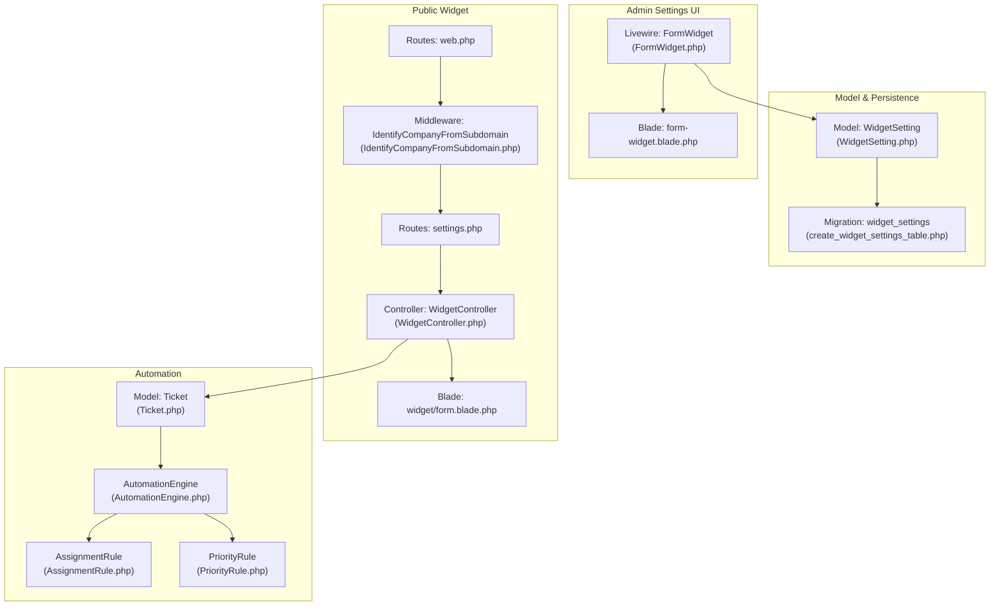
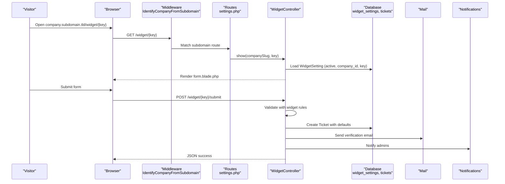
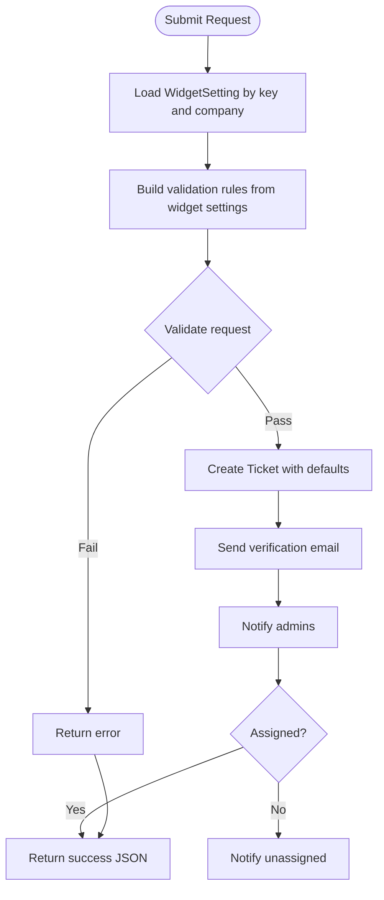
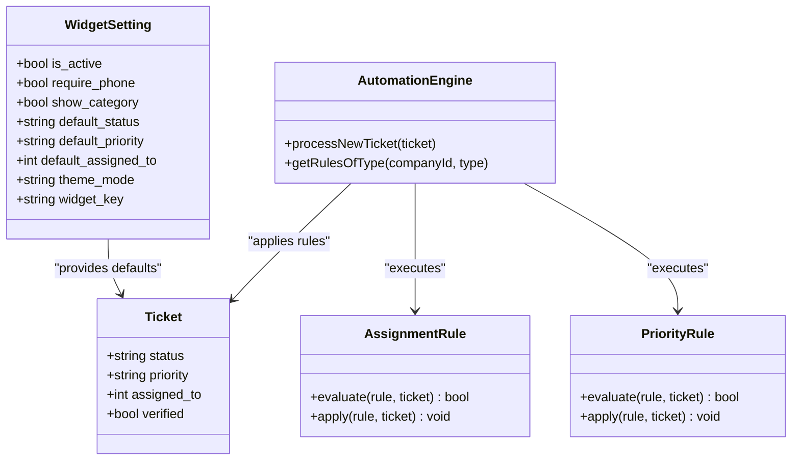
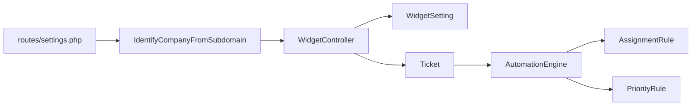

# Widget Configuration & Customization

<cite>
**Referenced Files in This Document**
- [WidgetSetting.php](file://app/Models/WidgetSetting.php)
- [create_widget_settings_table.php](file://database/migrations/2026_02_06_154114_create_widget_settings_table.php)
- [WidgetController.php](file://app/Http/Controllers/WidgetController.php)
- [form-widget.blade.php](file://resources/views/livewire/settings/form-widget.blade.php)
- [FormWidget.php](file://app/Livewire/Settings/FormWidget.php)
- [form.blade.php](file://resources/views/widget/form.blade.php)
- [web.php](file://routes/web.php)
- [settings.php](file://routes/settings.php)
- [IdentifyCompanyFromSubdomain.php](file://app/Http/Middleware/IdentifyCompanyFromSubdomain.php)
- [Ticket.php](file://app/Models/Ticket.php)
- [AutomationEngine.php](file://app/Services/Automation/AutomationEngine.php)
- [AssignmentRule.php](file://app/Services/Automation/Rules/AssignmentRule.php)
- [PriorityRule.php](file://app/Services/Automation/Rules/PriorityRule.php)
</cite>

## Table of Contents
1. [Introduction](#introduction)
2. [Project Structure](#project-structure)
3. [Core Components](#core-components)
4. [Architecture Overview](#architecture-overview)
5. [Detailed Component Analysis](#detailed-component-analysis)
6. [Dependency Analysis](#dependency-analysis)
7. [Performance Considerations](#performance-considerations)
8. [Troubleshooting Guide](#troubleshooting-guide)
9. [Conclusion](#conclusion)
10. [Appendices](#appendices)

## Introduction
This document explains how to configure and customize the public-facing widget used to collect support tickets, inquiries, and feedback. It covers:
- Configurable fields: form field visibility (phone, category), default priority, status, and agent assignment
- Theme customization and branding
- Widget key generation and management
- Relationship between widget settings and automation rules
- Performance considerations for widget loading and form validation
- Best practices for deploying widgets across multiple domains and subdomains

## Project Structure
The widget feature spans models, controllers, Livewire components, Blade templates, routes, middleware, and automation services. The following diagram shows how these pieces fit together.

**Diagram sources**
- [FormWidget.php:1-157](file://app/Livewire/Settings/FormWidget.php#L1-L157)
- [form-widget.blade.php:1-256](file://resources/views/livewire/settings/form-widget.blade.php#L1-L256)
- [WidgetSetting.php:1-71](file://app/Models/WidgetSetting.php#L1-L71)
- [create_widget_settings_table.php:1-46](file://database/migrations/2026_02_06_154114_create_widget_settings_table.php#L1-L46)
- [web.php:70-114](file://routes/web.php#L70-L114)
- [settings.php:12-19](file://routes/settings.php#L12-L19)
- [IdentifyCompanyFromSubdomain.php:1-54](file://app/Http/Middleware/IdentifyCompanyFromSubdomain.php#L1-L54)
- [WidgetController.php:19-197](file://app/Http/Controllers/WidgetController.php#L19-L197)
- [form.blade.php:1-250](file://resources/views/widget/form.blade.php#L1-L250)
- [AutomationEngine.php:15-142](file://app/Services/Automation/AutomationEngine.php#L15-L142)
- [AssignmentRule.php:9-67](file://app/Services/Automation/Rules/AssignmentRule.php#L9-L67)
- [PriorityRule.php:9-69](file://app/Services/Automation/Rules/PriorityRule.php#L9-L69)
- [Ticket.php:9-64](file://app/Models/Ticket.php#L9-L64)

**Section sources**
- [web.php:70-114](file://routes/web.php#L70-L114)
- [settings.php:12-19](file://routes/settings.php#L12-L19)
- [IdentifyCompanyFromSubdomain.php:10-36](file://app/Http/Middleware/IdentifyCompanyFromSubdomain.php#L10-L36)

## Core Components
- WidgetSetting model: Stores per-company widget configuration, generates and manages the widget_key, and exposes computed URLs and iframe code.
- WidgetController: Handles widget rendering, form submission, verification, tracking, and replies.
- Livewire FormWidget: Admin UI to edit appearance, form fields, defaults, and integration details.
- Blade templates: Public form and admin settings pages.
- Middleware and routes: Subdomain-based routing and company identification for the widget endpoints.
- Automation engine and rules: Apply default assignments and priorities after ticket creation.

**Section sources**
- [WidgetSetting.php:9-71](file://app/Models/WidgetSetting.php#L9-L71)
- [WidgetController.php:19-197](file://app/Http/Controllers/WidgetController.php#L19-L197)
- [FormWidget.php:10-157](file://app/Livewire/Settings/FormWidget.php#L10-L157)
- [form-widget.blade.php:1-256](file://resources/views/livewire/settings/form-widget.blade.php#L1-L256)
- [form.blade.php:1-250](file://resources/views/widget/form.blade.php#L1-L250)

## Architecture Overview
The widget operates under a subdomain-per-company model. Requests to company.subdomain.tld/widget/{key} are handled by the WidgetController. The controller validates inputs against widget settings, creates tickets with default statuses/priorities/assignments, and triggers notifications and optional automation.

**Diagram sources**
- [settings.php:12-19](file://routes/settings.php#L12-L19)
- [IdentifyCompanyFromSubdomain.php:12-36](file://app/Http/Middleware/IdentifyCompanyFromSubdomain.php#L12-L36)
- [WidgetController.php:24-109](file://app/Http/Controllers/WidgetController.php#L24-L109)
- [Ticket.php:14-39](file://app/Models/Ticket.php#L14-L39)

## Detailed Component Analysis

### Widget Settings Model and Schema
- Persistence: widget_settings table stores per-company settings including widget_key, activation flag, appearance, form fields, and default ticket attributes.
- Generation: widget_key is generated automatically if missing.
- Computed URLs: widget_url and iframe_code are derived from company slug and configured domain.

Key fields and behaviors:
- Appearance: theme_mode (dark/light), form_title, welcome_message, success_message
- Form fields: require_phone, show_category
- Defaults: default_assigned_to, default_status, default_priority
- Activation: is_active toggles public availability

**Section sources**
- [create_widget_settings_table.php:11-38](file://database/migrations/2026_02_06_154114_create_widget_settings_table.php#L11-L38)
- [WidgetSetting.php:13-17](file://app/Models/WidgetSetting.php#L13-L17)
- [WidgetSetting.php:21-25](file://app/Models/WidgetSetting.php#L21-L25)
- [WidgetSetting.php:28-35](file://app/Models/WidgetSetting.php#L28-L35)
- [WidgetSetting.php:47-69](file://app/Models/WidgetSetting.php#L47-L69)

### Admin Configuration UI (Livewire)
- Provides live updates to theme_mode, form_title, messages, require_phone, show_category, default_assigned_to, default_status, default_priority, and is_active.
- Generates and regenerates widget_key and displays embed code.

Configuration highlights:
- Theme mode: dark/light selection
- Messages: form_title, welcome_message, success_message
- Field visibility: require_phone, show_category
- Defaults: default_assigned_to (agent), default_status (pending/open), default_priority (low/medium/high/urgent)
- Integration: direct link and iFrame embed code

**Section sources**
- [FormWidget.php:14-38](file://app/Livewire/Settings/FormWidget.php#L14-L38)
- [FormWidget.php:89-137](file://app/Livewire/Settings/FormWidget.php#L89-L137)
- [form-widget.blade.php:34-156](file://resources/views/livewire/settings/form-widget.blade.php#L34-L156)

### Public Widget Form Rendering
- Uses theme_mode to set dark mode class on the page.
- Conditionally renders phone field and category selector based on widget settings.
- Displays success message and ticket number after submission.

Validation and rendering logic:
- require_phone controls whether phone is required
- show_category controls category dropdown presence
- Dynamic success messaging and ticket number display

**Section sources**
- [form.blade.php:2](file://resources/views/widget/form.blade.php#L2)
- [form.blade.php:119-128](file://resources/views/widget/form.blade.php#L119-L128)
- [form.blade.php:151-163](file://resources/views/widget/form.blade.php#L151-L163)
- [form.blade.php:213-247](file://resources/views/widget/form.blade.php#L213-L247)

### Submission Workflow and Default Values
- Validation rules are dynamically built from widget settings (phone requirement, category visibility).
- Ticket creation applies default_priority, default_status, default_assigned_to from widget settings.
- Verification email is sent; admins are notified; unassigned tickets trigger an “unassigned” notification.

**Diagram sources**
- [WidgetController.php:41-109](file://app/Http/Controllers/WidgetController.php#L41-L109)
- [Ticket.php:69-83](file://app/Models/Ticket.php#L69-L83)

**Section sources**
- [WidgetController.php:49-58](file://app/Http/Controllers/WidgetController.php#L49-L58)
- [WidgetController.php:69-83](file://app/Http/Controllers/WidgetController.php#L69-L83)
- [WidgetController.php:85-102](file://app/Http/Controllers/WidgetController.php#L85-L102)

### Widget Key Generation and Management
- Automatic generation during creation if widget_key is empty.
- Regeneration option in the admin UI; warns that embed code must be updated.

Security and operational notes:
- Keys are random 32-character strings checked for uniqueness.
- Regenerating invalidates prior embed codes; update integrations accordingly.

**Section sources**
- [WidgetSetting.php:21-25](file://app/Models/WidgetSetting.php#L21-L25)
- [WidgetSetting.php:28-35](file://app/Models/WidgetSetting.php#L28-L35)
- [FormWidget.php:129-137](file://app/Livewire/Settings/FormWidget.php#L129-L137)
- [form-widget.blade.php:213-229](file://resources/views/livewire/settings/form-widget.blade.php#L213-L229)

### Theme Customization and Branding
- Theme mode: dark or light; applied via a global class on the page element.
- Branding: form_title and optional welcome/success messages; footer attribution shows company name.

**Section sources**
- [form-widget.blade.php:34-70](file://resources/views/livewire/settings/form-widget.blade.php#L34-L70)
- [form.blade.php:2](file://resources/views/widget/form.blade.php#L2)
- [form.blade.php:74-77](file://resources/views/widget/form.blade.php#L74-L77)
- [form.blade.php:180](file://resources/views/widget/form.blade.php#L180)

### Relationship Between Widget Settings and Automation Rules
- Default ticket values (status, priority, assignee) are applied at creation time.
- AutomationEngine processes rules for newly created tickets (excluding escalations), potentially overriding defaults.
- AssignmentRule respects verified state and existing assignments.
- PriorityRule can increase priority based on keywords and category conditions.

**Diagram sources**
- [WidgetSetting.php:13-31](file://app/Models/WidgetSetting.php#L13-L31)
- [Ticket.php:14-39](file://app/Models/Ticket.php#L14-L39)
- [AutomationEngine.php:30-96](file://app/Services/Automation/AutomationEngine.php#L30-L96)
- [AssignmentRule.php:15-65](file://app/Services/Automation/Rules/AssignmentRule.php#L15-L65)
- [PriorityRule.php:11-66](file://app/Services/Automation/Rules/PriorityRule.php#L11-L66)

**Section sources**
- [WidgetController.php:78-82](file://app/Http/Controllers/WidgetController.php#L78-L82)
- [AutomationEngine.php:30-41](file://app/Services/Automation/AutomationEngine.php#L30-L41)
- [AssignmentRule.php:17-25](file://app/Services/Automation/Rules/AssignmentRule.php#L17-L25)
- [PriorityRule.php:15-31](file://app/Services/Automation/Rules/PriorityRule.php#L15-L31)

### Configuration Examples by Use Case
- Support portal
  - Enable show_category if categories exist; set default_status to open; optionally set default_priority to medium/high; optionally pre-assign a default agent.
  - Keep require_phone disabled unless collecting phone is mandatory.
- Sales inquiry
  - Enable require_phone; keep default_status pending; set default_priority low or medium; optionally pre-assign a sales agent.
- General feedback
  - Disable show_category; set default_status open; set default_priority low; keep default_assigned_to blank to allow automation to assign.

These choices are controlled by the admin UI fields and persisted in widget_settings.

**Section sources**
- [form-widget.blade.php:81-144](file://resources/views/livewire/settings/form-widget.blade.php#L81-L144)
- [WidgetController.php:49-58](file://app/Http/Controllers/WidgetController.php#L49-L58)

## Dependency Analysis
- Routes bind subdomain-based widget endpoints to the controller.
- Middleware identifies the company by subdomain and attaches it to the request.
- Controller depends on WidgetSetting for configuration and on Ticket model for persistence.
- AutomationEngine runs after ticket creation to enforce company rules.

**Diagram sources**
- [settings.php:12-19](file://routes/settings.php#L12-L19)
- [IdentifyCompanyFromSubdomain.php:12-36](file://app/Http/Middleware/IdentifyCompanyFromSubdomain.php#L12-L36)
- [WidgetController.php:24-109](file://app/Http/Controllers/WidgetController.php#L24-L109)
- [AutomationEngine.php:30-96](file://app/Services/Automation/AutomationEngine.php#L30-L96)

**Section sources**
- [web.php:70-114](file://routes/web.php#L70-L114)
- [settings.php:12-19](file://routes/settings.php#L12-L19)
- [IdentifyCompanyFromSubdomain.php:12-36](file://app/Http/Middleware/IdentifyCompanyFromSubdomain.php#L12-L36)

## Performance Considerations
- Widget loading
  - The form template is server-rendered and lightweight; ensure Tailwind CDN usage is acceptable for your network.
  - Minimize heavy assets in the public form; leverage browser caching.
- Form validation
  - Client-side fetch with JSON avoids full page reloads; keep payload small.
  - Validation rules are dynamic but straightforward; avoid excessive client-side complexity.
- Automation impact
  - New ticket processing runs synchronously except escalations; keep rule count reasonable and conditions efficient.
- Subdomain routing
  - Middleware performs a single company lookup; ensure company slug indexing is effective.

[No sources needed since this section provides general guidance]

## Troubleshooting Guide
- Widget not visible
  - Confirm is_active is enabled in the admin UI.
  - Verify the widget_key matches the URL segment and belongs to the correct company.
- Form not submitting
  - Check that required fields align with widget settings (e.g., phone required if enabled).
  - Inspect browser console for fetch errors and CSRF token presence.
- Wrong default values
  - Review default_assigned_to, default_status, default_priority in the admin UI.
  - Confirm automation rules are not overriding these defaults post-creation.
- Embed code broken after regeneration
  - After regenerating widget_key, update the embedded iFrame code in your site.

**Section sources**
- [WidgetController.php:49-58](file://app/Http/Controllers/WidgetController.php#L49-L58)
- [WidgetController.php:104-108](file://app/Http/Controllers/WidgetController.php#L104-L108)
- [FormWidget.php:129-137](file://app/Livewire/Settings/FormWidget.php#L129-L137)
- [form-widget.blade.php:213-229](file://resources/views/livewire/settings/form-widget.blade.php#L213-L229)

## Conclusion
The widget system offers flexible configuration for form fields, defaults, and branding, with robust integration into the automation pipeline. Admins can tailor the widget per company and per use case, while developers can safely deploy the widget across subdomains using the provided routes and middleware.

[No sources needed since this section summarizes without analyzing specific files]

## Appendices

### Deployment Best Practices Across Domains and Subdomains
- Subdomain setup
  - Ensure company.slug resolves to company.subdomain.tld so middleware can identify the company.
- Cross-domain embedding
  - The widget is designed for subdomain embedding; cross-origin embedding may require CORS and iframe policies review.
- Key management
  - Treat widget_key as a secret; rotate keys periodically and update embed codes accordingly.
- Monitoring
  - Watch for spikes in submissions and adjust automation rules to prevent bottlenecks.

**Section sources**
- [web.php:70-114](file://routes/web.php#L70-L114)
- [settings.php:12-19](file://routes/settings.php#L12-L19)
- [IdentifyCompanyFromSubdomain.php:12-36](file://app/Http/Middleware/IdentifyCompanyFromSubdomain.php#L12-L36)