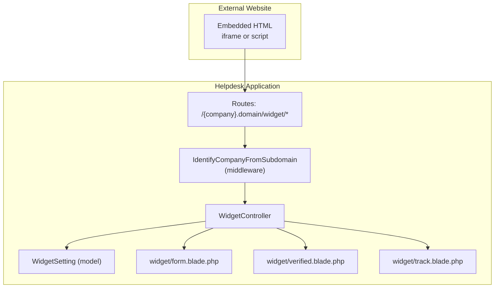
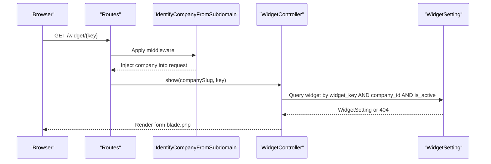
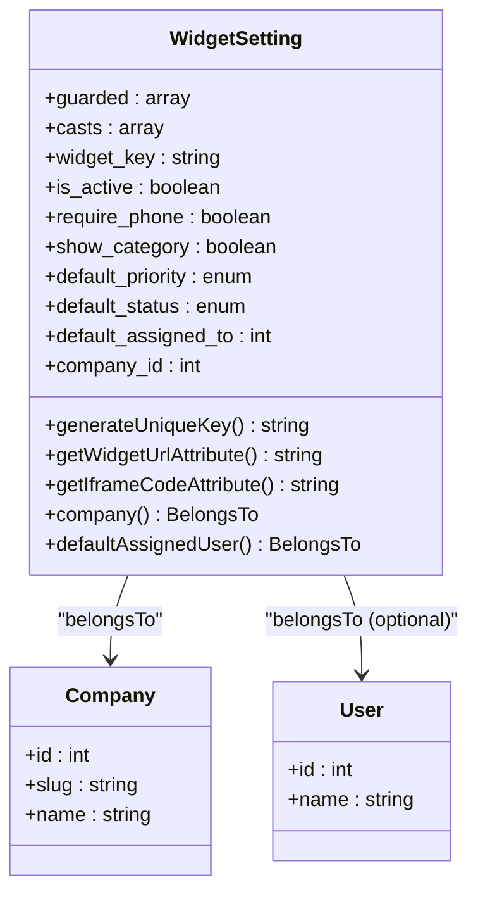
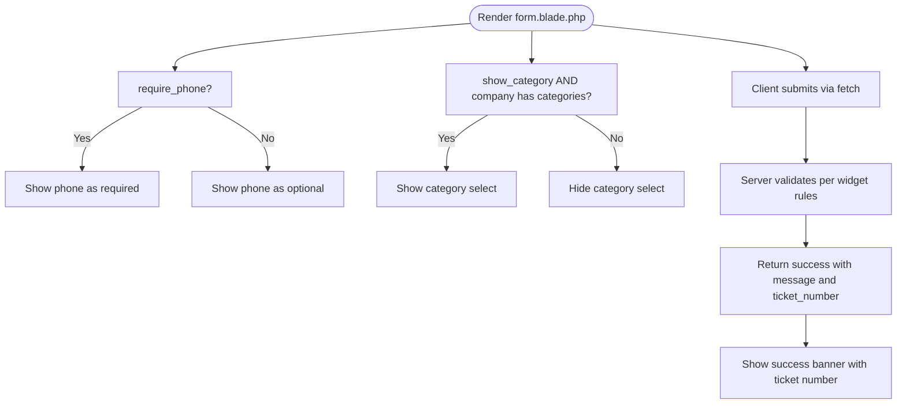
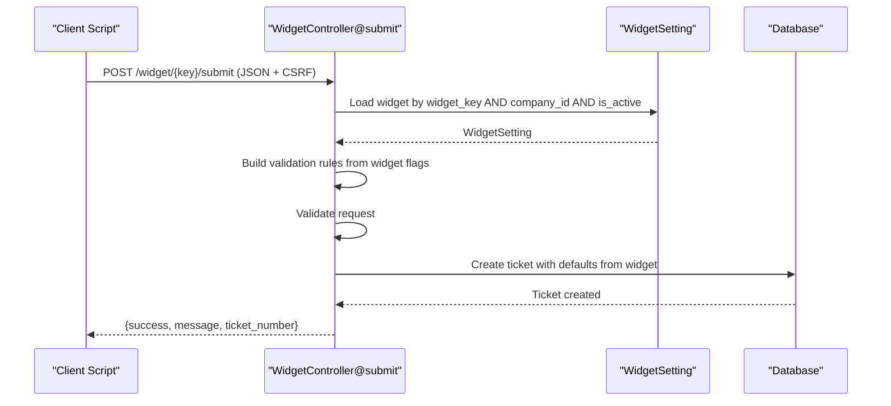
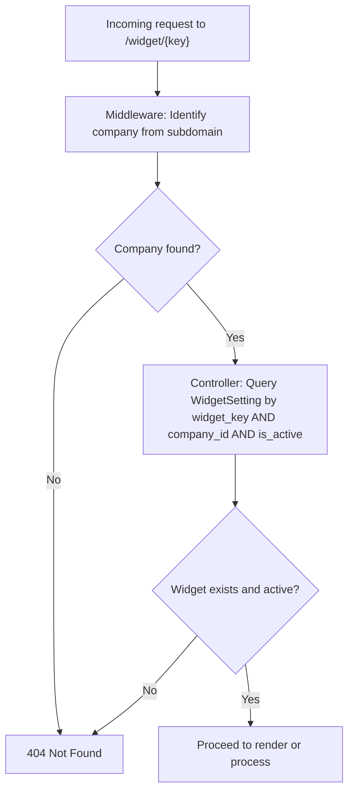
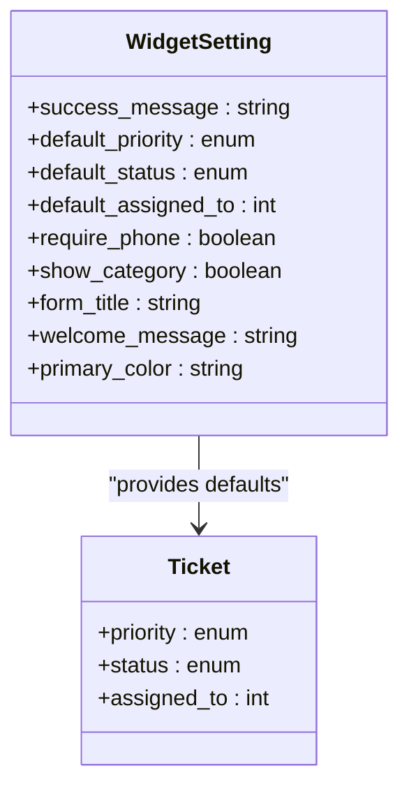
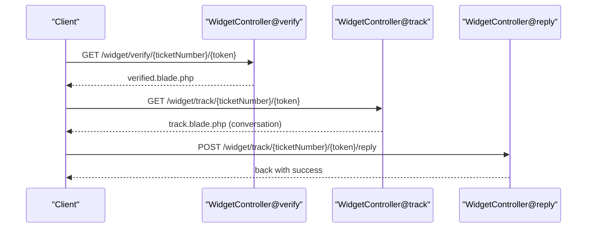
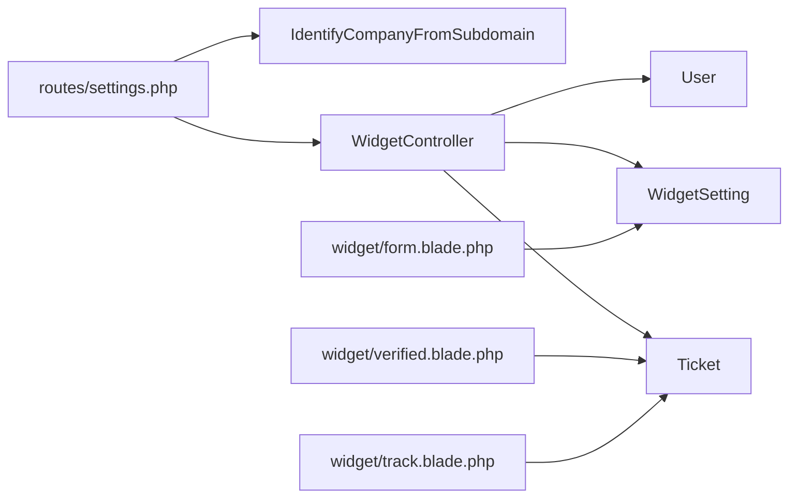

# Widget Form Integration

<cite>
**Referenced Files in This Document**
- [WidgetSetting.php](file://app/Models/WidgetSetting.php)
- [WidgetController.php](file://app/Http/Controllers/WidgetController.php)
- [form.blade.php](file://resources/views/widget/form.blade.php)
- [track.blade.php](file://resources/views/widget/track.blade.php)
- [verified.blade.php](file://resources/views/widget/verified.blade.php)
- [2026_02_06_154114_create_widget_settings_table.php](file://database/migrations/2026_02_06_154114_create_widget_settings_table.php)
- [web.php](file://routes/web.php)
- [settings.php](file://routes/settings.php)
- [IdentifyCompanyFromSubdomain.php](file://app/Http/Middleware/IdentifyCompanyFromSubdomain.php)
- [FormWidgetThemeTest.php](file://tests/Feature/FormWidgetThemeTest.php)
</cite>

## Table of Contents
1. [Introduction](#introduction)
2. [Project Structure](#project-structure)
3. [Core Components](#core-components)
4. [Architecture Overview](#architecture-overview)
5. [Detailed Component Analysis](#detailed-component-analysis)
6. [Dependency Analysis](#dependency-analysis)
7. [Performance Considerations](#performance-considerations)
8. [Troubleshooting Guide](#troubleshooting-guide)
9. [Conclusion](#conclusion)
10. [Appendices](#appendices)

## Introduction
This document explains the widget form integration system used by external websites to embed a helpdesk submission form. It covers how the widget_key authenticates requests, how the form is rendered with dynamic field visibility, validation rules, client-side integration, security mechanisms, and the relationship between the WidgetSetting model and form configuration options such as success messages, default priorities, and status assignments.

## Project Structure
The widget system spans models, controllers, Blade templates, routes, middleware, and migrations:
- Model: WidgetSetting defines the widget configuration and generates the widget_key.
- Controller: WidgetController orchestrates form display, submission, verification, tracking, and replies.
- Views: Blade templates render the form, verification, and tracking pages.
- Routes: Public routes under company subdomains expose the widget endpoints.
- Middleware: Subdomain-based company identification.
- Migration: Defines the widget_settings table schema.

**Diagram sources**
- [settings.php:13-19](file://routes/settings.php#L13-L19)
- [IdentifyCompanyFromSubdomain.php:12-36](file://app/Http/Middleware/IdentifyCompanyFromSubdomain.php#L12-L36)
- [WidgetController.php:24-36](file://app/Http/Controllers/WidgetController.php#L24-L36)
- [WidgetSetting.php:37-45](file://app/Models/WidgetSetting.php#L37-L45)
- [form.blade.php:1-250](file://resources/views/widget/form.blade.php#L1-L250)
- [verified.blade.php:1-85](file://resources/views/widget/verified.blade.php#L1-L85)
- [track.blade.php:1-90](file://resources/views/widget/track.blade.php#L1-L90)

**Section sources**
- [settings.php:13-19](file://routes/settings.php#L13-L19)
- [IdentifyCompanyFromSubdomain.php:12-36](file://app/Http/Middleware/IdentifyCompanyFromSubdomain.php#L12-L36)
- [WidgetController.php:24-36](file://app/Http/Controllers/WidgetController.php#L24-L36)
- [WidgetSetting.php:37-45](file://app/Models/WidgetSetting.php#L37-L45)
- [form.blade.php:1-250](file://resources/views/widget/form.blade.php#L1-L250)
- [verified.blade.php:1-85](file://resources/views/widget/verified.blade.php#L1-L85)
- [track.blade.php:1-90](file://resources/views/widget/track.blade.php#L1-L90)

## Core Components
- WidgetSetting model
  - Generates and stores widget_key automatically.
  - Provides computed attributes for widget_url and iframe_code.
  - Defines relationships to Company and default assigned User.
  - Casts booleans for require_phone and show_category.
- WidgetController
  - Validates widget_key against company_id and is_active.
  - Renders the form with dynamic fields based on widget settings.
  - Submits tickets with configurable defaults (priority, status, assignment).
  - Handles verification and tracking flows.
- Blade Templates
  - form.blade.php renders the form and integrates client-side submission.
  - verified.blade.php shows post-verification messaging.
  - track.blade.php displays ticket details and conversation thread.
- Routes and Middleware
  - Public widget routes under company subdomains.
  - Middleware identifies company from subdomain and attaches to request.

**Section sources**
- [WidgetSetting.php:11-45](file://app/Models/WidgetSetting.php#L11-L45)
- [WidgetController.php:24-109](file://app/Http/Controllers/WidgetController.php#L24-L109)
- [form.blade.php:93-176](file://resources/views/widget/form.blade.php#L93-L176)
- [verified.blade.php:26-74](file://resources/views/widget/verified.blade.php#L26-L74)
- [track.blade.php:16-79](file://resources/views/widget/track.blade.php#L16-L79)
- [settings.php:13-19](file://routes/settings.php#L13-L19)
- [IdentifyCompanyFromSubdomain.php:12-36](file://app/Http/Middleware/IdentifyCompanyFromSubdomain.php#L12-L36)

## Architecture Overview
The widget system enforces authorization using two layered checks:
- Subdomain-based company identification via middleware.
- Widget-specific authorization via widget_key bound to the company and active flag.

**Diagram sources**
- [settings.php:13-19](file://routes/settings.php#L13-L19)
- [IdentifyCompanyFromSubdomain.php:12-36](file://app/Http/Middleware/IdentifyCompanyFromSubdomain.php#L12-L36)
- [WidgetController.php:24-36](file://app/Http/Controllers/WidgetController.php#L24-L36)
- [WidgetSetting.php:29-33](file://app/Models/WidgetSetting.php#L29-L33)

## Detailed Component Analysis

### WidgetSetting Model and Configuration Options
- Fields and casts
  - Boolean flags: is_active, require_phone, show_category.
  - String and enum fields for appearance and defaults.
- Automatic widget_key generation
  - Ensures uniqueness before creation.
- Computed attributes
  - widget_url: constructs the canonical widget URL using company slug and app domain.
  - iframe_code: returns a ready-to-use iframe snippet.
- Relationships
  - belongsTo Company and optional defaultAssignedUser.

**Diagram sources**
- [WidgetSetting.php:11-70](file://app/Models/WidgetSetting.php#L11-L70)
- [2026_02_06_154114_create_widget_settings_table.php:11-38](file://database/migrations/2026_02_06_154114_create_widget_settings_table.php#L11-L38)

**Section sources**
- [WidgetSetting.php:11-70](file://app/Models/WidgetSetting.php#L11-L70)
- [2026_02_06_154114_create_widget_settings_table.php:11-38](file://database/migrations/2026_02_06_154114_create_widget_settings_table.php#L11-L38)

### Form Rendering and Dynamic Field Visibility
- Dynamic visibility
  - Phone field is required only when require_phone is enabled.
  - Category dropdown appears only when show_category is enabled and company has categories.
- Theme and presentation
  - Uses Tailwind CSS and supports dark/light theme via theme_mode.
- Client-side integration
  - Submits via fetch to the widget submit endpoint with CSRF token.
  - Displays success message with ticket number and hides the form.

**Diagram sources**
- [form.blade.php:115-163](file://resources/views/widget/form.blade.php#L115-L163)
- [WidgetController.php:49-56](file://app/Http/Controllers/WidgetController.php#L49-L56)

**Section sources**
- [form.blade.php:115-163](file://resources/views/widget/form.blade.php#L115-L163)
- [WidgetController.php:49-56](file://app/Http/Controllers/WidgetController.php#L49-L56)

### Form Validation Rules and Client-Side Integration
- Validation rules are dynamically built from WidgetSetting:
  - customer_name, customer_email, subject, description are required.
  - customer_phone is conditionally required based on require_phone.
  - category_id is validated only when show_category is enabled.
- Client-side submission:
  - Serializes form data and sends JSON with CSRF token.
  - On success, replaces the form with a success message containing the ticket number.

**Diagram sources**
- [WidgetController.php:41-109](file://app/Http/Controllers/WidgetController.php#L41-L109)
- [WidgetSetting.php:29-45](file://app/Models/WidgetSetting.php#L29-L45)

**Section sources**
- [WidgetController.php:49-56](file://app/Http/Controllers/WidgetController.php#L49-L56)
- [WidgetController.php:69-83](file://app/Http/Controllers/WidgetController.php#L69-L83)
- [form.blade.php:213-221](file://resources/views/widget/form.blade.php#L213-L221)

### Security Mechanisms: widget_key and Authorization
- widget_key
  - Random 32-character string generated automatically and stored in widget_settings.
  - Used to authorize widget access for a specific company.
- Authorization flow
  - Middleware extracts company from subdomain and attaches to request.
  - Controller queries WidgetSetting with widget_key, company_id, and is_active.
  - Only active widgets belonging to the identified company can serve requests.

**Diagram sources**
- [IdentifyCompanyFromSubdomain.php:12-36](file://app/Http/Middleware/IdentifyCompanyFromSubdomain.php#L12-L36)
- [WidgetController.php:29-33](file://app/Http/Controllers/WidgetController.php#L29-L33)

**Section sources**
- [WidgetSetting.php:28-35](file://app/Models/WidgetSetting.php#L28-L35)
- [WidgetController.php:29-33](file://app/Http/Controllers/WidgetController.php#L29-L33)
- [IdentifyCompanyFromSubdomain.php:12-36](file://app/Http/Middleware/IdentifyCompanyFromSubdomain.php#L12-L36)

### Relationship Between WidgetSetting and Form Configuration
- Success message
  - success_message is returned to the client upon successful submission.
- Default ticket settings
  - default_priority and default_status are applied when creating tickets.
  - default_assigned_to can be set to a specific user or left null.
- Theme and presentation
  - form_title, welcome_message, primary_color influence the rendered form.
- Dynamic fields
  - require_phone toggles phone field requirement.
  - show_category controls category dropdown visibility.

**Diagram sources**
- [WidgetSetting.php:13-30](file://app/Models/WidgetSetting.php#L13-L30)
- [WidgetController.php:78-82](file://app/Http/Controllers/WidgetController.php#L78-L82)

**Section sources**
- [WidgetSetting.php:13-30](file://app/Models/WidgetSetting.php#L13-L30)
- [WidgetController.php:78-82](file://app/Http/Controllers/WidgetController.php#L78-L82)

### HTML Embedding Examples
Below are recommended embedding approaches for external websites. Replace placeholders with the actual company slug and widget_key.

- Iframe embedding
  - Use the iframe_code attribute from WidgetSetting to embed the form.
  - Example: <iframe src="https://{company}.domain/widget/{widget_key}" width="100%" height="700" frameborder="0"></iframe>

- Script-based embedding (custom)
  - Fetch the form from the widget endpoint and inject it into a container.
  - Include CSRF token meta tag and ensure same-origin policy compliance.

- CMS and e-commerce integration tips
  - WordPress/Gutenberg: Insert an iframe block with the widget URL.
  - Shopify: Add an iframe snippet to product pages or cart.
  - Webflow: Use an Embed element pointing to the widget URL.
  - Ensure cookies and cross-site restrictions are configured appropriately for your domain.

[No sources needed since this section provides general guidance]

### Verification and Tracking Flows
- Verification
  - After submission, a verification email is sent with a link to verify the ticket.
  - The verify endpoint marks the ticket as verified and prepares a tracking token.
- Tracking
  - The track endpoint requires a valid tracking token and displays ticket details and replies.
  - Client replies are posted back to the server and can reopen resolved tickets.

**Diagram sources**
- [WidgetController.php:114-195](file://app/Http/Controllers/WidgetController.php#L114-L195)
- [verified.blade.php:26-74](file://resources/views/widget/verified.blade.php#L26-L74)
- [track.blade.php:16-79](file://resources/views/widget/track.blade.php#L16-L79)

**Section sources**
- [WidgetController.php:114-195](file://app/Http/Controllers/WidgetController.php#L114-L195)
- [verified.blade.php:26-74](file://resources/views/widget/verified.blade.php#L26-L74)
- [track.blade.php:16-79](file://resources/views/widget/track.blade.php#L16-L79)

## Dependency Analysis
- Routes depend on middleware to identify the company and controller actions to enforce widget_key authorization.
- Controller depends on WidgetSetting for configuration and on models for persistence.
- Views depend on WidgetSetting attributes for rendering and on CSRF tokens for secure submission.

**Diagram sources**
- [settings.php:13-19](file://routes/settings.php#L13-L19)
- [IdentifyCompanyFromSubdomain.php:12-36](file://app/Http/Middleware/IdentifyCompanyFromSubdomain.php#L12-L36)
- [WidgetController.php:24-109](file://app/Http/Controllers/WidgetController.php#L24-L109)
- [WidgetSetting.php:37-45](file://app/Models/WidgetSetting.php#L37-L45)
- [form.blade.php:1-250](file://resources/views/widget/form.blade.php#L1-L250)
- [verified.blade.php:1-85](file://resources/views/widget/verified.blade.php#L1-L85)
- [track.blade.php:1-90](file://resources/views/widget/track.blade.php#L1-L90)

**Section sources**
- [settings.php:13-19](file://routes/settings.php#L13-L19)
- [WidgetController.php:24-109](file://app/Http/Controllers/WidgetController.php#L24-L109)
- [WidgetSetting.php:37-45](file://app/Models/WidgetSetting.php#L37-L45)

## Performance Considerations
- Minimize database queries by eager-loading related data (already handled via with([...]) in the controller).
- Use CDN-hosted assets (Tailwind) to reduce latency.
- Keep widget_key short-lived and rotate keys periodically to reduce exposure windows.
- Consider caching frequently accessed widget configurations for high-traffic sites.

[No sources needed since this section provides general guidance]

## Troubleshooting Guide
- Form does not load
  - Ensure widget_key is correct and the widget is active for the given company.
  - Confirm subdomain routing is configured and middleware attaches the company to the request.
- Validation errors
  - Check require_phone and show_category flags to match the rendered form.
  - Verify CSRF token presence in the request headers.
- Verification or tracking failures
  - Confirm tokens are fresh and company context is correct.
  - Ensure the ticket is unverified for verification and verified for tracking.

**Section sources**
- [WidgetController.php:29-33](file://app/Http/Controllers/WidgetController.php#L29-L33)
- [WidgetController.php:49-56](file://app/Http/Controllers/WidgetController.php#L49-L56)
- [WidgetController.php:114-158](file://app/Http/Controllers/WidgetController.php#L114-L158)

## Conclusion
The widget form integration system securely embeds a configurable helpdesk form using a widget_key bound to a company and activated state. Dynamic field visibility, robust validation, and clear success/error feedback provide a smooth user experience. The WidgetSetting model centralizes configuration for appearance, behavior, and default ticket attributes, ensuring consistent behavior across embeds.

[No sources needed since this section summarizes without analyzing specific files]

## Appendices

### Appendix A: Widget Key Security Summary
- Generation: Random 32-character string with collision avoidance.
- Binding: Linked to a specific company and active flag.
- Authorization: Both subdomain company identification and widget_key validation must pass.

**Section sources**
- [WidgetSetting.php:28-35](file://app/Models/WidgetSetting.php#L28-L35)
- [WidgetController.php:29-33](file://app/Http/Controllers/WidgetController.php#L29-L33)
- [IdentifyCompanyFromSubdomain.php:12-36](file://app/Http/Middleware/IdentifyCompanyFromSubdomain.php#L12-L36)

### Appendix B: Theme and Rendering Tests
- Tests confirm light/dark themes render correctly based on widget settings.

**Section sources**
- [FormWidgetThemeTest.php:84-102](file://tests/Feature/FormWidgetThemeTest.php#L84-L102)