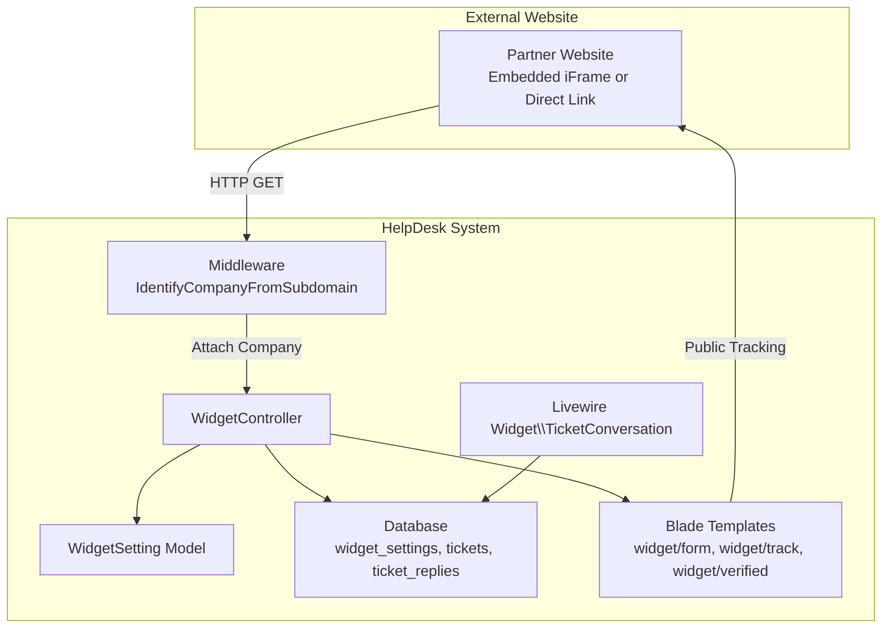
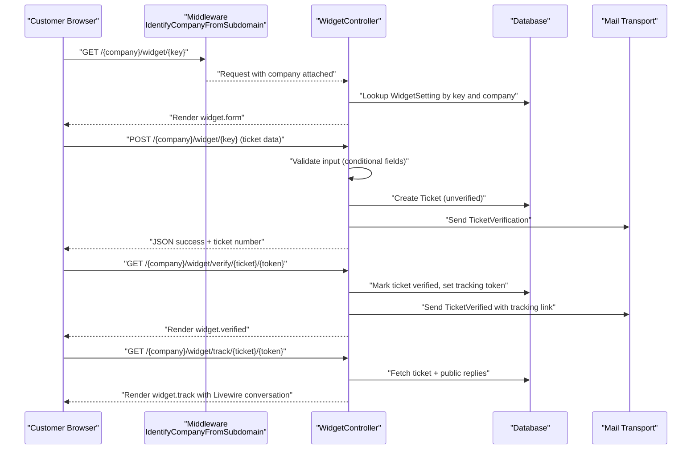
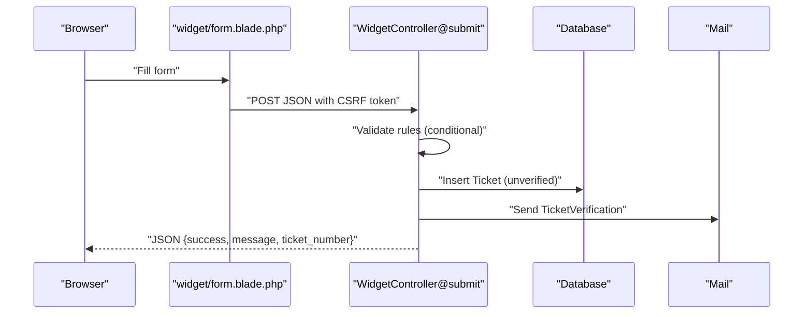
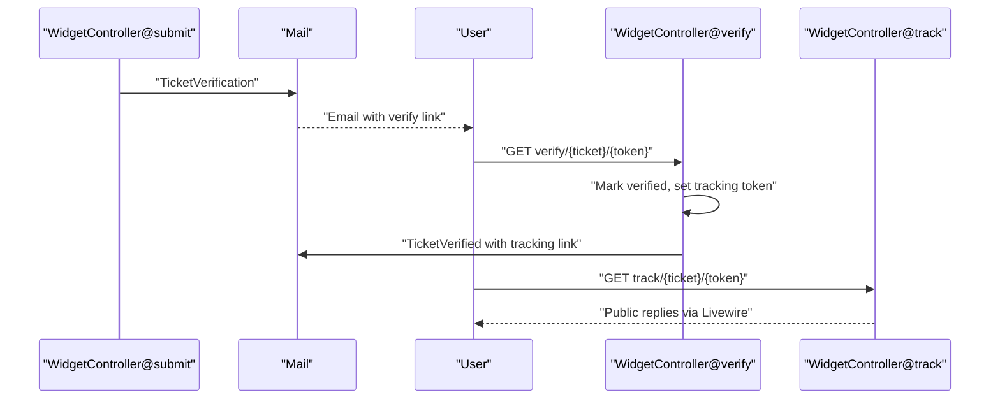
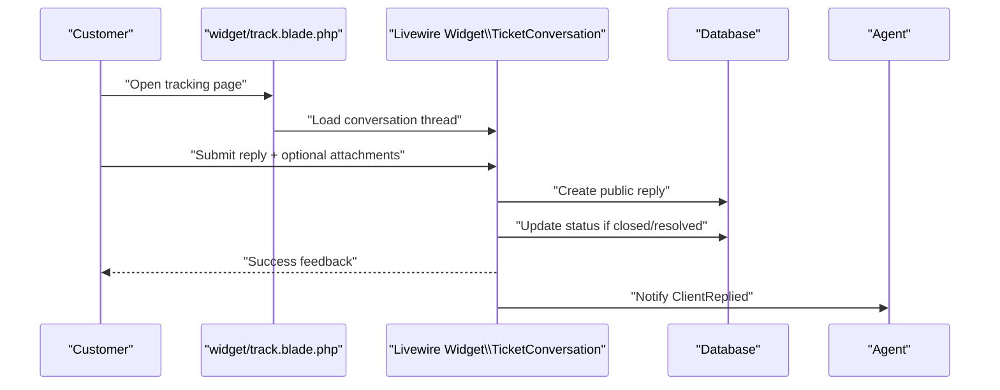
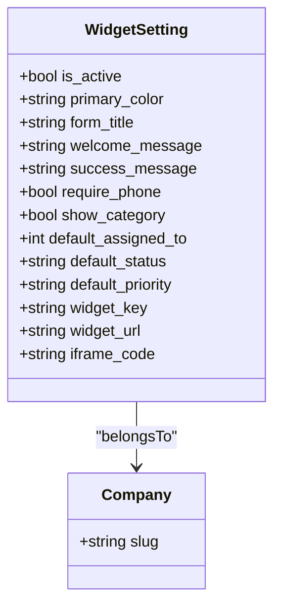
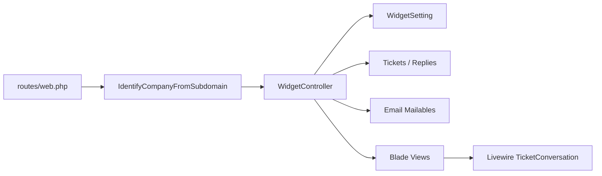

# Widget System

<cite>
**Referenced Files in This Document**
- [WidgetController.php](file://app/Http/Controllers/WidgetController.php)
- [WidgetSetting.php](file://app/Models/WidgetSetting.php)
- [TicketConversation.php](file://app/Livewire/Widget/TicketConversation.php)
- [form.blade.php](file://resources/views/widget/form.blade.php)
- [track.blade.php](file://resources/views/widget/track.blade.php)
- [verified.blade.php](file://resources/views/widget/verified.blade.php)
- [2026_02_06_154114_create_widget_settings_table.php](file://database/migrations/2026_02_06_154114_create_widget_settings_table.php)
- [2026_03_07_022013_create_email_verification_codes_table.php](file://database/migrations/2026_03_07_022013_create_email_verification_codes_table.php)
- [web.php](file://routes/web.php)
- [IdentifyCompanyFromSubdomain.php](file://app/Http/Middleware/IdentifyCompanyFromSubdomain.php)
- [TicketVerification.php](file://app/Mail/TicketVerification.php)
- [TicketVerified.php](file://app/Mail/TicketVerified.php)
- [form-widget.blade.php](file://resources/views/livewire/settings/form-widget.blade.php)
</cite>

## Table of Contents
1. [Introduction](#introduction)
2. [Project Structure](#project-structure)
3. [Core Components](#core-components)
4. [Architecture Overview](#architecture-overview)
5. [Detailed Component Analysis](#detailed-component-analysis)
6. [Dependency Analysis](#dependency-analysis)
7. [Performance Considerations](#performance-considerations)
8. [Security Considerations](#security-considerations)
9. [Integration Examples](#integration-examples)
10. [Troubleshooting Guide](#troubleshooting-guide)
11. [Conclusion](#conclusion)

## Introduction
This document explains the widget system that enables external websites to embed a support form for customers to submit tickets directly. It covers the embedded form, configuration options (theming, custom fields, defaults), the email verification workflow, customer tracking without authentication, the public reply interface, integration approaches for CMS/e-commerce/marketing sites, and security considerations including CSRF protection and rate limiting.

## Project Structure
The widget system spans controllers, models, Livewire components, Blade templates, migrations, and routes. The controller orchestrates the lifecycle: rendering the form, validating and persisting tickets, sending verification emails, verifying tickets via links, and exposing a public tracking page with replies.

**Diagram sources**
- [web.php:71-114](file://routes/web.php#L71-L114)
- [IdentifyCompanyFromSubdomain.php:10-36](file://app/Http/Middleware/IdentifyCompanyFromSubdomain.php#L10-L36)
- [WidgetController.php:19-196](file://app/Http/Controllers/WidgetController.php#L19-L196)
- [WidgetSetting.php:9-71](file://app/Models/WidgetSetting.php#L9-L71)
- [TicketConversation.php:12-99](file://app/Livewire/Widget/TicketConversation.php#L12-L99)
- [form.blade.php:1-250](file://resources/views/widget/form.blade.php#L1-L250)
- [track.blade.php:1-90](file://resources/views/widget/track.blade.php#L1-L90)
- [verified.blade.php:1-85](file://resources/views/widget/verified.blade.php#L1-L85)

**Section sources**
- [web.php:71-114](file://routes/web.php#L71-L114)
- [IdentifyCompanyFromSubdomain.php:10-36](file://app/Http/Middleware/IdentifyCompanyFromSubdomain.php#L10-L36)
- [WidgetController.php:19-196](file://app/Http/Controllers/WidgetController.php#L19-L196)
- [WidgetSetting.php:9-71](file://app/Models/WidgetSetting.php#L9-L71)
- [TicketConversation.php:12-99](file://app/Livewire/Widget/TicketConversation.php#L12-L99)
- [form.blade.php:1-250](file://resources/views/widget/form.blade.php#L1-L250)
- [track.blade.php:1-90](file://resources/views/widget/track.blade.php#L1-L90)
- [verified.blade.php:1-85](file://resources/views/widget/verified.blade.php#L1-L85)

## Core Components
- WidgetController: Renders the form, validates and persists tickets, sends verification emails, handles verification and tracking, and manages customer replies.
- WidgetSetting model: Stores per-company widget configuration (appearance, fields, defaults) and generates the widget URL and iframe embed code.
- TicketConversation Livewire component: Manages customer replies on the tracking page, supports attachments, and notifies agents.
- Blade templates: Provide the form UI, verification confirmation, and public tracking page.
- Middleware: Identifies the company from the subdomain to scope requests.
- Email mailables: Send verification and tracking emails.

**Section sources**
- [WidgetController.php:19-196](file://app/Http/Controllers/WidgetController.php#L19-L196)
- [WidgetSetting.php:9-71](file://app/Models/WidgetSetting.php#L9-L71)
- [TicketConversation.php:12-99](file://app/Livewire/Widget/TicketConversation.php#L12-L99)
- [form.blade.php:1-250](file://resources/views/widget/form.blade.php#L1-L250)
- [track.blade.php:1-90](file://resources/views/widget/track.blade.php#L1-L90)
- [verified.blade.php:1-85](file://resources/views/widget/verified.blade.php#L1-L85)
- [IdentifyCompanyFromSubdomain.php:10-36](file://app/Http/Middleware/IdentifyCompanyFromSubdomain.php#L10-L36)
- [TicketVerification.php:12-34](file://app/Mail/TicketVerification.php#L12-L34)
- [TicketVerified.php:12-35](file://app/Mail/TicketVerified.php#L12-L35)

## Architecture Overview
The widget system uses a subdomain-scoped routing pattern. Requests to subdomain.company-domain arrive at the middleware that identifies the company, then the controller renders the widget form or processes submissions. The controller persists tickets, sends verification emails, and exposes a public tracking page with replies.

**Diagram sources**
- [web.php:71-114](file://routes/web.php#L71-L114)
- [IdentifyCompanyFromSubdomain.php:10-36](file://app/Http/Middleware/IdentifyCompanyFromSubdomain.php#L10-L36)
- [WidgetController.php:24-158](file://app/Http/Controllers/WidgetController.php#L24-L158)
- [TicketVerification.php:12-34](file://app/Mail/TicketVerification.php#L12-L34)
- [TicketVerified.php:12-35](file://app/Mail/TicketVerified.php#L12-L35)

## Detailed Component Analysis

### Embedded Form and Submission
- The form template renders a responsive, theme-aware widget with Tailwind CSS and dark mode support. It posts JSON to the controller with CSRF protection via meta tag and X-CSRF-TOKEN header.
- The controller validates required fields, conditionally requiring phone or category based on widget settings, generates a unique ticket number and verification token, persists the ticket, and emails the verification link.

**Diagram sources**
- [form.blade.php:186-248](file://resources/views/widget/form.blade.php#L186-L248)
- [WidgetController.php:41-109](file://app/Http/Controllers/WidgetController.php#L41-L109)

**Section sources**
- [form.blade.php:1-250](file://resources/views/widget/form.blade.php#L1-L250)
- [WidgetController.php:41-109](file://app/Http/Controllers/WidgetController.php#L41-L109)

### Email Verification Workflow
- After submission, a verification email is sent containing a link with a token. Clicking the link verifies the ticket and sets a separate tracking token for public access. A second email is sent with the tracking link.

**Diagram sources**
- [WidgetController.php:85-136](file://app/Http/Controllers/WidgetController.php#L85-L136)
- [TicketVerification.php:12-34](file://app/Mail/TicketVerification.php#L12-L34)
- [TicketVerified.php:12-35](file://app/Mail/TicketVerified.php#L12-L35)

**Section sources**
- [WidgetController.php:85-136](file://app/Http/Controllers/WidgetController.php#L85-L136)
- [TicketVerification.php:12-34](file://app/Mail/TicketVerification.php#L12-L34)
- [TicketVerified.php:12-35](file://app/Mail/TicketVerified.php#L12-L35)

### Public Reply Interface and Tracking
- The tracking page lists ticket metadata and public replies in chronological order. The Livewire component handles customer replies, attaches files (up to 2, max 2MB each), updates status if needed, and notifies agents.

**Diagram sources**
- [track.blade.php:78-79](file://resources/views/widget/track.blade.php#L78-L79)
- [TicketConversation.php:30-82](file://app/Livewire/Widget/TicketConversation.php#L30-L82)
- [WidgetController.php:163-195](file://app/Http/Controllers/WidgetController.php#L163-L195)

**Section sources**
- [track.blade.php:1-90](file://resources/views/widget/track.blade.php#L1-L90)
- [TicketConversation.php:12-99](file://app/Livewire/Widget/TicketConversation.php#L12-L99)
- [WidgetController.php:163-195](file://app/Http/Controllers/WidgetController.php#L163-L195)

### Widget Configuration Options
- Appearance: theme mode (light/dark), form title, welcome message, success message.
- Form fields: require phone, show category selector.
- Defaults: default assignee, default status, default priority.
- Integration: direct link and iframe embed code generation.

**Diagram sources**
- [WidgetSetting.php:9-71](file://app/Models/WidgetSetting.php#L9-L71)
- [2026_02_06_154114_create_widget_settings_table.php:11-38](file://database/migrations/2026_02_06_154114_create_widget_settings_table.php#L11-L38)
- [form-widget.blade.php:171-231](file://resources/views/livewire/settings/form-widget.blade.php#L171-L231)

**Section sources**
- [WidgetSetting.php:9-71](file://app/Models/WidgetSetting.php#L9-L71)
- [2026_02_06_154114_create_widget_settings_table.php:11-38](file://database/migrations/2026_02_06_154114_create_widget_settings_table.php#L11-L38)
- [form-widget.blade.php:1-256](file://resources/views/livewire/settings/form-widget.blade.php#L1-L256)

## Dependency Analysis
- Routing: Subdomain-based routes scoped under the company domain.
- Middleware: Company identification attaches the company to the request for downstream controllers.
- Models: WidgetSetting encapsulates configuration and URL generation; Tickets and Replies persist conversations.
- Emails: Mailables encapsulate verification and tracking messages.
- Frontend: Blade templates and Livewire components coordinate user interactions.

**Diagram sources**
- [web.php:71-114](file://routes/web.php#L71-L114)
- [IdentifyCompanyFromSubdomain.php:10-36](file://app/Http/Middleware/IdentifyCompanyFromSubdomain.php#L10-L36)
- [WidgetController.php:19-196](file://app/Http/Controllers/WidgetController.php#L19-L196)
- [WidgetSetting.php:9-71](file://app/Models/WidgetSetting.php#L9-L71)
- [TicketConversation.php:12-99](file://app/Livewire/Widget/TicketConversation.php#L12-L99)

**Section sources**
- [web.php:71-114](file://routes/web.php#L71-L114)
- [IdentifyCompanyFromSubdomain.php:10-36](file://app/Http/Middleware/IdentifyCompanyFromSubdomain.php#L10-L36)
- [WidgetController.php:19-196](file://app/Http/Controllers/WidgetController.php#L19-L196)
- [WidgetSetting.php:9-71](file://app/Models/WidgetSetting.php#L9-L71)
- [TicketConversation.php:12-99](file://app/Livewire/Widget/TicketConversation.php#L12-L99)

## Performance Considerations
- Database indexing: The widget settings table includes indexes on company_id, widget_key, and is_active to optimize lookups.
- Query efficiency: The tracking page fetches only public replies and minimal ticket metadata.
- Attachment handling: Livewire enforces per-file size limits and a cap on the number of attachments to control payload sizes.
- Rendering: Tailwind CSS is included via CDN for simplicity; consider bundling and minification in production for performance.

[No sources needed since this section provides general guidance]

## Security Considerations
- CSRF protection: The form template includes a CSRF meta tag and sends the token in the X-CSRF-TOKEN header during submission.
- Token-based access: Verification and tracking rely on unique tokens bound to specific tickets and companies.
- Rate limiting: Not implemented in the current codebase. Recommended mitigations include IP-based quotas, CAPTCHA, or service-side rate limiting for the submit endpoint.
- Input validation: Strict validation rules guard against malformed submissions.
- Email verification: Prevents anonymous spam by requiring email confirmation before allowing public tracking and replies.
- Domain/subdomain scoping: Middleware ties requests to a specific company, preventing cross-company access.

**Section sources**
- [form.blade.php:6](file://resources/views/widget/form.blade.php#L6)
- [WidgetController.php:213-221](file://app/Http/Controllers/WidgetController.php#L213-L221)
- [WidgetController.php:114-136](file://app/Http/Controllers/WidgetController.php#L114-L136)
- [WidgetController.php:141-158](file://app/Http/Controllers/WidgetController.php#L141-L158)

## Integration Examples
- Direct link embedding: Share the generated widget URL with customers or place a link on your site.
- iFrame embedding: Paste the provided iframe embed code into your website’s HTML to render the form inline.
- CMS platforms: Insert the iframe in a page builder block or embed the direct link in a content area.
- E-commerce sites: Place the form near checkout or product pages for post-purchase support.
- Marketing landing pages: Add the form as a conversion element to capture support needs alongside lead gen.

**Section sources**
- [WidgetSetting.php:55-69](file://app/Models/WidgetSetting.php#L55-L69)
- [form-widget.blade.php:171-231](file://resources/views/livewire/settings/form-widget.blade.php#L171-L231)

## Troubleshooting Guide
- Widget not loading:
  - Confirm the widget is active and the key is correct.
  - Verify the subdomain resolves to the company slug and middleware attaches the company.
- Submission fails:
  - Check browser console for network errors and ensure the CSRF token is present.
  - Review validation errors returned by the server.
- Verification email not received:
  - Confirm the customer email address is correct.
  - Check email delivery logs and retry sending the verification email.
- Tracking link inaccessible:
  - Ensure the tracking token matches the ticket and company.
  - Verify the ticket is marked as verified.
- Replies not appearing:
  - Confirm the ticket is open/pending and not closed.
  - Check that replies are marked as public and ordered chronologically.

**Section sources**
- [WidgetController.php:24-36](file://app/Http/Controllers/WidgetController.php#L24-L36)
- [WidgetController.php:41-109](file://app/Http/Controllers/WidgetController.php#L41-L109)
- [WidgetController.php:114-136](file://app/Http/Controllers/WidgetController.php#L114-L136)
- [WidgetController.php:141-158](file://app/Http/Controllers/WidgetController.php#L141-L158)
- [TicketConversation.php:30-82](file://app/Livewire/Widget/TicketConversation.php#L30-L82)

## Conclusion
The widget system provides a secure, configurable way for partners to embed a support form on their websites. It enforces email verification, offers robust configuration (appearance, fields, defaults), and exposes a public tracking interface with replies. For production deployments, consider adding rate limiting and monitoring to further reduce abuse.