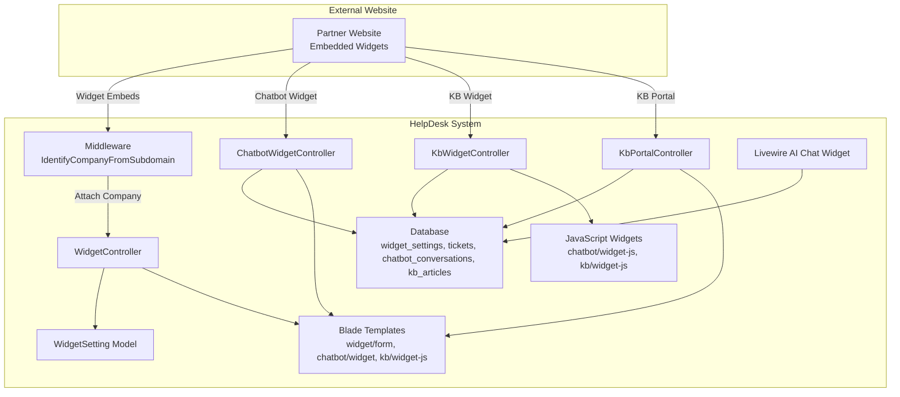
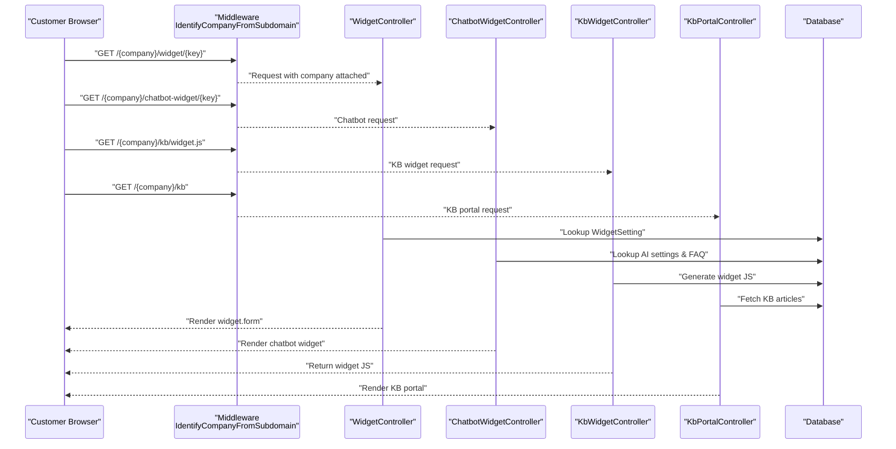
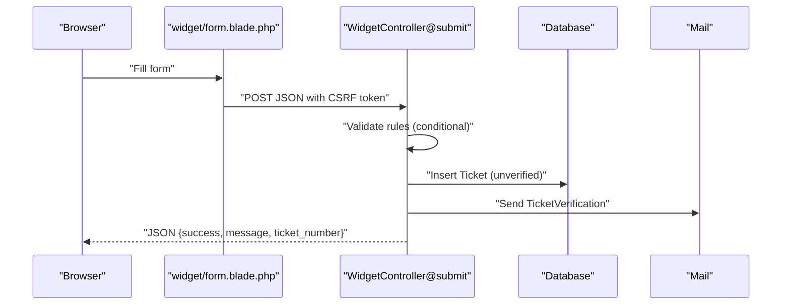
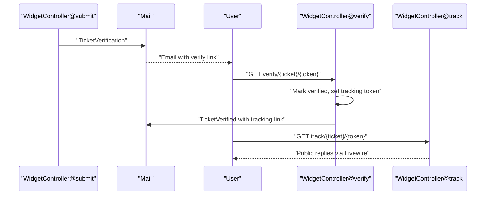
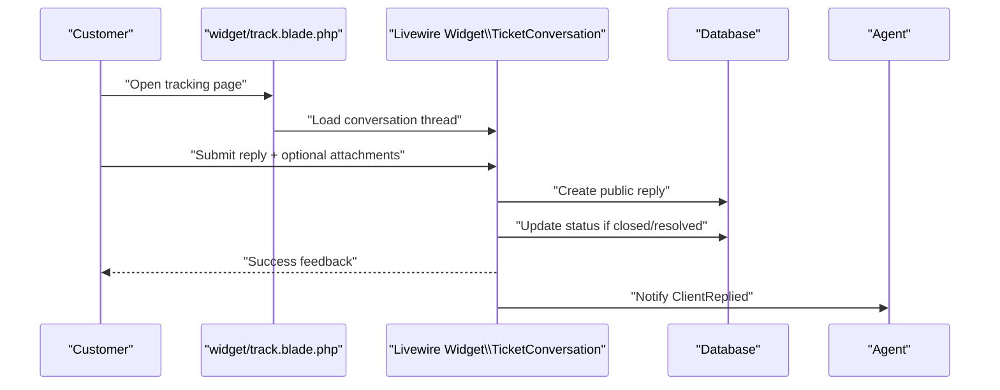
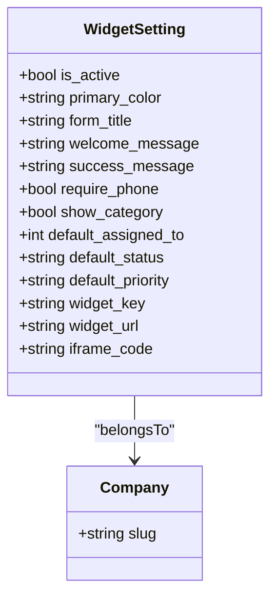
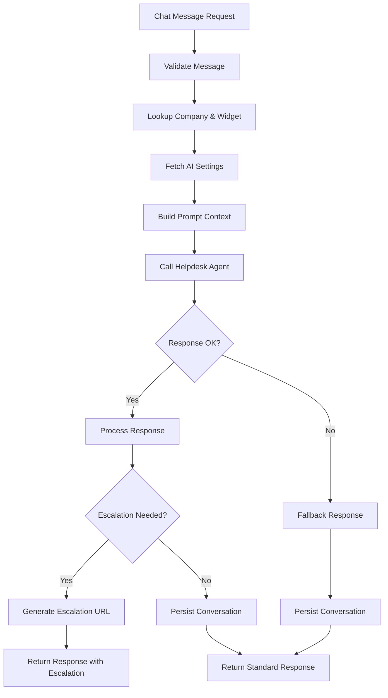
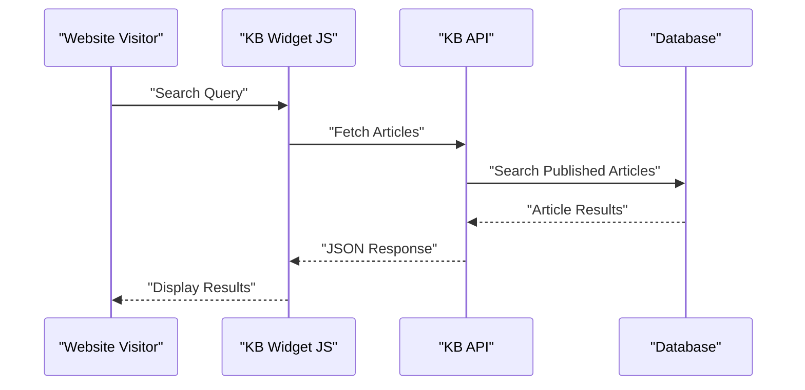
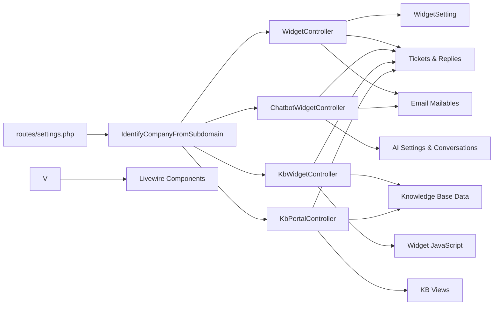

# Widget System

<cite>
**Referenced Files in This Document**
- [WidgetController.php](file://app/Http/Controllers/WidgetController.php)
- [ChatbotWidgetController.php](file://app/Http/Controllers/ChatbotWidgetController.php)
- [KbWidgetController.php](file://app/Http/Controllers/KbWidgetController.php)
- [KbPortalController.php](file://app/Http/Controllers/KbPortalController.php)
- [WidgetSetting.php](file://app/Models/WidgetSetting.php)
- [TicketConversation.php](file://app/Livewire/Widget/TicketConversation.php)
- [ai-chat-widget.blade.php](file://resources/views/livewire/ai-chat-widget.blade.php)
- [chatbot/widget.blade.php](file://resources/views/chatbot/widget.blade.php)
- [chatbot/widget-js.blade.php](file://resources/views/chatbot/widget-js.blade.php)
- [kb/widget-js.blade.php](file://resources/views/kb/widget-js.blade.php)
- [kb/widget-demo.blade.php](file://resources/views/kb/widget-demo.blade.php)
- [kb/widget.blade.php](file://resources/views/kb/widget.blade.php)
- [kb/home.blade.php](file://resources/views/kb/home.blade.php)
- [kb/search.blade.php](file://resources/views/kb/search.blade.php)
- [settings.php](file://routes/settings.php)
- [form.blade.php](file://resources/views/widget/form.blade.php)
- [track.blade.php](file://resources/views/widget/track.blade.php)
- [verified.blade.php](file://resources/views/widget/verified.blade.php)
- [2026_02_06_154114_create_widget_settings_table.php](file://database/migrations/2026_02_06_154114_create_widget_settings_table.php)
- [2026_03_07_022013_create_email_verification_codes_table.php](file://database/migrations/2026_03_07_022013_create_email_verification_codes_table.php)
- [web.php](file://routes/web.php)
- [IdentifyCompanyFromSubdomain.php](file://app/Http/Middleware/IdentifyCompanyFromSubdomain.php)
- [TicketVerification.php](file://app/Mail/TicketVerification.php)
- [TicketVerified.php](file://app/Mail/TicketVerified.php)
- [form-widget.blade.php](file://resources/views/livewire/settings/form-widget.blade.php)
</cite>

## Update Summary
**Changes Made**
- Added comprehensive chatbot widget system with AI-powered conversational support
- Integrated knowledge base widget with floating search interface and JavaScript integration
- Enhanced portal integration with dedicated KB portal and improved API endpoints
- Added widget JavaScript integration for seamless embedding across websites
- Expanded widget API endpoints for enhanced functionality and rate limiting

## Table of Contents
1. [Introduction](#introduction)
2. [Project Structure](#project-structure)
3. [Core Components](#core-components)
4. [Architecture Overview](#architecture-overview)
5. [Detailed Component Analysis](#detailed-component-analysis)
6. [Enhanced Widget Systems](#enhanced-widget-systems)
7. [Dependency Analysis](#dependency-analysis)
8. [Performance Considerations](#performance-considerations)
9. [Security Considerations](#security-considerations)
10. [Integration Examples](#integration-examples)
11. [Troubleshooting Guide](#troubleshooting-guide)
12. [Conclusion](#conclusion)

## Introduction
This document explains the enhanced widget system that enables external websites to embed multiple support solutions including ticket forms, AI chatbots, and knowledge base search interfaces. The system now supports embedded forms, AI-powered chatbot widgets, knowledge base widgets, comprehensive API endpoints, and improved portal integration. It covers theming, custom fields, brand customization, email verification workflow, customer tracking, public reply interface, and security considerations including CSRF protection and rate limiting.

## Project Structure
The enhanced widget system spans controllers, models, Livewire components, Blade templates, JavaScript widgets, migrations, and routes. The system now includes specialized controllers for chatbot and knowledge base widgets alongside the existing ticket widget controller.

**Diagram sources**
- [settings.php:73-93](file://routes/settings.php#L73-L93)
- [WidgetController.php:19-196](file://app/Http/Controllers/WidgetController.php#L19-L196)
- [ChatbotWidgetController.php:16-337](file://app/Http/Controllers/ChatbotWidgetController.php#L16-L337)
- [KbWidgetController.php:9-31](file://app/Http/Controllers/KbWidgetController.php#L9-L31)
- [KbPortalController.php:10-132](file://app/Http/Controllers/KbPortalController.php#L10-L132)
- [WidgetSetting.php:9-71](file://app/Models/WidgetSetting.php#L9-L71)
- [TicketConversation.php:12-99](file://app/Livewire/Widget/TicketConversation.php#L12-L99)
- [chatbot/widget.blade.php:1-512](file://resources/views/chatbot/widget.blade.php#L1-L512)
- [kb/widget-js.blade.php:1-313](file://resources/views/kb/widget-js.blade.php#L1-L313)

**Section sources**
- [settings.php:73-93](file://routes/settings.php#L73-L93)
- [WidgetController.php:19-196](file://app/Http/Controllers/WidgetController.php#L19-L196)
- [ChatbotWidgetController.php:16-337](file://app/Http/Controllers/ChatbotWidgetController.php#L16-L337)
- [KbWidgetController.php:9-31](file://app/Http/Controllers/KbWidgetController.php#L9-L31)
- [KbPortalController.php:10-132](file://app/Http/Controllers/KbPortalController.php#L10-L132)
- [WidgetSetting.php:9-71](file://app/Models/WidgetSetting.php#L9-L71)
- [TicketConversation.php:12-99](file://app/Livewire/Widget/TicketConversation.php#L12-L99)
- [chatbot/widget.blade.php:1-512](file://resources/views/chatbot/widget.blade.php#L1-L512)
- [kb/widget-js.blade.php:1-313](file://resources/views/kb/widget-js.blade.php#L1-L313)

## Core Components
- **WidgetController**: Renders the form, validates and persists tickets, sends verification emails, handles verification and tracking, and manages customer replies.
- **ChatbotWidgetController**: Manages AI-powered chatbot widgets with session management, escalation handling, and conversation persistence.
- **KbWidgetController**: Provides knowledge base widget JavaScript integration for floating search interfaces.
- **KbPortalController**: Handles knowledge base portal functionality including search, categories, and article management.
- **WidgetSetting model**: Stores per-company widget configuration (appearance, fields, defaults) and generates widget URLs and embed codes.
- **AI Chat Widget Livewire**: Advanced chat interface with animations, quick replies, and conversation management.
- **Chatbot Blade Template**: Standalone chatbot widget with modern UI and session handling.
- **Knowledge Base JavaScript Widget**: Floating search interface for instant KB article discovery.
- **Middleware**: Identifies the company from the subdomain to scope requests.
- **Email mailables**: Send verification and tracking emails.

**Section sources**
- [WidgetController.php:19-196](file://app/Http/Controllers/WidgetController.php#L19-L196)
- [ChatbotWidgetController.php:16-337](file://app/Http/Controllers/ChatbotWidgetController.php#L16-L337)
- [KbWidgetController.php:9-31](file://app/Http/Controllers/KbWidgetController.php#L9-L31)
- [KbPortalController.php:10-132](file://app/Http/Controllers/KbPortalController.php#L10-L132)
- [WidgetSetting.php:9-71](file://app/Models/WidgetSetting.php#L9-L71)
- [TicketConversation.php:12-99](file://app/Livewire/Widget/TicketConversation.php#L12-L99)
- [ai-chat-widget.blade.php:1-480](file://resources/views/livewire/ai-chat-widget.blade.php#L1-L480)
- [chatbot/widget.blade.php:1-512](file://resources/views/chatbot/widget.blade.php#L1-L512)
- [kb/widget-js.blade.php:1-313](file://resources/views/kb/widget-js.blade.php#L1-L313)

## Architecture Overview
The enhanced widget system uses a multi-layered approach supporting various widget types. Subdomain-scoped routing handles ticket widgets, while dedicated routes manage chatbot and knowledge base widgets. Each widget type serves distinct purposes while sharing common infrastructure for company scoping and authentication.

**Diagram sources**
- [settings.php:73-93](file://routes/settings.php#L73-L93)
- [WidgetController.php:24-158](file://app/Http/Controllers/WidgetController.php#L24-L158)
- [ChatbotWidgetController.php:53-75](file://app/Http/Controllers/ChatbotWidgetController.php#L53-L75)
- [KbWidgetController.php:11-29](file://app/Http/Controllers/KbWidgetController.php#L11-L29)
- [KbPortalController.php:17-40](file://app/Http/Controllers/KbPortalController.php#L17-L40)

## Detailed Component Analysis

### Embedded Form and Submission
The form template renders a responsive, theme-aware widget with Tailwind CSS and dark mode support. It posts JSON to the controller with CSRF protection via meta tag and X-CSRF-TOKEN header. The controller validates required fields, conditionally requiring phone or category based on widget settings, generates a unique ticket number and verification token, persists the ticket, and emails the verification link.

**Diagram sources**
- [form.blade.php:186-248](file://resources/views/widget/form.blade.php#L186-L248)
- [WidgetController.php:41-109](file://app/Http/Controllers/WidgetController.php#L41-L109)

**Section sources**
- [form.blade.php:1-250](file://resources/views/widget/form.blade.php#L1-L250)
- [WidgetController.php:41-109](file://app/Http/Controllers/WidgetController.php#L41-L109)

### Email Verification Workflow
After submission, a verification email is sent containing a link with a token. Clicking the link verifies the ticket and sets a separate tracking token for public access. A second email is sent with the tracking link.

**Diagram sources**
- [WidgetController.php:85-136](file://app/Http/Controllers/WidgetController.php#L85-L136)
- [TicketVerification.php:12-34](file://app/Mail/TicketVerification.php#L12-L34)
- [TicketVerified.php:12-35](file://app/Mail/TicketVerified.php#L12-L35)

**Section sources**
- [WidgetController.php:85-136](file://app/Http/Controllers/WidgetController.php#L85-L136)
- [TicketVerification.php:12-34](file://app/Mail/TicketVerification.php#L12-L34)
- [TicketVerified.php:12-35](file://app/Mail/TicketVerified.php#L12-L35)

### Public Reply Interface and Tracking
The tracking page lists ticket metadata and public replies in chronological order. The Livewire component handles customer replies, attaches files (up to 2, max 2MB each), updates status if needed, and notifies agents.

**Diagram sources**
- [track.blade.php:78-79](file://resources/views/widget/track.blade.php#L78-L79)
- [TicketConversation.php:30-82](file://app/Livewire/Widget/TicketConversation.php#L30-L82)
- [WidgetController.php:163-195](file://app/Http/Controllers/WidgetController.php#L163-L195)

**Section sources**
- [track.blade.php:1-90](file://resources/views/widget/track.blade.php#L1-L90)
- [TicketConversation.php:12-99](file://app/Livewire/Widget/TicketConversation.php#L12-L99)
- [WidgetController.php:163-195](file://app/Http/Controllers/WidgetController.php#L163-L195)

### Widget Configuration Options
- **Appearance**: theme mode (light/dark), form title, welcome message, success message.
- **Form fields**: require phone, show category selector.
- **Defaults**: default assignee, default status, default priority.
- **Integration**: direct link and iframe embed code generation.

**Diagram sources**
- [WidgetSetting.php:9-71](file://app/Models/WidgetSetting.php#L9-L71)
- [2026_02_06_154114_create_widget_settings_table.php:11-38](file://database/migrations/2026_02_06_154114_create_widget_settings_table.php#L11-L38)
- [form-widget.blade.php:171-231](file://resources/views/livewire/settings/form-widget.blade.php#L171-L231)

**Section sources**
- [WidgetSetting.php:9-71](file://app/Models/WidgetSetting.php#L9-L71)
- [2026_02_06_154114_create_widget_settings_table.php:11-38](file://database/migrations/2026_02_06_154114_create_widget_settings_table.php#L11-L38)
- [form-widget.blade.php:1-256](file://resources/views/livewire/settings/form-widget.blade.php#L1-L256)

## Enhanced Widget Systems

### AI Chatbot Widget System
The chatbot widget system provides intelligent conversational support with advanced features including session management, escalation handling, and AI-powered responses.

#### Chatbot Controller Functionality
The ChatbotWidgetController manages the complete chatbot lifecycle including message processing, session persistence, and escalation to ticket forms.

**Diagram sources**
- [ChatbotWidgetController.php:77-223](file://app/Http/Controllers/ChatbotWidgetController.php#L77-L223)

#### Chatbot JavaScript Integration
The chatbot widget provides a floating interface with modern UI elements, smooth animations, and comprehensive session handling.

**Section sources**
- [ChatbotWidgetController.php:16-337](file://app/Http/Controllers/ChatbotWidgetController.php#L16-L337)
- [chatbot/widget.blade.php:1-512](file://resources/views/chatbot/widget.blade.php#L1-L512)
- [chatbot/widget-js.blade.php:1-39](file://resources/views/chatbot/widget-js.blade.php#L1-L39)
- [ai-chat-widget.blade.php:1-480](file://resources/views/livewire/ai-chat-widget.blade.php#L1-L480)

### Knowledge Base Widget System
The knowledge base widget system provides instant search capabilities with floating interface and JavaScript integration.

#### Knowledge Base Controller
The KbWidgetController generates optimized JavaScript for embedding knowledge base search functionality across websites.

#### Knowledge Base Portal
The KbPortalController manages the complete knowledge base portal including search, categorization, and article management.

**Diagram sources**
- [KbWidgetController.php:11-29](file://app/Http/Controllers/KbWidgetController.php#L11-L29)
- [KbPortalController.php:77-92](file://app/Http/Controllers/KbPortalController.php#L77-L92)

**Section sources**
- [KbWidgetController.php:9-31](file://app/Http/Controllers/KbWidgetController.php#L9-L31)
- [KbPortalController.php:10-132](file://app/Http/Controllers/KbPortalController.php#L10-L132)
- [kb/widget-js.blade.php:1-313](file://resources/views/kb/widget-js.blade.php#L1-L313)
- [kb/widget-demo.blade.php:1-62](file://resources/views/kb/widget-demo.blade.php#L1-L62)
- [kb/home.blade.php:1-31](file://resources/views/kb/home.blade.php#L1-L31)
- [kb/search.blade.php:1-99](file://resources/views/kb/search.blade.php#L1-L99)

## Dependency Analysis
The enhanced widget system maintains clean separation of concerns with specialized controllers for each widget type while sharing common infrastructure.

**Diagram sources**
- [settings.php:73-93](file://routes/settings.php#L73-L93)
- [WidgetController.php:19-196](file://app/Http/Controllers/WidgetController.php#L19-L196)
- [ChatbotWidgetController.php:16-337](file://app/Http/Controllers/ChatbotWidgetController.php#L16-L337)
- [KbWidgetController.php:9-31](file://app/Http/Controllers/KbWidgetController.php#L9-L31)
- [KbPortalController.php:10-132](file://app/Http/Controllers/KbPortalController.php#L10-L132)

**Section sources**
- [settings.php:73-93](file://routes/settings.php#L73-L93)
- [WidgetController.php:19-196](file://app/Http/Controllers/WidgetController.php#L19-L196)
- [ChatbotWidgetController.php:16-337](file://app/Http/Controllers/ChatbotWidgetController.php#L16-L337)
- [KbWidgetController.php:9-31](file://app/Http/Controllers/KbWidgetController.php#L9-L31)
- [KbPortalController.php:10-132](file://app/Http/Controllers/KbPortalController.php#L10-L132)

## Performance Considerations
- **Database indexing**: The widget settings table includes indexes on company_id, widget_key, and is_active to optimize lookups.
- **Query efficiency**: The tracking page fetches only public replies and minimal ticket metadata.
- **Attachment handling**: Livewire enforces per-file size limits and a cap on the number of attachments to control payload sizes.
- **Widget caching**: Chatbot and KB widget JavaScript includes appropriate cache headers for optimal performance.
- **Rate limiting**: Chatbot endpoints implement throttle middleware (30 requests per minute) to prevent abuse.
- **Rendering**: Tailwind CSS is included via CDN for simplicity; consider bundling and minification in production for performance.

**Section sources**
- [ChatbotWidgetController.php:90-92](file://app/Http/Controllers/ChatbotWidgetController.php#L90-L92)
- [kb/widget-js.blade.php:21-28](file://resources/views/kb/widget-js.blade.php#L21-L28)
- [chatbot/widget-js.blade.php:43-50](file://resources/views/chatbot/widget-js.blade.php#L43-L50)

## Security Considerations
- **CSRF protection**: The form template includes a CSRF meta tag and sends the token in the X-CSRF-TOKEN header during submission.
- **Token-based access**: Verification and tracking rely on unique tokens bound to specific tickets and companies.
- **Rate limiting**: Chatbot endpoints implement throttle middleware (30 requests per minute) to prevent abuse.
- **Input validation**: Strict validation rules guard against malformed submissions.
- **Email verification**: Prevents anonymous spam by requiring email confirmation before allowing public tracking and replies.
- **Domain/subdomain scoping**: Middleware ties requests to a specific company, preventing cross-company access.
- **Session management**: Chatbot widgets maintain session state with proper session IDs and conversation persistence.
- **Content security**: Knowledge base widget implements proper escaping and sanitization for dynamic content.

**Section sources**
- [form.blade.php:6](file://resources/views/widget/form.blade.php#L6)
- [WidgetController.php:213-221](file://app/Http/Controllers/WidgetController.php#L213-L221)
- [WidgetController.php:114-136](file://app/Http/Controllers/WidgetController.php#L114-L136)
- [WidgetController.php:141-158](file://app/Http/Controllers/WidgetController.php#L141-L158)
- [ChatbotWidgetController.php:90-92](file://app/Http/Controllers/ChatbotWidgetController.php#L90-L92)

## Integration Examples

### Traditional Widget Integration
- **Direct link embedding**: Share the generated widget URL with customers or place a link on your site.
- **iFrame embedding**: Paste the provided iframe embed code into your website's HTML to render the form inline.
- **CMS platforms**: Insert the iframe in a page builder block or embed the direct link in a content area.
- **E-commerce sites**: Place the form near checkout or product pages for post-purchase support.
- **Marketing landing pages**: Add the form as a conversion element to capture support needs alongside lead gen.

### Enhanced Widget Integration
- **Chatbot Widget**: Embed the chatbot widget using the provided JavaScript snippet. The widget appears as a floating button in the bottom-right corner.
- **Knowledge Base Widget**: Integrate the knowledge base search widget for instant article discovery. Configure link modes and custom article bases.
- **AI Chat Widget**: Use the advanced Livewire-based chat interface with animations and quick replies.
- **API Integration**: Utilize the comprehensive API endpoints for programmatic widget management and data retrieval.

**Section sources**
- [WidgetSetting.php:55-69](file://app/Models/WidgetSetting.php#L55-L69)
- [form-widget.blade.php:171-231](file://resources/views/livewire/settings/form-widget.blade.php#L171-L231)
- [chatbot/widget-js.blade.php:1-39](file://resources/views/chatbot/widget-js.blade.php#L1-L39)
- [kb/widget-js.blade.php:1-313](file://resources/views/kb/widget-js.blade.php#L1-L313)
- [ai-chat-widget.blade.php:1-480](file://resources/views/livewire/ai-chat-widget.blade.php#L1-L480)

## Troubleshooting Guide

### Basic Widget Issues
- **Widget not loading**: Confirm the widget is active and the key is correct. Verify the subdomain resolves to the company slug and middleware attaches the company.
- **Submission fails**: Check browser console for network errors and ensure the CSRF token is present. Review validation errors returned by the server.
- **Verification email not received**: Confirm the customer email address is correct. Check email delivery logs and retry sending the verification email.
- **Tracking link inaccessible**: Ensure the tracking token matches the ticket and company. Verify the ticket is marked as verified.
- **Replies not appearing**: Confirm the ticket is open/pending and not closed. Check that replies are marked as public and ordered chronologically.

### Chatbot Widget Issues
- **Chatbot not responding**: Verify AI chatbot is enabled in company settings. Check that AI settings are properly configured.
- **Session issues**: Ensure proper session handling. Check that X-Chatbot-Session header is being sent correctly.
- **Escalation problems**: Verify escalation URL configuration in AI settings. Check that fallback thresholds are properly set.
- **Rate limiting**: Chatbot endpoints are throttled at 30 requests per minute. Wait for the throttle to reset if exceeded.

### Knowledge Base Widget Issues
- **Widget not appearing**: Verify the KB widget JavaScript is loading correctly. Check browser console for JavaScript errors.
- **Search not working**: Ensure knowledge base articles are published. Verify API endpoints are accessible.
- **Link configuration**: Check default link mode settings. Verify custom article base URLs are properly formatted.
- **Styling issues**: Verify CSS styles are loading. Check for conflicts with existing page styles.

**Section sources**
- [WidgetController.php:24-36](file://app/Http/Controllers/WidgetController.php#L24-L36)
- [WidgetController.php:41-109](file://app/Http/Controllers/WidgetController.php#L41-L109)
- [WidgetController.php:114-136](file://app/Http/Controllers/WidgetController.php#L114-L136)
- [WidgetController.php:141-158](file://app/Http/Controllers/WidgetController.php#L141-L158)
- [TicketConversation.php:30-82](file://app/Livewire/Widget/TicketConversation.php#L30-L82)
- [ChatbotWidgetController.php:90-92](file://app/Http/Controllers/ChatbotWidgetController.php#L90-L92)

## Conclusion
The enhanced widget system provides a comprehensive solution for external website integration with multiple widget types. It supports traditional ticket forms, AI-powered chatbot widgets with intelligent escalation, and knowledge base search interfaces with floating widgets. The system enforces email verification, offers robust configuration options, and exposes public tracking interfaces. For production deployments, consider implementing rate limiting for chatbot endpoints, optimizing widget caching, and monitoring widget performance across different integration scenarios.